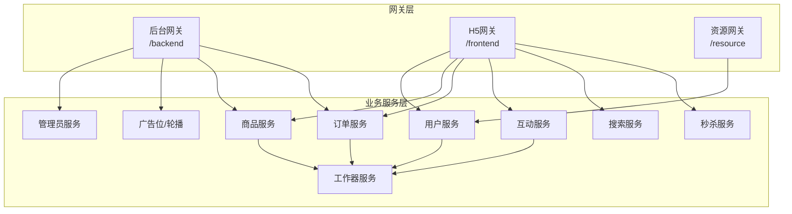
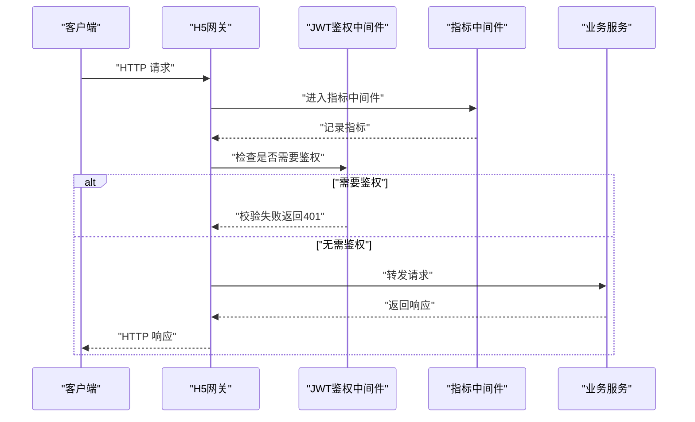
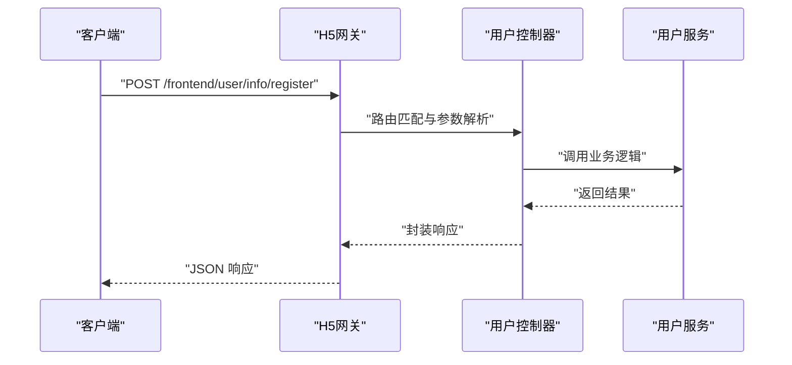
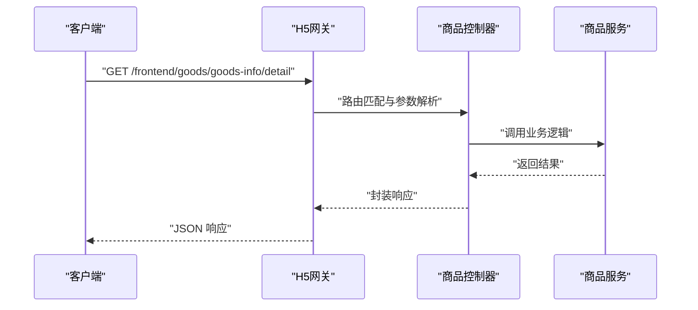
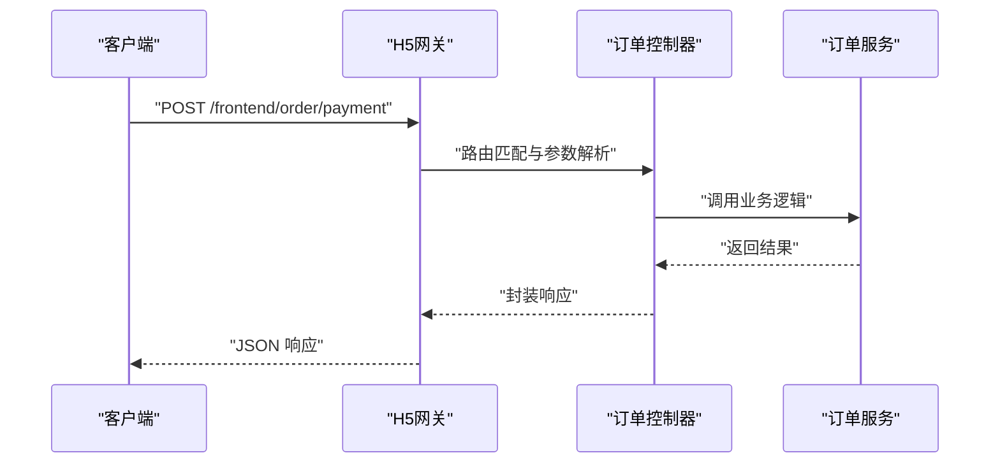
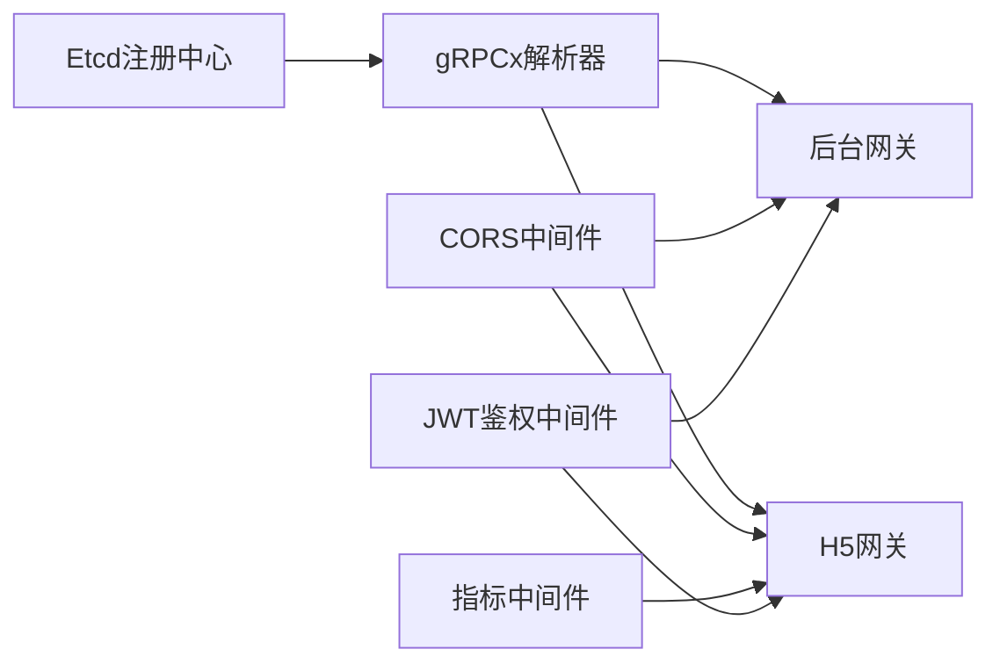

# API接口文档

<cite>
**本文档引用的文件**
- [app/gateway-admin/main.go](file://app/gateway-admin/main.go)
- [app/gateway-h5/main.go](file://app/gateway-h5/main.go)
- [app/gateway-admin/internal/cmd/cmd.go](file://app/gateway-admin/internal/cmd/cmd.go)
- [app/gateway-h5/internal/cmd/cmd.go](file://app/gateway-h5/internal/cmd/cmd.go)
- [app/gateway-admin/api/admin/admin.go](file://app/gateway-admin/api/admin/admin.go)
- [app/gateway-h5/api/user/user.go](file://app/gateway-h5/api/user/user.go)
- [app/gateway-h5/api/goods/goods.go](file://app/gateway-h5/api/goods/goods.go)
- [app/gateway-h5/api/order/order.go](file://app/gateway-h5/api/order/order.go)
- [app/gateway-h5/api/interaction/interaction.go](file://app/gateway-h5/api/interaction/interaction.go)
- [app/gateway-resource/internal/cmd/cmd.go](file://app/gateway-resource/internal/cmd/cmd.go)
- [utility/middleware/jwt.go](file://utility/middleware/jwt.go)
- [utility/middleware/middleware.go](file://utility/middleware/middleware.go)
- [utility/metrics/metrics.go](file://utility/metrics/metrics.go)
- [utility/metrics/middleware.go](file://utility/metrics/middleware.go)
</cite>

## 目录
1. [简介](#简介)
2. [项目结构](#项目结构)
3. [核心组件](#核心组件)
4. [架构总览](#架构总览)
5. [详细组件分析](#详细组件分析)
6. [依赖关系分析](#依赖关系分析)
7. [性能考虑](#性能考虑)
8. [故障排除指南](#故障排除指南)
9. [结论](#结论)
10. [附录](#附录)

## 简介
本项目采用微服务架构，通过多个独立的服务网关对外提供API能力。本文档面向开发者与测试人员，系统性梳理各模块的HTTP接口定义、认证机制、请求头设置、参数校验规则、响应格式、错误码说明以及接口版本管理策略，并提供Postman集合与curl示例指引。

## 项目结构
- 网关层
  - 后台网关：负责后台管理相关接口，包含鉴权中间件与CORS支持
  - H5网关：负责前端业务接口，包含鉴权中间件、CORS、Prometheus指标采集与错误统计
  - 资源网关：负责文件上传与图片资源访问
- 业务服务层
  - 用户服务：用户注册登录、收货地址管理、微信小程序登录等
  - 商品服务：商品信息、分类、购物车、优惠券、砍价等
  - 订单服务：订单创建、支付、查询、退款等
  - 互动服务：收藏、评论、点赞等
  - 广告位与轮播：广告位与轮播图管理
  - 管理员服务：管理员登录注册
  - 搜索服务：商品搜索与同步
  - 秒杀服务：限时抢购活动
  - 工作器服务：异步任务处理

**图表来源**
- [app/gateway-admin/internal/cmd/cmd.go](file://app/gateway-admin/internal/cmd/cmd.go#L15-L45)
- [app/gateway-h5/internal/cmd/cmd.go](file://app/gateway-h5/internal/cmd/cmd.go#L17-L38)
- [app/gateway-resource/internal/cmd/cmd.go](file://app/gateway-resource/internal/cmd/cmd.go#L12-L26)

**章节来源**
- [app/gateway-admin/main.go](file://app/gateway-admin/main.go#L13-L29)
- [app/gateway-h5/main.go](file://app/gateway-h5/main.go#L13-L37)

## 核心组件
- 网关启动与中间件
  - 后台网关：启用CORS，绑定后台路由组，按需挂载JWT鉴权中间件
  - H5网关：启用CORS、Prometheus指标中间件与错误统计中间件，注册/metrics端点
  - 资源网关：绑定文件上传与头像访问接口
- 接口版本管理
  - 所有API均以v1命名空间进行版本化管理，便于后续演进与兼容
- 认证与授权
  - JWT鉴权中间件用于保护需要登录态的接口
  - CORS中间件统一处理跨域请求
- 指标与可观测性
  - Prometheus指标初始化与中间件注册，便于监控与告警

**章节来源**
- [app/gateway-admin/internal/cmd/cmd.go](file://app/gateway-admin/internal/cmd/cmd.go#L15-L45)
- [app/gateway-h5/internal/cmd/cmd.go](file://app/gateway-h5/internal/cmd/cmd.go#L17-L38)
- [app/gateway-resource/internal/cmd/cmd.go](file://app/gateway-resource/internal/cmd/cmd.go#L12-L26)
- [utility/middleware/jwt.go](file://utility/middleware/jwt.go)
- [utility/metrics/metrics.go](file://utility/metrics/metrics.go)
- [utility/metrics/middleware.go](file://utility/metrics/middleware.go)

## 架构总览
下图展示网关与业务服务之间的交互关系，以及鉴权与指标采集的关键节点。

**图表来源**
- [app/gateway-h5/internal/cmd/cmd.go](file://app/gateway-h5/internal/cmd/cmd.go#L22-L38)
- [utility/middleware/jwt.go](file://utility/middleware/jwt.go)
- [utility/metrics/middleware.go](file://utility/metrics/middleware.go)

## 详细组件分析

### 用户服务（H5网关）
- 接口清单
  - 收货地址管理：创建、列表查询、更新、删除
  - 用户信息：登录、注册、查询、密码修改、更新
  - 微信小程序：登录、注册
- 认证要求
  - 部分接口需要登录态，由JWT中间件保护
- 请求头
  - Content-Type: application/json
  - Authorization: Bearer <token>（如需鉴权）
- 参数校验
  - 必填字段在请求体中明确标注
  - 字段类型与长度遵循服务端约束
- 响应格式
  - 统一为JSON对象，包含状态码、消息与数据载体
- 错误码说明
  - 200：成功
  - 400：参数错误或业务异常
  - 401：未授权或Token无效
  - 500：服务器内部错误

**图表来源**
- [app/gateway-h5/internal/cmd/cmd.go](file://app/gateway-h5/internal/cmd/cmd.go#L33-L38)
- [app/gateway-h5/api/user/user.go](file://app/gateway-h5/api/user/user.go#L13-L25)

**章节来源**
- [app/gateway-h5/api/user/user.go](file://app/gateway-h5/api/user/user.go#L13-L25)

### 商品服务（H5网关）
- 接口清单
  - 砍价：历史记录创建、查询、删除；信息创建、查询、删除
  - 购物车：列表查询、创建、删除
  - 分类：列表查询、全量查询
  - 图片：图片列表查询
  - 商品：详情查询、列表查询
  - 推荐商品：列表查询
  - 用户优惠券：列表查询
- 认证要求
  - 部分接口需要登录态
- 请求头
  - Content-Type: application/json
  - Authorization: Bearer <token>（如需鉴权）
- 参数校验
  - 必填字段在请求体中明确标注
  - 字段类型与长度遵循服务端约束
- 响应格式
  - 统一为JSON对象，包含状态码、消息与数据载体
- 错误码说明
  - 200：成功
  - 400：参数错误或业务异常
  - 401：未授权或Token无效
  - 500：服务器内部错误

**图表来源**
- [app/gateway-h5/internal/cmd/cmd.go](file://app/gateway-h5/internal/cmd/cmd.go#L33-L38)
- [app/gateway-h5/api/goods/goods.go](file://app/gateway-h5/api/goods/goods.go#L13-L30)

**章节来源**
- [app/gateway-h5/api/goods/goods.go](file://app/gateway-h5/api/goods/goods.go#L13-L30)

### 订单服务（H5网关）
- 接口清单
  - 订单：列表查询、创建、详情查询、数量统计、取消
  - 支付：发起支付、回调通知
  - 退款：列表查询、详情查询、创建、回调通知
- 认证要求
  - 需要登录态
- 请求头
  - Content-Type: application/json
  - Authorization: Bearer <token>（如需鉴权）
- 参数校验
  - 必填字段在请求体中明确标注
  - 字段类型与长度遵循服务端约束
- 响应格式
  - 统一为JSON对象，包含状态码、消息与数据载体
- 错误码说明
  - 200：成功
  - 400：参数错误或业务异常
  - 401：未授权或Token无效
  - 500：服务器内部错误

**图表来源**
- [app/gateway-h5/internal/cmd/cmd.go](file://app/gateway-h5/internal/cmd/cmd.go#L33-L38)
- [app/gateway-h5/api/order/order.go](file://app/gateway-h5/api/order/order.go#L13-L25)

**章节来源**
- [app/gateway-h5/api/order/order.go](file://app/gateway-h5/api/order/order.go#L13-L25)

### 互动服务（H5网关）
- 接口清单
  - 收藏：创建、查询、删除
  - 评论：创建、查询、删除
  - 点赞：创建、查询、删除
- 认证要求
  - 需要登录态
- 请求头
  - Content-Type: application/json
  - Authorization: Bearer <token>（如需鉴权）
- 参数校验
  - 必填字段在请求体中明确标注
  - 字段类型与长度遵循服务端约束
- 响应格式
  - 统一为JSON对象，包含状态码、消息与数据载体
- 错误码说明
  - 200：成功
  - 400：参数错误或业务异常
  - 401：未授权或Token无效
  - 500：服务器内部错误

**章节来源**
- [app/gateway-h5/api/interaction/interaction.go](file://app/gateway-h5/api/interaction/interaction.go)

### 管理员服务（后台网关）
- 接口清单
  - 管理员：登录、注册
- 认证要求
  - 登录接口无需鉴权；注册接口根据业务需求可能无需鉴权
- 请求头
  - Content-Type: application/json
- 参数校验
  - 必填字段在请求体中明确标注
  - 字段类型与长度遵循服务端约束
- 响应格式
  - 统一为JSON对象，包含状态码、消息与数据载体
- 错误码说明
  - 200：成功
  - 400：参数错误或业务异常
  - 401：未授权或Token无效
  - 500：服务器内部错误

**章节来源**
- [app/gateway-admin/api/admin/admin.go](file://app/gateway-admin/api/admin/admin.go#L13-L16)

### 资源服务（资源网关）
- 接口清单
  - 文件上传：图片上传
  - 头像访问：获取头像图片
- 认证要求
  - 无特殊鉴权要求
- 请求头
  - Content-Type: multipart/form-data 或 application/json
- 参数校验
  - 文件大小、类型限制遵循服务端约束
- 响应格式
  - 统一为JSON对象，包含状态码、消息与数据载体
- 错误码说明
  - 200：成功
  - 400：参数错误或业务异常
  - 401：未授权或Token无效
  - 500：服务器内部错误

**章节来源**
- [app/gateway-resource/internal/cmd/cmd.go](file://app/gateway-resource/internal/cmd/cmd.go#L12-L26)

## 依赖关系分析
- 网关与中间件
  - H5网关同时挂载CORS与Prometheus指标中间件，确保跨域与可观测性
  - 后台网关仅挂载CORS中间件，按需挂载JWT鉴权中间件
- 服务发现与RPC
  - 通过Etcd注册中心与gRPCx解析器实现服务发现
- 控制器绑定
  - 网关启动时将各模块控制器绑定至对应路由前缀

**图表来源**
- [app/gateway-admin/main.go](file://app/gateway-admin/main.go#L15-L21)
- [app/gateway-h5/main.go](file://app/gateway-h5/main.go#L15-L21)
- [utility/middleware/middleware.go](file://utility/middleware/middleware.go)
- [utility/metrics/metrics.go](file://utility/metrics/metrics.go)

**章节来源**
- [app/gateway-admin/main.go](file://app/gateway-admin/main.go#L15-L21)
- [app/gateway-h5/main.go](file://app/gateway-h5/main.go#L15-L21)

## 性能考虑
- 指标采集
  - H5网关已注册Prometheus指标中间件与/metrics端点，便于采集QPS、延迟、错误率等指标
- 中间件顺序
  - 指标中间件应置于鉴权之前，确保未授权请求也能被统计
- 跨域配置
  - CORS中间件统一处理预检请求，减少前端复杂度
- 服务发现
  - 通过Etcd实现动态服务发现，提升可用性与弹性

**章节来源**
- [app/gateway-h5/main.go](file://app/gateway-h5/main.go#L23-L36)
- [utility/metrics/middleware.go](file://utility/metrics/middleware.go)

## 故障排除指南
- 401 未授权
  - 检查Authorization头是否正确携带Bearer Token
  - 确认Token未过期且签名有效
- 403 禁止访问
  - 检查用户权限与角色
- 404 路由不存在
  - 确认请求路径与版本号（v1）正确
- 500 服务器错误
  - 查看网关与目标服务日志，定位具体错误
- 指标不可用
  - 确认H5网关已注册/metrics端点并暴露相应端口

**章节来源**
- [utility/middleware/jwt.go](file://utility/middleware/jwt.go)
- [app/gateway-h5/main.go](file://app/gateway-h5/main.go#L32-L36)

## 结论
本项目通过清晰的网关分层与版本化接口设计，提供了完善的用户、商品、订单、互动等业务能力。结合JWT鉴权与Prometheus指标体系，能够满足生产环境对安全与可观测性的要求。建议在后续迭代中持续完善接口文档与自动化测试，确保向后兼容与平滑迁移。

## 附录

### 接口调用示例（Postman集合与curl）
- Postman集合
  - 建议将各模块接口导入Postman，按环境配置基础URL与全局变量
  - 为需要鉴权的接口配置Bearer Token环境变量
- curl示例模板
  - 通用请求
    - curl -X POST "{{baseUrl}}/frontend/user/info/register" -H "Content-Type: application/json" -H "Authorization: Bearer {{token}}" -d '{}'
  - 订单支付
    - curl -X POST "{{baseUrl}}/frontend/order/payment" -H "Content-Type: application/json" -H "Authorization: Bearer {{token}}" -d '{}'

### 认证方式与请求头设置
- 认证方式
  - JWT Bearer Token
- 请求头
  - Content-Type: application/json
  - Authorization: Bearer <token>（如需鉴权）

### 参数验证规则
- 必填字段
  - 在请求体中明确标注必填项
- 类型与长度
  - 字符串长度、数值范围遵循服务端约束
- 时间格式
  - 使用标准时间戳或ISO8601格式

### 响应格式
- 统一结构
  - {"code": 200, "message": "success", "data": {}}

### 错误码说明
- 200：成功
- 400：参数错误或业务异常
- 401：未授权或Token无效
- 500：服务器内部错误

### 接口版本管理与兼容性
- 版本策略
  - 所有接口以v1命名空间进行版本化管理
- 向后兼容
  - 新增字段采用可选策略，避免破坏现有调用方
- 废弃接口迁移
  - 提前发布迁移指南，保留过渡期并提供替代方案