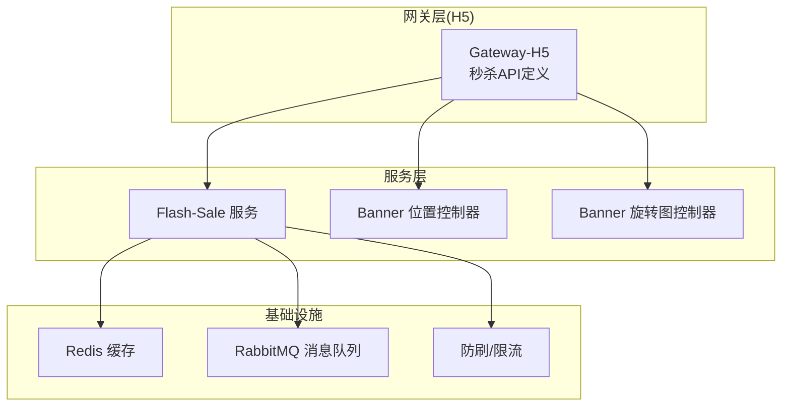
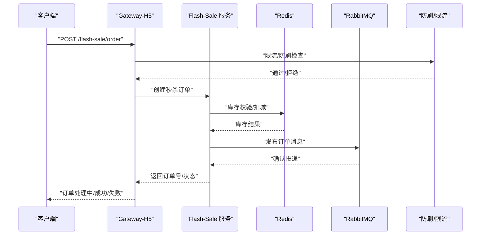
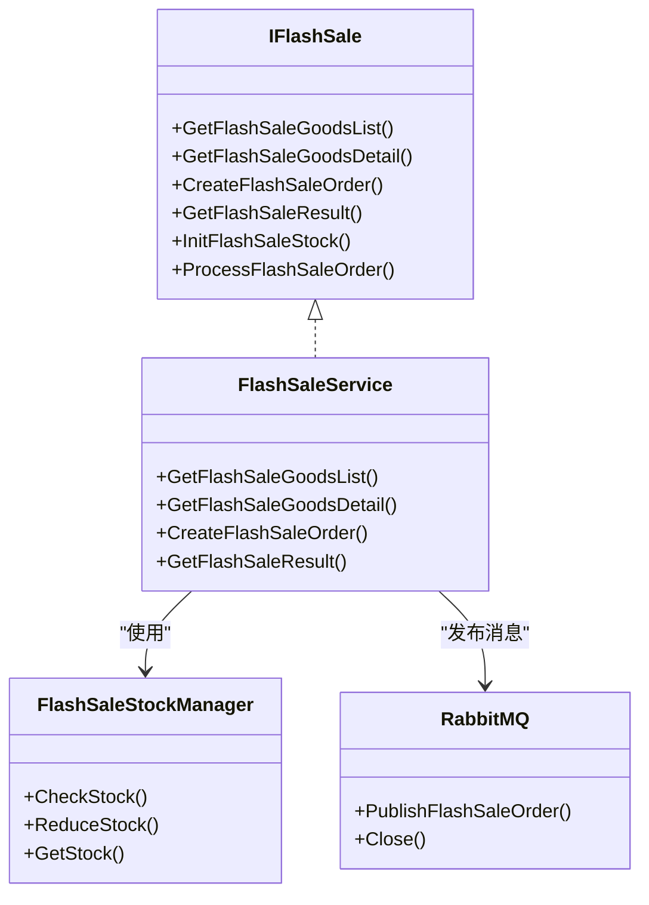
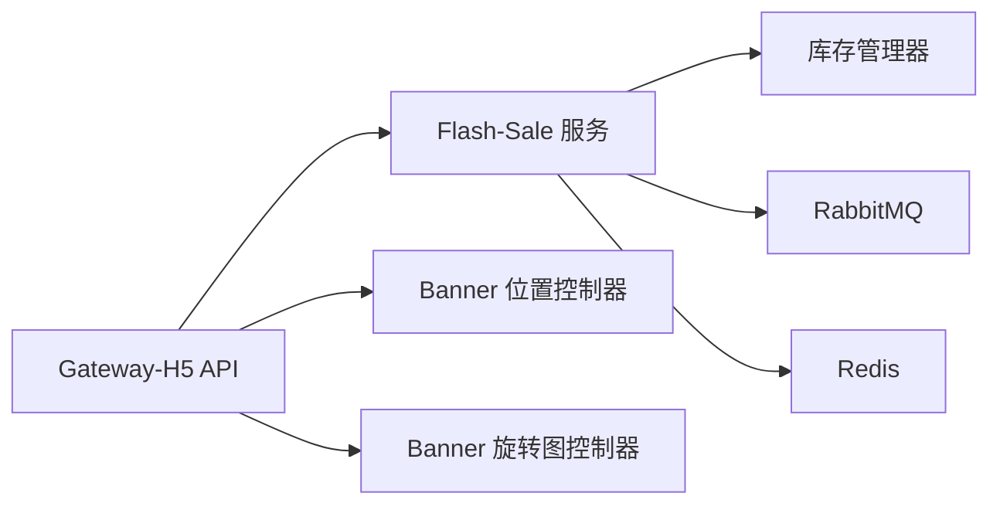

# Banner与秒杀API

<cite>
**本文引用的文件**
- [app/banner/internal/controller/position_info/position_info.go](file://app/banner/internal/controller/position_info/position_info.go)
- [app/banner/internal/controller/rotation_info/rotation_info.go](file://app/banner/internal/controller/rotation_info/rotation_info.go)
- [app/banner/api/position_info/v1/position_info.pb.go](file://app/banner/api/position_info/v1/position_info.pb.go)
- [app/banner/api/rotation_info/v1/rotation_info.pb.go](file://app/banner/api/rotation_info/v1/rotation_info.pb.go)
- [app/gateway-h5/api/flash_sale/v1/flash_sale.go](file://app/gateway-h5/api/flash_sale/v1/flash_sale.go)
- [app/flash-sale/internal/service/flash_sale.go](file://app/flash-sale/internal/service/flash_sale.go)
- [app/flash-sale/internal/logic/flash_sale.go](file://app/flash-sale/internal/logic/flash_sale.go)
- [app/flash-sale/utility/stock_manager.go](file://app/flash-sale/utility/stock_manager.go)
- [app/flash-sale/utility/rabbitmq.go](file://app/flash-sale/utility/rabbitmq.go)
- [app/flash-sale/utility/redis.go](file://app/flash-sale/utility/redis.go)
- [app/flash-sale/utility/anti_brush.go](file://app/flash-sale/utility/anti_brush.go)
- [app/flash-sale/utility/rate_limit.go](file://app/flash-sale/utility/rate_limit.go)
</cite>

## 目录
1. [简介](#简介)
2. [项目结构](#项目结构)
3. [核心组件](#核心组件)
4. [架构总览](#架构总览)
5. [详细组件分析](#详细组件分析)
6. [依赖分析](#依赖分析)
7. [性能考虑](#性能考虑)
8. [故障排查指南](#故障排查指南)
9. [结论](#结论)

## 简介
本文件为“Banner与秒杀API”接口文档，覆盖以下能力：
- 轮播图管理：轮播图位置管理、轮播图列表查询
- 旋转图管理：旋转图列表查询、新增、更新、删除
- 秒杀活动：秒杀商品列表查询、秒杀商品详情、创建秒杀订单、查询秒杀结果
- 高并发保障：基于缓存、限流、防刷、消息队列的并发处理机制

文档包含HTTP方法、URL路径、请求参数、响应格式、错误码说明，并提供请求与响应示例，以及秒杀系统的高并发处理机制说明。

## 项目结构
围绕Banner与秒杀相关的模块分布如下：
- Banner模块：提供轮播图位置与旋转图的管理与查询接口
- Gateway-H5模块：面向H5端的API定义（秒杀商品列表、详情、下单、结果查询）
- Flash-Sale模块：秒杀服务的业务逻辑、库存管理、消息队列、缓存与限流等基础设施
- Utility工具：Redis缓存、RabbitMQ消息队列、库存管理、防刷与限流

**图表来源**
- [app/gateway-h5/api/flash_sale/v1/flash_sale.go](file://app/gateway-h5/api/flash_sale/v1/flash_sale.go#L1-L72)
- [app/flash-sale/internal/service/flash_sale.go](file://app/flash-sale/internal/service/flash_sale.go#L1-L28)
- [app/banner/internal/controller/position_info/position_info.go](file://app/banner/internal/controller/position_info/position_info.go#L1-L123)
- [app/banner/internal/controller/rotation_info/rotation_info.go](file://app/banner/internal/controller/rotation_info/rotation_info.go#L1-L122)

**章节来源**
- [app/gateway-h5/api/flash_sale/v1/flash_sale.go](file://app/gateway-h5/api/flash_sale/v1/flash_sale.go#L1-L72)
- [app/flash-sale/internal/service/flash_sale.go](file://app/flash-sale/internal/service/flash_sale.go#L1-L28)
- [app/banner/internal/controller/position_info/position_info.go](file://app/banner/internal/controller/position_info/position_info.go#L1-L123)
- [app/banner/internal/controller/rotation_info/rotation_info.go](file://app/banner/internal/controller/rotation_info/rotation_info.go#L1-L122)

## 核心组件
- Banner位置管理：提供轮播图位置的分页列表查询、新增、更新、删除
- Banner旋转图管理：提供旋转图的分页列表查询、新增、更新、删除
- 秒杀服务：提供秒杀商品列表、详情、创建订单、查询结果；并具备库存校验、消息异步处理、缓存与限流等能力

**章节来源**
- [app/banner/internal/controller/position_info/position_info.go](file://app/banner/internal/controller/position_info/position_info.go#L27-L122)
- [app/banner/internal/controller/rotation_info/rotation_info.go](file://app/banner/internal/controller/rotation_info/rotation_info.go#L27-L121)
- [app/flash-sale/internal/service/flash_sale.go](file://app/flash-sale/internal/service/flash_sale.go#L8-L27)

## 架构总览
下图展示从网关到服务与基础设施的整体交互：

**图表来源**
- [app/gateway-h5/api/flash_sale/v1/flash_sale.go](file://app/gateway-h5/api/flash_sale/v1/flash_sale.go#L48-L58)
- [app/flash-sale/utility/rate_limit.go](file://app/flash-sale/utility/rate_limit.go#L52-L83)
- [app/flash-sale/utility/anti_brush.go](file://app/flash-sale/utility/anti_brush.go#L24-L80)
- [app/flash-sale/utility/stock_manager.go](file://app/flash-sale/utility/stock_manager.go#L33-L73)
- [app/flash-sale/utility/rabbitmq.go](file://app/flash-sale/utility/rabbitmq.go#L103-L120)

## 详细组件分析

### 轮播图位置管理（Banner Position）
- 功能：分页查询轮播图位置列表、新增、更新、删除
- 控制器：position_info.Controller
- 请求/响应模型：由position_info.pb.go生成的GetList/Create/Update/Delete及其响应

接口定义（HTTP方法、URL、参数、响应）
- 列表查询
  - 方法：GET
  - 路径：/position/list
  - 查询参数：
    - sort：排序方式（数字）
    - page：页码（最小1）
    - size：每页条数（最大100）
  - 响应字段：list、page、size、total
- 新增
  - 方法：POST
  - 路径：/position
  - 请求体字段：PicUrl、GoodsName、Link、Sort、GoodsId
  - 响应字段：id
- 更新
  - 方法：PUT
  - 路径：/position
  - 请求体字段：Id、PicUrl、GoodsName、Link、Sort、GoodsId
  - 响应字段：id
- 删除
  - 方法：DELETE
  - 路径：/position/{id}
  - 路径参数：id
  - 响应：空对象

请求示例
- GET /position/list?page=1&size=10&sort=0
- POST /position
  - 请求体：{"PicUrl":"https://example.com/img.jpg","GoodsName":"示例商品","Link":"/goods/1","Sort":1,"GoodsId":1001}
- PUT /position
  - 请求体：{"Id":1,"PicUrl":"https://example.com/new.jpg","GoodsName":"新商品","Link":"/goods/2","Sort":2,"GoodsId":1002}
- DELETE /position/1

响应示例
- GET /position/list
  - 响应：{"data":{"list":[],"page":1,"size":10,"total":0}}
- POST /position
  - 响应：{"id":1}
- PUT /position
  - 响应：{"id":1}
- DELETE /position/1
  - 响应：{}

错误码说明
- 数据库操作错误：统一包装为数据库错误码
- 参数校验失败：由框架自动返回相应错误

**章节来源**
- [app/banner/internal/controller/position_info/position_info.go](file://app/banner/internal/controller/position_info/position_info.go#L27-L122)
- [app/banner/api/position_info/v1/position_info.pb.go](file://app/banner/api/position_info/v1/position_info.pb.go#L355-L481)

### 旋转图管理（Banner Rotation）
- 功能：分页查询旋转图列表、新增、更新、删除
- 控制器：rotation_info.Controller
- 请求/响应模型：由rotation_info.pb.go生成的GetList/Create/Update/Delete及其响应

接口定义（HTTP方法、URL、参数、响应）
- 列表查询
  - 方法：GET
  - 路径：/rotation/list
  - 查询参数：sort、page、size
  - 响应字段：list、page、size、total
- 新增
  - 方法：POST
  - 路径：/rotation
  - 请求体字段：PicUrl、Link、Sort
  - 响应字段：id
- 更新
  - 方法：PUT
  - 路径：/rotation
  - 请求体字段：Id、PicUrl、Link、Sort
  - 响应字段：id
- 删除
  - 方法：DELETE
  - 路径：/rotation/{id}
  - 路径参数：id
  - 响应：空对象

请求示例
- GET /rotation/list?page=1&size=10&sort=0
- POST /rotation
  - 请求体：{"PicUrl":"https://example.com/rot1.jpg","Link":"/goods/1","Sort":1}
- PUT /rotation
  - 请求体：{"Id":1,"PicUrl":"https://example.com/rot_new.jpg","Link":"/goods/2","Sort":2}
- DELETE /rotation/1

响应示例
- GET /rotation/list
  - 响应：{"data":{"list":[],"page":1,"size":10,"total":0}}
- POST /rotation
  - 响应：{"id":1}
- PUT /rotation
  - 响应：{"id":1}
- DELETE /rotation/1
  - 响应：{}

错误码说明
- 数据库操作错误：统一包装为数据库错误码
- 参数校验失败：由框架自动返回相应错误

**章节来源**
- [app/banner/internal/controller/rotation_info/rotation_info.go](file://app/banner/internal/controller/rotation_info/rotation_info.go#L27-L121)
- [app/banner/api/rotation_info/v1/rotation_info.pb.go](file://app/banner/api/rotation_info/v1/rotation_info.pb.go#L323-L456)

### 秒杀活动（Gateway-H5 API）
- 功能：秒杀商品列表、详情、创建订单、查询结果
- 定义位置：gateway-h5/api/flash_sale/v1/flash_sale.go

接口定义（HTTP方法、URL、参数、响应）

- 秒杀商品列表
  - 方法：GET
  - 路径：/flash-sale/goods
  - 查询参数：
    - page：页码（最小1）
    - size：每页数量（最大100）
  - 响应字段：list（元素包含id、goods_id、title、price、stock、sold、start_time、end_time、status、pic_url、original_price）、page、size、total

- 秒杀商品详情
  - 方法：GET
  - 路径：/flash-sale/goods/detail
  - 查询参数：id（秒杀商品ID）
  - 响应字段：继承商品项，并增加detail_info、images

- 创建秒杀订单
  - 方法：POST
  - 路径：/flash-sale/order
  - 请求体参数：goods_id、count
  - 响应字段：order_id、status、message
  - 状态说明：1-处理中，2-成功，3-失败

- 查询秒杀结果
  - 方法：GET
  - 路径：/flash-sale/result
  - 查询参数：order_id
  - 响应字段：order_id、status、message、goods_name、price

请求示例
- GET /flash-sale/goods?page=1&size=10
- GET /flash-sale/goods/detail?id=1001
- POST /flash-sale/order
  - 请求体：{"goods_id":1001,"count":1}
- GET /flash-sale/result?order_id=FSO20250405123456789

响应示例
- GET /flash-sale/goods
  - 响应：{"list":[{"id":1001,"goods_id":2001,"title":"限时秒杀","price":9900,"stock":100,"sold":10,"start_time":1712131200,"end_time":1712134800,"status":2,"pic_url":"https://example.com/item.jpg","original_price":12800}],"page":1,"size":10,"total":1}
- GET /flash-sale/goods/detail
  - 响应：{"id":1001,"goods_id":2001,"title":"限时秒杀","price":9900,"stock":100,"sold":10,"start_time":1712131200,"end_time":1712134800,"status":2,"pic_url":"https://example.com/item.jpg","original_price":12800,"detail_info":"商品详情","images":"img1.jpg,img2.jpg"}
- POST /flash-sale/order
  - 响应：{"order_id":"FSO20250405123456789","status":1,"message":"订单已受理，正在处理"}
- GET /flash-sale/result
  - 响应：{"order_id":"FSO20250405123456789","status":2,"message":"购买成功","goods_name":"限时秒杀","price":9900}

错误码说明
- 参数校验失败：由框架自动返回
- 业务异常：如库存不足、请求过于频繁、网络行为异常等，返回对应错误信息

**章节来源**
- [app/gateway-h5/api/flash_sale/v1/flash_sale.go](file://app/gateway-h5/api/flash_sale/v1/flash_sale.go#L7-L72)

### 秒杀服务（后端逻辑与基础设施）
- 服务接口：IFlashSale（定义了商品列表、详情、创建订单、查询结果、初始化库存、异步处理等方法）
- 服务实现：FlashSaleService（在logic层注册并转发调用）
- 库存管理：FlashSaleStockManager（基于gcache的Redis适配器，提供库存检查与扣减）
- 消息队列：RabbitMQ（声明交换机与队列，发布订单消息）
- 缓存：Redis（用于库存、限流、防刷等键空间）
- 限流与防刷：RateLimiter、AntiBrushChecker（按用户、IP、全局维度限流，防刷检查）

**图表来源**
- [app/flash-sale/internal/service/flash_sale.go](file://app/flash-sale/internal/service/flash_sale.go#L8-L27)
- [app/flash-sale/internal/logic/flash_sale.go](file://app/flash-sale/internal/logic/flash_sale.go#L16-L58)
- [app/flash-sale/utility/stock_manager.go](file://app/flash-sale/utility/stock_manager.go#L12-L89)
- [app/flash-sale/utility/rabbitmq.go](file://app/flash-sale/utility/rabbitmq.go#L15-L131)

**章节来源**
- [app/flash-sale/internal/service/flash_sale.go](file://app/flash-sale/internal/service/flash_sale.go#L8-L27)
- [app/flash-sale/internal/logic/flash_sale.go](file://app/flash-sale/internal/logic/flash_sale.go#L11-L58)
- [app/flash-sale/utility/stock_manager.go](file://app/flash-sale/utility/stock_manager.go#L12-L89)
- [app/flash-sale/utility/rabbitmq.go](file://app/flash-sale/utility/rabbitmq.go#L15-L131)
- [app/flash-sale/utility/redis.go](file://app/flash-sale/utility/redis.go#L16-L55)
- [app/flash-sale/utility/anti_brush.go](file://app/flash-sale/utility/anti_brush.go#L12-L80)
- [app/flash-sale/utility/rate_limit.go](file://app/flash-sale/utility/rate_limit.go#L13-L161)

## 依赖分析
- Banner模块依赖DAO与实体转换，控制器负责分页与排序参数处理
- Gateway-H5模块定义API结构，具体业务由Flash-Sale服务实现
- Flash-Sale服务依赖Redis缓存、RabbitMQ消息队列、库存管理器与限流/防刷组件

**图表来源**
- [app/gateway-h5/api/flash_sale/v1/flash_sale.go](file://app/gateway-h5/api/flash_sale/v1/flash_sale.go#L1-L72)
- [app/flash-sale/internal/service/flash_sale.go](file://app/flash-sale/internal/service/flash_sale.go#L1-L28)
- [app/banner/internal/controller/position_info/position_info.go](file://app/banner/internal/controller/position_info/position_info.go#L1-L123)
- [app/banner/internal/controller/rotation_info/rotation_info.go](file://app/banner/internal/controller/rotation_info/rotation_info.go#L1-L122)

**章节来源**
- [app/gateway-h5/api/flash_sale/v1/flash_sale.go](file://app/gateway-h5/api/flash_sale/v1/flash_sale.go#L1-L72)
- [app/flash-sale/internal/service/flash_sale.go](file://app/flash-sale/internal/service/flash_sale.go#L1-L28)
- [app/banner/internal/controller/position_info/position_info.go](file://app/banner/internal/controller/position_info/position_info.go#L1-L123)
- [app/banner/internal/controller/rotation_info/rotation_info.go](file://app/banner/internal/controller/rotation_info/rotation_info.go#L1-L122)

## 性能考虑
- 缓存优先：库存与限流数据存储于Redis，避免热点数据库压力
- 异步处理：订单创建后通过RabbitMQ异步落库与后续处理，降低请求延迟
- 并发控制：基于gcache的限流器与防刷器，限制用户与IP的请求频率，防止恶意刷单
- 分页与排序：Banner列表支持分页与排序，避免一次性加载大量数据

## 故障排查指南
常见错误与定位要点
- 数据库操作错误：查看控制器日志与错误码包装，确认SQL执行与参数绑定
- 库存不足：检查库存管理器的库存键与扣减逻辑
- 消息队列异常：确认交换机与队列声明、连接状态与消息投递
- 限流/防刷触发：检查用户与IP的限流键与过期时间，调整阈值或提示用户稍后再试

**章节来源**
- [app/banner/internal/controller/position_info/position_info.go](file://app/banner/internal/controller/position_info/position_info.go#L40-L44)
- [app/banner/internal/controller/rotation_info/rotation_info.go](file://app/banner/internal/controller/rotation_info/rotation_info.go#L42-L44)
- [app/flash-sale/utility/stock_manager.go](file://app/flash-sale/utility/stock_manager.go#L33-L48)
- [app/flash-sale/utility/rabbitmq.go](file://app/flash-sale/utility/rabbitmq.go#L21-L55)
- [app/flash-sale/utility/rate_limit.go](file://app/flash-sale/utility/rate_limit.go#L52-L83)
- [app/flash-sale/utility/anti_brush.go](file://app/flash-sale/utility/anti_brush.go#L24-L80)

## 结论
本文档梳理了Banner与秒杀相关接口，明确了HTTP方法、URL、参数与响应格式，并结合Flash-Sale模块的库存、缓存、消息队列与限流/防刷机制，给出了高并发场景下的处理思路与故障排查要点。建议在生产环境中配合监控与告警，持续优化缓存命中率与消息处理吞吐量。