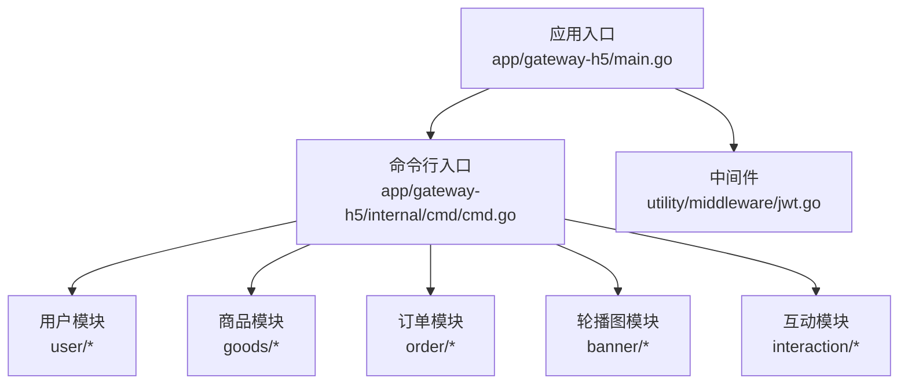
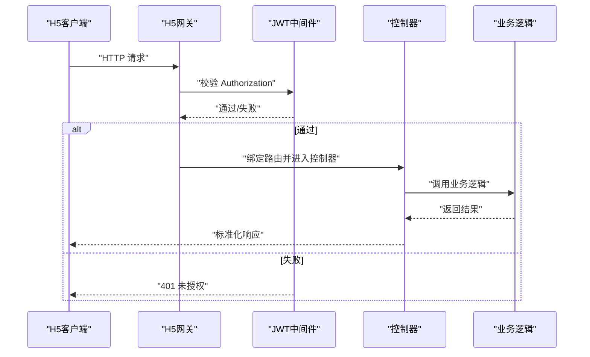
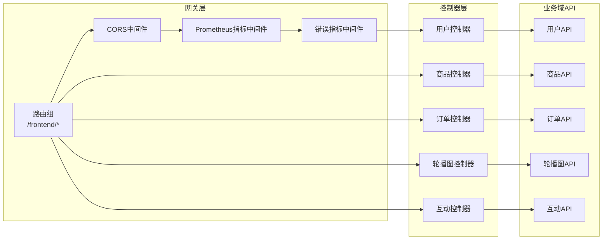

# H5网关API

<cite>
**本文引用的文件**
- [main.go](file://app/gateway-h5/main.go)
- [cmd.go](file://app/gateway-h5/internal/cmd/cmd.go)
- [jwt.go](file://utility/middleware/jwt.go)
- [user_info.go](file://app/gateway-h5/api/user/v1/user_info.go)
- [consignee_info.go](file://app/gateway-h5/api/user/v1/consignee_info.go)
- [goods_info.go](file://app/gateway-h5/api/goods/v1/goods_info.go)
- [cart_info.go](file://app/gateway-h5/api/goods/v1/cart_info.go)
- [order_info.go](file://app/gateway-h5/api/order/v1/order_info.go)
- [rotation_info.go](file://app/gateway-h5/api/banner/v1/rotation_info.go)
- [comment_info.go](file://app/gateway-h5/api/interaction/v1/comment_info.go)
- [praise_info.go](file://app/gateway-h5/api/interaction/v1/praise_info.go)
- [collection_info.go](file://app/gateway-h5/api/interaction/v1/collection_info.go)
- [bargain_info.go](file://app/gateway-h5/api/goods/v1/bargain_info.go)
- [user_coupon_info.go](file://app/gateway-h5/api/goods/v1/user_coupon_info.go)
</cite>

## 目录
1. [简介](#简介)
2. [项目结构](#项目结构)
3. [核心组件](#核心组件)
4. [架构总览](#架构总览)
5. [详细组件分析](#详细组件分析)
6. [依赖关系分析](#依赖关系分析)
7. [性能考虑](#性能考虑)
8. [故障排查指南](#故障排查指南)
9. [结论](#结论)
10. [附录](#附录)

## 简介
本文件为 H5 网关 API 的完整接口文档，覆盖 H5 端用户相关的核心能力：用户认证与登录、个人信息管理、商品浏览、购物车操作、订单创建与支付、评论互动、轮播图展示、促销活动（砍价）、优惠券等。文档包含每个接口的 HTTP 方法、URL 路径、请求参数、响应格式、错误码说明，并提供认证方式与参数校验规则说明。

## 项目结构
H5 网关基于 GoFrame 框架，通过路由组划分公开与需要 JWT 认证的接口，统一注入 CORS 与 Prometheus 指标中间件，启动 HTTP 服务并加载各模块控制器。

图表来源
- [main.go](file://app/gateway-h5/main.go#L1-L38)
- [cmd.go](file://app/gateway-h5/internal/cmd/cmd.go#L1-L100)

章节来源
- [main.go](file://app/gateway-h5/main.go#L1-L38)
- [cmd.go](file://app/gateway-h5/internal/cmd/cmd.go#L1-L100)

## 核心组件
- 认证中间件：通过 Header 中的 Authorization 字段进行 JWT 校验，移除 Bearer 前缀后解析用户 ID，注入到请求上下文。
- 路由分组：
  - 公开接口组：无需认证，如登录、注册、商品列表、轮播图、订单回调等。
  - 认证接口组：需携带有效 JWT，如收货地址、购物车、订单、互动、促销等。
- 模块化 API 定义：按业务域拆分 API 结构体，统一在控制器中绑定路由。

章节来源
- [jwt.go](file://utility/middleware/jwt.go#L1-L39)
- [cmd.go](file://app/gateway-h5/internal/cmd/cmd.go#L33-L91)

## 架构总览
H5 网关作为前端入口，负责：
- 统一鉴权与参数校验
- 聚合业务接口，屏蔽后端微服务细节
- 提供标准响应格式与错误码

图表来源
- [jwt.go](file://utility/middleware/jwt.go#L16-L38)
- [cmd.go](file://app/gateway-h5/internal/cmd/cmd.go#L33-L91)

## 详细组件分析

### 用户认证与登录
- 登录
  - 方法与路径：POST /user/login
  - 请求参数：name（必填）、password（必填）
  - 响应：type、token、expire_in、user_info
  - 错误码：401 未授权（用户名或密码错误时）
- 注册
  - 方法与路径：POST /user/register
  - 请求参数：name（必填）、password（必填）、avatar、sex、sign、secret_answer
  - 响应：id
- 微信小程序登录
  - 方法与路径：POST /user/wxMiniLogin
  - 请求参数：code（必填）
  - 响应：type、token、expire_in、openId、is_first_login、user_info
- 微信小程序注册
  - 方法与路径：POST /user/wxMiniRegister
  - 请求参数：code（必填）、iv、encryptedData、nickname、avatar
  - 响应：type、token、expire_in、openId、user_info

认证方式
- 所有需要认证的接口均需在 Header 中携带 Authorization: Bearer <token>
- 若缺失或无效，返回 401 未授权

章节来源
- [user_info.go](file://app/gateway-h5/api/user/v1/user_info.go#L8-L118)
- [jwt.go](file://utility/middleware/jwt.go#L16-L38)

### 个人信息管理
- 获取用户信息
  - 方法与路径：GET /user/info
  - 响应：user_info（包含 id、name、avatar、sex、sign、status）
- 修改密码
  - 方法与路径：PUT /user/update/password
  - 请求参数：password（必填）、secret_answer（必填）
  - 响应：id
- 修改用户信息
  - 方法与路径：PUT /user/update
  - 请求参数：name、avatar
  - 响应：id

章节来源
- [user_info.go](file://app/gateway-h5/api/user/v1/user_info.go#L38-L71)

### 收货地址管理
- 新增收货地址
  - 方法与路径：POST /consignee
  - 请求参数：isDefault、name（必填）、phone（必填）、province、city、town、street、detail
  - 响应：id
- 获取收货地址列表
  - 方法与路径：GET /consignee
  - 请求参数：page（默认1，最小1）、size（默认10，最大100）
  - 响应：list、page、size、total
- 更新收货地址
  - 方法与路径：PUT /consignee
  - 请求参数：id（必填）、isDefault、name、phone、province、city、town、street、detail
  - 响应：id
- 删除收货地址
  - 方法与路径：DELETE /consignee
  - 请求参数：id（必填）
  - 响应：空

章节来源
- [consignee_info.go](file://app/gateway-h5/api/user/v1/consignee_info.go#L8-L86)

### 商品浏览与推荐
- 商品详情
  - 方法与路径：GET /goods/detail
  - 请求参数：id（必填）
  - 响应：复用商品列表项结构
- 商品分页列表
  - 方法与路径：GET /goods
  - 请求参数：page（默认1，最小1）、size（默认10，最大100）、is_hot（默认0，开启热门推荐）
  - 响应：list、page、size、total
- 推荐商品列表
  - 方法与路径：GET /recommend_goods
  - 请求参数：page、size
  - 响应：list、page、size、total

章节来源
- [goods_info.go](file://app/gateway-h5/api/goods/v1/goods_info.go#L8-L51)

### 购物车操作
- 购物车列表
  - 方法与路径：GET /cart
  - 请求参数：page（默认1，最小1）、size（默认10，最大100）
  - 响应：list（包含购物车与商品信息）、page、size、total
- 新增购物车项
  - 方法与路径：POST /cart
  - 请求参数：goods_id（必填）、count（必填）
  - 响应：id
- 删除购物车项
  - 方法与路径：DELETE /cart
  - 请求参数：id（必填）
  - 响应：空

章节来源
- [cart_info.go](file://app/gateway-h5/api/goods/v1/cart_info.go#L8-L61)

### 促销与优惠券
- 砍价信息
  - 创建：POST /goods/bargain_info/Create（user_Id、goods_Id、counts 必填）
  - 查询：GET /goods/bargain_info/Get（Id、user_Id、goods_Id 必填）
  - 删除：POST /goods/bargain_info/delete（Id、user_Id、goods_Id 必填）
- 优惠券列表
  - 方法与路径：GET /user_coupon
  - 请求参数：page（默认1，最小1）、size（默认10，最大100）
  - 响应：list（包含 id、user_id、coupon_id、status、amount）

章节来源
- [bargain_info.go](file://app/gateway-h5/api/goods/v1/bargain_info.go#L12-L58)
- [user_coupon_info.go](file://app/gateway-h5/api/goods/v1/user_coupon_info.go#L8-L31)

### 订单创建与支付
- 订单列表
  - 方法与路径：GET /order/list
  - 请求参数：page（默认1，最小1）、size（默认10，最大50）、status（必填）
  - 响应：list（包含 id、user_id、number、price、actual_price、status、goods_info）、page、size、total
- 订单详情
  - 方法与路径：GET /order/{id}
  - 请求参数：id（必填）
  - 响应：order_info（包含 id、user_id、number、price、coupon_price、actual_price、pay_type、remark、status、consignee_*、created_at、updated_at、pay_at）、order_goods_infos
- 订单数量
  - 方法与路径：GET /order/count
  - 响应：pending、shipping、delivered、completed、afterSale
- 创建订单
  - 方法与路径：POST /order
  - 请求参数：price（必填，>=0）、coupon_price（默认0）、actual_price（必填，>=0）、consignee_name、consignee_phone、consignee_address、remark、order_goods_info（必填，包含 goods_id、goods_options_id、count（>=1）、remark、price（>=0）、coupon_price、actual_price（>=0)）、coupon_id
  - 响应：id、number
- 发起支付
  - 方法与路径：POST /payment
  - 请求参数：openId（必填）、amount（必填，单位分）、number（必填）
  - 响应：timeStamp、nonceStr、package、signType、paySign、out_trade_no
- 支付回调
  - 方法与路径：POST /notify
  - 请求参数：由框架手动读取原始 body 与 headers
  - 响应：空
- 取消订单
  - 方法与路径：POST /order/cancel
  - 请求参数：id
  - 响应：code、message、data

章节来源
- [order_info.go](file://app/gateway-h5/api/order/v1/order_info.go#L10-L156)

### 评论互动
- 评论列表
  - 方法与路径：GET /comment
  - 请求参数：page（默认1，最小1）、size（默认10，最大100）
  - 响应：list（包含 id、user_id、object_id、type、parent_id、content）、page、size、total
- 创建评论
  - 方法与路径：POST /comment
  - 请求参数：object_id（必填）、type（必填，1商品/2文章）、parent_id、content（必填）
  - 响应：id
- 删除评论
  - 方法与路径：DELETE /comment
  - 请求参数：id（必填）
  - 响应：id

- 点赞
  - 创建：POST /praise（object_id、type（1/2）、必填）
  - 删除：DELETE /praise（id、type（1/2）、object_id，必填）
  - 列表：GET /praise?type=...&page=&size=...

- 收藏
  - 创建：POST /collection（object_id、type（1/2）、必填）
  - 删除：DELETE /collection（id，必填）
  - 列表：GET /collection?type=...&page=&size=...

章节来源
- [comment_info.go](file://app/gateway-h5/api/interaction/v1/comment_info.go#L8-L55)
- [praise_info.go](file://app/gateway-h5/api/interaction/v1/praise_info.go#L8-L58)
- [collection_info.go](file://app/gateway-h5/api/interaction/v1/collection_info.go#L8-L65)

### 轮播图
- 轮播图列表
  - 方法与路径：GET /rotation
  - 请求参数：sort（排序方式）、page（默认1，最小1）、size（默认10，最大100）
  - 响应：list（包含 id、pic_url、link、sort）、page、size、total

章节来源
- [rotation_info.go](file://app/gateway-h5/api/banner/v1/rotation_info.go#L8-L31)

## 依赖关系分析
H5 网关通过路由组将公开与认证接口分离，统一注入 CORS 与指标中间件；认证通过 JWT 中间件完成，控制器层负责绑定具体 API 结构体与业务逻辑。

图表来源
- [cmd.go](file://app/gateway-h5/internal/cmd/cmd.go#L33-L91)
- [main.go](file://app/gateway-h5/main.go#L29-L36)

章节来源
- [cmd.go](file://app/gateway-h5/internal/cmd/cmd.go#L17-L98)
- [main.go](file://app/gateway-h5/main.go#L13-L38)

## 性能考虑
- 分页参数限制：商品、评论、点赞、收藏、购物车、优惠券等接口对 page、size 进行默认与上限控制，避免大分页导致数据库压力。
- 中间件指标：启用 Prometheus 指标收集与错误统计，便于观测接口耗时与错误率。
- CORS 与 HTTPS：生产环境建议启用 HTTPS 并合理配置证书，确保传输安全。

## 故障排查指南
- 401 未授权
  - 现象：缺少 Authorization 或 Token 无效
  - 处理：确认 Header 中 Authorization: Bearer <token> 是否正确传递
- 参数校验失败
  - 现象：必填字段缺失或范围不合法
  - 处理：检查请求参数类型与范围，参考各接口的参数校验规则
- 支付回调
  - 现象：回调未自动绑定
  - 处理：根据通知结构体说明，手动读取原始 body 与 headers 进行处理

章节来源
- [jwt.go](file://utility/middleware/jwt.go#L16-L38)
- [order_info.go](file://app/gateway-h5/api/order/v1/order_info.go#L94-L102)

## 结论
H5 网关以清晰的路由分组与中间件体系，提供了完整的用户、商品、订单、互动与促销相关接口，配合严格的参数校验与认证机制，满足 H5 端业务需求。建议在生产环境中启用 HTTPS、完善日志与告警，并持续优化分页与缓存策略以提升性能。

## 附录

### 认证与参数校验规则
- 认证方式：Header 中 Authorization: Bearer <token>
- 参数校验：
  - 必填：v:"required"
  - 数值范围：v:"min:..."、v:"max:..."、v:"min:...|max:..."
  - 枚举：v:"in:1,2"
  - 默认值：d:"..."

章节来源
- [user_info.go](file://app/gateway-h5/api/user/v1/user_info.go#L10-L11)
- [consignee_info.go](file://app/gateway-h5/api/user/v1/consignee_info.go#L29-L30)
- [goods_info.go](file://app/gateway-h5/api/goods/v1/goods_info.go#L21-L24)
- [cart_info.go](file://app/gateway-h5/api/goods/v1/cart_info.go#L11-L13)
- [order_info.go](file://app/gateway-h5/api/order/v1/order_info.go#L16-L17)
- [comment_info.go](file://app/gateway-h5/api/interaction/v1/comment_info.go#L37-L39)
- [praise_info.go](file://app/gateway-h5/api/interaction/v1/praise_info.go#L12-L13)
- [collection_info.go](file://app/gateway-h5/api/interaction/v1/collection_info.go#L12-L13)
- [bargain_info.go](file://app/gateway-h5/api/goods/v1/bargain_info.go#L14-L17)
- [user_coupon_info.go](file://app/gateway-h5/api/goods/v1/user_coupon_info.go#L11-L13)