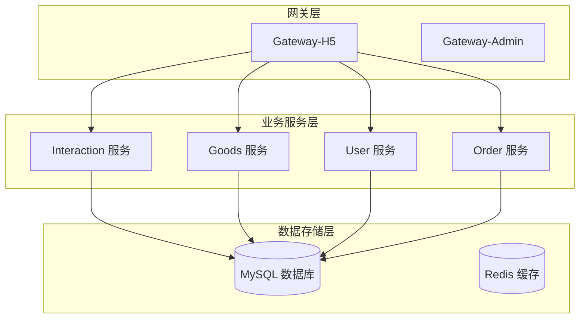
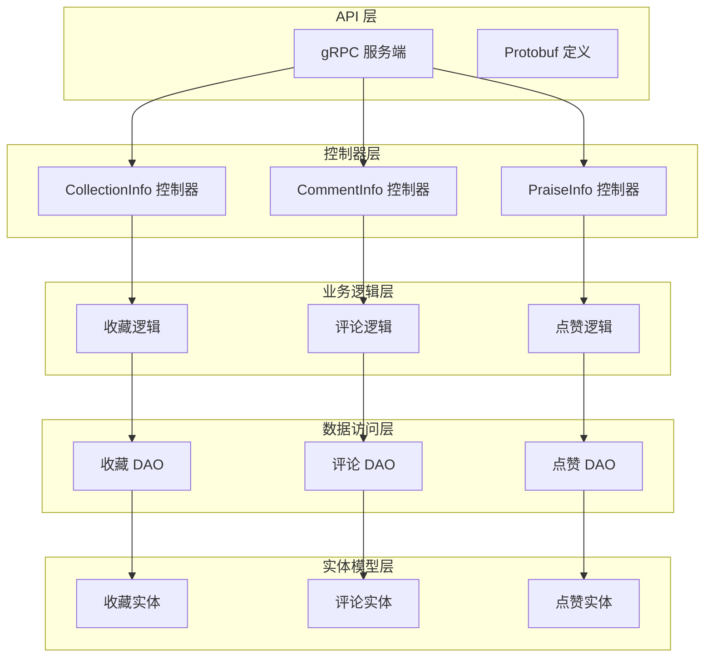
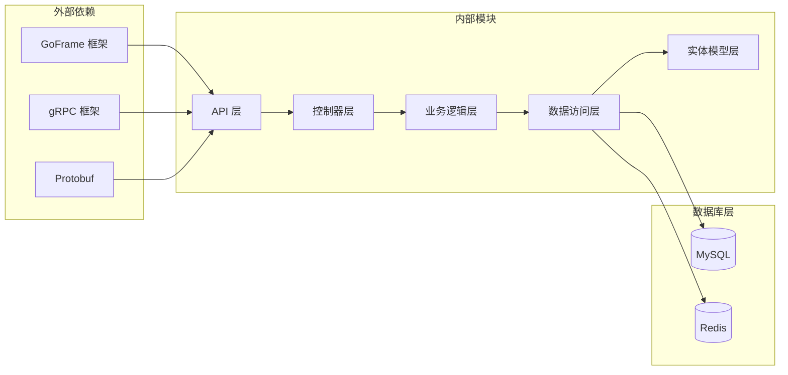
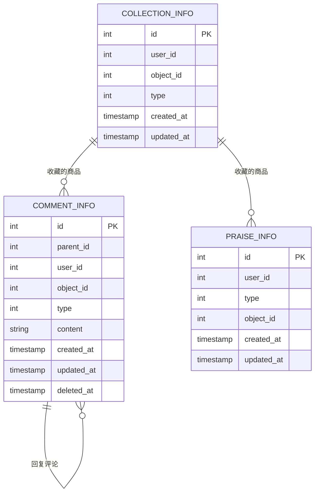
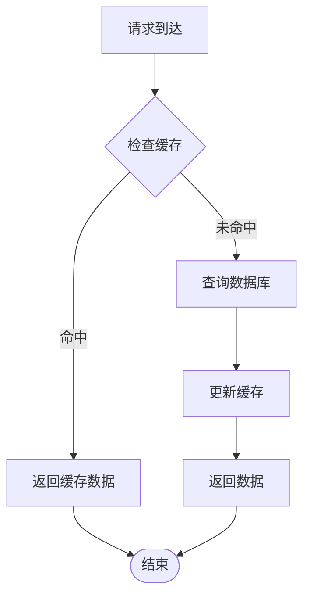
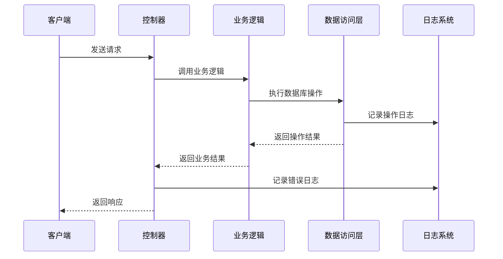

# 互动相关API

<cite>
**本文档引用的文件**
- [collection_info.pb.go](file://app/interaction/api/collection_info/v1/collection_info.pb.go)
- [comment_info.pb.go](file://app/interaction/api/comment_info/v1/comment_info.pb.go)
- [praise_info.pb.go](file://app/interaction/api/praise_info/v1/praise_info.pb.go)
- [collection_info.go](file://app/interaction/internal/controller/collection_info/collection_info.go)
- [comment_info.go](file://app/interaction/internal/controller/comment_info/comment_info.go)
- [praise_info.go](file://app/interaction/internal/controller/praise_info/praise_info.go)
- [collection_info.go](file://app/interaction/api/pbentity/collection_info.pb.go)
- [comment_info.go](file://app/interaction/api/pbentity/comment_info.pb.go)
- [praise_info.go](file://app/interaction/api/pbentity/praise_info.pb.go)
- [collection_info.go](file://app/interaction/internal/dao/collection_info.go)
- [comment_info.go](file://app/interaction/internal/dao/comment_info.go)
- [praise_info.go](file://app/interaction/internal/dao/praise_info.go)
- [interaction_v1_collection_info_create.go](file://app/gateway-h5/internal/controller/interaction/interaction_v1_collection_info_create.go)
- [interaction_v1_collection_info_delete.go](file://app/gateway-h5/internal/controller/interaction/interaction_v1_collection_info_delete.go)
- [interaction_v1_collection_info_get_list.go](file://app/gateway-h5/internal/controller/interaction/interaction_v1_collection_info_get_list.go)
- [interaction_v1_comment_info_create.go](file://app/gateway-h5/internal/controller/interaction/interaction_v1_comment_info_create.go)
- [interaction_v1_comment_info_delete.go](file://app/gateway-h5/internal/controller/interaction/interaction_v1_comment_info_delete.go)
- [interaction_v1_comment_info_get_list.go](file://app/gateway-h5/internal/controller/interaction/interaction_v1_comment_info_get_list.go)
- [interaction_v1_praise_info_create.go](file://app/gateway-h5/internal/controller/interaction/interaction_v1_praise_info_create.go)
- [interaction_v1_praise_info_delete.go](file://app/gateway-h5/internal/controller/interaction/interaction_v1_praise_info_delete.go)
- [interaction_v1_praise_info_get_list.go](file://app/gateway-h5/internal/controller/interaction/interaction_v1_praise_info_get_list.go)
</cite>

## 目录
1. [简介](#简介)
2. [项目结构](#项目结构)
3. [核心组件](#核心组件)
4. [架构概览](#架构概览)
5. [详细组件分析](#详细组件分析)
6. [依赖关系分析](#依赖关系分析)
7. [性能考虑](#性能考虑)
8. [故障排除指南](#故障排除指南)
9. [结论](#结论)

## 简介

本文档详细记录了电商微服务架构中的互动相关API接口，包括收藏、评论、点赞等核心互动功能。该服务采用GoFrame框架构建，基于gRPC协议提供高性能的微服务接口，支持商品收藏、取消收藏、收藏列表查询、商品评论、评论列表查询、点赞、取消点赞、点赞列表查询等完整功能。

系统采用分层架构设计，包含API层、控制器层、业务逻辑层、数据访问层和实体模型层，确保了良好的代码组织性和可维护性。

## 项目结构

互动服务在整体微服务架构中的位置如下：



**图表来源**
- [collection_info.go](file://app/interaction/internal/controller/collection_info/collection_info.go#L1-L83)
- [comment_info.go](file://app/interaction/internal/controller/comment_info/comment_info.go#L1-L107)
- [praise_info.go](file://app/interaction/internal/controller/praise_info/praise_info.go#L1-L107)

**章节来源**
- [collection_info.go](file://app/interaction/internal/controller/collection_info/collection_info.go#L1-L83)
- [comment_info.go](file://app/interaction/internal/controller/comment_info/comment_info.go#L1-L107)
- [praise_info.go](file://app/interaction/internal/controller/praise_info/praise_info.go#L1-L107)

## 核心组件

互动服务包含三个核心子系统，每个都提供完整的CRUD操作：

### 收藏功能模块
- **功能范围**：商品收藏管理、收藏列表查询
- **核心接口**：Create、Delete、GetList
- **数据模型**：CollectionInfo

### 评论功能模块  
- **功能范围**：商品评论管理、评论列表查询
- **核心接口**：Create、Delete、GetList
- **数据模型**：CommentInfo

### 点赞功能模块
- **功能范围**：商品点赞管理、点赞列表查询
- **核心接口**：Create、Delete、GetList
- **数据模型**：PraiseInfo

**章节来源**
- [collection_info.pb.go](file://app/interaction/api/collection_info/v1/collection_info.pb.go#L26-L502)
- [comment_info.pb.go](file://app/interaction/api/comment_info/v1/comment_info.pb.go#L26-L484)
- [praise_info.pb.go](file://app/interaction/api/praise_info/v1/praise_info.pb.go#L26-L493)

## 架构概览

互动服务采用经典的三层架构模式：



**图表来源**
- [collection_info.go](file://app/interaction/internal/controller/collection_info/collection_info.go#L15-L83)
- [comment_info.go](file://app/interaction/internal/controller/comment_info/comment_info.go#L19-L107)
- [praise_info.go](file://app/interaction/internal/controller/praise_info/praise_info.go#L19-L107)

## 详细组件分析

### 收藏功能API

#### 接口定义

| 接口名称 | HTTP方法 | URL路径 | 功能描述 |
|---------|---------|--------|----------|
| Create | POST | `/interaction/collection/create` | 创建商品收藏 |
| Delete | DELETE | `/interaction/collection/delete` | 取消商品收藏 |
| GetList | GET | `/interaction/collection/list` | 获取收藏列表 |

#### 请求参数定义

**Create 请求参数**
- `UserId` (uint32): 用户ID
- `ObjectId` (uint32): 商品ID
- `Type` (uint32): 收藏类型（1-商品，2-文章）

**Delete 请求参数**
- `Id` (uint32): 收藏记录ID
- `UserId` (uint32): 用户ID

**GetList 请求参数**
- `UserId` (uint32): 用户ID
- `Type` (uint32): 收藏类型（1-商品，2-文章）
- `Page` (uint32): 页码，默认1
- `Size` (uint32): 每页数量，默认10

#### 响应格式

**通用响应结构**
```json
{
  "code": 0,
  "message": "success",
  "data": {}
}
```

**GetList 响应示例**
```json
{
  "code": 0,
  "message": "success",
  "data": {
    "list": [
      {
        "id": 1,
        "userId": 1001,
        "objectId": 2001,
        "type": 1,
        "createdAt": "2024-01-01T12:00:00Z",
        "updatedAt": "2024-01-01T12:00:00Z"
      }
    ],
    "page": 1,
    "size": 10,
    "total": 1
  }
}
```

#### 错误码说明

| 错误码 | 错误描述 | 说明 |
|-------|---------|------|
| 0 | success | 操作成功 |
| 1001 | 参数错误 | 请求参数无效 |
| 1002 | 数据库操作失败 | 数据库读写异常 |
| 1003 | 权限不足 | 用户权限验证失败 |
| 1004 | 资源不存在 | 目标资源未找到 |

**章节来源**
- [collection_info.pb.go](file://app/interaction/api/collection_info/v1/collection_info.pb.go#L26-L502)
- [collection_info.go](file://app/interaction/internal/controller/collection_info/collection_info.go#L23-L83)

### 评论功能API

#### 接口定义

| 接口名称 | HTTP方法 | URL路径 | 功能描述 |
|---------|---------|--------|----------|
| Create | POST | `/interaction/comment/create` | 创建商品评论 |
| Delete | DELETE | `/interaction/comment/delete` | 删除评论 |
| GetList | GET | `/interaction/comment/list` | 获取评论列表 |

#### 请求参数定义

**Create 请求参数**
- `ObjectId` (uint32): 商品ID
- `Type` (uint32): 评论类型（1-商品，2-文章）
- `ParentId` (uint32): 父级评论ID（用于回复）
- `Content` (string): 评论内容

**Delete 请求参数**
- `Id` (uint32): 评论ID

**GetList 请求参数**
- `Page` (uint32): 页码，默认1
- `Size` (uint32): 每页数量，默认10

#### 响应格式

**Create 响应示例**
```json
{
  "code": 0,
  "message": "success",
  "data": {
    "id": 1
  }
}
```

**GetList 响应示例**
```json
{
  "code": 0,
  "message": "success",
  "data": {
    "list": [
      {
        "id": 1,
        "parentId": 0,
        "userId": 1001,
        "objectId": 2001,
        "type": 1,
        "content": "这是一款很好的商品",
        "createdAt": "2024-01-01T12:00:00Z",
        "updatedAt": "2024-01-01T12:00:00Z"
      }
    ],
    "page": 1,
    "size": 10,
    "total": 1
  }
}
```

**章节来源**
- [comment_info.pb.go](file://app/interaction/api/comment_info/v1/comment_info.pb.go#L26-L484)
- [comment_info.go](file://app/interaction/internal/controller/comment_info/comment_info.go#L27-L107)

### 点赞功能API

#### 接口定义

| 接口名称 | HTTP方法 | URL路径 | 功能描述 |
|---------|---------|--------|----------|
| Create | POST | `/interaction/praise/create` | 创建商品点赞 |
| Delete | DELETE | `/interaction/praise/delete` | 取消点赞 |
| GetList | GET | `/interaction/praise/list` | 获取点赞列表 |

#### 请求参数定义

**Create 请求参数**
- `ObjectId` (uint32): 商品ID
- `Type` (uint32): 点赞类型（1-商品，2-文章）

**Delete 请求参数**
- `Id` (uint32): 点赞记录ID
- `Type` (uint32): 点赞类型（1-商品，2-文章）
- `ObjectId` (uint32): 商品ID

**GetList 请求参数**
- `Type` (uint32): 点赞类型（1-商品，2-文章）
- `Page` (uint32): 页码，默认1
- `Size` (uint32): 每页数量，默认10

#### 响应格式

**GetList 响应示例**
```json
{
  "code": 0,
  "message": "success",
  "data": {
    "list": [
      {
        "id": 1,
        "userId": 1001,
        "type": 1,
        "objectId": 2001,
        "createdAt": "2024-01-01T12:00:00Z",
        "updatedAt": "2024-01-01T12:00:00Z"
      }
    ],
    "page": 1,
    "size": 10,
    "total": 1
  }
}
```

**章节来源**
- [praise_info.pb.go](file://app/interaction/api/praise_info/v1/praise_info.pb.go#L26-L493)
- [praise_info.go](file://app/interaction/internal/controller/praise_info/praise_info.go#L27-L107)

## 依赖关系分析

互动服务的内部依赖关系如下：



**图表来源**
- [collection_info.go](file://app/interaction/internal/dao/collection_info.go#L11-L23)
- [comment_info.go](file://app/interaction/internal/dao/comment_info.go#L11-L23)
- [praise_info.go](file://app/interaction/internal/dao/praise_info.go#L11-L23)

### 数据模型关系



**图表来源**
- [collection_info.go](file://app/interaction/api/pbentity/collection_info.pb.go#L30-L112)
- [comment_info.go](file://app/interaction/api/pbentity/comment_info.pb.go#L30-L136)
- [praise_info.go](file://app/interaction/api/pbentity/praise_info.pb.go#L30-L112)

**章节来源**
- [collection_info.go](file://app/interaction/api/pbentity/collection_info.pb.go#L1-L177)
- [comment_info.go](file://app/interaction/api/pbentity/comment_info.pb.go#L1-L205)
- [praise_info.go](file://app/interaction/api/pbentity/praise_info.pb.go#L1-L178)

## 性能考虑

### 数据库优化策略

1. **索引优化**
   - 收藏表：对 `user_id` 和 `object_id` 建立复合索引
   - 评论表：对 `object_id` 和 `created_at` 建立索引
   - 点赞表：对 `user_id` 和 `object_id` 建立复合索引

2. **查询优化**
   - 使用分页查询避免一次性加载大量数据
   - 实现缓存机制减少数据库压力
   - 采用延迟加载策略优化响应时间

3. **连接池管理**
   - 配置合理的连接池大小
   - 实现连接复用机制
   - 设置超时和重试策略

### 缓存策略



**图表来源**
- [comment_info.go](file://app/interaction/internal/controller/comment_info/comment_info.go#L27-L77)
- [praise_info.go](file://app/interaction/internal/controller/praise_info/praise_info.go#L27-L77)

## 故障排除指南

### 常见错误及解决方案

| 错误类型 | 错误码 | 描述 | 解决方案 |
|---------|-------|------|---------|
| 参数验证错误 | 1001 | 请求参数格式不正确 | 检查请求参数类型和格式 |
| 数据库连接错误 | 1002 | 数据库连接失败 | 检查数据库配置和网络连接 |
| 权限验证失败 | 1003 | 用户权限不足 | 验证用户登录状态和权限 |
| 资源不存在 | 1004 | 目标资源未找到 | 检查资源ID的有效性 |

### 日志记录策略



**图表来源**
- [collection_info.go](file://app/interaction/internal/controller/collection_info/collection_info.go#L23-L83)
- [comment_info.go](file://app/interaction/internal/controller/comment_info/comment_info.go#L27-L107)

**章节来源**
- [collection_info.go](file://app/interaction/internal/controller/collection_info/collection_info.go#L23-L83)
- [comment_info.go](file://app/interaction/internal/controller/comment_info/comment_info.go#L27-L107)
- [praise_info.go](file://app/interaction/internal/controller/praise_info/praise_info.go#L27-L107)

## 结论

互动服务通过精心设计的API接口和架构模式，为电商平台提供了完整的用户互动功能支持。系统具有以下优势：

1. **模块化设计**：三个独立的功能模块便于维护和扩展
2. **标准化接口**：统一的API规范和响应格式
3. **高性能架构**：基于gRPC的高效通信机制
4. **完善的错误处理**：详细的错误码和日志记录
5. **可扩展性**：清晰的分层架构支持功能扩展

该服务为后续的功能扩展和性能优化奠定了坚实的基础，能够满足电商场景下复杂的互动需求。