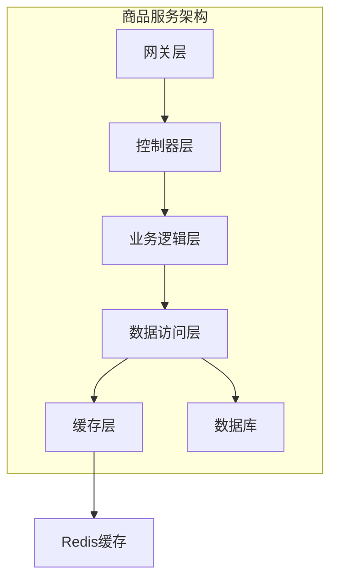
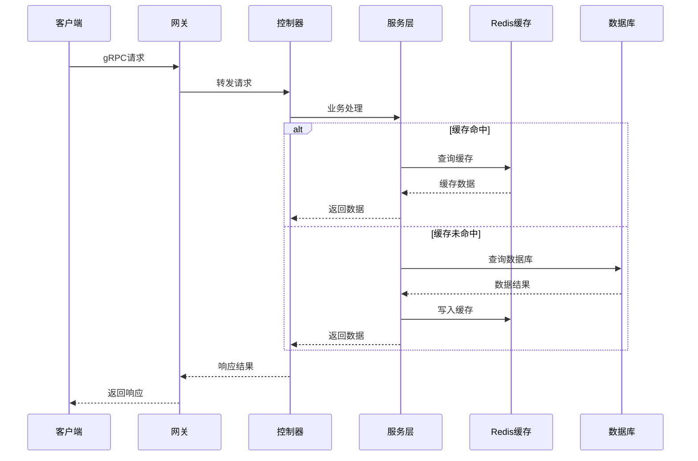
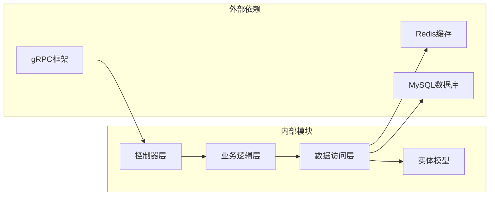

# 商品相关API

<cite>
**本文档引用的文件**
- [goods_info.go](file://app/goods/internal/controller/goods_info/goods_info.go)
- [category_info.go](file://app/goods/internal/controller/category_info/category_info.go)
- [cart_info.go](file://app/goods/internal/controller/cart_info/cart_info.go)
- [cart_info.go](file://app/goods/internal/logic/cart_info/cart_info.go)
- [goods.go](file://app/goods/utility/goodsRedis/goods.go)
- [goods_info.pb.go](file://app/goods/api/goods_info/v1/goods_info.pb.go)
- [category_info.pb.go](file://app/goods/api/category_info/v1/category_info.pb.go)
- [cart_info.pb.go](file://app/goods/api/cart_info/v1/cart_info.pb.go)
- [coupon_info.pb.go](file://app/goods/api/coupon_info/v1/coupon_info.pb.go)
- [goods_images.pb.go](file://app/goods/api/goods_images/v1/goods_images.pb.go)
- [bargain_info.pb.go](file://app/goods/api/bargain_info/v1/bargain_info.pb.go)
- [recommend_goods_info.pb.go](file://app/goods/api/recommend_goods_info/v1/recommend_goods_info.pb.go)
</cite>

## 目录
1. [简介](#简介)
2. [项目结构](#项目结构)
3. [核心组件](#核心组件)
4. [架构概览](#架构概览)
5. [详细组件分析](#详细组件分析)
6. [依赖关系分析](#依赖关系分析)
7. [性能考虑](#性能考虑)
8. [故障排除指南](#故障排除指南)
9. [结论](#结论)

## 简介

本文档详细记录了商品相关API接口，涵盖商品浏览、分类管理、购物车操作、商品图片、砍价功能、推荐商品、优惠券等功能模块。系统基于GoFrame框架和gRPC协议构建，采用微服务架构设计，通过Redis缓存提升性能，通过数据库事务保证数据一致性。

## 项目结构

商品相关功能主要分布在以下模块中：



**图表来源**
- [goods_info.go](file://app/goods/internal/controller/goods_info/goods_info.go#L1-L257)
- [category_info.go](file://app/goods/internal/controller/category_info/category_info.go#L1-L204)
- [cart_info.go](file://app/goods/internal/controller/cart_info/cart_info.go#L1-L71)

**章节来源**
- [goods_info.go](file://app/goods/internal/controller/goods_info/goods_info.go#L1-L257)
- [category_info.go](file://app/goods/internal/controller/category_info/category_info.go#L1-L204)
- [cart_info.go](file://app/goods/internal/controller/cart_info/cart_info.go#L1-L71)

## 核心组件

### 商品信息服务
- **功能范围**: 商品列表查询、商品详情获取、商品创建、更新、删除
- **缓存策略**: Redis缓存商品详情，防止缓存穿透
- **性能优化**: 分页查询、索引优化、批量库存查询

### 分类信息服务  
- **功能范围**: 分类列表查询、分类详情获取、分类创建、更新、删除
- **缓存策略**: 全量分类数据缓存，支持热更新
- **数据完整性**: 支持层级分类结构

### 购物车服务
- **功能范围**: 购物车列表查询、商品添加、商品删除
- **联表查询**: 购物车与商品信息联合查询
- **数据同步**: 用户维度的数据隔离

### 图片服务
- **功能范围**: 商品图片关联、图片列表查询、图片删除
- **文件管理**: 与文件服务集成

### 砍价服务
- **功能范围**: 砍价信息创建、查询、删除
- **时间管理**: 创建时间和过期时间控制

### 推荐服务
- **功能范围**: 商品推荐列表获取
- **算法集成**: 支持多种推荐策略

**章节来源**
- [goods_info.go](file://app/goods/internal/controller/goods_info/goods_info.go#L31-L256)
- [category_info.go](file://app/goods/internal/controller/category_info/category_info.go#L29-L203)
- [cart_info.go](file://app/goods/internal/controller/cart_info/cart_info.go#L23-L70)

## 架构概览



**图表来源**
- [goods_info.go](file://app/goods/internal/controller/goods_info/goods_info.go#L94-L158)
- [goods.go](file://app/goods/utility/goodsRedis/goods.go#L25-L52)

## 详细组件分析

### 商品管理API

#### 商品列表查询
**HTTP方法**: GET  
**URL路径**: `/goods/list`  
**请求参数**:
- page: uint32 - 页码，默认1
- size: uint32 - 每页数量，默认10  
- is_hot: uint32 - 是否热门商品，1表示热门

**响应格式**:
```json
{
  "data": {
    "list": [
      {
        "id": 1,
        "name": "商品名称",
        "price": 1000,
        "pic_url": "图片地址",
        "stock": 100,
        "sale": 50
      }
    ],
    "page": 1,
    "size": 10,
    "total": 100
  }
}
```

**错误码**:
- 200: 成功
- 500: 数据库操作错误
- 404: 商品不存在

#### 商品详情获取
**HTTP方法**: GET  
**URL路径**: `/goods/detail/{id}`  
**请求参数**:
- id: uint32 - 商品ID

**缓存策略**:
- Redis缓存商品详情，缓存时间为1小时
- 空值缓存防止缓存穿透，缓存时间为1分钟

**响应格式**:
```json
{
  "data": {
    "id": 1,
    "name": "商品名称",
    "price": 1000,
    "images": "图片列表",
    "detail_info": "商品详情",
    "stock": 100,
    "sale": 50,
    "created_at": "2023-01-01T00:00:00Z",
    "updated_at": "2023-01-01T00:00:00Z"
  }
}
```

#### 商品库存查询
**HTTP方法**: POST  
**URL路径**: `/goods/stock`  
**请求参数**:
```json
{
  "goods_ids": [1, 2, 3]
}
```

**响应格式**:
```json
{
  "goods_stock": {
    "1": 100,
    "2": 50,
    "3": 0
  }
}
```

**章节来源**
- [goods_info.pb.go](file://app/goods/api/goods_info/v1/goods_info.pb.go#L571-L741)
- [goods_info.go](file://app/goods/internal/controller/goods_info/goods_info.go#L31-L91)

### 分类管理API

#### 分类列表查询
**HTTP方法**: GET  
**URL路径**: `/categories`  
**请求参数**:
- sort: uint32 - 排序条件
- page: uint32 - 页码
- size: uint32 - 每页数量

**响应格式**:
```json
{
  "data": {
    "list": [
      {
        "id": 1,
        "parent_id": 0,
        "name": "分类名称",
        "pic_url": "图标地址",
        "level": 1,
        "sort": 1
      }
    ],
    "page": 1,
    "size": 10,
    "total": 10
  }
}
```

#### 分类全量查询
**HTTP方法**: GET  
**URL路径**: `/categories/all`  

**缓存策略**: 全量分类数据缓存，缓存时间为7天

**响应格式**:
```json
{
  "list": [
    {
      "id": 1,
      "parent_id": 0,
      "name": "分类名称",
      "pic_url": "图标地址",
      "level": 1,
      "sort": 1,
      "created_at": "2023-01-01T00:00:00Z",
      "updated_at": "2023-01-01T00:00:00Z",
      "deleted_at": "2023-01-01T00:00:00Z"
    }
  ],
  "total": 10
}
```

**章节来源**
- [category_info.pb.go](file://app/goods/api/category_info/v1/category_info.pb.go#L354-L653)
- [category_info.go](file://app/goods/internal/controller/category_info/category_info.go#L29-L154)

### 购物车API

#### 购物车列表查询
**HTTP方法**: GET  
**URL路径**: `/cart`  
**请求参数**:
- page: uint32 - 页码
- size: uint32 - 每页数量  
- user_id: uint32 - 用户ID

**联表查询**: 购物车信息与商品信息联合查询

**响应格式**:
```json
{
  "data": {
    "list": [
      {
        "id": 1,
        "user_id": 1,
        "count": 2,
        "goods_id": 1,
        "goods_name": "商品名称",
        "goods_pic_url": "图片地址",
        "goods_price": 1000,
        "goods_brand": "品牌",
        "goods_stock": 100,
        "goods_sale": 50,
        "goods_tags": "标签",
        "goods_sort": 1,
        "goods_created_at": "2023-01-01T00:00:00Z",
        "goods_updated_at": "2023-01-01T00:00:00Z"
      }
    ],
    "page": 1,
    "size": 10,
    "total": 10
  }
}
```

#### 添加商品到购物车
**HTTP方法**: POST  
**URL路径**: `/cart`  
**请求参数**:
```json
{
  "goods_id": 1,
  "count": 2,
  "user_id": 1
}
```

**响应格式**:
```json
{
  "id": 1
}
```

#### 从购物车删除商品
**HTTP方法**: DELETE  
**URL路径**: `/cart/{id}`  
**请求参数**:
- id: uint32 - 购物车项ID
- user_id: uint32 - 用户ID

**章节来源**
- [cart_info.pb.go](file://app/goods/api/cart_info/v1/cart_info.pb.go#L590-L659)
- [cart_info.go](file://app/goods/internal/controller/cart_info/cart_info.go#L23-L70)
- [cart_info.go](file://app/goods/internal/logic/cart_info/cart_info.go#L34-L107)

### 优惠券API

#### 优惠券列表查询
**HTTP方法**: GET  
**URL路径**: `/coupons`  
**请求参数**:
- page: uint32 - 页码
- size: uint32 - 每页数量

#### 创建优惠券
**HTTP方法**: POST  
**URL路径**: `/coupons`  
**请求参数**:
```json
{
  "goods_id": 0,
  "name": "优惠券名称",
  "type": 0,
  "amount": 100,
  "deadline": "2023-12-31"
}
```

**优惠券类型**:
- 0: 新人券
- 1: 活动券  
- 2: 其他券

**章节来源**
- [coupon_info.pb.go](file://app/goods/api/coupon_info/v1/coupon_info.pb.go#L554-L625)

### 商品图片API

#### 图片列表查询
**HTTP方法**: GET  
**URL路径**: `/goods/{goods_id}/images`  
**请求参数**:
- page: uint32 - 页码
- size: uint32 - 每页数量

#### 关联商品图片
**HTTP方法**: POST  
**URL路径**: `/goods/images`  
**请求参数**:
```json
{
  "goods_id": 1,
  "file_id": 1,
  "sort": 1
}
```

**章节来源**
- [goods_images.pb.go](file://app/goods/api/goods_images/v1/goods_images.pb.go#L398-L464)

### 砍价API

#### 砍价信息创建
**HTTP方法**: POST  
**URL路径**: `/bargain`  
**请求参数**:
```json
{
  "user_id": 1,
  "goods_id": 1,
  "counts": 10
}
```

#### 砍价信息查询
**HTTP方法**: GET  
**URL路径**: `/bargain`  
**请求参数**:
- id: int32 - 砍价信息ID
- user_id: int32 - 用户ID
- goods_id: int32 - 商品ID

#### 删除砍价信息
**HTTP方法**: DELETE  
**URL路径**: `/bargain/{id}`  
**请求参数**:
- id: int32 - 砍价信息ID
- user_id: int32 - 用户ID
- goods_id: int32 - 商品ID

**章节来源**
- [bargain_info.pb.go](file://app/goods/api/bargain_info/v1/bargain_info.pb.go#L512-L584)

### 推荐商品API

#### 推荐商品列表
**HTTP方法**: GET  
**URL路径**: `/recommend`  
**请求参数**:
- id: uint32 - 当前商品ID
- count: uint32 - 推荐数量

**响应格式**:
```json
{
  "data": {
    "list": [
      {
        "id": 1,
        "name": "商品名称",
        "price": 1000,
        "pic_url": "图片地址",
        "stock": 100,
        "sale": 50
      }
    ],
    "total": 10
  }
}
```

**章节来源**
- [recommend_goods_info.pb.go](file://app/goods/api/recommend_goods_info/v1/recommend_goods_info.pb.go#L354-L411)

## 依赖关系分析



**图表来源**
- [goods_info.go](file://app/goods/internal/controller/goods_info/goods_info.go#L1-L257)
- [goods.go](file://app/goods/utility/goodsRedis/goods.go#L1-L121)

### 核心依赖关系

1. **缓存依赖**: Redis作为主要缓存存储，支持商品详情和分类全量数据缓存
2. **数据库依赖**: MySQL存储商品、分类、购物车等核心数据
3. **框架依赖**: GoFrame提供Web框架、ORM、gRPC支持
4. **时间管理**: 时间戳处理统一通过工具函数进行转换

**章节来源**
- [goods.go](file://app/goods/utility/goodsRedis/goods.go#L12-L16)
- [goods_info.go](file://app/goods/internal/controller/goods_info/goods_info.go#L1-L21)

## 性能考虑

### 缓存策略
- **商品详情缓存**: 1小时有效期，防止缓存穿透使用空值标记
- **分类全量缓存**: 7天有效期，支持热更新机制
- **批量操作**: 库存查询支持批量获取，减少数据库压力

### 查询优化
- **分页查询**: 所有列表查询都支持分页，避免大数据量查询
- **索引优化**: 关键查询字段建立适当索引
- **联表查询**: 购物车查询使用LEFT JOIN优化性能

### 错误处理
- **超时控制**: 缓存操作设置100ms超时，避免阻塞主业务
- **降级策略**: 缓存失败时直接查询数据库
- **日志记录**: 详细的错误日志便于问题排查

## 故障排除指南

### 常见问题及解决方案

#### 缓存穿透问题
**现象**: 查询不存在的商品返回空数据
**解决方案**: 
- 使用空值缓存标记
- 设置短时间缓存（1分钟）
- 防止恶意请求刷缓存

#### 缓存雪崩问题  
**现象**: 大量缓存同时过期导致数据库压力剧增
**解决方案**:
- 缓存时间增加随机因子
- 设置热点数据永不过期
- 使用分布式锁避免并发重建

#### 数据不一致问题
**现象**: 缓存与数据库数据不一致
**解决方案**:
- 更新数据库后及时删除缓存
- 使用延迟双删策略
- 实现缓存预热机制

#### 性能问题
**现象**: 接口响应时间过长
**解决方案**:
- 优化SQL查询语句
- 增加适当的索引
- 调整分页大小和查询条件

**章节来源**
- [goods_info.go](file://app/goods/internal/controller/goods_info/goods_info.go#L94-L128)
- [goods.go](file://app/goods/utility/goodsRedis/goods.go#L18-L36)

## 结论

本商品相关API接口设计完整，涵盖了电商系统的核心功能需求。系统采用微服务架构，通过合理的缓存策略和数据库优化，能够满足高并发场景下的性能要求。各模块职责清晰，接口规范统一，为后续功能扩展和系统维护提供了良好的基础。

建议在生产环境中重点关注：
1. 缓存策略的持续优化
2. 数据库性能监控和调优
3. 分布式事务的一致性保障
4. 接口安全性和限流策略