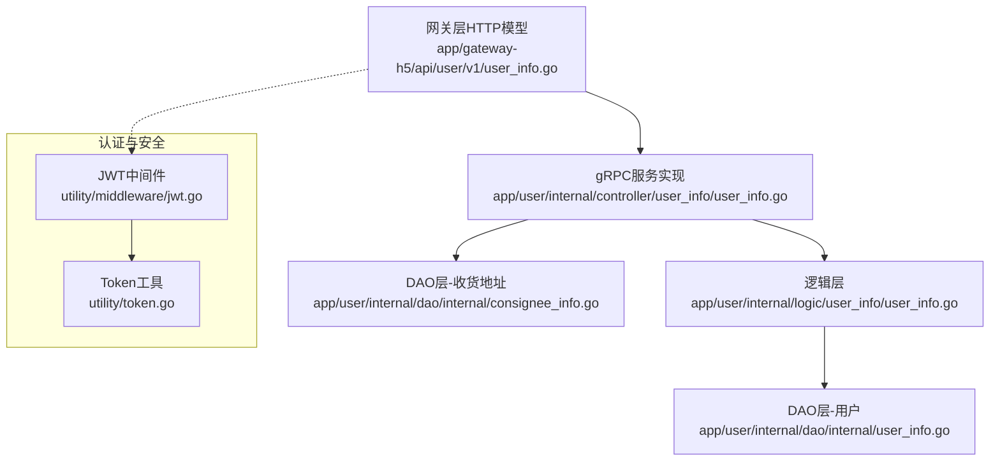
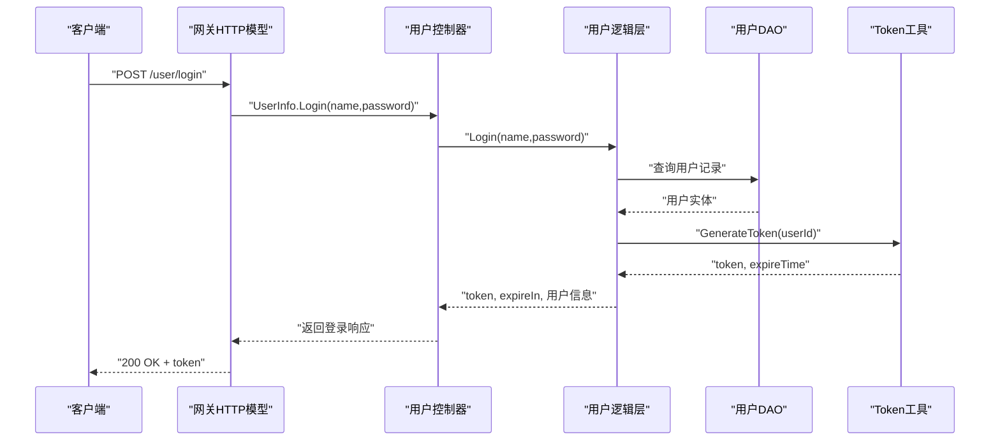
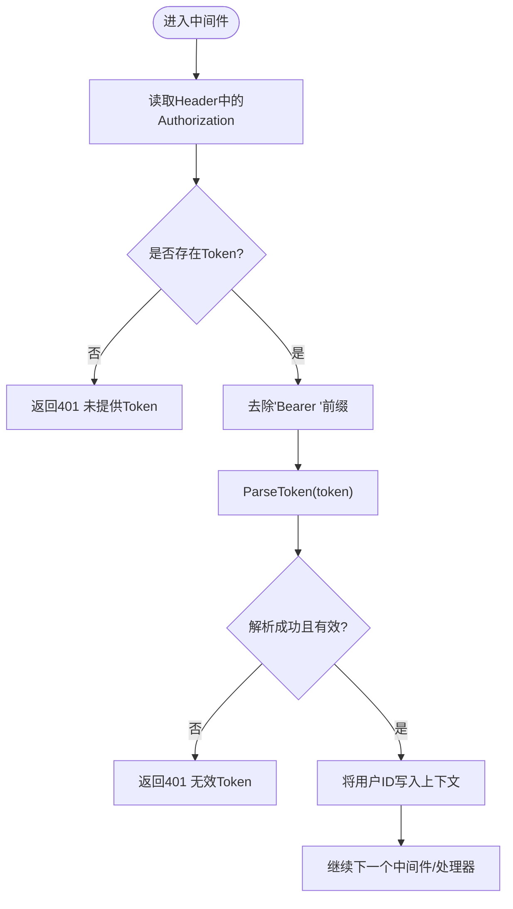
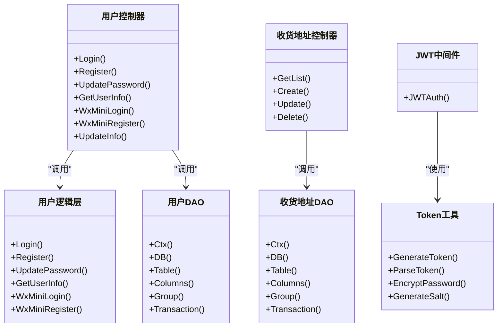

# 用户相关API

<cite>
**本文引用的文件**
- [app/user/internal/controller/user_info/user_info.go](file://app/user/internal/controller/user_info/user_info.go)
- [app/user/internal/controller/consignee_info/consignee_info.go](file://app/user/internal/controller/consignee_info/consignee_info.go)
- [app/user/manifest/protobuf/user_info/v1/user_info.proto](file://app/user/manifest/protobuf/user_info/v1/user_info.proto)
- [app/user/manifest/protobuf/consignee_info/v1/consignee_info.proto](file://app/user/manifest/protobuf/consignee_info/v1/consignee_info.proto)
- [app/gateway-h5/api/user/v1/user_info.go](file://app/gateway-h5/api/user/v1/user_info.go)
- [utility/middleware/jwt.go](file://utility/middleware/jwt.go)
- [utility/token.go](file://utility/token.go)
- [app/user/internal/logic/user_info/user_info.go](file://app/user/internal/logic/user_info/user_info.go)
- [app/user/internal/dao/internal/user_info.go](file://app/user/internal/dao/internal/user_info.go)
- [app/user/internal/dao/internal/consignee_info.go](file://app/user/internal/dao/internal/consignee_info.go)
</cite>

## 目录
1. [简介](#简介)
2. [项目结构](#项目结构)
3. [核心组件](#核心组件)
4. [架构总览](#架构总览)
5. [详细组件分析](#详细组件分析)
6. [依赖关系分析](#依赖关系分析)
7. [性能考虑](#性能考虑)
8. [故障排查指南](#故障排查指南)
9. [结论](#结论)
10. [附录](#附录)

## 简介
本文件面向前端与测试工程师，系统化梳理“用户相关API”的接口定义、请求与响应格式、参数校验规则、JWT认证流程以及常见错误场景。内容覆盖用户认证登录（用户名/密码、微信小程序）、用户信息管理（查询、更新、密码修改）、收货地址管理（分页列表、新增、更新、删除）。所有接口均以gRPC/Protobuf定义为核心，配合网关层HTTP模型进行参数校验与路由。

## 项目结构
围绕用户模块的关键文件组织如下：
- Protobuf定义：用户服务与收货地址服务的接口与消息体定义
- 网关层HTTP模型：对gRPC接口进行HTTP映射与参数校验
- 控制器层：gRPC服务端实现，调用逻辑层与DAO层
- 逻辑层：业务规则与数据处理
- DAO层：数据库访问抽象
- 中间件：JWT认证中间件

图表来源
- [app/gateway-h5/api/user/v1/user_info.go](file://app/gateway-h5/api/user/v1/user_info.go#L1-L118)
- [app/user/internal/controller/user_info/user_info.go](file://app/user/internal/controller/user_info/user_info.go#L1-L268)
- [app/user/internal/logic/user_info/user_info.go](file://app/user/internal/logic/user_info/user_info.go#L1-L235)
- [app/user/internal/dao/internal/user_info.go](file://app/user/internal/dao/internal/user_info.go#L1-L106)
- [app/user/internal/dao/internal/consignee_info.go](file://app/user/internal/dao/internal/consignee_info.go#L1-L104)
- [utility/middleware/jwt.go](file://utility/middleware/jwt.go#L1-L39)
- [utility/token.go](file://utility/token.go#L1-L65)

章节来源
- [app/user/manifest/protobuf/user_info/v1/user_info.proto](file://app/user/manifest/protobuf/user_info/v1/user_info.proto#L1-L123)
- [app/user/manifest/protobuf/consignee_info/v1/consignee_info.proto](file://app/user/manifest/protobuf/consignee_info/v1/consignee_info.proto#L1-L73)
- [app/gateway-h5/api/user/v1/user_info.go](file://app/gateway-h5/api/user/v1/user_info.go#L1-L118)

## 核心组件
- 用户信息服务（gRPC）
  - 登录、注册、微信登录/注册、修改密码、更新信息、获取用户信息
- 收货地址服务（gRPC）
  - 分页列表、新增、更新、删除
- 网关HTTP模型
  - 定义HTTP路径、方法、参数校验规则
- JWT认证中间件
  - 从Header提取Authorization，去除Bearer前缀后解析Token，注入用户ID上下文

章节来源
- [app/user/manifest/protobuf/user_info/v1/user_info.proto](file://app/user/manifest/protobuf/user_info/v1/user_info.proto#L8-L23)
- [app/user/manifest/protobuf/consignee_info/v1/consignee_info.proto](file://app/user/manifest/protobuf/consignee_info/v1/consignee_info.proto#L9-L14)
- [app/gateway-h5/api/user/v1/user_info.go](file://app/gateway-h5/api/user/v1/user_info.go#L7-L118)
- [utility/middleware/jwt.go](file://utility/middleware/jwt.go#L16-L38)

## 架构总览
用户相关API采用“网关HTTP模型 + gRPC服务实现 + 逻辑层 + DAO层”的分层架构。网关层负责HTTP路由与参数校验；控制器层作为gRPC服务端实现，调用逻辑层完成业务处理；逻辑层封装业务规则与数据处理；DAO层负责数据库访问。

图表来源
- [app/gateway-h5/api/user/v1/user_info.go](file://app/gateway-h5/api/user/v1/user_info.go#L8-L20)
- [app/user/internal/controller/user_info/user_info.go](file://app/user/internal/controller/user_info/user_info.go#L37-L69)
- [app/user/internal/logic/user_info/user_info.go](file://app/user/internal/logic/user_info/user_info.go#L15-L51)
- [utility/token.go](file://utility/token.go#L31-L50)

## 详细组件分析

### 用户认证登录

- 接口一：用户名/密码登录
  - 方法与路径：POST /user/login
  - 请求参数
    - name：用户名（必填）
    - password：密码（必填）
  - 响应字段
    - type：token类型（固定为Bearer）
    - token：JWT字符串
    - expire_in：过期时间（秒）
    - user_info：用户基础信息
  - 参数校验
    - 必填项校验由网关层注解定义
  - 错误码
    - 未提供Token或无效Token：401（由JWT中间件抛出）
    - 用户名/密码为空：业务错误（控制器包装为数据库操作错误）
    - 用户不存在：业务错误
    - 密码错误：业务错误
    - 生成token错误：业务错误
  - 示例
    - 请求示例：POST /user/login，Body: {"name":"张三","password":"123456"}
    - 响应示例：{"type":"Bearer","token":"...","expire_in":86400,"user_info":{"id":1,"name":"张三","avatar":"","sex":0,"sign":"","status":1}}

- 接口二：微信小程序登录
  - 方法与路径：POST /user/wxMiniLogin
  - 请求参数
    - code：临时登录凭证（必填）
  - 响应字段
    - type、token、expire_in：同上
    - openId：微信用户唯一标识
    - is_first_login：是否首次登录（需绑定手机号）
    - user_info：用户基础信息
  - 参数校验
    - code必填
  - 错误码
    - 授权请求失败：500
    - 用户不存在且非首次登录：业务错误
    - 生成token错误：业务错误

- 接口三：微信小程序注册
  - 方法与路径：POST /user/wxMiniRegister
  - 请求参数
    - code：临时登录凭证（必填）
    - iv：初始向量
    - encryptedData：加密数据
    - nickname、avatar：可选，若缺失则从微信解密数据填充
  - 响应字段
    - type、token、expire_in、openId、user_info：同上
  - 参数校验
    - code必填
  - 错误码
    - 授权请求失败：500
    - 解析数据失败：500
    - 已注册用户：业务错误
    - 创建用户失败：业务错误
    - 生成token错误：业务错误

章节来源
- [app/gateway-h5/api/user/v1/user_info.go](file://app/gateway-h5/api/user/v1/user_info.go#L8-L105)
- [app/user/manifest/protobuf/user_info/v1/user_info.proto](file://app/user/manifest/protobuf/user_info/v1/user_info.proto#L8-L81)
- [app/user/internal/controller/user_info/user_info.go](file://app/user/internal/controller/user_info/user_info.go#L37-L187)
- [app/user/internal/logic/user_info/user_info.go](file://app/user/internal/logic/user_info/user_info.go#L15-L51)

### 用户信息管理

- 接口四：获取用户信息
  - 方法与路径：GET /user/info
  - 请求参数：无
  - 响应字段：user_info（用户基础信息）
  - 参数校验：无
  - 错误码：用户不存在时返回业务错误

- 接口五：更新用户信息
  - 方法与路径：PUT /user/update
  - 请求参数
    - name：昵称
    - avatar：头像key
  - 响应字段：id（用户ID）
  - 参数校验：无
  - 错误码：数据库操作错误

- 接口六：修改密码
  - 方法与路径：PUT /user/update/password
  - 请求参数
    - password：新密码（必填）
    - secret_answer：密保问题的答案（必填）
  - 响应字段：id（用户ID）
  - 参数校验：必填项校验
  - 错误码
    - 用户不存在：业务错误
    - 密保答案错误：业务错误
    - 系统错误：数据库更新失败

章节来源
- [app/gateway-h5/api/user/v1/user_info.go](file://app/gateway-h5/api/user/v1/user_info.go#L38-L105)
- [app/user/manifest/protobuf/user_info/v1/user_info.proto](file://app/user/manifest/protobuf/user_info/v1/user_info.proto#L84-L113)
- [app/user/internal/controller/user_info/user_info.go](file://app/user/internal/controller/user_info/user_info.go#L112-L200)
- [app/user/internal/logic/user_info/user_info.go](file://app/user/internal/logic/user_info/user_info.go#L95-L131)

### 收货地址管理

- 接口七：收货地址分页列表
  - 方法与路径：GET /user/address/list
  - 请求参数
    - page：页码
    - size：每页条数
    - user_id：用户ID（必填）
  - 响应字段
    - data.list：地址列表
    - data.page、data.size、data.total：分页信息
  - 参数校验：user_id必填
  - 错误码：数据库查询错误

- 接口八：新增收货地址
  - 方法与路径：POST /user/address/create
  - 请求参数
    - user_id：用户ID
    - is_default：是否默认地址
    - name、phone：收货人姓名与电话
    - province、city、town、street、detail：省市区与详细地址
  - 响应字段：id（新增地址ID）
  - 错误码：数据库插入错误

- 接口九：更新收货地址
  - 方法与路径：PUT /user/address/update
  - 请求参数：同新增，含id
  - 响应字段：id（更新地址ID）
  - 错误码：数据库更新错误

- 接口十：删除收货地址
  - 方法与路径：DELETE /user/address/delete
  - 请求参数：id（地址ID）
  - 响应字段：空
  - 错误码：数据库删除错误

章节来源
- [app/user/manifest/protobuf/consignee_info/v1/consignee_info.proto](file://app/user/manifest/protobuf/consignee_info/v1/consignee_info.proto#L9-L73)
- [app/user/internal/controller/consignee_info/consignee_info.go](file://app/user/internal/controller/consignee_info/consignee_info.go#L27-L122)

### JWT认证方式与参数验证

- JWT认证流程
  - Header携带：Authorization: Bearer <token>
  - 中间件解析：移除Bearer前缀，调用工具函数解析token
  - 成功：将用户ID写入请求上下文，继续后续处理
  - 失败：返回401未授权错误
- Token生成与解析
  - 有效期：24小时
  - 签名算法：HS256
  - Claims：包含用户ID及标准声明
- 参数验证规则
  - 网关层通过注解定义必填与校验提示
  - 业务层补充复杂规则（如密码长度、用户名唯一性）

图表来源
- [utility/middleware/jwt.go](file://utility/middleware/jwt.go#L16-L38)
- [utility/token.go](file://utility/token.go#L52-L64)

章节来源
- [utility/middleware/jwt.go](file://utility/middleware/jwt.go#L1-L39)
- [utility/token.go](file://utility/token.go#L1-L65)
- [app/gateway-h5/api/user/v1/user_info.go](file://app/gateway-h5/api/user/v1/user_info.go#L8-L105)

## 依赖关系分析

图表来源
- [app/user/internal/controller/user_info/user_info.go](file://app/user/internal/controller/user_info/user_info.go#L29-L35)
- [app/user/internal/logic/user_info/user_info.go](file://app/user/internal/logic/user_info/user_info.go#L1-L235)
- [app/user/internal/dao/internal/user_info.go](file://app/user/internal/dao/internal/user_info.go#L14-L106)
- [app/user/internal/controller/consignee_info/consignee_info.go](file://app/user/internal/controller/consignee_info/consignee_info.go#L19-L25)
- [app/user/internal/dao/internal/consignee_info.go](file://app/user/internal/dao/internal/consignee_info.go#L14-L104)
- [utility/middleware/jwt.go](file://utility/middleware/jwt.go#L16-L38)
- [utility/token.go](file://utility/token.go#L31-L64)

章节来源
- [app/user/internal/controller/user_info/user_info.go](file://app/user/internal/controller/user_info/user_info.go#L1-L268)
- [app/user/internal/controller/consignee_info/consignee_info.go](file://app/user/internal/controller/consignee_info/consignee_info.go#L1-L122)
- [app/user/internal/logic/user_info/user_info.go](file://app/user/internal/logic/user_info/user_info.go#L1-L235)
- [app/user/internal/dao/internal/user_info.go](file://app/user/internal/dao/internal/user_info.go#L1-L106)
- [app/user/internal/dao/internal/consignee_info.go](file://app/user/internal/dao/internal/consignee_info.go#L1-L104)
- [utility/middleware/jwt.go](file://utility/middleware/jwt.go#L1-L39)
- [utility/token.go](file://utility/token.go#L1-L65)

## 性能考虑
- Token有效期：24小时，减少频繁刷新开销
- 参数校验前置：网关层注解快速拒绝非法请求
- 数据库访问：DAO层统一事务与上下文传递，避免重复连接
- 日志与错误包装：统一错误码包装，便于定位问题

## 故障排查指南
- 401未授权
  - 检查Header是否包含Authorization: Bearer <token>
  - 确认token未过期且签名正确
- 登录失败
  - 用户名/密码为空：检查必填参数
  - 用户不存在：确认用户名是否正确
  - 密码错误：确认加密规则与盐值一致
- 注册失败
  - 用户名已存在：更换用户名
  - 密码长度不足：至少6位
- 修改密码失败
  - 密保答案错误：核对密保问题
  - 数据库更新失败：检查字段映射与权限
- 收货地址异常
  - 分页查询失败：检查page/size与user_id
  - 新增/更新/删除失败：检查必填字段与主键

章节来源
- [app/user/internal/controller/user_info/user_info.go](file://app/user/internal/controller/user_info/user_info.go#L42-L46)
- [app/user/internal/logic/user_info/user_info.go](file://app/user/internal/logic/user_info/user_info.go#L17-L29)
- [app/user/internal/controller/consignee_info/consignee_info.go](file://app/user/internal/controller/consignee_info/consignee_info.go#L40-L54)

## 结论
本文档基于gRPC/Protobuf定义与网关HTTP模型，系统化梳理了用户认证、信息管理与收货地址管理的接口规范与实现要点。通过JWT中间件与参数校验机制，确保接口的安全性与稳定性。建议在联调阶段优先验证认证流程与必填参数校验，再逐步扩展到业务细节。

## 附录

### 接口一览表
- 用户认证登录
  - POST /user/login
  - POST /user/wxMiniLogin
  - POST /user/wxMiniRegister
- 用户信息管理
  - GET /user/info
  - PUT /user/update
  - PUT /user/update/password
- 收货地址管理
  - GET /user/address/list
  - POST /user/address/create
  - PUT /user/address/update
  - DELETE /user/address/delete

### 参数与响应字段速查
- 用户登录响应
  - type、token、expire_in、user_info.id/name/avatar/sex/sign/status
- 微信登录响应
  - type、token、expire_in、openId、is_first_login、user_info
- 用户信息响应
  - user_info
- 修改密码响应
  - id
- 收货地址列表响应
  - data.page、data.size、data.total、data.list[*].user_id/is_default/name/phone/province/city/town/street/detail

章节来源
- [app/gateway-h5/api/user/v1/user_info.go](file://app/gateway-h5/api/user/v1/user_info.go#L14-L117)
- [app/user/manifest/protobuf/user_info/v1/user_info.proto](file://app/user/manifest/protobuf/user_info/v1/user_info.proto#L45-L123)
- [app/user/manifest/protobuf/consignee_info/v1/consignee_info.proto](file://app/user/manifest/protobuf/consignee_info/v1/consignee_info.proto#L64-L73)