# 订单相关API

<cite>
**本文档引用的文件**
- [app/order/api/order_info/v1/order_info.pb.go](file://app/order/api/order_info/v1/order_info.pb.go)
- [app/order/api/refund_info/v1/refund_info.pb.go](file://app/order/api/refund_info/v1/refund_info.pb.go)
- [app/order/internal/controller/order_info/order_info.go](file://app/order/internal/controller/order_info/order_info.go)
- [app/order/internal/controller/refund_info/refund_info.go](file://app/order/internal/controller/refund_info/refund_info.go)
- [app/order/internal/model/entity/order_info.go](file://app/order/internal/model/entity/order_info.go)
- [app/order/internal/model/entity/refund_info.go](file://app/order/internal/model/entity/refund_info.go)
- [app/order/internal/consts/order_status.go](file://app/order/internal/consts/order_status.go)
- [app/order/utility/payment/wxchat.go](file://app/order/utility/payment/wxchat.go)
- [app/order/internal/dao/order_info.go](file://app/order/internal/dao/order_info.go)
- [app/order/internal/dao/refund_info.go](file://app/order/internal/dao/refund_info.go)
</cite>

## 目录
1. [简介](#简介)
2. [项目结构](#项目结构)
3. [核心组件](#核心组件)
4. [架构概览](#架构概览)
5. [详细组件分析](#详细组件分析)
6. [依赖关系分析](#依赖关系分析)
7. [性能考虑](#性能考虑)
8. [故障排除指南](#故障排除指南)
9. [结论](#结论)

## 简介

本文档详细描述了微服务架构中的订单相关API接口，包括订单创建、订单管理、退款处理等完整功能。该系统基于GoFrame框架构建，采用微服务架构，通过gRPC提供服务间通信。

系统支持完整的电商订单生命周期管理，包括订单创建、支付处理、状态流转、退款申请和处理等功能。所有接口均采用Protocol Buffers进行序列化，确保跨语言兼容性和高性能。

## 项目结构

订单相关模块采用清晰的分层架构：

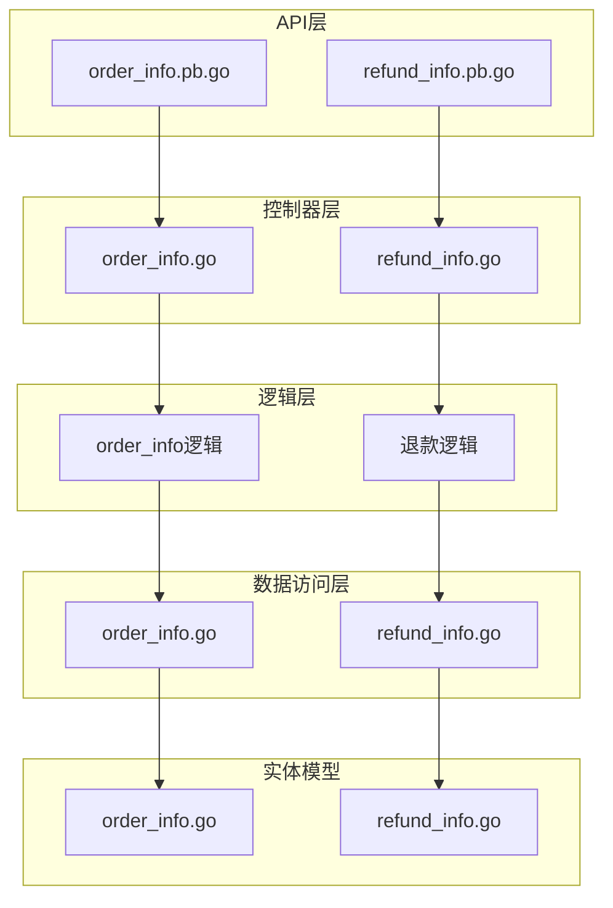

**图表来源**
- [app/order/api/order_info/v1/order_info.pb.go](file://app/order/api/order_info/v1/order_info.pb.go#L1-L800)
- [app/order/internal/controller/order_info/order_info.go](file://app/order/internal/controller/order_info/order_info.go#L1-L188)

**章节来源**
- [app/order/api/order_info/v1/order_info.pb.go](file://app/order/api/order_info/v1/order_info.pb.go#L1-L800)
- [app/order/internal/controller/order_info/order_info.go](file://app/order/internal/controller/order_info/order_info.go#L1-L188)

## 核心组件

### 订单服务接口

订单服务提供以下核心接口：

1. **订单创建** - 创建新订单
2. **订单查询** - 获取订单详情
3. **订单列表** - 分页查询订单列表
4. **订单支付** - 处理支付请求
5. **支付回调** - 处理微信支付回调
6. **订单取消** - 取消未支付订单
7. **订单统计** - 获取订单状态统计

### 退款服务接口

退款服务提供以下核心接口：

1. **退款申请** - 创建退款申请
2. **退款查询** - 查询退款详情
3. **退款列表** - 分页查询退款列表
4. **退款回调** - 处理微信退款回调

**章节来源**
- [app/order/internal/controller/order_info/order_info.go](file://app/order/internal/controller/order_info/order_info.go#L28-L188)
- [app/order/internal/controller/refund_info/refund_info.go](file://app/order/internal/controller/refund_info/refund_info.go#L1-L156)

## 架构概览

系统采用微服务架构，订单服务独立部署，通过gRPC提供服务间通信：

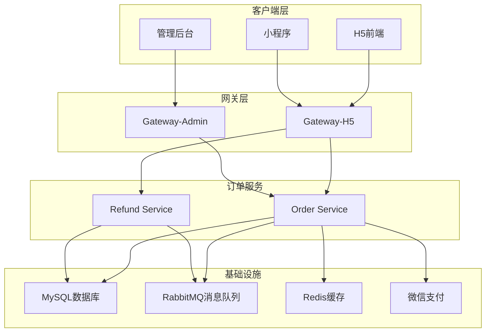

**图表来源**
- [app/order/internal/controller/order_info/order_info.go](file://app/order/internal/controller/order_info/order_info.go#L1-L188)
- [app/order/utility/payment/wxchat.go](file://app/order/utility/payment/wxchat.go#L1-L328)

## 详细组件分析

### 订单创建接口

#### 接口定义

**HTTP方法**: POST  
**URL路径**: `/order/v1/create`  
**请求参数**: OrderInfoCreateReq

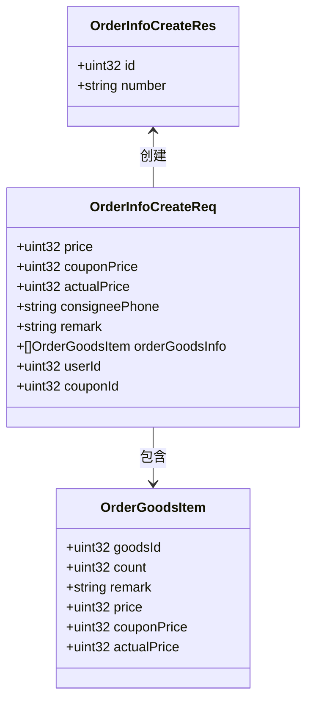

**图表来源**
- [app/order/api/order_info/v1/order_info.pb.go](file://app/order/api/order_info/v1/order_info.pb.go#L26-L42)
- [app/order/api/order_info/v1/order_info.pb.go](file://app/order/api/order_info/v1/order_info.pb.go#L132-L145)

#### 请求示例

```json
{
  "price": 10000,
  "couponPrice": 1000,
  "actualPrice": 9000,
  "consigneePhone": "13800001111",
  "remark": "客户备注",
  "orderGoodsInfo": [
    {
      "goodsId": 1001,
      "count": 2,
      "remark": "商品备注",
      "price": 5000,
      "couponPrice": 500,
      "actualPrice": 4500
    }
  ],
  "userId": 1,
  "couponId": 1
}
```

#### 响应示例

```json
{
  "id": 1001,
  "number": "ORD202401010001"
}
```

#### 处理流程

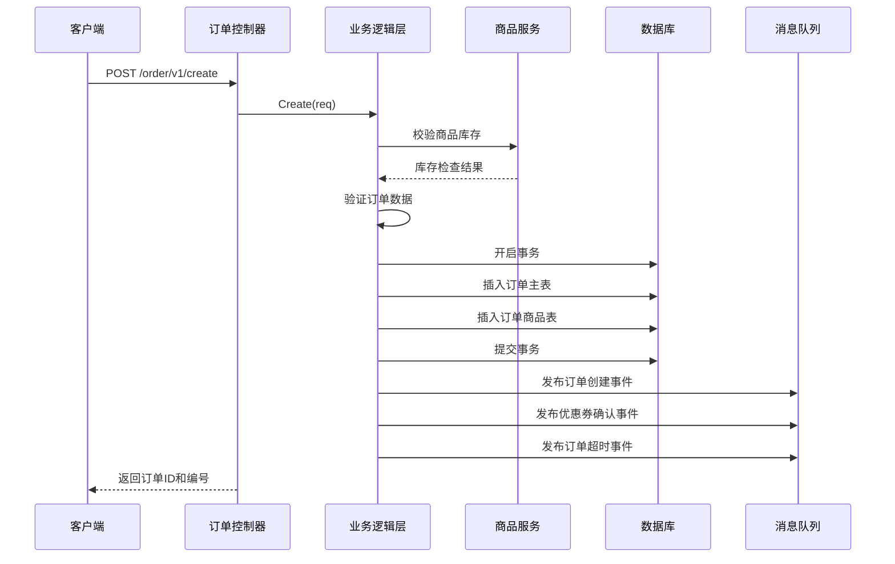

**图表来源**
- [app/order/internal/controller/order_info/order_info.go](file://app/order/internal/controller/order_info/order_info.go#L28-L37)
- [app/order/internal/logic/order_info/order_info.go](file://app/order/internal/logic/order_info/order_info.go#L27-L212)

**章节来源**
- [app/order/api/order_info/v1/order_info.pb.go](file://app/order/api/order_info/v1/order_info.pb.go#L26-L42)
- [app/order/internal/controller/order_info/order_info.go](file://app/order/internal/controller/order_info/order_info.go#L28-L37)
- [app/order/internal/logic/order_info/order_info.go](file://app/order/internal/logic/order_info/order_info.go#L27-L212)

### 订单支付接口

#### 接口定义

**HTTP方法**: POST  
**URL路径**: `/order/v1/payment`  
**请求参数**: PaymentReq

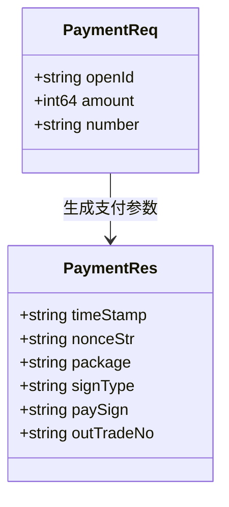

**图表来源**
- [app/order/api/order_info/v1/order_info.pb.go](file://app/order/api/order_info/v1/order_info.pb.go#L733-L742)
- [app/order/api/order_info/v1/order_info.pb.go](file://app/order/api/order_info/v1/order_info.pb.go#L797-L800)

#### 请求示例

```json
{
  "openId": "DEMO_WECHAT_OPEN_ID",
  "amount": 9000,
  "number": "ORD202401010001"
}
```

#### 响应示例

```json
{
  "timeStamp": "1704067200",
  "nonceStr": "abc123def456",
  "package": "prepay_id=wx202401010001",
  "signType": "RSA",
  "paySign": "signed_data_here",
  "outTradeNo": "ORD202401010001"
}
```

#### 支付流程

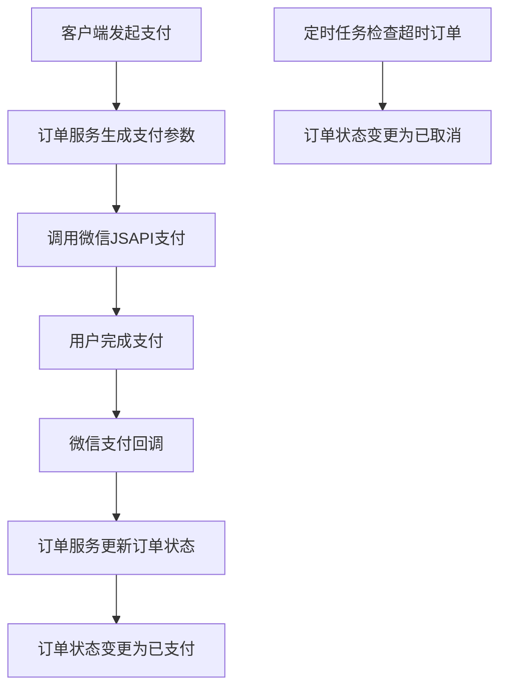

**图表来源**
- [app/order/internal/controller/order_info/order_info.go](file://app/order/internal/controller/order_info/order_info.go#L101-L118)
- [app/order/utility/payment/wxchat.go](file://app/order/utility/payment/wxchat.go#L83-L132)

**章节来源**
- [app/order/api/order_info/v1/order_info.pb.go](file://app/order/api/order_info/v1/order_info.pb.go#L733-L742)
- [app/order/internal/controller/order_info/order_info.go](file://app/order/internal/controller/order_info/order_info.go#L101-L118)
- [app/order/utility/payment/wxchat.go](file://app/order/utility/payment/wxchat.go#L83-L132)

### 订单查询接口

#### 接口定义

**HTTP方法**: GET  
**URL路径**: `/order/v1/detail/{orderId}`  
**请求参数**: OrderInfoGetDetailReq

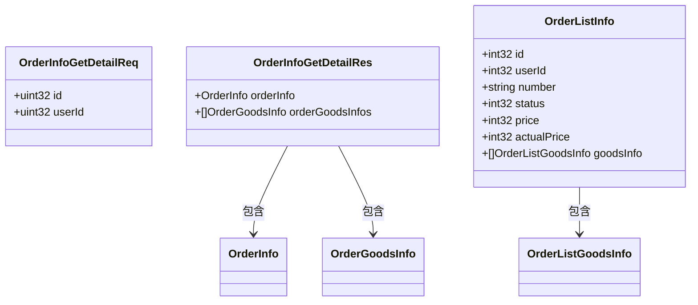

**图表来源**
- [app/order/api/order_info/v1/order_info.pb.go](file://app/order/api/order_info/v1/order_info.pb.go#L277-L285)
- [app/order/api/order_info/v1/order_info.pb.go](file://app/order/api/order_info/v1/order_info.pb.go#L333-L341)
- [app/order/api/order_info/v1/order_info.pb.go](file://app/order/api/order_info/v1/order_info.pb.go#L461-L474)

#### 请求示例

```json
{
  "id": 1001,
  "userId": 1
}
```

#### 响应示例

```json
{
  "orderInfo": {
    "id": 1001,
    "number": "ORD202401010001",
    "userId": 1,
    "status": 1,
    "price": 10000,
    "actualPrice": 9000,
    "consigneeName": "张三",
    "consigneePhone": "13800001111",
    "consigneeAddress": "北京市朝阳区xxx街道"
  },
  "orderGoodsInfos": [
    {
      "goodsId": 1001,
      "count": 2,
      "price": 5000,
      "couponPrice": 500,
      "actualPrice": 4500
    }
  ]
}
```

**章节来源**
- [app/order/api/order_info/v1/order_info.pb.go](file://app/order/api/order_info/v1/order_info.pb.go#L277-L285)
- [app/order/internal/controller/order_info/order_info.go](file://app/order/internal/controller/order_info/order_info.go#L39-L63)

### 订单列表接口

#### 接口定义

**HTTP方法**: GET  
**URL路径**: `/order/v1/list`  
**请求参数**: OrderInfoGetListReq

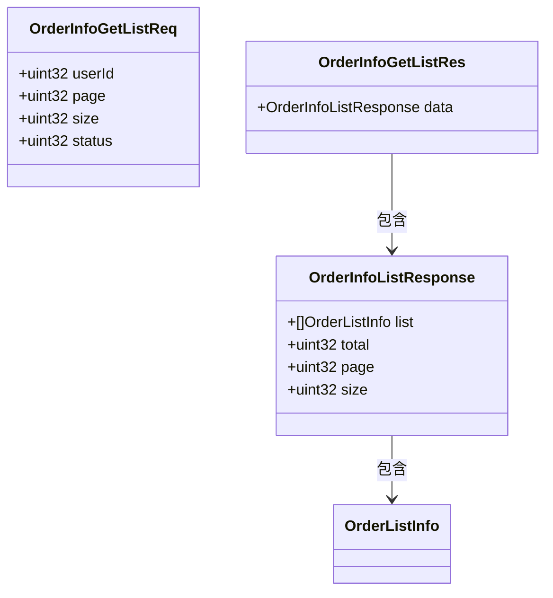

**图表来源**
- [app/order/api/order_info/v1/order_info.pb.go](file://app/order/api/order_info/v1/order_info.pb.go#L389-L399)
- [app/order/api/order_info/v1/order_info.pb.go](file://app/order/api/order_info/v1/order_info.pb.go#L685-L692)
- [app/order/api/order_info/v1/order_info.pb.go](file://app/order/api/order_info/v1/order_info.pb.go#L613-L623)

#### 请求示例

```json
{
  "userId": 1,
  "page": 1,
  "size": 10,
  "status": 1
}
```

#### 响应示例

```json
{
  "data": {
    "list": [
      {
        "id": 1001,
        "userId": 1,
        "number": "ORD202401010001",
        "status": 1,
        "price": 10000,
        "actualPrice": 9000,
        "goodsInfo": [
          {
            "goodsId": 1001,
            "count": 2
          }
        ]
      }
    ],
    "total": 1,
    "page": 1,
    "size": 10
  }
}
```

**章节来源**
- [app/order/api/order_info/v1/order_info.pb.go](file://app/order/api/order_info/v1/order_info.pb.go#L389-L399)
- [app/order/internal/controller/order_info/order_info.go](file://app/order/internal/controller/order_info/order_info.go#L65-L99)

### 订单取消接口

#### 接口定义

**HTTP方法**: POST  
**URL路径**: `/order/v1/cancel`  
**请求参数**: CancelOrderReq

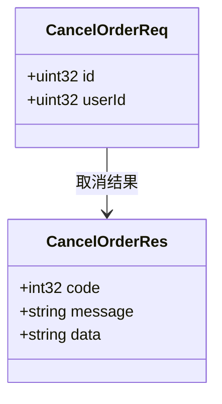

**图表来源**
- [app/order/api/order_info/v1/order_info.pb.go](file://app/order/api/order_info/v1/order_info.pb.go#L1-L200)
- [app/order/api/order_info/v1/order_info.pb.go](file://app/order/api/order_info/v1/order_info.pb.go#L1-L120)

#### 请求示例

```json
{
  "id": 1001,
  "userId": 1
}
```

#### 响应示例

```json
{
  "code": 0,
  "message": "订单取消成功",
  "data": ""
}
```

#### 取消规则

```mermaid
flowchart TD
A[用户请求取消订单] --> B{订单状态检查}
B --> |待支付(1)| C{用户身份验证}
B --> |其他状态| D[取消失败]
C --> |身份匹配| E[状态更新为已取消]
C --> |身份不匹配| F[权限不足]
E --> G[库存释放]
G --> H[优惠券退回]
H --> I[取消成功]
D --> J[返回错误信息]
F --> J
```

**图表来源**
- [app/order/internal/controller/order_info/order_info.go](file://app/order/internal/controller/order_info/order_info.go#L130-L187)

**章节来源**
- [app/order/internal/controller/order_info/order_info.go](file://app/order/internal/controller/order_info/order_info.go#L130-L187)

### 退款申请接口

#### 接口定义

**HTTP方法**: POST  
**URL路径**: `/refund/v1/create`  
**请求参数**: RefundInfoCreateReq

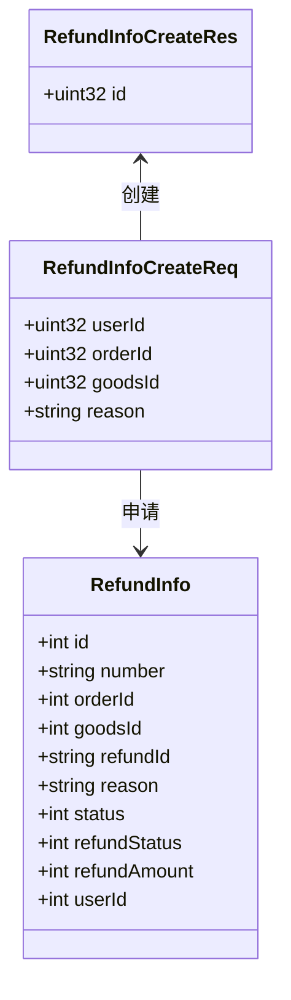

**图表来源**
- [app/order/api/refund_info/v1/refund_info.pb.go](file://app/order/api/refund_info/v1/refund_info.pb.go#L25-L35)
- [app/order/api/refund_info/v1/refund_info.pb.go](file://app/order/api/refund_info/v1/refund_info.pb.go#L97-L103)
- [app/order/internal/model/entity/refund_info.go](file://app/order/internal/model/entity/refund_info.go#L11-L27)

#### 请求示例

```json
{
  "userId": 1,
  "orderId": 1001,
  "goodsId": 1001,
  "reason": "七天无理由退货"
}
```

#### 响应示例

```json
{
  "id": 1
}
```

**章节来源**
- [app/order/api/refund_info/v1/refund_info.pb.go](file://app/order/api/refund_info/v1/refund_info.pb.go#L25-L35)
- [app/order/internal/controller/refund_info/refund_info.go](file://app/order/internal/controller/refund_info/refund_info.go#L102-L134)

### 退款查询接口

#### 接口定义

**HTTP方法**: GET  
**URL路径**: `/refund/v1/detail/{refundId}`  
**请求参数**: RefundInfoGetDetailReq

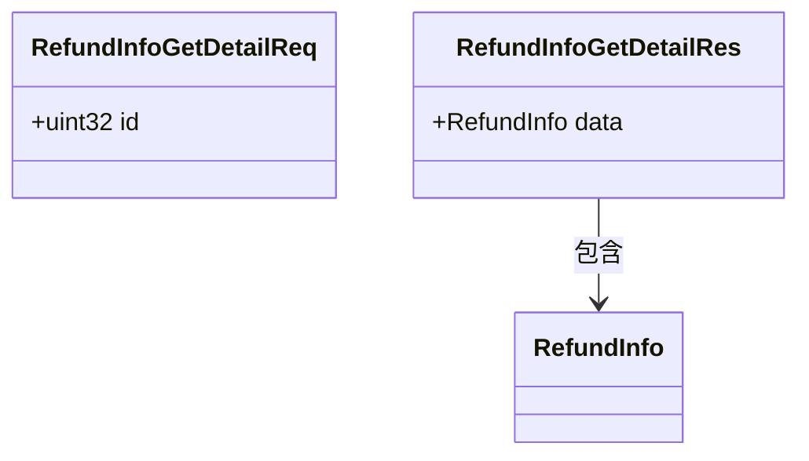

**图表来源**
- [app/order/api/refund_info/v1/refund_info.pb.go](file://app/order/api/refund_info/v1/refund_info.pb.go#L144-L150)
- [app/order/api/refund_info/v1/refund_info.pb.go](file://app/order/api/refund_info/v1/refund_info.pb.go#L191-L197)

#### 请求示例

```json
{
  "id": 1
}
```

#### 响应示例

```json
{
  "data": {
    "id": 1,
    "number": "RF202401010001",
    "orderId": 1001,
    "goodsId": 1001,
    "refundId": "",
    "reason": "七天无理由退货",
    "status": 1,
    "refundStatus": 0,
    "refundAmount": 9000,
    "userId": 1
  }
}
```

**章节来源**
- [app/order/api/refund_info/v1/refund_info.pb.go](file://app/order/api/refund_info/v1/refund_info.pb.go#L144-L150)
- [app/order/internal/controller/refund_info/refund_info.go](file://app/order/internal/controller/refund_info/refund_info.go#L71-L100)

### 退款列表接口

#### 接口定义

**HTTP方法**: GET  
**URL路径**: `/refund/v1/list`  
**请求参数**: RefundInfoGetListReq

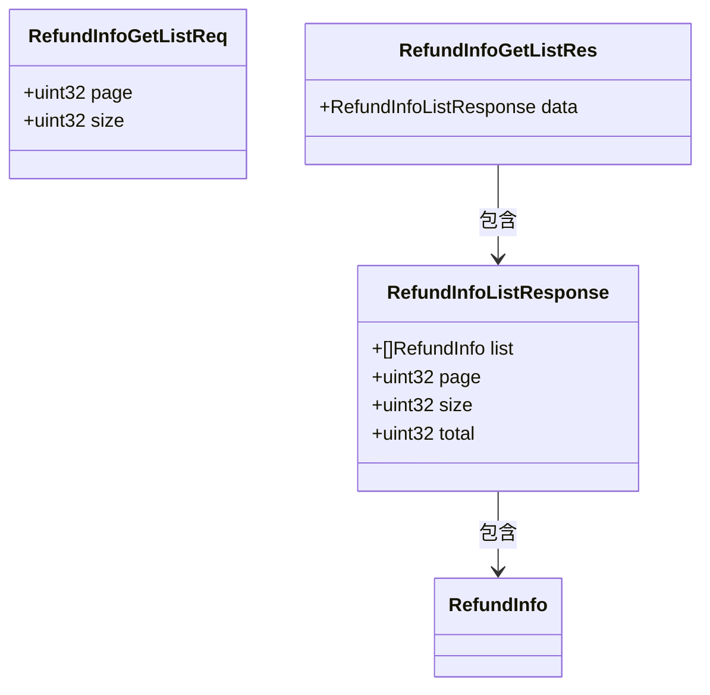

**图表来源**
- [app/order/api/refund_info/v1/refund_info.pb.go](file://app/order/api/refund_info/v1/refund_info.pb.go#L238-L245)
- [app/order/api/refund_info/v1/refund_info.pb.go](file://app/order/api/refund_info/v1/refund_info.pb.go#L364-L371)
- [app/order/api/refund_info/v1/refund_info.pb.go](file://app/order/api/refund_info/v1/refund_info.pb.go#L293-L302)

#### 请求示例

```json
{
  "page": 1,
  "size": 10
}
```

#### 响应示例

```json
{
  "data": {
    "list": [
      {
        "id": 1,
        "number": "RF202401010001",
        "orderId": 1001,
        "goodsId": 1001,
        "refundId": "",
        "reason": "七天无理由退货",
        "status": 1,
        "refundStatus": 0,
        "refundAmount": 9000,
        "userId": 1
      }
    ],
    "page": 1,
    "size": 10,
    "total": 1
  }
}
```

**章节来源**
- [app/order/api/refund_info/v1/refund_info.pb.go](file://app/order/api/refund_info/v1/refund_info.pb.go#L238-L245)
- [app/order/internal/controller/refund_info/refund_info.go](file://app/order/internal/controller/refund_info/refund_info.go#L26-L69)

### 订单状态流转

系统支持完整的订单状态流转：

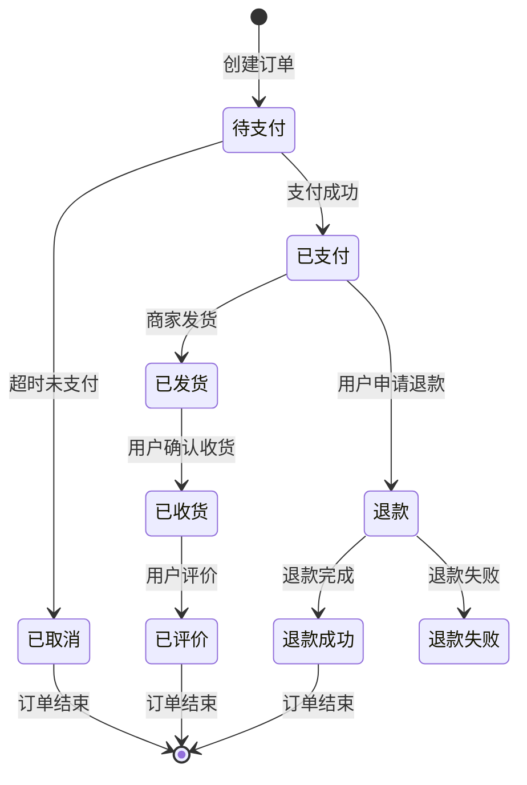

**图表来源**
- [app/order/internal/consts/order_status.go](file://app/order/internal/consts/order_status.go#L6-L16)

**章节来源**
- [app/order/internal/consts/order_status.go](file://app/order/internal/consts/order_status.go#L1-L38)

## 依赖关系分析

### 组件依赖图

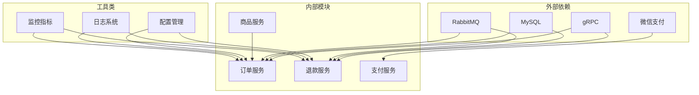

**图表来源**
- [app/order/internal/controller/order_info/order_info.go](file://app/order/internal/controller/order_info/order_info.go#L1-L18)
- [app/order/utility/payment/wxchat.go](file://app/order/utility/payment/wxchat.go#L1-L27)

### 数据模型关系

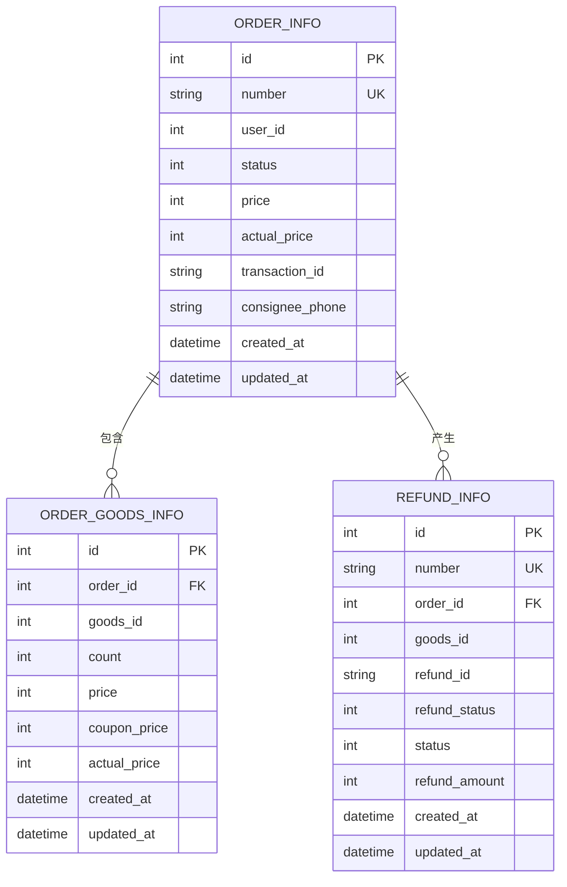

**图表来源**
- [app/order/internal/model/entity/order_info.go](file://app/order/internal/model/entity/order_info.go#L11-L29)
- [app/order/internal/model/entity/refund_info.go](file://app/order/internal/model/entity/refund_info.go#L11-L26)

**章节来源**
- [app/order/internal/model/entity/order_info.go](file://app/order/internal/model/entity/order_info.go#L1-L30)
- [app/order/internal/model/entity/refund_info.go](file://app/order/internal/model/entity/refund_info.go#L1-L27)

## 性能考虑

### 缓存策略

1. **订单查询缓存**: 对热门订单信息进行缓存
2. **商品库存缓存**: 缓存商品库存信息减少数据库压力
3. **配置信息缓存**: 缓存支付配置信息

### 异步处理

1. **订单超时处理**: 使用消息队列异步处理超时订单
2. **库存释放**: 异步释放超时订单占用的库存
3. **优惠券处理**: 异步处理优惠券的使用和退回

### 数据库优化

1. **索引优化**: 在常用查询字段上建立索引
2. **分页查询**: 限制查询范围避免全表扫描
3. **批量操作**: 批量插入和更新减少数据库往返

## 故障排除指南

### 常见错误码

| 错误码 | 错误类型 | 描述 | 处理建议 |
|--------|----------|------|----------|
| 1001 | 订单不存在 | 订单ID无效或已被删除 | 检查订单ID是否正确 |
| 1002 | 状态不允许 | 订单状态不支持当前操作 | 检查订单当前状态 |
| 1003 | 权限不足 | 用户无权操作此订单 | 验证用户身份 |
| 1004 | 系统错误 | 操作失败 | 查看服务器日志 |

### 支付问题排查

1. **支付失败**: 检查微信支付配置和网络连接
2. **回调异常**: 验证签名验证和回调地址配置
3. **重复支付**: 检查幂等性处理机制

### 退款问题排查

1. **退款失败**: 检查原支付交易状态
2. **退款超时**: 监控退款状态变化
3. **重复退款**: 验证订单退款状态

**章节来源**
- [app/order/internal/controller/order_info/order_info.go](file://app/order/internal/controller/order_info/order_info.go#L140-L187)

## 结论

本文档详细介绍了订单相关API的设计和实现，涵盖了完整的电商订单生命周期管理。系统采用微服务架构，具有良好的扩展性和维护性。

关键特性包括：
- 完整的订单状态管理
- 支持多种支付方式
- 异步处理机制
- 完善的错误处理
- 性能优化措施

通过标准化的API设计和严格的错误处理机制，系统能够稳定地支持高并发的订单处理需求。