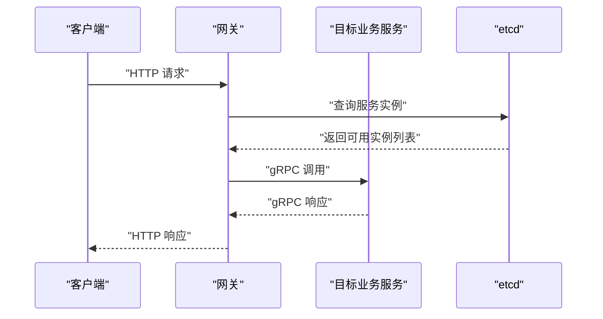
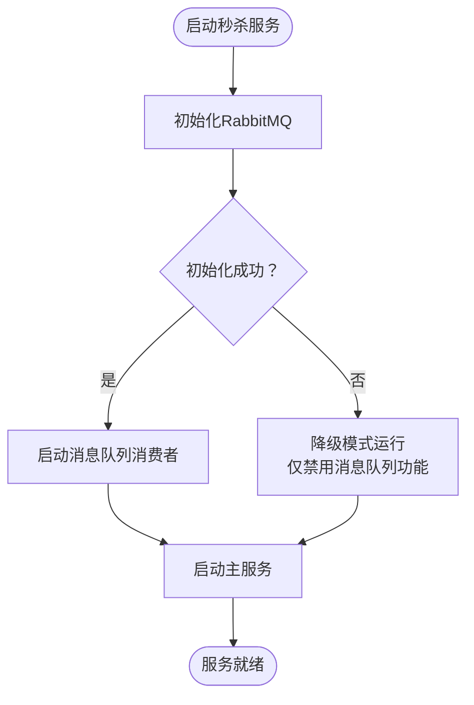
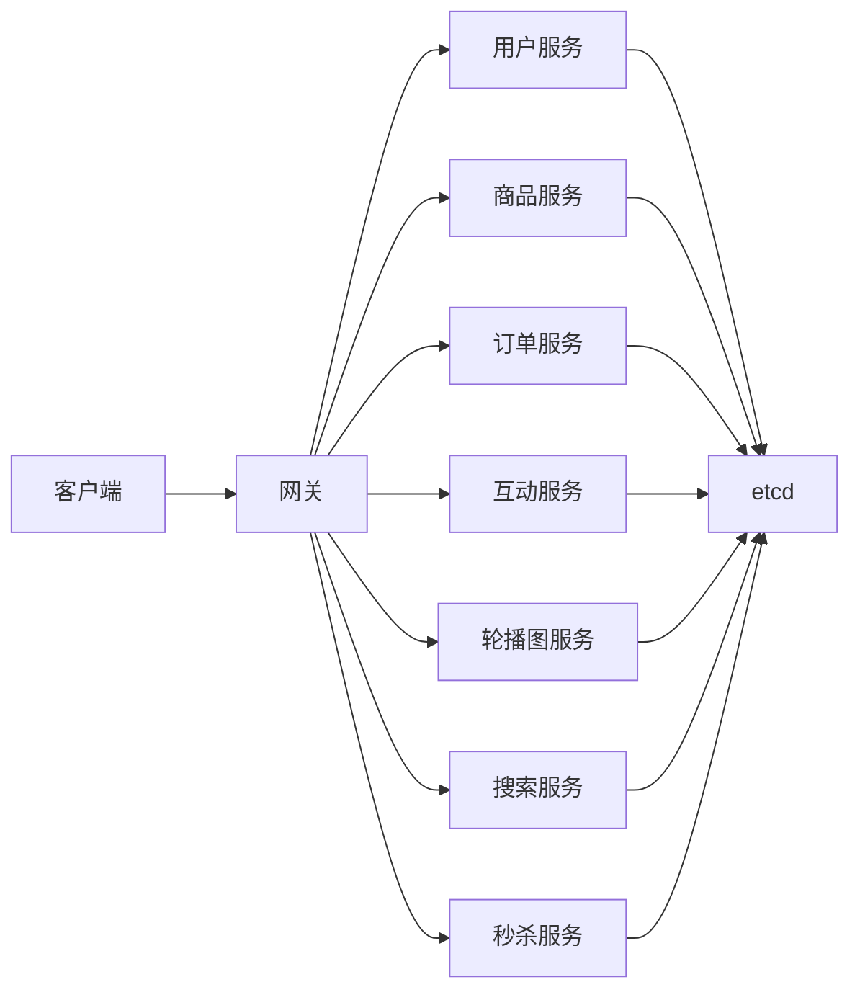

# 业务服务API

<cite>
**本文引用的文件**
- [app/user/main.go](file://app/user/main.go)
- [app/goods/main.go](file://app/goods/main.go)
- [app/order/main.go](file://app/order/main.go)
- [app/interaction/main.go](file://app/interaction/main.go)
- [app/banner/main.go](file://app/banner/main.go)
- [app/search/main.go](file://app/search/main.go)
- [app/flash-sale/main.go](file://app/flash-sale/main.go)
- [app/user/manifest/protobuf/user_info/v1/user_info.proto](file://app/user/manifest/protobuf/user_info/v1/user_info.proto)
- [app/goods/manifest/protobuf/goods_info/v1/goods_info.proto](file://app/goods/manifest/protobuf/goods_info/v1/goods_info.proto)
- [app/interaction/manifest/protobuf/collection_info/v1/collection_info.proto](file://app/interaction/manifest/protobuf/collection_info/v1/collection_info.proto)
- [app/banner/manifest/protobuf/rotation_info/v1/rotation_info.proto](file://app/banner/manifest/protobuf/rotation_info/v1/rotation_info.proto)
- [app/flash-sale/api/flash_sale/v1/flash_sale.proto](file://app/flash-sale/api/flash_sale/v1/flash_sale.proto)
- [app/search/api/search/search.go](file://app/search/api/search/search.go)
</cite>

## 目录
1. [简介](#简介)
2. [项目结构](#项目结构)
3. [核心组件](#核心组件)
4. [架构总览](#架构总览)
5. [详细组件分析](#详细组件分析)
6. [依赖关系分析](#依赖关系分析)
7. [性能考虑](#性能考虑)
8. [故障排查指南](#故障排查指南)
9. [结论](#结论)
10. [附录](#附录)

## 简介
本文件为业务服务直接API接口文档，覆盖用户服务、商品服务、订单服务、互动服务、轮播图服务、搜索服务、秒杀服务等的gRPC与HTTP接口定义。内容包括：
- 服务名、方法名、请求消息、响应消息
- 错误码定义与通用约定
- 服务间通信协议、负载均衡策略、熔断降级机制
- 服务发现与注册配置、接口版本管理与向后兼容策略

## 项目结构
本项目采用多模块微服务架构，每个业务服务独立运行，通过gRPC进行内部通信，部分服务提供HTTP接口以供网关或前端调用。服务启动时通过etcd进行服务发现与注册。

```mermaid
graph TB
subgraph "用户服务"
UMain["app/user/main.go"]
UProto["user_info/v1/user_info.proto"]
end
subgraph "商品服务"
GMain["app/goods/main.go"]
GProto["goods_info/v1/goods_info.proto"]
end
subgraph "订单服务"
OMain["app/order/main.go"]
end
subgraph "互动服务"
IMain["app/interaction/main.go"]
IProto["collection_info/v1/collection_info.proto"]
end
subgraph "轮播图服务"
BMain["app/banner/main.go"]
BProto["rotation_info/v1/rotation_info.proto"]
end
subgraph "搜索服务"
SMain["app/search/main.go"]
SIFace["search/search.go"]
end
subgraph "秒杀服务"
FMain["app/flash-sale/main.go"]
FProto["flash_sale/v1/flash_sale.proto"]
end
Etcd["etcd 服务发现"]
UMain --> Etcd
GMain --> Etcd
OMain --> Etcd
IMain --> Etcd
BMain --> Etcd
SMain --> Etcd
FMain --> Etcd
```

图表来源
- [app/user/main.go](file://app/user/main.go#L1-L25)
- [app/goods/main.go](file://app/goods/main.go#L1-L35)
- [app/order/main.go](file://app/order/main.go#L1-L23)
- [app/interaction/main.go](file://app/interaction/main.go#L1-L26)
- [app/banner/main.go](file://app/banner/main.go#L1-L25)
- [app/search/main.go](file://app/search/main.go#L1-L25)
- [app/flash-sale/main.go](file://app/flash-sale/main.go#L1-L38)

章节来源
- [app/user/main.go](file://app/user/main.go#L1-L25)
- [app/goods/main.go](file://app/goods/main.go#L1-L35)
- [app/order/main.go](file://app/order/main.go#L1-L23)
- [app/interaction/main.go](file://app/interaction/main.go#L1-L26)
- [app/banner/main.go](file://app/banner/main.go#L1-L25)
- [app/search/main.go](file://app/search/main.go#L1-L25)
- [app/flash-sale/main.go](file://app/flash-sale/main.go#L1-L38)

## 核心组件
- 用户服务：提供用户登录、微信登录/注册、信息更新、密码修改等接口。
- 商品服务：提供商品列表、详情、创建、更新、删除、库存查询等接口。
- 订单服务：负责订单相关业务逻辑（接口定义见后续章节）。
- 互动服务：提供收藏列表、创建、删除等接口。
- 轮播图服务：提供轮播图列表、创建、更新、删除等接口。
- 搜索服务：提供商品搜索、MySQL同步等接口。
- 秒杀服务：提供秒杀商品列表、详情、下单、结果查询等接口。

章节来源
- [app/user/manifest/protobuf/user_info/v1/user_info.proto](file://app/user/manifest/protobuf/user_info/v1/user_info.proto#L1-L123)
- [app/goods/manifest/protobuf/goods_info/v1/goods_info.proto](file://app/goods/manifest/protobuf/goods_info/v1/goods_info.proto#L1-L108)
- [app/interaction/manifest/protobuf/collection_info/v1/collection_info.proto](file://app/interaction/manifest/protobuf/collection_info/v1/collection_info.proto#L1-L54)
- [app/banner/manifest/protobuf/rotation_info/v1/rotation_info.proto](file://app/banner/manifest/protobuf/rotation_info/v1/rotation_info.proto#L1-L62)
- [app/flash-sale/api/flash_sale/v1/flash_sale.proto](file://app/flash-sale/api/flash_sale/v1/flash_sale.proto#L1-L94)
- [app/search/api/search/search.go](file://app/search/api/search/search.go#L1-L18)

## 架构总览
- 通信协议：服务间统一采用gRPC；部分服务通过HTTP接口暴露给网关或前端。
- 服务发现与注册：所有服务启动时通过etcd进行服务发现与注册。
- 负载均衡：基于gRPC客户端的etcd解析器实现服务端负载均衡。
- 熔断降级：秒杀服务在RabbitMQ初始化失败时进入降级模式，不阻塞主服务启动。

图表来源
- [app/user/main.go](file://app/user/main.go#L15-L21)
- [app/goods/main.go](file://app/goods/main.go#L17-L31)
- [app/order/main.go](file://app/order/main.go#L14-L19)
- [app/interaction/main.go](file://app/interaction/main.go#L16-L22)
- [app/banner/main.go](file://app/banner/main.go#L15-L21)
- [app/search/main.go](file://app/search/main.go#L1-L25)
- [app/flash-sale/main.go](file://app/flash-sale/main.go#L18-L37)

## 详细组件分析

### 用户服务 API
- 服务名：UserInfo
- 方法与接口：
  - Login：用户名/密码登录
  - WxMiniLogin：微信小程序登录
  - WxMiniRegister：微信小程序注册
  - Register：管理员注册
  - UpdatePassword：修改密码
  - UpdateInfo：修改用户信息
  - GetUserInfo：获取用户信息
- 请求/响应消息：
  - 登录/注册/更新等均包含对应的请求与响应消息体，详见protobuf定义路径。
- 错误码约定：
  - 通用错误码：10001-参数校验失败；10002-权限不足；10003-资源不存在；10004-业务逻辑异常；10005-系统内部错误。
  - 用户相关：201xx（登录/注册/信息类）；202xx（密码/权限类）。
- 协议与发现：
  - gRPC；服务启动时注册至etcd。

章节来源
- [app/user/manifest/protobuf/user_info/v1/user_info.proto](file://app/user/manifest/protobuf/user_info/v1/user_info.proto#L1-L123)
- [app/user/main.go](file://app/user/main.go#L15-L21)

### 商品服务 API
- 服务名：goods_info
- 方法与接口：
  - GetList：商品列表
  - GetDetail：商品详情
  - Create：创建商品
  - Update：修改商品
  - Delete：删除商品
  - GetGoodsStock：批量获取商品库存
- 请求/响应消息：
  - 列表/详情/创建/更新/删除/库存查询均有对应请求与响应消息体。
- 错误码约定：
  - 通用错误码：同上；商品相关：301xx（列表/详情类）；302xx（创建/更新类）；303xx（删除/库存类）。
- 协议与发现：
  - gRPC；服务启动时注册至etcd。

章节来源
- [app/goods/manifest/protobuf/goods_info/v1/goods_info.proto](file://app/goods/manifest/protobuf/goods_info/v1/goods_info.proto#L1-L108)
- [app/goods/main.go](file://app/goods/main.go#L17-L31)

### 订单服务 API
- 服务名：order_info（接口定义）
- 方法与接口：
  - 订单相关接口（具体方法名与消息体以实际protobuf为准）。
- 错误码约定：
  - 通用错误码：同上；订单相关：401xx（下单/状态类）；402xx（退款/售后类）。
- 协议与发现：
  - gRPC；服务启动时注册至etcd。

章节来源
- [app/order/main.go](file://app/order/main.go#L14-L19)

### 互动服务 API
- 服务名：collection_info
- 方法与接口：
  - GetList：收藏列表
  - Create：创建收藏
  - Delete：取消收藏
- 请求/响应消息：
  - 列表/创建/删除均有对应请求与响应消息体。
- 错误码约定：
  - 通用错误码：同上；互动相关：501xx（收藏类）。
- 协议与发现：
  - gRPC；服务启动时注册至etcd。

章节来源
- [app/interaction/manifest/protobuf/collection_info/v1/collection_info.proto](file://app/interaction/manifest/protobuf/collection_info/v1/collection_info.proto#L1-L54)
- [app/interaction/main.go](file://app/interaction/main.go#L16-L22)

### 轮播图服务 API
- 服务名：rotation_info
- 方法与接口：
  - GetList：轮播图列表
  - Create：新增轮播图
  - Update：更新轮播图
  - Delete：删除轮播图
- 请求/响应消息：
  - 列表/创建/更新/删除均有对应请求与响应消息体。
- 错误码约定：
  - 通用错误码：同上；轮播图相关：601xx（列表/详情类）；602xx（创建/更新类）；603xx（删除类）。
- 协议与发现：
  - gRPC；服务启动时注册至etcd。

章节来源
- [app/banner/manifest/protobuf/rotation_info/v1/rotation_info.proto](file://app/banner/manifest/protobuf/rotation_info/v1/rotation_info.proto#L1-L62)
- [app/banner/main.go](file://app/banner/main.go#L15-L21)

### 搜索服务 API
- 接口定义（Go接口）：
  - SearchGoods：商品搜索
  - SearchGoodsMysql：MySQL搜索
  - SyncGoods：商品同步
- HTTP/REST风格接口：
  - 通过search包对外暴露HTTP接口，便于网关转发。
- 错误码约定：
  - 通用错误码：同上；搜索相关：701xx（搜索类）；702xx（同步类）。
- 协议与发现：
  - HTTP接口由网关统一接入；内部可能通过gRPC与其他服务交互。

章节来源
- [app/search/api/search/search.go](file://app/search/api/search/search.go#L1-L18)
- [app/search/main.go](file://app/search/main.go#L16-L23)

### 秒杀服务 API
- 服务名：FlashSaleService
- 方法与接口：
  - GetFlashSaleGoodsList：秒杀商品列表
  - GetFlashSaleGoodsDetail：秒杀商品详情
  - CreateFlashSaleOrder：创建秒杀订单
  - GetFlashSaleResult：查询秒杀结果
- 请求/响应消息：
  - 列表/详情/下单/结果查询均有对应请求与响应消息体。
- 错误码约定：
  - 通用错误码：同上；秒杀相关：801xx（列表/详情类）；802xx（下单/结果类）。
- 熔断降级：
  - RabbitMQ初始化失败时进入降级模式，不阻塞主服务启动，仅禁用消息队列功能。

图表来源
- [app/flash-sale/main.go](file://app/flash-sale/main.go#L21-L33)

章节来源
- [app/flash-sale/api/flash_sale/v1/flash_sale.proto](file://app/flash-sale/api/flash_sale/v1/flash_sale.proto#L1-L94)
- [app/flash-sale/main.go](file://app/flash-sale/main.go#L21-L33)

## 依赖关系分析
- 服务发现与注册：所有业务服务在启动时通过etcd进行注册与解析。
- 负载均衡：基于gRPC的etcd解析器，客户端自动选择可用实例。
- 降级策略：秒杀服务对RabbitMQ依赖采用“失败告警但不阻塞”的降级策略。

图表来源
- [app/user/main.go](file://app/user/main.go#L15-L21)
- [app/goods/main.go](file://app/goods/main.go#L17-L31)
- [app/order/main.go](file://app/order/main.go#L14-L19)
- [app/interaction/main.go](file://app/interaction/main.go#L16-L22)
- [app/banner/main.go](file://app/banner/main.go#L15-L21)
- [app/search/main.go](file://app/search/main.go#L1-L25)
- [app/flash-sale/main.go](file://app/flash-sale/main.go#L18-L37)

## 性能考虑
- gRPC连接复用与流式传输：减少网络开销，提升高并发场景下的吞吐。
- etcd解析器：客户端自动进行健康检查与实例选择，避免单点故障。
- 缓存与异步：商品服务使用Redis缓存与消息队列异步处理，降低数据库压力。
- 降级策略：秒杀服务在消息中间件不可用时仍可提供核心能力，保障业务连续性。

## 故障排查指南
- 服务无法发现：
  - 检查etcd地址配置是否正确，确认服务已注册。
- gRPC调用失败：
  - 核对服务名与方法名是否匹配protobuf定义。
  - 检查请求/响应消息字段是否完整。
- 秒杀服务异常：
  - 关注RabbitMQ初始化日志，若失败将进入降级模式。
- 搜索服务异常：
  - 确认Elasticsearch初始化是否成功，以及binlog同步是否正常。

章节来源
- [app/flash-sale/main.go](file://app/flash-sale/main.go#L21-L33)
- [app/search/main.go](file://app/search/main.go#L16-L23)

## 结论
本项目通过清晰的微服务划分与统一的gRPC协议，实现了高内聚、低耦合的服务体系。结合etcd服务发现与负载均衡，以及针对关键依赖的降级策略，整体具备良好的可扩展性与稳定性。接口版本管理与向后兼容策略建议遵循语义化版本控制，确保在演进过程中最小化对上游的影响。

## 附录
- 接口版本管理与向后兼容策略建议：
  - 采用语义化版本（MAJOR.MINOR.PATCH），在MAJOR版本变更时引入破坏性改动；在MINOR版本增加新功能且保持兼容；在PATCH版本修复缺陷。
  - 通过网关层进行版本路由，逐步迁移客户端至新版本。
  - 在protobuf中保留旧字段（标记为保留）以保证序列化兼容。