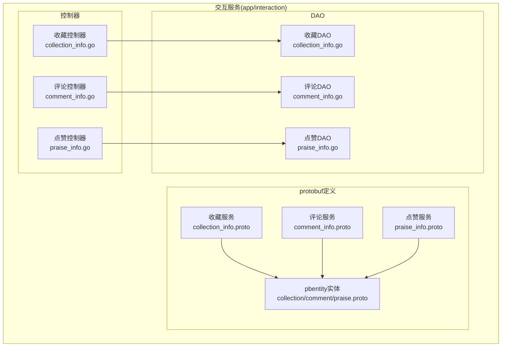
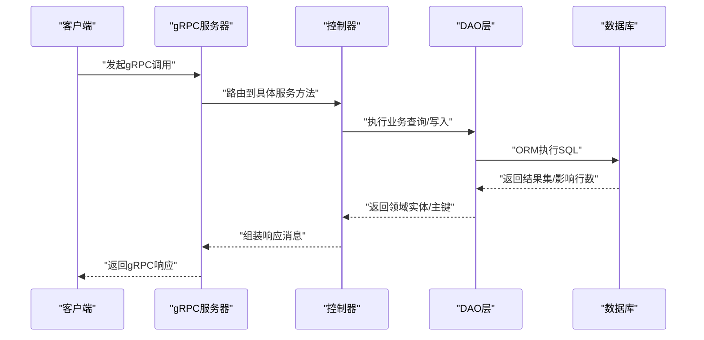
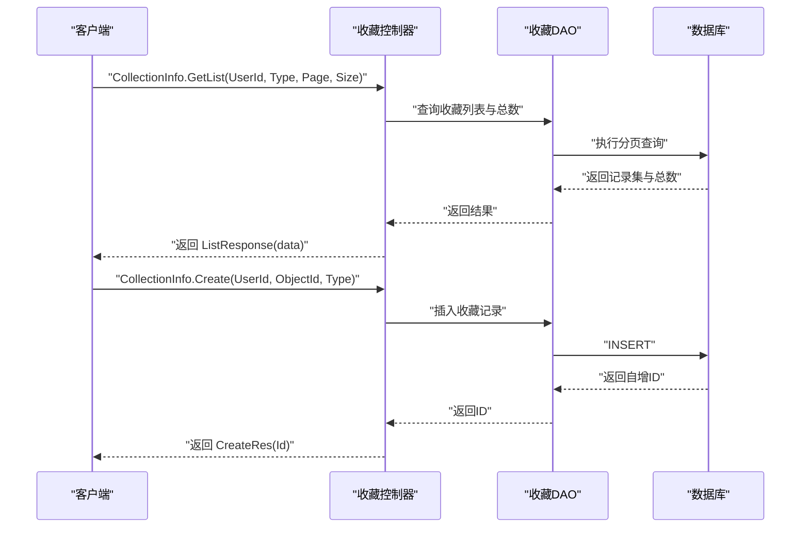
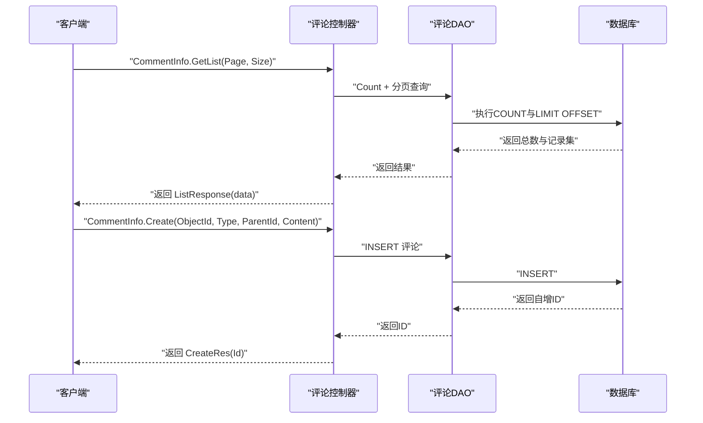
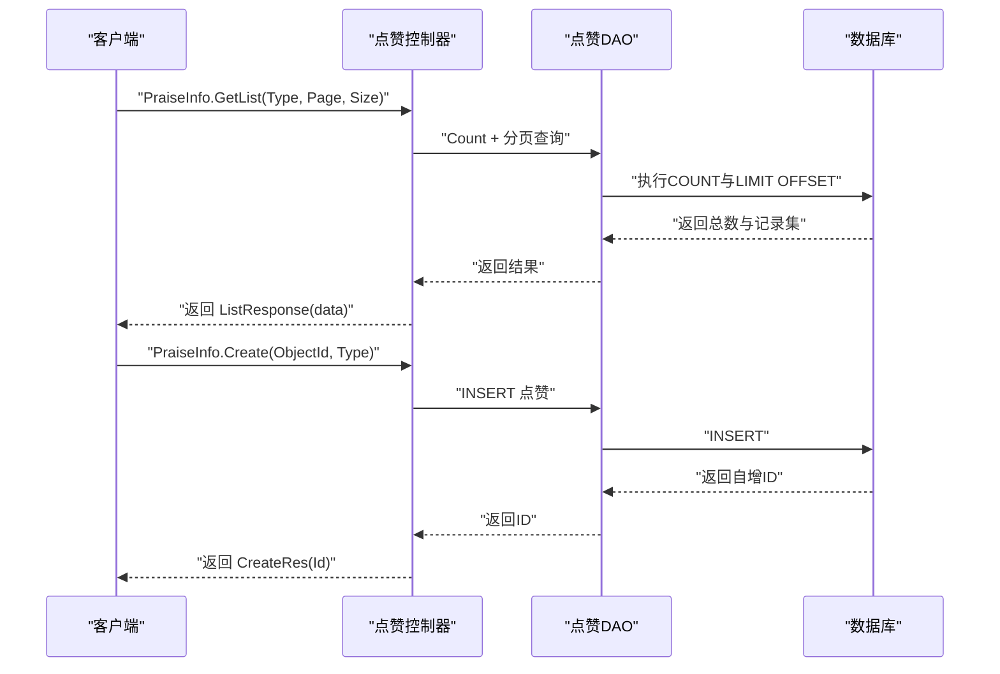
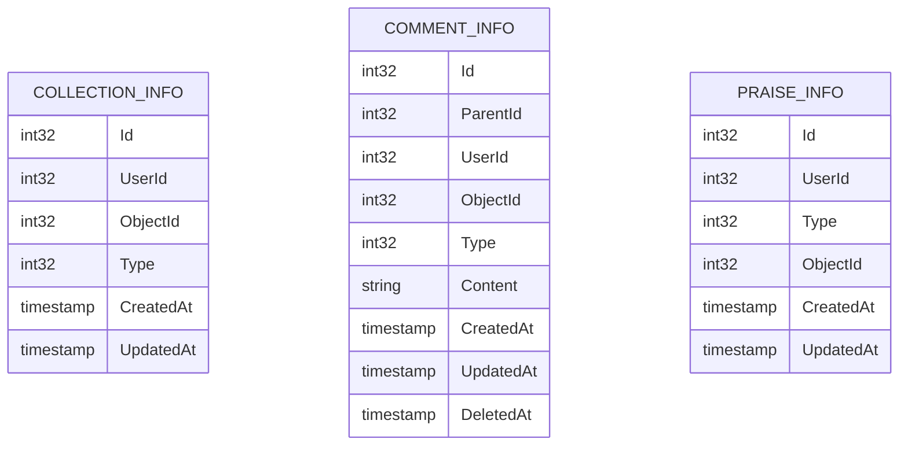
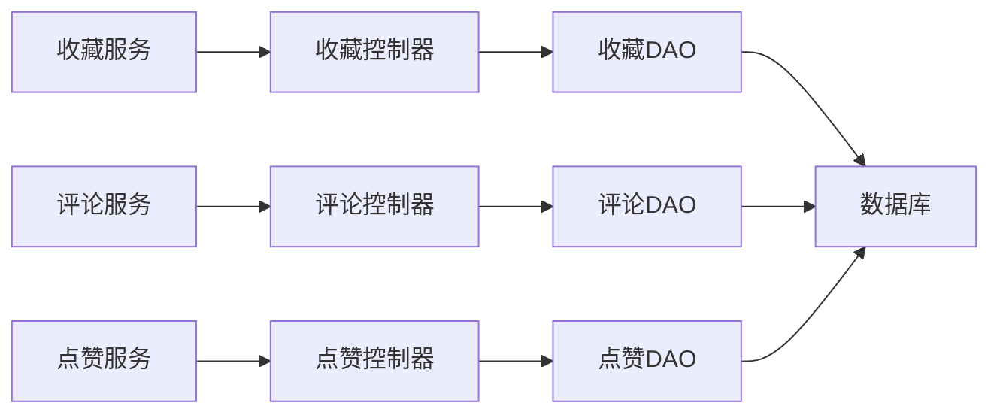

# 互动服务API

<cite>
**本文引用的文件**
- [app/interaction/manifest/protobuf/collection_info/v1/collection_info.proto](file://app/interaction/manifest/protobuf/collection_info/v1/collection_info.proto)
- [app/interaction/manifest/protobuf/comment_info/v1/comment_info.proto](file://app/interaction/manifest/protobuf/comment_info/v1/comment_info.proto)
- [app/interaction/manifest/protobuf/praise_info/v1/praise_info.proto](file://app/interaction/manifest/protobuf/praise_info/v1/praise_info.proto)
- [app/interaction/manifest/protobuf/pbentity/collection_info.proto](file://app/interaction/manifest/protobuf/pbentity/collection_info.proto)
- [app/interaction/manifest/protobuf/pbentity/comment_info.proto](file://app/interaction/manifest/protobuf/pbentity/comment_info.proto)
- [app/interaction/manifest/protobuf/pbentity/praise_info.proto](file://app/interaction/manifest/protobuf/pbentity/praise_info.proto)
- [app/interaction/internal/controller/collection_info/collection_info.go](file://app/interaction/internal/controller/collection_info/collection_info.go)
- [app/interaction/internal/controller/comment_info/comment_info.go](file://app/interaction/internal/controller/comment_info/comment_info.go)
- [app/interaction/internal/controller/praise_info/praise_info.go](file://app/interaction/internal/controller/praise_info/praise_info.go)
- [app/interaction/internal/dao/collection_info.go](file://app/interaction/internal/dao/collection_info.go)
- [app/interaction/internal/dao/comment_info.go](file://app/interaction/internal/dao/comment_info.go)
- [app/interaction/internal/dao/praise_info.go](file://app/interaction/internal/dao/praise_info.go)
</cite>

## 目录
1. [简介](#简介)
2. [项目结构](#项目结构)
3. [核心组件](#核心组件)
4. [架构总览](#架构总览)
5. [详细组件分析](#详细组件分析)
6. [依赖分析](#依赖分析)
7. [性能考虑](#性能考虑)
8. [故障排查指南](#故障排查指南)
9. [结论](#结论)
10. [附录](#附录)

## 简介
本文件为“互动服务”提供的gRPC接口文档，覆盖收藏、评论、点赞三大社交互动能力。文档基于仓库中的protobuf定义与控制器实现进行整理，明确各接口的请求/响应模型、调用流程、数据存储结构、计数与一致性保障思路，并给出接口调用示例与常见问题排查建议。

## 项目结构
互动服务位于 app/interaction 目录，采用按功能域分层的组织方式：
- manifest/protobuf：存放交互相关服务的protobuf定义，含服务接口与实体消息定义
- internal/controller：gRPC服务端控制器，负责请求接入与错误包装
- internal/dao：DAO封装，统一访问数据层
- api：生成的pb与pbentity代码（由protobuf生成）

图表来源
- [app/interaction/manifest/protobuf/collection_info/v1/collection_info.proto](file://app/interaction/manifest/protobuf/collection_info/v1/collection_info.proto#L1-L54)
- [app/interaction/manifest/protobuf/comment_info/v1/comment_info.proto](file://app/interaction/manifest/protobuf/comment_info/v1/comment_info.proto#L1-L50)
- [app/interaction/manifest/protobuf/praise_info/v1/praise_info.proto](file://app/interaction/manifest/protobuf/praise_info/v1/praise_info.proto#L1-L51)
- [app/interaction/manifest/protobuf/pbentity/collection_info.proto](file://app/interaction/manifest/protobuf/pbentity/collection_info.proto#L1-L20)
- [app/interaction/manifest/protobuf/pbentity/comment_info.proto](file://app/interaction/manifest/protobuf/pbentity/comment_info.proto#L1-L23)
- [app/interaction/manifest/protobuf/pbentity/praise_info.proto](file://app/interaction/manifest/protobuf/pbentity/praise_info.proto#L1-L20)
- [app/interaction/internal/controller/collection_info/collection_info.go](file://app/interaction/internal/controller/collection_info/collection_info.go#L1-L83)
- [app/interaction/internal/controller/comment_info/comment_info.go](file://app/interaction/internal/controller/comment_info/comment_info.go#L1-L107)
- [app/interaction/internal/controller/praise_info/praise_info.go](file://app/interaction/internal/controller/praise_info/praise_info.go#L1-L107)
- [app/interaction/internal/dao/collection_info.go](file://app/interaction/internal/dao/collection_info.go#L1-L23)
- [app/interaction/internal/dao/comment_info.go](file://app/interaction/internal/dao/comment_info.go#L1-L23)
- [app/interaction/internal/dao/praise_info.go](file://app/interaction/internal/dao/praise_info.go#L1-L23)

章节来源
- [app/interaction/manifest/protobuf/collection_info/v1/collection_info.proto](file://app/interaction/manifest/protobuf/collection_info/v1/collection_info.proto#L1-L54)
- [app/interaction/manifest/protobuf/comment_info/v1/comment_info.proto](file://app/interaction/manifest/protobuf/comment_info/v1/comment_info.proto#L1-L50)
- [app/interaction/manifest/protobuf/praise_info/v1/praise_info.proto](file://app/interaction/manifest/protobuf/praise_info/v1/praise_info.proto#L1-L51)
- [app/interaction/internal/controller/collection_info/collection_info.go](file://app/interaction/internal/controller/collection_info/collection_info.go#L1-L83)
- [app/interaction/internal/controller/comment_info/comment_info.go](file://app/interaction/internal/controller/comment_info/comment_info.go#L1-L107)
- [app/interaction/internal/controller/praise_info/praise_info.go](file://app/interaction/internal/controller/praise_info/praise_info.go#L1-L107)

## 核心组件
- 收藏服务：提供收藏列表查询、创建收藏、删除收藏
- 评论服务：提供评论列表查询、发表评论、删除评论
- 点赞服务：提供点赞列表查询、执行点赞、取消点赞
- 实体消息：统一的pbentity消息用于承载收藏、评论、点赞的数据结构

章节来源
- [app/interaction/manifest/protobuf/collection_info/v1/collection_info.proto](file://app/interaction/manifest/protobuf/collection_info/v1/collection_info.proto#L9-L13)
- [app/interaction/manifest/protobuf/comment_info/v1/comment_info.proto](file://app/interaction/manifest/protobuf/comment_info/v1/comment_info.proto#L9-L13)
- [app/interaction/manifest/protobuf/praise_info/v1/praise_info.proto](file://app/interaction/manifest/protobuf/praise_info/v1/praise_info.proto#L9-L13)

## 架构总览
gRPC服务通过控制器将请求转发至DAO层，DAO层基于GoFrame ORM进行数据库操作；pbentity作为跨语言传输的稳定契约，确保前后端与微服务间的数据一致性。

图表来源
- [app/interaction/internal/controller/collection_info/collection_info.go](file://app/interaction/internal/controller/collection_info/collection_info.go#L24-L44)
- [app/interaction/internal/controller/comment_info/comment_info.go](file://app/interaction/internal/controller/comment_info/comment_info.go#L28-L76)
- [app/interaction/internal/controller/praise_info/praise_info.go](file://app/interaction/internal/controller/praise_info/praise_info.go#L28-L76)
- [app/interaction/internal/dao/collection_info.go](file://app/interaction/internal/dao/collection_info.go#L13-L20)
- [app/interaction/internal/dao/comment_info.go](file://app/interaction/internal/dao/comment_info.go#L13-L20)
- [app/interaction/internal/dao/praise_info.go](file://app/interaction/internal/dao/praise_info.go#L13-L20)

## 详细组件分析

### 收藏服务 API
- 服务名称：collection_info
- 提供方法：
  - GetList：分页查询某用户的收藏列表
  - Create：创建一条收藏记录
  - Delete：删除一条收藏记录

请求/响应模型要点
- 请求参数：用户标识、对象标识、类型（商品/文章）、分页参数
- 响应参数：列表项、分页信息、总条数、新建记录ID

图表来源
- [app/interaction/manifest/protobuf/collection_info/v1/collection_info.proto](file://app/interaction/manifest/protobuf/collection_info/v1/collection_info.proto#L9-L13)
- [app/interaction/manifest/protobuf/collection_info/v1/collection_info.proto](file://app/interaction/manifest/protobuf/collection_info/v1/collection_info.proto#L37-L54)
- [app/interaction/internal/controller/collection_info/collection_info.go](file://app/interaction/internal/controller/collection_info/collection_info.go#L24-L44)
- [app/interaction/internal/controller/collection_info/collection_info.go](file://app/interaction/internal/controller/collection_info/collection_info.go#L48-L62)
- [app/interaction/internal/controller/collection_info/collection_info.go](file://app/interaction/internal/controller/collection_info/collection_info.go#L66-L81)

章节来源
- [app/interaction/manifest/protobuf/collection_info/v1/collection_info.proto](file://app/interaction/manifest/protobuf/collection_info/v1/collection_info.proto#L9-L13)
- [app/interaction/manifest/protobuf/collection_info/v1/collection_info.proto](file://app/interaction/manifest/protobuf/collection_info/v1/collection_info.proto#L16-L35)
- [app/interaction/manifest/protobuf/collection_info/v1/collection_info.proto](file://app/interaction/manifest/protobuf/collection_info/v1/collection_info.proto#L37-L54)
- [app/interaction/internal/controller/collection_info/collection_info.go](file://app/interaction/internal/controller/collection_info/collection_info.go#L24-L44)
- [app/interaction/internal/controller/collection_info/collection_info.go](file://app/interaction/internal/controller/collection_info/collection_info.go#L48-L62)
- [app/interaction/internal/controller/collection_info/collection_info.go](file://app/interaction/internal/controller/collection_info/collection_info.go#L66-L81)

### 评论服务 API
- 服务名称：comment_info
- 提供方法：
  - GetList：分页查询评论列表
  - Create：发表一条评论（支持父级评论）
  - Delete：删除一条评论

请求/响应模型要点
- 请求参数：对象标识、类型、父级评论ID、评论内容、分页参数
- 响应参数：列表项、分页信息、总条数、新建记录ID

图表来源
- [app/interaction/manifest/protobuf/comment_info/v1/comment_info.proto](file://app/interaction/manifest/protobuf/comment_info/v1/comment_info.proto#L9-L13)
- [app/interaction/manifest/protobuf/comment_info/v1/comment_info.proto](file://app/interaction/manifest/protobuf/comment_info/v1/comment_info.proto#L35-L50)
- [app/interaction/internal/controller/comment_info/comment_info.go](file://app/interaction/internal/controller/comment_info/comment_info.go#L28-L76)
- [app/interaction/internal/controller/comment_info/comment_info.go](file://app/interaction/internal/controller/comment_info/comment_info.go#L80-L91)

章节来源
- [app/interaction/manifest/protobuf/comment_info/v1/comment_info.proto](file://app/interaction/manifest/protobuf/comment_info/v1/comment_info.proto#L9-L13)
- [app/interaction/manifest/protobuf/comment_info/v1/comment_info.proto](file://app/interaction/manifest/protobuf/comment_info/v1/comment_info.proto#L16-L33)
- [app/interaction/manifest/protobuf/comment_info/v1/comment_info.proto](file://app/interaction/manifest/protobuf/comment_info/v1/comment_info.proto#L35-L50)
- [app/interaction/internal/controller/comment_info/comment_info.go](file://app/interaction/internal/controller/comment_info/comment_info.go#L28-L76)
- [app/interaction/internal/controller/comment_info/comment_info.go](file://app/interaction/internal/controller/comment_info/comment_info.go#L80-L91)
- [app/interaction/internal/controller/comment_info/comment_info.go](file://app/interaction/internal/controller/comment_info/comment_info.go#L95-L106)

### 点赞服务 API
- 服务名称：praise_info
- 提供方法：
  - GetList：分页查询点赞列表
  - Create：对某个对象执行点赞
  - Delete：取消对某个对象的点赞

请求/响应模型要点
- 请求参数：对象标识、类型、分页参数
- 响应参数：列表项、分页信息、总条数、新建记录ID

图表来源
- [app/interaction/manifest/protobuf/praise_info/v1/praise_info.proto](file://app/interaction/manifest/protobuf/praise_info/v1/praise_info.proto#L9-L13)
- [app/interaction/manifest/protobuf/praise_info/v1/praise_info.proto](file://app/interaction/manifest/protobuf/praise_info/v1/praise_info.proto#L35-L51)
- [app/interaction/internal/controller/praise_info/praise_info.go](file://app/interaction/internal/controller/praise_info/praise_info.go#L28-L76)
- [app/interaction/internal/controller/praise_info/praise_info.go](file://app/interaction/internal/controller/praise_info/praise_info.go#L80-L91)

章节来源
- [app/interaction/manifest/protobuf/praise_info/v1/praise_info.proto](file://app/interaction/manifest/protobuf/praise_info/v1/praise_info.proto#L9-L13)
- [app/interaction/manifest/protobuf/praise_info/v1/praise_info.proto](file://app/interaction/manifest/protobuf/praise_info/v1/praise_info.proto#L16-L29)
- [app/interaction/manifest/protobuf/praise_info/v1/praise_info.proto](file://app/interaction/manifest/protobuf/praise_info/v1/praise_info.proto#L35-L51)
- [app/interaction/internal/controller/praise_info/praise_info.go](file://app/interaction/internal/controller/praise_info/praise_info.go#L28-L76)
- [app/interaction/internal/controller/praise_info/praise_info.go](file://app/interaction/internal/controller/praise_info/praise_info.go#L80-L91)
- [app/interaction/internal/controller/praise_info/praise_info.go](file://app/interaction/internal/controller/praise_info/praise_info.go#L95-L106)

### 数据模型与存储结构
收藏/评论/点赞均以pbentity消息定义字段，包含基础标识、类型、对象标识与时间戳等通用字段。控制器在返回前会将时间字段安全转换为标准时间格式，确保跨语言序列化一致。

图表来源
- [app/interaction/manifest/protobuf/pbentity/collection_info.proto](file://app/interaction/manifest/protobuf/pbentity/collection_info.proto#L13-L20)
- [app/interaction/manifest/protobuf/pbentity/comment_info.proto](file://app/interaction/manifest/protobuf/pbentity/comment_info.proto#L13-L23)
- [app/interaction/manifest/protobuf/pbentity/praise_info.proto](file://app/interaction/manifest/protobuf/pbentity/praise_info.proto#L13-L20)

章节来源
- [app/interaction/manifest/protobuf/pbentity/collection_info.proto](file://app/interaction/manifest/protobuf/pbentity/collection_info.proto#L1-L20)
- [app/interaction/manifest/protobuf/pbentity/comment_info.proto](file://app/interaction/manifest/protobuf/pbentity/comment_info.proto#L1-L23)
- [app/interaction/manifest/protobuf/pbentity/praise_info.proto](file://app/interaction/manifest/protobuf/pbentity/praise_info.proto#L1-L20)

### 计数算法与实时性
- 列表接口均返回 total 字段，结合分页参数 page/size，客户端可据此计算总页数与实时数据规模
- 控制器在查询时先执行 COUNT 再分页读取，确保 total 的准确性
- 时间字段统一转换为标准时间格式，避免跨语言解析差异

章节来源
- [app/interaction/internal/controller/collection_info/collection_info.go](file://app/interaction/internal/controller/collection_info/collection_info.go#L24-L44)
- [app/interaction/internal/controller/comment_info/comment_info.go](file://app/interaction/internal/controller/comment_info/comment_info.go#L28-L76)
- [app/interaction/internal/controller/praise_info/praise_info.go](file://app/interaction/internal/controller/praise_info/praise_info.go#L28-L76)

### 接口调用示例（路径指引）
以下为典型调用流程的路径指引，便于快速定位实现与契约：
- 收藏列表查询
  - 请求模型：[CollectionInfoGetListReq](file://app/interaction/manifest/protobuf/collection_info/v1/collection_info.proto#L37-L42)
  - 响应模型：[CollectionInfoListResponse](file://app/interaction/manifest/protobuf/collection_info/v1/collection_info.proto#L45-L50)
  - 控制器实现：[GetList](file://app/interaction/internal/controller/collection_info/collection_info.go#L24-L44)
- 发表评论
  - 请求模型：[CommentInfoCreateReq](file://app/interaction/manifest/protobuf/comment_info/v1/comment_info.proto#L16-L21)
  - 响应模型：[CommentInfoCreateRes](file://app/interaction/manifest/protobuf/comment_info/v1/comment_info.proto#L23-L25)
  - 控制器实现：[Create](file://app/interaction/internal/controller/comment_info/comment_info.go#L80-L91)
- 执行点赞
  - 请求模型：[PraiseInfoCreateReq](file://app/interaction/manifest/protobuf/praise_info/v1/praise_info.proto#L16-L19)
  - 响应模型：[PraiseInfoCreateRes](file://app/interaction/manifest/protobuf/praise_info/v1/praise_info.proto#L21-L23)
  - 控制器实现：[Create](file://app/interaction/internal/controller/praise_info/praise_info.go#L80-L91)

## 依赖分析
- 服务到控制器：每个服务的gRPC方法均由对应控制器实现，控制器仅做参数校验、错误包装与响应组装
- 控制器到DAO：控制器通过DAO对象执行数据库操作，DAO内部持有ORM实例
- DAO到数据库：DAO通过ORM执行SQL，返回结果或主键

图表来源
- [app/interaction/internal/controller/collection_info/collection_info.go](file://app/interaction/internal/controller/collection_info/collection_info.go#L19-L21)
- [app/interaction/internal/controller/comment_info/comment_info.go](file://app/interaction/internal/controller/comment_info/comment_info.go#L23-L25)
- [app/interaction/internal/controller/praise_info/praise_info.go](file://app/interaction/internal/controller/praise_info/praise_info.go#L23-L25)
- [app/interaction/internal/dao/collection_info.go](file://app/interaction/internal/dao/collection_info.go#L17-L20)
- [app/interaction/internal/dao/comment_info.go](file://app/interaction/internal/dao/comment_info.go#L17-L20)
- [app/interaction/internal/dao/praise_info.go](file://app/interaction/internal/dao/praise_info.go#L17-L20)

章节来源
- [app/interaction/internal/controller/collection_info/collection_info.go](file://app/interaction/internal/controller/collection_info/collection_info.go#L1-L83)
- [app/interaction/internal/controller/comment_info/comment_info.go](file://app/interaction/internal/controller/comment_info/comment_info.go#L1-L107)
- [app/interaction/internal/controller/praise_info/praise_info.go](file://app/interaction/internal/controller/praise_info/praise_info.go#L1-L107)
- [app/interaction/internal/dao/collection_info.go](file://app/interaction/internal/dao/collection_info.go#L1-L23)
- [app/interaction/internal/dao/comment_info.go](file://app/interaction/internal/dao/comment_info.go#L1-L23)
- [app/interaction/internal/dao/praise_info.go](file://app/interaction/internal/dao/praise_info.go#L1-L23)

## 性能考虑
- 分页查询：列表接口均支持分页，建议前端按需加载，避免一次性拉取大量数据
- 统计字段：total 字段可用于前端预估加载进度与分页控件渲染
- 时间字段：统一转换为标准时间格式，减少跨语言解析开销
- 错误包装：控制器对数据库异常进行统一包装，便于上层快速定位问题

## 故障排查指南
- 数据库操作失败
  - 控制器在DAO返回错误时会记录日志并包装为统一错误码，便于追踪
  - 参考路径：
    - [收藏Create错误包装](file://app/interaction/internal/controller/collection_info/collection_info.go#L53-L57)
    - [评论GetList错误包装](file://app/interaction/internal/controller/comment_info/comment_info.go#L42-L54)
    - [点赞Delete错误包装](file://app/interaction/internal/controller/praise_info/praise_info.go#L99-L102)
- 时间字段异常
  - 控制器在组装响应前会将时间字段转换为标准格式，如遇异常请检查转换逻辑
  - 参考路径：
    - [评论时间字段转换](file://app/interaction/internal/controller/comment_info/comment_info.go#L69-L71)
    - [点赞时间字段转换](file://app/interaction/internal/controller/praise_info/praise_info.go#L69-L71)

章节来源
- [app/interaction/internal/controller/collection_info/collection_info.go](file://app/interaction/internal/controller/collection_info/collection_info.go#L53-L57)
- [app/interaction/internal/controller/comment_info/comment_info.go](file://app/interaction/internal/controller/comment_info/comment_info.go#L42-L54)
- [app/interaction/internal/controller/praise_info/praise_info.go](file://app/interaction/internal/controller/praise_info/praise_info.go#L99-L102)
- [app/interaction/internal/controller/comment_info/comment_info.go](file://app/interaction/internal/controller/comment_info/comment_info.go#L69-L71)
- [app/interaction/internal/controller/praise_info/praise_info.go](file://app/interaction/internal/controller/praise_info/praise_info.go#L69-L71)

## 结论
本文件梳理了互动服务的gRPC接口与数据模型，明确了收藏、评论、点赞三类社交互动能力的请求/响应契约与调用流程。通过统一的pbentity消息与控制器-DAO分层架构，实现了清晰的职责划分与良好的可维护性。建议在实际使用中遵循分页与错误包装规范，确保接口稳定性与可观测性。

## 附录
- 接口一览（按服务）
  - 收藏服务
    - GetList：分页查询收藏列表
    - Create：创建收藏
    - Delete：删除收藏
  - 评论服务
    - GetList：分页查询评论列表
    - Create：发表评论
    - Delete：删除评论
  - 点赞服务
    - GetList：分页查询点赞列表
    - Create：执行点赞
    - Delete：取消点赞
- 数据模型
  - 收藏实体：[CollectionInfo](file://app/interaction/manifest/protobuf/pbentity/collection_info.proto#L13-L20)
  - 评论实体：[CommentInfo](file://app/interaction/manifest/protobuf/pbentity/comment_info.proto#L13-L23)
  - 点赞实体：[PraiseInfo](file://app/interaction/manifest/protobuf/pbentity/praise_info.proto#L13-L20)