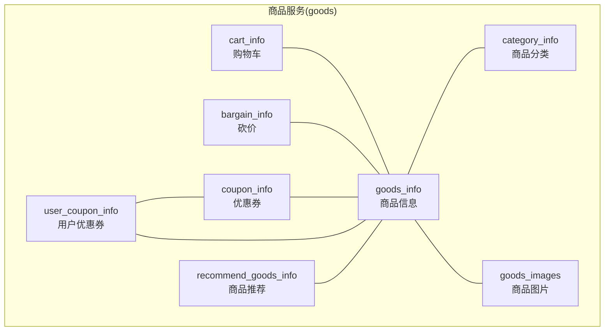
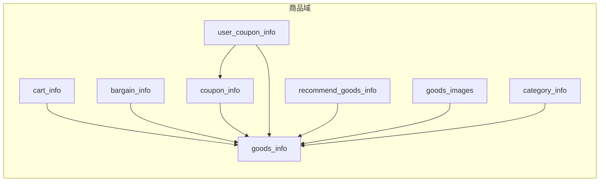
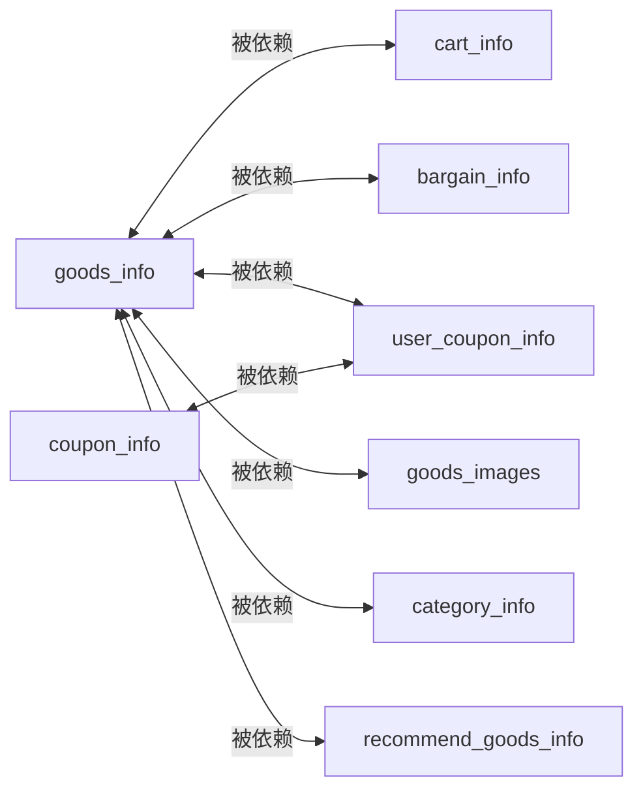

# 商品服务API

<cite>
**本文引用的文件**
- [app/goods/manifest/protobuf/goods_info/v1/goods_info.proto](file://app/goods/manifest/protobuf/goods_info/v1/goods_info.proto)
- [app/goods/manifest/protobuf/category_info/v1/category_info.proto](file://app/goods/manifest/protobuf/category_info/v1/category_info.proto)
- [app/goods/manifest/protobuf/cart_info/v1/cart_info.proto](file://app/goods/manifest/protobuf/cart_info/v1/cart_info.proto)
- [app/goods/manifest/protobuf/bargain_info/v1/bargain_info.proto](file://app/goods/manifest/protobuf/bargain_info/v1/bargain_info.proto)
- [app/goods/manifest/protobuf/coupon_info/v1/coupon_info.proto](file://app/goods/manifest/protobuf/coupon_info/v1/coupon_info.proto)
- [app/goods/manifest/protobuf/goods_images/v1/goods_images.proto](file://app/goods/manifest/protobuf/goods_images/v1/goods_images.proto)
- [app/goods/manifest/protobuf/recommend_goods_info/v1/recommend_goods_info.proto](file://app/goods/manifest/protobuf/recommend_goods_info/v1/recommend_goods_info.proto)
- [app/goods/manifest/protobuf/user_coupon_info/v1/user_coupon_info.proto](file://app/goods/manifest/protobuf/user_coupon_info/v1/user_coupon_info.proto)
</cite>

## 目录
1. [简介](#简介)
2. [项目结构](#项目结构)
3. [核心组件](#核心组件)
4. [架构总览](#架构总览)
5. [详细组件分析](#详细组件分析)
6. [依赖关系分析](#依赖关系分析)
7. [性能考虑](#性能考虑)
8. [故障排查指南](#故障排查指南)
9. [结论](#结论)
10. [附录](#附录)

## 简介
本文件为“商品服务”模块的 gRPC 接口文档，覆盖商品信息管理、商品分类、商品图片、购物车、砍价、优惠券及推荐等完整 API 定义。文档逐项说明各接口的请求参数、响应格式、业务规则与错误处理思路，并给出接口调用示例与性能优化建议。为便于定位实现，文中所有接口定义均指向对应的 .proto 文件。

## 项目结构
商品服务以“按领域分包”的方式组织，每个子域（如 goods_info、category_info、cart_info 等）均包含独立的 protobuf 定义与生成的 gRPC stub。接口通过 service 声明，请求/响应消息在同文件内定义，便于维护与扩展。

图表来源
- [app/goods/manifest/protobuf/goods_info/v1/goods_info.proto](file://app/goods/manifest/protobuf/goods_info/v1/goods_info.proto#L9-L22)
- [app/goods/manifest/protobuf/category_info/v1/category_info.proto](file://app/goods/manifest/protobuf/category_info/v1/category_info.proto#L9-L15)
- [app/goods/manifest/protobuf/cart_info/v1/cart_info.proto](file://app/goods/manifest/protobuf/cart_info/v1/cart_info.proto#L10-L14)
- [app/goods/manifest/protobuf/bargain_info/v1/bargain_info.proto](file://app/goods/manifest/protobuf/bargain_info/v1/bargain_info.proto#L10-L14)
- [app/goods/manifest/protobuf/coupon_info/v1/coupon_info.proto](file://app/goods/manifest/protobuf/coupon_info/v1/coupon_info.proto#L9-L14)
- [app/goods/manifest/protobuf/goods_images/v1/goods_images.proto](file://app/goods/manifest/protobuf/goods_images/v1/goods_images.proto#L9-L16)
- [app/goods/manifest/protobuf/recommend_goods_info/v1/recommend_goods_info.proto](file://app/goods/manifest/protobuf/recommend_goods_info/v1/recommend_goods_info.proto#L10-L12)
- [app/goods/manifest/protobuf/user_coupon_info/v1/user_coupon_info.proto](file://app/goods/manifest/protobuf/user_coupon_info/v1/user_coupon_info.proto#L9-L14)

章节来源
- [app/goods/manifest/protobuf/goods_info/v1/goods_info.proto](file://app/goods/manifest/protobuf/goods_info/v1/goods_info.proto#L1-L108)
- [app/goods/manifest/protobuf/category_info/v1/category_info.proto](file://app/goods/manifest/protobuf/category_info/v1/category_info.proto#L1-L77)
- [app/goods/manifest/protobuf/cart_info/v1/cart_info.proto](file://app/goods/manifest/protobuf/cart_info/v1/cart_info.proto#L1-L71)
- [app/goods/manifest/protobuf/bargain_info/v1/bargain_info.proto](file://app/goods/manifest/protobuf/bargain_info/v1/bargain_info.proto#L1-L74)
- [app/goods/manifest/protobuf/coupon_info/v1/coupon_info.proto](file://app/goods/manifest/protobuf/coupon_info/v1/coupon_info.proto#L1-L65)
- [app/goods/manifest/protobuf/goods_images/v1/goods_images.proto](file://app/goods/manifest/protobuf/goods_images/v1/goods_images.proto#L1-L56)
- [app/goods/manifest/protobuf/recommend_goods_info/v1/recommend_goods_info.proto](file://app/goods/manifest/protobuf/recommend_goods_info/v1/recommend_goods_info.proto#L1-L48)
- [app/goods/manifest/protobuf/user_coupon_info/v1/user_coupon_info.proto](file://app/goods/manifest/protobuf/user_coupon_info/v1/user_coupon_info.proto#L1-L64)

## 核心组件
- 商品信息服务：提供商品的增删改查、详情获取、列表查询、批量库存查询等能力。
- 商品分类服务：提供分类的增删改查、树形/列表查询等能力。
- 商品图片服务：提供图片与商品的关联、列表查询、删除等能力。
- 购物车服务：提供购物车项的增删、列表查询等能力。
- 砍价服务：提供砍价活动的创建、查询、删除等能力。
- 优惠券服务：提供优惠券的增删改查、列表查询等能力。
- 用户优惠券服务：提供用户持有优惠券的增删改查、列表查询等能力。
- 商品推荐服务：提供基于条件的商品推荐列表查询能力。

章节来源
- [app/goods/manifest/protobuf/goods_info/v1/goods_info.proto](file://app/goods/manifest/protobuf/goods_info/v1/goods_info.proto#L9-L22)
- [app/goods/manifest/protobuf/category_info/v1/category_info.proto](file://app/goods/manifest/protobuf/category_info/v1/category_info.proto#L9-L15)
- [app/goods/manifest/protobuf/cart_info/v1/cart_info.proto](file://app/goods/manifest/protobuf/cart_info/v1/cart_info.proto#L10-L14)
- [app/goods/manifest/protobuf/bargain_info/v1/bargain_info.proto](file://app/goods/manifest/protobuf/bargain_info/v1/bargain_info.proto#L10-L14)
- [app/goods/manifest/protobuf/coupon_info/v1/coupon_info.proto](file://app/goods/manifest/protobuf/coupon_info/v1/coupon_info.proto#L9-L14)
- [app/goods/manifest/protobuf/goods_images/v1/goods_images.proto](file://app/goods/manifest/protobuf/goods_images/v1/goods_images.proto#L9-L16)
- [app/goods/manifest/protobuf/recommend_goods_info/v1/recommend_goods_info.proto](file://app/goods/manifest/protobuf/recommend_goods_info/v1/recommend_goods_info.proto#L10-L12)
- [app/goods/manifest/protobuf/user_coupon_info/v1/user_coupon_info.proto](file://app/goods/manifest/protobuf/user_coupon_info/v1/user_coupon_info.proto#L9-L14)

## 架构总览
下图展示商品服务内部各子域之间的依赖关系与交互方向，便于理解数据流向与职责边界。

图表来源
- [app/goods/manifest/protobuf/goods_info/v1/goods_info.proto](file://app/goods/manifest/protobuf/goods_info/v1/goods_info.proto#L9-L22)
- [app/goods/manifest/protobuf/cart_info/v1/cart_info.proto](file://app/goods/manifest/protobuf/cart_info/v1/cart_info.proto#L10-L14)
- [app/goods/manifest/protobuf/bargain_info/v1/bargain_info.proto](file://app/goods/manifest/protobuf/bargain_info/v1/bargain_info.proto#L10-L14)
- [app/goods/manifest/protobuf/coupon_info/v1/coupon_info.proto](file://app/goods/manifest/protobuf/coupon_info/v1/coupon_info.proto#L9-L14)
- [app/goods/manifest/protobuf/user_coupon_info/v1/user_coupon_info.proto](file://app/goods/manifest/protobuf/user_coupon_info/v1/user_coupon_info.proto#L9-L14)
- [app/goods/manifest/protobuf/recommend_goods_info/v1/recommend_goods_info.proto](file://app/goods/manifest/protobuf/recommend_goods_info/v1/recommend_goods_info.proto#L10-L12)
- [app/goods/manifest/protobuf/goods_images/v1/goods_images.proto](file://app/goods/manifest/protobuf/goods_images/v1/goods_images.proto#L9-L16)
- [app/goods/manifest/protobuf/category_info/v1/category_info.proto](file://app/goods/manifest/protobuf/category_info/v1/category_info.proto#L9-L15)

## 详细组件分析

### 商品信息服务（goods_info）
- 服务名：goods_info
- 提供接口：
  - GetList：分页获取商品列表，支持热门筛选
  - GetDetail：根据商品ID获取详情
  - Create：创建商品
  - Update：修改商品
  - Delete：删除商品
  - GetGoodsStock：批量查询商品库存

请求/响应要点
- GetList
  - 请求：page、size、is_hot
  - 响应：data.list、data.page、data.size、data.total
- GetDetail
  - 请求：id
  - 响应：data（包含商品实体）
- Create/Update
  - 请求：name、price、PicUrl、Images、三级分类ID、brand、stock、sale、tags、detail_info、sort
  - 响应：id
- Delete
  - 请求：id
  - 响应：空
- GetGoodsStock
  - 请求：goods_ids（重复字段）
  - 响应：goods_stock（map<id, stock>）

业务规则与错误处理
- Create/Update 需校验价格、库存、分类层级与品牌等字段合法性
- GetGoodsStock 返回缺失ID对应的库存为0或忽略，视后端策略而定
- GetList 的 is_hot 通常用于推荐场景的过滤

接口调用示例（示意）
- 列表查询：GetList(page=1, size=20, is_hot=1)
- 详情查询：GetDetail(id=123)
- 批量库存：GetGoodsStock(goods_ids=[1001,1002])

章节来源
- [app/goods/manifest/protobuf/goods_info/v1/goods_info.proto](file://app/goods/manifest/protobuf/goods_info/v1/goods_info.proto#L9-L22)
- [app/goods/manifest/protobuf/goods_info/v1/goods_info.proto](file://app/goods/manifest/protobuf/goods_info/v1/goods_info.proto#L84-L108)

### 商品分类服务（category_info）
- 服务名：category_info
- 提供接口：
  - GetList：分页获取分类列表
  - GetAll：获取全部分类
  - Create：创建分类
  - Update：修改分类
  - Delete：删除分类

请求/响应要点
- GetList：sort、page、size
- GetAll：无参数
- Create/Update：ParentId、Name、PicUrl、Level、Sort
- Delete：id
- 响应：统一包装 data.list、data.page、data.size、data.total 或 data.list、data.total

业务规则与错误处理
- 分类层级（Level）与父子关系需保持一致
- 同名分类在同级需唯一
- 删除前需检查是否存在子分类或绑定商品

接口调用示例（示意）
- 分类列表：GetList(sort=1, page=1, size=50)
- 全部分类：GetAll()

章节来源
- [app/goods/manifest/protobuf/category_info/v1/category_info.proto](file://app/goods/manifest/protobuf/category_info/v1/category_info.proto#L9-L15)
- [app/goods/manifest/protobuf/category_info/v1/category_info.proto](file://app/goods/manifest/protobuf/category_info/v1/category_info.proto#L51-L77)

### 商品图片服务（goods_images）
- 服务名：goods_images
- 提供接口：
  - GetList：分页获取图片列表
  - Create：创建图片关联
  - Delete：删除图片关联

请求/响应要点
- Create：GoodsId、FileId、Sort
- Delete：id
- GetList：page、size
- 响应：data.list、data.page、data.size、data.total

业务规则与错误处理
- FileId 需与资源服务中的文件存在且有效
- Sort 用于前端轮播/展示顺序
- 删除仅解除关联，不删除物理文件

接口调用示例（示意）
- 图片列表：GetList(page=1, size=100)
- 关联图片：Create(GoodsId=123, FileId=456, Sort=1)

章节来源
- [app/goods/manifest/protobuf/goods_images/v1/goods_images.proto](file://app/goods/manifest/protobuf/goods_images/v1/goods_images.proto#L9-L16)
- [app/goods/manifest/protobuf/goods_images/v1/goods_images.proto](file://app/goods/manifest/protobuf/goods_images/v1/goods_images.proto#L41-L56)

### 购物车服务（cart_info）
- 服务名：cart_info
- 提供接口：
  - GetList：分页获取购物车列表（返回商品聚合信息）
  - Create：加入购物车
  - Delete：删除购物车项

请求/响应要点
- Create：GoodsId、Count、UserId
- Delete：id、user_id
- GetList：page、size、UserId
- 响应：data.list（CartItem 数组）、data.page、data.size、data.total
  - CartItem 字段包含：id、user_id、count、goods_*（名称、主图、价格、品牌、库存、销量、标签、排序、创建/更新时间）

业务规则与错误处理
- 加入购物车需校验库存与用户有效性
- 删除需校验归属用户
- 列表返回包含商品维度的合并信息，便于前端直接渲染

接口调用示例（示意）
- 购物车列表：GetList(page=1, size=50, UserId=789)
- 加入购物车：Create(GoodsId=123, Count=2, UserId=789)

章节来源
- [app/goods/manifest/protobuf/cart_info/v1/cart_info.proto](file://app/goods/manifest/protobuf/cart_info/v1/cart_info.proto#L10-L14)
- [app/goods/manifest/protobuf/cart_info/v1/cart_info.proto](file://app/goods/manifest/protobuf/cart_info/v1/cart_info.proto#L36-L71)

### 砍价服务（bargain_info）
- 服务名：bargain_info
- 提供接口：
  - GetList：查询砍价信息（支持按 Id/UserId/GoodsId 过滤）
  - Create：创建砍价活动
  - Delete：删除砍价活动

请求/响应要点
- Create：UserID、GoodsID、counts
- GetList：Id、UserId、GoodsId
- Delete：UserId、GoodsId、Id
- 响应：包含创建/更新/删除的时间戳字段

业务规则与错误处理
- counts 表示最大帮砍次数，超过则活动失效
- 时间字段用于前端显示有效期与倒计时
- 删除需校验用户与活动归属

接口调用示例（示意）
- 查询砍价：GetList(UserId=789, GoodsId=123)
- 创建砍价：Create(UserID=789, GoodsID=123, counts=5)

章节来源
- [app/goods/manifest/protobuf/bargain_info/v1/bargain_info.proto](file://app/goods/manifest/protobuf/bargain_info/v1/bargain_info.proto#L10-L14)
- [app/goods/manifest/protobuf/bargain_info/v1/bargain_info.proto](file://app/goods/manifest/protobuf/bargain_info/v1/bargain_info.proto#L35-L52)

### 优惠券服务（coupon_info）
- 服务名：coupon_info
- 提供接口：
  - GetList：分页获取优惠券列表
  - Create：创建优惠券
  - Update：修改优惠券
  - Delete：删除优惠券

请求/响应要点
- Create：GoodsId（0 表示全场通用）、Name、Type、Amount（分）、Deadline
- Update/Delete：同字段编号
- GetList：page、size
- 响应：data.list、data.page、data.size、data.total

业务规则与错误处理
- Amount 以“分”为最小单位，Deadline 为过期时间
- GoodsId=0 表示全场可用；否则仅限指定商品
- 删除前需检查是否已被用户领取

接口调用示例（示意）
- 优惠券列表：GetList(page=1, size=100)
- 创建优惠券：Create(GoodsId=0, Name="满减券", Type=1, Amount=1000, Deadline="2025-12-31")

章节来源
- [app/goods/manifest/protobuf/coupon_info/v1/coupon_info.proto](file://app/goods/manifest/protobuf/coupon_info/v1/coupon_info.proto#L9-L14)
- [app/goods/manifest/protobuf/coupon_info/v1/coupon_info.proto](file://app/goods/manifest/protobuf/coupon_info/v1/coupon_info.proto#L29-L65)

### 用户优惠券服务（user_coupon_info）
- 服务名：user_coupon_info
- 提供接口：
  - GetList：分页获取用户持有的优惠券列表
  - Create：发放/领取用户优惠券
  - Update：更新用户优惠券状态
  - Delete：删除用户优惠券

请求/响应要点
- Create：UserId、CouponId、Status（0-待使用，1-已使用，2-已过期）、Amount（分）
- Update/Delete：同字段编号
- GetList：page、size、UserId
- 响应：data.list、data.page、data.size、data.total

业务规则与错误处理
- 发放时需校验用户与优惠券的有效性、每人限领规则
- 状态变更需遵循业务流转（未用→已用→已过期）
- 删除仅清理记录，不影响全局优惠券

接口调用示例（示意）
- 用户优惠券列表：GetList(page=1, size=50, UserId=789)
- 领取优惠券：Create(UserId=789, CouponId=10, Status=0, Amount=1000)

章节来源
- [app/goods/manifest/protobuf/user_coupon_info/v1/user_coupon_info.proto](file://app/goods/manifest/protobuf/user_coupon_info/v1/user_coupon_info.proto#L9-L14)
- [app/goods/manifest/protobuf/user_coupon_info/v1/user_coupon_info.proto](file://app/goods/manifest/protobuf/user_coupon_info/v1/user_coupon_info.proto#L28-L64)

### 商品推荐服务（recommend_goods_info）
- 服务名：RecommendGoodsInfo
- 提供接口：
  - GetList：根据条件获取推荐商品列表

请求/响应要点
- GetList：id（可选）、count（数量）
- 响应：data.list（商品实体数组）、data.total

业务规则与错误处理
- 推荐策略由后端实现（如协同、热门、相似等），接口仅负责返回商品集合
- 当 id 存在时，可作为种子进行相似推荐

接口调用示例（示意）
- 推荐列表：GetList(id=123, count=10)

章节来源
- [app/goods/manifest/protobuf/recommend_goods_info/v1/recommend_goods_info.proto](file://app/goods/manifest/protobuf/recommend_goods_info/v1/recommend_goods_info.proto#L10-L12)
- [app/goods/manifest/protobuf/recommend_goods_info/v1/recommend_goods_info.proto](file://app/goods/manifest/protobuf/recommend_goods_info/v1/recommend_goods_info.proto#L17-L48)

## 依赖关系分析
- 购物车、砍价、用户优惠券均依赖商品信息；用户优惠券依赖优惠券模板；商品图片与分类服务于商品信息。
- 推荐服务依赖商品信息，可能结合用户行为与商品特征进行排序。

图表来源
- [app/goods/manifest/protobuf/cart_info/v1/cart_info.proto](file://app/goods/manifest/protobuf/cart_info/v1/cart_info.proto#L10-L14)
- [app/goods/manifest/protobuf/bargain_info/v1/bargain_info.proto](file://app/goods/manifest/protobuf/bargain_info/v1/bargain_info.proto#L10-L14)
- [app/goods/manifest/protobuf/user_coupon_info/v1/user_coupon_info.proto](file://app/goods/manifest/protobuf/user_coupon_info/v1/user_coupon_info.proto#L9-L14)
- [app/goods/manifest/protobuf/goods_images/v1/goods_images.proto](file://app/goods/manifest/protobuf/goods_images/v1/goods_images.proto#L9-L16)
- [app/goods/manifest/protobuf/category_info/v1/category_info.proto](file://app/goods/manifest/protobuf/category_info/v1/category_info.proto#L9-L15)
- [app/goods/manifest/protobuf/recommend_goods_info/v1/recommend_goods_info.proto](file://app/goods/manifest/protobuf/recommend_goods_info/v1/recommend_goods_info.proto#L10-L12)

## 性能考虑
- 缓存策略
  - 商品详情与列表：利用多级缓存（本地/Redis）降低数据库压力；对热点商品设置短 TTL 并异步刷新
  - 分类树：缓存全量树结构，写入时广播失效
  - 购物车：用户维度缓存，落库前做幂等与去重
- 批量接口
  - GetGoodsStock：批量查询库存，减少 RPC 次数；对缺失 ID 做兜底处理
  - GetList：分页大小建议控制在合理范围（如 20~100），避免单次传输过大
- 异步任务
  - 优惠券核销、库存扣减、推荐更新等可放入消息队列，削峰填谷
- 数据库优化
  - 为商品、分类、图片、优惠券建立必要索引；分表分库按业务维度拆分
- gRPC 优化
  - 合理设置超时与重试；启用压缩；避免在单次 RPC 中传输冗余字段

## 故障排查指南
- 参数校验失败
  - 现象：返回参数非法或业务异常
  - 处理：检查请求字段类型与取值范围（如 price、stock、level、sort 等）
- 权限与归属校验失败
  - 现象：删除/更新被拒绝
  - 处理：确认用户身份与资源归属（如购物车项 user_id、砍价活动 UserId）
- 库存不足或超卖
  - 现象：下单/加购失败
  - 处理：采用分布式锁或原子扣减（Lua）保证一致性
- 推荐结果为空
  - 现象：RecommendGoodsInfo.GetList 返回空
  - 处理：检查推荐策略与 seed 商品是否存在；扩大 count 或放宽条件

## 结论
本文档系统梳理了商品服务的 gRPC 接口族，明确了各子域的职责与依赖关系，并提供了参数、响应、业务规则与性能优化建议。建议在接入时严格遵循请求/响应契约，配合缓存与异步机制提升整体吞吐与稳定性。

## 附录
- 接口调用示例（示意）
  - 商品：GetDetail(id=123)、GetList(page=1,size=20,is_hot=1)、GetGoodsStock(goods_ids=[1001,1002])
  - 分类：GetAll()、GetList(sort=1,page=1,size=50)
  - 图片：GetList(page=1,size=100)、Create(GoodsId=123,FileId=456,Sort=1)
  - 购物车：GetList(page=1,size=50,UserId=789)、Create(GoodsId=123,Count=2,UserId=789)
  - 砍价：GetList(UserId=789,GoodsId=123)、Create(UserID=789,GoodsID=123,counts=5)
  - 优惠券：GetList(page=1,size=100)、Create(GoodsId=0,Name="满减券",Type=1,Amount=1000,Deadline="2025-12-31")
  - 用户优惠券：GetList(page=1,size=50,UserId=789)、Create(UserId=789,CouponId=10,Status=0,Amount=1000)
  - 推荐：GetList(id=123,count=10)