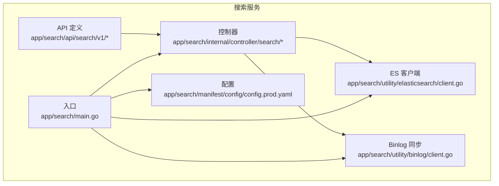
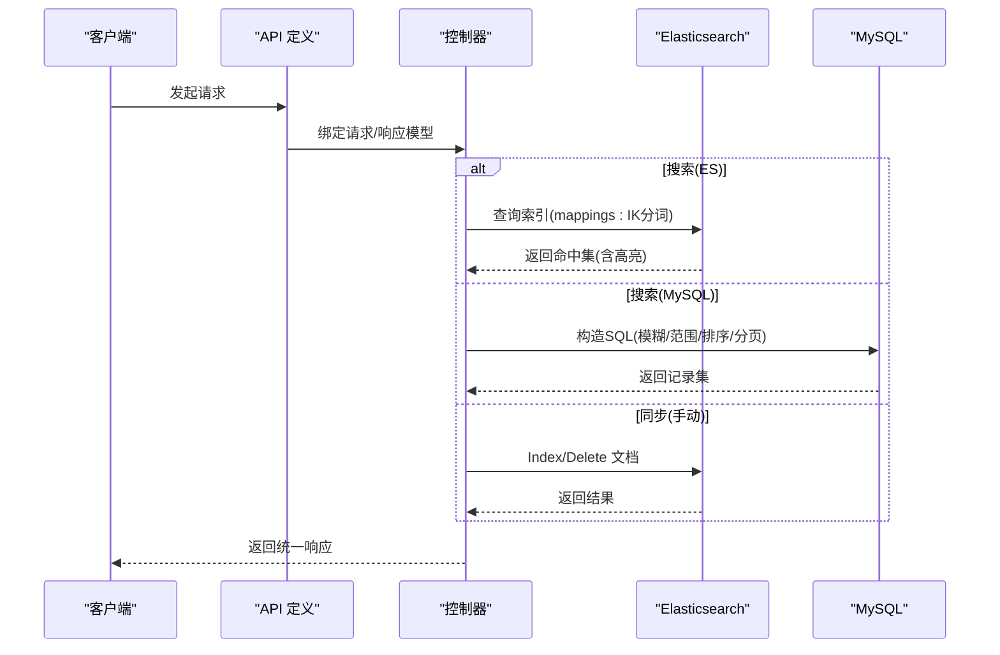
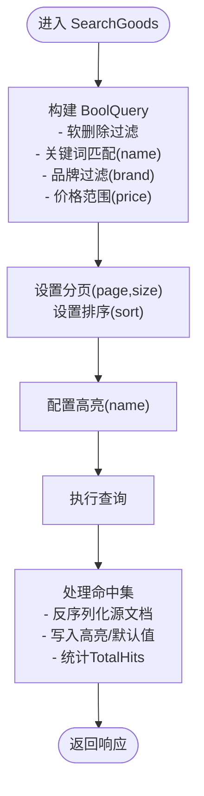
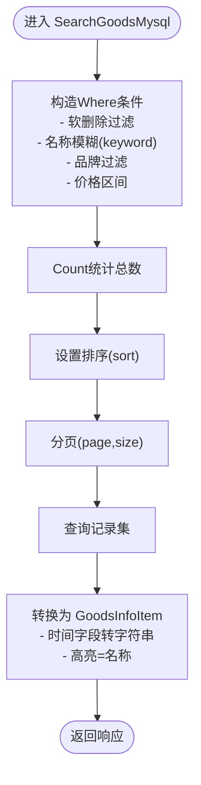
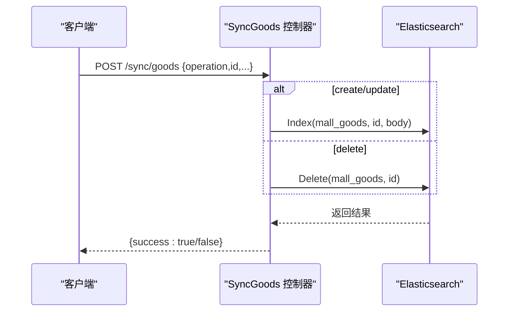
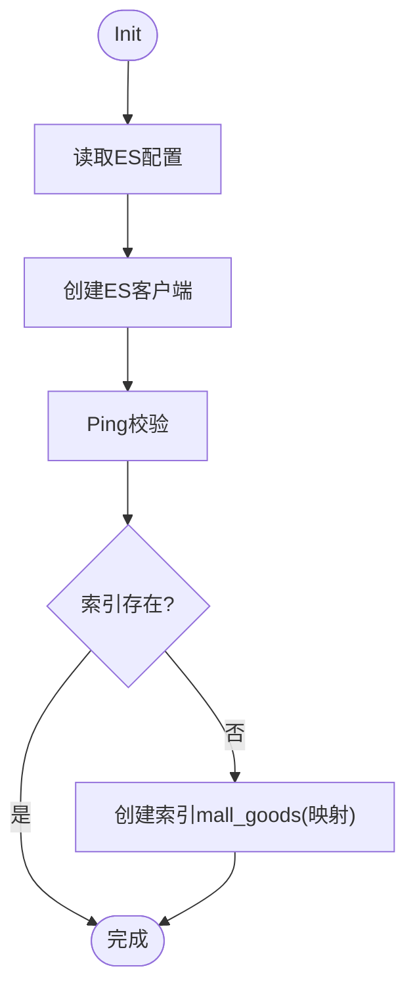
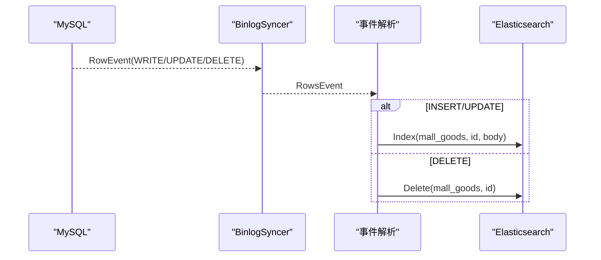
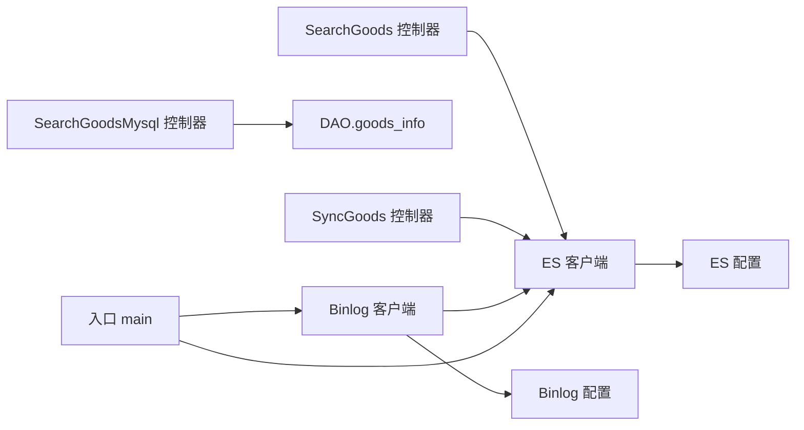

# 搜索服务API

<cite>
**本文引用的文件**
- [app/search/api/search/v1/search.go](file://app/search/api/search/v1/search.go)
- [app/search/api/search/v1/search_mysql.go](file://app/search/api/search/v1/search_mysql.go)
- [app/search/api/search/v1/sync.go](file://app/search/api/search/v1/sync.go)
- [app/search/internal/controller/search/search_v1_search_goods.go](file://app/search/internal/controller/search/search_v1_search_goods.go)
- [app/search/internal/controller/search/search_v1_search_goods_mysql.go](file://app/search/internal/controller/search/search_v1_search_goods_mysql.go)
- [app/search/internal/controller/search/search_v1_sync_goods.go](file://app/search/internal/controller/search/search_v1_sync_goods.go)
- [app/search/utility/elasticsearch/client.go](file://app/search/utility/elasticsearch/client.go)
- [app/search/utility/binlog/client.go](file://app/search/utility/binlog/client.go)
- [app/search/main.go](file://app/search/main.go)
- [app/search/manifest/config/config.prod.yaml](file://app/search/manifest/config/config.prod.yaml)
- [app/search/internal/model/do/goods_info.go](file://app/search/internal/model/do/goods_info.go)
</cite>

## 目录
1. [简介](#简介)
2. [项目结构](#项目结构)
3. [核心组件](#核心组件)
4. [架构总览](#架构总览)
5. [详细组件分析](#详细组件分析)
6. [依赖分析](#依赖分析)
7. [性能考虑](#性能考虑)
8. [故障排查指南](#故障排查指南)
9. [结论](#结论)
10. [附录](#附录)

## 简介
本文件为“搜索服务”API接口文档，覆盖以下能力：
- 商品搜索：基于 Elasticsearch 的关键词检索、条件过滤、结果排序、分页查询与高亮展示
- MySQL 搜索：基于数据库的关键词匹配、条件过滤、排序与分页
- 数据同步：支持手动触发与 MySQL Binlog 实时同步至 Elasticsearch
- 技术实现：Elasticsearch 集成、索引管理、搜索算法优化、缓存策略、埋点与统计分析建议
- 结果处理：高亮、相关性排序、时间字段规范化、错误处理与日志记录

## 项目结构
搜索服务采用 GoFrame 微服务框架，主要模块如下：
- API 定义层：位于 app/search/api/search/v1，定义请求/响应模型与路由元信息
- 控制器层：位于 app/search/internal/controller/search，实现具体业务逻辑
- 工具层：Elasticsearch 客户端与 Binlog 同步工具
- 入口与配置：main.go 启动 ES 初始化与 Binlog 监听；配置位于 manifest/config/config.prod.yaml

图表来源
- [app/search/main.go](file://app/search/main.go#L1-L25)
- [app/search/utility/elasticsearch/client.go](file://app/search/utility/elasticsearch/client.go#L1-L113)
- [app/search/utility/binlog/client.go](file://app/search/utility/binlog/client.go#L1-L203)
- [app/search/api/search/v1/search.go](file://app/search/api/search/v1/search.go#L1-L45)
- [app/search/api/search/v1/search_mysql.go](file://app/search/api/search/v1/search_mysql.go#L1-L24)
- [app/search/api/search/v1/sync.go](file://app/search/api/search/v1/sync.go#L1-L31)

章节来源
- [app/search/main.go](file://app/search/main.go#L1-L25)
- [app/search/manifest/config/config.prod.yaml](file://app/search/manifest/config/config.prod.yaml#L1-L39)

## 核心组件
- 商品搜索接口（Elasticsearch）
  - 路径：GET /search/goods
  - 功能：关键词匹配、品牌过滤、价格区间过滤、排序（默认/价格升序/价格降序/销量）、分页、高亮
- 商品搜索接口（MySQL）
  - 路径：GET /search/goods/mysql
  - 功能：关键词模糊匹配、品牌过滤、价格区间过滤、排序（默认按 sort 降序再按创建时间降序）、分页
- 商品数据同步接口（手动）
  - 路径：POST /sync/goods
  - 功能：create/update/delete 操作，写入/更新/删除 ES 文档
- Elasticsearch 客户端与索引管理
  - 初始化、健康检查、自动创建商品索引、映射配置（IK 分词器）
- Binlog 实时同步
  - 监听 MySQL goods_info 表变更，自动 upsert 或 delete ES 文档

章节来源
- [app/search/api/search/v1/search.go](file://app/search/api/search/v1/search.go#L7-L44)
- [app/search/api/search/v1/search_mysql.go](file://app/search/api/search/v1/search_mysql.go#L7-L23)
- [app/search/api/search/v1/sync.go](file://app/search/api/search/v1/sync.go#L7-L30)
- [app/search/utility/elasticsearch/client.go](file://app/search/utility/elasticsearch/client.go#L12-L112)
- [app/search/utility/binlog/client.go](file://app/search/utility/binlog/client.go#L14-L202)

## 架构总览
搜索服务整体架构由“API 层 -> 控制器层 -> 工具层（ES/Binlog）”构成，并通过配置驱动 ES 地址、索引名与 Binlog 连接参数。

图表来源
- [app/search/internal/controller/search/search_v1_search_goods.go](file://app/search/internal/controller/search/search_v1_search_goods.go#L17-L134)
- [app/search/internal/controller/search/search_v1_search_goods_mysql.go](file://app/search/internal/controller/search/search_v1_search_goods_mysql.go#L19-L99)
- [app/search/internal/controller/search/search_v1_sync_goods.go](file://app/search/internal/controller/search/search_v1_sync_goods.go#L16-L60)
- [app/search/utility/elasticsearch/client.go](file://app/search/utility/elasticsearch/client.go#L12-L112)

## 详细组件分析

### 商品搜索（Elasticsearch）
- 请求参数
  - keyword：关键词（用于匹配商品名称）
  - brand：品牌（精确匹配）
  - min_price/max_price：价格区间（单位分）
  - sort：排序方式（default/price_asc/price_desc/sale）
  - page/size：分页（page 最小为1，size 最大为100）
- 处理逻辑
  - 构建 BoolQuery：软删除过滤、关键词匹配、品牌过滤、价格范围过滤
  - 设置分页与排序（默认按相关性_score）
  - 高亮字段 name，返回高亮片段
  - 统计 TotalHits 并组装 GoodsInfoItem 列表
- 响应结构
  - list：商品项数组（包含高亮字段）
  - page/size/total：分页与总数

图表来源
- [app/search/internal/controller/search/search_v1_search_goods.go](file://app/search/internal/controller/search/search_v1_search_goods.go#L32-L134)
- [app/search/api/search/v1/search.go](file://app/search/api/search/v1/search.go#L7-L44)

章节来源
- [app/search/internal/controller/search/search_v1_search_goods.go](file://app/search/internal/controller/search/search_v1_search_goods.go#L17-L134)
- [app/search/api/search/v1/search.go](file://app/search/api/search/v1/search.go#L7-L44)

### 商品搜索（MySQL）
- 请求参数
  - keyword：名称模糊匹配（包含关键词）
  - brand：品牌过滤
  - min_price/max_price：价格区间
  - sort：排序方式（price_asc/price_desc/sale），默认按 sort 降序再按 created_at 降序
  - page/size：分页
- 处理逻辑
  - 构造 Where 条件（软删除过滤 deleted_at IS NULL）
  - 计算总数并分页查询
  - 结果集转换为 GoodsInfoItem，时间字段转为字符串
- 响应结构
  - list：商品项数组（高亮字段等于名称）
  - page/size/total：分页与总数

图表来源
- [app/search/internal/controller/search/search_v1_search_goods_mysql.go](file://app/search/internal/controller/search/search_v1_search_goods_mysql.go#L19-L99)
- [app/search/api/search/v1/search_mysql.go](file://app/search/api/search/v1/search_mysql.go#L7-L23)

章节来源
- [app/search/internal/controller/search/search_v1_search_goods_mysql.go](file://app/search/internal/controller/search/search_v1_search_goods_mysql.go#L19-L99)
- [app/search/api/search/v1/search_mysql.go](file://app/search/api/search/v1/search_mysql.go#L7-L23)

### 商品数据同步（手动）
- 请求参数
  - id/name/images/price/分类/品牌/库存/销量/标签/详情/排序/时间戳
  - operation：create/update/delete
- 处理逻辑
  - 根据 operation 决定 Index 或 Delete
  - 写入 mall_goods 索引
- 响应结构
  - success：布尔值

图表来源
- [app/search/internal/controller/search/search_v1_sync_goods.go](file://app/search/internal/controller/search/search_v1_sync_goods.go#L16-L60)
- [app/search/api/search/v1/sync.go](file://app/search/api/search/v1/sync.go#L7-L30)

章节来源
- [app/search/internal/controller/search/search_v1_sync_goods.go](file://app/search/internal/controller/search/search_v1_sync_goods.go#L16-L60)
- [app/search/api/search/v1/sync.go](file://app/search/api/search/v1/sync.go#L7-L30)

### Elasticsearch 客户端与索引管理
- 初始化
  - 读取配置 elasticsearch.address/sniff/healthcheck
  - 创建客户端并 Ping 成功
  - 自动创建商品索引 mall_goods（若不存在）
- 索引映射
  - 字段类型与分词器：name 使用 ik_max_word/ik_smart；brand 支持 keyword+text；其他数值/文本/时间字段
- 客户端获取
  - 提供 GetClient 方法供控制器调用

图表来源
- [app/search/utility/elasticsearch/client.go](file://app/search/utility/elasticsearch/client.go#L12-L112)

章节来源
- [app/search/utility/elasticsearch/client.go](file://app/search/utility/elasticsearch/client.go#L12-L112)

### Binlog 实时同步
- 启动
  - 从配置读取 MySQL 连接参数，创建 BinlogSyncer
  - 从当前位置开始同步（可扩展为持久化位点）
- 事件处理
  - 仅处理 goods.goods_info 表的 INSERT/UPDATE/DELETE 事件
  - 将行数据解析为 map，调用 upsertToES 或 deleteFromES
- ES 同步
  - upsertToES：Index 写入 mall_goods
  - deleteFromES：Delete 指定 id

图表来源
- [app/search/utility/binlog/client.go](file://app/search/utility/binlog/client.go#L14-L202)
- [app/search/utility/elasticsearch/client.go](file://app/search/utility/elasticsearch/client.go#L47-L50)

章节来源
- [app/search/utility/binlog/client.go](file://app/search/utility/binlog/client.go#L14-L202)

## 依赖分析
- 控制器依赖
  - SearchGoods 依赖 Elasticsearch 客户端与配置项 elasticsearch.indices.goods
  - SearchGoodsMysql 依赖 DAO 查询 goods_info 表
  - SyncGoods 依赖 Elasticsearch 客户端
- 工具依赖
  - Elasticsearch 客户端依赖配置 elasticsearch.address/sniff/healthcheck/indices.goods
  - Binlog 客户端依赖配置 binlog.goods.mysql.* 与 ES 客户端
- 入口依赖
  - main 初始化 ES 并后台启动 Binlog 监听

图表来源
- [app/search/internal/controller/search/search_v1_search_goods.go](file://app/search/internal/controller/search/search_v1_search_goods.go#L32-L33)
- [app/search/internal/controller/search/search_v1_search_goods_mysql.go](file://app/search/internal/controller/search/search_v1_search_goods_mysql.go#L30-L31)
- [app/search/internal/controller/search/search_v1_sync_goods.go](file://app/search/internal/controller/search/search_v1_sync_goods.go#L17-L20)
- [app/search/utility/elasticsearch/client.go](file://app/search/utility/elasticsearch/client.go#L14-L23)
- [app/search/utility/binlog/client.go](file://app/search/utility/binlog/client.go#L17-L30)
- [app/search/main.go](file://app/search/main.go#L16-L21)

章节来源
- [app/search/main.go](file://app/search/main.go#L16-L21)
- [app/search/manifest/config/config.prod.yaml](file://app/search/manifest/config/config.prod.yaml#L24-L38)

## 性能考虑
- 搜索性能优化
  - 使用 IK 分词器提升中文检索效果
  - 合理使用 filter 查询（不参与评分）降低开销
  - 限制分页 size（最大100）避免深分页
  - 对高频字段建立合适的映射与索引
- 缓存策略
  - 对热门关键词与热门筛选组合进行结果缓存
  - 对稳定商品详情与图片资源使用 CDN 缓存
- 搜索统计分析
  - 埋点建议：关键词曝光、点击、加购、购买转化
  - 指标建议：搜索耗时、命中率、点击率、空结果占比
- 索引管理
  - 定期优化索引（合并段、刷新映射）
  - 对软删除字段使用过滤而非删除重建
- 数据同步
  - Binlog 同步保证实时性；批量写入时注意 ES 的 refresh 策略与批量大小

## 故障排查指南
- ES 客户端未初始化
  - 现象：控制器返回“搜索服务暂不可用”
  - 排查：确认 main 中 Init 是否成功、配置 elasticsearch.address 可访问
- ES Ping 失败
  - 现象：初始化报错
  - 排查：网络连通性、地址配置、健康检查开关
- 索引不存在或映射缺失
  - 现象：查询无结果或字段类型异常
  - 排查：确认 createGoodsIndex 是否执行、索引名 mall_goods 是否正确
- Binlog 同步失败
  - 现象：ES 与 MySQL 数据不一致
  - 排查：MySQL 连接参数、表名/库名匹配、事件类型处理
- 查询异常
  - 现象：返回内部错误
  - 排查：查看控制器日志、ES 查询源、参数校验

章节来源
- [app/search/internal/controller/search/search_v1_search_goods.go](file://app/search/internal/controller/search/search_v1_search_goods.go#L34-L37)
- [app/search/utility/elasticsearch/client.go](file://app/search/utility/elasticsearch/client.go#L33-L36)
- [app/search/utility/binlog/client.go](file://app/search/utility/binlog/client.go#L44-L46)

## 结论
本搜索服务提供了完善的商品检索能力：既支持高性能的 Elasticsearch 搜索，也保留了可靠的 MySQL 搜索作为兜底；通过 Binlog 实现近实时的数据同步，保障 ES 与 MySQL 的一致性。配合合理的索引映射、排序与高亮策略，能够满足电商场景下的关键词检索、条件过滤与分页需求。建议后续结合埋点与统计分析持续优化搜索体验与性能。

## 附录

### API 定义一览
- 商品搜索（Elasticsearch）
  - 方法：GET
  - 路径：/search/goods
  - 请求参数：keyword、brand、min_price、max_price、sort、page、size
  - 响应：list/page/size/total
- 商品搜索（MySQL）
  - 方法：GET
  - 路径：/search/goods/mysql
  - 请求参数：keyword、brand、min_price、max_price、sort、page、size
  - 响应：list/page/size/total
- 商品数据同步（手动）
  - 方法：POST
  - 路径：/sync/goods
  - 请求参数：id、name、images、price、level1/2/3_category_id、brand、stock、sale、tags、sort、detail_info、operation、created_at、updated_at、deleted_at
  - 响应：success

章节来源
- [app/search/api/search/v1/search.go](file://app/search/api/search/v1/search.go#L7-L23)
- [app/search/api/search/v1/search_mysql.go](file://app/search/api/search/v1/search_mysql.go#L7-L23)
- [app/search/api/search/v1/sync.go](file://app/search/api/search/v1/sync.go#L7-L30)

### 数据模型与映射
- 商品实体（DAO）
  - 字段：id、name、pic_url、images、price、level1/2/3_category_id、brand、stock、sale、tags、detail_info、sort、created_at、updated_at、deleted_at
- ES 映射要点
  - name：text + ik_max_word/ik_smart
  - brand：keyword + text 子字段
  - 数值字段：long
  - 时间字段：text

章节来源
- [app/search/internal/model/do/goods_info.go](file://app/search/internal/model/do/goods_info.go#L13-L32)
- [app/search/utility/elasticsearch/client.go](file://app/search/utility/elasticsearch/client.go#L67-L97)