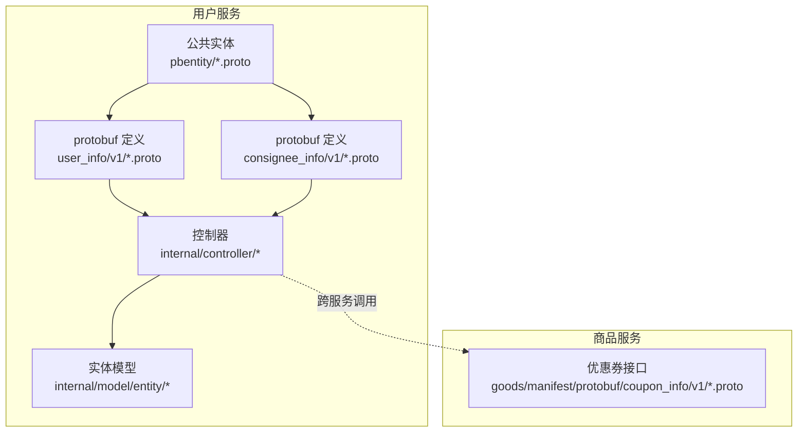
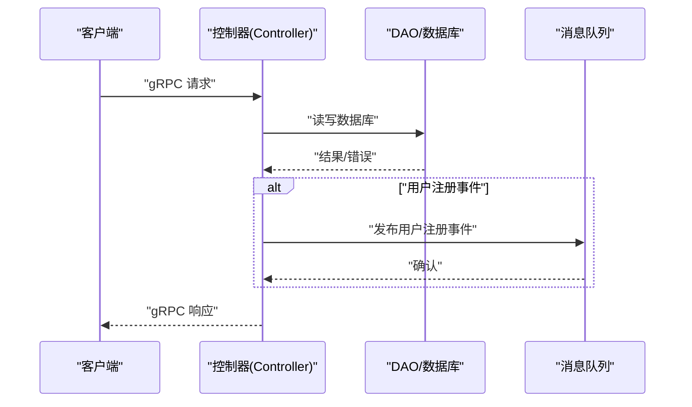
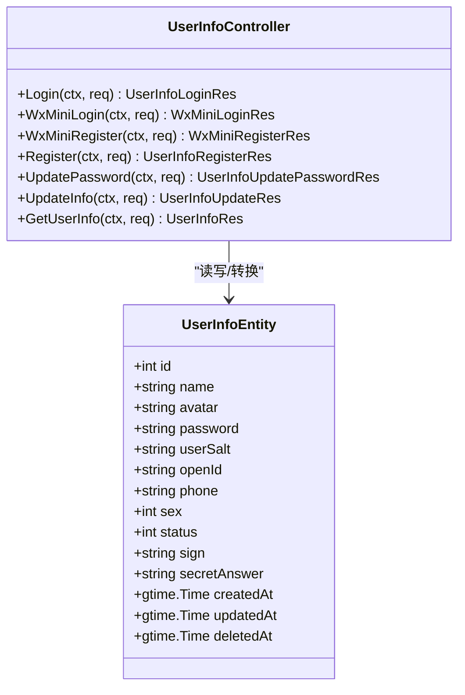
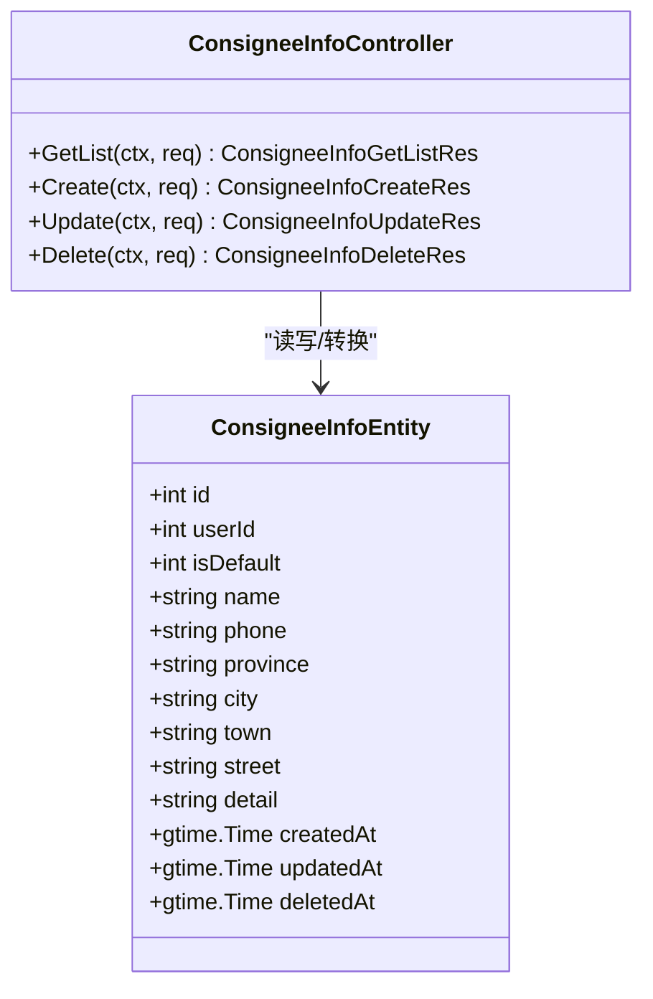
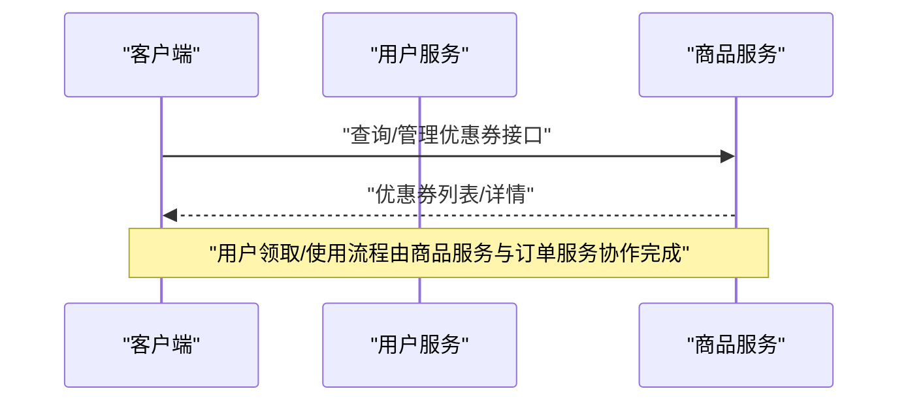
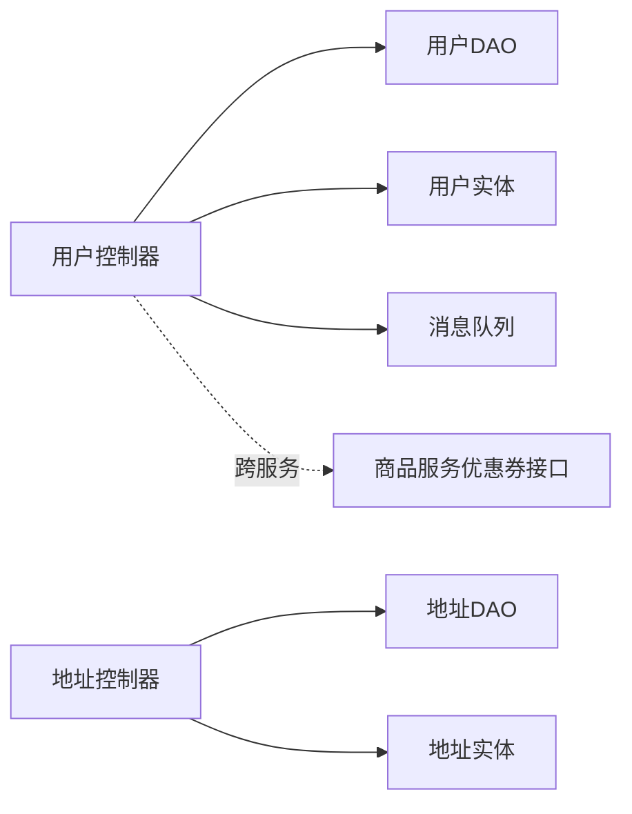

# 用户服务API

<cite>
**本文引用的文件**
- [app/user/manifest/protobuf/user_info/v1/user_info.proto](file://app/user/manifest/protobuf/user_info/v1/user_info.proto)
- [app/user/manifest/protobuf/consignee_info/v1/consignee_info.proto](file://app/user/manifest/protobuf/consignee_info/v1/consignee_info.proto)
- [app/user/manifest/protobuf/pbentity/user_info.proto](file://app/user/manifest/protobuf/pbentity/user_info.proto)
- [app/user/manifest/protobuf/pbentity/consignee_info.proto](file://app/user/manifest/protobuf/pbentity/consignee_info.proto)
- [app/user/internal/controller/user_info/user_info.go](file://app/user/internal/controller/user_info/user_info.go)
- [app/user/internal/controller/consignee_info/consignee_info.go](file://app/user/internal/controller/consignee_info/consignee_info.go)
- [app/user/internal/controller/coupon/coupon.go](file://app/user/internal/controller/coupon/coupon.go)
- [app/user/internal/controller/user_coupon_info/user_coupon_info.go](file://app/user/internal/controller/user_coupon_info/user_coupon_info.go)
- [app/user/internal/model/entity/user_info.go](file://app/user/internal/model/entity/user_info.go)
- [app/user/internal/model/entity/consignee_info.go](file://app/user/internal/model/entity/consignee_info.go)
- [app/goods/manifest/protobuf/coupon_info/v1/coupon_info.proto](file://app/goods/manifest/protobuf/coupon_info/v1/coupon_info.proto)
- [app/goods/manifest/protobuf/pbentity/coupon_info.proto](file://app/goods/manifest/protobuf/pbentity/coupon_info.proto)
</cite>

## 目录
1. [简介](#简介)
2. [项目结构](#项目结构)
3. [核心组件](#核心组件)
4. [架构总览](#架构总览)
5. [详细组件分析](#详细组件分析)
6. [依赖关系分析](#依赖关系分析)
7. [性能考虑](#性能考虑)
8. [故障排查指南](#故障排查指南)
9. [结论](#结论)
10. [附录](#附录)

## 简介
本文件为“用户服务”提供的 gRPC 接口文档，覆盖以下能力：
- 用户信息管理：注册、登录（含账号密码与微信小程序）、信息查询与修改、修改密码
- 收货地址管理：列表查询、新增、修改、删除
- 优惠券相关：当前用户服务未暴露“用户领取/使用优惠券”的直接接口；优惠券的发放与核销由“商品服务”负责，用户侧可通过商品服务的优惠券接口进行操作

文档包含每个接口的请求参数、响应格式、错误码定义、认证与权限控制说明、调用示例与常见问题解答。

## 项目结构
用户服务采用 GoFrame 框架与 gRPC 架构，按模块划分：
- protobuf 定义位于 app/user/manifest/protobuf 下，分别定义了用户信息、收货地址以及公共实体
- 控制器位于 app/user/internal/controller 下，实现 gRPC 服务端逻辑
- 实体模型位于 app/user/internal/model/entity 下，映射数据库表结构
- 优惠券相关接口在商品服务 app/goods 中定义，用户服务通过跨服务调用或业务流程配合完成

**图示来源**
- [app/user/manifest/protobuf/user_info/v1/user_info.proto](file://app/user/manifest/protobuf/user_info/v1/user_info.proto#L1-L123)
- [app/user/manifest/protobuf/consignee_info/v1/consignee_info.proto](file://app/user/manifest/protobuf/consignee_info/v1/consignee_info.proto#L1-L73)
- [app/user/manifest/protobuf/pbentity/user_info.proto](file://app/user/manifest/protobuf/pbentity/user_info.proto#L1-L26)
- [app/user/manifest/protobuf/pbentity/consignee_info.proto](file://app/user/manifest/protobuf/pbentity/consignee_info.proto#L1-L27)
- [app/user/internal/controller/user_info/user_info.go](file://app/user/internal/controller/user_info/user_info.go#L1-L268)
- [app/user/internal/controller/consignee_info/consignee_info.go](file://app/user/internal/controller/consignee_info/consignee_info.go#L1-L122)
- [app/goods/manifest/protobuf/coupon_info/v1/coupon_info.proto](file://app/goods/manifest/protobuf/coupon_info/v1/coupon_info.proto#L1-L65)

**章节来源**
- [app/user/manifest/protobuf/user_info/v1/user_info.proto](file://app/user/manifest/protobuf/user_info/v1/user_info.proto#L1-L123)
- [app/user/manifest/protobuf/consignee_info/v1/consignee_info.proto](file://app/user/manifest/protobuf/consignee_info/v1/consignee_info.proto#L1-L73)
- [app/user/manifest/protobuf/pbentity/user_info.proto](file://app/user/manifest/protobuf/pbentity/user_info.proto#L1-L26)
- [app/user/manifest/protobuf/pbentity/consignee_info.proto](file://app/user/manifest/protobuf/pbentity/consignee_info.proto#L1-L27)
- [app/user/internal/controller/user_info/user_info.go](file://app/user/internal/controller/user_info/user_info.go#L1-L268)
- [app/user/internal/controller/consignee_info/consignee_info.go](file://app/user/internal/controller/consignee_info/consignee_info.go#L1-L122)
- [app/goods/manifest/protobuf/coupon_info/v1/coupon_info.proto](file://app/goods/manifest/protobuf/coupon_info/v1/coupon_info.proto#L1-L65)

## 核心组件
- 用户信息服务（UserInfo）
  - 提供登录、注册、微信登录/注册、查询用户信息、修改用户信息、修改密码等接口
- 收货地址服务（ConsigneeInfo）
  - 提供地址列表、新增、修改、删除接口
- 优惠券服务
  - 当前用户服务未暴露“用户领取/使用优惠券”的直接接口；优惠券的增删改查由商品服务提供，用户侧通过商品服务接口完成

**章节来源**
- [app/user/manifest/protobuf/user_info/v1/user_info.proto](file://app/user/manifest/protobuf/user_info/v1/user_info.proto#L8-L23)
- [app/user/manifest/protobuf/consignee_info/v1/consignee_info.proto](file://app/user/manifest/protobuf/consignee_info/v1/consignee_info.proto#L9-L14)
- [app/user/internal/controller/user_info/user_info.go](file://app/user/internal/controller/user_info/user_info.go#L33-L35)
- [app/user/internal/controller/consignee_info/consignee_info.go](file://app/user/internal/controller/consignee_info/consignee_info.go#L23-L25)

## 架构总览
用户服务的 gRPC 接口通过控制器层承接请求，调用 DAO 层访问数据库，部分接口还会触发消息队列事件（如用户注册事件）。实体模型用于 ORM 映射与数据传输。

**图示来源**
- [app/user/internal/controller/user_info/user_info.go](file://app/user/internal/controller/user_info/user_info.go#L87-L87)
- [app/user/internal/controller/user_info/user_info.go](file://app/user/internal/controller/user_info/user_info.go#L243-L243)

## 详细组件分析

### 用户信息服务（UserInfo）

#### 服务定义与方法
- 服务名：UserInfo
- 方法：
  - Login：账号密码登录
  - WxMiniLogin：微信小程序登录
  - WxMiniRegister：微信小程序注册
  - Register：账号密码注册
  - UpdatePassword：修改密码
  - UpdateInfo：修改用户信息
  - GetUserInfo：查询用户信息

**图示来源**
- [app/user/internal/controller/user_info/user_info.go](file://app/user/internal/controller/user_info/user_info.go#L29-L35)
- [app/user/internal/model/entity/user_info.go](file://app/user/internal/model/entity/user_info.go#L12-L27)

**章节来源**
- [app/user/manifest/protobuf/user_info/v1/user_info.proto](file://app/user/manifest/protobuf/user_info/v1/user_info.proto#L8-L23)
- [app/user/internal/controller/user_info/user_info.go](file://app/user/internal/controller/user_info/user_info.go#L37-L69)
- [app/user/internal/controller/user_info/user_info.go](file://app/user/internal/controller/user_info/user_info.go#L112-L134)
- [app/user/internal/controller/user_info/user_info.go](file://app/user/internal/controller/user_info/user_info.go#L189-L200)
- [app/user/internal/controller/user_info/user_info.go](file://app/user/internal/controller/user_info/user_info.go#L95-L110)
- [app/user/internal/controller/user_info/user_info.go](file://app/user/internal/controller/user_info/user_info.go#L136-L187)
- [app/user/internal/controller/user_info/user_info.go](file://app/user/internal/controller/user_info/user_info.go#L202-L267)
- [app/user/internal/model/entity/user_info.go](file://app/user/internal/model/entity/user_info.go#L12-L27)

#### 登录（Login）
- 请求参数
  - name：用户名
  - password：密码
- 响应参数
  - type：令牌类型（例如 Bearer）
  - token：访问令牌
  - expire_in：过期时间（秒）
  - user_info：用户基础信息
- 错误码
  - 数据库操作错误：包装为统一错误码
- 认证与权限
  - 成功后返回 JWT 类型 token，后续接口建议携带该 token 进行鉴权
- 调用示例
  - 客户端调用 Login，服务端返回 token 与用户基础信息

**章节来源**
- [app/user/manifest/protobuf/user_info/v1/user_info.proto](file://app/user/manifest/protobuf/user_info/v1/user_info.proto#L39-L50)
- [app/user/internal/controller/user_info/user_info.go](file://app/user/internal/controller/user_info/user_info.go#L37-L69)

#### 微信小程序登录（WxMiniLogin）
- 请求参数
  - code：登录凭证
- 响应参数
  - type、token、expire_in：同上
  - openId：微信用户标识
  - IsFirstLogin：是否首次登录（可能需要手机号授权）
  - user_info：用户基础信息
- 错误码
  - 微信授权失败、内部错误等
- 调用示例
  - 客户端传入 code，服务端换取 session 并返回 token 或首次登录标记

**章节来源**
- [app/user/manifest/protobuf/user_info/v1/user_info.proto](file://app/user/manifest/protobuf/user_info/v1/user_info.proto#L52-L64)
- [app/user/internal/controller/user_info/user_info.go](file://app/user/internal/controller/user_info/user_info.go#L136-L187)

#### 微信小程序注册（WxMiniRegister）
- 请求参数
  - code：登录凭证
  - iv、encryptedData：加密数据与初始向量（可选，用于解密昵称、头像、手机号）
  - nickname、avatar、phone：可选补充字段
- 响应参数
  - type、token、expire_in、openId、user_info：同上
- 错误码
  - 微信授权失败、数据解密失败、内部错误等
- 调用示例
  - 客户端传入 code 与可选加密数据，服务端解密并注册/绑定用户，返回 token

**章节来源**
- [app/user/manifest/protobuf/user_info/v1/user_info.proto](file://app/user/manifest/protobuf/user_info/v1/user_info.proto#L66-L81)
- [app/user/internal/controller/user_info/user_info.go](file://app/user/internal/controller/user_info/user_info.go#L202-L267)

#### 注册（Register）
- 请求参数
  - name、password、avatar、sex、sign、secret_answer
- 响应参数
  - id：新用户 ID
- 错误码
  - 数据库操作错误
- 调用示例
  - 客户端提交注册信息，服务端持久化并返回用户 ID

**章节来源**
- [app/user/manifest/protobuf/user_info/v1/user_info.proto](file://app/user/manifest/protobuf/user_info/v1/user_info.proto#L25-L37)
- [app/user/internal/controller/user_info/user_info.go](file://app/user/internal/controller/user_info/user_info.go#L71-L93)

#### 修改密码（UpdatePassword）
- 请求参数
  - id、password、secret_answer
- 响应参数
  - id：用户 ID
- 错误码
  - 数据库操作错误
- 调用示例
  - 客户端提交修改密码请求，服务端更新密码

**章节来源**
- [app/user/manifest/protobuf/user_info/v1/user_info.proto](file://app/user/manifest/protobuf/user_info/v1/user_info.proto#L93-L102)
- [app/user/internal/controller/user_info/user_info.go](file://app/user/internal/controller/user_info/user_info.go#L95-L110)

#### 修改用户信息（UpdateInfo）
- 请求参数
  - id、name、avatar
- 响应参数
  - id：用户 ID
- 错误码
  - 数据库操作错误
- 调用示例
  - 客户端提交修改信息请求，服务端更新用户资料

**章节来源**
- [app/user/manifest/protobuf/user_info/v1/user_info.proto](file://app/user/manifest/protobuf/user_info/v1/user_info.proto#L104-L113)
- [app/user/internal/controller/user_info/user_info.go](file://app/user/internal/controller/user_info/user_info.go#L189-L200)

#### 查询用户信息（GetUserInfo）
- 请求参数
  - id：用户 ID
- 响应参数
  - user_info：用户基础信息
- 错误码
  - 数据库操作错误
- 调用示例
  - 客户端传入用户 ID，服务端返回用户基础信息

**章节来源**
- [app/user/manifest/protobuf/user_info/v1/user_info.proto](file://app/user/manifest/protobuf/user_info/v1/user_info.proto#L84-L91)
- [app/user/internal/controller/user_info/user_info.go](file://app/user/internal/controller/user_info/user_info.go#L112-L134)

### 收货地址服务（ConsigneeInfo）

#### 服务定义与方法
- 服务名：consignee_info
- 方法：
  - GetList：分页查询用户收货地址列表
  - Create：新增收货地址
  - Update：修改收货地址
  - Delete：删除收货地址

**图示来源**
- [app/user/internal/controller/consignee_info/consignee_info.go](file://app/user/internal/controller/consignee_info/consignee_info.go#L19-L25)
- [app/user/internal/model/entity/consignee_info.go](file://app/user/internal/model/entity/consignee_info.go#L11-L26)

**章节来源**
- [app/user/manifest/protobuf/consignee_info/v1/consignee_info.proto](file://app/user/manifest/protobuf/consignee_info/v1/consignee_info.proto#L9-L14)
- [app/user/internal/controller/consignee_info/consignee_info.go](file://app/user/internal/controller/consignee_info/consignee_info.go#L27-L78)
- [app/user/internal/controller/consignee_info/consignee_info.go](file://app/user/internal/controller/consignee_info/consignee_info.go#L80-L93)
- [app/user/internal/controller/consignee_info/consignee_info.go](file://app/user/internal/controller/consignee_info/consignee_info.go#L95-L107)
- [app/user/internal/controller/consignee_info/consignee_info.go](file://app/user/internal/controller/consignee_info/consignee_info.go#L109-L121)
- [app/user/internal/model/entity/consignee_info.go](file://app/user/internal/model/entity/consignee_info.go#L11-L26)

#### 分页查询地址列表（GetList）
- 请求参数
  - page、size：分页参数
  - UserId：用户 ID
- 响应参数
  - data.list：地址条目数组
  - data.page、data.size、data.total：分页信息
- 错误码
  - 数据库操作错误
- 调用示例
  - 客户端传入 UserId、page、size，服务端返回分页列表

**章节来源**
- [app/user/manifest/protobuf/consignee_info/v1/consignee_info.proto](file://app/user/manifest/protobuf/consignee_info/v1/consignee_info.proto#L33-L37)
- [app/user/manifest/protobuf/consignee_info/v1/consignee_info.proto](file://app/user/manifest/protobuf/consignee_info/v1/consignee_info.proto#L64-L73)
- [app/user/internal/controller/consignee_info/consignee_info.go](file://app/user/internal/controller/consignee_info/consignee_info.go#L27-L78)

#### 新增收货地址（Create）
- 请求参数
  - UserId、IsDefault、Name、Phone、Province、City、Town、Street、Detail
- 响应参数
  - id：新增地址 ID
- 错误码
  - 数据库操作错误
- 调用示例
  - 客户端提交地址信息，服务端插入并返回 ID

**章节来源**
- [app/user/manifest/protobuf/consignee_info/v1/consignee_info.proto](file://app/user/manifest/protobuf/consignee_info/v1/consignee_info.proto#L17-L27)
- [app/user/internal/controller/consignee_info/consignee_info.go](file://app/user/internal/controller/consignee_info/consignee_info.go#L80-L93)

#### 修改收货地址（Update）
- 请求参数
  - Id、IsDefault、Name、Phone、Province、City、Town、Street、Detail
- 响应参数
  - id：被更新地址 ID
- 错误码
  - 数据库操作错误
- 调用示例
  - 客户端提交更新信息，服务端更新并返回 ID

**章节来源**
- [app/user/manifest/protobuf/consignee_info/v1/consignee_info.proto](file://app/user/manifest/protobuf/consignee_info/v1/consignee_info.proto#L39-L49)
- [app/user/internal/controller/consignee_info/consignee_info.go](file://app/user/internal/controller/consignee_info/consignee_info.go#L95-L107)

#### 删除收货地址（Delete）
- 请求参数
  - id：地址 ID
- 响应参数
  - 空响应
- 错误码
  - 数据库操作错误
- 调用示例
  - 客户端提交删除请求，服务端删除并返回空响应

**章节来源**
- [app/user/manifest/protobuf/consignee_info/v1/consignee_info.proto](file://app/user/manifest/protobuf/consignee_info/v1/consignee_info.proto#L55-L57)
- [app/user/internal/controller/consignee_info/consignee_info.go](file://app/user/internal/controller/consignee_info/consignee_info.go#L109-L121)

### 优惠券管理（用户侧）

#### 当前状态
- 用户服务未暴露“用户领取/使用优惠券”的直接接口
- 优惠券的增删改查由商品服务提供，用户侧通过商品服务的优惠券接口完成

**图示来源**
- [app/user/internal/controller/coupon/coupon.go](file://app/user/internal/controller/coupon/coupon.go#L20-L22)
- [app/goods/manifest/protobuf/coupon_info/v1/coupon_info.proto](file://app/goods/manifest/protobuf/coupon_info/v1/coupon_info.proto#L9-L14)

**章节来源**
- [app/user/internal/controller/coupon/coupon.go](file://app/user/internal/controller/coupon/coupon.go#L20-L22)
- [app/goods/manifest/protobuf/coupon_info/v1/coupon_info.proto](file://app/goods/manifest/protobuf/coupon_info/v1/coupon_info.proto#L1-L65)

## 依赖关系分析
- 控制器依赖 DAO 层进行数据访问
- 控制器依赖实体模型进行数据转换
- 用户服务控制器与消息队列交互（用户注册事件）
- 优惠券相关接口位于商品服务，用户服务不直接暴露

**图示来源**
- [app/user/internal/controller/user_info/user_info.go](file://app/user/internal/controller/user_info/user_info.go#L87-L87)
- [app/user/internal/controller/user_info/user_info.go](file://app/user/internal/controller/user_info/user_info.go#L192-L192)
- [app/user/internal/controller/consignee_info/consignee_info.go](file://app/user/internal/controller/consignee_info/consignee_info.go#L98-L98)
- [app/goods/manifest/protobuf/coupon_info/v1/coupon_info.proto](file://app/goods/manifest/protobuf/coupon_info/v1/coupon_info.proto#L9-L14)

**章节来源**
- [app/user/internal/controller/user_info/user_info.go](file://app/user/internal/controller/user_info/user_info.go#L192-L196)
- [app/user/internal/controller/consignee_info/consignee_info.go](file://app/user/internal/controller/consignee_info/consignee_info.go#L98-L103)
- [app/goods/manifest/protobuf/coupon_info/v1/coupon_info.proto](file://app/goods/manifest/protobuf/coupon_info/v1/coupon_info.proto#L9-L14)

## 性能考虑
- 分页查询：地址列表接口支持分页，建议客户端合理设置 page、size，避免一次性加载过多数据
- 时间字段转换：控制器对时间字段进行安全转换，避免 ORM 自动转换异常导致的错误
- 异步事件：用户注册完成后异步发布事件，降低主流程延迟

**章节来源**
- [app/user/internal/controller/consignee_info/consignee_info.go](file://app/user/internal/controller/consignee_info/consignee_info.go#L47-L54)
- [app/user/internal/controller/consignee_info/consignee_info.go](file://app/user/internal/controller/consignee_info/consignee_info.go#L69-L72)
- [app/user/internal/controller/user_info/user_info.go](file://app/user/internal/controller/user_info/user_info.go#L87-L87)

## 故障排查指南
- 登录/注册失败
  - 检查用户名/密码或微信 code 是否正确
  - 查看服务端日志中的错误信息与统一错误码
- 数据库操作错误
  - 确认数据库连接与表结构一致
  - 检查请求参数是否符合 protobuf 定义
- 微信授权失败
  - 确认配置项（AppID、AppSecret）正确
  - 检查 code 是否过期或已被使用
- 优惠券接口未实现
  - 用户服务未暴露“用户领取/使用优惠券”的直接接口，请通过商品服务的优惠券接口完成

**章节来源**
- [app/user/internal/controller/user_info/user_info.go](file://app/user/internal/controller/user_info/user_info.go#L42-L46)
- [app/user/internal/controller/user_info/user_info.go](file://app/user/internal/controller/user_info/user_info.go#L144-L146)
- [app/user/internal/controller/coupon/coupon.go](file://app/user/internal/controller/coupon/coupon.go#L21-L21)

## 结论
用户服务提供了完善的用户信息与收货地址管理接口，满足常见的用户侧业务需求。对于优惠券相关能力，当前由商品服务提供，用户服务未直接暴露“用户领取/使用优惠券”的接口。建议在后续版本中完善用户侧优惠券接口，或通过统一网关聚合相关能力，提升用户体验与接口一致性。

## 附录

### 错误码定义（统一包装）
- 数据库操作错误：统一包装为统一错误码，便于前端统一处理
- 内部错误：如微信授权失败、数据解密失败等

**章节来源**
- [app/user/internal/controller/user_info/user_info.go](file://app/user/internal/controller/user_info/user_info.go#L45-L45)
- [app/user/internal/controller/user_info/user_info.go](file://app/user/internal/controller/user_info/user_info.go#L103-L103)
- [app/user/internal/controller/user_info/user_info.go](file://app/user/internal/controller/user_info/user_info.go#L154-L154)
- [app/user/internal/controller/consignee_info/consignee_info.go](file://app/user/internal/controller/consignee_info/consignee_info.go#L43-L43)
- [app/user/internal/controller/consignee_info/consignee_info.go](file://app/user/internal/controller/consignee_info/consignee_info.go#L116-L116)

### 数据模型概览
- 用户信息实体
  - 字段：id、name、avatar、password、userSalt、openId、phone、sex、status、sign、secretAnswer、createdAt、updatedAt、deletedAt
- 收货地址实体
  - 字段：id、userId、isDefault、name、phone、province、city、town、street、detail、createdAt、updatedAt、deletedAt

**章节来源**
- [app/user/internal/model/entity/user_info.go](file://app/user/internal/model/entity/user_info.go#L12-L27)
- [app/user/internal/model/entity/consignee_info.go](file://app/user/internal/model/entity/consignee_info.go#L11-L26)