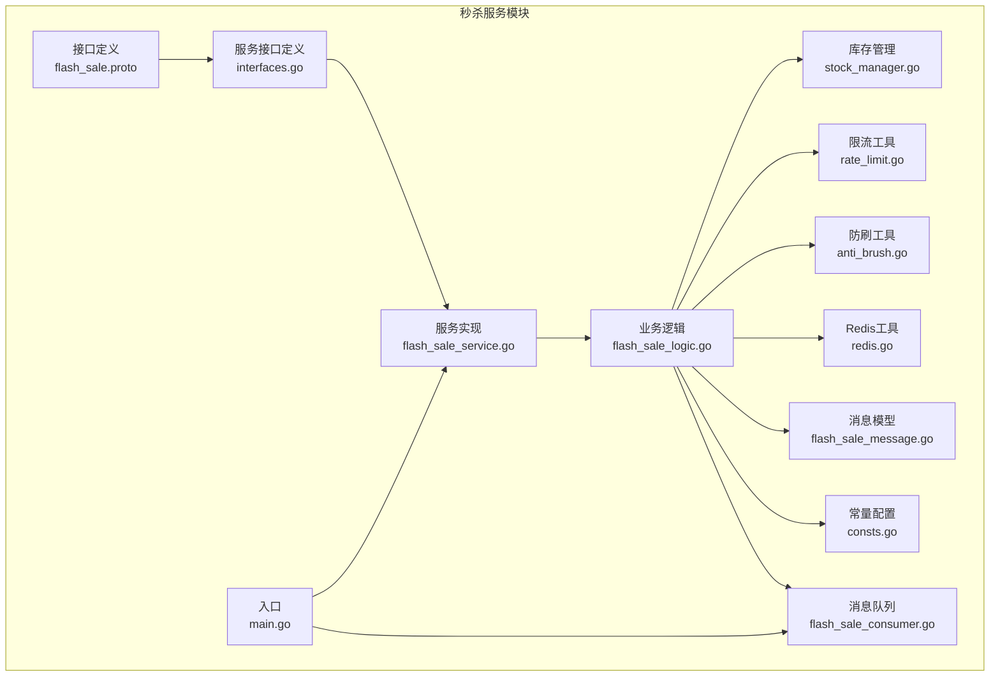
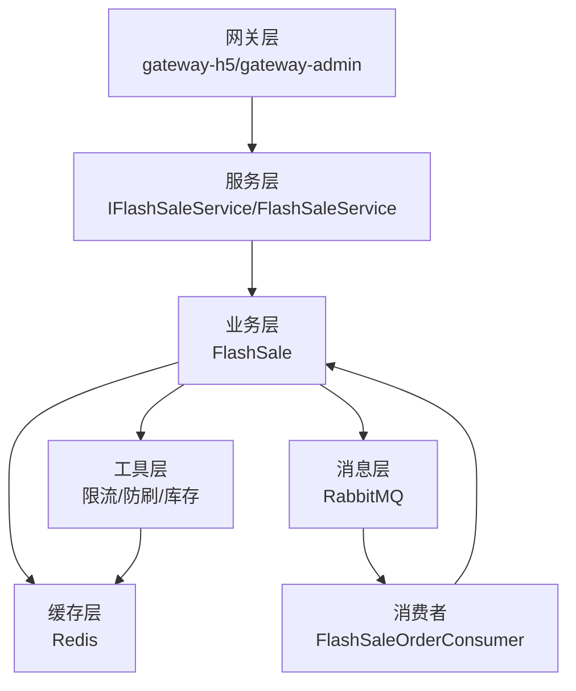
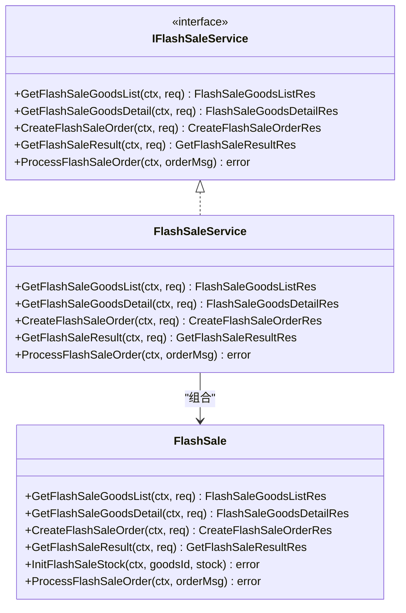
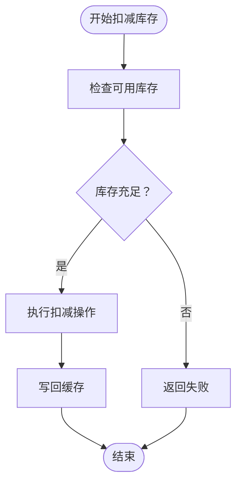
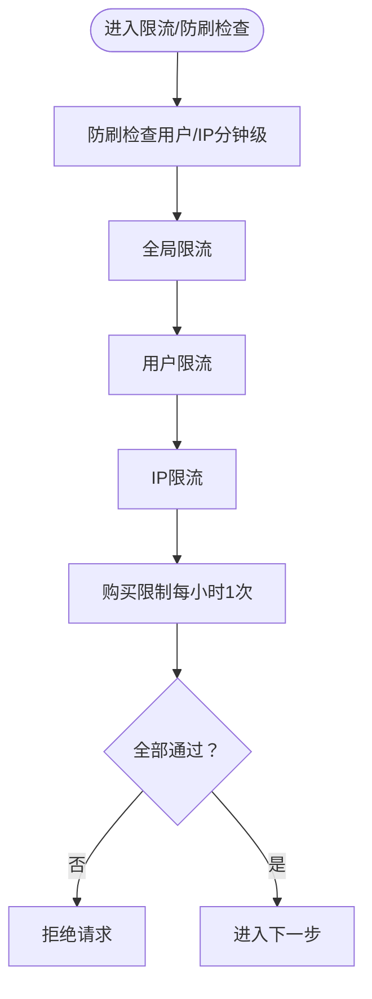
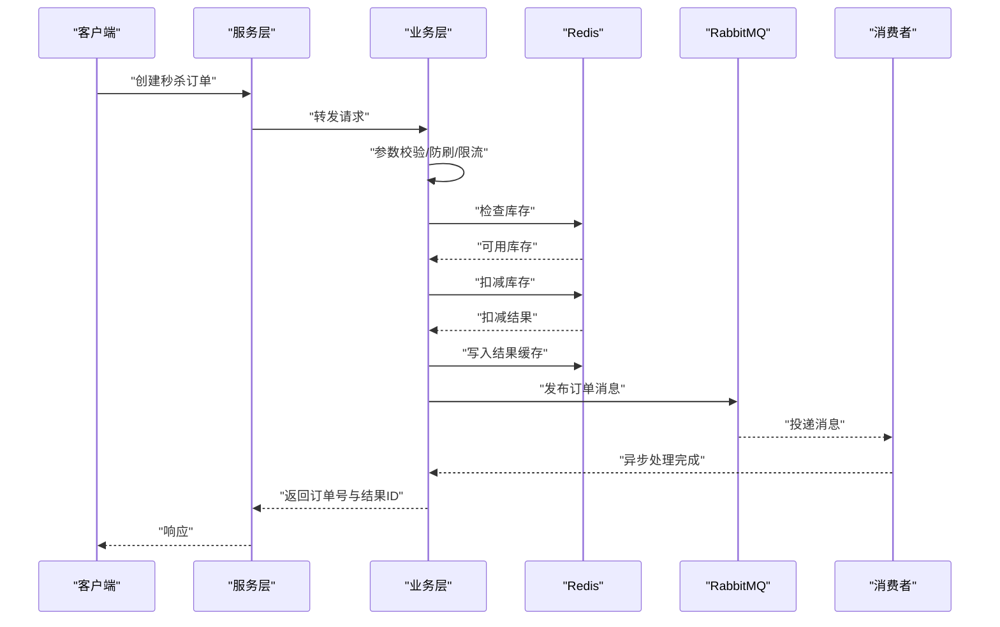
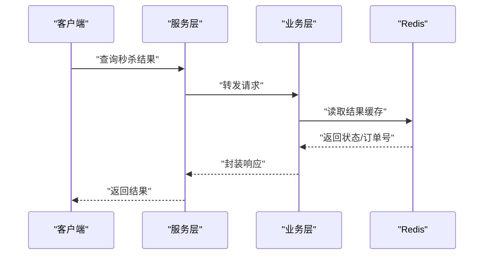
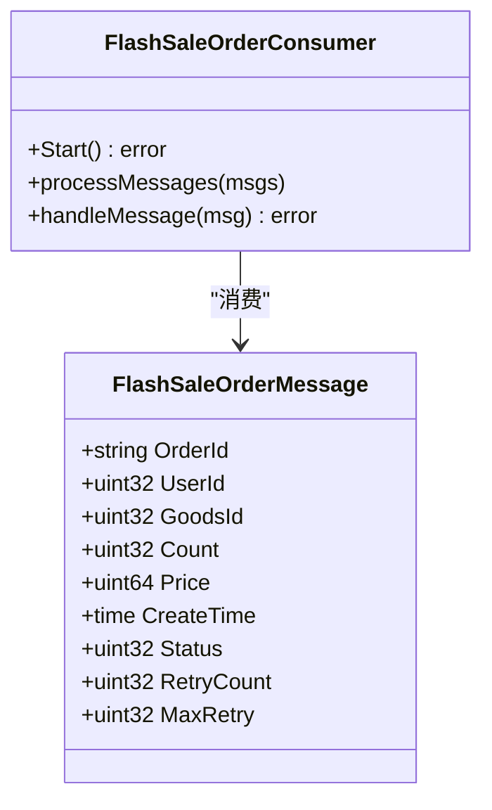
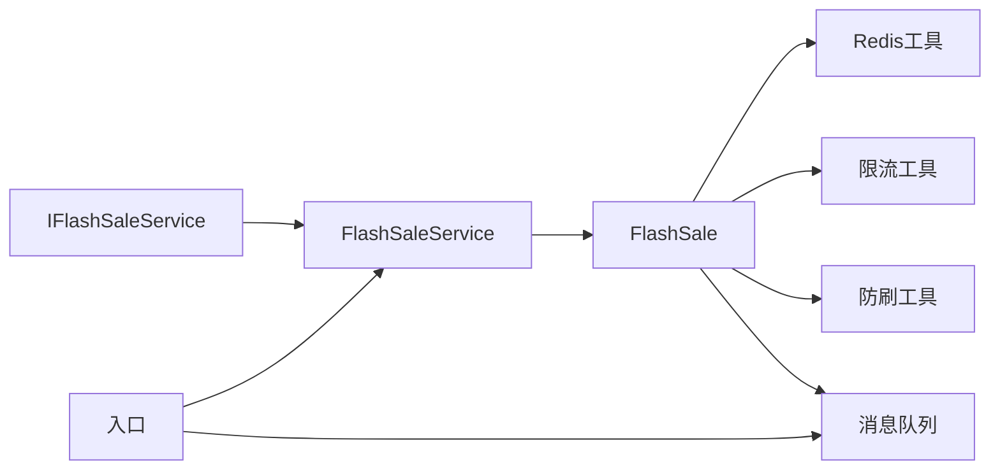

# 秒杀服务API

<cite>
**本文引用的文件**
- [app/flash-sale/api/flash_sale/v1/flash_sale.proto](file://app/flash-sale/api/flash_sale/v1/flash_sale.proto)
- [app/flash-sale/internal/service/interfaces.go](file://app/flash-sale/internal/service/interfaces.go)
- [app/flash-sale/internal/service/flash_sale_service.go](file://app/flash-sale/internal/service/flash_sale_service.go)
- [app/flash-sale/internal/logic/flash_sale_logic.go](file://app/flash-sale/internal/logic/flash_sale_logic.go)
- [app/flash-sale/utility/redis.go](file://app/flash-sale/utility/redis.go)
- [app/flash-sale/utility/stock_manager.go](file://app/flash-sale/utility/stock_manager.go)
- [app/flash-sale/utility/rate_limit.go](file://app/flash-sale/utility/rate_limit.go)
- [app/flash-sale/utility/anti_brush.go](file://app/flash-sale/utility/anti_brush.go)
- [app/flash-sale/internal/model/flash_sale_message.go](file://app/flash-sale/internal/model/flash_sale_message.go)
- [app/flash-sale/internal/consts/consts.go](file://app/flash-sale/internal/consts/consts.go)
- [app/flash-sale/internal/mq/flash_sale_consumer.go](file://app/flash-sale/internal/mq/flash_sale_consumer.go)
- [app/flash-sale/main.go](file://app/flash-sale/main.go)
</cite>

## 目录
1. [简介](#简介)
2. [项目结构](#项目结构)
3. [核心组件](#核心组件)
4. [架构总览](#架构总览)
5. [详细组件分析](#详细组件分析)
6. [依赖关系分析](#依赖关系分析)
7. [性能考量](#性能考量)
8. [故障排查指南](#故障排查指南)
9. [结论](#结论)
10. [附录](#附录)

## 简介
本文件为“秒杀服务API”的权威技术文档，覆盖秒杀活动管理、库存扣减、订单创建与结果查询的完整接口定义与实现要点。文档同时阐述高并发下的库存防超卖、限流防刷、分布式锁、消息队列异步处理等关键技术，并给出性能优化、异常处理与数据一致性保障的实现细节与最佳实践。

## 项目结构
秒杀服务位于应用目录 app/flash-sale 下，采用 GoFrame 框架与 gRPC 协议定义接口，结合 Redis 缓存、RabbitMQ 消息队列与限流/防刷策略，形成完整的高并发秒杀能力。

**图表来源**
- [app/flash-sale/api/flash_sale/v1/flash_sale.proto](file://app/flash-sale/api/flash_sale/v1/flash_sale.proto#L82-L94)
- [app/flash-sale/internal/service/interfaces.go](file://app/flash-sale/internal/service/interfaces.go#L9-L25)
- [app/flash-sale/internal/service/flash_sale_service.go](file://app/flash-sale/internal/service/flash_sale_service.go#L14-L99)
- [app/flash-sale/internal/logic/flash_sale_logic.go](file://app/flash-sale/internal/logic/flash_sale_logic.go#L20-L399)
- [app/flash-sale/utility/redis.go](file://app/flash-sale/utility/redis.go#L16-L55)
- [app/flash-sale/utility/stock_manager.go](file://app/flash-sale/utility/stock_manager.go#L12-L89)
- [app/flash-sale/utility/rate_limit.go](file://app/flash-sale/utility/rate_limit.go#L13-L160)
- [app/flash-sale/utility/anti_brush.go](file://app/flash-sale/utility/anti_brush.go#L12-L80)
- [app/flash-sale/internal/model/flash_sale_message.go](file://app/flash-sale/internal/model/flash_sale_message.go#L5-L16)
- [app/flash-sale/internal/consts/consts.go](file://app/flash-sale/internal/consts/consts.go#L3-L42)
- [app/flash-sale/internal/mq/flash_sale_consumer.go](file://app/flash-sale/internal/mq/flash_sale_consumer.go#L16-L133)
- [app/flash-sale/main.go](file://app/flash-sale/main.go#L18-L37)

**章节来源**
- [app/flash-sale/api/flash_sale/v1/flash_sale.proto](file://app/flash-sale/api/flash_sale/v1/flash_sale.proto#L1-L94)
- [app/flash-sale/internal/service/interfaces.go](file://app/flash-sale/internal/service/interfaces.go#L1-L26)
- [app/flash-sale/internal/service/flash_sale_service.go](file://app/flash-sale/internal/service/flash_sale_service.go#L1-L100)
- [app/flash-sale/internal/logic/flash_sale_logic.go](file://app/flash-sale/internal/logic/flash_sale_logic.go#L1-L400)
- [app/flash-sale/utility/redis.go](file://app/flash-sale/utility/redis.go#L1-L56)
- [app/flash-sale/utility/stock_manager.go](file://app/flash-sale/utility/stock_manager.go#L1-L90)
- [app/flash-sale/utility/rate_limit.go](file://app/flash-sale/utility/rate_limit.go#L1-L161)
- [app/flash-sale/utility/anti_brush.go](file://app/flash-sale/utility/anti_brush.go#L1-L81)
- [app/flash-sale/internal/model/flash_sale_message.go](file://app/flash-sale/internal/model/flash_sale_message.go#L1-L16)
- [app/flash-sale/internal/consts/consts.go](file://app/flash-sale/internal/consts/consts.go#L1-L43)
- [app/flash-sale/internal/mq/flash_sale_consumer.go](file://app/flash-sale/internal/mq/flash_sale_consumer.go#L1-L134)
- [app/flash-sale/main.go](file://app/flash-sale/main.go#L1-L38)

## 核心组件
- 接口定义：基于 Protocol Buffers 定义秒杀商品列表、详情、创建订单、查询结果等 RPC 接口。
- 服务接口与实现：定义统一接口 IFlashSaleService，并由 FlashSaleService 提供实现。
- 业务逻辑：在 FlashSale 中实现参数校验、限流防刷、库存检查与扣减、结果缓存、消息发布等。
- 工具组件：Redis 缓存初始化与访问、库存管理器、限流器、防刷检查器。
- 消息队列：RabbitMQ 生产与消费，异步处理订单。
- 常量与模型：统一的缓存键、限流阈值、消息体结构等。

**章节来源**
- [app/flash-sale/api/flash_sale/v1/flash_sale.proto](file://app/flash-sale/api/flash_sale/v1/flash_sale.proto#L82-L94)
- [app/flash-sale/internal/service/interfaces.go](file://app/flash-sale/internal/service/interfaces.go#L9-L25)
- [app/flash-sale/internal/service/flash_sale_service.go](file://app/flash-sale/internal/service/flash_sale_service.go#L14-L99)
- [app/flash-sale/internal/logic/flash_sale_logic.go](file://app/flash-sale/internal/logic/flash_sale_logic.go#L20-L399)
- [app/flash-sale/utility/redis.go](file://app/flash-sale/utility/redis.go#L16-L55)
- [app/flash-sale/utility/stock_manager.go](file://app/flash-sale/utility/stock_manager.go#L12-L89)
- [app/flash-sale/utility/rate_limit.go](file://app/flash-sale/utility/rate_limit.go#L13-L160)
- [app/flash-sale/utility/anti_brush.go](file://app/flash-sale/utility/anti_brush.go#L12-L80)
- [app/flash-sale/internal/model/flash_sale_message.go](file://app/flash-sale/internal/model/flash_sale_message.go#L5-L16)
- [app/flash-sale/internal/consts/consts.go](file://app/flash-sale/internal/consts/consts.go#L3-L42)
- [app/flash-sale/internal/mq/flash_sale_consumer.go](file://app/flash-sale/internal/mq/flash_sale_consumer.go#L16-L133)
- [app/flash-sale/main.go](file://app/flash-sale/main.go#L18-L37)

## 架构总览
秒杀服务采用“接口层-服务层-业务层-工具层-消息队列”的分层架构，结合 Redis 缓存与限流/防刷策略，确保高并发场景下的稳定性与一致性。

**图表来源**
- [app/flash-sale/internal/service/interfaces.go](file://app/flash-sale/internal/service/interfaces.go#L9-L25)
- [app/flash-sale/internal/service/flash_sale_service.go](file://app/flash-sale/internal/service/flash_sale_service.go#L14-L99)
- [app/flash-sale/internal/logic/flash_sale_logic.go](file://app/flash-sale/internal/logic/flash_sale_logic.go#L20-L399)
- [app/flash-sale/utility/redis.go](file://app/flash-sale/utility/redis.go#L16-L55)
- [app/flash-sale/internal/mq/flash_sale_consumer.go](file://app/flash-sale/internal/mq/flash_sale_consumer.go#L16-L133)

## 详细组件分析

### 接口定义与数据模型
- 秒杀商品信息：包含商品ID、活动ID、标题、描述、原价、秒杀价、总库存、可用库存、起止时间、状态、图片URL等字段。
- 列表请求/响应：支持按活动ID分页查询，返回总数与商品列表。
- 详情请求/响应：返回商品信息、距离开始/结束的剩余秒数、是否可购买。
- 创建订单请求/响应：包含用户ID、商品ID、活动ID、购买数量；响应包含是否成功、订单号、提示信息、结果查询ID与状态。
- 查询结果请求/响应：根据结果查询ID与用户ID查询最终状态、订单号、商品ID、应付金额等。
- 服务接口：定义获取列表、详情、创建订单、查询结果与异步处理订单的方法。

**图表来源**
- [app/flash-sale/internal/service/interfaces.go](file://app/flash-sale/internal/service/interfaces.go#L9-L25)
- [app/flash-sale/internal/service/flash_sale_service.go](file://app/flash-sale/internal/service/flash_sale_service.go#L14-L99)
- [app/flash-sale/internal/logic/flash_sale_logic.go](file://app/flash-sale/internal/logic/flash_sale_logic.go#L20-L399)

**章节来源**
- [app/flash-sale/api/flash_sale/v1/flash_sale.proto](file://app/flash-sale/api/flash_sale/v1/flash_sale.proto#L7-L94)
- [app/flash-sale/internal/service/interfaces.go](file://app/flash-sale/internal/service/interfaces.go#L9-L25)
- [app/flash-sale/internal/service/flash_sale_service.go](file://app/flash-sale/internal/service/flash_sale_service.go#L14-L99)
- [app/flash-sale/internal/logic/flash_sale_logic.go](file://app/flash-sale/internal/logic/flash_sale_logic.go#L28-L297)

### 库存管理与扣减
- 库存键命名：使用统一的 Redis 键前缀，便于集中管理与清理。
- 检查库存：读取可用库存并与购买数量比较，避免超卖。
- 扣减库存：在业务层完成库存扣减，成功后进入异步处理流程。
- 初始化库存：支持将目标库存写入缓存，作为预热或重置手段。

**图表来源**
- [app/flash-sale/utility/stock_manager.go](file://app/flash-sale/utility/stock_manager.go#L33-L73)
- [app/flash-sale/internal/logic/flash_sale_logic.go](file://app/flash-sale/internal/logic/flash_sale_logic.go#L193-L204)

**章节来源**
- [app/flash-sale/utility/stock_manager.go](file://app/flash-sale/utility/stock_manager.go#L12-L89)
- [app/flash-sale/internal/logic/flash_sale_logic.go](file://app/flash-sale/internal/logic/flash_sale_logic.go#L299-L321)

### 限流与防刷
- 全局限流：每秒请求上限，防止系统过载。
- 用户限流：每秒请求上限，保护特定用户。
- IP限流：每秒请求上限，抵御恶意刷单。
- 购买限制：每小时仅允许购买一次，避免同一用户重复抢购。
- 行为防刷：统计用户与IP在分钟维度的请求频次，超过阈值触发异常。
- IP提取：优先从 X-Forwarded-For 或 X-Real-IP 获取真实IP。

**图表来源**
- [app/flash-sale/utility/rate_limit.go](file://app/flash-sale/utility/rate_limit.go#L25-L160)
- [app/flash-sale/utility/anti_brush.go](file://app/flash-sale/utility/anti_brush.go#L24-L80)

**章节来源**
- [app/flash-sale/utility/rate_limit.go](file://app/flash-sale/utility/rate_limit.go#L13-L161)
- [app/flash-sale/utility/anti_brush.go](file://app/flash-sale/utility/anti_brush.go#L12-L81)

### 订单创建与异步处理
- 参数校验：校验商品ID、用户ID、购买数量等。
- 防刷与限流：依次执行防刷检查与各类限流策略。
- 库存扣减：成功后记录结果并生成订单号。
- 结果缓存：将结果写入缓存，提供查询接口。
- 消息发布：将订单消息发布到 RabbitMQ，消费者异步处理。
- 降级处理：若 RabbitMQ 未初始化，本地处理订单以保证服务可用。

**图表来源**
- [app/flash-sale/internal/logic/flash_sale_logic.go](file://app/flash-sale/internal/logic/flash_sale_logic.go#L102-L254)
- [app/flash-sale/internal/mq/flash_sale_consumer.go](file://app/flash-sale/internal/mq/flash_sale_consumer.go#L97-L133)
- [app/flash-sale/utility/redis.go](file://app/flash-sale/utility/redis.go#L16-L55)

**章节来源**
- [app/flash-sale/internal/logic/flash_sale_logic.go](file://app/flash-sale/internal/logic/flash_sale_logic.go#L102-L297)
- [app/flash-sale/internal/mq/flash_sale_consumer.go](file://app/flash-sale/internal/mq/flash_sale_consumer.go#L97-L133)
- [app/flash-sale/main.go](file://app/flash-sale/main.go#L18-L37)

### 查询结果与状态管理
- 查询接口：根据结果查询ID与用户ID查询最终状态。
- 缓存键：使用统一的结果缓存键，支持短期保留以便客户端轮询。
- 状态码：处理中、成功、失败三种状态，配合消息队列异步推进。

**图表来源**
- [app/flash-sale/internal/logic/flash_sale_logic.go](file://app/flash-sale/internal/logic/flash_sale_logic.go#L256-L297)
- [app/flash-sale/internal/consts/consts.go](file://app/flash-sale/internal/consts/consts.go#L5-L7)

**章节来源**
- [app/flash-sale/internal/logic/flash_sale_logic.go](file://app/flash-sale/internal/logic/flash_sale_logic.go#L256-L297)
- [app/flash-sale/internal/consts/consts.go](file://app/flash-sale/internal/consts/consts.go#L23-L26)

### 消息队列与消费者
- 队列与交换机：定义交换机、队列与路由键，确保消息有序可靠投递。
- 消费者：启动消费者监听队列，逐条处理消息并确认。
- 重试与失败处理：处理失败时重新入队，避免消息丢失。
- 降级：若 RabbitMQ 未初始化，本地处理订单，保证服务可用。

**图表来源**
- [app/flash-sale/internal/model/flash_sale_message.go](file://app/flash-sale/internal/model/flash_sale_message.go#L5-L16)
- [app/flash-sale/internal/mq/flash_sale_consumer.go](file://app/flash-sale/internal/mq/flash_sale_consumer.go#L16-L95)

**章节来源**
- [app/flash-sale/internal/model/flash_sale_message.go](file://app/flash-sale/internal/model/flash_sale_message.go#L1-L16)
- [app/flash-sale/internal/mq/flash_sale_consumer.go](file://app/flash-sale/internal/mq/flash_sale_consumer.go#L16-L133)
- [app/flash-sale/internal/consts/consts.go](file://app/flash-sale/internal/consts/consts.go#L18-L21)

## 依赖关系分析
- 接口耦合：服务层通过 IFlashSaleService 抽象与业务层解耦，便于替换实现与单元测试。
- 工具依赖：业务层依赖 Redis 缓存、限流器、防刷器与消息队列，统一通过工具模块提供。
- 常量集中：缓存键、限流阈值、状态码等集中于常量模块，降低散弹式魔法数。
- 入口控制：入口文件负责 RabbitMQ 初始化与消费者启动，失败时降级运行。

**图表来源**
- [app/flash-sale/internal/service/interfaces.go](file://app/flash-sale/internal/service/interfaces.go#L9-L25)
- [app/flash-sale/internal/service/flash_sale_service.go](file://app/flash-sale/internal/service/flash_sale_service.go#L14-L99)
- [app/flash-sale/internal/logic/flash_sale_logic.go](file://app/flash-sale/internal/logic/flash_sale_logic.go#L20-L399)
- [app/flash-sale/utility/redis.go](file://app/flash-sale/utility/redis.go#L16-L55)
- [app/flash-sale/utility/rate_limit.go](file://app/flash-sale/utility/rate_limit.go#L13-L161)
- [app/flash-sale/utility/anti_brush.go](file://app/flash-sale/utility/anti_brush.go#L12-L81)
- [app/flash-sale/internal/mq/flash_sale_consumer.go](file://app/flash-sale/internal/mq/flash_sale_consumer.go#L16-L133)
- [app/flash-sale/main.go](file://app/flash-sale/main.go#L18-L37)

**章节来源**
- [app/flash-sale/internal/service/interfaces.go](file://app/flash-sale/internal/service/interfaces.go#L9-L25)
- [app/flash-sale/internal/service/flash_sale_service.go](file://app/flash-sale/internal/service/flash_sale_service.go#L14-L99)
- [app/flash-sale/internal/logic/flash_sale_logic.go](file://app/flash-sale/internal/logic/flash_sale_logic.go#L20-L399)
- [app/flash-sale/utility/redis.go](file://app/flash-sale/utility/redis.go#L16-L55)
- [app/flash-sale/utility/rate_limit.go](file://app/flash-sale/utility/rate_limit.go#L13-L161)
- [app/flash-sale/utility/anti_brush.go](file://app/flash-sale/utility/anti_brush.go#L12-L81)
- [app/flash-sale/internal/mq/flash_sale_consumer.go](file://app/flash-sale/internal/mq/flash_sale_consumer.go#L16-L133)
- [app/flash-sale/main.go](file://app/flash-sale/main.go#L18-L37)

## 性能考量
- 缓存优先：库存与结果均使用 Redis 缓存，减少数据库压力，提升查询性能。
- 限流与防刷：多维限流与行为检测，有效抑制突发流量与恶意请求。
- 异步处理：订单创建立即返回，后续异步处理，缩短请求延迟。
- 降级策略：RabbitMQ 不可用时本地处理，保证核心链路可用。
- 并发安全：库存扣减在业务层完成，结合缓存原子性与幂等设计，避免超卖。

[本节为通用性能指导，不直接分析具体文件]

## 故障排查指南
- Redis 初始化失败：检查配置项与网络连通性，确认 PING 返回正常。
- 限流触发：查看对应限流键与过期时间，确认阈值是否合理。
- 库存不足：核对缓存中的可用库存与购买数量，必要时重新初始化库存。
- 消息队列异常：确认 RabbitMQ 服务状态，检查消费者是否启动，消息是否被正确确认。
- 防刷拦截：检查用户与IP的分钟级计数，确认是否存在异常行为。

**章节来源**
- [app/flash-sale/utility/redis.go](file://app/flash-sale/utility/redis.go#L16-L55)
- [app/flash-sale/utility/rate_limit.go](file://app/flash-sale/utility/rate_limit.go#L25-L160)
- [app/flash-sale/utility/anti_brush.go](file://app/flash-sale/utility/anti_brush.go#L24-L80)
- [app/flash-sale/internal/mq/flash_sale_consumer.go](file://app/flash-sale/internal/mq/flash_sale_consumer.go#L28-L95)
- [app/flash-sale/main.go](file://app/flash-sale/main.go#L18-L37)

## 结论
本秒杀服务通过清晰的分层架构、完善的限流防刷、可靠的 Redis 缓存与消息队列异步处理，实现了高并发场景下的稳定与高性能。接口定义明确、扩展性强，具备良好的工程落地能力。建议在生产环境中持续优化限流阈值、监控指标与告警策略，确保系统在峰值流量下的可靠性与一致性。

[本节为总结性内容，不直接分析具体文件]

## 附录

### API 定义概览
- 获取秒杀商品列表：输入活动ID、页码、每页数量；输出总数与商品列表。
- 获取秒杀商品详情：输入商品ID与活动ID；输出商品信息、剩余秒数、是否可购买。
- 创建秒杀订单：输入用户ID、商品ID、活动ID、购买数量；输出是否成功、订单号、提示信息、结果查询ID与状态。
- 查询秒杀结果：输入结果查询ID与用户ID；输出状态、提示信息、订单号、商品ID、应付金额。

**章节来源**
- [app/flash-sale/api/flash_sale/v1/flash_sale.proto](file://app/flash-sale/api/flash_sale/v1/flash_sale.proto#L23-L94)

### 关键常量与键空间
- 缓存键：商品、库存、结果缓存键前缀。
- 限流键：用户限流、IP限流键前缀。
- 消息队列：交换机、队列、路由键。
- 状态码：处理中、成功、失败。
- 业务限制：每用户限购数量、每秒限流次数、每分钟限流次数等。

**章节来源**
- [app/flash-sale/internal/consts/consts.go](file://app/flash-sale/internal/consts/consts.go#L3-L42)