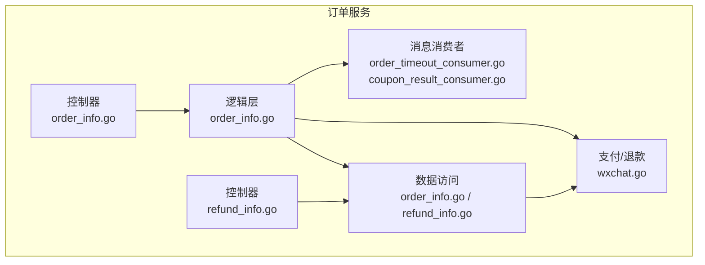
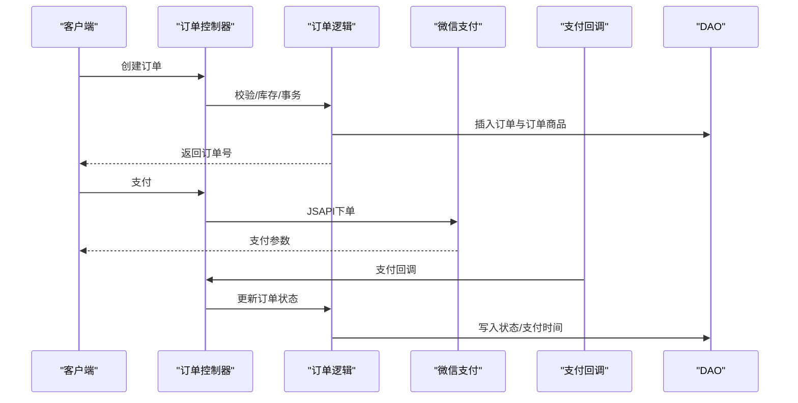
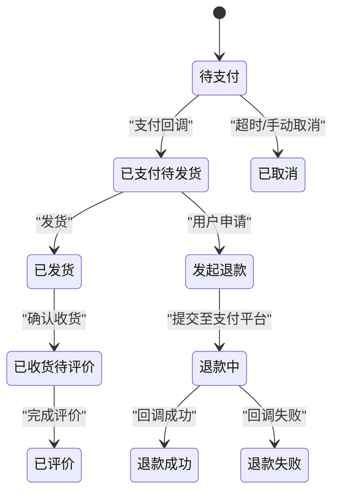
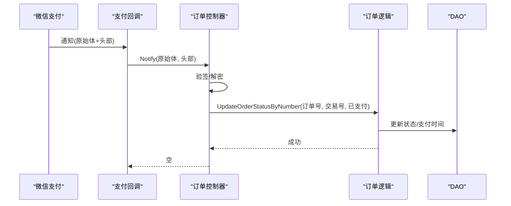
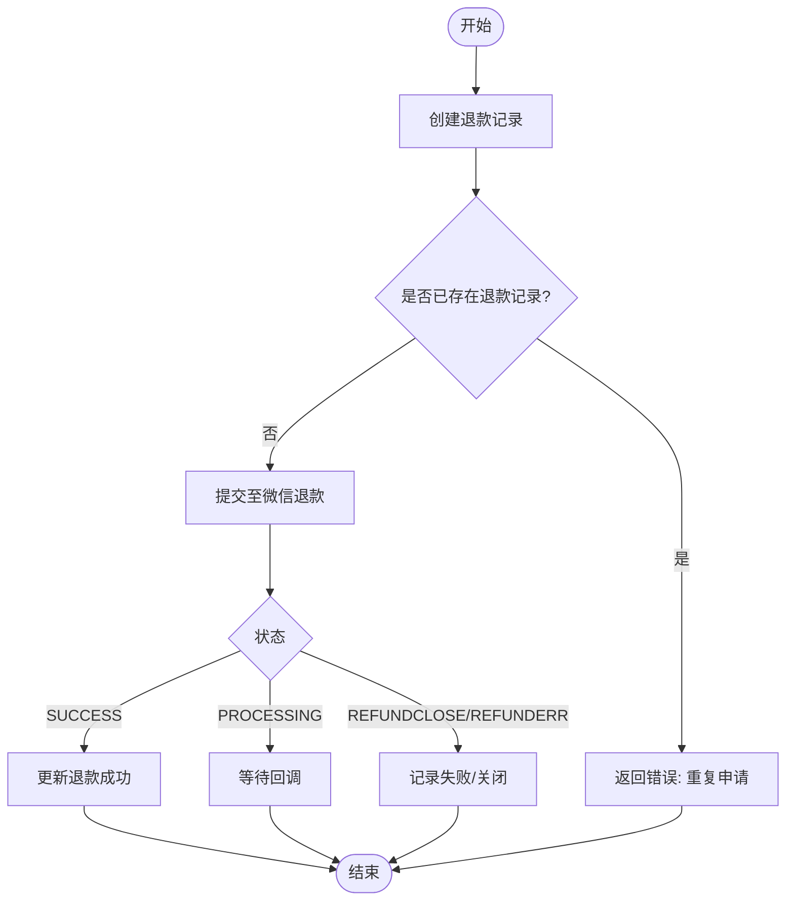
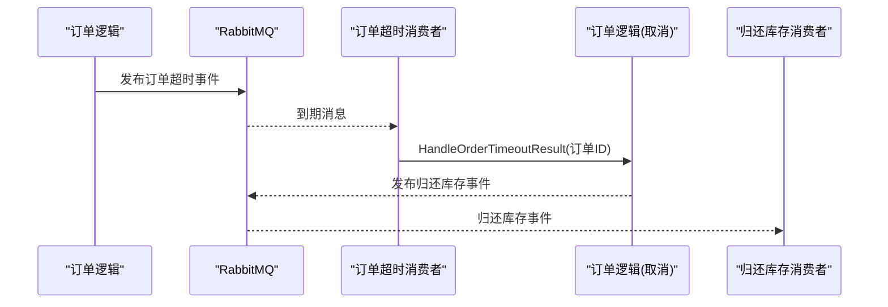
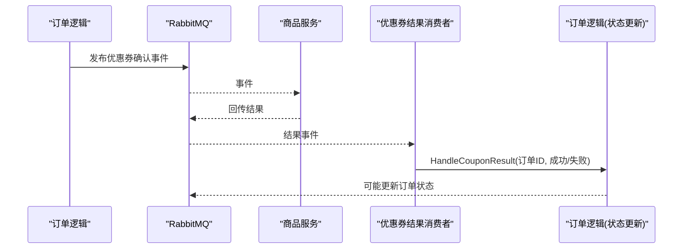
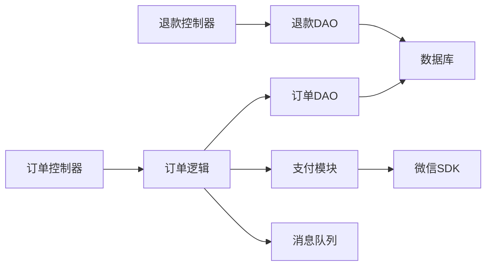

# 订单服务API

<cite>
**本文引用的文件**
- [app/order/internal/consts/order_status.go](file://app/order/internal/consts/order_status.go)
- [app/order/internal/controller/order_info/order_info.go](file://app/order/internal/controller/order_info/order_info.go)
- [app/order/internal/controller/refund_info/refund_info.go](file://app/order/internal/controller/refund_info/refund_info.go)
- [app/order/internal/logic/order_info/order_info.go](file://app/order/internal/logic/order_info/order_info.go)
- [app/order/internal/dao/order_info.go](file://app/order/internal/dao/order_info.go)
- [app/order/internal/dao/refund_info.go](file://app/order/internal/dao/refund_info.go)
- [app/order/utility/payment/wxchat.go](file://app/order/utility/payment/wxchat.go)
- [app/order/utility/consumer/order_timeout_consumer.go](file://app/order/utility/consumer/order_timeout_consumer.go)
- [app/order/utility/consumer/coupon_result_consumer.go](file://app/order/utility/consumer/coupon_result_consumer.go)
- [app/order/internal/config/refund_config.go](file://app/order/internal/config/refund_config.go)
</cite>

## 目录
1. [简介](#简介)
2. [项目结构](#项目结构)
3. [核心组件](#核心组件)
4. [架构总览](#架构总览)
5. [详细组件分析](#详细组件分析)
6. [依赖分析](#依赖分析)
7. [性能考虑](#性能考虑)
8. [故障排查指南](#故障排查指南)
9. [结论](#结论)
10. [附录](#附录)

## 简介
本文件为订单服务的gRPC接口与业务流程文档，覆盖订单管理与退款管理的完整API定义与实现要点，包括：
- 订单生命周期：创建、支付、取消、发货、确认收货、完成、售后与退款
- 支付回调处理与幂等校验
- 退款流程与风控策略
- 订单状态机与状态流转
- 查询统计与异常处理
- 与商品服务、支付服务、消息队列的集成

## 项目结构
订单服务位于 app/order 目录，采用分层架构：
- controller 层：暴露 gRPC 接口，负责请求转发与错误包装
- logic 层：业务逻辑编排，事务控制、状态更新、事件发布
- dao 层：数据访问对象封装
- utility/payment：微信支付与退款能力
- utility/consumer：基于 RabbitMQ 的异步消费者（订单超时、优惠券结果）

图表来源
- [app/order/internal/controller/order_info/order_info.go](file://app/order/internal/controller/order_info/order_info.go#L20-L26)
- [app/order/internal/controller/refund_info/refund_info.go](file://app/order/internal/controller/refund_info/refund_info.go#L18-L24)
- [app/order/internal/logic/order_info/order_info.go](file://app/order/internal/logic/order_info/order_info.go#L27-L212)
- [app/order/internal/dao/order_info.go](file://app/order/internal/dao/order_info.go#L11-L23)
- [app/order/internal/dao/refund_info.go](file://app/order/internal/dao/refund_info.go#L12-L30)
- [app/order/utility/payment/wxchat.go](file://app/order/utility/payment/wxchat.go#L84-L132)
- [app/order/utility/consumer/order_timeout_consumer.go](file://app/order/utility/consumer/order_timeout_consumer.go#L39-L86)
- [app/order/utility/consumer/coupon_result_consumer.go](file://app/order/utility/consumer/coupon_result_consumer.go#L34-L54)

章节来源
- [app/order/internal/controller/order_info/order_info.go](file://app/order/internal/controller/order_info/order_info.go#L1-L188)
- [app/order/internal/controller/refund_info/refund_info.go](file://app/order/internal/controller/refund_info/refund_info.go#L1-L156)
- [app/order/internal/logic/order_info/order_info.go](file://app/order/internal/logic/order_info/order_info.go#L1-L502)
- [app/order/internal/dao/order_info.go](file://app/order/internal/dao/order_info.go#L1-L23)
- [app/order/internal/dao/refund_info.go](file://app/order/internal/dao/refund_info.go#L1-L30)
- [app/order/utility/payment/wxchat.go](file://app/order/utility/payment/wxchat.go#L1-L328)
- [app/order/utility/consumer/order_timeout_consumer.go](file://app/order/utility/consumer/order_timeout_consumer.go#L1-L87)
- [app/order/utility/consumer/coupon_result_consumer.go](file://app/order/utility/consumer/coupon_result_consumer.go#L1-L54)

## 核心组件
- 订单控制器：提供创建、详情、列表、支付、回调、统计、取消等接口
- 退款控制器：提供退款列表、详情、创建、退款回调接口
- 逻辑层：订单创建事务、状态更新、超时取消、优惠券结果处理
- DAO 层：订单与退款数据访问
- 支付模块：微信JSAPI下单、回调验签、退款、退款回调
- 消费者：订单超时取消、优惠券结果回传

章节来源
- [app/order/internal/controller/order_info/order_info.go](file://app/order/internal/controller/order_info/order_info.go#L20-L188)
- [app/order/internal/controller/refund_info/refund_info.go](file://app/order/internal/controller/refund_info/refund_info.go#L18-L156)
- [app/order/internal/logic/order_info/order_info.go](file://app/order/internal/logic/order_info/order_info.go#L27-L502)
- [app/order/internal/dao/order_info.go](file://app/order/internal/dao/order_info.go#L11-L23)
- [app/order/internal/dao/refund_info.go](file://app/order/internal/dao/refund_info.go#L12-L30)
- [app/order/utility/payment/wxchat.go](file://app/order/utility/payment/wxchat.go#L84-L171)
- [app/order/utility/consumer/order_timeout_consumer.go](file://app/order/utility/consumer/order_timeout_consumer.go#L39-L86)
- [app/order/utility/consumer/coupon_result_consumer.go](file://app/order/utility/consumer/coupon_result_consumer.go#L34-L54)

## 架构总览
订单服务通过 gRPC 对外提供接口，内部通过逻辑层协调 DAO 与支付模块，并借助消息队列实现异步事件处理。

图表来源
- [app/order/internal/controller/order_info/order_info.go](file://app/order/internal/controller/order_info/order_info.go#L28-L118)
- [app/order/internal/logic/order_info/order_info.go](file://app/order/internal/logic/order_info/order_info.go#L27-L212)
- [app/order/utility/payment/wxchat.go](file://app/order/utility/payment/wxchat.go#L84-L132)

## 详细组件分析

### 订单管理API
- 创建订单
  - 输入：用户ID、商品明细、优惠券、价格等
  - 输出：订单ID、订单号
  - 关键点：事务、库存校验、优惠券分摊、事件发布
- 订单详情
  - 输入：订单ID、用户ID
  - 输出：订单信息、订单商品列表
  - 关键点：权限校验、时间字段转换
- 订单列表
  - 输入：用户ID、状态、分页
  - 输出：订单列表、总数
- 支付
  - 输入：订单号、金额、用户标识
  - 输出：支付参数（时间戳、随机串、签名等）
- 支付回调
  - 输入：回调原始体、头部
  - 输出：空
  - 关键点：验签、幂等、状态更新
- 订单统计
  - 输入：用户ID
  - 输出：各状态订单数量
- 取消订单
  - 输入：订单ID、用户ID
  - 输出：操作结果
  - 关键点：状态限制、权限校验、写入状态

章节来源
- [app/order/internal/controller/order_info/order_info.go](file://app/order/internal/controller/order_info/order_info.go#L28-L188)
- [app/order/internal/logic/order_info/order_info.go](file://app/order/internal/logic/order_info/order_info.go#L226-L449)
- [app/order/utility/payment/wxchat.go](file://app/order/utility/payment/wxchat.go#L134-L171)

### 退款管理API
- 退款列表
  - 输入：分页
  - 输出：退款记录列表、总数
- 退款详情
  - 输入：退款ID
  - 输出：退款记录
- 退款创建
  - 输入：订单ID、退款金额、原因等
  - 输出：退款ID
  - 关键点：重复申请校验、状态初始化
- 退款回调
  - 输入：回调原始体、头部
  - 输出：空
  - 关键点：验签、状态更新

章节来源
- [app/order/internal/controller/refund_info/refund_info.go](file://app/order/internal/controller/refund_info/refund_info.go#L26-L156)
- [app/order/internal/dao/refund_info.go](file://app/order/internal/dao/refund_info.go#L12-L30)
- [app/order/internal/config/refund_config.go](file://app/order/internal/config/refund_config.go#L1-L105)

### 订单状态机与状态流转
- 订单状态枚举：待支付、已支付待发货、已发货、已收货待评价、已评价、待确认（使用优惠券）、已取消、发起退款
- 退款状态：待处理、同意退款、拒绝退款
- 退款订单状态：未退款、退款中、退款成功、退款失败

图表来源
- [app/order/internal/consts/order_status.go](file://app/order/internal/consts/order_status.go#L6-L37)

章节来源
- [app/order/internal/consts/order_status.go](file://app/order/internal/consts/order_status.go#L1-L38)

### 支付回调处理与幂等校验
- 回调验签：使用平台证书与APIv3密钥进行验签与解密
- 幂等处理：根据订单号与目标状态判断是否需要重复更新
- 支付参数生成：JSAPI下单、签名构造

图表来源
- [app/order/internal/controller/order_info/order_info.go](file://app/order/internal/controller/order_info/order_info.go#L105-L118)
- [app/order/internal/logic/order_info/order_info.go](file://app/order/internal/logic/order_info/order_info.go#L360-L387)
- [app/order/utility/payment/wxchat.go](file://app/order/utility/payment/wxchat.go#L134-L171)

章节来源
- [app/order/utility/payment/wxchat.go](file://app/order/utility/payment/wxchat.go#L134-L171)
- [app/order/internal/logic/order_info/order_info.go](file://app/order/internal/logic/order_info/order_info.go#L360-L387)

### 退款流程与风控策略
- 退款创建：生成退款单号、初始化状态；异步处理占位
- 退款回调：验签后更新退款状态
- 配置项：超时时间、查询间隔、最大查询次数；状态有效性与文案映射

图表来源
- [app/order/internal/controller/refund_info/refund_info.go](file://app/order/internal/controller/refund_info/refund_info.go#L102-L134)
- [app/order/utility/payment/wxchat.go](file://app/order/utility/payment/wxchat.go#L184-L246)
- [app/order/internal/config/refund_config.go](file://app/order/internal/config/refund_config.go#L38-L105)

章节来源
- [app/order/internal/controller/refund_info/refund_info.go](file://app/order/internal/controller/refund_info/refund_info.go#L102-L156)
- [app/order/utility/payment/wxchat.go](file://app/order/utility/payment/wxchat.go#L184-L313)
- [app/order/internal/config/refund_config.go](file://app/order/internal/config/refund_config.go#L1-L105)

### 订单超时与库存释放
- 订单创建后发布“订单超时”延迟消息
- 消费者到期检查后取消未支付订单并发布“归还库存”事件

图表来源
- [app/order/internal/logic/order_info/order_info.go](file://app/order/internal/logic/order_info/order_info.go#L199-L201)
- [app/order/utility/consumer/order_timeout_consumer.go](file://app/order/utility/consumer/order_timeout_consumer.go#L39-L86)

章节来源
- [app/order/utility/consumer/order_timeout_consumer.go](file://app/order/utility/consumer/order_timeout_consumer.go#L1-L87)
- [app/order/internal/logic/order_info/order_info.go](file://app/order/internal/logic/order_info/order_info.go#L451-L471)

### 优惠券确认与订单状态联动
- 订单创建后若使用优惠券，发布“优惠券确认”事件
- 商品服务处理后回传结果，订单侧根据结果更新状态

图表来源
- [app/order/internal/logic/order_info/order_info.go](file://app/order/internal/logic/order_info/order_info.go#L194-L197)
- [app/order/utility/consumer/coupon_result_consumer.go](file://app/order/utility/consumer/coupon_result_consumer.go#L34-L54)

章节来源
- [app/order/utility/consumer/coupon_result_consumer.go](file://app/order/utility/consumer/coupon_result_consumer.go#L1-L54)
- [app/order/internal/logic/order_info/order_info.go](file://app/order/internal/logic/order_info/order_info.go#L389-L414)

## 依赖分析
- 控制器依赖逻辑层与支付模块
- 逻辑层依赖DAO、支付模块与消息队列
- DAO 依赖数据库模型
- 支付模块依赖微信SDK与配置

图表来源
- [app/order/internal/controller/order_info/order_info.go](file://app/order/internal/controller/order_info/order_info.go#L3-L18)
- [app/order/internal/controller/refund_info/refund_info.go](file://app/order/internal/controller/refund_info/refund_info.go#L3-L16)
- [app/order/internal/logic/order_info/order_info.go](file://app/order/internal/logic/order_info/order_info.go#L3-L25)
- [app/order/internal/dao/order_info.go](file://app/order/internal/dao/order_info.go#L7-L23)
- [app/order/internal/dao/refund_info.go](file://app/order/internal/dao/refund_info.go#L7-L30)
- [app/order/utility/payment/wxchat.go](file://app/order/utility/payment/wxchat.go#L3-L27)

章节来源
- [app/order/internal/controller/order_info/order_info.go](file://app/order/internal/controller/order_info/order_info.go#L1-L188)
- [app/order/internal/controller/refund_info/refund_info.go](file://app/order/internal/controller/refund_info/refund_info.go#L1-L156)
- [app/order/internal/logic/order_info/order_info.go](file://app/order/internal/logic/order_info/order_info.go#L1-L502)
- [app/order/internal/dao/order_info.go](file://app/order/internal/dao/order_info.go#L1-L23)
- [app/order/internal/dao/refund_info.go](file://app/order/internal/dao/refund_info.go#L1-L30)
- [app/order/utility/payment/wxchat.go](file://app/order/utility/payment/wxchat.go#L1-L328)

## 性能考虑
- 事务与批量插入：订单与订单商品在事务内批量写入，减少往返开销
- 分页查询：订单列表支持分页，避免一次性拉取过多数据
- 异步事件：订单创建、超时取消、库存归还均通过消息队列异步处理，降低请求延迟
- 指标埋点：订单创建成功/失败指标上报，便于容量规划与异常定位

## 故障排查指南
- 支付回调验签失败
  - 检查平台证书与APIv3密钥配置
  - 确认回调头与原始体完整性
- 订单状态未更新
  - 核对回调幂等逻辑（订单号+目标状态）
  - 查看数据库更新日志
- 退款回调未生效
  - 校验退款回调验签
  - 检查退款状态映射与DAO更新
- 订单超时未取消
  - 检查延迟队列配置与消费者消费情况
  - 核对业务超时阈值配置

章节来源
- [app/order/utility/payment/wxchat.go](file://app/order/utility/payment/wxchat.go#L134-L171)
- [app/order/internal/logic/order_info/order_info.go](file://app/order/internal/logic/order_info/order_info.go#L360-L387)
- [app/order/internal/controller/refund_info/refund_info.go](file://app/order/internal/controller/refund_info/refund_info.go#L136-L155)
- [app/order/utility/consumer/order_timeout_consumer.go](file://app/order/utility/consumer/order_timeout_consumer.go#L57-L76)

## 结论
订单服务通过清晰的分层与事件驱动架构，实现了从下单到支付、发货、收货、售后与退款的全链路闭环。支付回调的幂等与退款风控配置保障了交易安全与一致性；异步化处理提升了系统的吞吐与稳定性。

## 附录
- 订单状态与退款状态枚举定义见状态常量文件
- 支付与退款配置项见退款配置文件
- DAO 延迟初始化避免测试环境直接连接数据库

章节来源
- [app/order/internal/consts/order_status.go](file://app/order/internal/consts/order_status.go#L1-L38)
- [app/order/internal/config/refund_config.go](file://app/order/internal/config/refund_config.go#L1-L105)
- [app/order/internal/dao/refund_info.go](file://app/order/internal/dao/refund_info.go#L20-L27)