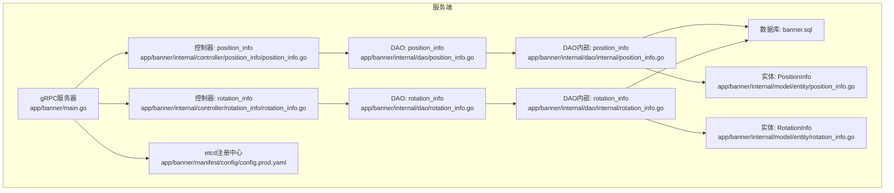
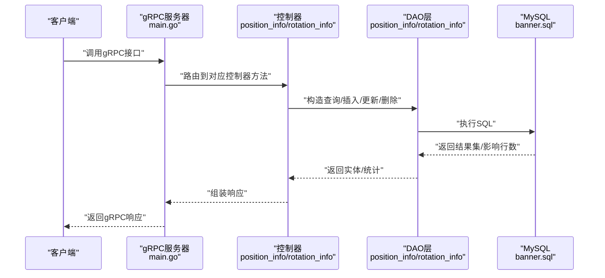
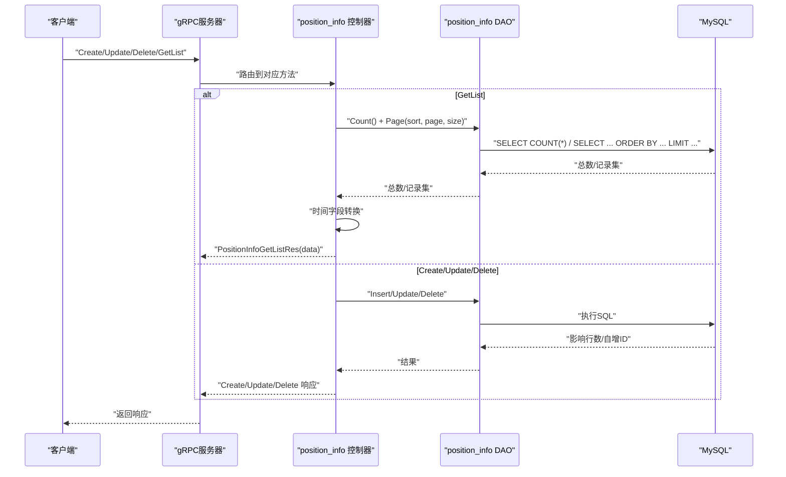
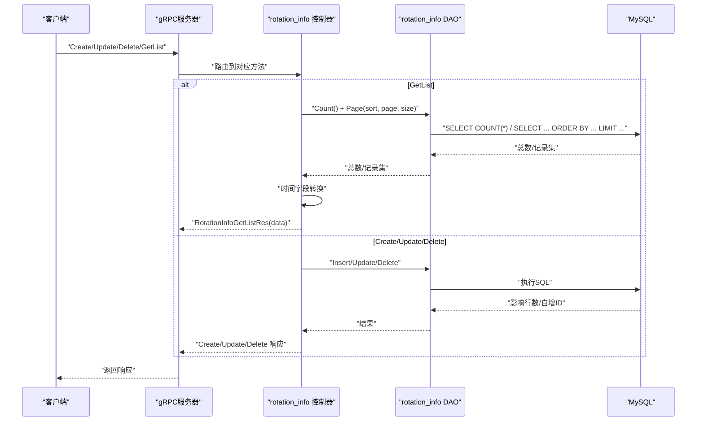
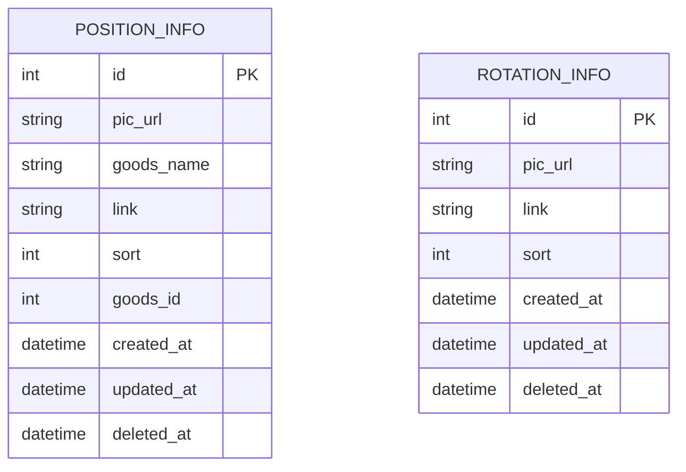
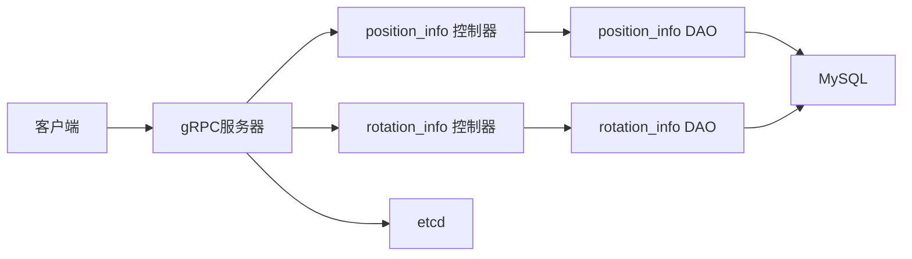

# 轮播图服务API

<cite>
**本文引用的文件**
- [position_info.proto](file://app/banner/manifest/protobuf/position_info/v1/position_info.proto)
- [rotation_info.proto](file://app/banner/manifest/protobuf/rotation_info/v1/rotation_info.proto)
- [position_info.proto(实体)](file://app/banner/manifest/protobuf/pbentity/position_info.proto)
- [rotation_info.proto(实体)](file://app/banner/manifest/protobuf/pbentity/rotation_info.proto)
- [position_info.go(控制器)](file://app/banner/internal/controller/position_info/position_info.go)
- [rotation_info.go(控制器)](file://app/banner/internal/controller/rotation_info/rotation_info.go)
- [position_info.go(DAO)](file://app/banner/internal/dao/position_info.go)
- [rotation_info.go(DAO)](file://app/banner/internal/dao/rotation_info.go)
- [position_info.go(DAO内部)](file://app/banner/internal/dao/internal/position_info.go)
- [rotation_info.go(DAO内部)](file://app/banner/internal/dao/internal/rotation_info.go)
- [position_info.go(实体)](file://app/banner/internal/model/entity/position_info.go)
- [rotation_info.go(实体)](file://app/banner/internal/model/entity/rotation_info.go)
- [banner.sql](file://app/banner/hack/banner.sql)
- [consts.go](file://utility/consts/consts.go)
- [config.prod.yaml](file://app/banner/manifest/config/config.prod.yaml)
- [main.go](file://app/banner/main.go)
</cite>

## 目录
1. [简介](#简介)
2. [项目结构](#项目结构)
3. [核心组件](#核心组件)
4. [架构总览](#架构总览)
5. [详细组件分析](#详细组件分析)
6. [依赖关系分析](#依赖关系分析)
7. [性能考量](#性能考量)
8. [故障排查指南](#故障排查指南)
9. [结论](#结论)
10. [附录](#附录)

## 简介
本文件为“轮播图服务”提供的gRPC接口文档，覆盖两类轮播资源：
- 轮播位管理（position_info）：用于配置轮播位的展示内容，支持与商品绑定（如商品ID、商品名称、跳转链接），并具备排序能力。
- 轮播图管理（rotation_info）：用于配置首页或页面的轮播图列表，支持图片URL、跳转链接与排序。

文档涵盖接口定义、请求/响应结构、数据流转、排序规则、有效期管理建议、与商品关联的技术实现细节、接口调用示例以及配置管理最佳实践。

## 项目结构
轮播图服务采用GoFrame微服务框架，基于gRPC提供接口，通过DAO层访问MySQL数据库，并注册至etcd进行服务发现。

**图表来源**
- [main.go](file://app/banner/main.go#L1-L25)
- [config.prod.yaml](file://app/banner/manifest/config/config.prod.yaml#L1-L22)
- [position_info.go(控制器)](file://app/banner/internal/controller/position_info/position_info.go#L1-L123)
- [rotation_info.go(控制器)](file://app/banner/internal/controller/rotation_info/rotation_info.go#L1-L122)
- [position_info.go(DAO)](file://app/banner/internal/dao/position_info.go#L1-L23)
- [rotation_info.go(DAO)](file://app/banner/internal/dao/rotation_info.go#L1-L23)
- [position_info.go(DAO内部)](file://app/banner/internal/dao/internal/position_info.go#L1-L96)
- [rotation_info.go(DAO内部)](file://app/banner/internal/dao/internal/rotation_info.go#L1-L92)
- [position_info.go(实体)](file://app/banner/internal/model/entity/position_info.go#L1-L23)
- [rotation_info.go(实体)](file://app/banner/internal/model/entity/rotation_info.go#L1-L21)
- [banner.sql](file://app/banner/hack/banner.sql#L1-L44)

**章节来源**
- [main.go](file://app/banner/main.go#L1-L25)
- [config.prod.yaml](file://app/banner/manifest/config/config.prod.yaml#L1-L22)

## 核心组件
- 服务接口
  - position_info 服务：轮播位配置与管理
  - rotation_info 服务：轮播图列表配置与管理
- 数据模型
  - PositionInfo：轮播位实体，包含图片URL、商品名称、跳转链接、排序、商品ID及时间戳
  - RotationInfo：轮播图实体，包含图片URL、跳转链接、排序及时间戳
- 控制器
  - position_info 控制器：提供分页查询、创建、更新、删除接口
  - rotation_info 控制器：提供分页查询、创建、更新、删除接口
- DAO层
  - 提供对position_info与rotation_info表的访问封装，支持事务、上下文传递与列名映射
- 配置
  - gRPC监听地址、日志、数据库连接、etcd注册中心地址

**章节来源**
- [position_info.proto](file://app/banner/manifest/protobuf/position_info/v1/position_info.proto#L1-L66)
- [rotation_info.proto](file://app/banner/manifest/protobuf/rotation_info/v1/rotation_info.proto#L1-L62)
- [position_info.proto(实体)](file://app/banner/manifest/protobuf/pbentity/position_info.proto#L1-L23)
- [rotation_info.proto(实体)](file://app/banner/manifest/protobuf/pbentity/rotation_info.proto#L1-L21)
- [position_info.go(控制器)](file://app/banner/internal/controller/position_info/position_info.go#L1-L123)
- [rotation_info.go(控制器)](file://app/banner/internal/controller/rotation_info/rotation_info.go#L1-L122)
- [position_info.go(DAO)](file://app/banner/internal/dao/position_info.go#L1-L23)
- [rotation_info.go(DAO)](file://app/banner/internal/dao/rotation_info.go#L1-L23)
- [position_info.go(DAO内部)](file://app/banner/internal/dao/internal/position_info.go#L1-L96)
- [rotation_info.go(DAO内部)](file://app/banner/internal/dao/internal/rotation_info.go#L1-L92)
- [position_info.go(实体)](file://app/banner/internal/model/entity/position_info.go#L1-L23)
- [rotation_info.go(实体)](file://app/banner/internal/model/entity/rotation_info.go#L1-L21)

## 架构总览
轮播图服务通过gRPC暴露接口，控制器负责参数校验与业务编排，DAO层负责数据库操作，实体模型承载表结构映射。服务启动时注册到etcd，客户端通过服务名解析获取gRPC地址。

**图表来源**
- [main.go](file://app/banner/main.go#L1-L25)
- [position_info.go(控制器)](file://app/banner/internal/controller/position_info/position_info.go#L27-L79)
- [rotation_info.go(控制器)](file://app/banner/internal/controller/rotation_info/rotation_info.go#L27-L79)
- [position_info.go(DAO内部)](file://app/banner/internal/dao/internal/position_info.go#L78-L85)
- [rotation_info.go(DAO内部)](file://app/banner/internal/dao/internal/rotation_info.go#L74-L81)
- [banner.sql](file://app/banner/hack/banner.sql#L4-L16)

## 详细组件分析

### position_info 服务（轮播位管理）
- 服务定义
  - GetList：分页查询轮播位列表
  - Create：创建轮播位（支持绑定商品）
  - Update：更新轮播位
  - Delete：删除轮播位
- 请求/响应结构
  - Create/Update：包含图片URL、商品名称、跳转链接、排序、商品ID
  - GetList：包含分页参数（sort、page、size）与分页响应体
- 数据模型
  - PositionInfo：包含id、图片URL、商品名称、跳转链接、排序、商品ID、创建/更新/删除时间戳
- 处理逻辑
  - 分页查询：根据sort参数决定升序/降序；默认升序
  - 时间字段转换：统一转换为protobuf时间格式
  - 错误处理：捕获数据库操作异常并返回统一错误码

**图表来源**
- [position_info.proto](file://app/banner/manifest/protobuf/position_info/v1/position_info.proto#L9-L14)
- [position_info.go(控制器)](file://app/banner/internal/controller/position_info/position_info.go#L27-L122)
- [position_info.go(DAO内部)](file://app/banner/internal/dao/internal/position_info.go#L78-L85)
- [position_info.go(实体)](file://app/banner/internal/model/entity/position_info.go#L1-L23)

**章节来源**
- [position_info.proto](file://app/banner/manifest/protobuf/position_info/v1/position_info.proto#L1-L66)
- [position_info.go(控制器)](file://app/banner/internal/controller/position_info/position_info.go#L1-L123)
- [position_info.go(DAO内部)](file://app/banner/internal/dao/internal/position_info.go#L1-L96)
- [position_info.go(实体)](file://app/banner/internal/model/entity/position_info.go#L1-L23)

### rotation_info 服务（轮播图管理）
- 服务定义
  - GetList：分页查询轮播图列表
  - Create：创建轮播图
  - Update：更新轮播图
  - Delete：删除轮播图
- 请求/响应结构
  - Create/Update：包含图片URL、跳转链接、排序
  - GetList：包含分页参数（sort、page、size）与分页响应体
- 数据模型
  - RotationInfo：包含id、图片URL、跳转链接、排序、创建/更新/删除时间戳
- 处理逻辑
  - 分页查询：根据sort参数决定升序/降序；默认升序
  - 时间字段转换：统一转换为protobuf时间格式
  - 错误处理：捕获数据库操作异常并返回统一错误码

**图表来源**
- [rotation_info.proto](file://app/banner/manifest/protobuf/rotation_info/v1/rotation_info.proto#L9-L14)
- [rotation_info.go(控制器)](file://app/banner/internal/controller/rotation_info/rotation_info.go#L27-L122)
- [rotation_info.go(DAO内部)](file://app/banner/internal/dao/internal/rotation_info.go#L74-L81)
- [rotation_info.go(实体)](file://app/banner/internal/model/entity/rotation_info.go#L1-L21)

**章节来源**
- [rotation_info.proto](file://app/banner/manifest/protobuf/rotation_info/v1/rotation_info.proto#L1-L62)
- [rotation_info.go(控制器)](file://app/banner/internal/controller/rotation_info/rotation_info.go#L1-L122)
- [rotation_info.go(DAO内部)](file://app/banner/internal/dao/internal/rotation_info.go#L1-L92)
- [rotation_info.go(实体)](file://app/banner/internal/model/entity/rotation_info.go#L1-L21)

### 数据模型与表结构
- 表结构
  - rotation_info：id、pic_url、link、sort、created_at、updated_at、deleted_at
  - position_info：id、pic_url、goods_name、link、sort、goods_id、created_at、updated_at、deleted_at
- 实体映射
  - PositionInfo/RotationInfo：字段与表列一一映射，含时间戳字段
- 关系说明
  - position_info 支持与商品绑定（goods_id），可用于前端直接跳转到商品详情页
  - rotation_info 仅用于通用轮播图展示，无商品绑定字段

**图表来源**
- [banner.sql](file://app/banner/hack/banner.sql#L4-L16)
- [banner.sql](file://app/banner/hack/banner.sql#L24-L38)
- [position_info.go(实体)](file://app/banner/internal/model/entity/position_info.go#L1-L23)
- [rotation_info.go(实体)](file://app/banner/internal/model/entity/rotation_info.go#L1-L21)

**章节来源**
- [banner.sql](file://app/banner/hack/banner.sql#L1-L44)
- [position_info.go(实体)](file://app/banner/internal/model/entity/position_info.go#L1-L23)
- [rotation_info.go(实体)](file://app/banner/internal/model/entity/rotation_info.go#L1-L21)

### 展示逻辑与排序规则
- 排序规则
  - GetList接口支持sort参数控制排序方向：默认升序；当sort为特定值时按降序排列
  - 排序依据为sort字段，数值越小越靠前
- 分页逻辑
  - page与size参数控制分页；total返回总记录数
- 展示逻辑
  - position_info：可携带商品ID与名称，适合“商品推荐位”场景
  - rotation_info：适合“首页轮播图”场景，无需商品绑定

**章节来源**
- [position_info.go(控制器)](file://app/banner/internal/controller/position_info/position_info.go#L48-L57)
- [rotation_info.go(控制器)](file://app/banner/internal/controller/rotation_info/rotation_info.go#L48-L56)

### 有效期管理建议
- 当前接口未内置有效期字段。建议在实体中增加开始/结束时间字段，并在查询时加入时间过滤条件，以实现“定时上/下架”的展示策略。
- 若需跨服务共享状态，可在DAO层增加状态字段并在控制器中进行状态校验。

**章节来源**
- [position_info.go(实体)](file://app/banner/internal/model/entity/position_info.go#L1-L23)
- [rotation_info.go(实体)](file://app/banner/internal/model/entity/rotation_info.go#L1-L21)

### 与商品关联与营销活动配置
- 商品关联
  - position_info 支持goods_id与goods_name，可直接跳转至商品详情页
- 营销活动配置
  - 可扩展link字段指向营销活动页或H5页面
  - 建议在DAO层增加活动标识字段，便于前端区分不同跳转目标

**章节来源**
- [position_info.proto](file://app/banner/manifest/protobuf/position_info/v1/position_info.proto#L17-L23)
- [position_info.go(实体)](file://app/banner/internal/model/entity/position_info.go#L12-L22)

### 接口调用示例（路径参考）
- position_info
  - 创建轮播位：[Create](file://app/banner/internal/controller/position_info/position_info.go#L82-L94)
  - 更新轮播位：[Update](file://app/banner/internal/controller/position_info/position_info.go#L96-L108)
  - 删除轮播位：[Delete](file://app/banner/internal/controller/position_info/position_info.go#L110-L122)
  - 查询轮播位列表：[GetList](file://app/banner/internal/controller/position_info/position_info.go#L27-L79)
- rotation_info
  - 创建轮播图：[Create](file://app/banner/internal/controller/rotation_info/rotation_info.go#L81-L93)
  - 更新轮播图：[Update](file://app/banner/internal/controller/rotation_info/rotation_info.go#L95-L107)
  - 删除轮播图：[Delete](file://app/banner/internal/controller/rotation_info/rotation_info.go#L109-L121)
  - 查询轮播图列表：[GetList](file://app/banner/internal/controller/rotation_info/rotation_info.go#L27-L79)

**章节来源**
- [position_info.go(控制器)](file://app/banner/internal/controller/position_info/position_info.go#L1-L123)
- [rotation_info.go(控制器)](file://app/banner/internal/controller/rotation_info/rotation_info.go#L1-L122)

## 依赖关系分析
- 组件耦合
  - 控制器依赖DAO层；DAO层依赖数据库驱动与模型映射
  - 服务通过gRPC暴露，注册到etcd，客户端通过服务名解析
- 外部依赖
  - etcd：服务注册与发现
  - MySQL：持久化存储
  - GoFrame：ORM、gRPC、日志、配置

**图表来源**
- [main.go](file://app/banner/main.go#L1-L25)
- [config.prod.yaml](file://app/banner/manifest/config/config.prod.yaml#L1-L22)
- [position_info.go(控制器)](file://app/banner/internal/controller/position_info/position_info.go#L1-L123)
- [rotation_info.go(控制器)](file://app/banner/internal/controller/rotation_info/rotation_info.go#L1-L122)
- [position_info.go(DAO)](file://app/banner/internal/dao/position_info.go#L1-L23)
- [rotation_info.go(DAO)](file://app/banner/internal/dao/rotation_info.go#L1-L23)

**章节来源**
- [main.go](file://app/banner/main.go#L1-L25)
- [config.prod.yaml](file://app/banner/manifest/config/config.prod.yaml#L1-L22)

## 性能考量
- 分页查询
  - 使用Page接口限制单页数量，避免一次性加载过多数据
- 排序与索引
  - 建议在sort字段建立索引，提升排序查询性能
- 日志与监控
  - 启用gRPC日志与rotate日志文件，便于定位性能瓶颈
- 并发与连接池
  - 合理配置数据库连接池大小，避免高并发下的连接争用

[本节为通用指导，无需具体文件分析]

## 故障排查指南
- 常见错误
  - 数据库操作异常：统一包装为数据库操作错误码
  - 参数非法：建议在控制器层增加参数校验
- 定位步骤
  - 查看gRPC日志文件，确认错误堆栈
  - 校验etcd服务是否可用，确认服务已注册
  - 校验数据库连接字符串与账号权限
- 错误码与提示
  - GetListFail、CreateFail、UpdateFail、DeleteFail等统一错误提示

**章节来源**
- [consts.go](file://utility/consts/consts.go#L1-L47)
- [position_info.go(控制器)](file://app/banner/internal/controller/position_info/position_info.go#L28-L44)
- [rotation_info.go(控制器)](file://app/banner/internal/controller/rotation_info/rotation_info.go#L28-L44)

## 结论
轮播图服务提供了完整的轮播位与轮播图管理接口，具备良好的分页、排序与错误处理机制。通过商品ID绑定与跳转链接，可灵活支撑商品推荐与营销活动场景。建议后续引入有效期字段与状态管理，进一步完善生命周期控制。

[本节为总结，无需具体文件分析]

## 附录

### API定义速查
- position_info 服务
  - GetList：分页查询轮播位
  - Create：创建轮播位（支持商品绑定）
  - Update：更新轮播位
  - Delete：删除轮播位
- rotation_info 服务
  - GetList：分页查询轮播图
  - Create：创建轮播图
  - Update：更新轮播图
  - Delete：删除轮播图

**章节来源**
- [position_info.proto](file://app/banner/manifest/protobuf/position_info/v1/position_info.proto#L9-L14)
- [rotation_info.proto](file://app/banner/manifest/protobuf/rotation_info/v1/rotation_info.proto#L9-L14)

### 配置管理最佳实践
- gRPC监听与日志
  - 在配置文件中设置服务名、监听地址、日志路径与级别
- etcd注册
  - 确保etcd地址正确，服务启动后自动注册
- 数据库连接
  - 使用独立数据库与账号，开启只读权限最小化原则
- 版本与回滚
  - 发布新版本前做好灰度与回滚预案

**章节来源**
- [config.prod.yaml](file://app/banner/manifest/config/config.prod.yaml#L1-L22)
- [main.go](file://app/banner/main.go#L13-L24)