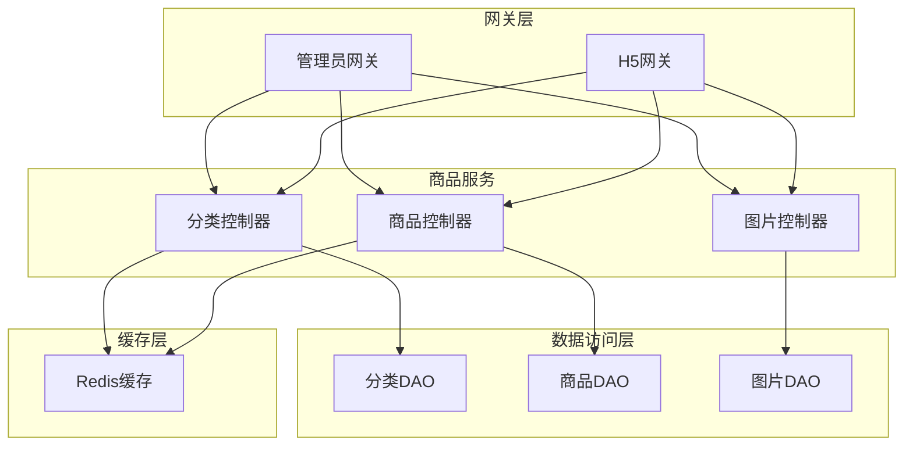
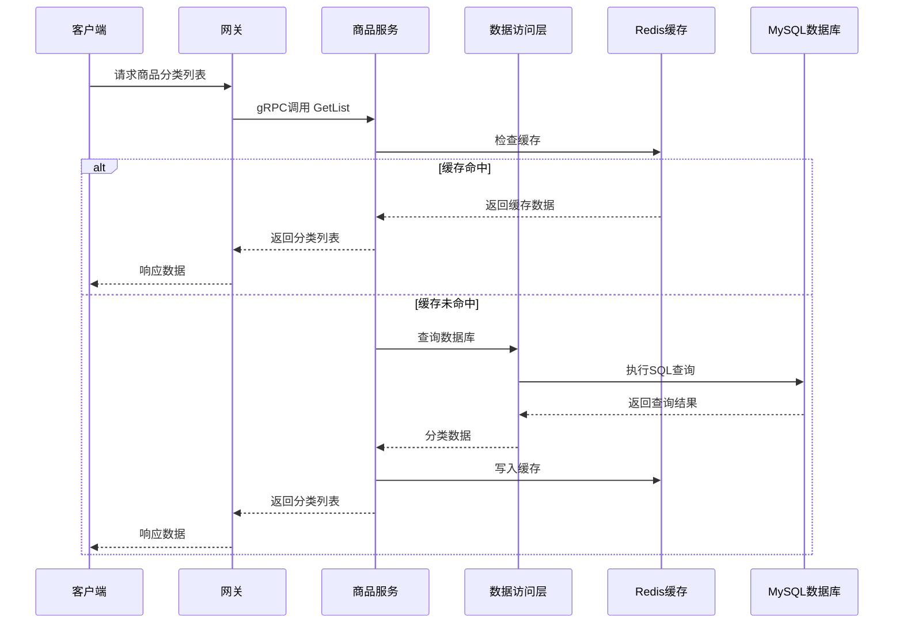
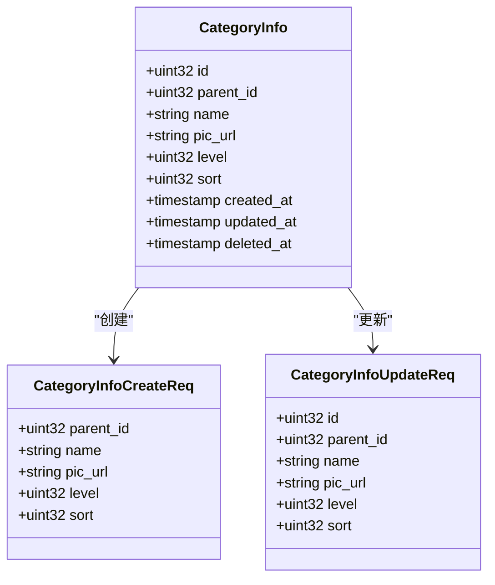
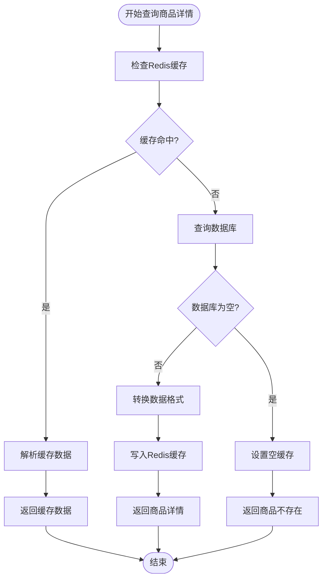
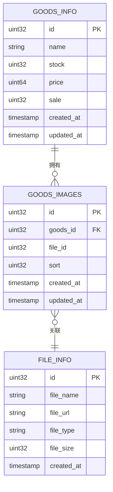
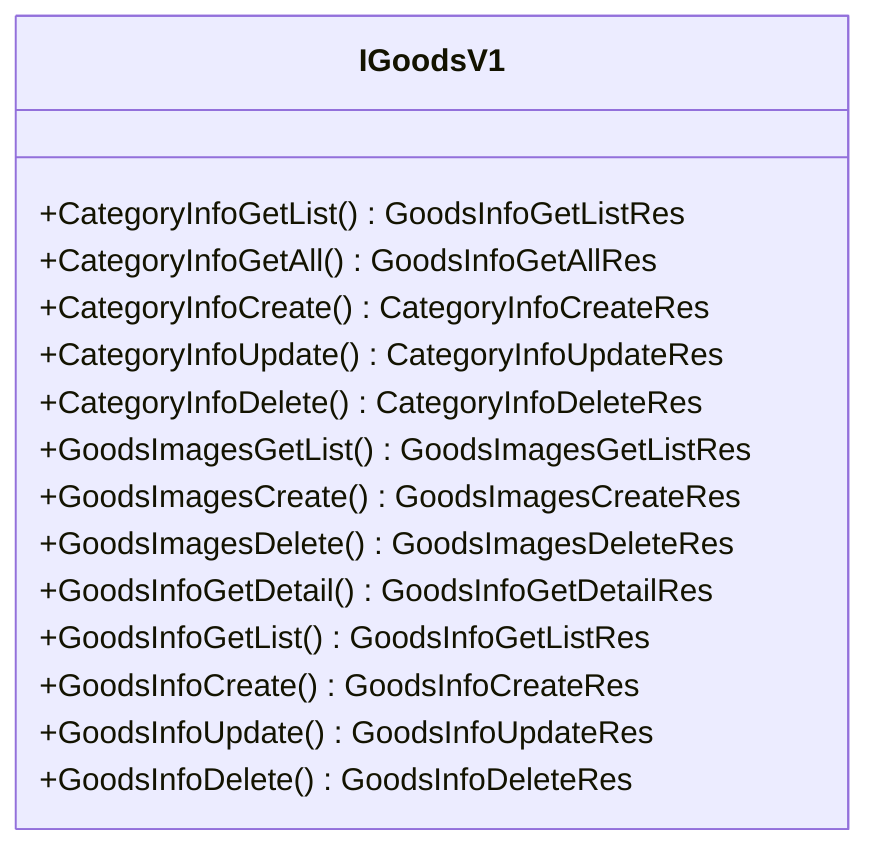
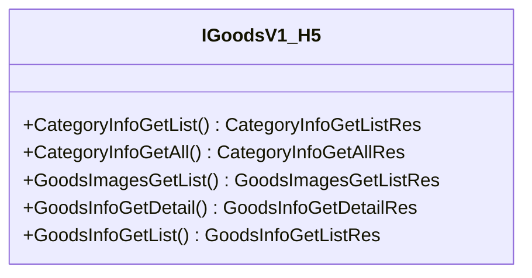
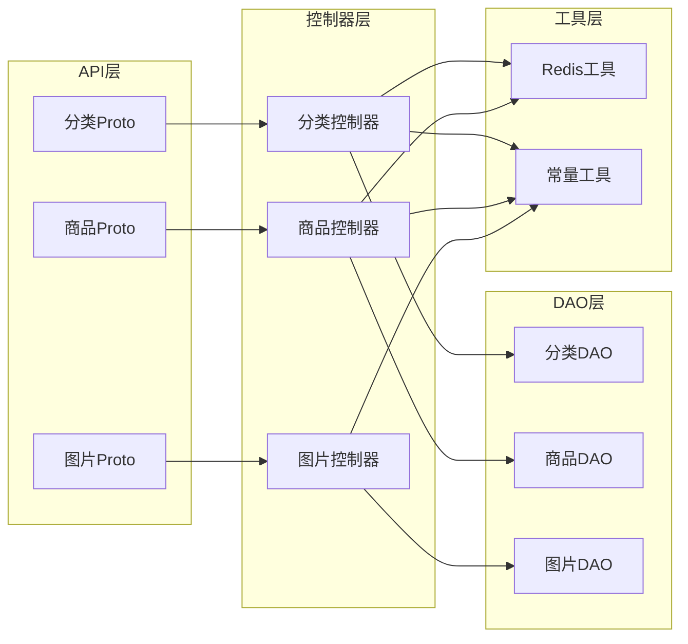

# 商品管理API

<cite>
**本文档引用的文件**
- [app/goods/manifest/protobuf/category_info/v1/category_info.proto](file://app/goods/manifest/protobuf/category_info/v1/category_info.proto)
- [app/goods/manifest/protobuf/goods_info/v1/goods_info.proto](file://app/goods/manifest/protobuf/goods_info/v1/goods_info.proto)
- [app/goods/manifest/protobuf/goods_images/v1/goods_images.proto](file://app/goods/manifest/protobuf/goods_images/v1/goods_images.proto)
- [app/goods/internal/controller/category_info/category_info.go](file://app/goods/internal/controller/category_info/category_info.go)
- [app/goods/internal/controller/goods_info/goods_info.go](file://app/goods/internal/controller/goods_info/goods_info.go)
- [app/goods/internal/controller/goods_images/goods_images.go](file://app/goods/internal/controller/goods_images/goods_images.go)
- [app/gateway-admin/api/goods/goods.go](file://app/gateway-admin/api/goods/goods.go)
- [app/gateway-h5/api/goods/goods.go](file://app/gateway-h5/api/goods/goods.go)
</cite>

## 目录
1. [简介](#简介)
2. [项目结构](#项目结构)
3. [核心组件](#核心组件)
4. [架构概览](#架构概览)
5. [详细组件分析](#详细组件分析)
6. [依赖关系分析](#依赖关系分析)
7. [性能考虑](#性能考虑)
8. [故障排除指南](#故障排除指南)
9. [结论](#结论)

## 简介

本项目是一个基于GoFrame框架的微服务架构商品管理系统。该系统提供了完整的商品管理API接口，包括商品分类管理、商品信息管理、商品图片管理等功能模块。

系统采用gRPC协议进行服务间通信，通过分层架构设计实现了清晰的业务逻辑分离。主要功能包括：
- 商品分类的创建、编辑、删除和查询
- 商品信息的完整生命周期管理（创建、修改、删除、查询）
- 商品图片的上传和管理
- 商品库存查询
- 缓存机制优化系统性能

## 项目结构

项目采用微服务架构，每个服务都有独立的API定义、控制器和数据访问层：

**图表来源**
- [app/goods/internal/controller/category_info/category_info.go](file://app/goods/internal/controller/category_info/category_info.go#L1-L204)
- [app/goods/internal/controller/goods_info/goods_info.go](file://app/goods/internal/controller/goods_info/goods_info.go#L1-L257)
- [app/goods/internal/controller/goods_images/goods_images.go](file://app/goods/internal/controller/goods_images/goods_images.go#L1-L99)

**章节来源**
- [app/goods/manifest/protobuf/category_info/v1/category_info.proto](file://app/goods/manifest/protobuf/category_info/v1/category_info.proto#L1-L77)
- [app/goods/manifest/protobuf/goods_info/v1/goods_info.proto](file://app/goods/manifest/protobuf/goods_info/v1/goods_info.proto#L1-L108)
- [app/goods/manifest/protobuf/goods_images/v1/goods_images.proto](file://app/goods/manifest/protobuf/goods_images/v1/goods_images.proto#L1-L56)

## 核心组件

### 分类管理组件
负责商品分类的完整生命周期管理，包括分类的创建、查询、更新和删除操作。

### 商品信息组件  
管理商品的核心信息，包括商品详情查询、列表展示、库存管理等核心功能。

### 图片管理组件
处理商品图片的上传、管理和查询，支持多图片关联和排序管理。

**章节来源**
- [app/goods/internal/controller/category_info/category_info.go](file://app/goods/internal/controller/category_info/category_info.go#L21-L204)
- [app/goods/internal/controller/goods_info/goods_info.go](file://app/goods/internal/controller/goods_info/goods_info.go#L23-L257)
- [app/goods/internal/controller/goods_images/goods_images.go](file://app/goods/internal/controller/goods_images/goods_images.go#L18-L99)

## 架构概览

系统采用分层架构设计，通过gRPC实现服务间的通信：

**图表来源**
- [app/goods/internal/controller/category_info/category_info.go](file://app/goods/internal/controller/category_info/category_info.go#L84-L155)
- [app/goods/internal/controller/goods_info/goods_info.go](file://app/goods/internal/controller/goods_info/goods_info.go#L94-L159)

## 详细组件分析

### 商品分类管理API

#### 接口定义
系统提供完整的商品分类管理接口：

| 接口名称 | 方法 | 请求参数 | 响应内容 | 功能描述 |
|---------|------|----------|----------|----------|
| GetList | GET | sort, page, size | 分类列表 | 获取分类列表 |
| GetAll | GET | 无 | 全部分类 | 获取所有分类 |
| Create | POST | 分类信息 | 新分类ID | 创建新分类 |
| Update | PUT | 分类ID + 信息 | 更新ID | 更新分类信息 |
| Delete | DELETE | 分类ID | 空响应 | 删除分类 |

#### 数据模型

**图表来源**
- [app/goods/manifest/protobuf/category_info/v1/category_info.proto](file://app/goods/manifest/protobuf/category_info/v1/category_info.proto#L18-L41)

#### 缓存策略
分类管理实现了智能缓存机制：
- 全量查询使用Redis缓存，提升查询性能
- 更新操作自动清除相关缓存，保证数据一致性
- 支持缓存超时控制，避免缓存污染

**章节来源**
- [app/goods/manifest/protobuf/category_info/v1/category_info.proto](file://app/goods/manifest/protobuf/category_info/v1/category_info.proto#L9-L15)
- [app/goods/internal/controller/category_info/category_info.go](file://app/goods/internal/controller/category_info/category_info.go#L84-L155)

### 商品信息管理API

#### 接口定义
商品信息管理提供核心的商品数据操作接口：

| 接口名称 | 方法 | 请求参数 | 响应内容 | 功能描述 |
|---------|------|----------|----------|----------|
| GetList | GET | page, size, is_hot | 商品列表 | 获取商品列表 |
| GetDetail | GET | id | 商品详情 | 获取商品详细信息 |
| Create | POST | 商品信息 | 新商品ID | 创建新商品 |
| Update | PUT | 商品ID + 信息 | 更新ID | 更新商品信息 |
| Delete | DELETE | 商品ID | 空响应 | 删除商品 |
| GetGoodsStock | POST | 商品ID数组 | 库存映射 | 获取商品库存 |

#### 商品详情流程

**图表来源**
- [app/goods/internal/controller/goods_info/goods_info.go](file://app/goods/internal/controller/goods_info/goods_info.go#L94-L159)

#### 库存管理机制
系统实现了高效的库存查询机制：
- 支持批量库存查询，减少数据库压力
- 结合Redis缓存和数据库双重查询
- 自动处理缓存穿透和缓存污染问题

**章节来源**
- [app/goods/manifest/protobuf/goods_info/v1/goods_info.proto](file://app/goods/manifest/protobuf/goods_info/v1/goods_info.proto#L9-L22)
- [app/goods/internal/controller/goods_info/goods_info.go](file://app/goods/internal/controller/goods_info/goods_info.go#L209-L256)

### 商品图片管理API

#### 接口定义
图片管理提供商品图片的完整操作接口：

| 接口名称 | 方法 | 请求参数 | 响应内容 | 功能描述 |
|---------|------|----------|----------|----------|
| GetList | GET | page, size | 图片列表 | 获取商品图片列表 |
| Create | POST | 商品ID, 文件ID, 排序 | 新图片ID | 创建商品图片 |
| Delete | DELETE | 图片ID | 空响应 | 删除商品图片 |

#### 数据模型

**图表来源**
- [app/goods/manifest/protobuf/goods_images/v1/goods_images.proto](file://app/goods/manifest/protobuf/goods_images/v1/goods_images.proto#L20-L24)

**章节来源**
- [app/goods/manifest/protobuf/goods_images/v1/goods_images.proto](file://app/goods/manifest/protobuf/goods_images/v1/goods_images.proto#L9-L16)
- [app/goods/internal/controller/goods_images/goods_images.go](file://app/goods/internal/controller/goods_images/goods_images.go#L26-L99)

### 网关集成

#### 管理员网关接口
管理员网关提供了完整的商品管理接口集合：

#### H5网关接口
H5网关专注于前端用户交互，提供精简的商品浏览接口：

**图表来源**
- [app/gateway-admin/api/goods/goods.go](file://app/gateway-admin/api/goods/goods.go#L13-L27)
- [app/gateway-h5/api/goods/goods.go](file://app/gateway-h5/api/goods/goods.go#L13-L30)

**章节来源**
- [app/gateway-admin/api/goods/goods.go](file://app/gateway-admin/api/goods/goods.go#L13-L27)
- [app/gateway-h5/api/goods/goods.go](file://app/gateway-h5/api/goods/goods.go#L13-L30)

## 依赖关系分析

系统采用模块化设计，各组件间依赖关系清晰：

**图表来源**
- [app/goods/internal/controller/category_info/category_info.go](file://app/goods/internal/controller/category_info/category_info.go#L3-L18)
- [app/goods/internal/controller/goods_info/goods_info.go](file://app/goods/internal/controller/goods_info/goods_info.go#L3-L21)
- [app/goods/internal/controller/goods_images/goods_images.go](file://app/goods/internal/controller/goods_images/goods_images.go#L3-L16)

**章节来源**
- [app/goods/internal/controller/category_info/category_info.go](file://app/goods/internal/controller/category_info/category_info.go#L1-L204)
- [app/goods/internal/controller/goods_info/goods_info.go](file://app/goods/internal/controller/goods_info/goods_info.go#L1-L257)
- [app/goods/internal/controller/goods_images/goods_images.go](file://app/goods/internal/controller/goods_images/goods_images.go#L1-L99)

## 性能考虑

### 缓存策略
系统实现了多层次的缓存机制来提升性能：

1. **分类全量数据缓存**：使用Redis存储完整的分类数据，支持快速查询
2. **商品详情缓存**：针对热点商品详情进行缓存，减少数据库查询压力
3. **空缓存处理**：防止缓存穿透，对不存在的数据也进行缓存标记

### 数据库优化
- 使用分页查询避免大量数据传输
- 条件查询优化，支持多种筛选条件
- 批量操作减少数据库连接开销

### 异步处理
- 缓存操作使用异步方式，避免阻塞主业务流程
- 错误处理采用非阻塞模式，确保系统稳定性

## 故障排除指南

### 常见问题及解决方案

#### 缓存相关问题
- **缓存未命中**：检查Redis连接配置和缓存键值
- **缓存数据过期**：调整缓存过期时间配置
- **缓存污染**：确保更新操作正确清除相关缓存

#### 数据库连接问题
- **连接超时**：检查数据库连接池配置
- **查询性能慢**：优化查询条件和索引设计
- **事务冲突**：合理设计事务边界和锁策略

#### gRPC通信问题
- **服务注册失败**：检查服务发现配置
- **请求超时**：调整gRPC超时参数
- **序列化错误**：确保Proto文件版本一致

**章节来源**
- [app/goods/internal/controller/category_info/category_info.go](file://app/goods/internal/controller/category_info/category_info.go#L145-L152)
- [app/goods/internal/controller/goods_info/goods_info.go](file://app/goods/internal/controller/goods_info/goods_info.go#L150-L157)

## 结论

本商品管理API系统通过合理的架构设计和完善的缓存机制，提供了高性能、高可用的商品管理解决方案。系统的主要优势包括：

1. **模块化设计**：清晰的职责分离和接口定义
2. **高性能缓存**：多层缓存策略显著提升系统性能
3. **完整的生命周期管理**：覆盖商品管理的各个环节
4. **良好的扩展性**：支持未来功能的平滑扩展

通过本文档介绍的接口规范和最佳实践，开发者可以快速理解和使用该商品管理API系统，为业务发展提供强有力的技术支撑。