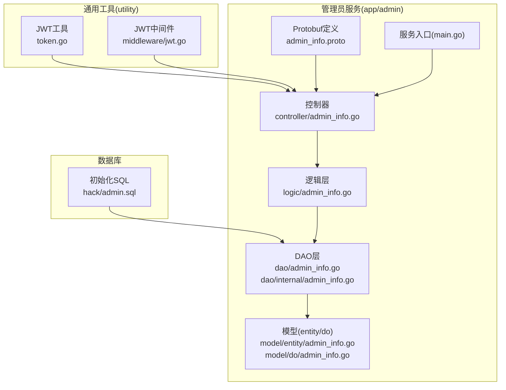
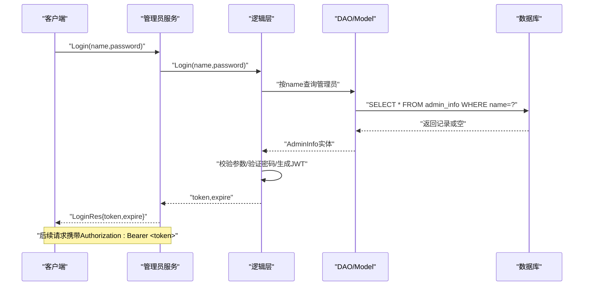
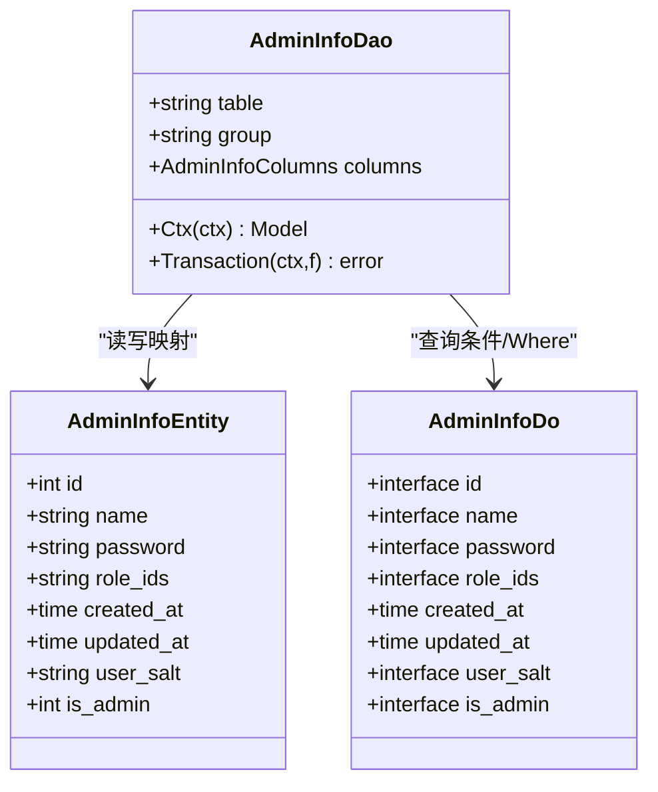
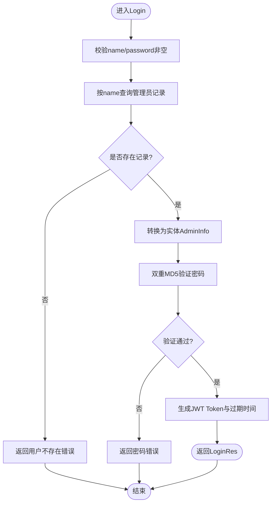
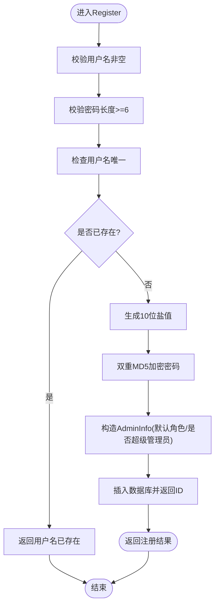
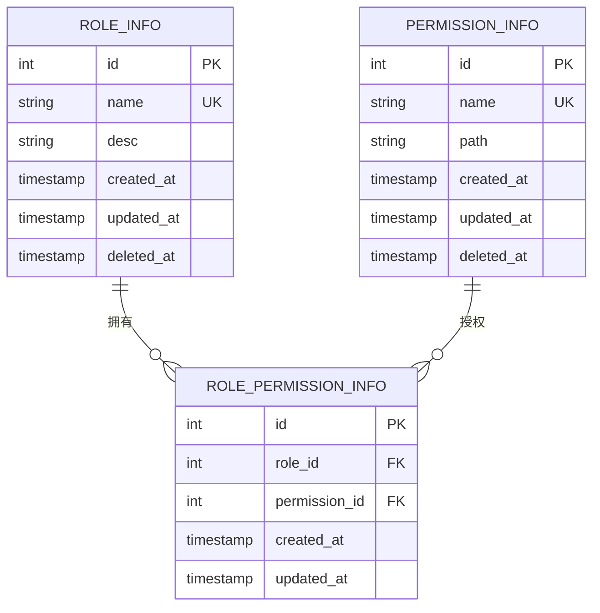
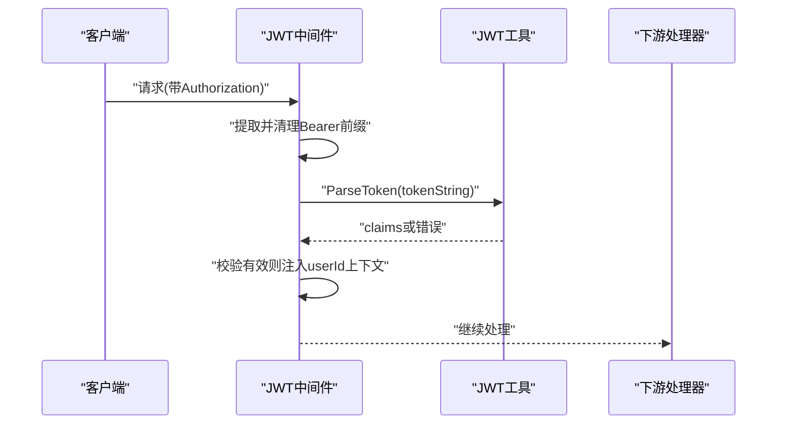
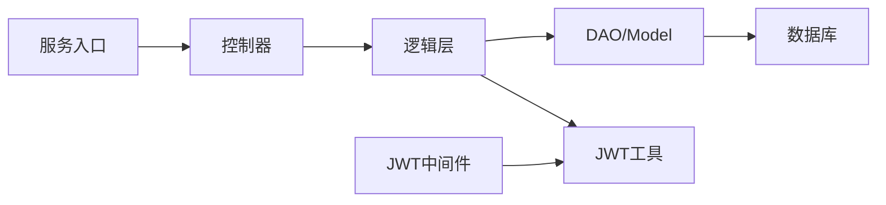

# 管理员管理API

<cite>
**本文引用的文件**
- [app/admin/main.go](file://app/admin/main.go)
- [app/admin/internal/controller/admin_info/admin_info.go](file://app/admin/internal/controller/admin_info/admin_info.go)
- [app/admin/internal/logic/admin_info/admin_info.go](file://app/admin/internal/logic/admin_info/admin_info.go)
- [app/admin/internal/model/entity/admin_info.go](file://app/admin/internal/model/entity/admin_info.go)
- [app/admin/internal/model/do/admin_info.go](file://app/admin/internal/model/do/admin_info.go)
- [app/admin/internal/dao/admin_info.go](file://app/admin/internal/dao/admin_info.go)
- [app/admin/internal/dao/internal/admin_info.go](file://app/admin/internal/dao/internal/admin_info.go)
- [app/admin/manifest/protobuf/admin_info/v1/admin_info.proto](file://app/admin/manifest/protobuf/admin_info/v1/admin_info.proto)
- [utility/token.go](file://utility/token.go)
- [utility/middleware/jwt.go](file://utility/middleware/jwt.go)
- [app/admin/hack/admin.sql](file://app/admin/hack/admin.sql)
</cite>

## 目录
1. [简介](#简介)
2. [项目结构](#项目结构)
3. [核心组件](#核心组件)
4. [架构总览](#架构总览)
5. [详细组件分析](#详细组件分析)
6. [依赖关系分析](#依赖关系分析)
7. [性能考虑](#性能考虑)
8. [故障排查指南](#故障排查指南)
9. [结论](#结论)
10. [附录](#附录)

## 简介
本文件面向管理员管理API的使用者与维护者，系统化梳理管理员登录、注册、权限与角色相关的接口与实现机制。内容覆盖认证流程（JWT Token生成与验证）、权限校验中间件、以及基于角色与权限的数据模型与DAO层设计。文档同时提供接口调用示例与安全注意事项，帮助快速上手与稳定运维。

## 项目结构
管理员子系统采用GoFrame微服务分层架构：API定义（Protobuf）→ 控制器（Controller）→ 业务逻辑（Logic）→ 数据访问（DAO/Model）。服务通过etcd注册中心进行gRPC服务发现与路由。

图表来源
- [app/admin/manifest/protobuf/admin_info/v1/admin_info.proto](file://app/admin/manifest/protobuf/admin_info/v1/admin_info.proto#L1-L40)
- [app/admin/internal/controller/admin_info/admin_info.go](file://app/admin/internal/controller/admin_info/admin_info.go#L1-L73)
- [app/admin/internal/logic/admin_info/admin_info.go](file://app/admin/internal/logic/admin_info/admin_info.go#L1-L96)
- [app/admin/internal/dao/admin_info.go](file://app/admin/internal/dao/admin_info.go#L1-L23)
- [app/admin/internal/dao/internal/admin_info.go](file://app/admin/internal/dao/internal/admin_info.go#L1-L94)
- [app/admin/internal/model/entity/admin_info.go](file://app/admin/internal/model/entity/admin_info.go#L1-L22)
- [app/admin/internal/model/do/admin_info.go](file://app/admin/internal/model/do/admin_info.go#L1-L24)
- [app/admin/main.go](file://app/admin/main.go#L1-L25)
- [utility/token.go](file://utility/token.go#L1-L65)
- [utility/middleware/jwt.go](file://utility/middleware/jwt.go#L1-L39)
- [app/admin/hack/admin.sql](file://app/admin/hack/admin.sql#L1-L83)

章节来源
- [app/admin/main.go](file://app/admin/main.go#L1-L25)
- [app/admin/manifest/protobuf/admin_info/v1/admin_info.proto](file://app/admin/manifest/protobuf/admin_info/v1/admin_info.proto#L1-L40)

## 核心组件
- gRPC服务定义：在Protobuf中定义管理员登录与注册两个RPC接口，返回包含JWT Token与过期时间的登录响应，以及注册后的管理员信息。
- 控制器：接收请求，调用逻辑层处理业务，组装响应；对错误进行统一包装与日志记录。
- 逻辑层：实现登录参数校验、用户查询、密码验证、JWT生成；实现注册参数校验、盐值生成、双重MD5加密、默认角色与管理员标识设置、持久化保存。
- DAO/Model：封装数据库表admin_info的字段映射与常用查询能力，支持事务与上下文传递。
- JWT工具与中间件：提供Token生成、解析与校验；HTTP中间件负责从Header提取Token并注入用户上下文。

章节来源
- [app/admin/internal/controller/admin_info/admin_info.go](file://app/admin/internal/controller/admin_info/admin_info.go#L1-L73)
- [app/admin/internal/logic/admin_info/admin_info.go](file://app/admin/internal/logic/admin_info/admin_info.go#L1-L96)
- [app/admin/internal/model/entity/admin_info.go](file://app/admin/internal/model/entity/admin_info.go#L1-L22)
- [app/admin/internal/model/do/admin_info.go](file://app/admin/internal/model/do/admin_info.go#L1-L24)
- [app/admin/internal/dao/admin_info.go](file://app/admin/internal/dao/admin_info.go#L1-L23)
- [app/admin/internal/dao/internal/admin_info.go](file://app/admin/internal/dao/internal/admin_info.go#L1-L94)
- [utility/token.go](file://utility/token.go#L1-L65)
- [utility/middleware/jwt.go](file://utility/middleware/jwt.go#L1-L39)

## 架构总览
管理员服务通过etcd注册中心暴露gRPC服务，客户端以gRPC方式调用登录与注册接口。登录成功后返回JWT Token与过期时间；后续管理端请求可在HTTP层使用JWT中间件进行鉴权。

图表来源
- [app/admin/internal/controller/admin_info/admin_info.go](file://app/admin/internal/controller/admin_info/admin_info.go#L23-L44)
- [app/admin/internal/logic/admin_info/admin_info.go](file://app/admin/internal/logic/admin_info/admin_info.go#L15-L46)
- [app/admin/internal/dao/internal/admin_info.go](file://app/admin/internal/dao/internal/admin_info.go#L76-L83)
- [utility/token.go](file://utility/token.go#L32-L50)

## 详细组件分析

### 接口定义与数据模型
- Protobuf服务定义了管理员登录与注册两个RPC接口，响应体包含JWT Token与过期时间，以及注册后的管理员信息字段。
- 实体与DO模型映射数据库表admin_info的字段，包括用户名、密码、盐值、角色ID集合、是否超级管理员、创建/更新时间等。

图表来源
- [app/admin/internal/model/entity/admin_info.go](file://app/admin/internal/model/entity/admin_info.go#L11-L21)
- [app/admin/internal/model/do/admin_info.go](file://app/admin/internal/model/do/admin_info.go#L12-L23)
- [app/admin/internal/dao/internal/admin_info.go](file://app/admin/internal/dao/internal/admin_info.go#L14-L93)

章节来源
- [app/admin/manifest/protobuf/admin_info/v1/admin_info.proto](file://app/admin/manifest/protobuf/admin_info/v1/admin_info.proto#L9-L40)
- [app/admin/internal/model/entity/admin_info.go](file://app/admin/internal/model/entity/admin_info.go#L11-L21)
- [app/admin/internal/model/do/admin_info.go](file://app/admin/internal/model/do/admin_info.go#L12-L23)
- [app/admin/internal/dao/internal/admin_info.go](file://app/admin/internal/dao/internal/admin_info.go#L14-L93)

### 登录流程
- 参数校验：用户名与密码非空。
- 查询用户：按用户名精确查询。
- 密码验证：使用输入密码与用户盐值进行双重MD5加密后比对。
- JWT生成：签发含用户ID与有效期的Token。
- 响应封装：返回Token与过期时间戳。

图表来源
- [app/admin/internal/logic/admin_info/admin_info.go](file://app/admin/internal/logic/admin_info/admin_info.go#L15-L46)
- [utility/token.go](file://utility/token.go#L32-L50)

章节来源
- [app/admin/internal/controller/admin_info/admin_info.go](file://app/admin/internal/controller/admin_info/admin_info.go#L23-L44)
- [app/admin/internal/logic/admin_info/admin_info.go](file://app/admin/internal/logic/admin_info/admin_info.go#L15-L46)
- [utility/token.go](file://utility/token.go#L32-L50)

### 注册流程
- 参数校验：用户名非空，密码长度不少于6位。
- 去重校验：检查用户名是否已存在。
- 盐值生成：生成10位随机盐。
- 密码加密：双重MD5加密。
- 默认配置：默认角色ID与是否超级管理员标记。
- 持久化：插入新记录并返回自增ID。

图表来源
- [app/admin/internal/logic/admin_info/admin_info.go](file://app/admin/internal/logic/admin_info/admin_info.go#L48-L95)
- [utility/token.go](file://utility/token.go#L20-L29)

章节来源
- [app/admin/internal/controller/admin_info/admin_info.go](file://app/admin/internal/controller/admin_info/admin_info.go#L46-L72)
- [app/admin/internal/logic/admin_info/admin_info.go](file://app/admin/internal/logic/admin_info/admin_info.go#L48-L95)
- [utility/token.go](file://utility/token.go#L20-L29)

### 权限与角色模型
- 角色表：包含角色ID、名称、描述及软删除字段。
- 权限表：包含权限ID、名称、路径及软删除字段。
- 角色-权限关联表：建立角色与权限的多对多关系。

图表来源
- [app/admin/hack/admin.sql](file://app/admin/hack/admin.sql#L27-L83)

章节来源
- [app/admin/hack/admin.sql](file://app/admin/hack/admin.sql#L27-L83)

### JWT认证与中间件
- Token生成：使用HS256算法签名，包含用户ID与时间戳声明，有效期24小时。
- Token解析：从请求头Authorization中提取Bearer Token并解析校验。
- 中间件：若未提供或无效Token则拒绝请求，并将用户ID注入上下文供后续业务使用。

图表来源
- [utility/middleware/jwt.go](file://utility/middleware/jwt.go#L16-L38)
- [utility/token.go](file://utility/token.go#L52-L64)

章节来源
- [utility/token.go](file://utility/token.go#L10-L65)
- [utility/middleware/jwt.go](file://utility/middleware/jwt.go#L1-L39)

### 数据访问层（DAO）
- DAO封装了表名、列名、上下文模型创建、事务处理等通用能力。
- 支持按上下文执行查询与事务包裹，便于在控制器与逻辑层统一管理数据库会话。

章节来源
- [app/admin/internal/dao/admin_info.go](file://app/admin/internal/dao/admin_info.go#L1-L23)
- [app/admin/internal/dao/internal/admin_info.go](file://app/admin/internal/dao/internal/admin_info.go#L1-L94)

### 服务启动与注册
- 服务启动时从配置加载etcd地址，注册gRPC服务解析器，随后启动命令入口。
- 控制器通过gRPC注册服务，对外暴露登录与注册接口。

章节来源
- [app/admin/main.go](file://app/admin/main.go#L13-L24)
- [app/admin/internal/controller/admin_info/admin_info.go](file://app/admin/internal/controller/admin_info/admin_info.go#L19-L21)

## 依赖关系分析
- 控制器依赖逻辑层完成业务处理，依赖Protobuf生成的服务接口。
- 逻辑层依赖DAO与工具模块（密码加密、Token生成）。
- DAO依赖内部AdminInfoDao实现数据库操作。
- 中间件依赖JWT工具进行Token解析与校验。
- 服务入口依赖etcd注册中心与命令入口。

图表来源
- [app/admin/internal/controller/admin_info/admin_info.go](file://app/admin/internal/controller/admin_info/admin_info.go#L1-L17)
- [app/admin/internal/logic/admin_info/admin_info.go](file://app/admin/internal/logic/admin_info/admin_info.go#L1-L13)
- [app/admin/internal/dao/internal/admin_info.go](file://app/admin/internal/dao/internal/admin_info.go#L1-L94)
- [utility/token.go](file://utility/token.go#L1-L65)
- [utility/middleware/jwt.go](file://utility/middleware/jwt.go#L1-L39)
- [app/admin/main.go](file://app/admin/main.go#L1-L25)

章节来源
- [app/admin/internal/controller/admin_info/admin_info.go](file://app/admin/internal/controller/admin_info/admin_info.go#L1-L17)
- [app/admin/internal/logic/admin_info/admin_info.go](file://app/admin/internal/logic/admin_info/admin_info.go#L1-L13)
- [app/admin/internal/dao/internal/admin_info.go](file://app/admin/internal/dao/internal/admin_info.go#L1-L94)
- [utility/token.go](file://utility/token.go#L1-L65)
- [utility/middleware/jwt.go](file://utility/middleware/jwt.go#L1-L39)
- [app/admin/main.go](file://app/admin/main.go#L1-L25)

## 性能考虑
- Token有效期：当前实现固定24小时，可根据业务需求调整或引入刷新机制。
- 密码加密：双重MD5在易用性与安全性之间平衡，建议结合更安全的密码哈希算法（如bcrypt）进行升级。
- 查询优化：登录与注册均涉及单字段唯一查询，确保数据库对用户名建立唯一索引以提升命中率。
- 并发与事务：DAO层提供事务封装，复杂业务可使用事务保证一致性。

## 故障排查指南
- 登录失败
  - 检查用户名与密码是否为空。
  - 核对数据库中是否存在该用户名。
  - 确认密码加密方式与盐值一致。
- 注册失败
  - 校验用户名是否重复。
  - 确认密码长度满足要求。
  - 查看数据库唯一索引是否生效。
- Token无效
  - 确认请求头Authorization格式为Bearer <token>。
  - 校验签名密钥与算法是否一致。
  - 检查Token是否过期。
- 服务不可达
  - 确认etcd地址配置正确。
  - 检查服务注册状态与gRPC端口。

章节来源
- [app/admin/internal/controller/admin_info/admin_info.go](file://app/admin/internal/controller/admin_info/admin_info.go#L23-L72)
- [app/admin/internal/logic/admin_info/admin_info.go](file://app/admin/internal/logic/admin_info/admin_info.go#L15-L95)
- [utility/middleware/jwt.go](file://utility/middleware/jwt.go#L16-L38)
- [app/admin/main.go](file://app/admin/main.go#L13-L24)

## 结论
管理员管理API围绕登录与注册两大核心能力构建，配合JWT认证与中间件实现统一鉴权。通过清晰的分层设计与完善的DAO/Model抽象，系统具备良好的可扩展性与可维护性。建议后续在密码安全、Token刷新与权限细粒度控制方面持续优化。

## 附录

### 接口清单与调用示例

- 服务定义
  - 服务名：AdminInfo
  - 方法：
    - Login(AdminInfoLoginReq) → AdminInfoLoginRes
    - Register(AdminInfoRegisterReq) → AdminInfoRegisterRes

- 请求/响应字段
  - Login
    - 请求：name(string)、password(string)
    - 响应：token(string)、expire(timestamp)
  - Register
    - 请求：name(string)、password(string)
    - 响应：id(uint32)、name(string)、role_ids(string)、is_admin(uint32)、created_at(timestamp)

- 示例调用步骤
  - 登录
    - 客户端向服务发送Login请求，携带用户名与密码。
    - 服务返回JWT Token与过期时间。
  - 后续请求
    - 在请求头添加Authorization: Bearer <token>。
    - 中间件解析Token并将用户ID注入上下文。

章节来源
- [app/admin/manifest/protobuf/admin_info/v1/admin_info.proto](file://app/admin/manifest/protobuf/admin_info/v1/admin_info.proto#L9-L40)
- [app/admin/internal/controller/admin_info/admin_info.go](file://app/admin/internal/controller/admin_info/admin_info.go#L23-L72)