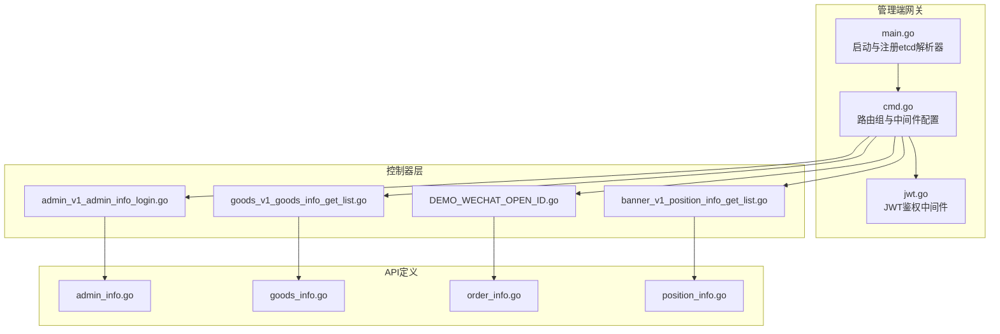
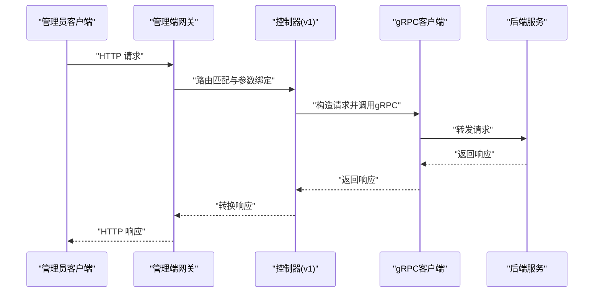
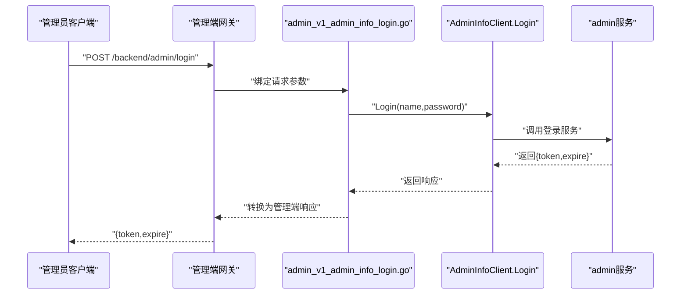
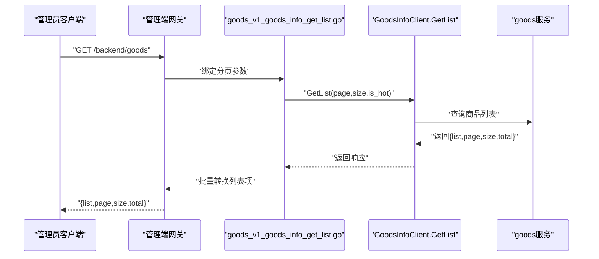
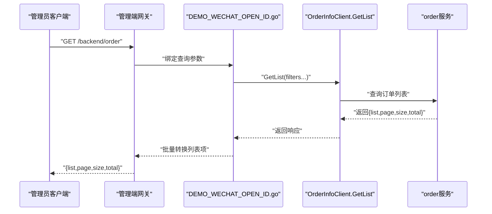
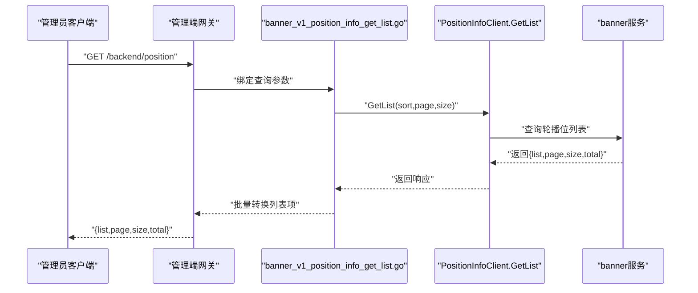
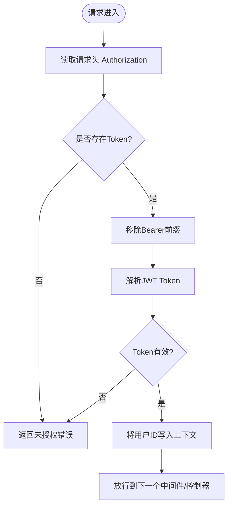
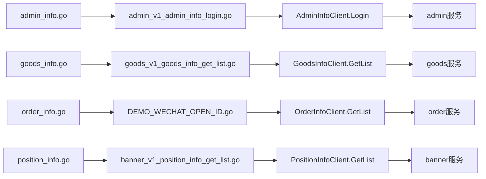

# 管理端网关API

<cite>
**本文档引用的文件**
- [app/gateway-admin/main.go](file://app/gateway-admin/main.go)
- [app/gateway-admin/internal/cmd/cmd.go](file://app/gateway-admin/internal/cmd/cmd.go)
- [app/gateway-admin/api/admin/v1/admin_info.go](file://app/gateway-admin/api/admin/v1/admin_info.go)
- [app/gateway-admin/api/goods/v1/goods_info.go](file://app/gateway-admin/api/goods/v1/goods_info.go)
- [app/gateway-admin/api/goods/v1/category_info.go](file://app/gateway-admin/api/goods/v1/category_info.go)
- [app/gateway-admin/api/order/v1/order_info.go](file://app/gateway-admin/api/order/v1/order_info.go)
- [app/gateway-admin/api/banner/v1/position_info.go](file://app/gateway-admin/api/banner/v1/position_info.go)
- [app/gateway-admin/internal/controller/admin/admin_v1_admin_info_login.go](file://app/gateway-admin/internal/controller/admin/admin_v1_admin_info_login.go)
- [app/gateway-admin/internal/controller/goods/goods_v1_goods_info_get_list.go](file://app/gateway-admin/internal/controller/goods/goods_v1_goods_info_get_list.go)
- [app/gateway-admin/internal/controller/order/DEMO_WECHAT_OPEN_ID.go](file://app/gateway-admin/internal/controller/order/DEMO_WECHAT_OPEN_ID.go)
- [app/gateway-admin/internal/controller/banner/banner_v1_position_info_get_list.go](file://app/gateway-admin/internal/controller/banner/banner_v1_position_info_get_list.go)
- [utility/middleware/jwt.go](file://utility/middleware/jwt.go)
</cite>

## 目录
1. [简介](#简介)
2. [项目结构](#项目结构)
3. [核心组件](#核心组件)
4. [架构总览](#架构总览)
5. [详细组件分析](#详细组件分析)
6. [依赖关系分析](#依赖关系分析)
7. [性能考虑](#性能考虑)
8. [故障排除指南](#故障排除指南)
9. [结论](#结论)

## 简介
本文件为管理端网关API接口文档，覆盖管理后台相关接口，包括管理员登录认证、用户管理、商品管理、订单管理、轮播图管理等模块。文档提供HTTP方法、URL路径、请求参数、响应格式、权限控制说明，并给出具体管理操作示例，说明管理员权限验证与数据访问控制。

## 项目结构
管理端网关基于 GoFrame 框架，通过 ghttp 路由组绑定各业务控制器，使用 etcd 作为服务发现，结合 gRPC 客户端调用后端微服务。JWT 中间件用于鉴权保护需要认证的路由。

**图表来源**
- [app/gateway-admin/main.go](file://app/gateway-admin/main.go#L1-L30)
- [app/gateway-admin/internal/cmd/cmd.go](file://app/gateway-admin/internal/cmd/cmd.go#L1-L46)
- [utility/middleware/jwt.go](file://utility/middleware/jwt.go#L1-L39)
- [app/gateway-admin/internal/controller/admin/admin_v1_admin_info_login.go](file://app/gateway-admin/internal/controller/admin/admin_v1_admin_info_login.go#L1-L38)
- [app/gateway-admin/internal/controller/goods/goods_v1_goods_info_get_list.go](file://app/gateway-admin/internal/controller/goods/goods_v1_goods_info_get_list.go#L1-L39)
- [app/gateway-admin/internal/controller/order/DEMO_WECHAT_OPEN_ID.go](file://app/gateway-admin/internal/controller/order/DEMO_WECHAT_OPEN_ID.go#L1-L39)
- [app/gateway-admin/internal/controller/banner/banner_v1_position_info_get_list.go](file://app/gateway-admin/internal/controller/banner/banner_v1_position_info_get_list.go#L1-L39)

**章节来源**
- [app/gateway-admin/main.go](file://app/gateway-admin/main.go#L1-L30)
- [app/gateway-admin/internal/cmd/cmd.go](file://app/gateway-admin/internal/cmd/cmd.go#L1-L46)

## 核心组件
- 网关入口与服务发现：在 main 中注册 etcd 解析器，使 gRPC 客户端能通过服务名发现后端服务。
- 路由与中间件：在 cmd 中定义路由组“/backend”，对需要认证的接口统一挂载 JWTAuth 中间件。
- 控制器：每个模块的 v1 控制器负责接收请求、构造 gRPC 请求、调用后端服务并转换响应。
- API 定义：以结构体形式定义请求/响应模型，包含路径、方法、校验规则与字段说明。

**章节来源**
- [app/gateway-admin/main.go](file://app/gateway-admin/main.go#L13-L29)
- [app/gateway-admin/internal/cmd/cmd.go](file://app/gateway-admin/internal/cmd/cmd.go#L20-L39)
- [utility/middleware/jwt.go](file://utility/middleware/jwt.go#L16-L38)

## 架构总览
管理端网关采用“HTTP 接口 + gRPC 调用”的混合架构。前端请求经网关路由至对应控制器，控制器通过 gRPC 客户端调用后端服务，再将响应转换为管理端 API 的标准格式返回。

**图表来源**
- [app/gateway-admin/internal/cmd/cmd.go](file://app/gateway-admin/internal/cmd/cmd.go#L20-L39)
- [app/gateway-admin/internal/controller/admin/admin_v1_admin_info_login.go](file://app/gateway-admin/internal/controller/admin/admin_v1_admin_info_login.go#L14-L37)

## 详细组件分析

### 管理员登录认证
- 路由与方法
  - POST /backend/admin/login
- 请求参数
  - name: 用户名（必填）
  - password: 密码（必填）
- 响应内容
  - token: 登录令牌
  - expire: 过期时间
- 权限控制
  - 该接口无需 JWT 认证；后续需要认证的接口需携带 Authorization: Bearer <token>。
- 示例
  - 成功登录后，保存返回的 token 并在后续请求头中携带 Authorization: Bearer <token>。

**图表来源**
- [app/gateway-admin/api/admin/v1/admin_info.go](file://app/gateway-admin/api/admin/v1/admin_info.go#L8-L17)
- [app/gateway-admin/internal/controller/admin/admin_v1_admin_info_login.go](file://app/gateway-admin/internal/controller/admin/admin_v1_admin_info_login.go#L14-L37)

**章节来源**
- [app/gateway-admin/api/admin/v1/admin_info.go](file://app/gateway-admin/api/admin/v1/admin_info.go#L8-L17)
- [app/gateway-admin/internal/controller/admin/admin_v1_admin_info_login.go](file://app/gateway-admin/internal/controller/admin/admin_v1_admin_info_login.go#L14-L37)

### 商品管理

#### 商品分页查询
- 路由与方法
  - GET /backend/goods
- 请求参数
  - page: 页码（默认1，最小1）
  - size: 每页数量（默认10，最大100）
  - is_hot: 是否热门（1开启）
- 响应内容
  - list: 商品列表项
  - page/size/total: 分页信息
- 示例
  - GET /backend/goods?page=1&size=20&is_hot=1

**图表来源**
- [app/gateway-admin/api/goods/v1/goods_info.go](file://app/gateway-admin/api/goods/v1/goods_info.go#L18-L31)
- [app/gateway-admin/internal/controller/goods/goods_v1_goods_info_get_list.go](file://app/gateway-admin/internal/controller/goods/goods_v1_goods_info_get_list.go#L11-L38)

**章节来源**
- [app/gateway-admin/api/goods/v1/goods_info.go](file://app/gateway-admin/api/goods/v1/goods_info.go#L18-L31)
- [app/gateway-admin/internal/controller/goods/goods_v1_goods_info_get_list.go](file://app/gateway-admin/internal/controller/goods/goods_v1_goods_info_get_list.go#L11-L38)

#### 商品详情查询
- 路由与方法
  - GET /backend/goods/detail
- 请求参数
  - id: 商品ID（必填）
- 响应内容
  - 复用商品列表项结构的商品详情

**章节来源**
- [app/gateway-admin/api/goods/v1/goods_info.go](file://app/gateway-admin/api/goods/v1/goods_info.go#L8-L16)

#### 商品新增/更新/删除
- 新增商品
  - POST /backend/goods
  - 参数：名称、主图、多图、价格、分类ID、品牌、库存、销量、标签、详情、排序等
  - 响应：商品ID
- 更新商品
  - PUT /backend/goods
  - 参数：id 必填，其余字段按需更新
  - 响应：商品ID
- 删除商品
  - DELETE /backend/goods
  - 参数：id 必填
  - 响应：空

**章节来源**
- [app/gateway-admin/api/goods/v1/goods_info.go](file://app/gateway-admin/api/goods/v1/goods_info.go#L52-L105)

#### 商品分类管理
- 分类分页查询
  - GET /backend/category
  - 参数：sort/page/size
  - 响应：list/page/size/total
- 获取所有分类
  - GET /backend/category/all
  - 响应：list/total
- 新增/更新/删除分类
  - POST /backend/category（新增）
  - PUT /backend/category（更新）
  - DELETE /backend/category（删除）
  - 参数：parent_id/name/pic_url/level/sort（新增必填）

**章节来源**
- [app/gateway-admin/api/goods/v1/category_info.go](file://app/gateway-admin/api/goods/v1/category_info.go#L8-L81)

### 订单管理

#### 订单分页查询
- 路由与方法
  - GET /backend/order
- 请求参数
  - page/size：分页
  - number：订单编号
  - user_id：用户ID
  - pay_type：支付方式
  - status：订单状态
  - consignee_phone：收货人手机号
  - price_gte/price_lte：金额范围（分）
  - pay_at_gte/pay_at_lte：支付时间范围
  - date_gte/date_lte：创建时间范围
- 响应内容
  - list：订单列表
  - page/size/total：分页信息

**图表来源**
- [app/gateway-admin/api/order/v1/order_info.go](file://app/gateway-admin/api/order/v1/order_info.go#L8-L31)
- [app/gateway-admin/internal/controller/order/DEMO_WECHAT_OPEN_ID.go](file://app/gateway-admin/internal/controller/order/DEMO_WECHAT_OPEN_ID.go#L11-L38)

**章节来源**
- [app/gateway-admin/api/order/v1/order_info.go](file://app/gateway-admin/api/order/v1/order_info.go#L8-L31)
- [app/gateway-admin/internal/controller/order/DEMO_WECHAT_OPEN_ID.go](file://app/gateway-admin/internal/controller/order/DEMO_WECHAT_OPEN_ID.go#L11-L38)

#### 订单详情查询
- 路由与方法
  - GET /backend/order/{id}
- 请求参数
  - id: 订单ID（路径参数）
- 响应内容
  - order_info：订单基本信息
  - order_goods_info：订单商品明细

**章节来源**
- [app/gateway-admin/api/order/v1/order_info.go](file://app/gateway-admin/api/order/v1/order_info.go#L58-L67)

### 轮播图管理

#### 轮播位分页查询
- 路由与方法
  - GET /backend/position
- 请求参数
  - sort：排序方式（1正序/2倒序）
  - page/size：分页
- 响应内容
  - list/page/size/total：分页信息

**图表来源**
- [app/gateway-admin/api/banner/v1/position_info.go](file://app/gateway-admin/api/banner/v1/position_info.go#L8-L21)
- [app/gateway-admin/internal/controller/banner/banner_v1_position_info_get_list.go](file://app/gateway-admin/internal/controller/banner/banner_v1_position_info_get_list.go#L11-L38)

**章节来源**
- [app/gateway-admin/api/banner/v1/position_info.go](file://app/gateway-admin/api/banner/v1/position_info.go#L8-L21)
- [app/gateway-admin/internal/controller/banner/banner_v1_position_info_get_list.go](file://app/gateway-admin/internal/controller/banner/banner_v1_position_info_get_list.go#L11-L38)

#### 轮播位新增/更新/删除
- 新增轮播位
  - POST /backend/position
  - 参数：pic_url/goods_name/link/sort/goods_id（pic_url/link 必须为有效URL）
  - 响应：轮播位ID
- 更新轮播位
  - PUT /backend/position
  - 参数：id 必填，其余按需更新
  - 响应：轮播位ID
- 删除轮播位
  - DELETE /backend/position
  - 参数：id 必填
  - 响应：空

**章节来源**
- [app/gateway-admin/api/banner/v1/position_info.go](file://app/gateway-admin/api/banner/v1/position_info.go#L34-L71)

### 权限控制与数据访问
- JWT 鉴权中间件
  - 对 /backend 下的路由组挂载 JWTAuth 中间件
  - 从请求头 Authorization 提取 Bearer Token
  - 校验失败返回未授权错误
  - 成功则将用户ID写入上下文供后续使用
- 管理员登录
  - 登录成功后返回 token 与过期时间
  - 后续请求需在请求头添加 Authorization: Bearer <token>

**图表来源**
- [utility/middleware/jwt.go](file://utility/middleware/jwt.go#L16-L38)

**章节来源**
- [utility/middleware/jwt.go](file://utility/middleware/jwt.go#L16-L38)
- [app/gateway-admin/internal/cmd/cmd.go](file://app/gateway-admin/internal/cmd/cmd.go#L29-L38)

## 依赖关系分析
- 路由绑定
  - /backend/admin/* 绑定管理员相关控制器（无需JWT）
  - /backend 下其他模块（goods/order/banner）统一挂载 JWTAuth 中间件
- 控制器到服务
  - 控制器通过 gconv 结构体转换，调用对应 gRPC 客户端方法
  - gRPC 客户端通过服务名与 etcd 解析器连接后端服务
- 中间件
  - CORS 中间件在网关入口设置跨域头
  - JWTAuth 中间件在路由组内生效，确保敏感接口的安全访问

**图表来源**
- [app/gateway-admin/api/admin/v1/admin_info.go](file://app/gateway-admin/api/admin/v1/admin_info.go#L8-L17)
- [app/gateway-admin/internal/controller/admin/admin_v1_admin_info_login.go](file://app/gateway-admin/internal/controller/admin/admin_v1_admin_info_login.go#L14-L37)
- [app/gateway-admin/api/goods/v1/goods_info.go](file://app/gateway-admin/api/goods/v1/goods_info.go#L18-L31)
- [app/gateway-admin/internal/controller/goods/goods_v1_goods_info_get_list.go](file://app/gateway-admin/internal/controller/goods/goods_v1_goods_info_get_list.go#L11-L38)
- [app/gateway-admin/api/order/v1/order_info.go](file://app/gateway-admin/api/order/v1/order_info.go#L8-L31)
- [app/gateway-admin/internal/controller/order/DEMO_WECHAT_OPEN_ID.go](file://app/gateway-admin/internal/controller/order/DEMO_WECHAT_OPEN_ID.go#L11-L38)
- [app/gateway-admin/api/banner/v1/position_info.go](file://app/gateway-admin/api/banner/v1/position_info.go#L8-L21)
- [app/gateway-admin/internal/controller/banner/banner_v1_position_info_get_list.go](file://app/gateway-admin/internal/controller/banner/banner_v1_position_info_get_list.go#L11-L38)

**章节来源**
- [app/gateway-admin/internal/cmd/cmd.go](file://app/gateway-admin/internal/cmd/cmd.go#L20-L39)
- [app/gateway-admin/main.go](file://app/gateway-admin/main.go#L23-L28)

## 性能考虑
- 分页参数限制：商品与订单列表接口对 size 设有上限，避免一次性返回过多数据导致性能问题。
- gRPC 调用：控制器通过 gRPC 客户端调用后端服务，减少重复逻辑，提升扩展性。
- 中间件顺序：CORS 在前，随后是 JWTAuth，保证跨域与鉴权的正确性。

[本节为通用指导，不直接分析具体文件]

## 故障排除指南
- 未提供Token或无效Token
  - 现象：返回未授权错误
  - 处理：确认请求头 Authorization: Bearer <token> 是否存在且有效
- 登录失败
  - 现象：登录接口返回内部错误
  - 处理：检查后端 admin 服务日志，确认用户名/密码是否正确
- 查询参数校验失败
  - 现象：参数校验报错（如 page 最小值、size 最大值、URL 格式等）
  - 处理：根据接口注释修正请求参数

**章节来源**
- [utility/middleware/jwt.go](file://utility/middleware/jwt.go#L18-L31)
- [app/gateway-admin/internal/controller/admin/admin_v1_admin_info_login.go](file://app/gateway-admin/internal/controller/admin/admin_v1_admin_info_login.go#L24-L28)
- [app/gateway-admin/api/goods/v1/goods_info.go](file://app/gateway-admin/api/goods/v1/goods_info.go#L21-L23)
- [app/gateway-admin/api/order/v1/order_info.go](file://app/gateway-admin/api/order/v1/order_info.go#L11-L23)
- [app/gateway-admin/api/banner/v1/position_info.go](file://app/gateway-admin/api/banner/v1/position_info.go#L37-L41)

## 结论
管理端网关通过清晰的路由分组与中间件机制，实现了对管理员登录与各类后台管理接口的统一接入。商品、订单、轮播图等模块均以标准的 CRUD 接口形式提供，配合 JWT 鉴权保障了后台操作的安全性。建议在生产环境中进一步完善接口限流、审计日志与更细粒度的权限控制。