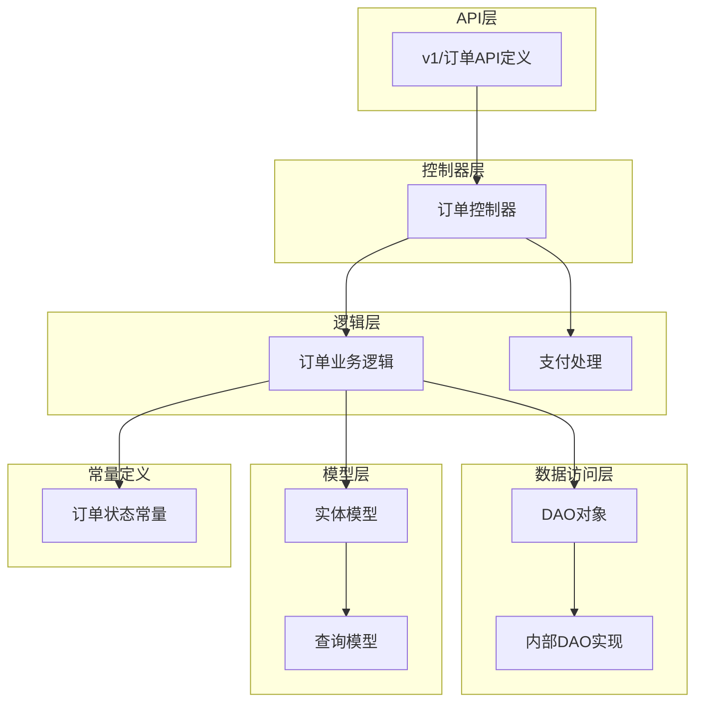
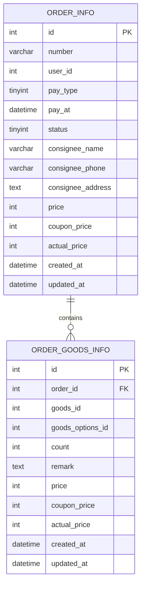
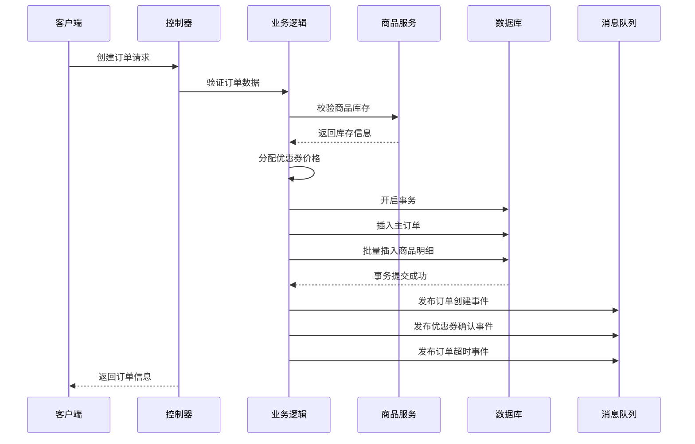
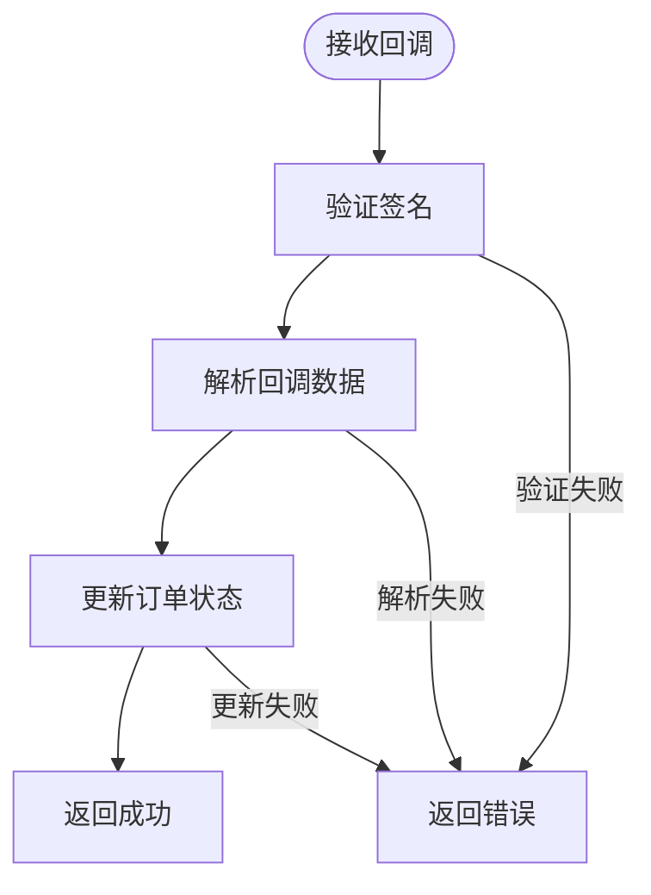
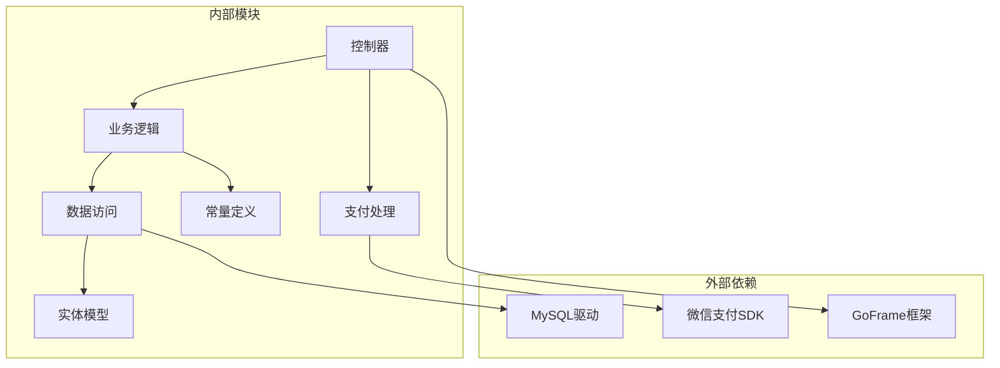
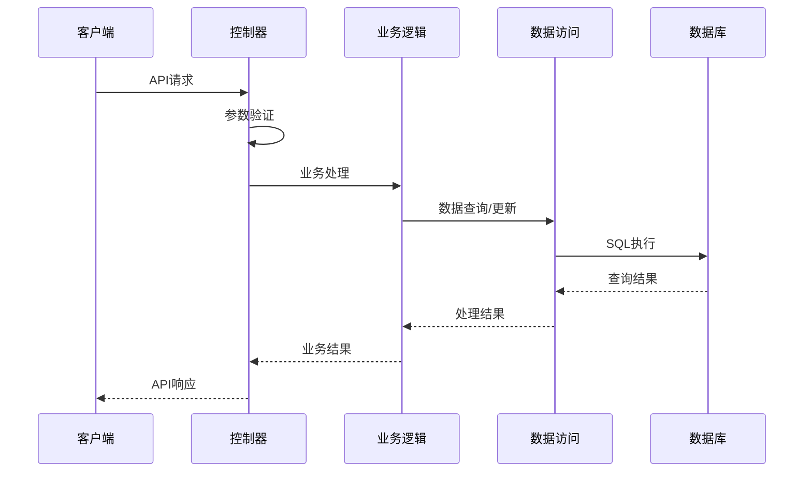

# 订单管理API

<cite>
**本文档引用的文件**
- [app/order/internal/controller/order_info/order_info.go](file://app/order/internal/controller/order_info/order_info.go)
- [app/order/internal/logic/order_info/order_info.go](file://app/order/internal/logic/order_info/order_info.go)
- [app/order/internal/consts/order_status.go](file://app/order/internal/consts/order_status.go)
- [app/order/internal/dao/order_info.go](file://app/order/internal/dao/order_info.go)
- [app/order/internal/dao/internal/order_info.go](file://app/order/internal/dao/internal/order_info.go)
- [app/order/internal/model/entity/order_info.go](file://app/order/internal/model/entity/order_info.go)
- [app/order/internal/model/do/order_info.go](file://app/order/internal/model/do/order_info.go)
- [app/order/internal/model/entity/order_goods_info.go](file://app/order/internal/model/entity/order_goods_info.go)
- [app/order/internal/dao/order_goods_info.go](file://app/order/internal/dao/order_goods_info.go)
- [app/order/internal/model/do/order_goods_info.go](file://app/order/internal/model/do/order_goods_info.go)
- [app/order/utility/payment/wxchat.go](file://app/order/utility/payment/wxchat.go)
- [app/order/api/order_info/v1/order_info.pb.go](file://app/order/api/order_info/v1/order_info.pb.go)
- [app/order/hack/order.sql](file://app/order/hack/order.sql)
</cite>

## 目录
1. [简介](#简介)
2. [项目结构](#项目结构)
3. [核心组件](#核心组件)
4. [架构概览](#架构概览)
5. [详细接口文档](#详细接口文档)
6. [依赖关系分析](#依赖关系分析)
7. [性能考虑](#性能考虑)
8. [故障排除指南](#故障排除指南)
9. [结论](#结论)

## 简介

订单管理API是电商微服务架构中的核心模块，负责处理订单生命周期的所有操作。该系统基于GoFrame框架构建，采用gRPC协议进行服务间通信，实现了完整的订单管理功能，包括订单创建、查询、状态管理和支付处理等。

系统采用分层架构设计，包含控制器层、逻辑层、数据访问层和实体模型层，确保了良好的代码组织和可维护性。订单状态管理支持完整的业务流程，从待支付到已完成的各个阶段，同时集成了微信支付和退款处理功能。

## 项目结构

订单管理模块采用标准的GoFrame微服务架构，主要包含以下层次：



**图表来源**
- [app/order/internal/controller/order_info/order_info.go](file://app/order/internal/controller/order_info/order_info.go#L20-L26)
- [app/order/internal/logic/order_info/order_info.go](file://app/order/internal/logic/order_info/order_info.go#L27-L212)
- [app/order/internal/consts/order_status.go](file://app/order/internal/consts/order_status.go#L6-L16)

**章节来源**
- [app/order/internal/controller/order_info/order_info.go](file://app/order/internal/controller/order_info/order_info.go#L1-L188)
- [app/order/internal/logic/order_info/order_info.go](file://app/order/internal/logic/order_info/order_info.go#L1-L502)

## 核心组件

### 订单状态管理

系统定义了完整的订单状态枚举，支持从创建到完成的整个业务流程：

| 状态值 | 状态名称 | 描述 |
|--------|----------|------|
| 1 | OrderStatusPendingPayment | 待支付 |
| 2 | OrderStatusPaid | 已支付待发货 |
| 3 | OrderStatusShipped | 已发货 |
| 4 | OrderStatusReceived | 已收货待评价 |
| 5 | OrderStatusCompleted | 已评价 |
| 6 | OrderStatusPendingConfirm | 待确认（使用优惠券） |
| 7 | OrderStatusCancelled | 已取消 |
| 8 | OrderStatusRefund | 发起退款 |

### 数据模型设计

订单系统采用双表设计，主订单表和订单商品明细表分离，支持复杂的订单业务场景：



**图表来源**
- [app/order/hack/order.sql](file://app/order/hack/order.sql#L35-L52)
- [app/order/hack/order.sql](file://app/order/hack/order.sql#L4-L18)

**章节来源**
- [app/order/internal/model/entity/order_info.go](file://app/order/internal/model/entity/order_info.go#L12-L29)
- [app/order/internal/model/entity/order_goods_info.go](file://app/order/internal/model/entity/order_goods_info.go#L12-L24)

## 架构概览

订单管理API采用微服务架构，通过gRPC实现服务间通信，整体架构如下：

```mermaid
graph TB
subgraph "客户端层"
H5App[H5应用]
AdminApp[管理后台]
end
subgraph "网关层"
GatewayH5[订单网关(H5)]
GatewayAdmin[订单网关(管理)]
end
subgraph "订单服务"
GRPCServer[gRPC服务器]
Controller[控制器]
Logic[业务逻辑]
DAO[数据访问]
end
subgraph "基础设施"
MySQL[(MySQL数据库)]
Redis[(Redis缓存)]
MQ[(消息队列)]
WeChat[微信支付]
end
H5App --> GatewayH5
AdminApp --> GatewayAdmin
GatewayH5 --> GRPCServer
GatewayAdmin --> GRPCServer
GRPCServer --> Controller
Controller --> Logic
Logic --> DAO
DAO --> MySQL
Logic --> MQ
Controller --> WeChat
MQ --> Logic
```

**图表来源**
- [app/order/internal/controller/order_info/order_info.go](file://app/order/internal/controller/order_info/order_info.go#L24-L26)
- [app/order/utility/payment/wxchat.go](file://app/order/utility/payment/wxchat.go#L84-L132)

## 详细接口文档

### 订单创建接口

#### 接口定义
- **方法**: Create
- **路径**: order_info/v1/OrderInfo/Create
- **描述**: 创建新订单，支持优惠券使用和库存校验

#### 请求参数
| 参数名 | 类型 | 必填 | 描述 |
|--------|------|------|------|
| price | uint32 | 是 | 订单总金额（分） |
| couponPrice | uint32 | 是 | 优惠券金额（分） |
| actualPrice | uint32 | 是 | 实际支付金额（分） |
| consigneePhone | string | 是 | 收货人手机号 |
| remark | string | 否 | 备注信息 |
| orderGoodsInfo | OrderGoodsItem[] | 是 | 订单商品列表 |
| userId | uint32 | 是 | 用户ID |
| couponId | uint32 | 否 | 优惠券ID |

#### 响应参数
| 参数名 | 类型 | 描述 |
|--------|------|------|
| id | uint32 | 订单ID |
| number | string | 订单编号 |

#### 业务流程


**图表来源**
- [app/order/internal/logic/order_info/order_info.go](file://app/order/internal/logic/order_info/order_info.go#L28-L212)
- [app/order/internal/controller/order_info/order_info.go](file://app/order/internal/controller/order_info/order_info.go#L28-L37)

**章节来源**
- [app/order/internal/controller/order_info/order_info.go](file://app/order/internal/controller/order_info/order_info.go#L28-L37)
- [app/order/internal/logic/order_info/order_info.go](file://app/order/internal/logic/order_info/order_info.go#L28-L212)

### 订单详情查询接口

#### 接口定义
- **方法**: GetDetail
- **路径**: order_info/v1/OrderInfo/GetDetail
- **描述**: 获取订单详细信息，包括主订单和商品明细

#### 请求参数
| 参数名 | 类型 | 必填 | 描述 |
|--------|------|------|------|
| id | uint32 | 是 | 订单ID |
| userId | uint32 | 是 | 用户ID |

#### 响应参数
| 参数名 | 类型 | 描述 |
|--------|------|------|
| orderInfo | OrderInfo | 订单基本信息 |
| orderGoodsInfos | OrderGoodsInfo[] | 订单商品列表 |

#### 权限控制
系统实现了严格的权限验证机制：
- 验证订单是否存在
- 校验订单归属用户
- 返回相应的错误码

**章节来源**
- [app/order/internal/controller/order_info/order_info.go](file://app/order/internal/controller/order_info/order_info.go#L39-L63)
- [app/order/internal/logic/order_info/order_info.go](file://app/order/internal/logic/order_info/order_info.go#L226-L271)

### 订单列表查询接口

#### 接口定义
- **方法**: GetList
- **路径**: order_info/v1/OrderInfo/GetList
- **描述**: 分页查询用户订单列表

#### 请求参数
| 参数名 | 类型 | 必填 | 描述 | 默认值 |
|--------|------|------|------|--------|
| userId | uint32 | 是 | 用户ID | - |
| page | uint32 | 否 | 页码 | 1 |
| size | uint32 | 否 | 每页数量 | 10 |
| status | uint32 | 否 | 订单状态 | 全部 |

#### 响应参数
| 参数名 | 类型 | 描述 |
|--------|------|------|
| data | OrderInfoListResponse | 分页响应数据 |

#### 分页规则
- 最小页码：1
- 最大每页数量：50
- 默认每页数量：10

**章节来源**
- [app/order/internal/controller/order_info/order_info.go](file://app/order/internal/controller/order_info/order_info.go#L66-L99)
- [app/order/internal/logic/order_info/order_info.go](file://app/order/internal/logic/order_info/order_info.go#L274-L336)

### 订单状态统计接口

#### 接口定义
- **方法**: GetCount
- **路径**: order_info/v1/OrderInfo/GetCount
- **描述**: 统计用户各状态订单数量

#### 请求参数
| 参数名 | 类型 | 必填 | 描述 |
|--------|------|------|------|
| userId | uint32 | 是 | 用户ID |

#### 响应参数
| 参数名 | 类型 | 描述 |
|--------|------|------|
| pending | uint32 | 待支付数量 |
| shipping | uint32 | 已支付待发货数量 |
| delivered | uint32 | 已发货数量 |
| completed | uint32 | 已完成数量 |

**章节来源**
- [app/order/internal/controller/order_info/order_info.go](file://app/order/internal/controller/order_info/order_info.go#L120-L128)
- [app/order/internal/logic/order_info/order_info.go](file://app/order/internal/logic/order_info/order_info.go#L417-L449)

### 订单取消接口

#### 接口定义
- **方法**: CancelOrder
- **路径**: order_info/v1/OrderInfo/CancelOrder
- **描述**: 取消未支付订单

#### 请求参数
| 参数名 | 类型 | 必填 | 描述 |
|--------|------|------|------|
| id | uint32 | 是 | 订单ID |
| userId | uint32 | 是 | 用户ID |

#### 响应参数
| 参数名 | 类型 | 描述 |
|--------|------|------|
| code | uint32 | 状态码 |
| message | string | 状态信息 |
| data | string | 返回数据 |

#### 取消规则
- 仅允许取消状态为"待支付"的订单
- 验证订单归属用户
- 更新订单状态为"已取消"

**章节来源**
- [app/order/internal/controller/order_info/order_info.go](file://app/order/internal/controller/order_info/order_info.go#L130-L187)

### 支付处理接口

#### 接口定义
- **方法**: Payment
- **路径**: order_info/v1/OrderInfo/Payment
- **描述**: 生成微信支付预支付信息

#### 请求参数
| 参数名 | 类型 | 必填 | 描述 |
|--------|------|------|------|
| openId | string | 是 | 用户微信标识 |
| amount | int64 | 是 | 支付金额（分） |
| number | string | 是 | 订单编号 |

#### 响应参数
| 参数名 | 类型 | 描述 |
|--------|------|------|
| timeStamp | string | 时间戳 |
| nonceStr | string | 随机字符串 |
| package | string | 预支付参数 |
| signType | string | 签名类型 |
| paySign | string | 支付签名 |
| outTradeNo | string | 商户订单号 |

**章节来源**
- [app/order/internal/controller/order_info/order_info.go](file://app/order/internal/controller/order_info/order_info.go#L101-L103)
- [app/order/utility/payment/wxchat.go](file://app/order/utility/payment/wxchat.go#L84-L132)

### 支付回调接口

#### 接口定义
- **方法**: Notify
- **路径**: order_info/v1/OrderInfo/Notify
- **描述**: 处理微信支付回调通知

#### 回调流程


**图表来源**
- [app/order/internal/controller/order_info/order_info.go](file://app/order/internal/controller/order_info/order_info.go#L105-L118)
- [app/order/utility/payment/wxchat.go](file://app/order/utility/payment/wxchat.go#L134-L171)

**章节来源**
- [app/order/internal/controller/order_info/order_info.go](file://app/order/internal/controller/order_info/order_info.go#L105-L118)
- [app/order/internal/logic/order_info/order_info.go](file://app/order/internal/logic/order_info/order_info.go#L360-L387)

## 依赖关系分析

### 组件依赖图



**图表来源**
- [app/order/internal/controller/order_info/order_info.go](file://app/order/internal/controller/order_info/order_info.go#L3-L18)
- [app/order/internal/logic/order_info/order_info.go](file://app/order/internal/logic/order_info/order_info.go#L3-L25)

### 数据流分析

订单管理系统中的数据流向呈现典型的分层架构特征：



**图表来源**
- [app/order/internal/controller/order_info/order_info.go](file://app/order/internal/controller/order_info/order_info.go#L24-L26)
- [app/order/internal/logic/order_info/order_info.go](file://app/order/internal/logic/order_info/order_info.go#L104-L174)

**章节来源**
- [app/order/internal/dao/internal/order_info.go](file://app/order/internal/dao/internal/order_info.go#L14-L110)

## 性能考虑

### 缓存策略
- 订单状态统计结果可以缓存，减少数据库查询压力
- 商品库存信息建议使用Redis缓存，提高库存校验效率

### 数据库优化
- 订单表建立适当的索引，特别是user_id和status字段
- 使用分页查询避免大量数据传输
- 批量插入订单商品明细提高性能

### 异步处理
- 订单创建后通过消息队列异步处理后续操作
- 支付回调采用异步处理，避免阻塞主线程

## 故障排除指南

### 常见错误码

| 错误码 | 描述 | 处理建议 |
|--------|------|----------|
| 1001 | 订单不存在 | 检查订单ID是否正确 |
| 1002 | 订单状态不允许取消 | 确认订单状态为待支付 |
| 1003 | 用户无权限操作 | 验证用户身份和订单归属 |
| 1004 | 系统错误，取消失败 | 检查数据库连接和事务处理 |

### 日志记录
系统在关键节点进行了详细的日志记录，便于问题排查：
- 订单创建失败：记录事务回滚信息
- 支付回调处理：记录回调数据和处理结果
- 库存校验：记录商品库存状态

**章节来源**
- [app/order/internal/controller/order_info/order_info.go](file://app/order/internal/controller/order_info/order_info.go#L130-L187)

## 结论

订单管理API提供了完整的订单生命周期管理功能，具有以下特点：

1. **完整的业务覆盖**：从订单创建到完成的全流程支持
2. **严格的状态管理**：清晰的订单状态流转和约束
3. **安全的权限控制**：完善的用户权限验证机制
4. **可靠的支付集成**：完整的微信支付和退款处理
5. **良好的扩展性**：模块化设计便于功能扩展

该系统采用微服务架构，具备良好的可维护性和可扩展性，能够满足电商系统的复杂业务需求。通过合理的错误处理和日志记录，确保了系统的稳定运行。