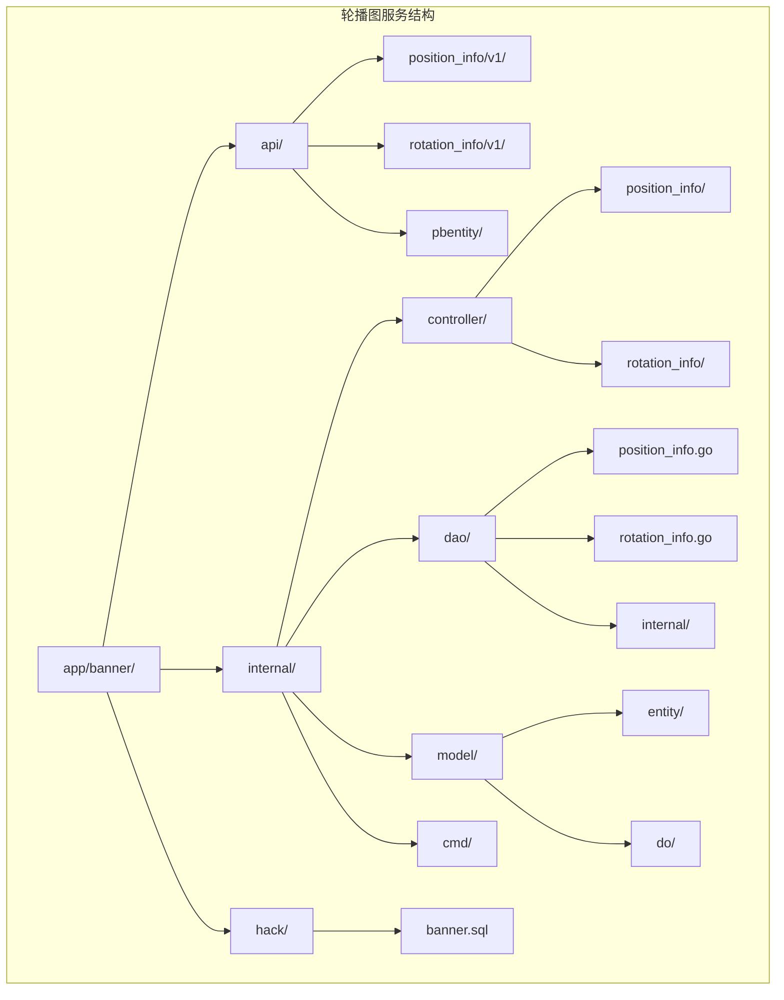
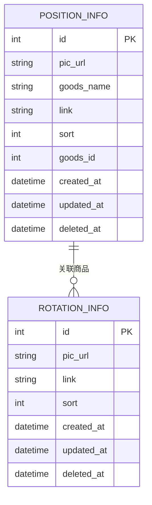
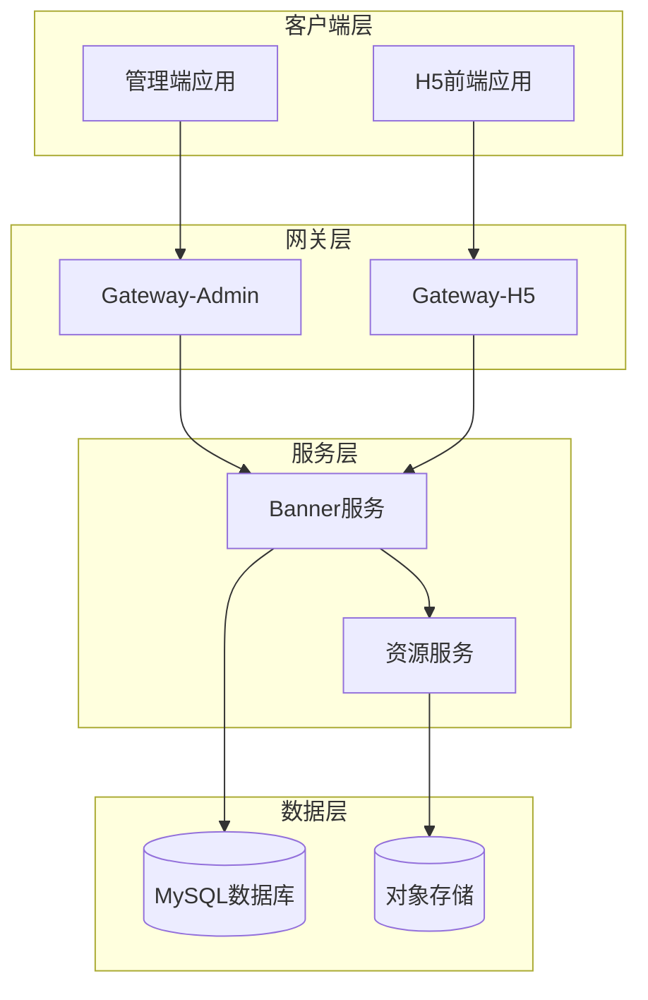
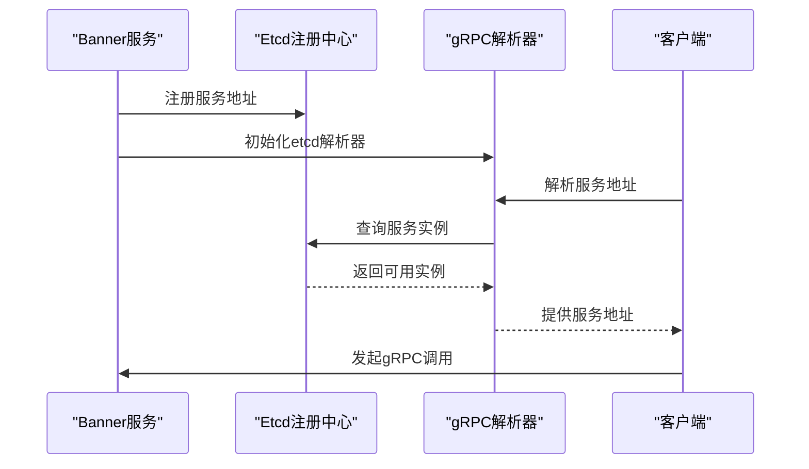
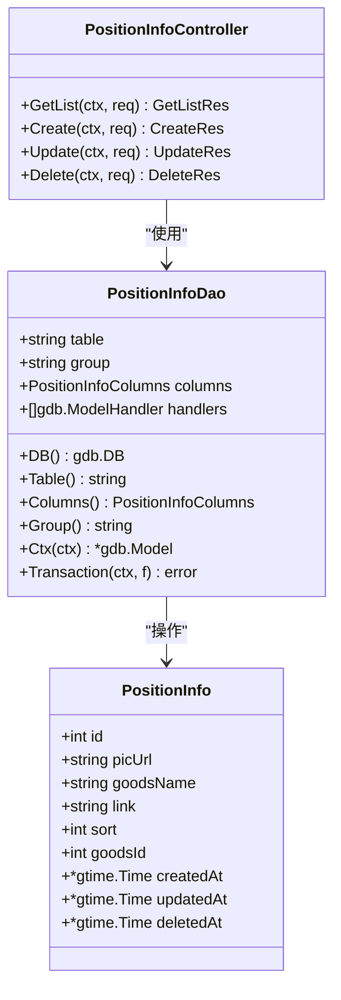
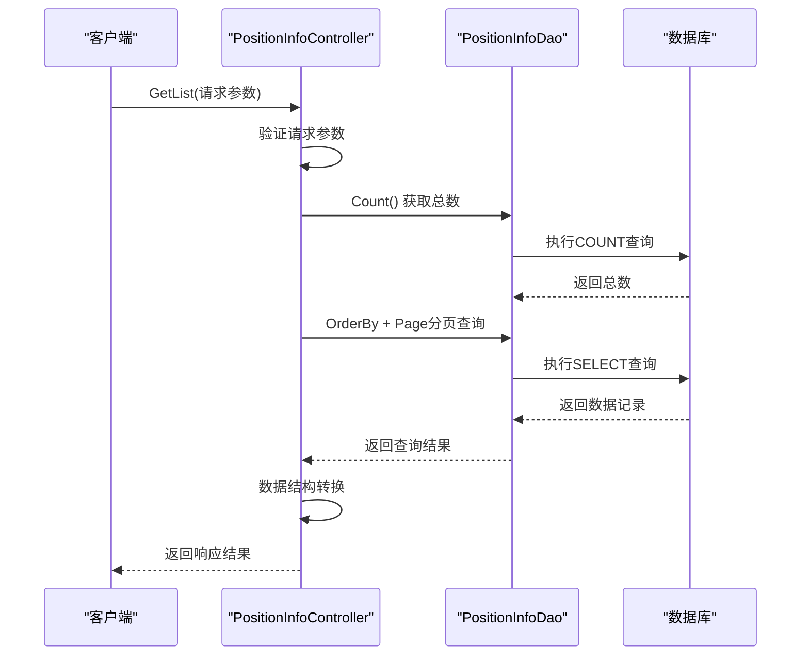
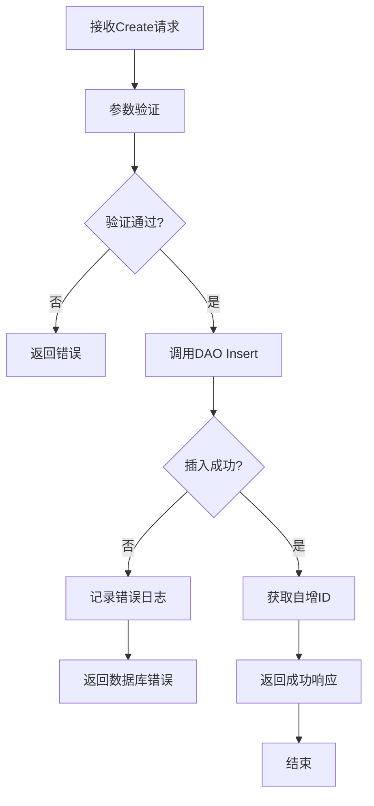
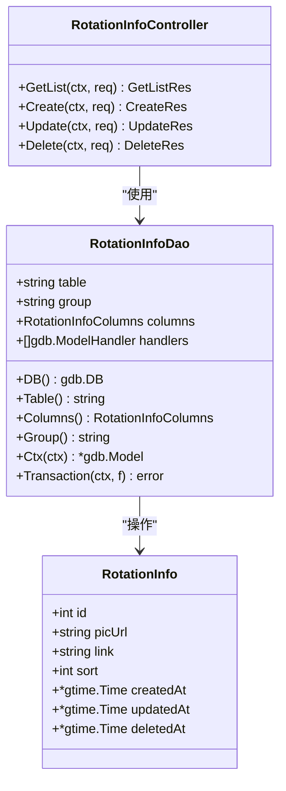
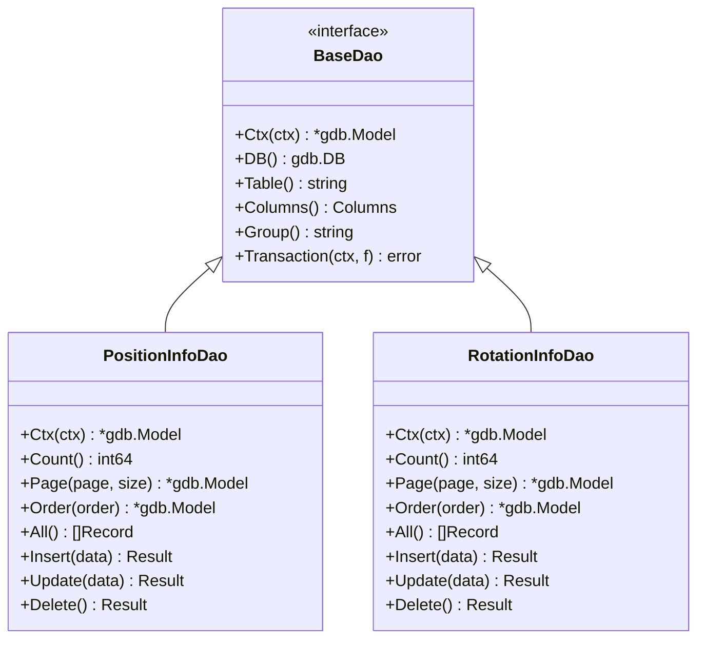
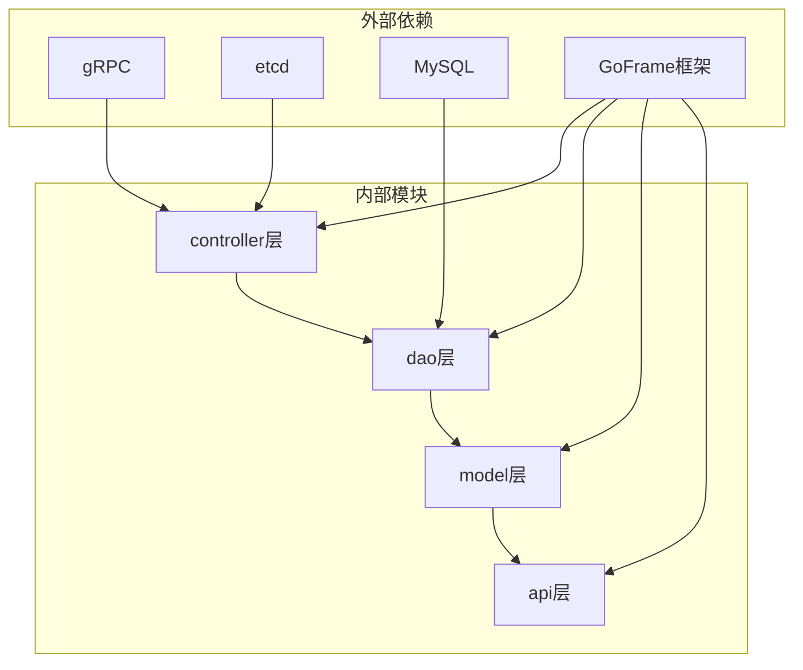

# 轮播图管理API

<cite>
**本文档引用的文件**
- [app/banner/main.go](file://app/banner/main.go)
- [app/banner/hack/banner.sql](file://app/banner/hack/banner.sql)
- [app/banner/internal/controller/position_info/position_info.go](file://app/banner/internal/controller/position_info/position_info.go)
- [app/banner/internal/controller/rotation_info/rotation_info.go](file://app/banner/internal/controller/rotation_info/rotation_info.go)
- [app/banner/internal/dao/position_info.go](file://app/banner/internal/dao/position_info.go)
- [app/banner/internal/dao/rotation_info.go](file://app/banner/internal/dao/rotation_info.go)
- [app/banner/internal/dao/internal/position_info.go](file://app/banner/internal/dao/internal/position_info.go)
- [app/banner/internal/dao/internal/rotation_info.go](file://app/banner/internal/dao/internal/rotation_info.go)
- [app/banner/internal/model/entity/position_info.go](file://app/banner/internal/model/entity/position_info.go)
- [app/banner/internal/model/entity/rotation_info.go](file://app/banner/internal/model/entity/rotation_info.go)
</cite>

## 目录
1. [简介](#简介)
2. [项目结构](#项目结构)
3. [核心组件](#核心组件)
4. [架构概览](#架构概览)
5. [详细组件分析](#详细组件分析)
6. [依赖关系分析](#依赖关系分析)
7. [性能考虑](#性能考虑)
8. [故障排除指南](#故障排除指南)
9. [结论](#结论)

## 简介

轮播图管理系统是一个基于GoFrame微服务框架构建的分布式轮播图管理服务。该系统提供了完整的轮播图位置管理和轮播图内容管理功能，包括轮播图位置配置、轮播图创建编辑、图片管理等操作。

系统采用gRPC作为服务间通信协议，支持轮播图位置设置、轮播图内容上传、显示顺序调整、有效期管理等核心功能。通过分层架构设计，实现了业务逻辑与数据访问的清晰分离，提供了高可用、高性能的轮播图管理解决方案。

## 项目结构

轮播图服务采用标准的GoFrame微服务项目结构，主要包含以下核心目录：

**图表来源**
- [app/banner/main.go](file://app/banner/main.go#L1-L25)
- [app/banner/internal/controller/position_info/position_info.go](file://app/banner/internal/controller/position_info/position_info.go#L1-L123)
- [app/banner/internal/controller/rotation_info/rotation_info.go](file://app/banner/internal/controller/rotation_info/rotation_info.go#L1-L122)

**章节来源**
- [app/banner/main.go](file://app/banner/main.go#L1-L25)
- [app/banner/hack/banner.sql](file://app/banner/hack/banner.sql#L1-L44)

## 核心组件

轮播图管理系统由两个核心子系统组成：轮播图位置管理子系统和轮播图内容管理子系统。

### 数据模型设计

系统采用两个主要数据表来存储轮播图相关信息：

**图表来源**
- [app/banner/hack/banner.sql](file://app/banner/hack/banner.sql#L4-L16)
- [app/banner/hack/banner.sql](file://app/banner/hack/banner.sql#L24-L38)

### 控制器架构

每个子系统都实现了标准的gRPC控制器模式，包含以下核心方法：

- **GetList**: 获取列表数据（支持分页和排序）
- **Create**: 创建新记录
- **Update**: 更新现有记录
- **Delete**: 删除记录

**章节来源**
- [app/banner/internal/controller/position_info/position_info.go](file://app/banner/internal/controller/position_info/position_info.go#L27-L122)
- [app/banner/internal/controller/rotation_info/rotation_info.go](file://app/banner/internal/controller/rotation_info/rotation_info.go#L27-L122)

## 架构概览

轮播图服务采用分层架构设计，确保了良好的可维护性和扩展性：

**图表来源**
- [app/banner/main.go](file://app/banner/main.go#L13-L24)
- [app/banner/internal/controller/position_info/position_info.go](file://app/banner/internal/controller/position_info/position_info.go#L23-L25)

### 服务注册机制

系统通过etcd实现服务发现和注册，使用gRPCx库进行服务解析：

**图表来源**
- [app/banner/main.go](file://app/banner/main.go#L15-L23)

## 详细组件分析

### 轮播图位置管理子系统

轮播图位置管理子系统负责管理轮播图在页面中的具体位置信息，包括商品关联、图片展示等。

#### 数据实体结构

**图表来源**
- [app/banner/internal/model/entity/position_info.go](file://app/banner/internal/model/entity/position_info.go#L11-L22)
- [app/banner/internal/dao/internal/position_info.go](file://app/banner/internal/dao/internal/position_info.go#L14-L96)
- [app/banner/internal/controller/position_info/position_info.go](file://app/banner/internal/controller/position_info/position_info.go#L19-L25)

#### 核心业务流程

##### 列表获取流程

**图表来源**
- [app/banner/internal/controller/position_info/position_info.go](file://app/banner/internal/controller/position_info/position_info.go#L27-L79)

##### 数据创建流程

**图表来源**
- [app/banner/internal/controller/position_info/position_info.go](file://app/banner/internal/controller/position_info/position_info.go#L82-L94)

**章节来源**
- [app/banner/internal/model/entity/position_info.go](file://app/banner/internal/model/entity/position_info.go#L11-L22)
- [app/banner/internal/dao/internal/position_info.go](file://app/banner/internal/dao/internal/position_info.go#L14-L96)
- [app/banner/internal/controller/position_info/position_info.go](file://app/banner/internal/controller/position_info/position_info.go#L27-L122)

### 轮播图内容管理子系统

轮播图内容管理子系统专注于轮播图的图片内容管理，提供灵活的内容展示和管理功能。

#### 数据实体结构

**图表来源**
- [app/banner/internal/model/entity/rotation_info.go](file://app/banner/internal/model/entity/rotation_info.go#L11-L21)
- [app/banner/internal/dao/internal/rotation_info.go](file://app/banner/internal/dao/internal/rotation_info.go#L14-L92)
- [app/banner/internal/controller/rotation_info/rotation_info.go](file://app/banner/internal/controller/rotation_info/rotation_info.go#L19-L25)

#### 排序机制实现

系统支持灵活的排序机制，通过sort字段控制显示顺序：

| 排序类型 | sort值 | 显示顺序 |
|---------|--------|----------|
| 正常排序 | 数值越小越靠前 | 从上到下递增排列 |
| 倒序排列 | 通过参数控制 | 从下到上递减排列 |
| 默认排序 | 0值或未设置 | 按创建时间排序 |

**章节来源**
- [app/banner/internal/model/entity/rotation_info.go](file://app/banner/internal/model/entity/rotation_info.go#L11-L21)
- [app/banner/internal/dao/internal/rotation_info.go](file://app/banner/internal/dao/internal/rotation_info.go#L14-L92)
- [app/banner/internal/controller/rotation_info/rotation_info.go](file://app/banner/internal/controller/rotation_info/rotation_info.go#L27-L122)

### 数据访问层设计

数据访问层采用DAO模式，提供了统一的数据操作接口：

**图表来源**
- [app/banner/internal/dao/internal/position_info.go](file://app/banner/internal/dao/internal/position_info.go#L14-L96)
- [app/banner/internal/dao/internal/rotation_info.go](file://app/banner/internal/dao/internal/rotation_info.go#L14-L92)

**章节来源**
- [app/banner/internal/dao/position_info.go](file://app/banner/internal/dao/position_info.go#L11-L23)
- [app/banner/internal/dao/rotation_info.go](file://app/banner/internal/dao/rotation_info.go#L11-L23)

## 依赖关系分析

轮播图服务的依赖关系体现了清晰的分层架构：

**图表来源**
- [app/banner/main.go](file://app/banner/main.go#L3-L11)
- [app/banner/internal/controller/position_info/position_info.go](file://app/banner/internal/controller/position_info/position_info.go#L3-L17)

### 关键依赖特性

1. **服务发现**: 通过etcd实现动态服务发现
2. **数据库访问**: 基于GoFrame的gdb模块
3. **序列化**: 使用protobuf进行数据序列化
4. **错误处理**: 统一的错误码和错误信息格式

**章节来源**
- [app/banner/main.go](file://app/banner/main.go#L1-L25)

## 性能考虑

### 数据库优化策略

1. **索引设计**: 在sort字段上建立索引以优化排序查询
2. **分页查询**: 实现高效的分页机制，避免全表扫描
3. **连接池**: 合理配置数据库连接池大小
4. **事务管理**: 使用事务确保数据一致性

### 缓存策略

虽然当前实现未包含缓存层，但建议在生产环境中添加：

1. **热点数据缓存**: 缓存常用的轮播图配置
2. **查询结果缓存**: 缓存列表查询结果
3. **TTL管理**: 设置合理的缓存过期时间

### 并发处理

系统采用goroutine并发处理请求，需要注意：

1. **数据库连接安全**: 确保数据库操作的线程安全
2. **资源竞争**: 避免竞态条件的发生
3. **错误传播**: 正确处理并发场景下的错误

## 故障排除指南

### 常见错误类型

| 错误类型 | 错误码 | 描述 | 处理建议 |
|---------|--------|------|----------|
| 数据库操作错误 | 50001 | 数据库查询失败 | 检查数据库连接和SQL语句 |
| 参数验证错误 | 40001 | 请求参数不合法 | 验证输入参数的有效性 |
| 业务逻辑错误 | 40002 | 业务规则违反 | 检查业务逻辑实现 |
| 服务不可用 | 50002 | 服务注册失败 | 检查etcd服务状态 |

### 调试技巧

1. **日志分析**: 利用g.Log()输出详细的错误日志
2. **参数检查**: 在关键节点打印请求和响应参数
3. **数据库监控**: 监控SQL执行时间和慢查询
4. **服务健康检查**: 定期检查服务的可用性

**章节来源**
- [app/banner/internal/controller/position_info/position_info.go](file://app/banner/internal/controller/position_info/position_info.go#L42-L44)
- [app/banner/internal/controller/rotation_info/rotation_info.go](file://app/banner/internal/controller/rotation_info/rotation_info.go#L42-L44)

## 结论

轮播图管理系统通过清晰的分层架构和标准化的gRPC接口，为微服务架构下的轮播图管理提供了完整的解决方案。系统具有以下优势：

1. **模块化设计**: 轮播图位置和内容管理分离，职责明确
2. **标准化接口**: 基于protobuf的gRPC接口，便于客户端集成
3. **可扩展性**: 支持服务发现和动态扩展
4. **数据一致性**: 通过事务保证数据操作的原子性
5. **错误处理**: 统一的错误码和错误信息格式

未来可以考虑的功能增强包括：缓存层集成、监控告警完善、配置热更新、多租户支持等。这些改进将进一步提升系统的可用性和可维护性。