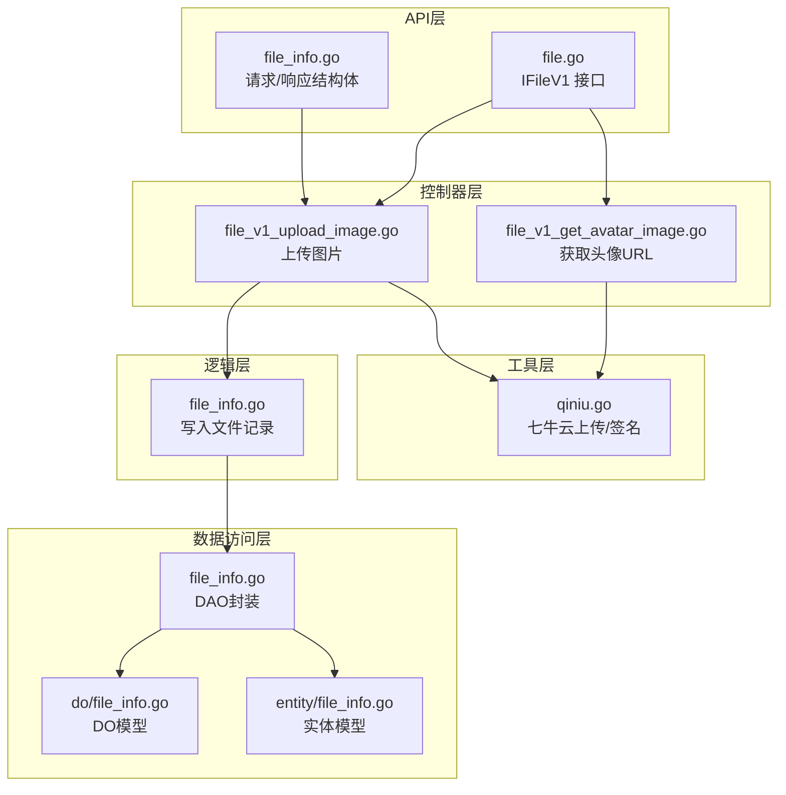
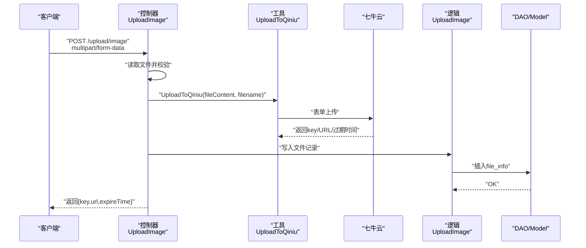
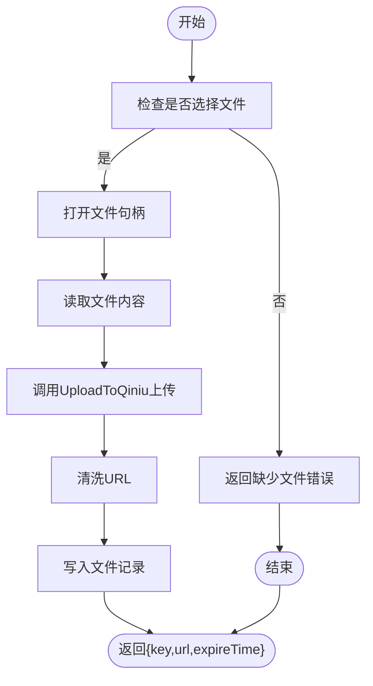
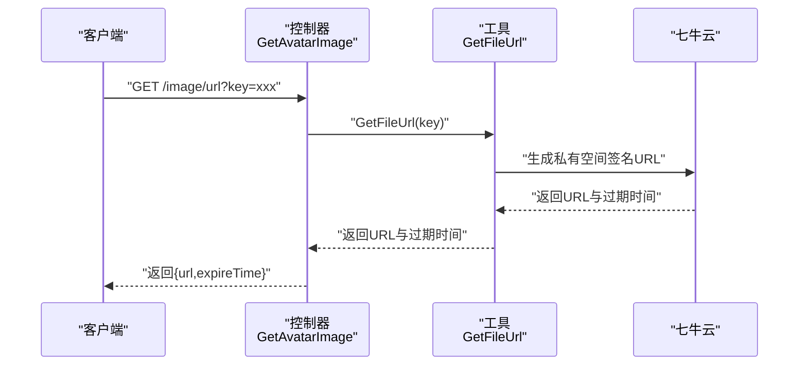
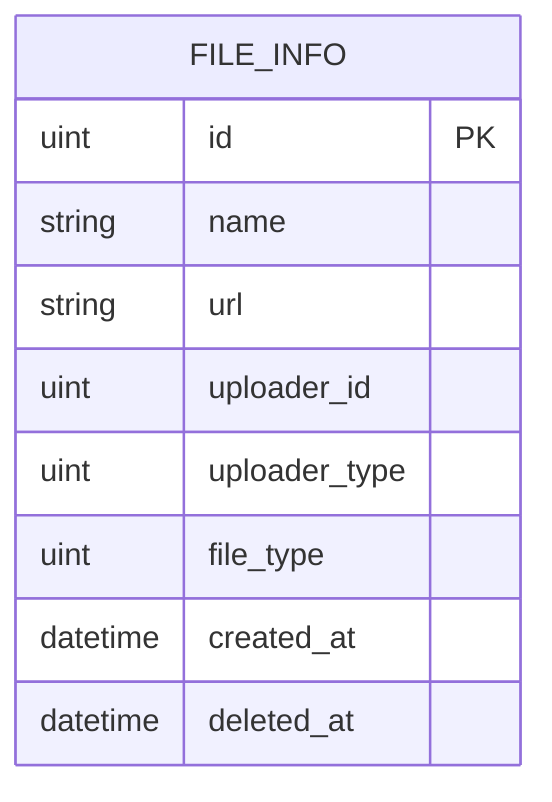
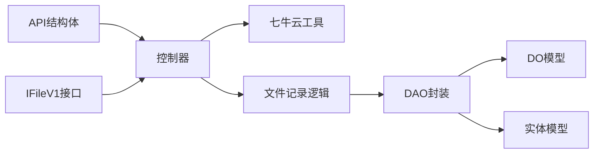

# 资源网关API

<cite>
**本文引用的文件**
- [app/gateway-resource/api/file/v1/file_info.go](file://app/gateway-resource/api/file/v1/file_info.go)
- [app/gateway-resource/api/file/file.go](file://app/gateway-resource/api/file/file.go)
- [app/gateway-resource/internal/controller/file/file_v1_upload_image.go](file://app/gateway-resource/internal/controller/file/file_v1_upload_image.go)
- [app/gateway-resource/internal/controller/file/file_v1_get_avatar_image.go](file://app/gateway-resource/internal/controller/file/file_v1_get_avatar_image.go)
- [app/gateway-resource/utility/qiniu.go](file://app/gateway-resource/utility/qiniu.go)
- [app/gateway-resource/internal/logic/file_info/file_info.go](file://app/gateway-resource/internal/logic/file_info/file_info.go)
- [app/gateway-resource/internal/dao/file_info.go](file://app/gateway-resource/internal/dao/file_info.go)
- [app/gateway-resource/internal/model/do/file_info.go](file://app/gateway-resource/internal/model/do/file_info.go)
- [app/gateway-resource/internal/model/entity/file_info.go](file://app/gateway-resource/internal/model/entity/file_info.go)
- [app/gateway-resource/main.go](file://app/gateway-resource/main.go)
- [app/gateway-resource/manifest/config/config.prod.yaml](file://app/gateway-resource/manifest/config/config.prod.yaml)
</cite>

## 目录
1. [简介](#简介)
2. [项目结构](#项目结构)
3. [核心组件](#核心组件)
4. [架构总览](#架构总览)
5. [详细组件分析](#详细组件分析)
6. [依赖分析](#依赖分析)
7. [性能考虑](#性能考虑)
8. [故障排查指南](#故障排查指南)
9. [结论](#结论)
10. [附录](#附录)

## 简介
本文件为“资源网关”服务的API接口文档，聚焦于文件上传与资源访问能力，覆盖图片上传、头像访问、文件存储与访问URL生成等场景。文档提供HTTP方法、URL路径、请求格式（Multipart Form Data）、响应格式、错误处理策略，并给出文件大小限制、格式校验、存储路径与访问URL生成规则，以及安全策略与访问控制说明。

## 项目结构
资源网关位于 app/gateway-resource，采用GoFrame框架与分层架构组织：
- API定义层：在 api/file/v1 定义请求/响应结构体与接口契约
- 控制器层：在 internal/controller/file 实现具体业务逻辑
- 工具层：在 utility 提供七牛云上传与URL签名工具
- 逻辑层：在 internal/logic/file_info 封装文件记录写入
- 数据访问层：在 internal/dao 与 internal/model/do、internal/model/entity 提供数据库操作模型

图表来源
- [app/gateway-resource/api/file/v1/file_info.go](file://app/gateway-resource/api/file/v1/file_info.go#L1-L31)
- [app/gateway-resource/api/file/file.go](file://app/gateway-resource/api/file/file.go#L1-L17)
- [app/gateway-resource/internal/controller/file/file_v1_upload_image.go](file://app/gateway-resource/internal/controller/file/file_v1_upload_image.go#L1-L72)
- [app/gateway-resource/internal/controller/file/file_v1_get_avatar_image.go](file://app/gateway-resource/internal/controller/file/file_v1_get_avatar_image.go#L1-L23)
- [app/gateway-resource/utility/qiniu.go](file://app/gateway-resource/utility/qiniu.go#L1-L141)
- [app/gateway-resource/internal/logic/file_info/file_info.go](file://app/gateway-resource/internal/logic/file_info/file_info.go#L1-L26)
- [app/gateway-resource/internal/dao/file_info.go](file://app/gateway-resource/internal/dao/file_info.go#L1-L23)
- [app/gateway-resource/internal/model/do/file_info.go](file://app/gateway-resource/internal/model/do/file_info.go#L1-L24)
- [app/gateway-resource/internal/model/entity/file_info.go](file://app/gateway-resource/internal/model/entity/file_info.go#L1-L22)

章节来源
- [app/gateway-resource/api/file/v1/file_info.go](file://app/gateway-resource/api/file/v1/file_info.go#L1-L31)
- [app/gateway-resource/api/file/file.go](file://app/gateway-resource/api/file/file.go#L1-L17)
- [app/gateway-resource/internal/controller/file/file_v1_upload_image.go](file://app/gateway-resource/internal/controller/file/file_v1_upload_image.go#L1-L72)
- [app/gateway-resource/internal/controller/file/file_v1_get_avatar_image.go](file://app/gateway-resource/internal/controller/file/file_v1_get_avatar_image.go#L1-L23)
- [app/gateway-resource/utility/qiniu.go](file://app/gateway-resource/utility/qiniu.go#L1-L141)
- [app/gateway-resource/internal/logic/file_info/file_info.go](file://app/gateway-resource/internal/logic/file_info/file_info.go#L1-L26)
- [app/gateway-resource/internal/dao/file_info.go](file://app/gateway-resource/internal/dao/file_info.go#L1-L23)
- [app/gateway-resource/internal/model/do/file_info.go](file://app/gateway-resource/internal/model/do/file_info.go#L1-L24)
- [app/gateway-resource/internal/model/entity/file_info.go](file://app/gateway-resource/internal/model/entity/file_info.go#L1-L22)

## 核心组件
- 文件上传接口
  - 方法：POST
  - 路径：/upload/image
  - 请求格式：Multipart Form Data
  - 必填字段：
    - file：上传的文件（二进制）
    - uploader_id：上传者ID（根据uploader_type区分用户ID或管理员ID）
    - uploader_type：上传者类型（1-H5用户，2-管理员）
    - file_type：文件类型（1-图片，2-视频，3-其他）
  - 响应字段：
    - key：唯一文件名（用于后续访问）
    - url：带签名的访问URL
    - expireTime：过期时间（秒）

- 获取头像URL接口
  - 方法：GET
  - 路径：/image/url
  - 查询参数：
    - key：文件唯一标识（由上传接口返回）
  - 响应字段：
    - url：带签名的访问URL
    - expireTime：过期时间（秒）

章节来源
- [app/gateway-resource/api/file/v1/file_info.go](file://app/gateway-resource/api/file/v1/file_info.go#L8-L30)
- [app/gateway-resource/api/file/file.go](file://app/gateway-resource/api/file/file.go#L13-L16)

## 架构总览
资源网关通过HTTP服务对外提供API，内部调用七牛云SDK完成文件上传与私有空间URL签名，随后将文件元信息写入MySQL数据库。

图表来源
- [app/gateway-resource/internal/controller/file/file_v1_upload_image.go](file://app/gateway-resource/internal/controller/file/file_v1_upload_image.go#L20-L71)
- [app/gateway-resource/utility/qiniu.go](file://app/gateway-resource/utility/qiniu.go#L18-L79)
- [app/gateway-resource/internal/logic/file_info/file_info.go](file://app/gateway-resource/internal/logic/file_info/file_info.go#L11-L25)
- [app/gateway-resource/internal/dao/file_info.go](file://app/gateway-resource/internal/dao/file_info.go#L13-L20)
- [app/gateway-resource/internal/model/do/file_info.go](file://app/gateway-resource/internal/model/do/file_info.go#L12-L23)

## 详细组件分析

### 文件上传组件（上传图片）
- 功能概述
  - 接收客户端上传的文件，进行基础校验
  - 将文件内容上传至七牛云，生成带签名的访问URL与唯一文件名
  - 写入文件元信息到数据库
  - 返回key、url与expireTime

- 请求与响应
  - 请求方法：POST
  - 路径：/upload/image
  - 请求格式：Multipart Form Data
  - 请求字段：
    - file：必填，上传文件
    - uploader_id：必填，上传者ID
    - uploader_type：必填，上传者类型
    - file_type：必填，文件类型
  - 响应字段：
    - key：唯一文件名
    - url：带签名的访问URL
    - expireTime：过期时间（秒）

- 处理流程
  - 读取上传文件并打开
  - 读取文件字节流
  - 调用七牛云上传工具生成URL与key
  - 清洗URL（去除换行与空白）
  - 将请求参数转换为实体并写入数据库
  - 返回结果

图表来源
- [app/gateway-resource/internal/controller/file/file_v1_upload_image.go](file://app/gateway-resource/internal/controller/file/file_v1_upload_image.go#L20-L71)
- [app/gateway-resource/utility/qiniu.go](file://app/gateway-resource/utility/qiniu.go#L18-L79)
- [app/gateway-resource/internal/logic/file_info/file_info.go](file://app/gateway-resource/internal/logic/file_info/file_info.go#L11-L25)

章节来源
- [app/gateway-resource/api/file/v1/file_info.go](file://app/gateway-resource/api/file/v1/file_info.go#L8-L20)
- [app/gateway-resource/internal/controller/file/file_v1_upload_image.go](file://app/gateway-resource/internal/controller/file/file_v1_upload_image.go#L20-L71)
- [app/gateway-resource/utility/qiniu.go](file://app/gateway-resource/utility/qiniu.go#L18-L79)
- [app/gateway-resource/internal/logic/file_info/file_info.go](file://app/gateway-resource/internal/logic/file_info/file_info.go#L11-L25)

### 获取头像URL组件（获取文件URL）
- 功能概述
  - 根据唯一文件名key生成带签名的访问URL与过期时间
  - 适用于头像或其他私有空间文件的临时访问

- 请求与响应
  - 请求方法：GET
  - 路径：/image/url
  - 查询参数：
    - key：必填，文件唯一标识
  - 响应字段：
    - url：带签名的访问URL
    - expireTime：过期时间（秒）

- 处理流程
  - 读取配置中的七牛云参数
  - 调用GetFileUrl生成签名URL与过期时间
  - 返回结果

图表来源
- [app/gateway-resource/internal/controller/file/file_v1_get_avatar_image.go](file://app/gateway-resource/internal/controller/file/file_v1_get_avatar_image.go#L13-L22)
- [app/gateway-resource/utility/qiniu.go](file://app/gateway-resource/utility/qiniu.go#L81-L101)

章节来源
- [app/gateway-resource/api/file/v1/file_info.go](file://app/gateway-resource/api/file/v1/file_info.go#L22-L30)
- [app/gateway-resource/internal/controller/file/file_v1_get_avatar_image.go](file://app/gateway-resource/internal/controller/file/file_v1_get_avatar_image.go#L13-L22)
- [app/gateway-resource/utility/qiniu.go](file://app/gateway-resource/utility/qiniu.go#L81-L101)

### 数据模型与存储
- 表结构：file_info
  - 字段概览（部分）：
    - id：文件ID
    - name：文件名
    - url：七牛云URL
    - uploader_id：上传者ID
    - uploader_type：上传者类型
    - file_type：文件类型
    - created_at：创建时间
    - deleted_at：删除时间

- 写入流程
  - 控制器将请求参数转换为实体
  - 逻辑层构造DO对象并插入数据库
  - DAO封装底层操作

图表来源
- [app/gateway-resource/internal/model/entity/file_info.go](file://app/gateway-resource/internal/model/entity/file_info.go#L11-L21)
- [app/gateway-resource/internal/model/do/file_info.go](file://app/gateway-resource/internal/model/do/file_info.go#L12-L23)
- [app/gateway-resource/internal/logic/file_info/file_info.go](file://app/gateway-resource/internal/logic/file_info/file_info.go#L11-L25)

章节来源
- [app/gateway-resource/internal/model/entity/file_info.go](file://app/gateway-resource/internal/model/entity/file_info.go#L11-L21)
- [app/gateway-resource/internal/model/do/file_info.go](file://app/gateway-resource/internal/model/do/file_info.go#L12-L23)
- [app/gateway-resource/internal/logic/file_info/file_info.go](file://app/gateway-resource/internal/logic/file_info/file_info.go#L11-L25)
- [app/gateway-resource/internal/dao/file_info.go](file://app/gateway-resource/internal/dao/file_info.go#L13-L20)

### 七牛云工具与安全策略
- 上传与签名
  - 使用七牛云SDK生成上传Token与私有空间签名URL
  - 支持指定区域（华南区）、HTTPS与CDN加速
  - 生成唯一文件名，保留原文件名并添加时间戳与随机数，清理非法字符

- 访问控制
  - 采用私有空间签名URL，设置过期时间（默认一周）
  - 仅在有效期内可访问，降低泄露风险

- 存储路径与访问URL
  - 上传后返回的key即为文件在存储桶中的对象名
  - 访问URL基于domain与key拼接并签名，带expireTime有效期

章节来源
- [app/gateway-resource/utility/qiniu.go](file://app/gateway-resource/utility/qiniu.go#L18-L101)
- [app/gateway-resource/manifest/config/config.prod.yaml](file://app/gateway-resource/manifest/config/config.prod.yaml#L24-L29)

## 依赖分析
- 组件耦合
  - 控制器依赖工具层（上传/签名）、逻辑层（写库）、API层（请求/响应结构体）
  - 逻辑层依赖DAO与模型层
  - 工具层依赖七牛云SDK与配置中心

图表来源
- [app/gateway-resource/api/file/file.go](file://app/gateway-resource/api/file/file.go#L13-L16)
- [app/gateway-resource/api/file/v1/file_info.go](file://app/gateway-resource/api/file/v1/file_info.go#L1-L31)
- [app/gateway-resource/internal/controller/file/file_v1_upload_image.go](file://app/gateway-resource/internal/controller/file/file_v1_upload_image.go#L1-L72)
- [app/gateway-resource/internal/controller/file/file_v1_get_avatar_image.go](file://app/gateway-resource/internal/controller/file/file_v1_get_avatar_image.go#L1-L23)
- [app/gateway-resource/utility/qiniu.go](file://app/gateway-resource/utility/qiniu.go#L1-L141)
- [app/gateway-resource/internal/logic/file_info/file_info.go](file://app/gateway-resource/internal/logic/file_info/file_info.go#L1-L26)
- [app/gateway-resource/internal/dao/file_info.go](file://app/gateway-resource/internal/dao/file_info.go#L1-L23)
- [app/gateway-resource/internal/model/do/file_info.go](file://app/gateway-resource/internal/model/do/file_info.go#L1-L24)
- [app/gateway-resource/internal/model/entity/file_info.go](file://app/gateway-resource/internal/model/entity/file_info.go#L1-L22)

章节来源
- [app/gateway-resource/api/file/file.go](file://app/gateway-resource/api/file/file.go#L13-L16)
- [app/gateway-resource/api/file/v1/file_info.go](file://app/gateway-resource/api/file/v1/file_info.go#L1-L31)
- [app/gateway-resource/internal/controller/file/file_v1_upload_image.go](file://app/gateway-resource/internal/controller/file/file_v1_upload_image.go#L1-L72)
- [app/gateway-resource/internal/controller/file/file_v1_get_avatar_image.go](file://app/gateway-resource/internal/controller/file/file_v1_get_avatar_image.go#L1-L23)
- [app/gateway-resource/utility/qiniu.go](file://app/gateway-resource/utility/qiniu.go#L1-L141)
- [app/gateway-resource/internal/logic/file_info/file_info.go](file://app/gateway-resource/internal/logic/file_info/file_info.go#L1-L26)
- [app/gateway-resource/internal/dao/file_info.go](file://app/gateway-resource/internal/dao/file_info.go#L1-L23)
- [app/gateway-resource/internal/model/do/file_info.go](file://app/gateway-resource/internal/model/do/file_info.go#L1-L24)
- [app/gateway-resource/internal/model/entity/file_info.go](file://app/gateway-resource/internal/model/entity/file_info.go#L1-L22)

## 性能考虑
- 上传性能
  - 文件读取采用一次性读取到内存，适合中小文件；大文件建议改用流式上传或分片上传以降低内存占用
  - 七牛云上传使用表单直传，支持CDN加速与HTTPS
- 并发与稳定性
  - 控制器层未显式做并发限制，建议在网关层或业务层增加限速与熔断策略
- 存储与索引
  - 建议对file_type、uploader_type、uploader_id建立索引以提升查询效率

## 故障排查指南
- 常见错误与定位
  - 缺少上传文件：控制器会返回参数缺失错误
  - 打开/读取文件失败：检查文件权限与磁盘空间
  - 七牛云配置缺失：检查配置中心中qiniu节点是否存在且完整
  - 上传失败：检查网络连通性与AccessKey/SecretKey
  - 写库失败：检查数据库连接与表结构

- 日志与追踪
  - 服务启动时启用CORS中间件，便于跨域调试
  - 服务日志配置包含traceId上下文键，便于链路追踪

章节来源
- [app/gateway-resource/internal/controller/file/file_v1_upload_image.go](file://app/gateway-resource/internal/controller/file/file_v1_upload_image.go#L20-L43)
- [app/gateway-resource/internal/controller/file/file_v1_get_avatar_image.go](file://app/gateway-resource/internal/controller/file/file_v1_get_avatar_image.go#L13-L17)
- [app/gateway-resource/utility/qiniu.go](file://app/gateway-resource/utility/qiniu.go#L20-L24)
- [app/gateway-resource/main.go](file://app/gateway-resource/main.go#L26-L28)
- [app/gateway-resource/manifest/config/config.prod.yaml](file://app/gateway-resource/manifest/config/config.prod.yaml#L1-L15)

## 结论
资源网关提供了简洁稳定的文件上传与访问能力，结合七牛云的私有空间签名URL与数据库记录，实现了安全可控的文件管理。建议在生产环境中完善大文件处理、并发控制与监控告警，并持续优化存储与访问策略。

## 附录

### API清单与规范
- 上传图片
  - 方法：POST
  - 路径：/upload/image
  - 请求格式：Multipart Form Data
  - 请求字段：
    - file：必填，上传文件
    - uploader_id：必填，上传者ID
    - uploader_type：必填，上传者类型（1-H5用户，2-管理员）
    - file_type：必填，文件类型（1-图片，2-视频，3-其他）
  - 响应字段：
    - key：唯一文件名
    - url：带签名的访问URL
    - expireTime：过期时间（秒）

- 获取头像URL
  - 方法：GET
  - 路径：/image/url
  - 查询参数：
    - key：必填，文件唯一标识
  - 响应字段：
    - url：带签名的访问URL
    - expireTime：过期时间（秒）

### 文件大小限制与格式校验
- 文件大小限制
  - 当前实现为一次性读取文件到内存，未设置显式的大小上限
  - 建议在网关层或业务层增加大小限制与流式处理
- 格式校验
  - 代码未对文件类型进行严格白名单校验
  - 建议在上传前校验扩展名与MIME类型，防止恶意文件

### 存储路径与访问URL
- 存储路径
  - 上传后返回的key即为对象名，存储于配置的bucket中
- 访问URL
  - 基于domain与key生成带签名URL，带expireTime有效期
  - 私有空间访问，过期后需重新生成

### 安全策略与访问控制
- 私有空间签名URL：默认有效期一周，降低直接暴露风险
- 上传者身份：通过uploader_id与uploader_type区分用户与管理员
- 传输安全：启用HTTPS与CDN加速
- 配置安全：敏感配置置于配置中心，避免硬编码

章节来源
- [app/gateway-resource/api/file/v1/file_info.go](file://app/gateway-resource/api/file/v1/file_info.go#L8-L30)
- [app/gateway-resource/utility/qiniu.go](file://app/gateway-resource/utility/qiniu.go#L24-L32)
- [app/gateway-resource/manifest/config/config.prod.yaml](file://app/gateway-resource/manifest/config/config.prod.yaml#L24-L29)