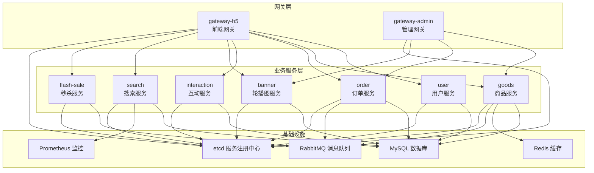
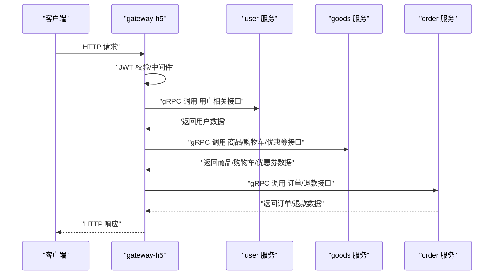
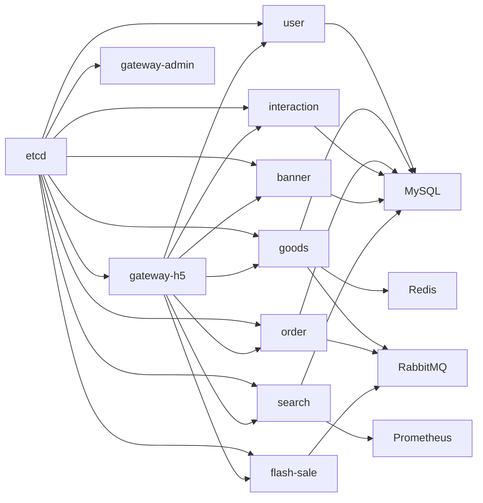

# 业务服务模块

<cite>
**本文引用的文件**
- [app/gateway-h5/main.go](file://app/gateway-h5/main.go)
- [app/gateway-h5/internal/cmd/cmd.go](file://app/gateway-h5/internal/cmd/cmd.go)
- [app/gateway-admin/main.go](file://app/gateway-admin/main.go)
- [app/gateway-admin/internal/cmd/cmd.go](file://app/gateway-admin/internal/cmd/cmd.go)
- [app/user/main.go](file://app/user/main.go)
- [app/goods/main.go](file://app/goods/main.go)
- [app/order/main.go](file://app/order/main.go)
- [app/interaction/main.go](file://app/interaction/main.go)
- [app/banner/main.go](file://app/banner/main.go)
- [app/search/main.go](file://app/search/main.go)
- [app/flash-sale/main.go](file://app/flash-sale/main.go)
- [utility/metrics/metrics.go](file://utility/metrics/metrics.go)
- [utility/middleware/middleware.go](file://utility/middleware/middleware.go)
- [app/gateway-h5/manifest/config/config.prod.yaml](file://app/gateway-h5/manifest/config/config.prod.yaml)
- [app/user/manifest/config/config.prod.yaml](file://app/user/manifest/config/config.prod.yaml)
- [app/goods/manifest/config/config.prod.yaml](file://app/goods/manifest/config/config.prod.yaml)
- [app/order/manifest/config/config.prod.yaml](file://app/order/manifest/config/config.prod.yaml)
</cite>

## 目录
1. [简介](#简介)
2. [项目结构](#项目结构)
3. [核心组件](#核心组件)
4. [架构总览](#架构总览)
5. [详细组件分析](#详细组件分析)
6. [依赖分析](#依赖分析)
7. [性能考虑](#性能考虑)
8. [故障排查指南](#故障排查指南)
9. [结论](#结论)
10. [附录](#附录)

## 简介
本文件面向业务服务模块，系统化梳理用户服务、商品服务、订单服务、互动服务、管理员服务、轮播图服务、搜索服务与秒杀服务的设计与实现。内容覆盖各服务的业务逻辑、数据模型、API 接口设计、服务间协作关系、数据流转过程、事务处理策略，并提供配置项、性能优化建议与扩展性考量。

## 项目结构
该仓库采用“多微服务”架构，以 GoFrame 为框架基础，结合 etcd 服务发现、gRPC 调用、MySQL 数据存储、Redis 缓存、RabbitMQ 消息队列与 Prometheus 监控。前端网关（gateway-h5）与管理网关（gateway-admin）统一对外暴露 RESTful 接口，内部通过 gRPC 调用各业务服务；部分服务通过 MQ 实现异步解耦与最终一致性。

图表来源
- [app/gateway-h5/main.go](file://app/gateway-h5/main.go#L1-L38)
- [app/gateway-admin/main.go](file://app/gateway-admin/main.go#L1-L30)
- [app/user/main.go](file://app/user/main.go#L1-L25)
- [app/goods/main.go](file://app/goods/main.go#L1-L35)
- [app/order/main.go](file://app/order/main.go#L1-L23)
- [app/interaction/main.go](file://app/interaction/main.go#L1-L26)
- [app/banner/main.go](file://app/banner/main.go#L1-L25)
- [app/search/main.go](file://app/search/main.go#L1-L25)
- [app/flash-sale/main.go](file://app/flash-sale/main.go#L1-L38)

章节来源
- [app/gateway-h5/main.go](file://app/gateway-h5/main.go#L1-L38)
- [app/gateway-h5/internal/cmd/cmd.go](file://app/gateway-h5/internal/cmd/cmd.go#L1-L100)
- [app/gateway-admin/main.go](file://app/gateway-admin/main.go#L1-L30)
- [app/gateway-admin/internal/cmd/cmd.go](file://app/gateway-admin/internal/cmd/cmd.go#L1-L46)

## 核心组件
- 网关层：gateway-h5 对外提供前端能力（用户登录注册、购物车、订单、互动、轮播、搜索、秒杀等），gateway-admin 提供后台管理能力（商品、订单、轮播管理）。
- 业务服务层：user、goods、order、interaction、banner、search、flash-sale 等服务各自负责领域模型与业务逻辑。
- 基础设施：etcd 用于服务注册与发现；MySQL 存储业务数据；Redis 用于缓存与库存控制；RabbitMQ 用于事件解耦与异步处理；Prometheus 采集指标。

章节来源
- [utility/metrics/metrics.go](file://utility/metrics/metrics.go#L1-L71)
- [utility/middleware/middleware.go](file://utility/middleware/middleware.go#L1-L35)

## 架构总览
网关层通过 gRPC 客户端调用各业务服务，服务间通过 etcd 发现彼此地址；业务服务内部读取配置连接数据库、缓存与消息中间件；部分服务通过 MQ 实现跨服务事件驱动。

图表来源
- [app/gateway-h5/internal/cmd/cmd.go](file://app/gateway-h5/internal/cmd/cmd.go#L33-L91)
- [utility/middleware/middleware.go](file://utility/middleware/middleware.go#L25-L34)

## 详细组件分析

### 用户服务（user）
- 业务职责
  - 用户注册、登录、微信小程序登录/注册
  - 收货地址管理（增删改查）
  - 用户信息更新与密码修改
- 数据模型
  - 用户表、收货地址表
- API 设计（示例）
  - 前端公开接口：注册、登录、微信登录/注册
  - 需鉴权接口：收货地址增删改查、用户信息查询与更新、密码修改
- 事务与一致性
  - 登录/注册涉及数据库写入与缓存更新，需保证幂等与一致性
- 配置要点
  - gRPC 地址、数据库连接、etcd 地址、RabbitMQ 事件交换与队列、微信小程序配置
- 性能与扩展
  - JWT 中间件限流与熔断
  - Redis 缓存用户会话与敏感信息
  - 事件驱动：用户注册后触发后续任务

章节来源
- [app/user/main.go](file://app/user/main.go#L1-L25)
- [app/user/manifest/config/config.prod.yaml](file://app/user/manifest/config/config.prod.yaml#L1-L42)

### 商品服务（goods）
- 业务职责
  - 商品信息、分类、图片、推荐商品
  - 购物车、优惠券、砍价活动
  - 库存管理与分布式锁、Redis Lua 原子扣减
- 数据模型
  - 商品、分类、图片、购物车、优惠券、砍价历史
- API 设计（示例）
  - 商品列表/详情、分类列表、推荐商品
  - 购物车增删改查、优惠券核销
  - 砍价活动创建/查询/删除
- 事务与一致性
  - 库存扣减采用 Redis Lua 与分布式锁，避免超卖
  - 与订单服务通过 MQ 事件解耦（订单创建/取消、库存回滚）
- 配置要点
  - gRPC 地址、数据库连接、etcd 地址、Redis 连接、RabbitMQ 交换与队列
- 性能与扩展
  - Redis 缓存热点商品与图片
  - 事件驱动：用户注册、订单创建/取消等异步处理

章节来源
- [app/goods/main.go](file://app/goods/main.go#L1-L35)
- [app/goods/manifest/config/config.prod.yaml](file://app/goods/manifest/config/config.prod.yaml#L1-L60)

### 订单服务（order）
- 业务职责
  - 订单创建、状态管理、支付回调、退款申请与回调
  - 退款配置与策略
- 数据模型
  - 订单、订单商品、退款
- API 设计（示例）
  - 订单创建、订单列表/详情、订单取消
  - 退款申请、退款列表/详情
  - 支付回调、退款回调
- 事务与一致性
  - 支付与库存/优惠券核销需保证最终一致，通过 MQ 事件补偿
  - 订单超时通过死信队列处理
- 配置要点
  - gRPC 地址、数据库连接、etcd 地址、RabbitMQ 交换与队列、微信支付参数
- 性能与扩展
  - 死信队列与重试策略
  - 退款与回调幂等处理

章节来源
- [app/order/main.go](file://app/order/main.go#L1-L23)
- [app/order/manifest/config/config.prod.yaml](file://app/order/manifest/config/config.prod.yaml#L1-L86)

### 互动服务（interaction）
- 业务职责
  - 点赞、评论、收藏
- 数据模型
  - 点赞、评论、收藏
- API 设计（示例）
  - 点赞、评论、收藏的增删改查
- 事务与一致性
  - 写操作幂等与去重
- 配置要点
  - gRPC 地址、数据库连接、etcd 地址

章节来源
- [app/interaction/main.go](file://app/interaction/main.go#L1-L26)

### 管理员服务（admin）
- 业务职责
  - 管理员登录与权限校验
- 数据模型
  - 管理员、角色、权限
- API 设计（示例）
  - 管理员登录
- 事务与一致性
  - 登录态校验与权限过滤
- 配置要点
  - gRPC 地址、数据库连接、etcd 地址

章节来源
- [app/admin/main.go](file://app/admin/main.go#L1-L25)

### 轮播图服务（banner）
- 业务职责
  - 轮播位与轮播图管理
- 数据模型
  - 轮播位、轮播图
- API 设计（示例）
  - 轮播位与轮播图的增删改查
- 事务与一致性
  - 内容发布与缓存同步
- 配置要点
  - gRPC 地址、数据库连接、etcd 地址

章节来源
- [app/banner/main.go](file://app/banner/main.go#L1-L25)

### 搜索服务（search）
- 业务职责
  - 商品搜索、索引同步（基于 MySQL binlog 到 Elasticsearch）
- 数据模型
  - 商品索引
- API 设计（示例）
  - 搜索接口、同步接口
- 事务与一致性
  - Binlog 增量同步，确保 ES 与 MySQL 最终一致
- 配置要点
  - gRPC 地址、数据库连接、etcd 地址、ES 连接
- 性能与扩展
  - ES 查询优化与分页
  - Binlog 同步的断点续传与重试

章节来源
- [app/search/main.go](file://app/search/main.go#L1-L25)

### 秒杀服务（flash-sale）
- 业务职责
  - 秒杀活动、下单与结果通知
- 数据模型
  - 秒杀活动、库存、订单
- API 设计（示例）
  - 秒杀商品列表/详情、创建秒杀订单、查询结果
- 事务与一致性
  - 高并发下的库存扣减与下单原子性，消息队列异步处理
- 配置要点
  - gRPC 地址、etcd 地址、RabbitMQ 交换与队列
- 性能与扩展
  - 限流与反刷策略、Redis 原子扣减、消息队列削峰填谷

章节来源
- [app/flash-sale/main.go](file://app/flash-sale/main.go#L1-L38)

## 依赖分析
- 服务发现：各服务通过 etcd 注册与发现
- 通信协议：网关与服务间通过 gRPC 调用
- 数据存储：MySQL 作为主存储，Redis 作为缓存与库存控制
- 消息中间件：RabbitMQ 用于事件解耦与异步处理
- 监控：Prometheus 指标采集与暴露

图表来源
- [app/gateway-h5/main.go](file://app/gateway-h5/main.go#L15-L21)
- [app/gateway-admin/main.go](file://app/gateway-admin/main.go#L15-L21)
- [app/user/manifest/config/config.prod.yaml](file://app/user/manifest/config/config.prod.yaml#L20-L21)
- [app/goods/manifest/config/config.prod.yaml](file://app/goods/manifest/config/config.prod.yaml#L20-L21)
- [app/order/manifest/config/config.prod.yaml](file://app/order/manifest/config/config.prod.yaml#L20-L21)
- [app/search/manifest/config/config.prod.yaml](file://app/search/manifest/config/config.prod.yaml#L1-L18)

## 性能考虑
- 网关层
  - 统一 CORS 中间件与 gRPC 超时拦截器，提升跨域兼容与调用稳定性
  - 注册 Prometheus 指标端点，便于观测与告警
- 业务服务层
  - Redis 缓存热点数据，降低数据库压力
  - MQ 异步处理耗时任务，提高吞吐
  - 事件驱动实现最终一致，避免长事务
- 配置建议
  - 合理设置 etcd 连接超时与重试
  - MySQL 连接池大小与超时阈值
  - Redis 连接池与命令超时
  - RabbitMQ 通道数与消费者并发度

章节来源
- [utility/middleware/middleware.go](file://utility/middleware/middleware.go#L10-L34)
- [utility/metrics/metrics.go](file://utility/metrics/metrics.go#L45-L71)
- [app/gateway-h5/manifest/config/config.prod.yaml](file://app/gateway-h5/manifest/config/config.prod.yaml#L1-L18)
- [app/user/manifest/config/config.prod.yaml](file://app/user/manifest/config/config.prod.yaml#L15-L42)
- [app/goods/manifest/config/config.prod.yaml](file://app/goods/manifest/config/config.prod.yaml#L15-L60)
- [app/order/manifest/config/config.prod.yaml](file://app/order/manifest/config/config.prod.yaml#L15-L86)

## 故障排查指南
- 网关无法访问服务
  - 检查 etcd 地址配置与连通性
  - 确认服务已注册且健康
- gRPC 调用超时
  - 检查 gRPC 超时拦截器配置
  - 观察服务端日志与指标
- MQ 功能异常
  - 秒杀服务在 MQ 初始化失败时会降级运行，检查 MQ 连接与消费者启动日志
- 指标未暴露
  - 确认 Prometheus 中间件已注册 /metrics 端点
- 订单超时/退款异常
  - 检查死信队列与重试策略配置
  - 核对微信支付回调地址与证书配置

章节来源
- [app/flash-sale/main.go](file://app/flash-sale/main.go#L21-L33)
- [utility/metrics/metrics.go](file://utility/metrics/metrics.go#L45-L55)
- [app/order/manifest/config/config.prod.yaml](file://app/order/manifest/config/config.prod.yaml#L23-L86)

## 结论
本业务服务模块以清晰的分层与服务边界实现了完整的电商核心能力，通过 etcd、gRPC、MySQL、Redis、RabbitMQ 与 Prometheus 构建了高可用、可观测、可扩展的微服务体系。建议在生产环境中进一步完善限流、熔断、重试与幂等策略，并持续优化缓存命中率与 MQ 消费性能。

## 附录
- 网关路由概览（前端/管理）
  - 前端网关：公开接口（无需鉴权）、需要鉴权的用户/商品/订单/互动接口
  - 管理网关：后台公开接口与需要鉴权的商品/订单/轮播接口
- 关键配置清单
  - 网关：服务地址、OpenAPI/Swagger 路径、日志、etcd 地址
  - 业务服务：gRPC 名称与地址、数据库连接、etcd 地址、Redis/MQ/ES 配置
  - 订单服务：微信支付参数与回调地址

章节来源
- [app/gateway-h5/internal/cmd/cmd.go](file://app/gateway-h5/internal/cmd/cmd.go#L33-L91)
- [app/gateway-admin/internal/cmd/cmd.go](file://app/gateway-admin/internal/cmd/cmd.go#L20-L39)
- [app/gateway-h5/manifest/config/config.prod.yaml](file://app/gateway-h5/manifest/config/config.prod.yaml#L1-L18)
- [app/user/manifest/config/config.prod.yaml](file://app/user/manifest/config/config.prod.yaml#L1-L42)
- [app/goods/manifest/config/config.prod.yaml](file://app/goods/manifest/config/config.prod.yaml#L1-L60)
- [app/order/manifest/config/config.prod.yaml](file://app/order/manifest/config/config.prod.yaml#L1-L86)