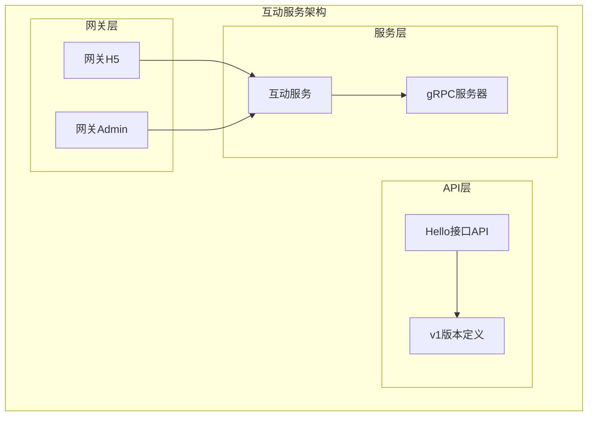
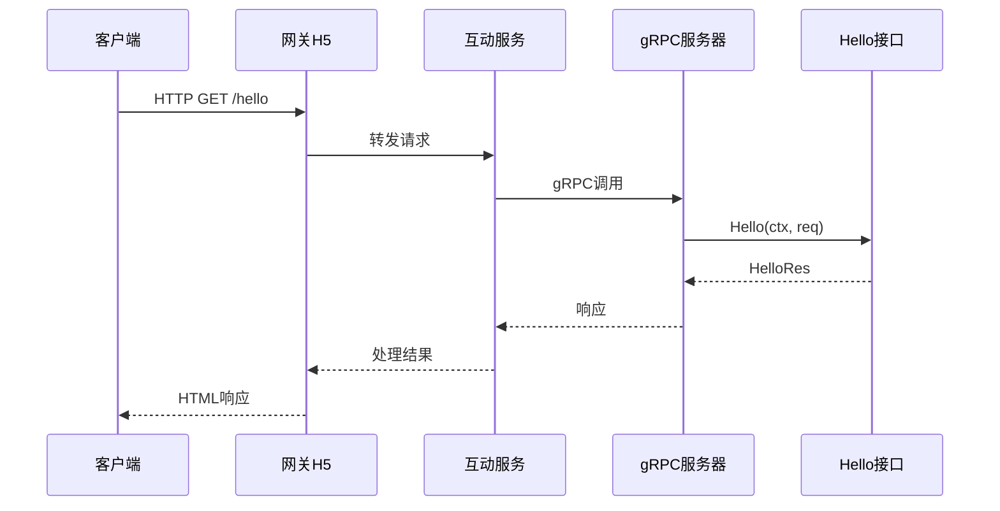
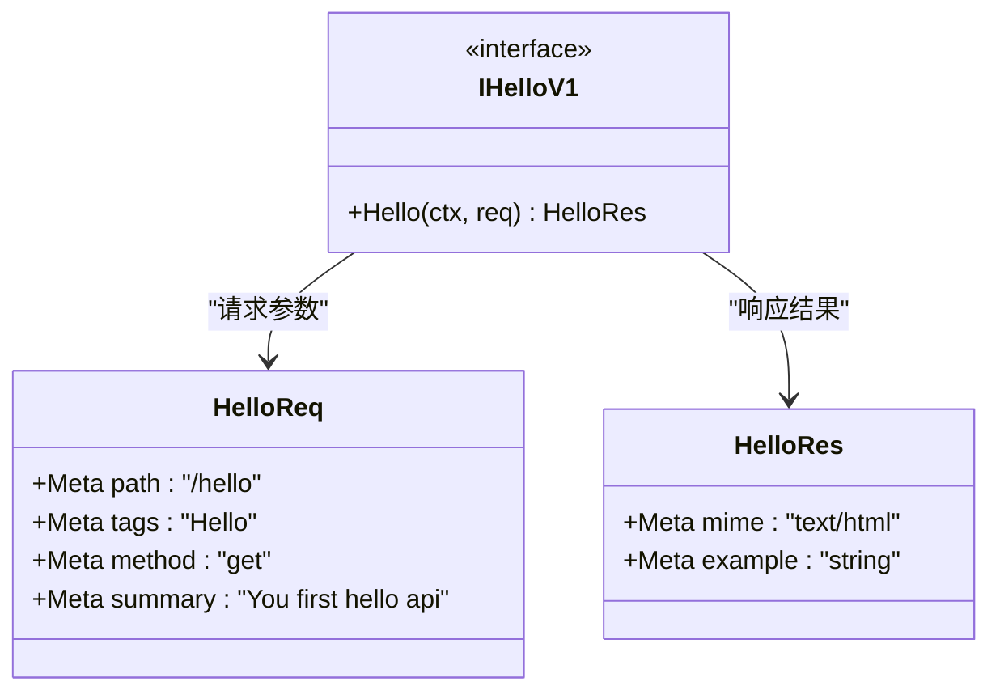
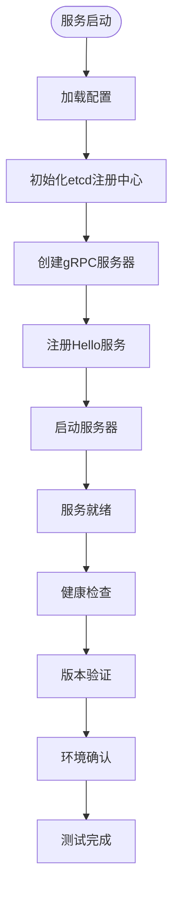
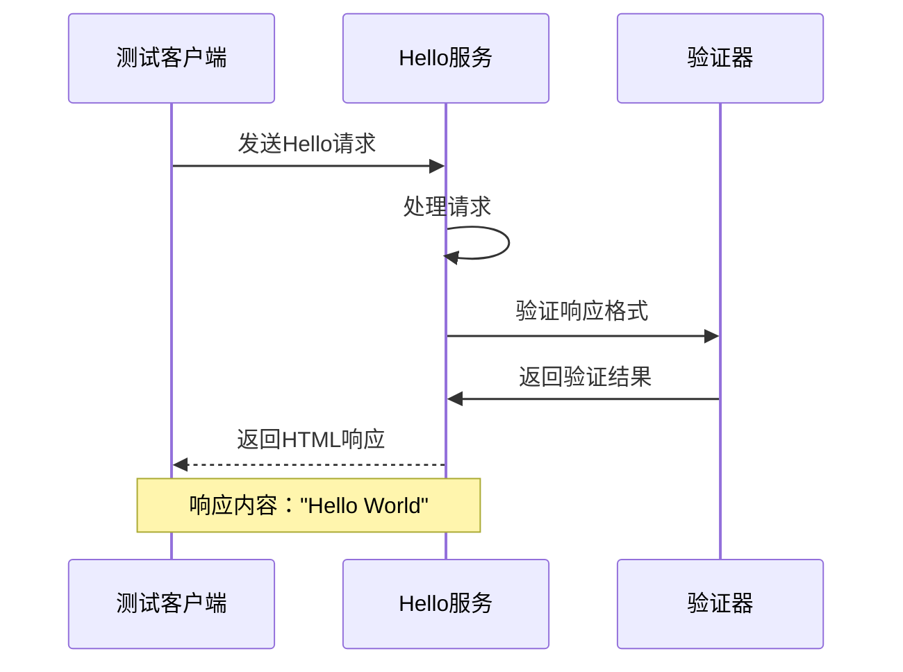
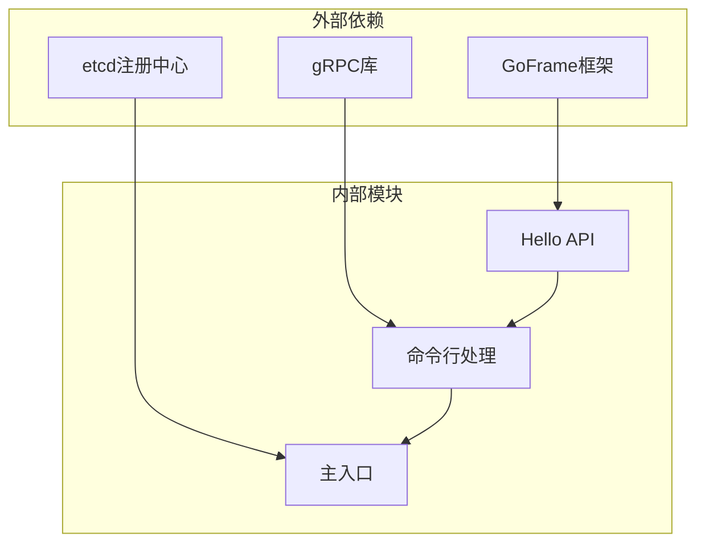

# Hello接口测试

<cite>
**本文档引用的文件**
- [app/interaction/api/hello/hello.go](file://app/interaction/api/hello/hello.go)
- [app/interaction/api/hello/v1/hello.go](file://app/interaction/api/hello/v1/hello.go)
- [app/interaction/internal/cmd/cmd.go](file://app/interaction/internal/cmd/cmd.go)
- [app/interaction/main.go](file://app/interaction/main.go)
- [app/gateway-h5/api/interaction/interaction.go](file://app/gateway-h5/api/interaction/interaction.go)
</cite>

## 目录
1. [简介](#简介)
2. [项目结构](#项目结构)
3. [核心组件](#核心组件)
4. [架构概览](#架构概览)
5. [详细组件分析](#详细组件分析)
6. [依赖分析](#依赖分析)
7. [性能考虑](#性能考虑)
8. [故障排除指南](#故障排除指南)
9. [结论](#结论)

## 简介
本文档专注于互动服务中的Hello接口测试，该接口作为服务可用性的基础验证工具，支持健康检查、版本验证和环境确认等基本测试操作。Hello接口采用GoFrame框架的gRPC服务模式实现，通过简洁的请求响应模型提供快速的服务状态验证能力。

## 项目结构
互动服务的Hello接口位于独立的API模块中，采用清晰的分层架构设计：

**图表来源**
- [app/interaction/api/hello/hello.go](file://app/interaction/api/hello/hello.go#L1-L16)
- [app/interaction/api/hello/v1/hello.go](file://app/interaction/api/hello/v1/hello.go#L1-L13)

**章节来源**
- [app/interaction/api/hello/hello.go](file://app/interaction/api/hello/hello.go#L1-L16)
- [app/interaction/api/hello/v1/hello.go](file://app/interaction/api/hello/v1/hello.go#L1-L13)

## 核心组件
Hello接口由两个核心组件构成：接口定义和版本化实现。

### 接口定义组件
接口定义文件提供了标准的Hello接口规范，包含完整的请求响应结构定义和元数据配置。

### 版本化实现组件
v1版本实现了具体的Hello接口逻辑，定义了HTTP端点、请求参数和响应格式。

**章节来源**
- [app/interaction/api/hello/hello.go](file://app/interaction/api/hello/hello.go#L13-L15)
- [app/interaction/api/hello/v1/hello.go](file://app/interaction/api/hello/v1/hello.go#L7-L12)

## 架构概览
Hello接口在整个微服务架构中的位置和交互关系如下：

**图表来源**
- [app/interaction/internal/cmd/cmd.go](file://app/interaction/internal/cmd/cmd.go#L19-L31)
- [app/interaction/api/hello/v1/hello.go](file://app/interaction/api/hello/v1/hello.go#L8-L12)

## 详细组件分析

### Hello接口类图

**图表来源**
- [app/interaction/api/hello/hello.go](file://app/interaction/api/hello/hello.go#L13-L15)
- [app/interaction/api/hello/v1/hello.go](file://app/interaction/api/hello/v1/hello.go#L7-L12)

### 服务启动流程

**图表来源**
- [app/interaction/main.go](file://app/interaction/main.go#L14-L25)
- [app/interaction/internal/cmd/cmd.go](file://app/interaction/internal/cmd/cmd.go#L19-L31)

### 接口测试序列图

**图表来源**
- [app/interaction/api/hello/v1/hello.go](file://app/interaction/api/hello/v1/hello.go#L10-L12)

**章节来源**
- [app/interaction/api/hello/hello.go](file://app/interaction/api/hello/hello.go#L1-L16)
- [app/interaction/api/hello/v1/hello.go](file://app/interaction/api/hello/v1/hello.go#L1-L13)

## 依赖分析
Hello接口的依赖关系相对简单，主要依赖于GoFrame框架的核心功能：

**图表来源**
- [app/interaction/main.go](file://app/interaction/main.go#L3-L12)
- [app/interaction/internal/cmd/cmd.go](file://app/interaction/internal/cmd/cmd.go#L3-L12)

**章节来源**
- [app/interaction/main.go](file://app/interaction/main.go#L1-L26)
- [app/interaction/internal/cmd/cmd.go](file://app/interaction/internal/cmd/cmd.go#L1-L35)

## 性能考虑
Hello接口作为轻量级的健康检查工具，在性能方面具有以下特点：

- **响应时间**：由于接口逻辑简单，通常在毫秒级别内完成响应
- **资源消耗**：内存占用极低，适合频繁的健康检查调用
- **并发处理**：支持高并发请求，适合负载测试场景
- **网络开销**：HTTP请求头较小，适合大规模监控部署

## 故障排除指南

### 常见问题及解决方案

#### 1. 服务不可达
**症状**：客户端无法连接到Hello接口
**可能原因**：
- 服务未正确启动
- etcd注册中心连接失败
- 端口被占用

**解决步骤**：
1. 检查服务进程状态
2. 验证etcd连接配置
3. 确认端口监听情况

#### 2. 响应格式异常
**症状**：返回的响应不是预期的HTML格式
**可能原因**：
- MIME类型配置错误
- 响应内容编码问题

**解决步骤**：
1. 检查HelloRes的MIME配置
2. 验证响应内容编码设置

#### 3. 接口路径不匹配
**症状**：HTTP 404错误
**可能原因**：
- 请求URL路径错误
- 服务路由配置问题

**解决步骤**：
1. 确认请求路径为 `/hello`
2. 检查服务路由映射

**章节来源**
- [app/interaction/api/hello/v1/hello.go](file://app/interaction/api/hello/v1/hello.go#L8-L12)

## 结论
Hello接口作为互动服务的基础测试工具，提供了简单而有效的服务验证机制。其基于GoFrame框架的gRPC实现确保了良好的性能和可靠性，同时保持了代码的简洁性和可维护性。通过本文档提供的测试方法和故障排除指南，可以有效地验证服务的健康状态、版本信息和运行环境，为微服务的整体质量保证提供重要支撑。