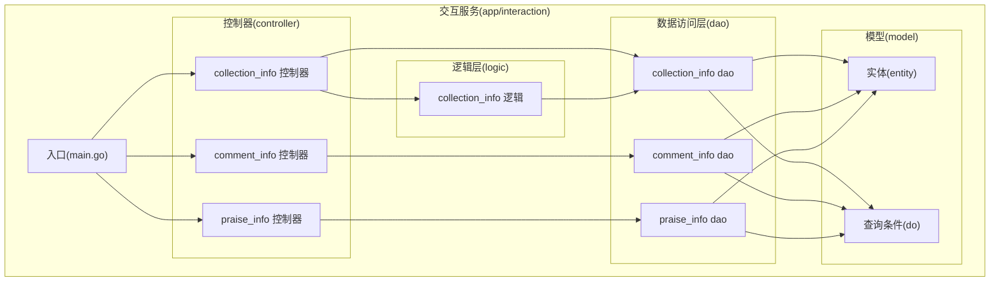
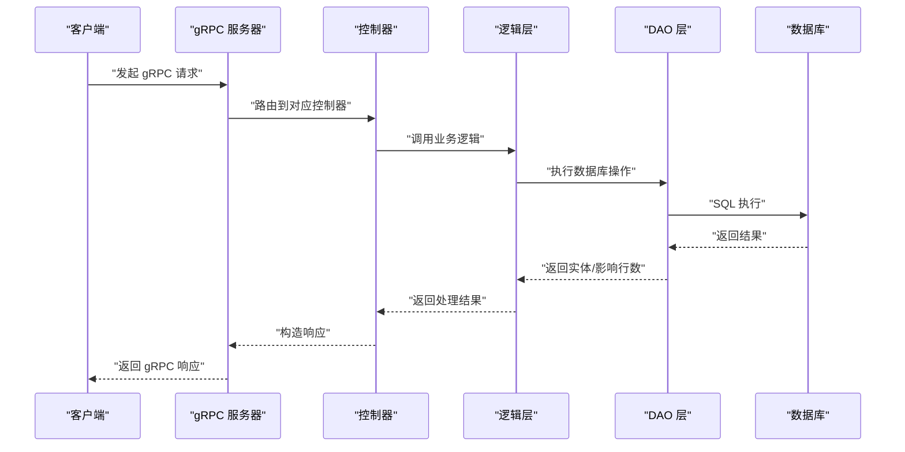
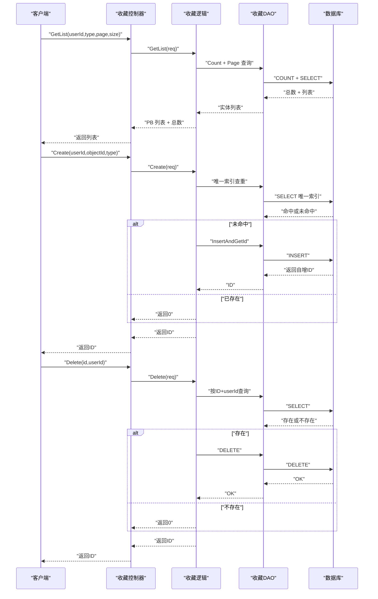
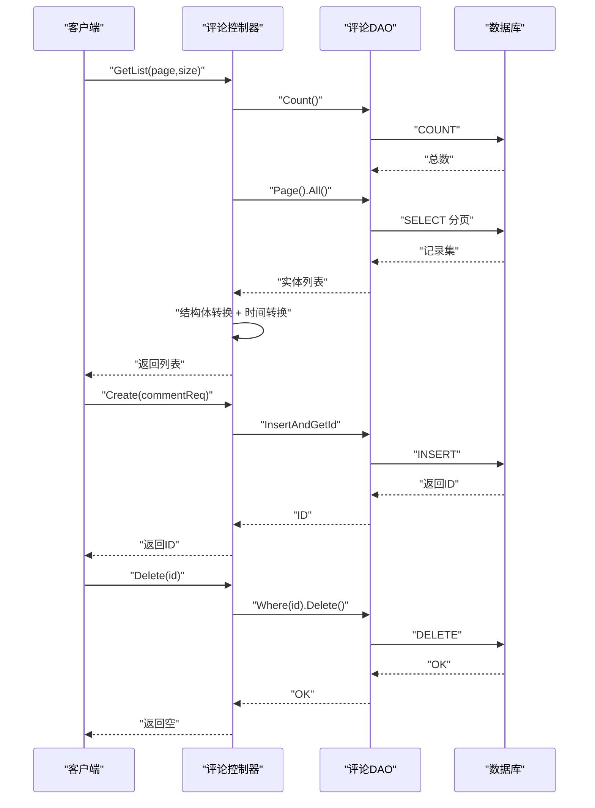
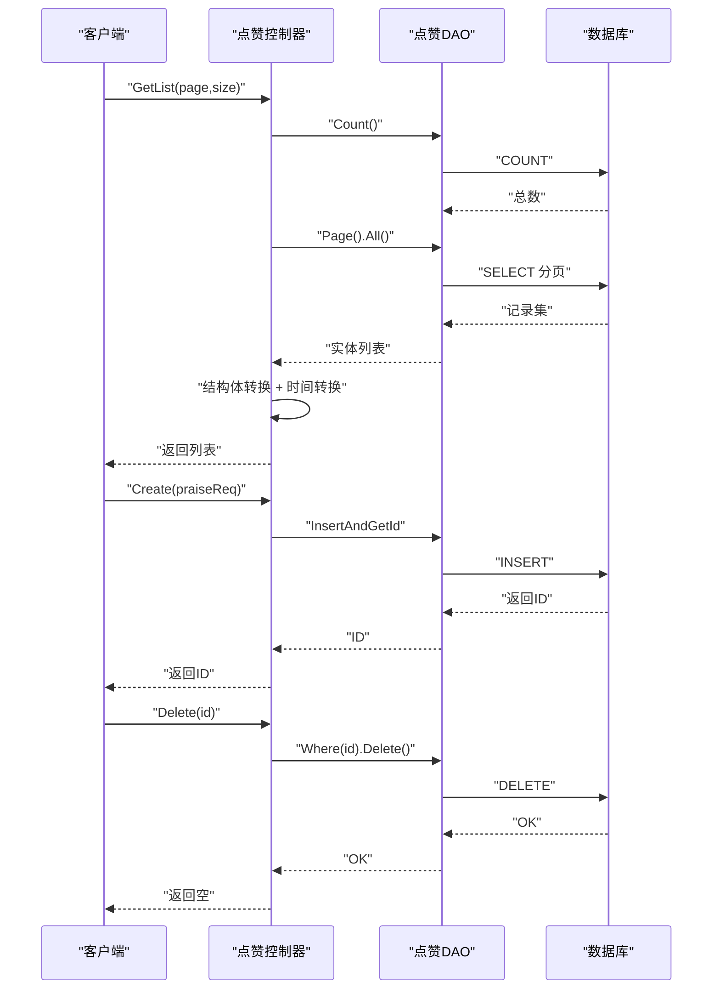
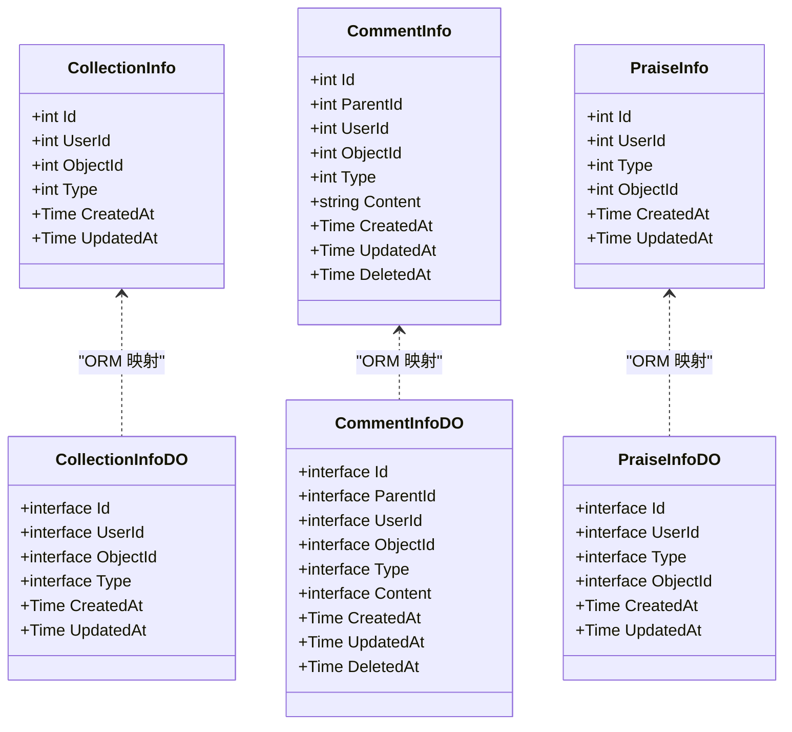
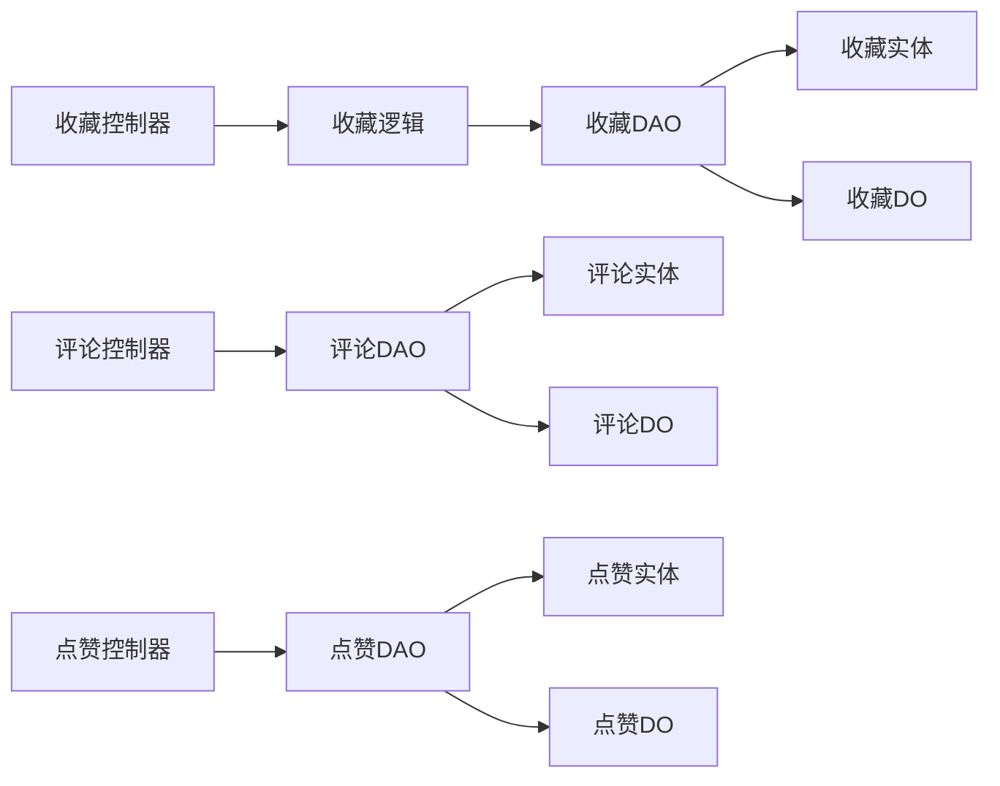

# 互动服务模块

<cite>
**本文引用的文件**
- [main.go](file://app/interaction/main.go)
- [collection_info.go](file://app/interaction/internal/controller/collection_info/collection_info.go)
- [comment_info.go](file://app/interaction/internal/controller/comment_info/comment_info.go)
- [praise_info.go](file://app/interaction/internal/controller/praise_info/praise_info.go)
- [collection_info.go](file://app/interaction/internal/model/entity/collection_info.go)
- [comment_info.go](file://app/interaction/internal/model/entity/comment_info.go)
- [praise_info.go](file://app/interaction/internal/model/entity/praise_info.go)
- [collection_info.go](file://app/interaction/internal/dao/collection_info.go)
- [comment_info.go](file://app/interaction/internal/dao/comment_info.go)
- [praise_info.go](file://app/interaction/internal/dao/praise_info.go)
- [collection_info.go](file://app/interaction/internal/logic/collection_info/collection_info.go)
- [interaction.sql](file://app/interaction/hack/interaction.sql)
- [collection_info.go](file://app/interaction/internal/model/do/collection_info.go)
- [comment_info.go](file://app/interaction/internal/model/do/comment_info.go)
- [praise_info.go](file://app/interaction/internal/model/do/praise_info.go)
</cite>

## 目录
1. [简介](#简介)
2. [项目结构](#项目结构)
3. [核心组件](#核心组件)
4. [架构总览](#架构总览)
5. [详细组件分析](#详细组件分析)
6. [依赖关系分析](#依赖关系分析)
7. [性能考虑](#性能考虑)
8. [故障排查指南](#故障排查指南)
9. [结论](#结论)
10. [附录](#附录)

## 简介
互动服务模块提供完整的用户互动能力，包括评论管理、收藏管理和点赞机制。该模块采用微服务架构，基于 GoFrame 框架与 gRPC 进行服务间通信，并通过 etcd 作为服务注册与发现中心。模块内实现了统一的错误包装与日志记录机制，确保服务稳定性与可观测性。

## 项目结构
互动服务模块遵循“控制器-逻辑层-数据访问层-实体模型”的分层架构，结合 Protobuf 定义的 API 接口，形成清晰的职责边界与可维护性。

图表来源
- [main.go](file://app/interaction/main.go#L1-L26)
- [collection_info.go](file://app/interaction/internal/controller/collection_info/collection_info.go#L1-L83)
- [comment_info.go](file://app/interaction/internal/controller/comment_info/comment_info.go#L1-L107)
- [praise_info.go](file://app/interaction/internal/controller/praise_info/praise_info.go#L1-L107)
- [collection_info.go](file://app/interaction/internal/dao/collection_info.go#L1-L23)
- [comment_info.go](file://app/interaction/internal/dao/comment_info.go#L1-L23)
- [praise_info.go](file://app/interaction/internal/dao/praise_info.go#L1-L23)
- [collection_info.go](file://app/interaction/internal/model/entity/collection_info.go#L1-L20)
- [comment_info.go](file://app/interaction/internal/model/entity/comment_info.go#L1-L23)
- [praise_info.go](file://app/interaction/internal/model/entity/praise_info.go#L1-L20)

章节来源
- [main.go](file://app/interaction/main.go#L1-L26)

## 核心组件
- 控制器层：负责接收 gRPC 请求，调用逻辑层处理业务，封装响应与错误。
- 逻辑层：实现具体业务规则，如收藏去重、分页查询、唯一索引约束下的插入。
- 数据访问层：封装数据库操作，提供统一的查询与写入入口。
- 实体与查询条件：定义表结构与查询条件，保证 ORM 映射与查询参数类型安全。
- 数据库：提供三张核心表（评论、点赞、收藏），并建立唯一索引以保障数据一致性。

章节来源
- [collection_info.go](file://app/interaction/internal/controller/collection_info/collection_info.go#L1-L83)
- [comment_info.go](file://app/interaction/internal/controller/comment_info/comment_info.go#L1-L107)
- [praise_info.go](file://app/interaction/internal/controller/praise_info/praise_info.go#L1-L107)
- [collection_info.go](file://app/interaction/internal/dao/collection_info.go#L1-L23)
- [comment_info.go](file://app/interaction/internal/dao/comment_info.go#L1-L23)
- [praise_info.go](file://app/interaction/internal/dao/praise_info.go#L1-L23)
- [collection_info.go](file://app/interaction/internal/model/entity/collection_info.go#L1-L20)
- [comment_info.go](file://app/interaction/internal/model/entity/comment_info.go#L1-L23)
- [praise_info.go](file://app/interaction/internal/model/entity/praise_info.go#L1-L20)

## 架构总览
服务启动后通过 etcd 注册 gRPC 解析器，控制器注册到 gRPC 服务器，对外提供评论、收藏、点赞的 gRPC 接口。

图表来源
- [main.go](file://app/interaction/main.go#L14-L25)
- [collection_info.go](file://app/interaction/internal/controller/collection_info/collection_info.go#L19-L82)
- [comment_info.go](file://app/interaction/internal/controller/comment_info/comment_info.go#L23-L106)
- [praise_info.go](file://app/interaction/internal/controller/praise_info/praise_info.go#L23-L106)
- [collection_info.go](file://app/interaction/internal/logic/collection_info/collection_info.go#L14-L110)
- [collection_info.go](file://app/interaction/internal/dao/collection_info.go#L17-L20)
- [comment_info.go](file://app/interaction/internal/dao/comment_info.go#L17-L20)
- [praise_info.go](file://app/interaction/internal/dao/praise_info.go#L17-L20)

## 详细组件分析

### 收藏功能
- 功能概述：支持按用户、类型、对象维度进行收藏，提供列表查询、创建与删除。
- 关键特性：
  - 去重：通过唯一索引避免重复收藏。
  - 分页：支持分页查询与总数统计。
  - 类型化：支持商品与文章两类对象的收藏。
- 数据模型与索引：
  - 表名：collection_info
  - 唯一索引：user_id + object_id + type
- 处理流程：
  - 列表查询：先统计总数，再按页查询实体，最后转换为 PB 结构。
  - 创建：先查重（唯一索引约束下避免重复），无重复则插入并返回 ID。
  - 删除：按 ID 与用户维度校验存在性，存在则删除并返回 ID。

图表来源
- [collection_info.go](file://app/interaction/internal/controller/collection_info/collection_info.go#L24-L82)
- [collection_info.go](file://app/interaction/internal/logic/collection_info/collection_info.go#L14-L110)
- [collection_info.go](file://app/interaction/internal/dao/collection_info.go#L17-L20)
- [collection_info.go](file://app/interaction/internal/model/entity/collection_info.go#L11-L20)
- [interaction.sql](file://app/interaction/hack/interaction.sql#L52-L65)

章节来源
- [collection_info.go](file://app/interaction/internal/controller/collection_info/collection_info.go#L1-L83)
- [collection_info.go](file://app/interaction/internal/logic/collection_info/collection_info.go#L1-L110)
- [collection_info.go](file://app/interaction/internal/dao/collection_info.go#L1-L23)
- [collection_info.go](file://app/interaction/internal/model/entity/collection_info.go#L1-L20)
- [interaction.sql](file://app/interaction/hack/interaction.sql#L52-L65)

### 评论功能
- 功能概述：支持评论列表查询、新增评论、删除评论。
- 关键特性：
  - 分页与总数：统一返回分页信息与总数。
  - 时间字段转换：统一使用工具函数进行时间转换。
  - 唯一索引：防止重复提交相同内容的评论。
- 数据模型与索引：
  - 表名：comment_info
  - 唯一索引：user_id + object_id + type + content + parent_id

图表来源
- [comment_info.go](file://app/interaction/internal/controller/comment_info/comment_info.go#L27-L106)
- [comment_info.go](file://app/interaction/internal/dao/comment_info.go#L17-L20)
- [comment_info.go](file://app/interaction/internal/model/entity/comment_info.go#L11-L23)
- [interaction.sql](file://app/interaction/hack/interaction.sql#L4-L19)

章节来源
- [comment_info.go](file://app/interaction/internal/controller/comment_info/comment_info.go#L1-L107)
- [comment_info.go](file://app/interaction/internal/dao/comment_info.go#L1-L23)
- [comment_info.go](file://app/interaction/internal/model/entity/comment_info.go#L1-L23)
- [interaction.sql](file://app/interaction/hack/interaction.sql#L4-L19)

### 点赞功能
- 功能概述：支持点赞列表查询、新增点赞、删除点赞。
- 关键特性：
  - 唯一索引：user_id + type + object_id 避免重复点赞。
  - 分页与总数：统一返回分页信息与总数。
  - 时间字段转换：统一使用工具函数进行时间转换。
- 数据模型与索引：
  - 表名：praise_info
  - 唯一索引：user_id + type + object_id

图表来源
- [praise_info.go](file://app/interaction/internal/controller/praise_info/praise_info.go#L27-L106)
- [praise_info.go](file://app/interaction/internal/dao/praise_info.go#L17-L20)
- [praise_info.go](file://app/interaction/internal/model/entity/praise_info.go#L11-L20)
- [interaction.sql](file://app/interaction/hack/interaction.sql#L32-L44)

章节来源
- [praise_info.go](file://app/interaction/internal/controller/praise_info/praise_info.go#L1-L107)
- [praise_info.go](file://app/interaction/internal/dao/praise_info.go#L1-L23)
- [praise_info.go](file://app/interaction/internal/model/entity/praise_info.go#L1-L20)
- [interaction.sql](file://app/interaction/hack/interaction.sql#L32-L44)

### 数据模型与实体映射
- 收藏实体：包含用户ID、对象ID、类型、创建与更新时间。
- 评论实体：包含父评论ID、用户ID、对象ID、类型、内容、创建与更新时间、软删除时间。
- 点赞实体：包含用户ID、类型、对象ID、创建与更新时间。
- 查询条件 DO：用于 Where 条件与批量查询参数的类型化封装。

图表来源
- [collection_info.go](file://app/interaction/internal/model/entity/collection_info.go#L11-L20)
- [comment_info.go](file://app/interaction/internal/model/entity/comment_info.go#L11-L23)
- [praise_info.go](file://app/interaction/internal/model/entity/praise_info.go#L11-L20)
- [collection_info.go](file://app/interaction/internal/model/do/collection_info.go#L12-L22)
- [comment_info.go](file://app/interaction/internal/model/do/comment_info.go#L12-L25)
- [praise_info.go](file://app/interaction/internal/model/do/praise_info.go#L12-L22)

章节来源
- [collection_info.go](file://app/interaction/internal/model/entity/collection_info.go#L1-L20)
- [comment_info.go](file://app/interaction/internal/model/entity/comment_info.go#L1-L23)
- [praise_info.go](file://app/interaction/internal/model/entity/praise_info.go#L1-L20)
- [collection_info.go](file://app/interaction/internal/model/do/collection_info.go#L1-L22)
- [comment_info.go](file://app/interaction/internal/model/do/comment_info.go#L1-L25)
- [praise_info.go](file://app/interaction/internal/model/do/praise_info.go#L1-L22)

## 依赖关系分析
- 控制器依赖逻辑层；逻辑层依赖 DAO；DAO 依赖实体与查询条件。
- 控制器通过 gRPC 注册服务，服务解析器由 etcd 提供。
- 统一错误包装与日志记录，便于问题定位与告警。

图表来源
- [collection_info.go](file://app/interaction/internal/controller/collection_info/collection_info.go#L19-L82)
- [comment_info.go](file://app/interaction/internal/controller/comment_info/comment_info.go#L23-L106)
- [praise_info.go](file://app/interaction/internal/controller/praise_info/praise_info.go#L23-L106)
- [collection_info.go](file://app/interaction/internal/logic/collection_info/collection_info.go#L14-L110)
- [collection_info.go](file://app/interaction/internal/dao/collection_info.go#L17-L20)
- [comment_info.go](file://app/interaction/internal/dao/comment_info.go#L17-L20)
- [praise_info.go](file://app/interaction/internal/dao/praise_info.go#L17-L20)
- [collection_info.go](file://app/interaction/internal/model/entity/collection_info.go#L11-L20)
- [comment_info.go](file://app/interaction/internal/model/entity/comment_info.go#L11-L23)
- [praise_info.go](file://app/interaction/internal/model/entity/praise_info.go#L11-L20)
- [collection_info.go](file://app/interaction/internal/model/do/collection_info.go#L12-L22)
- [comment_info.go](file://app/interaction/internal/model/do/comment_info.go#L12-L25)
- [praise_info.go](file://app/interaction/internal/model/do/praise_info.go#L12-L22)

章节来源
- [collection_info.go](file://app/interaction/internal/controller/collection_info/collection_info.go#L1-L83)
- [comment_info.go](file://app/interaction/internal/controller/comment_info/comment_info.go#L1-L107)
- [praise_info.go](file://app/interaction/internal/controller/praise_info/praise_info.go#L1-L107)
- [collection_info.go](file://app/interaction/internal/logic/collection_info/collection_info.go#L1-L110)
- [collection_info.go](file://app/interaction/internal/dao/collection_info.go#L1-L23)
- [comment_info.go](file://app/interaction/internal/dao/comment_info.go#L1-L23)
- [praise_info.go](file://app/interaction/internal/dao/praise_info.go#L1-L23)

## 性能考虑
- 分页查询：列表接口使用分页查询，避免一次性加载大量数据。
- 唯一索引：在收藏与点赞场景使用唯一索引，减少重复写入与查询成本。
- 时间字段转换：统一使用工具函数进行时间转换，减少重复逻辑与潜在错误。
- 错误包装与日志：统一错误码与日志记录，便于快速定位问题，降低运维成本。
- 建议：
  - 为高频查询字段（如 user_id、object_id、type）建立合适索引，结合唯一索引优化去重与查询。
  - 对评论内容字段进行长度控制与敏感词过滤，减少存储与检索压力。
  - 引入缓存策略（如热点对象的点赞/收藏计数）以减轻数据库压力。

## 故障排查指南
- 常见错误类型：
  - 数据库操作错误：统一包装为数据库操作错误码，便于前端与监控系统识别。
  - 参数校验失败：控制器层对请求参数进行基本校验，失败时返回明确错误信息。
- 排查步骤：
  - 查看服务日志：定位错误发生的具体位置与上下文。
  - 检查唯一索引冲突：确认是否重复提交导致插入失败。
  - 核对分页参数：确认 page 与 size 是否合理，避免超界或过大。
  - 核对用户权限：删除操作需校验用户身份，避免越权删除。

章节来源
- [collection_info.go](file://app/interaction/internal/controller/collection_info/collection_info.go#L24-L82)
- [comment_info.go](file://app/interaction/internal/controller/comment_info/comment_info.go#L27-L106)
- [praise_info.go](file://app/interaction/internal/controller/praise_info/praise_info.go#L27-L106)

## 结论
互动服务模块通过清晰的分层架构与完善的错误处理机制，提供了稳定可靠的评论、收藏与点赞能力。模块采用唯一索引与分页查询等手段保障数据一致性与性能，适合在高并发场景下使用。后续可在缓存与索引优化方面进一步提升性能表现。

## 附录

### 数据库初始化脚本
- 评论表：包含父评论ID、用户ID、对象ID、类型、内容、创建与更新时间、软删除时间，并建立唯一索引。
- 点赞表：包含用户ID、类型、对象ID、创建与更新时间，并建立唯一索引。
- 收藏表：包含用户ID、对象ID、类型、创建与更新时间，并建立唯一索引。

章节来源
- [interaction.sql](file://app/interaction/hack/interaction.sql#L4-L72)