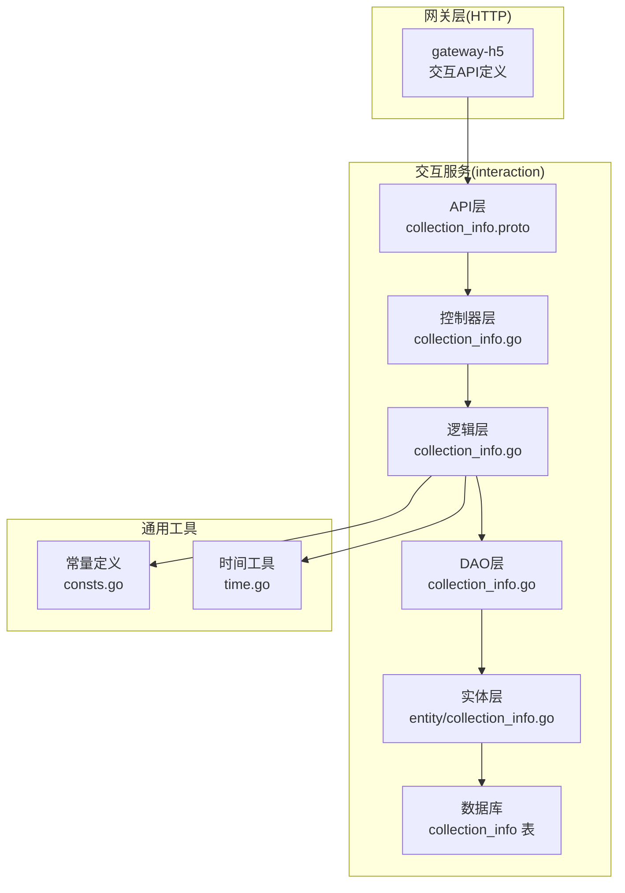
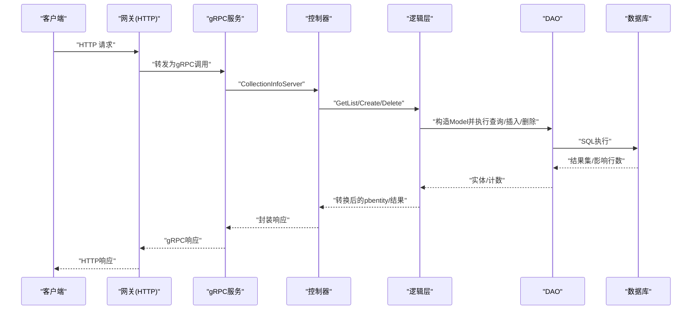
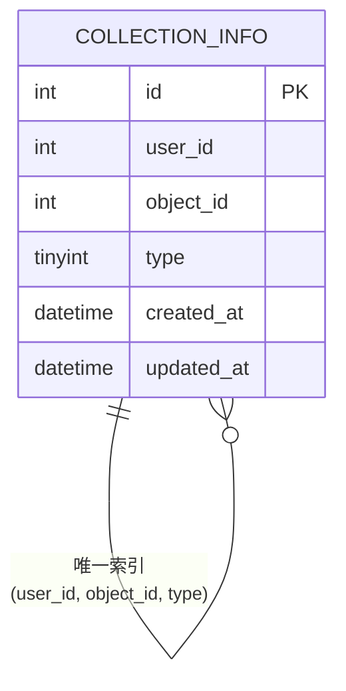
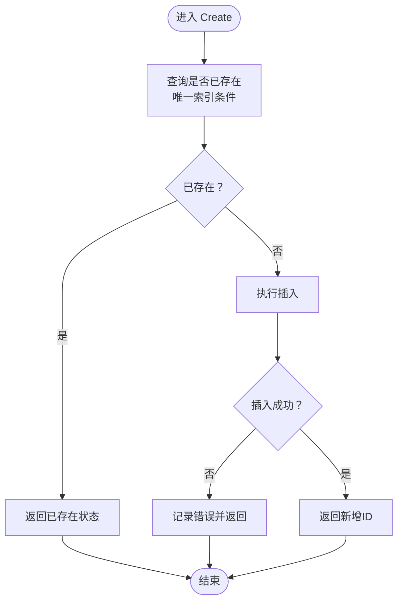
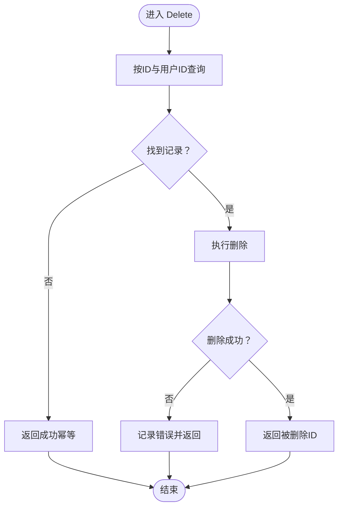
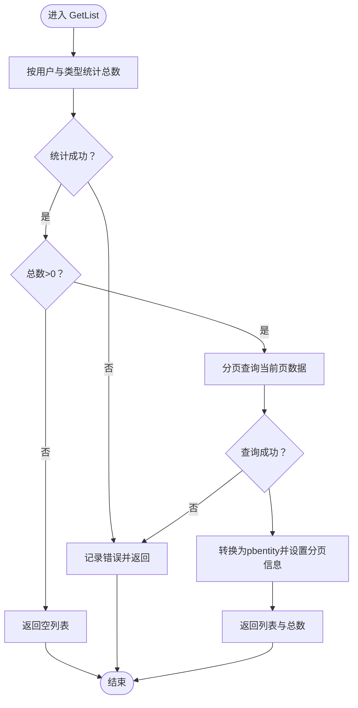
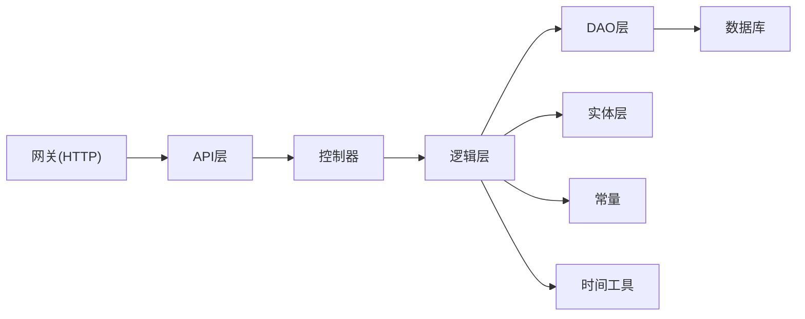

# 收藏功能管理

<cite>
**本文引用的文件**
- [collection_info.pb.go](file://app/interaction/api/collection_info/v1/collection_info.pb.go)
- [collection_info.go](file://app/interaction/internal/controller/collection_info/collection_info.go)
- [collection_info.go](file://app/interaction/internal/dao/collection_info.go)
- [collection_info.go](file://app/interaction/internal/dao/internal/collection_info.go)
- [collection_info.go](file://app/interaction/internal/model/entity/collection_info.go)
- [collection_info.go](file://app/interaction/internal/logic/collection_info/collection_info.go)
- [consts.go](file://utility/consts/consts.go)
- [collection_info.sql](file://app/interaction/hack/interaction.sql)
- [collection_info.go](file://app/interaction/api/pbentity/collection_info.pb.go)
- [collection_info.go](file://app/gateway-h5/api/interaction/v1/collection_info.go)
- [time.go](file://utility/time.go)
</cite>

## 目录
1. [简介](#简介)
2. [项目结构](#项目结构)
3. [核心组件](#核心组件)
4. [架构总览](#架构总览)
5. [详细组件分析](#详细组件分析)
6. [依赖关系分析](#依赖关系分析)
7. [性能考虑](#性能考虑)
8. [故障排查指南](#故障排查指南)
9. [结论](#结论)
10. [附录](#附录)

## 简介
本文件系统化梳理收藏功能的完整实现，覆盖收藏创建、删除、查询三大核心能力；阐述收藏数据模型设计、用户行为追踪、收藏列表分页管理；解释收藏与商品关联机制、去重策略、统计分析；并提供 API 接口定义、数据结构说明、错误处理机制与性能优化建议，以及收藏状态管理、批量操作与排序等扩展能力的实现要点。

## 项目结构
收藏功能位于交互服务模块（interaction），采用典型的分层架构：API 层（Protobuf 定义）、控制器层（gRPC 服务端）、逻辑层（业务逻辑）、DAO 层（数据访问对象）、实体层（ORM 映射）与网关层（HTTP 接口）。数据库表 collection_info 提供收藏数据持久化，并通过唯一索引实现收藏去重。

图表来源
- [collection_info.pb.go](file://app/interaction/api/collection_info/v1/collection_info.pb.go#L434-L438)
- [collection_info.go](file://app/interaction/internal/controller/collection_info/collection_info.go#L19-L82)
- [collection_info.go](file://app/interaction/internal/logic/collection_info/collection_info.go#L14-L110)
- [collection_info.go](file://app/interaction/internal/dao/collection_info.go#L11-L22)
- [collection_info.go](file://app/interaction/internal/model/entity/collection_info.go#L11-L19)
- [collection_info.sql](file://app/interaction/hack/interaction.sql#L52-L65)
- [consts.go](file://utility/consts/consts.go#L30-L46)
- [time.go](file://utility/time.go#L15-L20)
- [collection_info.go](file://app/gateway-h5/api/interaction/v1/collection_info.go#L8-L64)

章节来源
- [collection_info.pb.go](file://app/interaction/api/collection_info/v1/collection_info.pb.go#L434-L438)
- [collection_info.go](file://app/interaction/internal/controller/collection_info/collection_info.go#L19-L82)
- [collection_info.go](file://app/interaction/internal/logic/collection_info/collection_info.go#L14-L110)
- [collection_info.go](file://app/interaction/internal/dao/collection_info.go#L11-L22)
- [collection_info.go](file://app/interaction/internal/model/entity/collection_info.go#L11-L19)
- [collection_info.sql](file://app/interaction/hack/interaction.sql#L52-L65)
- [consts.go](file://utility/consts/consts.go#L30-L46)
- [time.go](file://utility/time.go#L15-L20)
- [collection_info.go](file://app/gateway-h5/api/interaction/v1/collection_info.go#L8-L64)

## 核心组件
- API 层（Protobuf）
  - 定义收藏服务接口：GetList、Create、Delete
  - 请求/响应消息：CollectionInfoGetListReq、CollectionInfoCreateReq、CollectionInfoDeleteReq、CollectionInfoListResponse、CollectionInfoCreateRes、CollectionInfoDeleteRes
- 控制器层（gRPC）
  - 实现 CollectionInfoServer 接口，调用逻辑层并封装错误
- 逻辑层
  - GetList：按用户与类型分页查询收藏列表，统计总数并转换为 pbentity
  - Create：基于唯一索引去重后插入收藏
  - Delete：按用户与收藏 ID 删除
- DAO 层
  - CollectionInfoDao 封装表名、列名、上下文 Model 构造与事务
- 实体层
  - CollectionInfo 结构映射 collection_info 表字段
- 网关层（HTTP）
  - 定义 H5 网关的收藏接口（创建、删除、列表），用于对外暴露

章节来源
- [collection_info.pb.go](file://app/interaction/api/collection_info/v1/collection_info.pb.go#L27-L438)
- [collection_info.go](file://app/interaction/internal/controller/collection_info/collection_info.go#L15-L82)
- [collection_info.go](file://app/interaction/internal/logic/collection_info/collection_info.go#L14-L110)
- [collection_info.go](file://app/interaction/internal/dao/internal/collection_info.go#L14-L89)
- [collection_info.go](file://app/interaction/internal/model/entity/collection_info.go#L11-L19)
- [collection_info.go](file://app/gateway-h5/api/interaction/v1/collection_info.go#L8-L64)

## 架构总览
收藏服务遵循“API → 控制器 → 逻辑 → DAO → 数据库”的调用链路，统一通过 gRPC 提供服务，同时在网关层提供 HTTP 接口以适配前端调用。

图表来源
- [collection_info.go](file://app/interaction/internal/controller/collection_info/collection_info.go#L23-L82)
- [collection_info.go](file://app/interaction/internal/logic/collection_info/collection_info.go#L14-L110)
- [collection_info.go](file://app/interaction/internal/dao/internal/collection_info.go#L72-L79)
- [collection_info.sql](file://app/interaction/hack/interaction.sql#L52-L65)

## 详细组件分析

### 数据模型与表结构
- 表：collection_info
  - 字段：id、user_id、object_id、type、created_at、updated_at
  - 唯一索引：(user_id, object_id, type)，确保同一用户对同一对象的同类型收藏不重复
- 实体：CollectionInfo
  - 字段映射与注释与表一致，便于 ORM 操作
- PB 实体：pbentity.CollectionInfo
  - 用于 gRPC 响应，包含时间戳字段

图表来源
- [collection_info.sql](file://app/interaction/hack/interaction.sql#L52-L65)
- [collection_info.go](file://app/interaction/internal/model/entity/collection_info.go#L11-L19)
- [collection_info.go](file://app/interaction/api/pbentity/collection_info.pb.go#L30-L40)

章节来源
- [collection_info.sql](file://app/interaction/hack/interaction.sql#L52-L65)
- [collection_info.go](file://app/interaction/internal/model/entity/collection_info.go#L11-L19)
- [collection_info.go](file://app/interaction/api/pbentity/collection_info.pb.go#L30-L40)

### 收藏创建（Create）
- 去重策略
  - 通过唯一索引 (user_id, object_id, type) 防止重复收藏
  - 逻辑层先查询是否存在相同记录，若存在则直接返回（避免插入）
- 插入流程
  - 不存在时执行插入并返回自增 ID
- 错误处理
  - 查询异常与插入异常均包装为统一错误码并记录日志

图表来源
- [collection_info.go](file://app/interaction/internal/logic/collection_info/collection_info.go#L56-L78)

章节来源
- [collection_info.go](file://app/interaction/internal/logic/collection_info/collection_info.go#L56-L78)
- [collection_info.sql](file://app/interaction/hack/interaction.sql#L64-L64)

### 收藏删除（Delete）
- 条件删除
  - 依据收藏 ID 与用户 ID 进行精确删除
- 结果判定
  - 若未找到匹配记录，视为删除成功（幂等性）
- 错误处理
  - 查询或删除异常统一包装为错误码并记录日志

图表来源
- [collection_info.go](file://app/interaction/internal/logic/collection_info/collection_info.go#L80-L109)

章节来源
- [collection_info.go](file://app/interaction/internal/logic/collection_info/collection_info.go#L80-L109)

### 收藏列表（GetList）
- 统计与分页
  - 先按用户与类型统计总数，再按 Page/Size 分页查询
- 数据转换
  - 将实体集合转换为 pbentity 集合，时间字段安全转换为 Timestamp
- 错误处理
  - 统计与查询异常统一包装为错误码并记录日志

图表来源
- [collection_info.go](file://app/interaction/internal/logic/collection_info/collection_info.go#L14-L54)
- [time.go](file://utility/time.go#L15-L20)

章节来源
- [collection_info.go](file://app/interaction/internal/logic/collection_info/collection_info.go#L14-L54)
- [time.go](file://utility/time.go#L15-L20)

### API 接口定义
- 服务：collection_info
  - GetList：按用户与类型分页查询收藏列表
  - Create：创建收藏（基于唯一索引去重）
  - Delete：按用户与收藏 ID 删除
- 请求/响应消息
  - GetList：CollectionInfoGetListReq → CollectionInfoGetListRes
  - Create：CollectionInfoCreateReq → CollectionInfoCreateRes
  - Delete：CollectionInfoDeleteReq → CollectionInfoDeleteRes
- 网关接口（HTTP）
  - 创建收藏：POST /collection
  - 删除收藏：DELETE /collection
  - 获取收藏列表：GET /collection

章节来源
- [collection_info.pb.go](file://app/interaction/api/collection_info/v1/collection_info.pb.go#L434-L438)
- [collection_info.go](file://app/gateway-h5/api/interaction/v1/collection_info.go#L8-L64)

### 错误处理机制
- 统一错误码
  - 使用 gcode.CodeDbOperationError 包装数据库相关错误
- 错误信息拼接
  - 通过 consts.InfoError 拼接模块名与失败描述
- 日志记录
  - 控制器层记录错误日志，便于定位问题

章节来源
- [collection_info.go](file://app/interaction/internal/controller/collection_info/collection_info.go#L27-L34)
- [collection_info.go](file://app/interaction/internal/controller/collection_info/collection_info.go#L50-L56)
- [collection_info.go](file://app/interaction/internal/controller/collection_info/collection_info.go#L69-L75)
- [consts.go](file://utility/consts/consts.go#L44-L46)

### 收藏与商品关联机制
- 关联字段：object_id 与 type
  - type=1 表示商品，type=2 表示文章
  - object_id 作为商品或文章的标识
- 商品详情扩展
  - 网关层返回的用户收藏项包含商品主图、名称、价格等扩展字段，便于前端展示

章节来源
- [collection_info.sql](file://app/interaction/hack/interaction.sql#L60-L60)
- [collection_info.go](file://app/gateway-h5/api/interaction/v1/collection_info.go#L49-L54)

### 收藏去重策略
- 数据库层面
  - 唯一索引 (user_id, object_id, type) 保证同一用户对同一对象的同类型收藏唯一
- 业务层面
  - Create 前先查后插，避免重复插入

章节来源
- [collection_info.sql](file://app/interaction/hack/interaction.sql#L64-L64)
- [collection_info.go](file://app/interaction/internal/logic/collection_info/collection_info.go#L56-L78)

### 收藏统计分析
- 统计入口
  - GetList 中按用户与类型统计总数，支持分页
- 扩展建议
  - 可增加按时间范围、类型维度的聚合统计接口（需在逻辑层新增）

章节来源
- [collection_info.go](file://app/interaction/internal/logic/collection_info/collection_info.go#L17-L24)

### 收藏状态管理、批量操作与排序
- 状态管理
  - 通过唯一索引与删除接口实现收藏状态的启用/禁用（删除即禁用）
- 批量操作
  - 当前接口为单条操作；如需批量，可在逻辑层封装批量插入/删除（注意去重与事务）
- 排序
  - 当前分页查询未指定排序字段；可在 DAO 层追加排序（如按 created_at 倒序）

章节来源
- [collection_info.go](file://app/interaction/internal/dao/internal/collection_info.go#L72-L79)

## 依赖关系分析
- 控制器依赖逻辑层
- 逻辑层依赖 DAO、实体、常量与时间工具
- DAO 依赖数据库配置与 Model 构造
- 网关层依赖 API 层的消息定义

图表来源
- [collection_info.go](file://app/interaction/internal/controller/collection_info/collection_info.go#L19-L82)
- [collection_info.go](file://app/interaction/internal/logic/collection_info/collection_info.go#L14-L110)
- [collection_info.go](file://app/interaction/internal/dao/internal/collection_info.go#L14-L89)
- [consts.go](file://utility/consts/consts.go#L30-L46)
- [time.go](file://utility/time.go#L15-L20)
- [collection_info.go](file://app/gateway-h5/api/interaction/v1/collection_info.go#L8-L64)

章节来源
- [collection_info.go](file://app/interaction/internal/controller/collection_info/collection_info.go#L19-L82)
- [collection_info.go](file://app/interaction/internal/logic/collection_info/collection_info.go#L14-L110)
- [collection_info.go](file://app/interaction/internal/dao/internal/collection_info.go#L14-L89)
- [consts.go](file://utility/consts/consts.go#L30-L46)
- [time.go](file://utility/time.go#L15-L20)
- [collection_info.go](file://app/gateway-h5/api/interaction/v1/collection_info.go#L8-L64)

## 性能考虑
- 索引优化
  - 已具备唯一索引 (user_id, object_id, type)，建议在高频查询场景下保持该索引
- 分页查询
  - GetList 已实现分页，建议限制最大页大小（网关层已有 size 最大值约束）
- 时间字段转换
  - 使用安全转换函数避免空值导致的序列化问题
- 事务与批量
  - 批量插入/删除建议使用事务包裹，减少锁竞争与回滚成本

## 故障排查指南
- 常见错误
  - 数据库操作异常：检查唯一索引冲突、连接池与 SQL 语法
  - 查询无结果：确认用户 ID、对象 ID、类型参数是否正确
- 日志定位
  - 控制器层记录错误日志，结合错误码快速定位
- 去重问题
  - 若出现重复收藏，检查唯一索引是否生效与业务层去重逻辑

章节来源
- [collection_info.go](file://app/interaction/internal/controller/collection_info/collection_info.go#L27-L34)
- [collection_info.go](file://app/interaction/internal/controller/collection_info/collection_info.go#L50-L56)
- [collection_info.go](file://app/interaction/internal/controller/collection_info/collection_info.go#L69-L75)
- [collection_info.sql](file://app/interaction/hack/interaction.sql#L64-L64)

## 结论
收藏功能以唯一索引为核心保障去重，结合分页查询与安全时间转换，实现了稳定高效的收藏管理能力。通过清晰的分层架构与统一错误处理，系统具备良好的可维护性与扩展性。后续可在批量操作、排序与统计分析方面进一步增强，以满足更复杂的业务需求。

## 附录

### API 接口一览
- GetList
  - 方法：GET
  - 路径：/collection
  - 参数：type（必填，1=商品，2=文章）、page（默认1）、size（默认10，最大100）
  - 响应：list、page、size、total
- Create
  - 方法：POST
  - 路径：/collection
  - 参数：objectId（必填）、type（必填，1=商品，2=文章）
  - 响应：id（收藏ID）
- Delete
  - 方法：DELETE
  - 路径：/collection
  - 参数：id（必填，收藏ID）
  - 响应：id（被删除的收藏ID）

章节来源
- [collection_info.go](file://app/gateway-h5/api/interaction/v1/collection_info.go#L8-L64)
- [collection_info.pb.go](file://app/interaction/api/collection_info/v1/collection_info.pb.go#L434-L438)