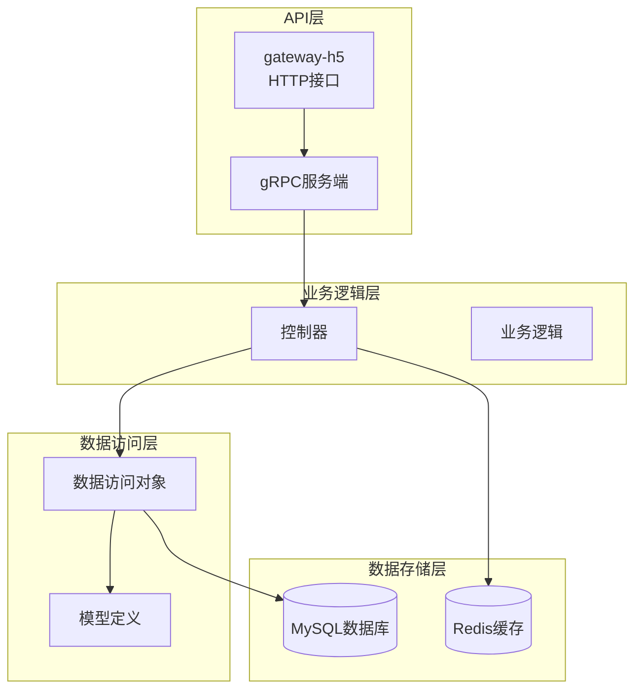
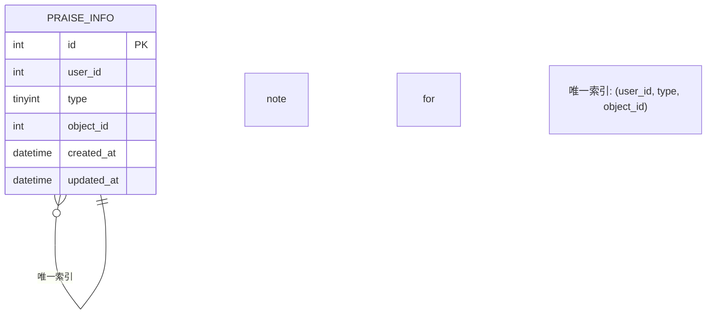
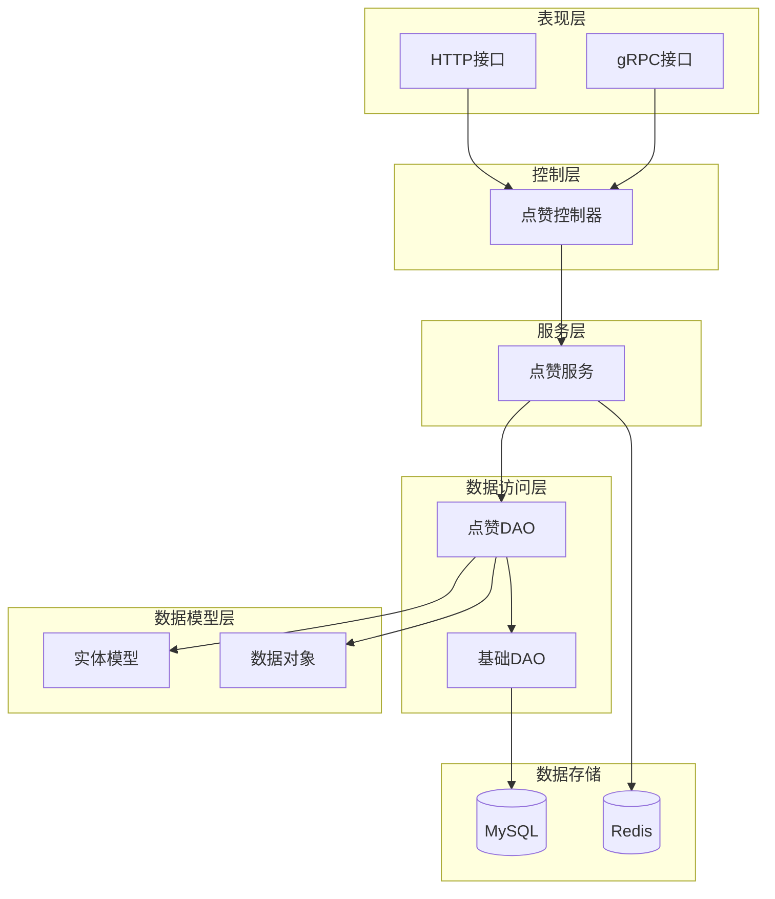
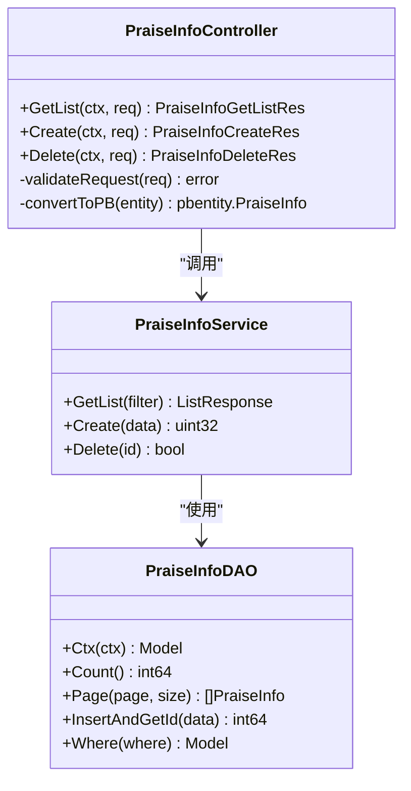
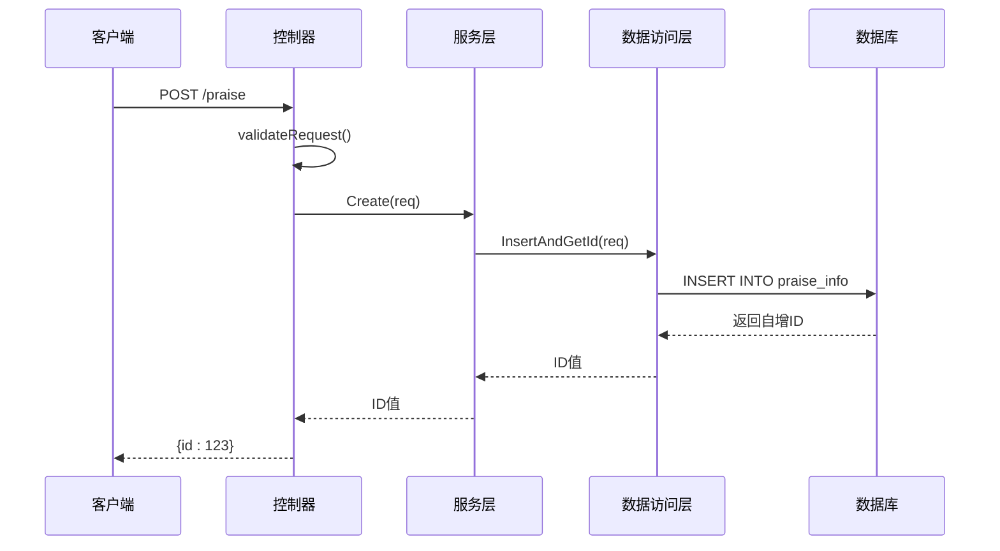
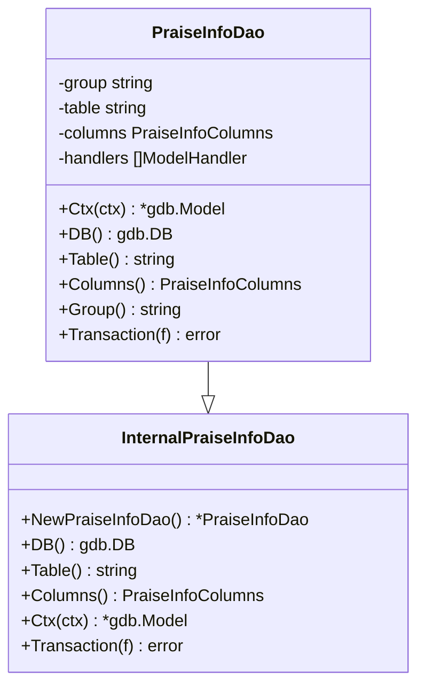
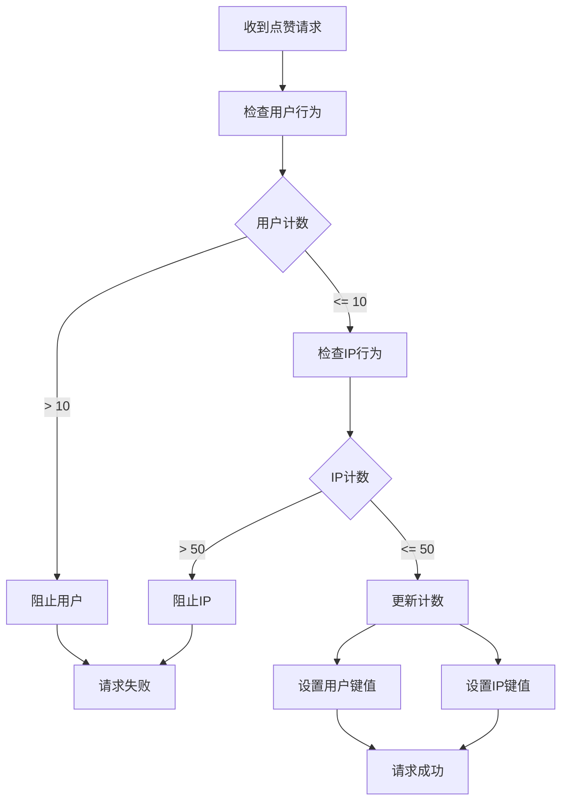
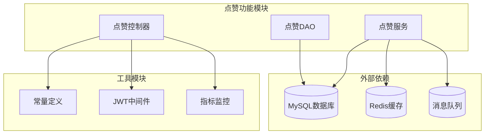

# 点赞功能系统

<cite>
**本文档引用的文件**
- [praise_info.go](file://app/interaction/internal/model/entity/praise_info.go)
- [praise_info.go](file://app/interaction/internal/model/do/praise_info.go)
- [praise_info.go](file://app/interaction/internal/dao/praise_info.go)
- [praise_info.go](file://app/interaction/internal/dao/internal/praise_info.go)
- [praise_info.go](file://app/interaction/internal/controller/praise_info/praise_info.go)
- [praise_info.go](file://app/gateway-h5/api/interaction/v1/praise_info.go)
- [praise_info.pb.go](file://app/interaction/api/pbentity/praise_info.pb.go)
- [praise_info.pb.go](file://app/interaction/api/praise_info/v1/praise_info.pb.go)
- [interaction.sql](file://app/interaction/hack/interaction.sql)
- [01_init.sql](file://init-db/01_init.sql)
- [consts.go](file://utility/consts/consts.go)
- [anti_brush.go](file://app/flash-sale/utility/anti_brush.go)
- [rate_limit.go](file://app/flash-sale/utility/rate_limit.go)
</cite>

## 目录
1. [简介](#简介)
2. [项目结构](#项目结构)
3. [核心组件](#核心组件)
4. [架构概览](#架构概览)
5. [详细组件分析](#详细组件分析)
6. [依赖关系分析](#依赖关系分析)
7. [性能考虑](#性能考虑)
8. [故障排除指南](#故障排除指南)
9. [结论](#结论)

## 简介

点赞功能系统是本微服务架构中的重要交互功能模块，为用户提供对商品和文章等内容的点赞能力。该系统采用GoFrame框架构建，实现了完整的点赞生命周期管理，包括点赞创建、取消、查询等核心功能。

系统的核心特点包括：
- **数据模型设计**：基于praise_info表的完整数据结构
- **去重机制**：通过数据库唯一索引确保用户对同一对象的点赞去重
- **类型扩展**：支持多种点赞类型（商品、文章等）
- **分页查询**：高效的分页数据检索
- **防刷机制**：集成限流和防刷策略
- **统一接口**：基于gRPC的标准化API设计

## 项目结构

点赞功能系统在项目中的组织结构如下：



**图表来源**
- [praise_info.go](file://app/interaction/internal/controller/praise_info/praise_info.go#L1-L107)
- [praise_info.go](file://app/interaction/internal/dao/praise_info.go#L1-L23)
- [praise_info.go](file://app/interaction/internal/model/entity/praise_info.go#L1-L20)

**章节来源**
- [praise_info.go](file://app/interaction/internal/controller/praise_info/praise_info.go#L1-L107)
- [praise_info.go](file://app/interaction/internal/dao/praise_info.go#L1-L23)
- [praise_info.go](file://app/interaction/internal/model/entity/praise_info.go#L1-L20)

## 核心组件

### 数据模型设计

点赞功能的核心数据模型基于以下结构：

| 字段名 | 类型 | 约束 | 描述 |
|--------|------|------|------|
| id | int | 主键, 自增 | 点赞记录ID |
| user_id | int | 非空 | 用户ID |
| type | tinyint | 非空, 1或2 | 点赞类型：1商品, 2文章 |
| object_id | int | 非空, 默认0 | 点赞对象ID |
| created_at | datetime | 可空 | 创建时间 |
| updated_at | datetime | 可空 | 更新时间 |

**章节来源**
- [praise_info.go](file://app/interaction/hack/interaction.sql#L35-L44)
- [praise_info.go](file://init-db/01_init.sql#L336-L344)
- [praise_info.go](file://app/interaction/internal/model/entity/praise_info.go#L11-L19)

### 去重机制

系统通过数据库层面的唯一约束实现点赞去重：



**图表来源**
- [praise_info.go](file://app/interaction/hack/interaction.sql#L43)
- [praise_info.go](file://init-db/01_init.sql#L344)

### API接口设计

系统提供RESTful风格的HTTP接口和gRPC服务接口：

#### HTTP接口规范

| 接口 | 方法 | 路径 | 功能描述 |
|------|------|------|----------|
| 创建点赞 | POST | `/praise` | 创建新的点赞记录 |
| 删除点赞 | DELETE | `/praise` | 删除指定的点赞记录 |
| 获取点赞列表 | GET | `/praise` | 分页获取点赞列表 |

**章节来源**
- [praise_info.go](file://app/gateway-h5/api/interaction/v1/praise_info.go#L8-L57)

## 架构概览

点赞功能系统采用分层架构设计，各层职责清晰分离：



**图表来源**
- [praise_info.go](file://app/interaction/internal/controller/praise_info/praise_info.go#L19-L25)
- [praise_info.go](file://app/interaction/internal/dao/praise_info.go#L13-L20)

## 详细组件分析

### 控制器组件

点赞控制器负责处理HTTP请求和gRPC调用：



**图表来源**
- [praise_info.go](file://app/interaction/internal/controller/praise_info/praise_info.go#L19-L25)
- [praise_info.go](file://app/interaction/internal/dao/praise_info.go#L13-L20)

#### 请求处理流程



**图表来源**
- [praise_info.go](file://app/interaction/internal/controller/praise_info/praise_info.go#L79-L92)

**章节来源**
- [praise_info.go](file://app/interaction/internal/controller/praise_info/praise_info.go#L27-L106)

### 数据访问对象

DAO层提供了对praise_info表的完整数据访问能力：



**图表来源**
- [praise_info.go](file://app/interaction/internal/dao/praise_info.go#L13-L20)
- [praise_info.go](file://app/interaction/internal/dao/internal/praise_info.go#L43-L81)

**章节来源**
- [praise_info.go](file://app/interaction/internal/dao/praise_info.go#L1-L23)
- [praise_info.go](file://app/interaction/internal/dao/internal/praise_info.go#L1-L81)

### 数据模型映射

系统采用了GoFrame框架的标准模型映射机制：

```mermaid
erDiagram
ENTITY_MODEL {
int id
int userId
int type
int objectId
gtime.Time createdAt
gtime.Time updatedAt
}
DO_MODEL {
interface id
interface userId
interface type
interface objectId
gtime.Time createdAt
gtime.Time updatedAt
}
PB_ENTITY {
int32 id
int32 userId
int32 type
int32 objectId
timestamppb Timestamp createdAt
timestamppb Timestamp updatedAt
}
ENTITY_MODEL ||--|| DO_MODEL : "Struct()"
DO_MODEL ||--|| PB_ENTITY : "Struct()"
```

**图表来源**
- [praise_info.go](file://app/interaction/internal/model/entity/praise_info.go#L11-L19)
- [praise_info.go](file://app/interaction/internal/model/do/praise_info.go#L12-L21)
- [praise_info.pb.go](file://app/interaction/api/pbentity/praise_info.pb.go#L33-L38)

**章节来源**
- [praise_info.go](file://app/interaction/internal/model/entity/praise_info.go#L1-L20)
- [praise_info.go](file://app/interaction/internal/model/do/praise_info.go#L1-L22)
- [praise_info.pb.go](file://app/interaction/api/pbentity/praise_info.pb.go#L1-L62)

### 防刷机制集成

系统集成了防刷和限流机制，防止恶意刷赞行为：



**图表来源**
- [anti_brush.go](file://app/flash-sale/utility/anti_brush.go#L24-L80)

**章节来源**
- [anti_brush.go](file://app/flash-sale/utility/anti_brush.go#L1-L81)
- [rate_limit.go](file://app/flash-sale/utility/rate_limit.go#L1-L161)

## 依赖关系分析

点赞功能系统与其他模块的依赖关系如下：



**图表来源**
- [praise_info.go](file://app/interaction/internal/controller/praise_info/praise_info.go#L3-L17)
- [consts.go](file://utility/consts/consts.go#L1-L47)

**章节来源**
- [praise_info.go](file://app/interaction/internal/controller/praise_info/praise_info.go#L1-L17)
- [consts.go](file://utility/consts/consts.go#L1-L47)

## 性能考虑

### 数据库优化

1. **索引设计**
   - 主键索引：`PRIMARY KEY (id)`
   - 唯一索引：`(user_id, type, object_id)` 确保点赞去重
   - 查询优化：针对常用查询条件建立合适的索引

2. **连接池配置**
   - 合理设置最大连接数
   - 连接超时时间配置
   - 连接复用策略

3. **查询优化**
   - 分页查询避免全表扫描
   - 批量操作减少数据库往返
   - 缓存热点数据

### 缓存策略

1. **热点数据缓存**
   - 热门内容的点赞统计
   - 用户点赞状态缓存
   - 排行榜数据缓存

2. **缓存更新策略**
   - 写后失效模式
   - 失效时间合理设置
   - 缓存穿透防护

### 并发控制

1. **事务管理**
   - 原子性操作保证
   - 死锁预防机制
   - 事务超时控制

2. **锁机制**
   - 行级锁使用
   - 锁粒度优化
   - 锁等待超时

## 故障排除指南

### 常见问题及解决方案

#### 1. 点赞重复问题

**问题现象**：用户重复点赞同一内容

**可能原因**：
- 唯一索引未生效
- 并发情况下数据竞争
- 业务逻辑错误

**解决方案**：
- 检查数据库唯一索引状态
- 实现幂等性设计
- 添加业务层去重检查

#### 2. 查询性能问题

**问题现象**：点赞列表查询响应缓慢

**可能原因**：
- 缺少必要的索引
- 查询条件不优化
- 数据量过大

**解决方案**：
- 添加复合索引 `(type, object_id, created_at)`
- 实现分页查询优化
- 考虑数据分表策略

#### 3. 数据一致性问题

**问题现象**：点赞数量统计不准确

**可能原因**：
- 异步操作导致的数据延迟
- 缓存与数据库不一致
- 事务边界设置不当

**解决方案**：
- 实现最终一致性机制
- 添加缓存一致性检查
- 优化事务处理逻辑

**章节来源**
- [praise_info.go](file://app/interaction/hack/interaction.sql#L43)
- [praise_info.go](file://init-db/01_init.sql#L344)

## 结论

点赞功能系统通过合理的架构设计和完善的实现方案，为用户提供了稳定可靠的点赞服务。系统的主要优势包括：

1. **架构清晰**：分层设计使得代码结构清晰，易于维护和扩展
2. **性能优化**：通过索引设计、缓存策略和并发控制保证了良好的性能表现
3. **可靠性保障**：完善的错误处理、事务管理和防刷机制确保了系统的稳定性
4. **扩展性强**：模块化设计支持功能的灵活扩展和定制

未来可以考虑的改进方向：
- 增加点赞历史追踪功能
- 实现点赞排行榜的实时更新
- 优化批量操作性能
- 增强数据分析和报表功能

该系统为整个微服务架构提供了坚实的基础，能够满足当前业务需求并支持未来的功能扩展。