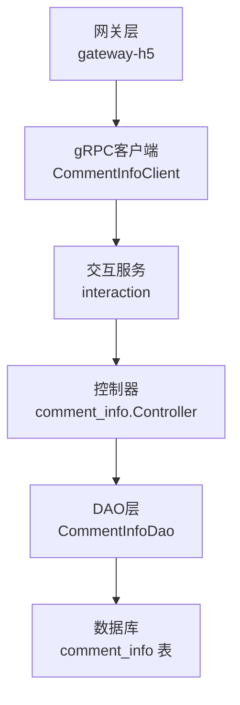
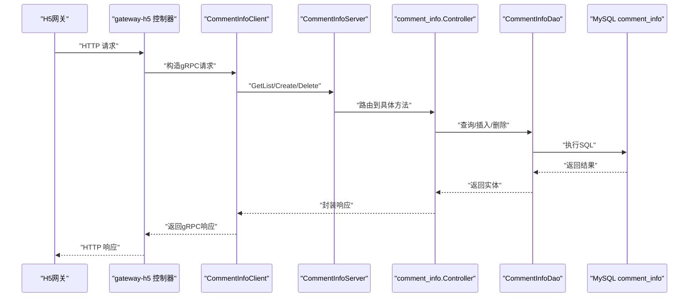
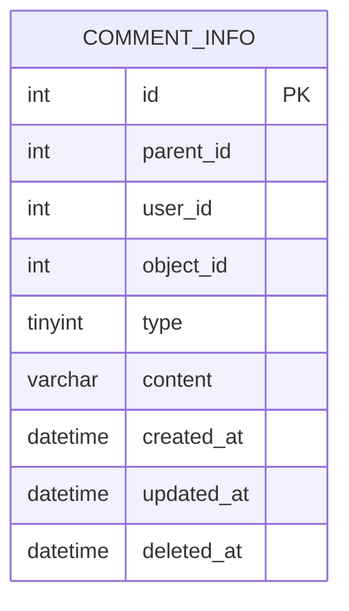
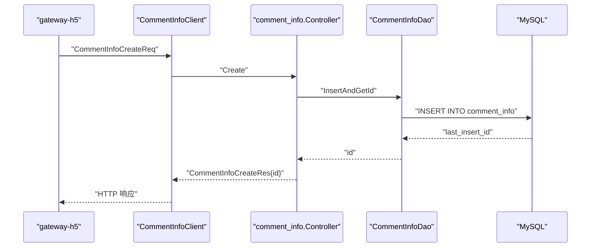
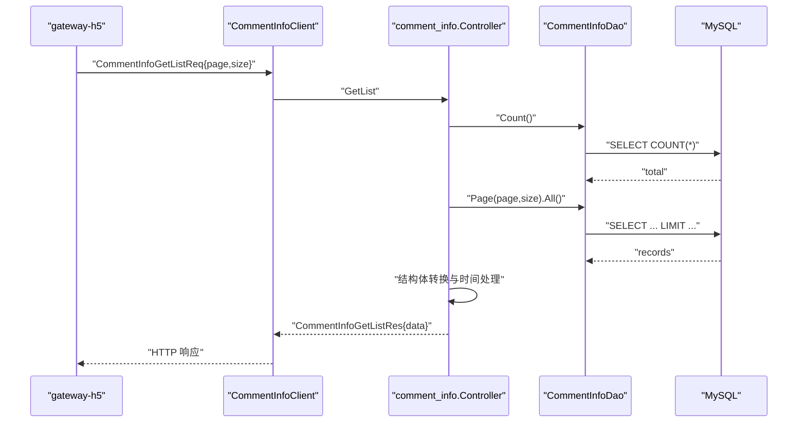
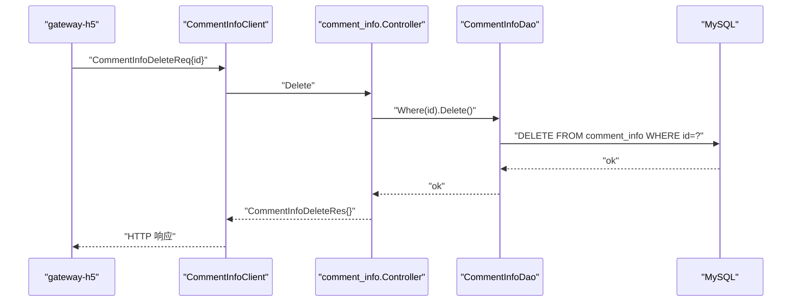
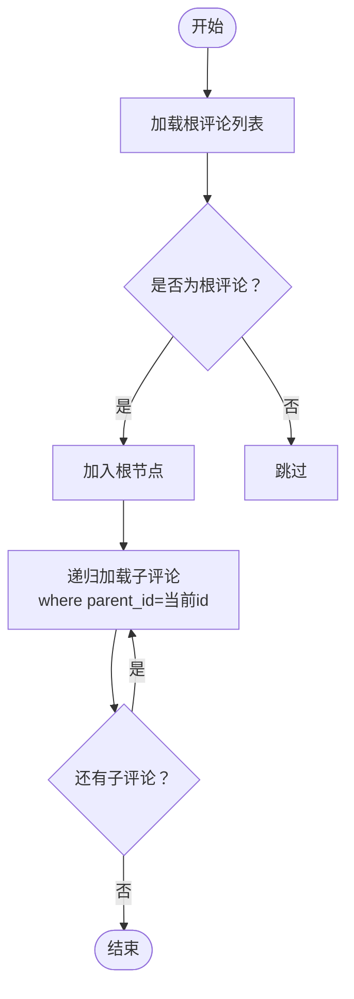
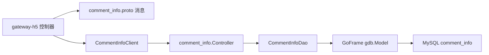

# 评价评论系统

<cite>
**本文引用的文件**
- [app/interaction/api/comment_info/v1/comment_info.proto](file://app/interaction/api/comment_info/v1/comment_info.proto)
- [app/interaction/api/comment_info/v1/comment_info.pb.go](file://app/interaction/api/comment_info/v1/comment_info.pb.go)
- [app/interaction/api/comment_info/v1/comment_info_grpc.pb.go](file://app/interaction/api/comment_info/v1/comment_info_grpc.pb.go)
- [app/interaction/internal/controller/comment_info/comment_info.go](file://app/interaction/internal/controller/comment_info/comment_info.go)
- [app/interaction/internal/dao/internal/comment_info.go](file://app/interaction/internal/dao/internal/comment_info.go)
- [app/interaction/internal/dao/comment_info.go](file://app/interaction/internal/dao/comment_info.go)
- [app/interaction/internal/model/entity/comment_info.go](file://app/interaction/internal/model/entity/comment_info.go)
- [app/interaction/internal/model/do/comment_info.go](file://app/interaction/internal/model/do/comment_info.go)
- [app/interaction/hack/interaction.sql](file://app/interaction/hack/interaction.sql)
- [app/gateway-h5/internal/controller/interaction/interaction_v1_comment_info_get_list.go](file://app/gateway-h5/internal/controller/interaction/interaction_v1_comment_info_get_list.go)
- [app/gateway-h5/internal/controller/interaction/interaction_v1_comment_info_create.go](file://app/gateway-h5/internal/controller/interaction/interaction_v1_comment_info_create.go)
- [app/gateway-h5/internal/controller/interaction/interaction_v1_comment_info_delete.go](file://app/gateway-h5/internal/controller/interaction/interaction_v1_comment_info_delete.go)
- [utility/consts/consts.go](file://utility/consts/consts.go)
</cite>

## 目录
1. [引言](#引言)
2. [项目结构](#项目结构)
3. [核心组件](#核心组件)
4. [架构总览](#架构总览)
5. [详细组件分析](#详细组件分析)
6. [依赖关系分析](#依赖关系分析)
7. [性能考虑](#性能考虑)
8. [故障排查指南](#故障排查指南)
9. [结论](#结论)
10. [附录](#附录)

## 引言
本文件面向“评价评论系统”的设计与实现，围绕评论创建、回复、删除、查询等核心功能进行深入解析，并补充评论审核机制、排序算法、与商品/用户的关联关系、评论图片处理、统计分析、举报机制、置顶、导出等高级能力的实现思路与落地路径。文档同时提供API接口定义、分页查询、内容过滤与权限控制的实现要点，帮助开发者快速理解与扩展该子系统。

## 项目结构
评价评论系统位于交互服务模块（interaction），采用GoFrame微服务框架，遵循“网关-服务”分层：
- 网关层（gateway-h5）：对外暴露HTTP接口，内部通过gRPC调用交互服务。
- 交互服务（interaction）：提供评论服务的gRPC实现，包含控制器、DAO、实体与数据模型。
- 数据层：MySQL表comment_info存储评论数据，含唯一索引约束防止重复评论。

图表来源
- [app/gateway-h5/internal/controller/interaction/interaction_v1_comment_info_get_list.go](file://app/gateway-h5/internal/controller/interaction/interaction_v1_comment_info_get_list.go#L1-L39)
- [app/gateway-h5/internal/controller/interaction/interaction_v1_comment_info_create.go](file://app/gateway-h5/internal/controller/interaction/interaction_v1_comment_info_create.go#L1-L25)
- [app/gateway-h5/internal/controller/interaction/interaction_v1_comment_info_delete.go](file://app/gateway-h5/internal/controller/interaction/interaction_v1_comment_info_delete.go#L1-L19)
- [app/interaction/internal/controller/comment_info/comment_info.go](file://app/interaction/internal/controller/comment_info/comment_info.go#L1-L107)
- [app/interaction/internal/dao/internal/comment_info.go](file://app/interaction/internal/dao/internal/comment_info.go#L1-L96)
- [app/interaction/hack/interaction.sql](file://app/interaction/hack/interaction.sql#L1-L72)

章节来源
- [app/interaction/api/comment_info/v1/comment_info.proto](file://app/interaction/api/comment_info/v1/comment_info.proto#L1-L50)
- [app/interaction/hack/interaction.sql](file://app/interaction/hack/interaction.sql#L1-L72)

## 核心组件
- gRPC服务定义与消息结构：服务名comment_info，提供GetList/Create/Delete三个方法；请求/响应消息包含分页参数、评论内容、父子评论关系等。
- 控制器：实现GetList/Create/Delete，负责错误码封装、日志记录与DAO调用。
- DAO层：封装comment_info表的访问，提供Ctx、Transaction等通用能力。
- 实体与DO：定义表结构映射，用于ORM与DAO操作。
- 网关适配：gateway-h5将HTTP请求转换为gRPC请求并返回。

章节来源
- [app/interaction/api/comment_info/v1/comment_info.proto](file://app/interaction/api/comment_info/v1/comment_info.proto#L9-L50)
- [app/interaction/internal/controller/comment_info/comment_info.go](file://app/interaction/internal/controller/comment_info/comment_info.go#L27-L107)
- [app/interaction/internal/dao/internal/comment_info.go](file://app/interaction/internal/dao/internal/comment_info.go#L14-L96)
- [app/interaction/internal/model/entity/comment_info.go](file://app/interaction/internal/model/entity/comment_info.go#L11-L22)
- [app/interaction/internal/model/do/comment_info.go](file://app/interaction/internal/model/do/comment_info.go#L12-L24)

## 架构总览
下图展示从网关到服务再到数据库的调用链路与职责边界：

图表来源
- [app/gateway-h5/internal/controller/interaction/interaction_v1_comment_info_get_list.go](file://app/gateway-h5/internal/controller/interaction/interaction_v1_comment_info_get_list.go#L11-L38)
- [app/gateway-h5/internal/controller/interaction/interaction_v1_comment_info_create.go](file://app/gateway-h5/internal/controller/interaction/interaction_v1_comment_info_create.go#L11-L24)
- [app/gateway-h5/internal/controller/interaction/interaction_v1_comment_info_delete.go](file://app/gateway-h5/internal/controller/interaction/interaction_v1_comment_info_delete.go#L10-L18)
- [app/interaction/api/comment_info/v1/comment_info_grpc.pb.go](file://app/interaction/api/comment_info/v1/comment_info_grpc.pb.go#L176-L198)
- [app/interaction/internal/controller/comment_info/comment_info.go](file://app/interaction/internal/controller/comment_info/comment_info.go#L27-L107)
- [app/interaction/internal/dao/internal/comment_info.go](file://app/interaction/internal/dao/internal/comment_info.go#L78-L85)

## 详细组件分析

### 数据模型与表结构
- 表comment_info包含主键id、父评论id(parent_id)、用户id(user_id)、对象id(object_id)、类型(type)、内容(content)及时间戳字段。
- 唯一索引覆盖user_id、object_id、type、content、parent_id，避免重复评论。
- 支持父子评论（回复）结构，通过parent_id建立层级关系。

图表来源
- [app/interaction/hack/interaction.sql](file://app/interaction/hack/interaction.sql#L6-L19)

章节来源
- [app/interaction/hack/interaction.sql](file://app/interaction/hack/interaction.sql#L6-L19)
- [app/interaction/internal/model/entity/comment_info.go](file://app/interaction/internal/model/entity/comment_info.go#L11-L22)
- [app/interaction/internal/model/do/comment_info.go](file://app/interaction/internal/model/do/comment_info.go#L12-L24)

### 评论创建（Create）
- 网关层接收HTTP请求，转换为gRPC请求。
- 服务端控制器调用DAO插入评论并返回自增ID。
- 错误统一通过常量封装并返回标准错误码。

图表来源
- [app/gateway-h5/internal/controller/interaction/interaction_v1_comment_info_create.go](file://app/gateway-h5/internal/controller/interaction/interaction_v1_comment_info_create.go#L11-L24)
- [app/interaction/internal/controller/comment_info/comment_info.go](file://app/interaction/internal/controller/comment_info/comment_info.go#L79-L92)
- [app/interaction/api/comment_info/v1/comment_info.proto](file://app/interaction/api/comment_info/v1/comment_info.proto#L15-L25)

章节来源
- [app/interaction/internal/controller/comment_info/comment_info.go](file://app/interaction/internal/controller/comment_info/comment_info.go#L79-L92)
- [app/gateway-h5/internal/controller/interaction/interaction_v1_comment_info_create.go](file://app/gateway-h5/internal/controller/interaction/interaction_v1_comment_info_create.go#L11-L24)
- [utility/consts/consts.go](file://utility/consts/consts.go#L9-L13)

### 评论查询（GetList）
- 支持分页查询：page、size。
- 先查总数，再按页查询数据，最后将实体转换为PB结构返回。
- 时间字段通过工具函数安全转换。

图表来源
- [app/gateway-h5/internal/controller/interaction/interaction_v1_comment_info_get_list.go](file://app/gateway-h5/internal/controller/interaction/interaction_v1_comment_info_get_list.go#L11-L38)
- [app/interaction/internal/controller/comment_info/comment_info.go](file://app/interaction/internal/controller/comment_info/comment_info.go#L27-L77)
- [app/interaction/api/comment_info/v1/comment_info.proto](file://app/interaction/api/comment_info/v1/comment_info.proto#L35-L49)

章节来源
- [app/interaction/internal/controller/comment_info/comment_info.go](file://app/interaction/internal/controller/comment_info/comment_info.go#L27-L77)
- [app/gateway-h5/internal/controller/interaction/interaction_v1_comment_info_get_list.go](file://app/gateway-h5/internal/controller/interaction/interaction_v1_comment_info_get_list.go#L11-L38)

### 评论删除（Delete）
- 根据id删除对应评论。
- 返回空响应表示删除成功。

图表来源
- [app/gateway-h5/internal/controller/interaction/interaction_v1_comment_info_delete.go](file://app/gateway-h5/internal/controller/interaction/interaction_v1_comment_info_delete.go#L10-L18)
- [app/interaction/internal/controller/comment_info/comment_info.go](file://app/interaction/internal/controller/comment_info/comment_info.go#L94-L106)
- [app/interaction/api/comment_info/v1/comment_info.proto](file://app/interaction/api/comment_info/v1/comment_info.proto#L27-L33)

章节来源
- [app/interaction/internal/controller/comment_info/comment_info.go](file://app/interaction/internal/controller/comment_info/comment_info.go#L94-L106)
- [app/gateway-h5/internal/controller/interaction/interaction_v1_comment_info_delete.go](file://app/gateway-h5/internal/controller/interaction/interaction_v1_comment_info_delete.go#L10-L18)

### 评论回复（父子评论）
- 通过parent_id实现回复关系，支持无限层级嵌套。
- 查询时可按parent_id筛选直接子评论，或在应用层组装树形结构。

图表来源
- [app/interaction/hack/interaction.sql](file://app/interaction/hack/interaction.sql#L6-L19)
- [app/interaction/internal/model/entity/comment_info.go](file://app/interaction/internal/model/entity/comment_info.go#L12-L21)

章节来源
- [app/interaction/hack/interaction.sql](file://app/interaction/hack/interaction.sql#L6-L19)
- [app/interaction/internal/model/entity/comment_info.go](file://app/interaction/internal/model/entity/comment_info.go#L12-L21)

### 评论审核机制
- 当前实现未包含审核字段与流程。建议在comment_info表新增status、reviewer、review_at等字段，并在Create/GetList流程中增加审核状态过滤与权限校验。

章节来源
- [app/interaction/hack/interaction.sql](file://app/interaction/hack/interaction.sql#L6-L19)

### 评论排序算法
- 默认按created_at倒序展示最新评论。
- 可扩展按“综合评分/点赞数/回复数”加权排序，需在GetList中增加排序条件与统计聚合。

章节来源
- [app/interaction/internal/controller/comment_info/comment_info.go](file://app/interaction/internal/controller/comment_info/comment_info.go#L48-L54)

### 评论与商品/用户关联
- object_id与type共同标识评论对象类型（如商品=1，文章=2）。
- user_id关联用户，用于权限控制与统计。

章节来源
- [app/interaction/hack/interaction.sql](file://app/interaction/hack/interaction.sql#L10-L12)
- [app/interaction/internal/model/entity/comment_info.go](file://app/interaction/internal/model/entity/comment_info.go#L13-L18)

### 评论图片处理
- 当前表结构仅包含文本内容。若需支持图片，可在comment_info表新增images JSON字段或独立评论图片表，并在Create流程中处理上传与回写。

章节来源
- [app/interaction/hack/interaction.sql](file://app/interaction/hack/interaction.sql#L12-L13)

### 评论统计分析
- 可基于object_id统计评论数量、平均分（需引入评分表）、优质评论占比等。
- 建议在DAO层增加聚合查询方法并在服务层提供统计接口。

章节来源
- [app/interaction/internal/dao/internal/comment_info.go](file://app/interaction/internal/dao/internal/comment_info.go#L78-L85)

### 评论举报机制
- 建议新增举报表与评论关联，包含举报类型、状态、处理结果等字段；在GetList中屏蔽已举报且未处理的评论。

章节来源
- [app/interaction/hack/interaction.sql](file://app/interaction/hack/interaction.sql#L6-L19)

### 评论置顶
- 建议新增top字段与置顶顺序字段，在GetList中优先返回置顶评论并按置顶顺序排序。

章节来源
- [app/interaction/hack/interaction.sql](file://app/interaction/hack/interaction.sql#L6-L19)

### 评论导出
- 提供管理员导出接口，按object_id与时间范围导出评论数据，支持CSV/Excel格式。

章节来源
- [app/interaction/internal/controller/comment_info/comment_info.go](file://app/interaction/internal/controller/comment_info/comment_info.go#L27-L77)

### 内容过滤与权限控制
- 内容过滤：在Create前对content进行敏感词检测与长度限制。
- 权限控制：Create/Delete需校验用户身份与评论归属（user_id），GetList可按对象维度做可见性控制。

章节来源
- [app/interaction/internal/controller/comment_info/comment_info.go](file://app/interaction/internal/controller/comment_info/comment_info.go#L79-L106)
- [utility/consts/consts.go](file://utility/consts/consts.go#L44-L46)

## 依赖关系分析
- 网关层依赖gRPC客户端与PB消息结构。
- 服务层控制器依赖DAO与实体模型。
- DAO层依赖GoFrame数据库ORM与上下文。
- PB消息定义驱动gRPC服务契约。

图表来源
- [app/interaction/api/comment_info/v1/comment_info.proto](file://app/interaction/api/comment_info/v1/comment_info.proto#L1-L50)
- [app/interaction/internal/controller/comment_info/comment_info.go](file://app/interaction/internal/controller/comment_info/comment_info.go#L1-L17)
- [app/interaction/internal/dao/internal/comment_info.go](file://app/interaction/internal/dao/internal/comment_info.go#L78-L85)

章节来源
- [app/interaction/api/comment_info/v1/comment_info.proto](file://app/interaction/api/comment_info/v1/comment_info.proto#L1-L50)
- [app/interaction/internal/controller/comment_info/comment_info.go](file://app/interaction/internal/controller/comment_info/comment_info.go#L1-L17)
- [app/interaction/internal/dao/internal/comment_info.go](file://app/interaction/internal/dao/internal/comment_info.go#L1-L96)

## 性能考虑
- 分页查询：合理设置page与size，避免超大offset；必要时引入基于游标的分页。
- 索引优化：为object_id、type、user_id、parent_id建立复合索引以提升查询效率。
- 缓存策略：热点商品评论列表可引入Redis缓存，设置合理TTL。
- 并发控制：批量导入/导出场景使用限流与异步任务。

## 故障排查指南
- 常见错误码封装：GetList/Create/Delete失败均通过统一常量生成错误信息，便于定位。
- 日志记录：控制器中对数据库操作异常进行日志输出，便于排查。
- 建议：增加更细粒度的错误码与可观测性指标（耗时、QPS、错误率）。

章节来源
- [utility/consts/consts.go](file://utility/consts/consts.go#L4-L46)
- [app/interaction/internal/controller/comment_info/comment_info.go](file://app/interaction/internal/controller/comment_info/comment_info.go#L37-L43)
- [app/interaction/internal/controller/comment_info/comment_info.go](file://app/interaction/internal/controller/comment_info/comment_info.go#L86-L88)
- [app/interaction/internal/controller/comment_info/comment_info.go](file://app/interaction/internal/controller/comment_info/comment_info.go#L99-L102)

## 结论
当前评价评论系统已完成基础的评论创建、查询与删除能力，具备良好的扩展空间。后续建议优先补齐审核、举报、置顶、导出、图片与统计分析等高级能力，并完善内容过滤与权限控制，以满足电商场景下的复杂需求。

## 附录

### API接口定义（概要）
- GetList
  - 方法：GET/POST
  - 请求：page、size
  - 响应：data.list、data.page、data.size、data.total
- Create
  - 方法：POST
  - 请求：object_id、type、parent_id、content
  - 响应：id
- Delete
  - 方法：DELETE
  - 请求：id
  - 响应：空

章节来源
- [app/interaction/api/comment_info/v1/comment_info.proto](file://app/interaction/api/comment_info/v1/comment_info.proto#L9-L50)
- [app/interaction/api/comment_info/v1/comment_info.pb.go](file://app/interaction/api/comment_info/v1/comment_info.pb.go#L31-L120)
- [app/interaction/api/comment_info/v1/comment_info_grpc.pb.go](file://app/interaction/api/comment_info/v1/comment_info_grpc.pb.go#L176-L198)