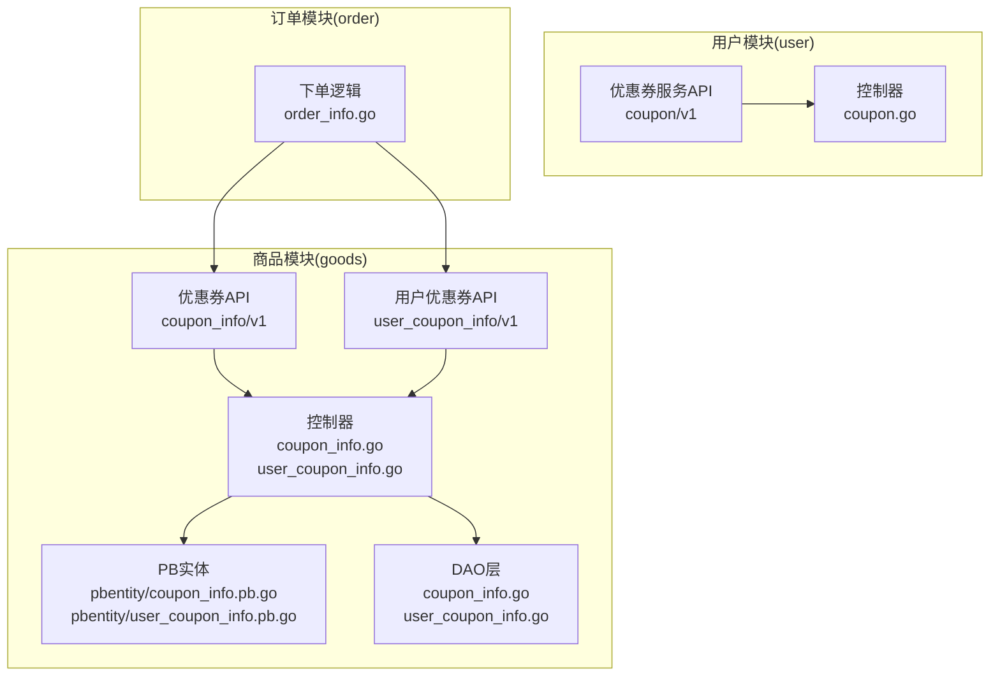
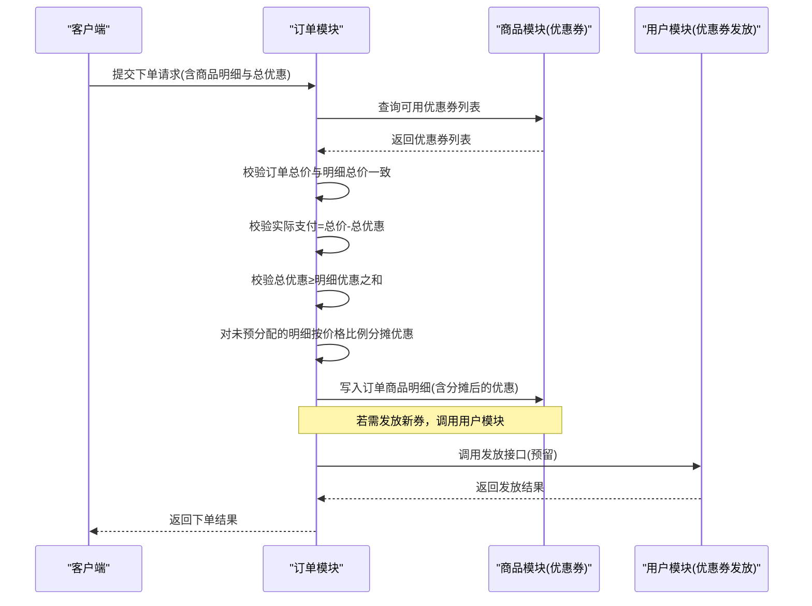
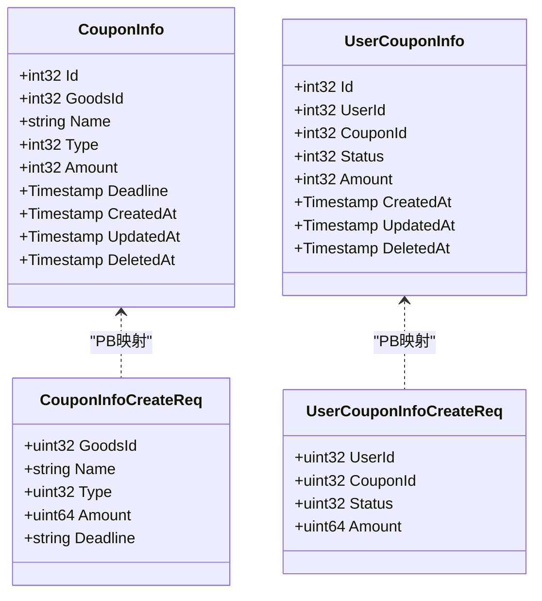
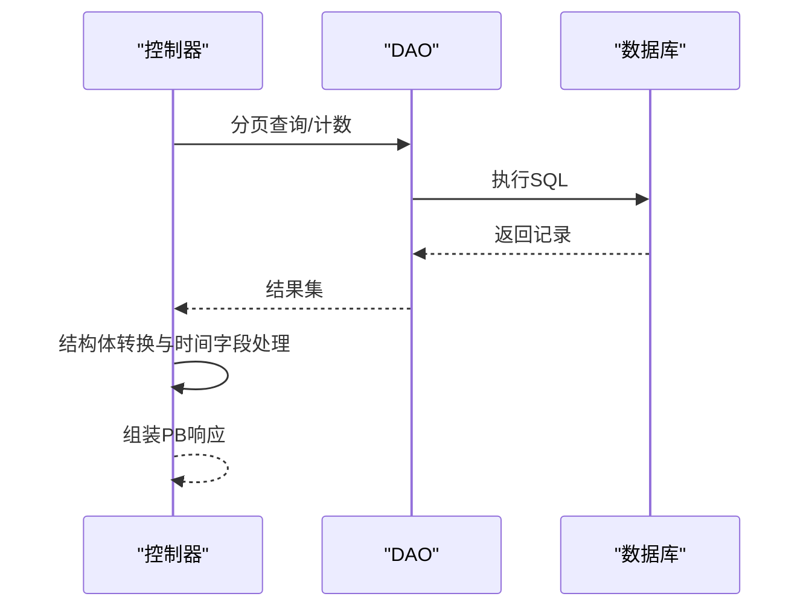
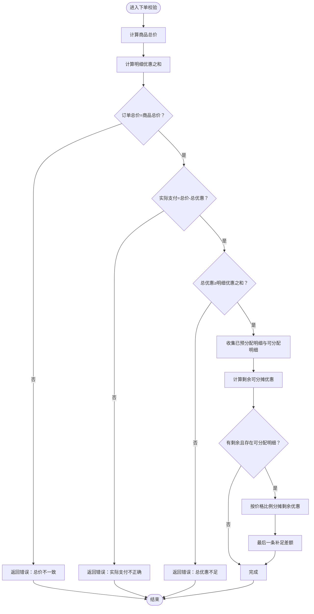
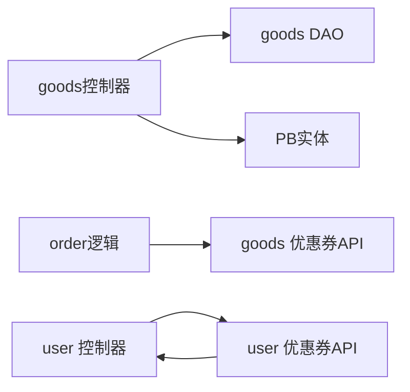

# 优惠券集成

<cite>
**本文引用的文件**
- [app/goods/api/coupon_info/v1/coupon_info.pb.go](file://app/goods/api/coupon_info/v1/coupon_info.pb.go)
- [app/goods/api/user_coupon_info/v1/user_coupon_info.pb.go](file://app/goods/api/user_coupon_info/v1/user_coupon_info.pb.go)
- [app/user/api/coupon/v1/coupon.pb.go](file://app/user/api/coupon/v1/coupon.pb.go)
- [app/goods/api/pbentity/coupon_info.pb.go](file://app/goods/api/pbentity/coupon_info.pb.go)
- [app/goods/api/pbentity/user_coupon_info.pb.go](file://app/goods/api/pbentity/user_coupon_info.pb.go)
- [app/goods/internal/dao/coupon_info.go](file://app/goods/internal/dao/coupon_info.go)
- [app/goods/internal/dao/user_coupon_info.go](file://app/goods/internal/dao/user_coupon_info.go)
- [app/goods/internal/controller/coupon_info/coupon_info.go](file://app/goods/internal/controller/coupon_info/coupon_info.go)
- [app/goods/internal/controller/user_coupon_info/user_coupon_info.go](file://app/goods/internal/controller/user_coupon_info/user_coupon_info.go)
- [app/user/internal/controller/coupon/coupon.go](file://app/user/internal/controller/coupon/coupon.go)
- [app/goods/internal/model/entity/coupon_info.go](file://app/goods/internal/model/entity/coupon_info.go)
- [app/goods/internal/model/entity/user_coupon_info.go](file://app/goods/internal/model/entity/user_coupon_info.go)
- [app/order/internal/logic/order_info/order_info.go](file://app/order/internal/logic/order_info/order_info.go)
</cite>

## 目录
1. [简介](#简介)
2. [项目结构](#项目结构)
3. [核心组件](#核心组件)
4. [架构总览](#架构总览)
5. [详细组件分析](#详细组件分析)
6. [依赖分析](#依赖分析)
7. [性能考虑](#性能考虑)
8. [故障排查指南](#故障排查指南)
9. [结论](#结论)
10. [附录](#附录)

## 简介
本文件面向“优惠券集成”功能，系统化阐述优惠券在商品购买流程中的应用，包括优惠券查询、使用规则验证、优惠金额计算、发放与使用记录追踪、统计分析等能力。文档覆盖数据模型设计（优惠券类型、使用条件、有效期、适用范围）、与商品价格的计算关系、多张优惠券的叠加规则与限制、以及API接口与配置参数说明，并通过序列图与类图展示关键流程与代码结构。

## 项目结构
优惠券相关能力由多个模块协同实现：
- 商品侧（goods）：提供优惠券基础信息管理（创建、查询、更新、删除），以及用户持有优惠券的管理。
- 用户侧（user）：提供优惠券发放服务接口（当前未实现，预留扩展）。
- 订单侧（order）：在下单流程中对优惠券进行校验与分摊计算，确保订单金额与优惠一致。

图表来源
- [app/goods/api/coupon_info/v1/coupon_info.pb.go](file://app/goods/api/coupon_info/v1/coupon_info.pb.go#L554-L558)
- [app/goods/api/user_coupon_info/v1/user_coupon_info.pb.go](file://app/goods/api/user_coupon_info/v1/user_coupon_info.pb.go#L543-L548)
- [app/user/api/coupon/v1/coupon.pb.go](file://app/user/api/coupon/v1/coupon.pb.go#L157-L159)
- [app/goods/internal/controller/coupon_info/coupon_info.go](file://app/goods/internal/controller/coupon_info/coupon_info.go#L23-L25)
- [app/goods/internal/controller/user_coupon_info/user_coupon_info.go](file://app/goods/internal/controller/user_coupon_info/user_coupon_info.go#L23-L25)
- [app/user/internal/controller/coupon/coupon.go](file://app/user/internal/controller/coupon/coupon.go#L16-L18)
- [app/order/internal/logic/order_info/order_info.go](file://app/order/internal/logic/order_info/order_info.go#L32-L103)

章节来源
- [app/goods/api/coupon_info/v1/coupon_info.pb.go](file://app/goods/api/coupon_info/v1/coupon_info.pb.go#L554-L558)
- [app/goods/api/user_coupon_info/v1/user_coupon_info.pb.go](file://app/goods/api/user_coupon_info/v1/user_coupon_info.pb.go#L543-L548)
- [app/user/api/coupon/v1/coupon.pb.go](file://app/user/api/coupon/v1/coupon.pb.go#L157-L159)
- [app/goods/internal/controller/coupon_info/coupon_info.go](file://app/goods/internal/controller/coupon_info/coupon_info.go#L23-L25)
- [app/goods/internal/controller/user_coupon_info/user_coupon_info.go](file://app/goods/internal/controller/user_coupon_info/user_coupon_info.go#L23-L25)
- [app/user/internal/controller/coupon/coupon.go](file://app/user/internal/controller/coupon/coupon.go#L16-L18)
- [app/order/internal/logic/order_info/order_info.go](file://app/order/internal/logic/order_info/order_info.go#L32-L103)

## 核心组件
- 优惠券基础信息（商品侧）
  - 接口：GetList、Create、Update、Delete
  - 实体：CouponInfo（含id、关联商品、名称、类型、金额、有效期、创建/更新/删除时间）
- 用户持有优惠券（商品侧）
  - 接口：GetList、Create、Update、Delete
  - 实体：UserCouponInfo（含用户id、优惠券id、状态、金额、创建/更新/删除时间）
- 优惠券发放服务（用户侧）
  - 接口：CreateUserCoupon（当前返回未实现）
- 订单侧校验与分摊
  - 校验订单总价与商品总价一致、实际支付价格与优惠一致、优惠总和不得小于明细优惠之和
  - 对未预分配的明细按价格比例进行优惠分摊

章节来源
- [app/goods/api/coupon_info/v1/coupon_info.pb.go](file://app/goods/api/coupon_info/v1/coupon_info.pb.go#L27-L101)
- [app/goods/api/pbentity/coupon_info.pb.go](file://app/goods/api/pbentity/coupon_info.pb.go#L31-L44)
- [app/goods/api/user_coupon_info/v1/user_coupon_info.pb.go](file://app/goods/api/user_coupon_info/v1/user_coupon_info.pb.go#L26-L92)
- [app/goods/api/pbentity/user_coupon_info.pb.go](file://app/goods/api/pbentity/user_coupon_info.pb.go#L24-L36)
- [app/user/api/coupon/v1/coupon.pb.go](file://app/user/api/coupon/v1/coupon.pb.go#L25-L91)
- [app/order/internal/logic/order_info/order_info.go](file://app/order/internal/logic/order_info/order_info.go#L32-L103)

## 架构总览
优惠券在购买流程中的关键交互如下：

图表来源
- [app/order/internal/logic/order_info/order_info.go](file://app/order/internal/logic/order_info/order_info.go#L32-L103)
- [app/goods/api/coupon_info/v1/coupon_info.pb.go](file://app/goods/api/coupon_info/v1/coupon_info.pb.go#L554-L558)
- [app/user/api/coupon/v1/coupon.pb.go](file://app/user/api/coupon/v1/coupon.pb.go#L157-L159)

## 详细组件分析

### 数据模型设计
- 优惠券基础信息（CouponInfo）
  - 字段要点：关联商品（0表示全场通用）、类型（新人券/活动券/其他）、金额（分）、有效期、软删除时间
  - 适用范围：可用于判断是否适用于某商品或全场
- 用户持有优惠券（UserCouponInfo）
  - 字段要点：用户id、优惠券id、状态（待使用/已使用/已过期）、金额（分）、软删除时间
  - 状态机：待使用→已使用；过期时间到达后标记为已过期

图表来源
- [app/goods/api/pbentity/coupon_info.pb.go](file://app/goods/api/pbentity/coupon_info.pb.go#L31-L44)
- [app/goods/api/coupon_info/v1/coupon_info.pb.go](file://app/goods/api/coupon_info/v1/coupon_info.pb.go#L27-L101)
- [app/goods/api/pbentity/user_coupon_info.pb.go](file://app/goods/api/pbentity/user_coupon_info.pb.go#L24-L36)
- [app/goods/api/user_coupon_info/v1/user_coupon_info.pb.go](file://app/goods/api/user_coupon_info/v1/user_coupon_info.pb.go#L26-L92)

章节来源
- [app/goods/api/pbentity/coupon_info.pb.go](file://app/goods/api/pbentity/coupon_info.pb.go#L31-L44)
- [app/goods/api/pbentity/user_coupon_info.pb.go](file://app/goods/api/pbentity/user_coupon_info.pb.go#L24-L36)
- [app/goods/api/coupon_info/v1/coupon_info.pb.go](file://app/goods/api/coupon_info/v1/coupon_info.pb.go#L27-L101)
- [app/goods/api/user_coupon_info/v1/user_coupon_info.pb.go](file://app/goods/api/user_coupon_info/v1/user_coupon_info.pb.go#L26-L92)

### 控制器与DAO层
- 商品模块控制器
  - 提供优惠券列表查询、创建、更新、删除；用户优惠券列表查询、创建、更新、删除
  - 统一错误包装与日志记录
- DAO层
  - 基于内部DAO对象封装，提供分页查询、计数、插入、更新、删除等操作
- 用户模块控制器
  - 提供优惠券发放服务接口（当前返回未实现）

图表来源
- [app/goods/internal/controller/coupon_info/coupon_info.go](file://app/goods/internal/controller/coupon_info/coupon_info.go#L27-L78)
- [app/goods/internal/controller/user_coupon_info/user_coupon_info.go](file://app/goods/internal/controller/user_coupon_info/user_coupon_info.go#L27-L78)
- [app/goods/internal/dao/coupon_info.go](file://app/goods/internal/dao/coupon_info.go#L13-L20)
- [app/goods/internal/dao/user_coupon_info.go](file://app/goods/internal/dao/user_coupon_info.go#L13-L20)

章节来源
- [app/goods/internal/controller/coupon_info/coupon_info.go](file://app/goods/internal/controller/coupon_info/coupon_info.go#L27-L119)
- [app/goods/internal/controller/user_coupon_info/user_coupon_info.go](file://app/goods/internal/controller/user_coupon_info/user_coupon_info.go#L27-L119)
- [app/goods/internal/dao/coupon_info.go](file://app/goods/internal/dao/coupon_info.go#L13-L20)
- [app/goods/internal/dao/user_coupon_info.go](file://app/goods/internal/dao/user_coupon_info.go#L13-L20)
- [app/user/internal/controller/coupon/coupon.go](file://app/user/internal/controller/coupon/coupon.go#L20-L22)

### 订单侧优惠券校验与分摊
- 校验逻辑
  - 订单总价=商品总价
  - 实际支付=订单总价-总优惠
  - 总优惠≥各明细优惠之和
- 分摊逻辑
  - 已预分配的明细不再参与分摊
  - 未预分配明细按价格比例分摊剩余优惠，最后一条明细补足差额

图表来源
- [app/order/internal/logic/order_info/order_info.go](file://app/order/internal/logic/order_info/order_info.go#L32-L103)

章节来源
- [app/order/internal/logic/order_info/order_info.go](file://app/order/internal/logic/order_info/order_info.go#L32-L103)

### API接口定义与配置参数
- 商品模块-优惠券基础信息
  - GetList：分页查询，返回列表、页码、大小、总数
  - Create：创建，返回新增id
  - Update：更新，返回id
  - Delete：删除，无返回内容
  - 请求/响应消息包含：关联商品、名称、类型、金额、有效期等
- 商品模块-用户优惠券
  - GetList：按用户id分页查询，返回列表、页码、大小、总数
  - Create/Update/Delete：同上
  - 请求/响应消息包含：用户id、优惠券id、状态、金额等
- 用户模块-优惠券发放
  - CreateUserCoupon：预留接口，当前返回未实现
- 配置参数说明
  - 金额统一以“分”为单位
  - 有效期采用时间戳格式
  - 关联商品id=0表示全场通用

章节来源
- [app/goods/api/coupon_info/v1/coupon_info.pb.go](file://app/goods/api/coupon_info/v1/coupon_info.pb.go#L147-L197)
- [app/goods/api/coupon_info/v1/coupon_info.pb.go](file://app/goods/api/coupon_info/v1/coupon_info.pb.go#L199-L281)
- [app/goods/api/user_coupon_info/v1/user_coupon_info.pb.go](file://app/goods/api/user_coupon_info/v1/user_coupon_info.pb.go#L138-L196)
- [app/goods/api/user_coupon_info/v1/user_coupon_info.pb.go](file://app/goods/api/user_coupon_info/v1/user_coupon_info.pb.go#L198-L272)
- [app/user/api/coupon/v1/coupon.pb.go](file://app/user/api/coupon/v1/coupon.pb.go#L25-L91)

## 依赖分析
- 控制器依赖DAO与PB实体，DAO依赖内部DAO生成器
- 订单模块依赖商品模块提供的优惠券查询接口
- 用户模块提供优惠券发放服务接口（当前未实现）

图表来源
- [app/goods/internal/controller/coupon_info/coupon_info.go](file://app/goods/internal/controller/coupon_info/coupon_info.go#L19-L25)
- [app/goods/internal/dao/coupon_info.go](file://app/goods/internal/dao/coupon_info.go#L13-L20)
- [app/order/internal/logic/order_info/order_info.go](file://app/order/internal/logic/order_info/order_info.go#L32-L103)
- [app/user/internal/controller/coupon/coupon.go](file://app/user/internal/controller/coupon/coupon.go#L12-L18)

章节来源
- [app/goods/internal/controller/coupon_info/coupon_info.go](file://app/goods/internal/controller/coupon_info/coupon_info.go#L19-L25)
- [app/goods/internal/dao/coupon_info.go](file://app/goods/internal/dao/coupon_info.go#L13-L20)
- [app/order/internal/logic/order_info/order_info.go](file://app/order/internal/logic/order_info/order_info.go#L32-L103)
- [app/user/internal/controller/coupon/coupon.go](file://app/user/internal/controller/coupon/coupon.go#L12-L18)

## 性能考虑
- 分页查询：列表接口支持分页，避免一次性加载大量数据
- 时间字段转换：控制器中对时间字段进行安全转换，减少序列化开销
- 优惠分摊：按价格比例分摊时使用大整型计算，避免溢出并保证精度
- 未实现接口：用户模块的发放接口当前返回未实现，避免无效调用带来的资源消耗

## 故障排查指南
- 数据库操作错误
  - 控制器统一捕获数据库错误并返回标准化错误码
  - 建议检查DAO层SQL执行与表结构一致性
- 订单校验失败
  - 检查商品明细总价与订单总价是否一致
  - 检查总优惠与明细优惠之和的关系
  - 检查是否存在未预分配明细但仍有剩余优惠的情况
- 发放接口未实现
  - 当前返回未实现错误，需在用户模块完善发放逻辑

章节来源
- [app/goods/internal/controller/coupon_info/coupon_info.go](file://app/goods/internal/controller/coupon_info/coupon_info.go#L41-L44)
- [app/goods/internal/controller/user_coupon_info/user_coupon_info.go](file://app/goods/internal/controller/user_coupon_info/user_coupon_info.go#L42-L44)
- [app/order/internal/logic/order_info/order_info.go](file://app/order/internal/logic/order_info/order_info.go#L42-L51)
- [app/user/internal/controller/coupon/coupon.go](file://app/user/internal/controller/coupon/coupon.go#L20-L22)

## 结论
本优惠券集成方案以清晰的模块边界与PB接口定义为基础，实现了优惠券的基础管理、用户持有管理与订单侧的严格校验与分摊。当前用户模块的发放接口处于预留状态，后续可在此基础上扩展发放策略与风控校验，以满足更复杂的业务场景。

## 附录
- 使用示例（流程示意）
  - 商品侧：创建优惠券→查询列表→更新/删除
  - 用户侧：预留发放接口（待实现）
  - 订单侧：下单时查询可用券→校验与分摊→写入明细
- 扩展建议
  - 发放机制：引入发放规则（限领、限用、定向发放）
  - 使用记录：增加使用流水表，记录使用时间、订单号、商品维度
  - 统计分析：按类型、时间、商品维度统计核销率、收益等指标