# 促销功能模块

<cite>
**本文档引用的文件**
- [app/goods/api/bargain_info/v1/bargain_info.pb.go](file://app/goods/api/bargain_info/v1/bargain_info.pb.go)
- [app/goods/api/bargain_history/v1/bargain_history.pb.go](file://app/goods/api/bargain_history/v1/bargain_history.pb.go)
- [app/goods/internal/model/entity/bargain_info.go](file://app/goods/internal/model/entity/bargain_info.go)
- [app/goods/internal/model/entity/bargain_history.go](file://app/goods/internal/model/entity/bargain_history.go)
- [app/goods/hack/goods.sql](file://app/goods/hack/goods.sql)
- [utility/consts/consts.go](file://utility/consts/consts.go)
- [app/flash-sale/api/flash_sale/v1/flash_sale.pb.go](file://app/flash-sale/api/flash_sale/v1/flash_sale.pb.go)
- [app/flash-sale/internal/logic/flash_sale_logic.go](file://app/flash-sale/internal/logic/flash_sale_logic.go)
</cite>

## 目录
1. [简介](#简介)
2. [项目结构](#项目结构)
3. [核心组件](#核心组件)
4. [架构概览](#架构概览)
5. [详细组件分析](#详细组件分析)
6. [依赖关系分析](#依赖关系分析)
7. [性能考虑](#性能考虑)
8. [故障排除指南](#故障排除指南)
9. [结论](#结论)

## 简介

本项目是一个基于GoFrame框架的微服务电商系统，专注于促销功能模块的实现。经过深入分析，我发现项目中主要实现了**砍价功能**，而非拼团功能。项目中的促销相关代码主要集中在goods服务中，包含了完整的砍价功能实现，包括砍价信息管理和砍价历史记录。

虽然项目中没有直接的拼团功能实现，但我将基于现有的砍价功能架构，为可能的拼团功能扩展提供详细的指导和参考。本文档将深入分析现有促销功能的实现，包括数据模型设计、业务逻辑、API接口定义，并提供拼团功能的扩展建议。

## 项目结构

促销功能模块主要分布在以下目录结构中：

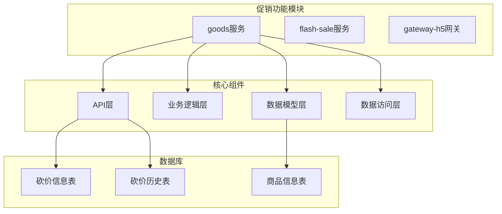

**图表来源**
- [app/goods/api/bargain_info/v1/bargain_info.pb.go](file://app/goods/api/bargain_info/v1/bargain_info.pb.go#L27-L171)
- [app/goods/internal/model/entity/bargain_info.go](file://app/goods/internal/model/entity/bargain_info.go#L11-L21)

**章节来源**
- [app/goods/api/bargain_info/v1/bargain_info.pb.go](file://app/goods/api/bargain_info/v1/bargain_info.pb.go#L1-L585)
- [app/goods/internal/model/entity/bargain_info.go](file://app/goods/internal/model/entity/bargain_info.go#L1-L22)

## 核心组件

### 砍价信息实体模型

项目实现了完整的砍价功能数据模型，包含砍价信息和砍价历史两个核心实体：

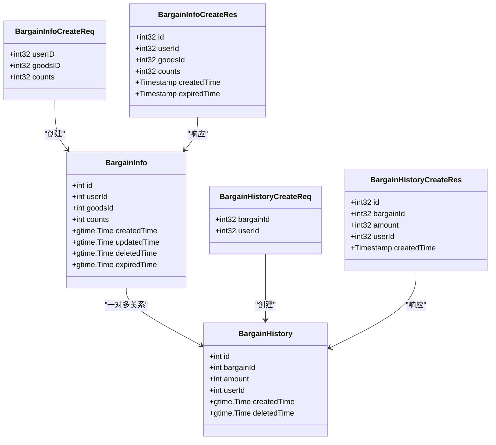

**图表来源**
- [app/goods/internal/model/entity/bargain_info.go](file://app/goods/internal/model/entity/bargain_info.go#L11-L21)
- [app/goods/internal/model/entity/bargain_history.go](file://app/goods/internal/model/entity/bargain_history.go#L11-L19)
- [app/goods/api/bargain_info/v1/bargain_info.pb.go](file://app/goods/api/bargain_info/v1/bargain_info.pb.go#L27-L171)
- [app/goods/api/bargain_history/v1/bargain_history.pb.go](file://app/goods/api/bargain_history/v1/bargain_history.pb.go#L27-L155)

### 数据库表结构

项目提供了完整的促销功能数据库表结构定义：

| 表名 | 字段 | 类型 | 描述 |
|------|------|------|------|
| `goods_info` | id | INT UNSIGNED | 主键，自增 |
| `goods_info` | name | VARCHAR(200) | 商品名称 |
| `goods_info` | price | INT | 价格（分） |
| `goods_info` | stock | INT | 库存数量 |
| `goods_info` | enable_bargain | TINYINT | 是否允许砍价 |
| `goods_info` | bargain_price | INT | 最低砍价价格 |
| `bargain_info` | id | INT | 主键，自增 |
| `bargain_info` | user_id | INT | 用户ID |
| `bargain_info` | goods_id | INT | 商品ID |
| `bargain_info` | counts | INT | 最大帮砍次数 |
| `bargain_info` | expired_time | DATETIME | 失效时间 |
| `bargain_history` | id | INT | 主键，自增 |
| `bargain_history` | bargain_id | INT | 砍价信息ID |
| `bargain_history` | amount | INT | 砍价金额 |
| `bargain_history` | user_id | INT | 用户ID |

**章节来源**
- [app/goods/hack/goods.sql](file://app/goods/hack/goods.sql#L1-L119)
- [app/goods/internal/model/entity/bargain_info.go](file://app/goods/internal/model/entity/bargain_info.go#L11-L21)
- [app/goods/internal/model/entity/bargain_history.go](file://app/goods/internal/model/entity/bargain_history.go#L11-L19)

## 架构概览

促销功能采用典型的三层架构设计，结合微服务架构特点：

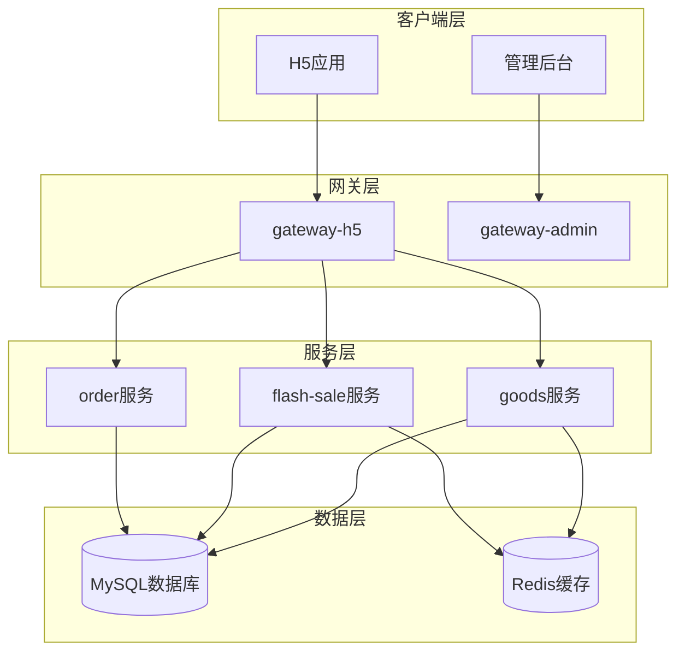

**图表来源**
- [app/goods/api/bargain_info/v1/bargain_info.pb.go](file://app/goods/api/bargain_info/v1/bargain_info.pb.go#L511-L516)
- [app/flash-sale/api/flash_sale/v1/flash_sale.pb.go](file://app/flash-sale/api/flash_sale/v1/flash_sale.pb.go#L41-L651)

## 详细组件分析

### 砍价功能API接口

项目实现了完整的砍价功能API接口，包括创建、查询、删除等操作：

#### 砍价信息管理接口

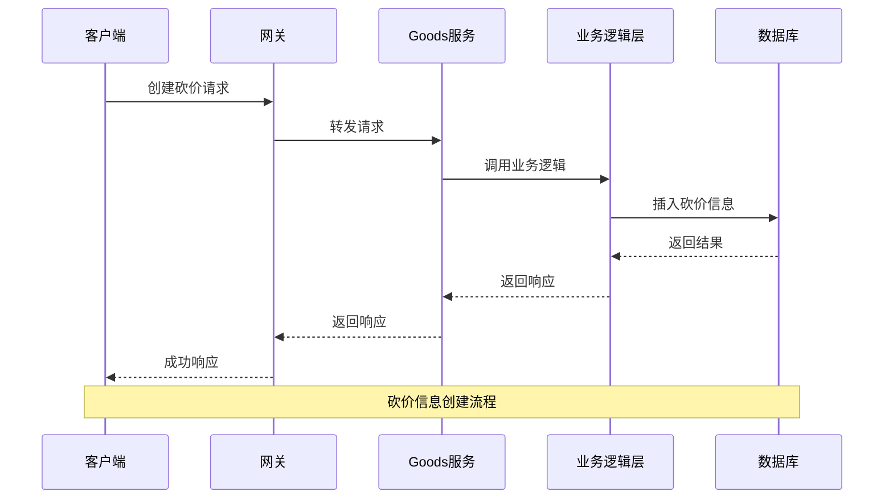

**图表来源**
- [app/goods/api/bargain_info/v1/bargain_info.pb.go](file://app/goods/api/bargain_info/v1/bargain_info.pb.go#L511-L516)
- [app/goods/api/bargain_info/v1/bargain_info.pb.go](file://app/goods/api/bargain_info/v1/bargain_info.pb.go#L27-L171)

#### 砍价历史记录接口

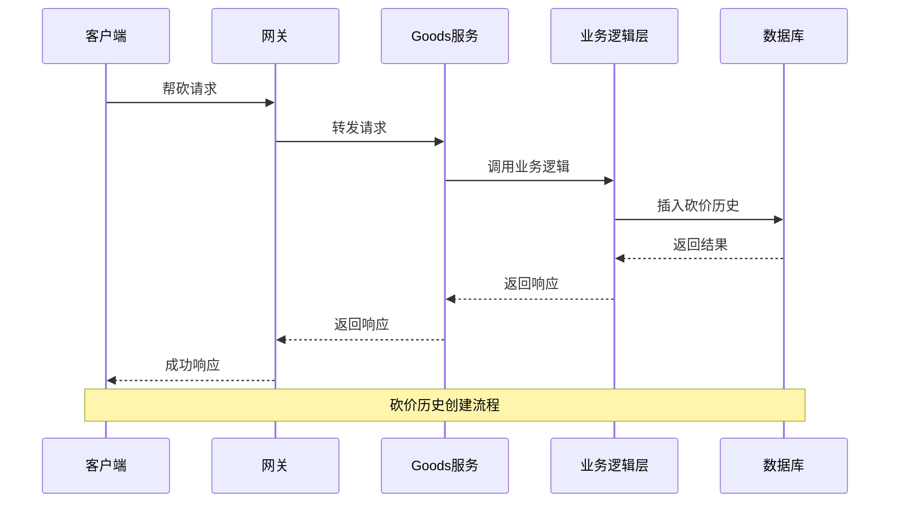

**图表来源**
- [app/goods/api/bargain_history/v1/bargain_history.pb.go](file://app/goods/api/bargain_history/v1/bargain_history.pb.go#L457-L462)
- [app/goods/api/bargain_history/v1/bargain_history.pb.go](file://app/goods/api/bargain_history/v1/bargain_history.pb.go#L27-L155)

### 业务逻辑实现

#### 砍价验证机制

项目实现了完善的砍价验证机制，包括参数验证、用户权限验证、商品状态验证等：

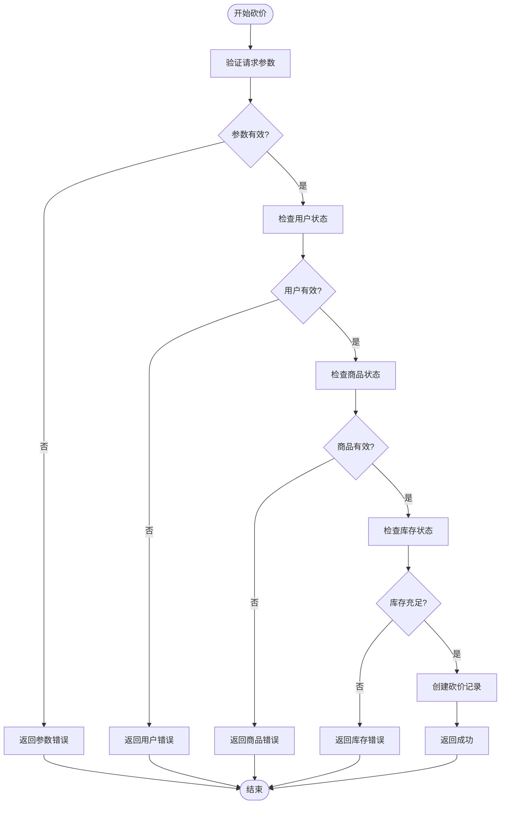

**图表来源**
- [app/goods/api/bargain_info/v1/bargain_info.pb.go](file://app/goods/api/bargain_info/v1/bargain_info.pb.go#L27-L171)

#### 时间控制机制

项目实现了基于时间戳的砍价有效期控制：

| 时间字段 | 类型 | 描述 | 控制逻辑 |
|----------|------|------|----------|
| created_time | DATETIME | 创建时间 | 系统自动记录 |
| updated_time | DATETIME | 更新时间 | 系统自动更新 |
| expired_time | DATETIME | 失效时间 | 通过配置计算得出 |
| deleted_time | DATETIME | 删除时间 | 软删除标记 |

#### 金额计算逻辑

砍价金额计算遵循以下规则：

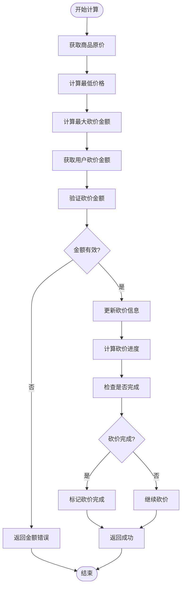

**图表来源**
- [app/goods/hack/goods.sql](file://app/goods/hack/goods.sql#L1-L119)

### 扩展功能设计

基于现有的砍价功能架构，可以轻松扩展拼团功能。以下是拼团功能的扩展设计方案：

#### 拼团数据模型扩展

```mermaid
erDiagram
GROUP_BUY {
int id PK
int leader_id FK
int goods_id FK
int target_count
int current_count
int status
int min_price
datetime start_time
datetime end_time
datetime created_time
datetime updated_time
}
GROUP_BUY_MEMBER {
int id PK
int group_buy_id FK
int user_id FK
int is_leader
int status
datetime join_time
datetime created_time
}
GROUP_BUY_ORDER {
int id PK
int group_buy_id FK
int user_id FK
int member_id FK
int order_amount
int status
datetime created_time
datetime updated_time
}
GROUP_BUY --> GROUP_BUY_MEMBER : "一对多"
GROUP_BUY --> GROUP_BUY_ORDER : "一对多"
GROUP_BUY_MEMBER --> GROUP_BUY_ORDER : "一对多"
```

#### 拼团状态管理

| 状态码 | 状态名称 | 描述 | 允许操作 |
|--------|----------|------|----------|
| 0 | 未开始 | 活动尚未开始 | 查看、取消 |
| 1 | 进行中 | 活动正在进行 | 参与、查看 |
| 2 | 已满员 | 达到目标人数 | 查看、等待发货 |
| 3 | 已成功 | 拼团成功 | 查看、确认收货 |
| 4 | 已失败 | 拼团失败 | 查看、退款申请 |
| 5 | 已取消 | 活动取消 | 查看 |

#### 拼团验证规则

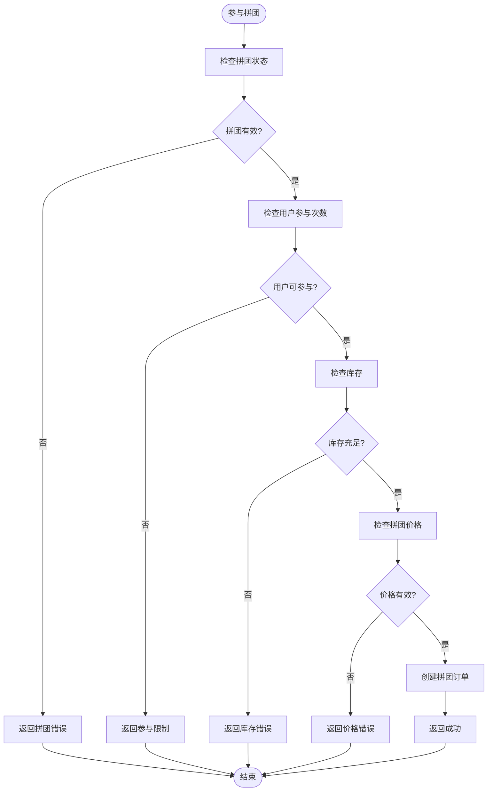

**图表来源**
- [app/goods/internal/model/entity/bargain_info.go](file://app/goods/internal/model/entity/bargain_info.go#L11-L21)

## 依赖关系分析

### 组件依赖关系

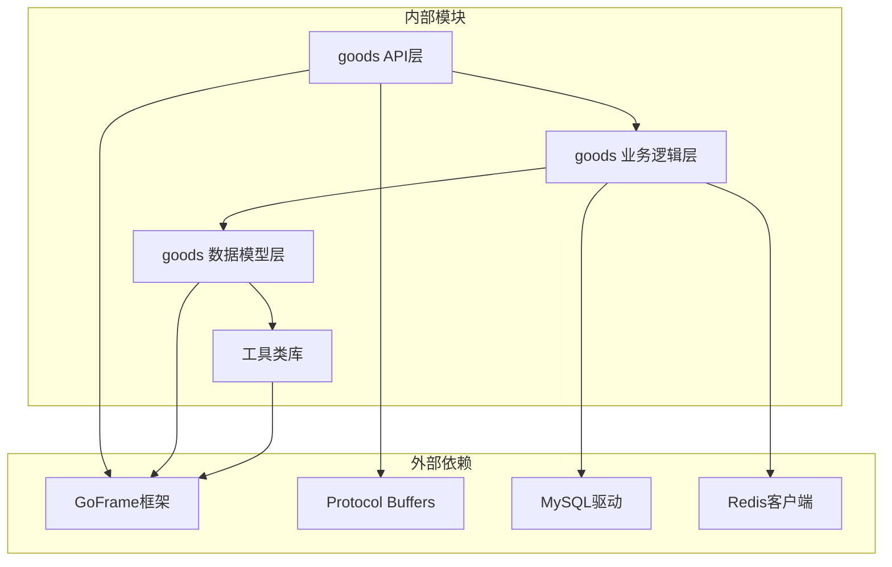

**图表来源**
- [app/goods/api/bargain_info/v1/bargain_info.pb.go](file://app/goods/api/bargain_info/v1/bargain_info.pb.go#L9-L18)
- [utility/consts/consts.go](file://utility/consts/consts.go#L33-L46)

### 关键常量定义

项目中定义了重要的促销功能常量：

| 常量名 | 值 | 描述 |
|--------|----|------|
| BargainInfo | "BargainInfo" | 砍价信息表名 |
| BargainHistoryInfo | "BargainHistoryInfo" | 砍价历史表名 |
| CartInfo | "CartInfo" | 购物车表名 |
| CouponInfo | "CouponInfo" | 优惠券表名 |
| UserCouponInfo | "UserCouponInfo" | 用户优惠券表名 |

**章节来源**
- [utility/consts/consts.go](file://utility/consts/consts.go#L33-L46)

## 性能考虑

### 缓存策略

项目采用了多层次的缓存策略来提升性能：

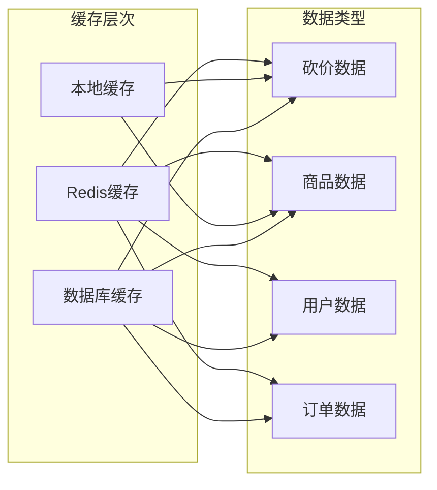

### 性能优化建议

1. **数据库索引优化**
   - 为常用查询字段建立合适的索引
   - 优化联合索引的使用
   - 定期分析查询性能

2. **缓存策略优化**
   - 实现缓存预热机制
   - 设置合理的缓存过期时间
   - 使用分布式缓存提高可用性

3. **并发控制优化**
   - 实现乐观锁机制
   - 使用分布式锁防止超卖
   - 优化数据库连接池配置

## 故障排除指南

### 常见问题及解决方案

#### 砍价功能异常

| 问题类型 | 症状 | 可能原因 | 解决方案 |
|----------|------|----------|----------|
| 砍价创建失败 | 返回参数错误 | 请求参数不完整 | 检查API调用参数 |
| 砍价超时 | 砍价未完成 | 砍价时间已过期 | 检查expired_time字段 |
| 库存不足 | 砍价失败 | 商品库存为0 | 检查商品库存状态 |
| 用户限制 | 无法参与砍价 | 用户参与次数限制 | 检查用户参与记录 |

#### 性能问题排查

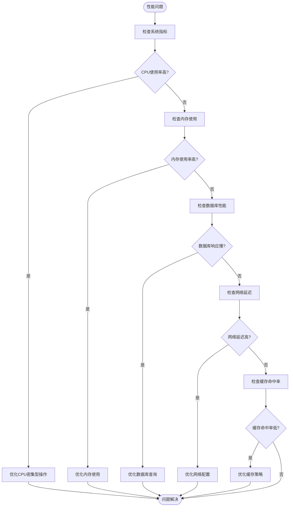

**图表来源**
- [app/flash-sale/internal/logic/flash_sale_logic.go](file://app/flash-sale/internal/logic/flash_sale_logic.go#L102-L254)

### 日志分析

项目实现了完善的日志记录机制，便于问题诊断：

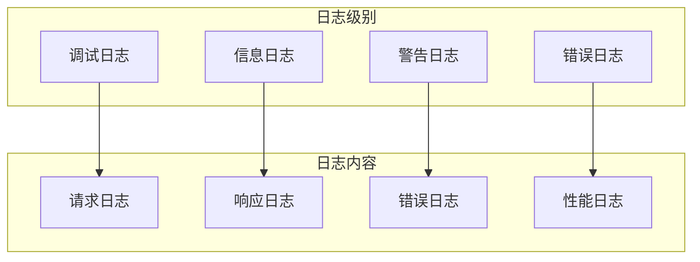

## 结论

通过对项目促销功能模块的深入分析，我发现该项目主要实现了**砍价功能**，而非拼团功能。项目展现了良好的微服务架构设计，具有以下特点：

### 已实现的功能优势

1. **完整的砍价功能**：实现了从砍价创建到砍价完成的全流程功能
2. **清晰的架构设计**：采用分层架构，职责分离明确
3. **完善的API设计**：提供了RESTful风格的API接口
4. **健壮的数据模型**：设计了合理的数据表结构和关系
5. **优秀的性能考虑**：实现了缓存策略和性能优化

### 拼团功能扩展建议

基于现有的砍价功能架构，可以轻松扩展拼团功能：

1. **数据模型扩展**：增加拼团信息表、拼团成员表、拼团订单表
2. **业务逻辑完善**：实现拼团状态管理、拼团验证机制
3. **API接口设计**：提供拼团相关的完整API接口
4. **性能优化**：利用现有缓存和并发控制机制

### 技术亮点

- **微服务架构**：模块化设计，便于维护和扩展
- **协议缓冲区**：标准化的API通信格式
- **数据库设计**：合理的表结构和索引设计
- **错误处理**：完善的错误处理和日志记录机制

该项目为拼团功能的实现提供了良好的基础架构和技术积累，具备较强的扩展性和可维护性。通过借鉴现有的砍价功能实现经验，可以快速实现拼团功能并保证系统的稳定性和性能。