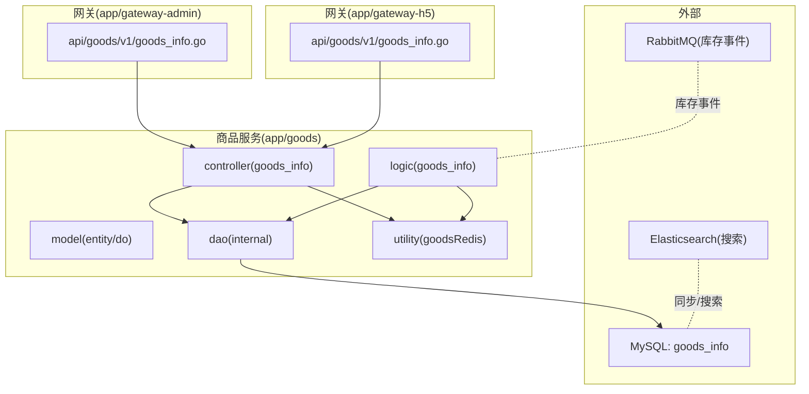
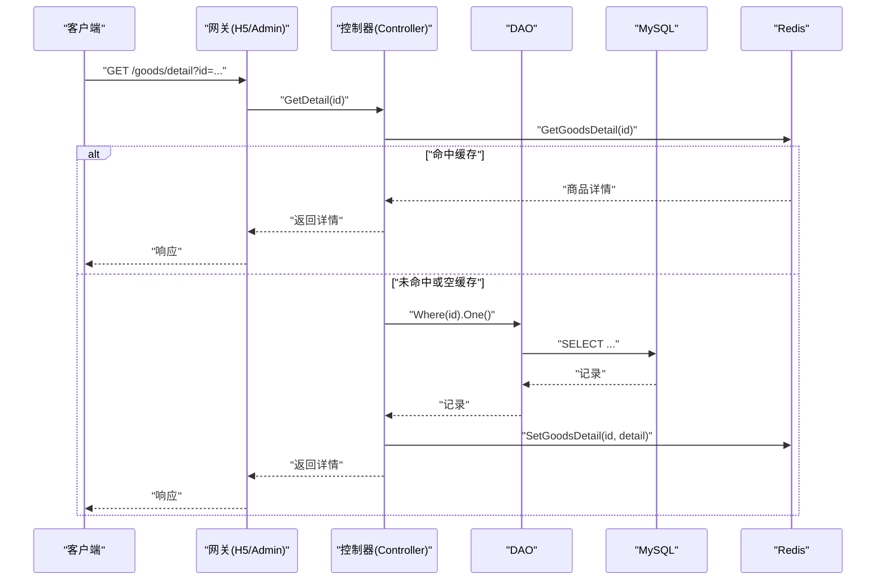
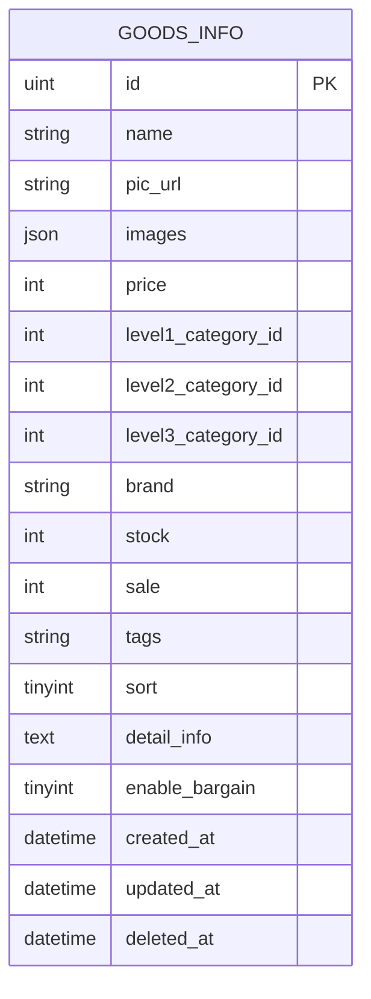
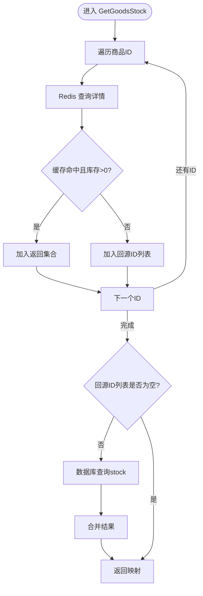
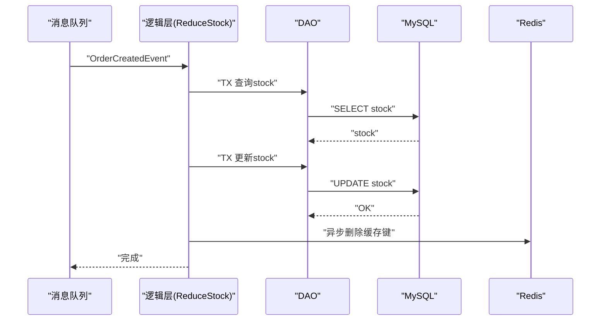
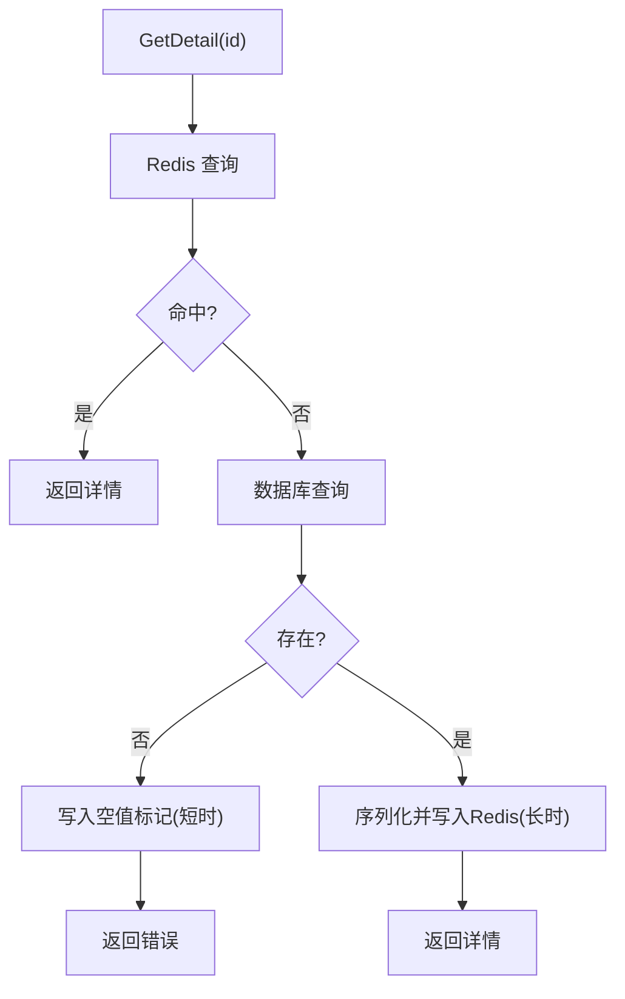
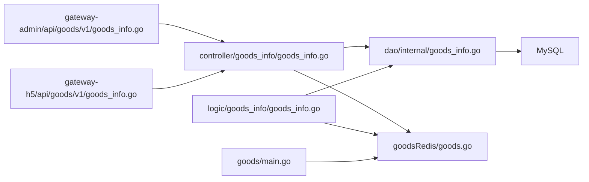

# 商品信息管理

<cite>
**本文引用的文件**
- [app/goods/main.go](file://app/goods/main.go)
- [app/goods/internal/model/entity/goods_info.go](file://app/goods/internal/model/entity/goods_info.go)
- [app/goods/internal/model/do/goods_info.go](file://app/goods/internal/model/do/goods_info.go)
- [app/goods/internal/controller/goods_info/goods_info.go](file://app/goods/internal/controller/goods_info/goods_info.go)
- [app/goods/internal/dao/goods_info.go](file://app/goods/internal/dao/goods_info.go)
- [app/goods/internal/dao/internal/goods_info.go](file://app/goods/internal/dao/internal/goods_info.go)
- [app/goods/internal/logic/goods_info/goods_info.go](file://app/goods/internal/logic/goods_info/goods_info.go)
- [app/goods/utility/goodsRedis/goods.go](file://app/goods/utility/goodsRedis/goods.go)
- [app/gateway-admin/api/goods/v1/goods_info.go](file://app/gateway-admin/api/goods/v1/goods_info.go)
- [app/gateway-h5/api/goods/v1/goods_info.go](file://app/gateway-h5/api/goods/v1/goods_info.go)
- [app/goods/api/goods_images/v1/goods_images.pb.go](file://app/goods/api/goods_images/v1/goods_images.pb.go)
- [app/gateway-h5/api/goods/v1/goods_images.go](file://app/gateway-h5/api/goods/v1/goods_images.go)
- [app/gateway-admin/api/goods/v1/category_info.go](file://app/gateway-admin/api/goods/v1/category_info.go)
- [app/gateway-h5/api/goods/v1/category_info.go](file://app/gateway-h5/api/goods/v1/category_info.go)
- [init-db/goods_info.sql](file://init-db/goods_info.sql)
</cite>

## 目录
1. [简介](#简介)
2. [项目结构](#项目结构)
3. [核心组件](#核心组件)
4. [架构总览](#架构总览)
5. [详细组件分析](#详细组件分析)
6. [依赖关系分析](#依赖关系分析)
7. [性能考量](#性能考量)
8. [故障排查指南](#故障排查指南)
9. [结论](#结论)
10. [附录：API 接口文档](#附录api-接口文档)

## 简介
本文件系统化梳理“商品信息管理”功能，覆盖商品的增删改查、详情展示、列表查询、库存管理、缓存策略、以及与商品图片、分类管理的协同关系。文档以代码为依据，结合数据模型、控制器、DAO、逻辑层与缓存层，给出端到端的实现路径与调用流程，并提供面向使用者的 API 文档与常见问题排查指引。

## 项目结构
围绕商品信息管理的关键模块分布如下：
- 数据模型层：实体结构与查询对象
- DAO 层：对 goods_info 表的访问封装
- 控制器层：对外暴露 gRPC/HTTP 接口
- 逻辑层：库存扣减与回退的事务处理
- 缓存层：基于 Redis 的商品详情缓存与批量删除
- 网关层：Admin/H5 网关分别定义商品管理的请求/响应结构
- 初始化脚本：数据库表结构与样例数据

图表来源
- [app/goods/internal/controller/goods_info/goods_info.go](file://app/goods/internal/controller/goods_info/goods_info.go#L31-L92)
- [app/goods/internal/dao/internal/goods_info.go](file://app/goods/internal/dao/internal/goods_info.go#L98-L115)
- [app/goods/utility/goodsRedis/goods.go](file://app/goods/utility/goodsRedis/goods.go#L18-L59)
- [app/gateway-admin/api/goods/v1/goods_info.go](file://app/gateway-admin/api/goods/v1/goods_info.go#L1-L105)
- [app/gateway-h5/api/goods/v1/goods_info.go](file://app/gateway-h5/api/goods/v1/goods_info.go#L1-L51)

章节来源
- [app/goods/internal/model/entity/goods_info.go](file://app/goods/internal/model/entity/goods_info.go#L11-L32)
- [app/goods/internal/model/do/goods_info.go](file://app/goods/internal/model/do/goods_info.go#L12-L34)
- [app/goods/internal/dao/goods_info.go](file://app/goods/internal/dao/goods_info.go#L11-L22)
- [app/goods/internal/dao/internal/goods_info.go](file://app/goods/internal/dao/internal/goods_info.go#L14-L115)
- [app/goods/internal/controller/goods_info/goods_info.go](file://app/goods/internal/controller/goods_info/goods_info.go#L23-L25)
- [app/goods/internal/logic/goods_info/goods_info.go](file://app/goods/internal/logic/goods_info/goods_info.go#L83-L138)
- [app/goods/utility/goodsRedis/goods.go](file://app/goods/utility/goodsRedis/goods.go#L12-L121)
- [app/gateway-admin/api/goods/v1/goods_info.go](file://app/gateway-admin/api/goods/v1/goods_info.go#L1-L105)
- [app/gateway-h5/api/goods/v1/goods_info.go](file://app/gateway-h5/api/goods/v1/goods_info.go#L1-L51)
- [init-db/goods_info.sql](file://init-db/goods_info.sql#L24-L44)

## 核心组件
- 数据模型
  - 实体结构 GoodsInfo：包含商品基本信息、价格、库存、销量、标签、排序、详情、砍价开关、时间戳等字段。
  - 查询对象 GoodsInfo（do）：用于 Where/Fields/Data 等查询构造。
- DAO 封装
  - GoodsInfoDao：提供表名、列名常量、Ctx 模型、事务封装。
  - GoodsInfo：对外访问入口，组合内部 DAO。
- 控制器
  - 提供 GetList、GetDetail、Create、Update、Delete、GetGoodsStock 等接口。
  - 详情接口采用 Redis 缓存 + 空缓存穿透防护。
- 逻辑层
  - ReduceStock：下单扣库存，事务内校验与更新，异步删除缓存键。
  - ReturnStock：订单取消/退货回库存，多商品并发处理。
- 缓存层
  - 商品详情缓存、空值缓存、批量删除与延迟双删。

章节来源
- [app/goods/internal/model/entity/goods_info.go](file://app/goods/internal/model/entity/goods_info.go#L11-L32)
- [app/goods/internal/model/do/goods_info.go](file://app/goods/internal/model/do/goods_info.go#L12-L34)
- [app/goods/internal/dao/internal/goods_info.go](file://app/goods/internal/dao/internal/goods_info.go#L14-L115)
- [app/goods/internal/dao/goods_info.go](file://app/goods/internal/dao/goods_info.go#L11-L22)
- [app/goods/internal/controller/goods_info/goods_info.go](file://app/goods/internal/controller/goods_info/goods_info.go#L31-L92)
- [app/goods/internal/logic/goods_info/goods_info.go](file://app/goods/internal/logic/goods_info/goods_info.go#L83-L138)
- [app/goods/utility/goodsRedis/goods.go](file://app/goods/utility/goodsRedis/goods.go#L18-L59)

## 架构总览
商品服务通过 gRPC/HTTP 对外提供能力，内部以 DAO 抽象数据库访问，逻辑层负责库存事务与缓存同步，缓存层提供热点数据加速。

图表来源
- [app/goods/internal/controller/goods_info/goods_info.go](file://app/goods/internal/controller/goods_info/goods_info.go#L94-L159)
- [app/goods/utility/goodsRedis/goods.go](file://app/goods/utility/goodsRedis/goods.go#L38-L52)
- [app/goods/internal/dao/internal/goods_info.go](file://app/goods/internal/dao/internal/goods_info.go#L98-L105)

## 详细组件分析

### 数据模型与表结构
- 字段概览（部分）
  - 基本信息：id、name、pic_url、images、brand、tags
  - 价格与库存：price（分）、stock、sale
  - 分类：level1_category_id、level2_category_id、level3_category_id
  - 排序与状态：sort、enable_bargain
  - 时间：created_at、updated_at、deleted_at
- 关键约束
  - price、stock、sale 为数值型；images 为 JSON 类型存储多图信息。
  - sort 用于热门排序（倒序），levelN_category_id 作为分类层级标识。

图表来源
- [init-db/goods_info.sql](file://init-db/goods_info.sql#L24-L44)
- [app/goods/internal/model/entity/goods_info.go](file://app/goods/internal/model/entity/goods_info.go#L12-L32)

章节来源
- [init-db/goods_info.sql](file://init-db/goods_info.sql#L24-L44)
- [app/goods/internal/model/entity/goods_info.go](file://app/goods/internal/model/entity/goods_info.go#L11-L32)

### 控制器：商品 CRUD 与详情/列表
- GetList
  - 支持分页与热门筛选（sort > 0），按 sort 降序返回。
  - 统计总数并转换为 Protobuf 结构。
- GetDetail
  - 先查 Redis，命中则直接返回；未命中再查数据库；空商品写入空缓存标记。
  - 成功后异步写入 Redis 缓存。
- Create/Update/Delete
  - 直接基于 DAO 插入/更新/删除，更新后异步删除详情缓存。
- GetGoodsStock
  - 先查 Redis，命中且库存>0则直接返回；否则回源数据库补全缺失项。

图表来源
- [app/goods/internal/controller/goods_info/goods_info.go](file://app/goods/internal/controller/goods_info/goods_info.go#L209-L256)

章节来源
- [app/goods/internal/controller/goods_info/goods_info.go](file://app/goods/internal/controller/goods_info/goods_info.go#L31-L92)
- [app/goods/internal/controller/goods_info/goods_info.go](file://app/goods/internal/controller/goods_info/goods_info.go#L94-L159)
- [app/goods/internal/controller/goods_info/goods_info.go](file://app/goods/internal/controller/goods_info/goods_info.go#L161-L207)
- [app/goods/internal/controller/goods_info/goods_info.go](file://app/goods/internal/controller/goods_info/goods_info.go#L209-L256)

### DAO 与事务
- GoodsInfoDao
  - 提供 Ctx 模型、列名常量、Transaction 包装。
- 事务场景
  - ReduceStock：在事务内逐商品校验库存并更新，失败回滚；成功后异步删除缓存键。
  - ReturnStock：并发处理多个商品的库存回退，捕获 panic 并汇总结果。

图表来源
- [app/goods/internal/logic/goods_info/goods_info.go](file://app/goods/internal/logic/goods_info/goods_info.go#L83-L138)
- [app/goods/internal/dao/internal/goods_info.go](file://app/goods/internal/dao/internal/goods_info.go#L113-L115)

章节来源
- [app/goods/internal/dao/internal/goods_info.go](file://app/goods/internal/dao/internal/goods_info.go#L98-L115)
- [app/goods/internal/logic/goods_info/goods_info.go](file://app/goods/internal/logic/goods_info/goods_info.go#L83-L138)

### 缓存策略与空缓存穿透防护
- 商品详情缓存
  - Key 规则：goods:detail:{id}
  - 命中：直接返回
  - 未命中：查库，成功后写入；失败写入空值标记（短时有效）防止穿透
- 批量删除与延迟双删
  - DeleteKeys：批量删除商品详情缓存键
  - 延迟双删：首次删除后延时再次删除，降低并发写入导致的脏读风险

图表来源
- [app/goods/internal/controller/goods_info/goods_info.go](file://app/goods/internal/controller/goods_info/goods_info.go#L94-L159)
- [app/goods/utility/goodsRedis/goods.go](file://app/goods/utility/goodsRedis/goods.go#L18-L59)

章节来源
- [app/goods/utility/goodsRedis/goods.go](file://app/goods/utility/goodsRedis/goods.go#L12-L121)

### 商品图片与分类管理（扩展）
- 商品图片
  - 网关定义了图片列表、创建、删除的请求/响应结构；商品服务提供了图片相关 API 的 Protobuf 定义。
- 商品分类
  - 网关定义了分类的增删改查与全量查询；商品服务提供分类相关 DAO/逻辑（此处聚焦于商品管理，分类管理不在本节展开）。

章节来源
- [app/gateway-h5/api/goods/v1/goods_images.go](file://app/gateway-h5/api/goods/v1/goods_images.go#L1-L27)
- [app/goods/api/goods_images/v1/goods_images.pb.go](file://app/goods/api/goods_images/v1/goods_images.pb.go#L210-L339)
- [app/gateway-admin/api/goods/v1/category_info.go](file://app/gateway-admin/api/goods/v1/category_info.go#L1-L74)
- [app/gateway-h5/api/goods/v1/category_info.go](file://app/gateway-h5/api/goods/v1/category_info.go#L1-L42)

## 依赖关系分析
- 控制器依赖 DAO 与 Redis 工具
- 逻辑层依赖 DAO 与 Redis 工具，处理库存事务
- 网关层定义请求/响应结构，控制器/逻辑层与之解耦
- 服务启动时初始化 Redis 并注册 gRPC 解析器

图表来源
- [app/goods/internal/controller/goods_info/goods_info.go](file://app/goods/internal/controller/goods_info/goods_info.go#L27-L29)
- [app/goods/internal/dao/internal/goods_info.go](file://app/goods/internal/dao/internal/goods_info.go#L98-L115)
- [app/goods/utility/goodsRedis/goods.go](file://app/goods/utility/goodsRedis/goods.go#L25-L36)
- [app/goods/internal/logic/goods_info/goods_info.go](file://app/goods/internal/logic/goods_info/goods_info.go#L83-L138)
- [app/goods/main.go](file://app/goods/main.go#L15-L34)

章节来源
- [app/goods/internal/controller/goods_info/goods_info.go](file://app/goods/internal/controller/goods_info/goods_info.go#L23-L29)
- [app/goods/internal/dao/internal/goods_info.go](file://app/goods/internal/dao/internal/goods_info.go#L98-L115)
- [app/goods/utility/goodsRedis/goods.go](file://app/goods/utility/goodsRedis/goods.go#L25-L36)
- [app/goods/internal/logic/goods_info/goods_info.go](file://app/goods/internal/logic/goods_info/goods_info.go#L83-L138)
- [app/goods/main.go](file://app/goods/main.go#L15-L34)

## 性能考量
- 缓存命中优先：详情接口优先读取 Redis，减少数据库压力。
- 空缓存穿透防护：对不存在商品写入短时空值标记，避免放大数据库压力。
- 异步缓存更新：更新/扣库存后异步删除缓存，降低主流程阻塞。
- 批量删除与延迟双删：提升高并发下的缓存一致性与稳定性。
- 事务内扣库存：保证库存数据一致性，失败快速回滚。

## 故障排查指南
- 详情接口报“商品不存在”
  - 可能原因：缓存空值标记、数据库无记录
  - 排查步骤：检查 Redis 中 goods:detail:{id} 是否为“空值标记”，确认数据库是否存在该记录
- 更新后详情仍显示旧值
  - 可能原因：缓存未及时删除
  - 排查步骤：确认 Update 后是否触发异步删除缓存；检查 Redis 中对应 key 是否已移除
- 扣库存失败或超卖
  - 可能原因：并发写入导致的脏读、事务未提交
  - 排查步骤：确认 ReduceStock 是否在事务内执行；查看异步删除缓存是否成功；核对数据库 stock 是否正确
- 库存查询不准确
  - 可能原因：缓存命中但库存为 0，回源数据库前未正确补全
  - 排查步骤：检查 GetGoodsStock 的回源逻辑与合并过程

章节来源
- [app/goods/internal/controller/goods_info/goods_info.go](file://app/goods/internal/controller/goods_info/goods_info.go#L94-L159)
- [app/goods/internal/controller/goods_info/goods_info.go](file://app/goods/internal/controller/goods_info/goods_info.go#L175-L207)
- [app/goods/internal/logic/goods_info/goods_info.go](file://app/goods/internal/logic/goods_info/goods_info.go#L83-L138)
- [app/goods/internal/controller/goods_info/goods_info.go](file://app/goods/internal/controller/goods_info/goods_info.go#L209-L256)

## 结论
商品信息管理以清晰的分层架构实现：数据模型与 DAO 提供稳定的数据访问，控制器负责对外接口与缓存策略，逻辑层保障库存事务一致性，Redis 缓存显著提升热点数据读取性能。通过空缓存穿透防护、批量删除与延迟双删等手段，系统在高并发下具备良好的稳定性与一致性。

## 附录：API 接口文档

### 商品详情（H5 网关）
- 请求
  - 方法：GET
  - 路径：/goods/detail
  - 参数：id（必填）
- 响应
  - 结构：复用商品项结构，包含 id、name、pic_url、images、price、分类ID、品牌、stock、sale、tags、detail_info、sort、created_at、updated_at

章节来源
- [app/gateway-h5/api/goods/v1/goods_info.go](file://app/gateway-h5/api/goods/v1/goods_info.go#L8-L16)

### 商品列表（Admin/H5 网关）
- 请求
  - 方法：GET
  - 路径：/goods
  - 参数：page（默认1，最小1）、size（默认10，最大100）、is_hot（0/1，开启热门筛选）
- 响应
  - 结构：list、page、size、total

章节来源
- [app/gateway-admin/api/goods/v1/goods_info.go](file://app/gateway-admin/api/goods/v1/goods_info.go#L18-L31)
- [app/gateway-h5/api/goods/v1/goods_info.go](file://app/gateway-h5/api/goods/v1/goods_info.go#L18-L31)

### 创建商品（Admin 网关）
- 请求
  - 方法：POST
  - 路径：/goods
  - 参数：name、pic_url、images、price、level1_category_id、level2_category_id、level3_category_id、brand、stock、sale、tags、detail_info、sort
- 响应
  - 结构：id

章节来源
- [app/gateway-admin/api/goods/v1/goods_info.go](file://app/gateway-admin/api/goods/v1/goods_info.go#L52-L72)

### 更新商品（Admin 网关）
- 请求
  - 方法：PUT
  - 路径：/goods
  - 参数：id（必填）、name、pic_url、images、price、level1_category_id、level2_category_id、level3_category_id、brand、stock、sale、tags、detail_info、sort
- 响应
  - 结构：id

章节来源
- [app/gateway-admin/api/goods/v1/goods_info.go](file://app/gateway-admin/api/goods/v1/goods_info.go#L74-L95)

### 删除商品（Admin 网关）
- 请求
  - 方法：DELETE
  - 路径：/goods
  - 参数：id（必填）
- 响应
  - 结构：空

章节来源
- [app/gateway-admin/api/goods/v1/goods_info.go](file://app/gateway-admin/api/goods/v1/goods_info.go#L97-L105)

### 获取商品库存（Admin/H5 网关）
- 请求
  - 方法：GET
  - 路径：/goods/stock
  - 参数：goods_ids（数组）
- 响应
  - 结构：goods_stock（map[id -> stock]）

章节来源
- [app/gateway-admin/api/goods/v1/goods_info.go](file://app/gateway-admin/api/goods/v1/goods_info.go#L1-L105)
- [app/gateway-h5/api/goods/v1/goods_info.go](file://app/gateway-h5/api/goods/v1/goods_info.go#L1-L51)

### 商品图片（H5 网关）
- 图片列表
  - 请求：GET /goods/images?page,size
  - 响应：list（含 id、goods_id、file_id、sort）、page、size、total
- 图片项字段
  - id、goods_id、file_id、sort

章节来源
- [app/gateway-h5/api/goods/v1/goods_images.go](file://app/gateway-h5/api/goods/v1/goods_images.go#L7-L27)

### 商品图片（商品服务 Protobuf）
- 列表、创建、删除的请求/响应结构由商品服务的 Protobuf 定义，字段与 H5 网关一致。

章节来源
- [app/goods/api/goods_images/v1/goods_images.pb.go](file://app/goods/api/goods_images/v1/goods_images.pb.go#L210-L339)

### 商品分类（Admin/H5 网关）
- 分类列表、全量查询、创建、更新、删除的请求/响应结构由网关定义，字段包含 id、parent_id、name、pic_url、level、sort、created_at、updated_at 等。

章节来源
- [app/gateway-admin/api/goods/v1/category_info.go](file://app/gateway-admin/api/goods/v1/category_info.go#L8-L74)
- [app/gateway-h5/api/goods/v1/category_info.go](file://app/gateway-h5/api/goods/v1/category_info.go#L8-L42)