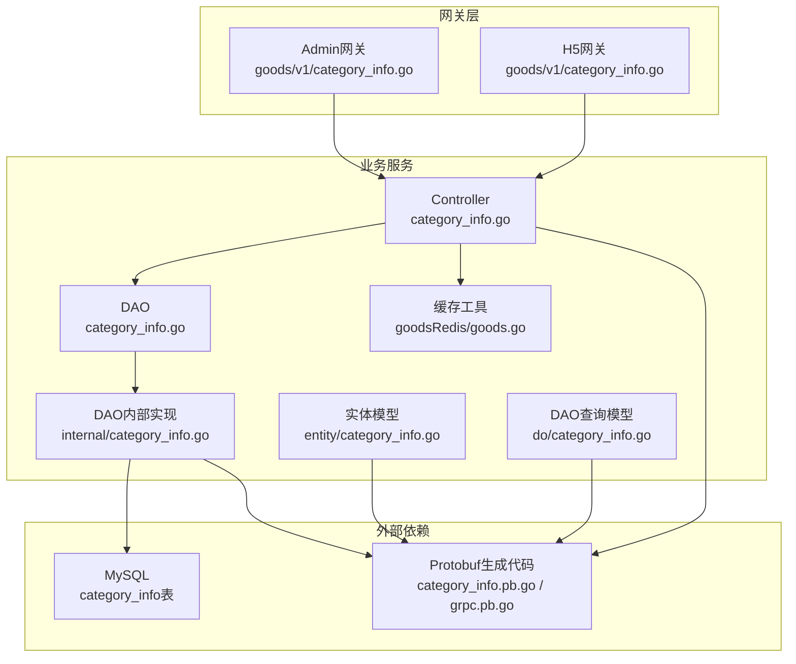
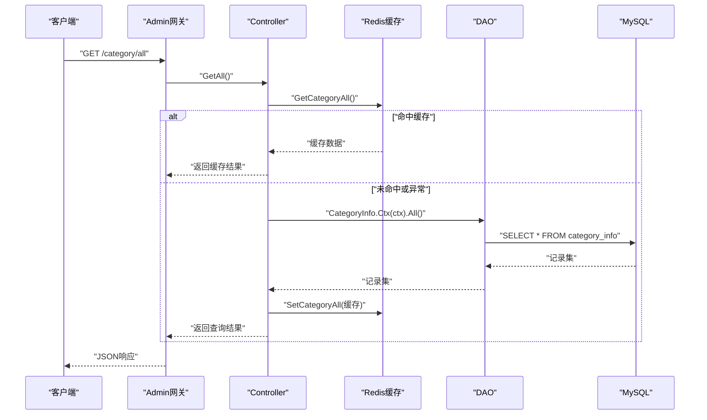
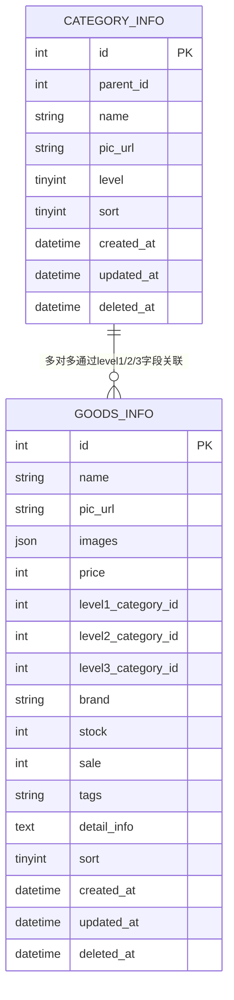
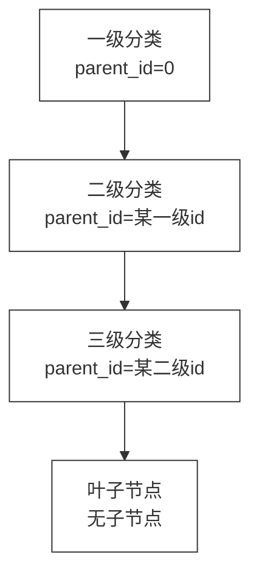
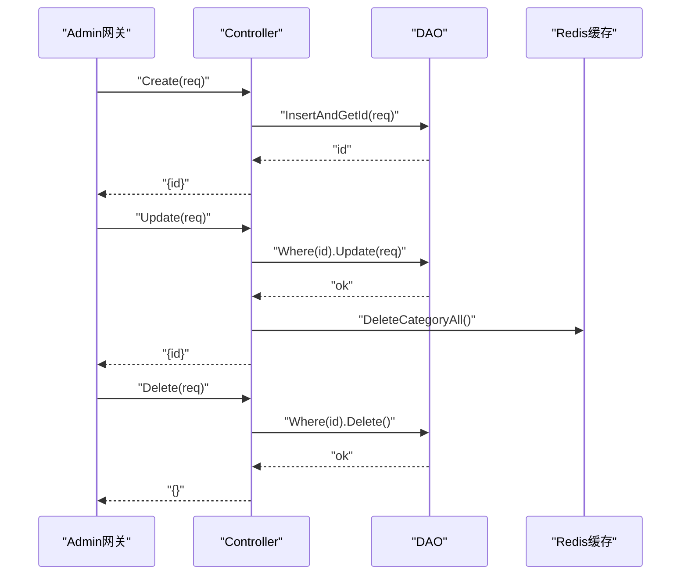
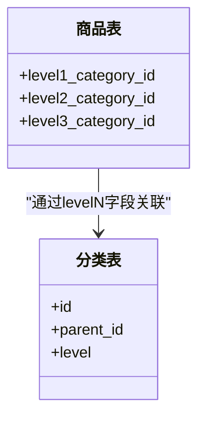
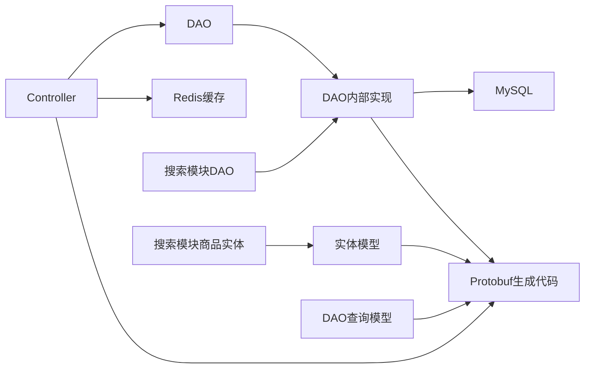

# 商品分类管理

<cite>
**本文引用的文件**
- [app/goods/internal/controller/category_info/category_info.go](file://app/goods/internal/controller/category_info/category_info.go)
- [app/goods/internal/dao/category_info.go](file://app/goods/internal/dao/category_info.go)
- [app/goods/internal/dao/internal/category_info.go](file://app/goods/internal/dao/internal/category_info.go)
- [app/goods/internal/model/entity/category_info.go](file://app/goods/internal/model/entity/category_info.go)
- [app/goods/internal/model/do/category_info.go](file://app/goods/internal/model/do/category_info.go)
- [app/goods/utility/goodsRedis/goods.go](file://app/goods/utility/goodsRedis/goods.go)
- [app/gateway-admin/api/goods/v1/category_info.go](file://app/gateway-admin/api/goods/v1/category_info.go)
- [app/gateway-h5/api/goods/v1/category_info.go](file://app/gateway-h5/api/goods/v1/category_info.go)
- [app/goods/hack/goods.sql](file://app/goods/hack/goods.sql)
- [app/goods/api/category_info/v1/category_info.pb.go](file://app/goods/api/category_info/v1/category_info.pb.go)
- [app/goods/api/category_info/v1/category_info_grpc.pb.go](file://app/goods/api/category_info/v1/category_info_grpc.pb.go)
- [app/goods/api/pbentity/category_info.pb.go](file://app/goods/api/pbentity/category_info.pb.go)
- [app/search/internal/dao/internal/category_info.go](file://app/search/internal/dao/internal/category_info.go)
- [app/search/internal/model/entity/goods_info.go](file://app/search/internal/model/entity/goods_info.go)
- [app/search/api/search/v1/search.go](file://app/search/api/search/v1/search.go)
- [init-db/01_init.sql](file://init-db/01_init.sql)
</cite>

## 目录
1. [简介](#简介)
2. [项目结构](#项目结构)
3. [核心组件](#核心组件)
4. [架构总览](#架构总览)
5. [详细组件分析](#详细组件分析)
6. [依赖分析](#依赖分析)
7. [性能考虑](#性能考虑)
8. [故障排查指南](#故障排查指南)
9. [结论](#结论)
10. [附录](#附录)

## 简介
本文件系统化梳理“商品分类管理”功能，覆盖以下方面：
- 分类层级结构设计与父子关系
- 分类增删改查与分页查询
- 分类树形展示与全量缓存
- 分类数据模型与字段语义
- 分类与商品的关联关系及筛选
- 分类统计与排序控制
- 分类图片管理与SEO扩展能力
- 权限控制与API接口定义
- 完整的接口调用流程与使用示例

## 项目结构
围绕商品分类管理的关键模块分布如下：
- 控制层：负责接收请求、调用DAO、处理缓存与响应封装
- DAO层：封装数据库访问，提供统一的Model与事务能力
- 模型层：实体结构与DAO查询结构定义
- 缓存层：基于Redis的全量分类数据缓存
- 网关层：Admin/H5两套API定义，分别面向后台管理与前端展示
- 初始化SQL：提供分类表结构与示例数据

**图表来源**
- [app/gateway-admin/api/goods/v1/category_info.go](file://app/gateway-admin/api/goods/v1/category_info.go#L1-L81)
- [app/gateway-h5/api/goods/v1/category_info.go](file://app/gateway-h5/api/goods/v1/category_info.go#L1-L43)
- [app/goods/internal/controller/category_info/category_info.go](file://app/goods/internal/controller/category_info/category_info.go#L1-L204)
- [app/goods/internal/dao/category_info.go](file://app/goods/internal/dao/category_info.go#L1-L23)
- [app/goods/internal/dao/internal/category_info.go](file://app/goods/internal/dao/internal/category_info.go#L1-L96)
- [app/goods/internal/model/entity/category_info.go](file://app/goods/internal/model/entity/category_info.go#L1-L23)
- [app/goods/internal/model/do/category_info.go](file://app/goods/internal/model/do/category_info.go#L1-L25)
- [app/goods/utility/goodsRedis/goods.go](file://app/goods/utility/goodsRedis/goods.go#L1-L121)
- [app/goods/api/category_info/v1/category_info.pb.go](file://app/goods/api/category_info/v1/category_info.pb.go)
- [app/goods/api/category_info/v1/category_info_grpc.pb.go](file://app/goods/api/category_info/v1/category_info_grpc.pb.go)
- [app/goods/api/pbentity/category_info.pb.go](file://app/goods/api/pbentity/category_info.pb.go)

**章节来源**
- [app/goods/internal/controller/category_info/category_info.go](file://app/goods/internal/controller/category_info/category_info.go#L1-L204)
- [app/goods/internal/dao/internal/category_info.go](file://app/goods/internal/dao/internal/category_info.go#L1-L96)
- [app/goods/internal/model/entity/category_info.go](file://app/goods/internal/model/entity/category_info.go#L1-L23)
- [app/goods/internal/model/do/category_info.go](file://app/goods/internal/model/do/category_info.go#L1-L25)
- [app/goods/utility/goodsRedis/goods.go](file://app/goods/utility/goodsRedis/goods.go#L1-L121)
- [app/gateway-admin/api/goods/v1/category_info.go](file://app/gateway-admin/api/goods/v1/category_info.go#L1-L81)
- [app/gateway-h5/api/goods/v1/category_info.go](file://app/gateway-h5/api/goods/v1/category_info.go#L1-L43)

## 核心组件
- 控制器：提供分页查询、全量查询、创建、更新、删除等接口；内置Redis缓存命中与失效逻辑
- DAO：封装数据库Model、列名映射、上下文与事务
- 实体与DAO查询模型：定义字段与ORM映射
- 缓存工具：提供分类全量数据的序列化存储与读取
- 网关API：Admin/H5两套请求/响应结构，统一字段命名与校验规则

关键职责与边界：
- 控制器负责输入校验、错误包装、缓存读写与响应组装
- DAO负责与数据库交互，提供安全Model与事务封装
- 缓存工具负责热点数据的快速读取与一致性维护
- 网关API负责对外契约定义与参数约束

**章节来源**
- [app/goods/internal/controller/category_info/category_info.go](file://app/goods/internal/controller/category_info/category_info.go#L29-L203)
- [app/goods/internal/dao/internal/category_info.go](file://app/goods/internal/dao/internal/category_info.go#L78-L95)
- [app/goods/utility/goodsRedis/goods.go](file://app/goods/utility/goodsRedis/goods.go#L61-L91)
- [app/gateway-admin/api/goods/v1/category_info.go](file://app/gateway-admin/api/goods/v1/category_info.go#L8-L81)
- [app/gateway-h5/api/goods/v1/category_info.go](file://app/gateway-h5/api/goods/v1/category_info.go#L8-L43)

## 架构总览
商品分类管理采用“网关-服务-DAO-数据库”的分层架构，结合Redis缓存提升读性能。

**图表来源**
- [app/gateway-admin/api/goods/v1/category_info.go](file://app/gateway-admin/api/goods/v1/category_info.go#L23-L31)
- [app/goods/internal/controller/category_info/category_info.go](file://app/goods/internal/controller/category_info/category_info.go#L84-L154)
- [app/goods/utility/goodsRedis/goods.go](file://app/goods/utility/goodsRedis/goods.go#L73-L91)
- [app/goods/internal/dao/internal/category_info.go](file://app/goods/internal/dao/internal/category_info.go#L78-L85)

## 详细组件分析

### 数据模型与字段语义
- 分类表字段
  - id：主键
  - parent_id：父级分类ID，用于构建层级树
  - name：分类名称
  - pic_url：分类图标URL
  - level：层级（默认1级）
  - sort：排序权重
  - created_at/updated_at/deleted_at：时间戳字段

- 商品表与分类的关联
  - 商品表包含 level1_category_id、level2_category_id、level3_category_id 字段，用于多级分类关联
  - 搜索模块的商品实体也包含 level2_category_id、level3_category_id 等字段，便于按分类检索

**图表来源**
- [app/goods/hack/goods.sql](file://app/goods/hack/goods.sql#L40-L52)
- [app/goods/internal/model/entity/category_info.go](file://app/goods/internal/model/entity/category_info.go#L12-L22)
- [app/goods/internal/model/entity/goods_info.go](file://app/goods/internal/model/entity/goods_info.go#L19-L29)
- [app/search/internal/model/entity/goods_info.go](file://app/search/internal/model/entity/goods_info.go#L20-L30)

**章节来源**
- [app/goods/internal/model/entity/category_info.go](file://app/goods/internal/model/entity/category_info.go#L12-L22)
- [app/goods/hack/goods.sql](file://app/goods/hack/goods.sql#L40-L52)
- [app/goods/internal/model/entity/goods_info.go](file://app/goods/internal/model/entity/goods_info.go#L19-L29)
- [app/search/internal/model/entity/goods_info.go](file://app/search/internal/model/entity/goods_info.go#L20-L30)

### 分类树形展示与层级设计
- 层级结构：通过 parent_id 与 level 字段表达父子关系与层级深度
- 示例数据：包含一级“家用电器”，其下有“电视”，再下有“全面屏电视”、“教育电视”、“智慧屏电视”
- 树形渲染：前端可依据 parent_id 构建树结构；若需严格父子关系校验，可在业务层增加校验逻辑（当前仓库未见该逻辑，建议在新增/更新时校验）

**图表来源**
- [app/goods/hack/goods.sql](file://app/goods/hack/goods.sql#L55-L64)

**章节来源**
- [app/goods/hack/goods.sql](file://app/goods/hack/goods.sql#L55-L64)

### 分类增删改查与分页查询
- 分页查询：支持 page、size、sort 过滤
- 全量查询：优先读取Redis缓存，未命中则查询数据库并回填缓存
- 创建：插入新记录并返回自增ID
- 更新：根据ID更新，更新后异步删除全量缓存
- 删除：根据ID删除

**图表来源**
- [app/gateway-admin/api/goods/v1/category_info.go](file://app/gateway-admin/api/goods/v1/category_info.go#L33-L69)
- [app/goods/internal/controller/category_info/category_info.go](file://app/goods/internal/controller/category_info/category_info.go#L157-L203)
- [app/goods/utility/goodsRedis/goods.go](file://app/goods/utility/goodsRedis/goods.go#L87-L91)

**章节来源**
- [app/gateway-admin/api/goods/v1/category_info.go](file://app/gateway-admin/api/goods/v1/category_info.go#L8-L81)
- [app/goods/internal/controller/category_info/category_info.go](file://app/goods/internal/controller/category_info/category_info.go#L29-L203)
- [app/goods/utility/goodsRedis/goods.go](file://app/goods/utility/goodsRedis/goods.go#L61-L91)

### 分类与商品的关联关系与筛选
- 关联方式：商品表以 level1/level2/level3_category_id 三段式字段与分类表建立多级关联
- 筛选能力：可通过 level1/level2/level3 分类ID进行过滤；搜索模块亦提供相应字段用于检索
- 统计维度：可按分类统计商品数量、销量、价格区间等（具体统计接口需在业务层扩展）

**图表来源**
- [app/goods/hack/goods.sql](file://app/goods/hack/goods.sql#L9-L11)
- [app/goods/internal/model/entity/category_info.go](file://app/goods/internal/model/entity/category_info.go#L14-L18)
- [app/search/api/search/v1/search.go](file://app/search/api/search/v1/search.go#L31-L33)

**章节来源**
- [app/goods/hack/goods.sql](file://app/goods/hack/goods.sql#L9-L11)
- [app/search/api/search/v1/search.go](file://app/search/api/search/v1/search.go#L31-L33)

### 分类图片管理与SEO配置
- 图片管理：分类实体包含 pic_url 字段，可用于展示分类图标；商品详情图由 goods_images 表管理
- SEO配置：当前仓库未发现专门的SEO字段；如需扩展，可在分类表增加 seo_title、seo_keywords、seo_description 等字段并在网关层暴露

**章节来源**
- [app/goods/internal/model/entity/category_info.go](file://app/goods/internal/model/entity/category_info.go#L16-L16)
- [app/goods/hack/goods.sql](file://app/goods/hack/goods.sql#L25-L34)

### 权限控制
- 当前仓库未发现针对分类管理的专用权限表或路由；Admin网关的权限控制通常由独立的权限服务或中间件负责
- 若需对接权限系统，可在网关层增加鉴权中间件或在控制器入口处校验权限标识

**章节来源**
- [app/admin/hack/admin.sql](file://app/admin/hack/admin.sql#L67-L82)
- [app/admin/internal/dao/internal/permission_info.go](file://app/admin/internal/dao/internal/permission_info.go#L35-L89)

### API接口文档
- Admin网关（后台管理）
  - GET /category：分页查询分类列表（支持sort、page、size）
  - GET /category/all：获取所有分类（带缓存）
  - POST /category：创建分类（ParentId、Name、PicUrl、Level、Sort）
  - PUT /category：更新分类（Id必填）
  - DELETE /category：删除分类（Id必填）

- H5网关（前端展示）
  - GET /category：分页查询分类列表（支持sort、page、size）
  - GET /category/all：获取所有分类（带缓存）

- Protobuf生成代码
  - category_info.pb.go、category_info_grpc.pb.go、pbentity/category_info.pb.go 提供RPC与实体转换支撑

**章节来源**
- [app/gateway-admin/api/goods/v1/category_info.go](file://app/gateway-admin/api/goods/v1/category_info.go#L8-L81)
- [app/gateway-h5/api/goods/v1/category_info.go](file://app/gateway-h5/api/goods/v1/category_info.go#L8-L43)
- [app/goods/api/category_info/v1/category_info.pb.go](file://app/goods/api/category_info/v1/category_info.pb.go)
- [app/goods/api/category_info/v1/category_info_grpc.pb.go](file://app/goods/api/category_info/v1/category_info_grpc.pb.go)
- [app/goods/api/pbentity/category_info.pb.go](file://app/goods/api/pbentity/category_info.pb.go)

## 依赖分析
- 控制器依赖DAO与缓存工具，向上提供RPC/HTTP接口
- DAO内部封装Model、列名映射与事务，向下访问数据库
- 实体与DAO查询模型通过Protobuf生成代码参与序列化/反序列化
- 搜索模块同样持有分类DAO与商品实体，体现跨模块共享

**图表来源**
- [app/goods/internal/controller/category_info/category_info.go](file://app/goods/internal/controller/category_info/category_info.go#L1-L204)
- [app/goods/internal/dao/internal/category_info.go](file://app/goods/internal/dao/internal/category_info.go#L1-L96)
- [app/goods/utility/goodsRedis/goods.go](file://app/goods/utility/goodsRedis/goods.go#L1-L121)
- [app/goods/internal/model/entity/category_info.go](file://app/goods/internal/model/entity/category_info.go#L1-L23)
- [app/goods/internal/model/do/category_info.go](file://app/goods/internal/model/do/category_info.go#L1-L25)
- [app/search/internal/dao/internal/category_info.go](file://app/search/internal/dao/internal/category_info.go#L36-L46)
- [app/search/internal/model/entity/goods_info.go](file://app/search/internal/model/entity/goods_info.go#L20-L30)

**章节来源**
- [app/goods/internal/controller/category_info/category_info.go](file://app/goods/internal/controller/category_info/category_info.go#L1-L204)
- [app/goods/internal/dao/internal/category_info.go](file://app/goods/internal/dao/internal/category_info.go#L1-L96)
- [app/goods/utility/goodsRedis/goods.go](file://app/goods/utility/goodsRedis/goods.go#L1-L121)
- [app/search/internal/dao/internal/category_info.go](file://app/search/internal/dao/internal/category_info.go#L36-L46)
- [app/search/internal/model/entity/goods_info.go](file://app/search/internal/model/entity/goods_info.go#L20-L30)

## 性能考虑
- 全量查询缓存：GetAll优先读取Redis，命中率高可显著降低数据库压力
- 写入后失效：更新/删除后主动删除全量缓存，避免脏读
- 分页查询：结合sort字段与分页参数，减少一次性传输大量数据
- 建议优化
  - 在创建/更新时增加父级有效性校验，避免非法父子关系
  - 对高频查询字段建立合适索引（如parent_id、level、sort）
  - 对于树形渲染，可考虑在DAO层提供树构建辅助方法

[本节为通用指导，无需列出章节来源]

## 故障排查指南
- 缓存异常
  - 现象：GetAll接口偶发Redis读取失败
  - 处理：控制器已捕获异常并降级走数据库；检查Redis连接与序列化/反序列化逻辑
- 数据库异常
  - 现象：Create/Update/Delete报错
  - 处理：控制器包装为统一错误码；检查数据库连接、事务与字段约束
- 缓存一致性
  - 现象：更新后仍看到旧数据
  - 处理：确认DeleteCategoryAll是否成功执行；必要时手动清理缓存键

**章节来源**
- [app/goods/internal/controller/category_info/category_info.go](file://app/goods/internal/controller/category_info/category_info.go#L85-L100)
- [app/goods/internal/controller/category_info/category_info.go](file://app/goods/internal/controller/category_info/category_info.go#L171-L190)
- [app/goods/utility/goodsRedis/goods.go](file://app/goods/utility/goodsRedis/goods.go#L87-L91)

## 结论
本功能以清晰的分层架构实现了商品分类的增删改查、分页与全量缓存，满足后台管理与前端展示需求。建议后续增强：
- 父子关系校验与树形校验
- SEO字段扩展与权限接入
- 分类统计与批量操作接口
- 更完善的错误日志与可观测性

[本节为总结性内容，无需列出章节来源]

## 附录

### 使用示例（Admin网关）
- 分页查询
  - 请求：GET /category?page=1&size=10&sort=1
  - 响应：包含list、page、size、total
- 获取全部
  - 请求：GET /category/all
  - 响应：包含list、total
- 创建分类
  - 请求：POST /category {parent_id, name, pic_url, level, sort}
  - 响应：{id}
- 更新分类
  - 请求：PUT /category {id, parent_id, name, pic_url, level, sort}
  - 响应：{id}
- 删除分类
  - 请求：DELETE /category {id}
  - 响应：{}

**章节来源**
- [app/gateway-admin/api/goods/v1/category_info.go](file://app/gateway-admin/api/goods/v1/category_info.go#L8-L81)

### 初始化数据参考
- 分类表结构与示例数据
  - 包含一级“家用电器”及其子级示例
  - 提供分类图标与层级字段

**章节来源**
- [app/goods/hack/goods.sql](file://app/goods/hack/goods.sql#L40-L64)
- [init-db/01_init.sql](file://init-db/01_init.sql#L93-L1781)