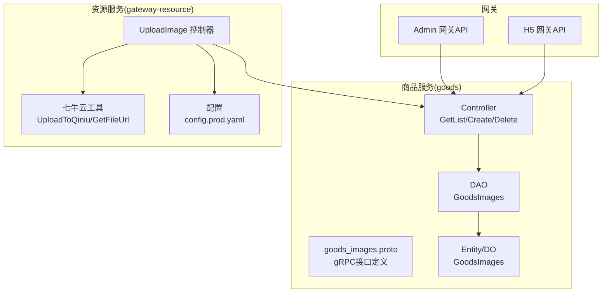
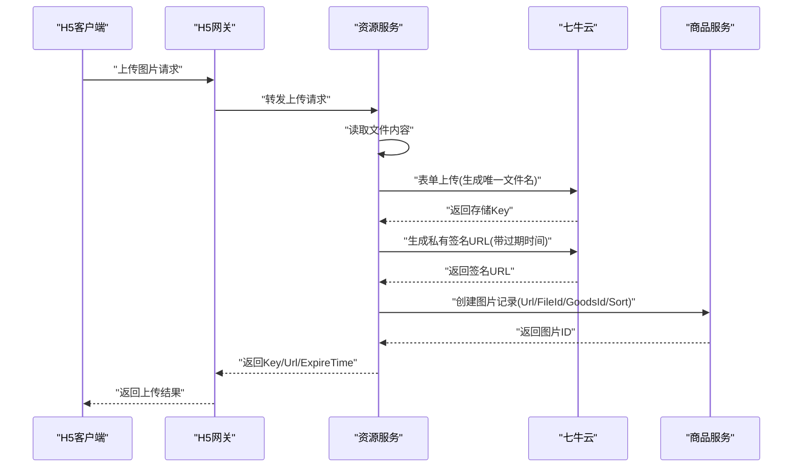
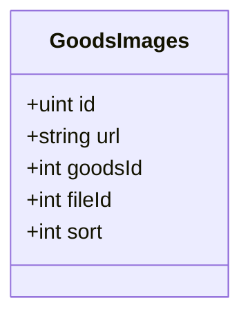
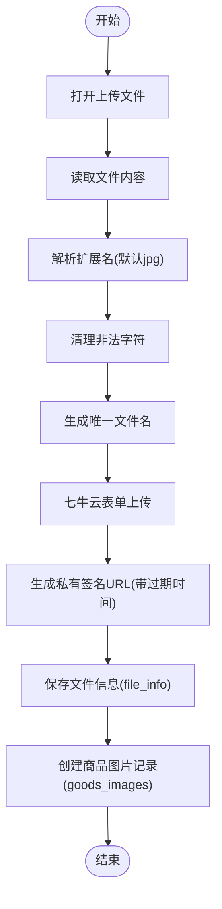
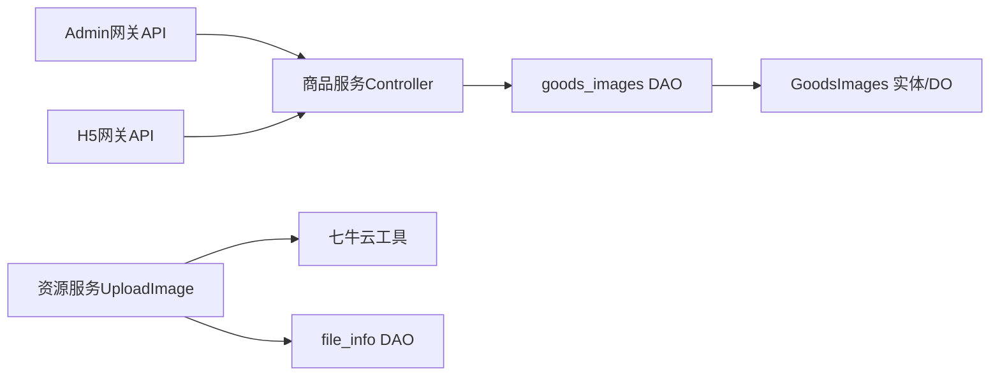

# 商品图片管理

<cite>
**本文引用的文件**
- [app/goods/api/goods_images/v1/goods_images.pb.go](file://app/goods/api/goods_images/v1/goods_images.pb.go)
- [app/goods/manifest/protobuf/goods_images/v1/goods_images.proto](file://app/goods/manifest/protobuf/goods_images/v1/goods_images.proto)
- [app/goods/internal/controller/goods_images/goods_images.go](file://app/goods/internal/controller/goods_images/goods_images.go)
- [app/goods/internal/dao/goods_images.go](file://app/goods/internal/dao/goods_images.go)
- [app/goods/internal/model/entity/goods_images.go](file://app/goods/internal/model/entity/goods_images.go)
- [app/goods/internal/model/do/goods_images.go](file://app/goods/internal/model/do/goods_images.go)
- [app/gateway-admin/api/goods/v1/goods_images.go](file://app/gateway-admin/api/goods/v1/goods_images.go)
- [app/gateway-h5/api/goods/v1/goods_images.go](file://app/gateway-h5/api/goods/v1/goods_images.go)
- [app/gateway-resource/internal/controller/file/file_v1_upload_image.go](file://app/gateway-resource/internal/controller/file/file_v1_upload_image.go)
- [app/gateway-resource/utility/qiniu.go](file://app/gateway-resource/utility/qiniu.go)
- [app/gateway-resource/manifest/config/config.prod.yaml](file://app/gateway-resource/manifest/config/config.prod.yaml)
- [app/gateway-resource/internal/dao/file_info.go](file://app/gateway-resource/internal/dao/file_info.go)
- [init-db/goods_info.sql](file://init-db/goods_info.sql)
</cite>

## 目录
1. [简介](#简介)
2. [项目结构](#项目结构)
3. [核心组件](#核心组件)
4. [架构总览](#架构总览)
5. [详细组件分析](#详细组件分析)
6. [依赖分析](#依赖分析)
7. [性能考虑](#性能考虑)
8. [故障排查指南](#故障排查指南)
9. [结论](#结论)
10. [附录](#附录)

## 简介
本文件系统化阐述商品图片管理功能的设计与实现，覆盖图片上传、存储、管理与展示全流程。重点包括：
- 图片数据模型设计：图片URL、文件ID、排序字段、状态控制等
- 上传流程：文件接收、格式校验、七牛云上传、签名URL生成、入库与返回
- 存储路径与命名：唯一文件名生成、扩展名处理、目录组织
- 管理能力：列表查询、创建绑定、删除解绑
- 展示优化：私有空间签名URL、过期时间控制、CDN加速
- API接口：Admin网关与H5网关的图片管理接口定义
- 代码与配置：关键实现路径与配置要点

## 项目结构
围绕商品图片管理的关键模块分布如下：
- 商品服务（goods）：提供商品图片的gRPC服务、DAO与实体模型
- 网关资源服务（gateway-resource）：提供图片上传、七牛云SDK封装与配置
- 管理端网关（gateway-admin）：提供管理员端图片管理API
- H5端网关（gateway-h5）：提供H5端图片查询API
- 初始化数据库脚本：包含商品主图与多图JSON字段示例

图表来源
- [app/goods/manifest/protobuf/goods_images/v1/goods_images.proto](file://app/goods/manifest/protobuf/goods_images/v1/goods_images.proto#L9-L16)
- [app/goods/internal/controller/goods_images/goods_images.go](file://app/goods/internal/controller/goods_images/goods_images.go#L22-L24)
- [app/goods/internal/dao/goods_images.go](file://app/goods/internal/dao/goods_images.go#L13-L20)
- [app/goods/internal/model/entity/goods_images.go](file://app/goods/internal/model/entity/goods_images.go#L8-L14)
- [app/gateway-resource/internal/controller/file/file_v1_upload_image.go](file://app/gateway-resource/internal/controller/file/file_v1_upload_image.go#L20-L71)
- [app/gateway-resource/utility/qiniu.go](file://app/gateway-resource/utility/qiniu.go#L18-L79)
- [app/gateway-resource/manifest/config/config.prod.yaml](file://app/gateway-resource/manifest/config/config.prod.yaml#L24-L29)
- [app/gateway-admin/api/goods/v1/goods_images.go](file://app/gateway-admin/api/goods/v1/goods_images.go#L7-L50)
- [app/gateway-h5/api/goods/v1/goods_images.go](file://app/gateway-h5/api/goods/v1/goods_images.go#L7-L50)

章节来源
- [app/goods/manifest/protobuf/goods_images/v1/goods_images.proto](file://app/goods/manifest/protobuf/goods_images/v1/goods_images.proto#L1-L56)
- [app/goods/internal/controller/goods_images/goods_images.go](file://app/goods/internal/controller/goods_images/goods_images.go#L1-L99)
- [app/gateway-resource/internal/controller/file/file_v1_upload_image.go](file://app/gateway-resource/internal/controller/file/file_v1_upload_image.go#L1-L72)
- [app/gateway-resource/utility/qiniu.go](file://app/gateway-resource/utility/qiniu.go#L1-L141)
- [app/gateway-admin/api/goods/v1/goods_images.go](file://app/gateway-admin/api/goods/v1/goods_images.go#L1-L50)
- [app/gateway-h5/api/goods/v1/goods_images.go](file://app/gateway-h5/api/goods/v1/goods_images.go#L1-L50)

## 核心组件
- 商品图片gRPC服务：提供列表、创建、删除接口，数据在商品服务内部持久化
- 资源上传控制器：接收图片文件，调用七牛云SDK上传，生成签名URL并落库
- 七牛云工具：封装上传、签名URL生成、唯一文件名策略
- 网关API：Admin与H5分别暴露图片管理与查询接口
- 数据模型：GoodsImages实体与DO结构，映射数据库字段

章节来源
- [app/goods/api/goods_images/v1/goods_images.pb.go](file://app/goods/api/goods_images/v1/goods_images.pb.go#L65-L128)
- [app/goods/internal/model/entity/goods_images.go](file://app/goods/internal/model/entity/goods_images.go#L8-L14)
- [app/gateway-resource/internal/controller/file/file_v1_upload_image.go](file://app/gateway-resource/internal/controller/file/file_v1_upload_image.go#L20-L71)
- [app/gateway-resource/utility/qiniu.go](file://app/gateway-resource/utility/qiniu.go#L18-L79)

## 架构总览
商品图片管理采用“上传—存储—绑定—查询”的闭环架构：
- 上传阶段：H5/Admin网关接收图片，转发至资源服务进行七牛云上传与入库
- 存储阶段：七牛云私有空间存储，生成带过期时间的签名URL
- 绑定阶段：商品服务将图片记录与商品ID、文件ID、排序等信息持久化
- 查询阶段：Admin/H5网关通过商品服务查询图片列表，返回URL与排序

图表来源
- [app/gateway-resource/internal/controller/file/file_v1_upload_image.go](file://app/gateway-resource/internal/controller/file/file_v1_upload_image.go#L20-L71)
- [app/gateway-resource/utility/qiniu.go](file://app/gateway-resource/utility/qiniu.go#L18-L79)
- [app/goods/internal/controller/goods_images/goods_images.go](file://app/goods/internal/controller/goods_images/goods_images.go#L73-L85)

## 详细组件分析

### 数据模型设计
- 字段说明
  - id：自增主键
  - url：图片URL（七牛云私有空间签名URL）
  - goods_id：商品ID
  - file_id：文件ID（关联file_info）
  - sort：排序字段（用于前端展示顺序）

图表来源
- [app/goods/internal/model/entity/goods_images.go](file://app/goods/internal/model/entity/goods_images.go#L8-L14)

章节来源
- [app/goods/internal/model/entity/goods_images.go](file://app/goods/internal/model/entity/goods_images.go#L8-L14)
- [app/goods/internal/model/do/goods_images.go](file://app/goods/internal/model/do/goods_images.go#L12-L19)

### 上传流程与文件处理
- 文件接收与读取：从multipart/form-data中获取文件流并读取字节
- 格式与扩展名：根据文件名推断扩展名，默认jpg；清理非法字符
- 唯一文件名：保留原文件名前缀，拼接时间戳与随机串，确保唯一性
- 上传到七牛云：使用表单上传，指定区域、HTTPS与CDN域名
- 签名URL：生成带过期时间的私有URL，便于安全访问
- 入库与返回：将URL、Key、过期时间写入file_info，并在商品服务创建图片记录

图表来源
- [app/gateway-resource/internal/controller/file/file_v1_upload_image.go](file://app/gateway-resource/internal/controller/file/file_v1_upload_image.go#L20-L71)
- [app/gateway-resource/utility/qiniu.go](file://app/gateway-resource/utility/qiniu.go#L18-L79)
- [app/gateway-resource/utility/qiniu.go](file://app/gateway-resource/utility/qiniu.go#L103-L126)
- [app/gateway-resource/utility/qiniu.go](file://app/gateway-resource/utility/qiniu.go#L128-L140)

章节来源
- [app/gateway-resource/internal/controller/file/file_v1_upload_image.go](file://app/gateway-resource/internal/controller/file/file_v1_upload_image.go#L20-L71)
- [app/gateway-resource/utility/qiniu.go](file://app/gateway-resource/utility/qiniu.go#L18-L79)
- [app/gateway-resource/utility/qiniu.go](file://app/gateway-resource/utility/qiniu.go#L103-L140)

### 存储路径与命名策略
- 区域与协议：使用华南区、HTTPS与CDN域名
- 唯一文件名：保留原文件名（清理非法字符），追加时间戳与随机串，确保跨目录唯一
- 扩展名：若无法识别扩展名则回退为jpg
- 目录组织：七牛云按存储桶内目录组织，不强制要求业务层目录结构

章节来源
- [app/gateway-resource/utility/qiniu.go](file://app/gateway-resource/utility/qiniu.go#L39-L44)
- [app/gateway-resource/utility/qiniu.go](file://app/gateway-resource/utility/qiniu.go#L46-L50)
- [app/gateway-resource/utility/qiniu.go](file://app/gateway-resource/utility/qiniu.go#L103-L126)

### 图片管理API
- Admin网关API
  - 图片列表：GET /goods/images，分页查询
  - 创建图片：POST /goods/images，传入url、goods_id、file_id、sort
  - 删除图片：DELETE /goods/images，传入id
- H5网关API
  - 图片列表：GET /goods/images，分页查询

章节来源
- [app/gateway-admin/api/goods/v1/goods_images.go](file://app/gateway-admin/api/goods/v1/goods_images.go#L7-L50)
- [app/gateway-h5/api/goods/v1/goods_images.go](file://app/gateway-h5/api/goods/v1/goods_images.go#L7-L50)

### 商品服务gRPC接口
- GetList：分页查询商品图片列表
- Create：创建商品图片记录（goods_id、file_id、sort）
- Delete：按id删除商品图片

章节来源
- [app/goods/manifest/protobuf/goods_images/v1/goods_images.proto](file://app/goods/manifest/protobuf/goods_images/v1/goods_images.proto#L9-L16)
- [app/goods/api/goods_images/v1/goods_images.pb.go](file://app/goods/api/goods_images/v1/goods_images.pb.go#L65-L128)

### 商品图片控制器
- GetList：统计总数、分页查询、结构转换为PB实体
- Create：插入记录并返回自增ID
- Delete：按id删除

章节来源
- [app/goods/internal/controller/goods_images/goods_images.go](file://app/goods/internal/controller/goods_images/goods_images.go#L26-L71)
- [app/goods/internal/controller/goods_images/goods_images.go](file://app/goods/internal/controller/goods_images/goods_images.go#L73-L85)
- [app/goods/internal/controller/goods_images/goods_images.go](file://app/goods/internal/controller/goods_images/goods_images.go#L87-L98)

### DAO与实体
- DAO：统一访问goods_images表，支持Count/Page/All/Delete/InsertAndGetId
- Entity/DO：映射数据库字段，支持结构体转换与ORM映射

章节来源
- [app/goods/internal/dao/goods_images.go](file://app/goods/internal/dao/goods_images.go#L13-L20)
- [app/goods/internal/model/entity/goods_images.go](file://app/goods/internal/model/entity/goods_images.go#L8-L14)
- [app/goods/internal/model/do/goods_images.go](file://app/goods/internal/model/do/goods_images.go#L12-L19)

### 文件信息与存储DAO
- file_info表DAO：提供FileInfo全局对象，用于文件元信息管理
- 与商品图片的关联：goods_images.file_id 关联 file_info.id

章节来源
- [app/gateway-resource/internal/dao/file_info.go](file://app/gateway-resource/internal/dao/file_info.go#L13-L20)

### 数据库初始化与示例
- goods_info表包含主图字段与多图JSON字段示例，体现商品与图片的关联方式
- 可作为商品详情页图片展示的数据来源之一

章节来源
- [init-db/goods_info.sql](file://init-db/goods_info.sql#L24-L51)

## 依赖分析
- 控制器依赖DAO与实体，DAO依赖内部DAO实现
- 资源服务上传控制器依赖七牛云工具与配置
- 网关API通过gRPC调用商品服务控制器
- 商品服务DAO与搜索服务DAO共享goods_images表结构

图表来源
- [app/goods/internal/controller/goods_images/goods_images.go](file://app/goods/internal/controller/goods_images/goods_images.go#L22-L24)
- [app/gateway-resource/internal/controller/file/file_v1_upload_image.go](file://app/gateway-resource/internal/controller/file/file_v1_upload_image.go#L20-L71)
- [app/gateway-resource/utility/qiniu.go](file://app/gateway-resource/utility/qiniu.go#L18-L79)
- [app/goods/internal/dao/goods_images.go](file://app/goods/internal/dao/goods_images.go#L13-L20)
- [app/goods/internal/model/entity/goods_images.go](file://app/goods/internal/model/entity/goods_images.go#L8-L14)

## 性能考虑
- 上传性能
  - 七牛云使用表单上传，支持CDN加速与HTTPS，提升传输稳定性
  - 唯一文件名策略避免重复覆盖，减少冲突与重试成本
- 查询性能
  - 分页查询与总数统计，结合索引可进一步优化
  - PB结构体序列化降低网络传输开销
- 缓存与一致性
  - 商品详情页图片可结合缓存策略，注意更新后失效
- 安全与防盗链
  - 私有空间签名URL带过期时间，限制访问窗口
  - 可结合Referer白名单策略进一步增强防盗链能力

## 故障排查指南
- 七牛云配置缺失
  - 现象：上传失败，返回配置缺失错误
  - 处理：检查配置文件中的accessKey、secretKey、bucket、domain、expireTime
- 文件读取失败
  - 现象：打开文件或读取内容失败
  - 处理：确认请求体中存在文件字段，检查文件大小与格式
- 数据库操作异常
  - 现象：创建/删除/查询失败
  - 处理：检查goods_images与file_info表结构与权限，确认事务与索引
- URL签名异常
  - 现象：签名URL无法访问或提前过期
  - 处理：核对MAC密钥、过期时间设置与当前时间差

章节来源
- [app/gateway-resource/utility/qiniu.go](file://app/gateway-resource/utility/qiniu.go#L20-L24)
- [app/gateway-resource/utility/qiniu.go](file://app/gateway-resource/utility/qiniu.go#L74-L78)
- [app/gateway-resource/manifest/config/config.prod.yaml](file://app/gateway-resource/manifest/config/config.prod.yaml#L24-L29)
- [app/goods/internal/controller/goods_images/goods_images.go](file://app/goods/internal/controller/goods_images/goods_images.go#L37-L42)
- [app/goods/internal/controller/goods_images/goods_images.go](file://app/goods/internal/controller/goods_images/goods_images.go#L89-L94)

## 结论
本方案以七牛云私有空间为核心存储，结合签名URL与过期时间实现安全可控的图片访问；通过gRPC与网关API形成清晰的职责边界，既满足管理端的批量操作需求，也兼顾H5端的高效查询。建议后续在以下方面持续优化：
- 图片压缩与多尺寸生成（如缩略图、详情图）
- CDN边缘节点与缓存策略
- 图片裁剪与水印功能
- 图片状态控制与审核流程
- 多租户与权限隔离

## 附录

### API接口定义（Admin/H5）
- Admin网关
  - GET /goods/images：分页查询商品图片列表
  - POST /goods/images：创建商品图片（url、goods_id、file_id、sort）
  - DELETE /goods/images：删除商品图片（id）
- H5网关
  - GET /goods/images：分页查询商品图片列表

章节来源
- [app/gateway-admin/api/goods/v1/goods_images.go](file://app/gateway-admin/api/goods/v1/goods_images.go#L7-L50)
- [app/gateway-h5/api/goods/v1/goods_images.go](file://app/gateway-h5/api/goods/v1/goods_images.go#L7-L50)

### 配置项参考
- 七牛云配置（config.prod.yaml）
  - accessKey：访问密钥
  - secretKey：私有密钥
  - bucket：存储桶名称
  - domain：访问域名
  - expireTime：签名URL过期时间（秒）

章节来源
- [app/gateway-resource/manifest/config/config.prod.yaml](file://app/gateway-resource/manifest/config/config.prod.yaml#L24-L29)