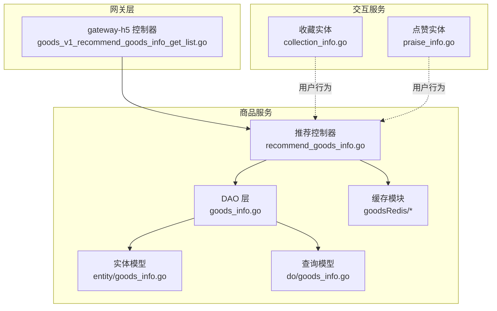
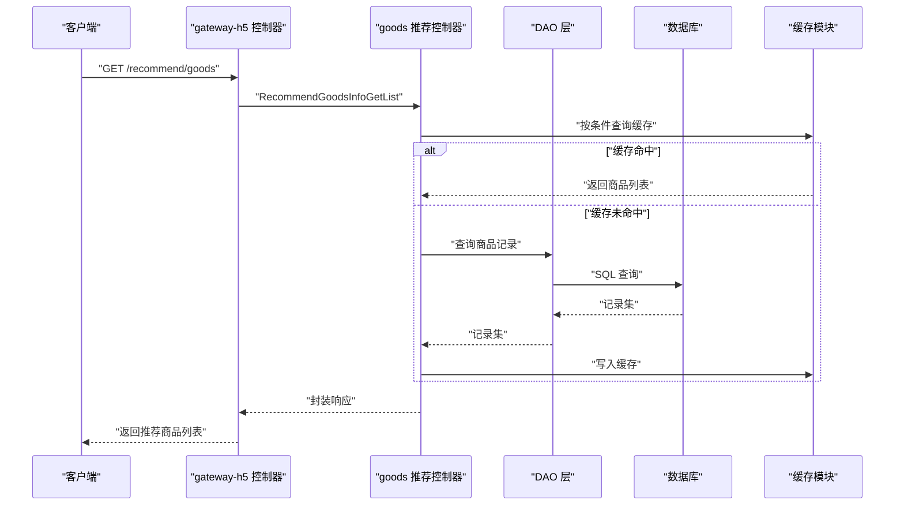
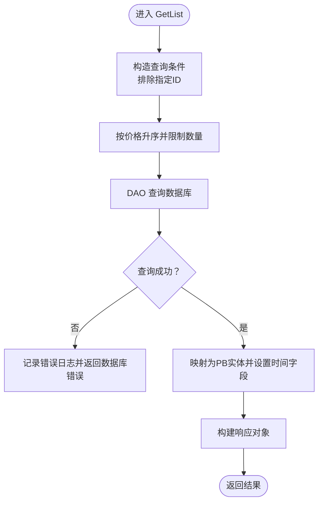
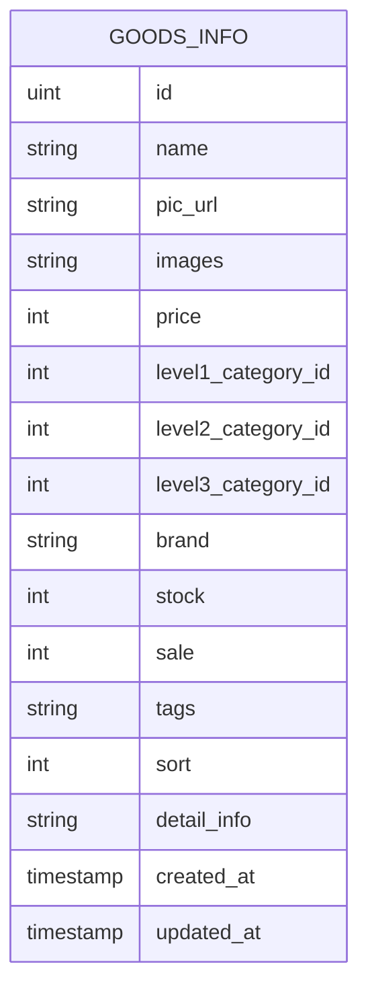
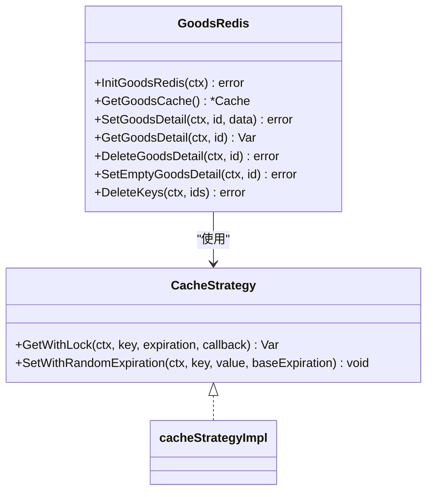
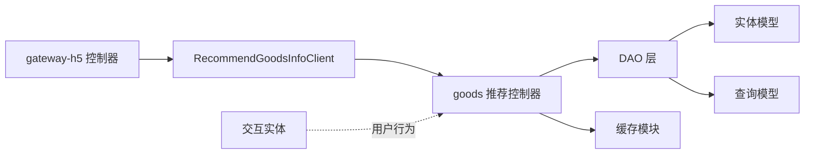

# 商品推荐系统

<cite>
**本文引用的文件**
- [recommend_goods_info.go](file://app/goods/internal/controller/recommend_goods_info/recommend_goods_info.go)
- [goods_v1_recommend_goods_info_get_list.go](file://app/gateway-h5/internal/controller/goods/goods_v1_recommend_goods_info_get_list.go)
- [recommend_goods_info.pb.go](file://app/goods/api/recommend_goods_info/v1/recommend_goods_info.pb.go)
- [recommend_goods_info_grpc.pb.go](file://app/goods/api/recommend_goods_info/v1/recommend_goods_info_grpc.pb.go)
- [goods_info.go](file://app/goods/internal/model/entity/goods_info.go)
- [goods_info.go](file://app/goods/internal/model/do/goods_info.go)
- [redis.go](file://app/goods/utility/goodsRedis/redis.go)
- [goods.go](file://app/goods/utility/goodsRedis/goods.go)
- [cache_strategy.go](file://app/goods/utility/goodsRedis/cache_strategy.go)
- [recommend_goods_info.go](file://app/gateway-h5/api/goods/v1/recommend_goods_info.go)
- [collection_info.go](file://app/interaction/internal/model/entity/collection_info.go)
- [praise_info.go](file://app/interaction/internal/model/entity/praise_info.go)
- [consts.go](file://utility/consts/consts.go)
</cite>

## 目录
1. [引言](#引言)
2. [项目结构](#项目结构)
3. [核心组件](#核心组件)
4. [架构总览](#架构总览)
5. [详细组件分析](#详细组件分析)
6. [依赖关系分析](#依赖关系分析)
7. [性能考虑](#性能考虑)
8. [故障排查指南](#故障排查指南)
9. [结论](#结论)
10. [附录](#附录)

## 引言
本文件面向“商品推荐系统”的设计与实现，结合仓库现有代码，系统性梳理推荐数据模型、推荐算法配置、推荐结果排序机制、个性化实现原理、推荐效果评估、推荐召回优化、缓存策略、更新机制与统计分析等主题。当前仓库中已实现基础的商品推荐接口与缓存策略，推荐算法以“基于商品属性的简单排序”为主，后续可在此基础上扩展为“基于用户行为的协同过滤、基于内容的推荐、热门商品推荐”等策略。

## 项目结构
推荐系统涉及三层：
- 网关层（gateway-h5）：接收前端请求，转发至商品服务。
- 商品服务（goods）：实现推荐接口逻辑与缓存策略。
- 交互服务（interaction）：提供收藏、点赞等用户行为数据，为后续协同过滤与内容推荐提供输入。

图表来源
- [goods_v1_recommend_goods_info_get_list.go](file://app/gateway-h5/internal/controller/goods/goods_v1_recommend_goods_info_get_list.go#L1-L35)
- [recommend_goods_info.go](file://app/goods/internal/controller/recommend_goods_info/recommend_goods_info.go#L1-L61)
- [goods_info.go](file://app/goods/internal/model/entity/goods_info.go#L1-L33)
- [goods_info.go](file://app/goods/internal/model/do/goods_info.go#L1-L35)
- [redis.go](file://app/goods/utility/goodsRedis/redis.go#L1-L48)
- [goods.go](file://app/goods/utility/goodsRedis/goods.go#L1-L121)
- [cache_strategy.go](file://app/goods/utility/goodsRedis/cache_strategy.go#L1-L96)
- [collection_info.go](file://app/interaction/internal/model/entity/collection_info.go#L1-L20)
- [praise_info.go](file://app/interaction/internal/model/entity/praise_info.go#L1-L20)

章节来源
- [goods_v1_recommend_goods_info_get_list.go](file://app/gateway-h5/internal/controller/goods/goods_v1_recommend_goods_info_get_list.go#L1-L35)
- [recommend_goods_info.go](file://app/goods/internal/controller/recommend_goods_info/recommend_goods_info.go#L1-L61)
- [goods_info.go](file://app/goods/internal/model/entity/goods_info.go#L1-L33)
- [goods_info.go](file://app/goods/internal/model/do/goods_info.go#L1-L35)
- [redis.go](file://app/goods/utility/goodsRedis/redis.go#L1-L48)
- [goods.go](file://app/goods/utility/goodsRedis/goods.go#L1-L121)
- [cache_strategy.go](file://app/goods/utility/goodsRedis/cache_strategy.go#L1-L96)
- [collection_info.go](file://app/interaction/internal/model/entity/collection_info.go#L1-L20)
- [praise_info.go](file://app/interaction/internal/model/entity/praise_info.go#L1-L20)

## 核心组件
- 推荐控制器：负责接收请求、调用DAO层查询商品、组装响应。
- 推荐API定义：通过Protocol Buffers定义请求/响应结构。
- 缓存模块：提供Redis缓存初始化、读写、空值缓存、随机过期等策略。
- 交互实体：收藏、点赞等用户行为数据，为后续协同过滤与内容推荐提供输入。

章节来源
- [recommend_goods_info.go](file://app/goods/internal/controller/recommend_goods_info/recommend_goods_info.go#L19-L61)
- [recommend_goods_info.pb.go](file://app/goods/api/recommend_goods_info/v1/recommend_goods_info.pb.go#L326-L330)
- [redis.go](file://app/goods/utility/goodsRedis/redis.go#L13-L48)
- [goods.go](file://app/goods/utility/goodsRedis/goods.go#L12-L52)
- [cache_strategy.go](file://app/goods/utility/goodsRedis/cache_strategy.go#L18-L96)
- [collection_info.go](file://app/interaction/internal/model/entity/collection_info.go#L11-L20)
- [praise_info.go](file://app/interaction/internal/model/entity/praise_info.go#L11-L20)

## 架构总览
推荐系统采用“网关-服务-缓存-数据库”的分层架构。网关层负责协议转换与参数透传；商品服务负责业务逻辑与缓存；缓存模块提供高性能读取与一致性保障；数据库提供持久化存储。

图表来源
- [goods_v1_recommend_goods_info_get_list.go](file://app/gateway-h5/internal/controller/goods/goods_v1_recommend_goods_info_get_list.go#L13-L34)
- [recommend_goods_info.go](file://app/goods/internal/controller/recommend_goods_info/recommend_goods_info.go#L27-L60)
- [redis.go](file://app/goods/utility/goodsRedis/redis.go#L14-L42)
- [goods.go](file://app/goods/utility/goodsRedis/goods.go#L25-L52)

## 详细组件分析

### 推荐控制器与API
- 接口职责：接收请求参数（如商品ID、数量），查询商品并返回列表。
- 当前策略：排除指定ID后按价格升序返回若干商品。
- 错误处理：统一记录日志并返回数据库操作错误码。

图表来源
- [recommend_goods_info.go](file://app/goods/internal/controller/recommend_goods_info/recommend_goods_info.go#L27-L60)

章节来源
- [recommend_goods_info.go](file://app/goods/internal/controller/recommend_goods_info/recommend_goods_info.go#L27-L60)
- [recommend_goods_info.pb.go](file://app/goods/api/recommend_goods_info/v1/recommend_goods_info.pb.go#L326-L330)
- [recommend_goods_info_grpc.pb.go](file://app/goods/api/recommend_goods_info/v1/recommend_goods_info_grpc.pb.go#L79-L89)
- [recommend_goods_info.go](file://app/gateway-h5/api/goods/v1/recommend_goods_info.go#L8-L19)

### 推荐数据模型
- 商品实体模型：包含商品ID、名称、图片、价格、分类、品牌、库存、销量、标签、详情、排序等字段。
- 查询模型：用于DAO层的Where/Data查询条件封装。
- PB响应模型：推荐接口的列表与单项结构，包含商品字段与排序字段。

图表来源
- [goods_info.go](file://app/goods/internal/model/entity/goods_info.go#L12-L32)
- [goods_info.go](file://app/goods/internal/model/do/goods_info.go#L13-L34)

章节来源
- [goods_info.go](file://app/goods/internal/model/entity/goods_info.go#L12-L32)
- [goods_info.go](file://app/goods/internal/model/do/goods_info.go#L13-L34)
- [recommend_goods_info.pb.go](file://app/goods/api/recommend_goods_info/v1/recommend_goods_info.pb.go#L79-L98)

### 缓存策略与一致性
- Redis初始化：从配置读取Redis配置，创建连接并测试连通性。
- 商品详情缓存：提供设置、获取、删除、空值缓存（防止穿透）、批量删除与延迟双删。
- 随机过期：在设置缓存时加入5%-15%的随机偏移，降低雪崩风险。
- 分布式锁：本地互斥锁避免同一Key并发回源数据库。

图表来源
- [cache_strategy.go](file://app/goods/utility/goodsRedis/cache_strategy.go#L18-L96)
- [redis.go](file://app/goods/utility/goodsRedis/redis.go#L13-L48)
- [goods.go](file://app/goods/utility/goodsRedis/goods.go#L12-L121)

章节来源
- [redis.go](file://app/goods/utility/goodsRedis/redis.go#L13-L48)
- [goods.go](file://app/goods/utility/goodsRedis/goods.go#L18-L121)
- [cache_strategy.go](file://app/goods/utility/goodsRedis/cache_strategy.go#L32-L96)

### 用户行为数据模型
- 收藏实体：包含用户ID、对象ID、类型（1商品/2文章）等。
- 点赞实体：包含用户ID、类型、对象ID等。

这些实体为后续协同过滤与内容推荐提供基础数据。

章节来源
- [collection_info.go](file://app/interaction/internal/model/entity/collection_info.go#L11-L20)
- [praise_info.go](file://app/interaction/internal/model/entity/praise_info.go#L11-L20)

### 推荐算法配置与排序机制
- 当前实现：基于商品属性的简单排序（价格升序），并排除指定商品ID。
- 排序字段：实体模型包含sort字段，可用于后续更复杂的排序策略。
- 参数配置：请求参数包含商品ID与数量，后续可扩展为权重、阈值等配置。

章节来源
- [recommend_goods_info.go](file://app/goods/internal/controller/recommend_goods_info/recommend_goods_info.go#L32-L35)
- [goods_info.go](file://app/goods/internal/model/entity/goods_info.go#L25-L25)

### 个性化推荐实现原理
- 协同过滤：基于用户对商品的收藏、点赞等行为，计算相似用户或相似商品，生成候选集。
- 基于内容的推荐：利用商品的品牌、分类、标签等特征，计算与用户历史偏好相似的商品。
- 热门推荐：综合销量、评分、近期热度等指标进行排序。
- 当前状态：仓库未实现上述算法，仅提供基础排序与缓存能力，后续可在此基础上扩展。

（本节为概念性说明，不直接分析具体文件）

### 推荐效果评估与召回优化
- 评估指标：点击率、转化率、停留时长、复购率等。
- 召回优化：引入多路召回（热门、协同、内容），并行打散后融合排序。
- 当前状态：仓库未提供评估与优化实现，后续可接入埋点与A/B实验框架。

（本节为概念性说明，不直接分析具体文件）

### 推荐更新机制与统计分析
- 更新机制：商品上下架、价格变动、销量变化等事件触发缓存失效与重算。
- 统计分析：基于交互数据统计商品偏好分布，指导特征工程与模型训练。
- 当前状态：仓库未提供专门的统计分析模块，可基于交互实体与定时任务实现。

（本节为概念性说明，不直接分析具体文件）

## 依赖关系分析
- 网关层依赖商品服务的gRPC客户端，进行请求转发与响应拼装。
- 商品服务依赖DAO层与缓存模块，DAO层依赖实体与查询模型。
- 交互服务提供收藏、点赞等用户行为数据，为推荐算法提供输入。

图表来源
- [goods_v1_recommend_goods_info_get_list.go](file://app/gateway-h5/internal/controller/goods/goods_v1_recommend_goods_info_get_list.go#L13-L34)
- [recommend_goods_info.go](file://app/goods/internal/controller/recommend_goods_info/recommend_goods_info.go#L27-L60)
- [goods_info.go](file://app/goods/internal/model/entity/goods_info.go#L12-L32)
- [goods_info.go](file://app/goods/internal/model/do/goods_info.go#L13-L34)
- [redis.go](file://app/goods/utility/goodsRedis/redis.go#L13-L48)
- [collection_info.go](file://app/interaction/internal/model/entity/collection_info.go#L11-L20)
- [praise_info.go](file://app/interaction/internal/model/entity/praise_info.go#L11-L20)

章节来源
- [goods_v1_recommend_goods_info_get_list.go](file://app/gateway-h5/internal/controller/goods/goods_v1_recommend_goods_info_get_list.go#L13-L34)
- [recommend_goods_info.go](file://app/goods/internal/controller/recommend_goods_info/recommend_goods_info.go#L27-L60)
- [goods_info.go](file://app/goods/internal/model/entity/goods_info.go#L12-L32)
- [goods_info.go](file://app/goods/internal/model/do/goods_info.go#L13-L34)
- [redis.go](file://app/goods/utility/goodsRedis/redis.go#L13-L48)
- [collection_info.go](file://app/interaction/internal/model/entity/collection_info.go#L11-L20)
- [praise_info.go](file://app/interaction/internal/model/entity/praise_info.go#L11-L20)

## 性能考虑
- 缓存优先：优先从缓存读取，未命中再回源数据库。
- 防穿透：空值缓存与延迟双删降低缓存穿透与击穿风险。
- 防雪崩：随机过期时间分散过期高峰。
- 数据库优化：合理索引（如价格、分类、销量）与分页查询。
- 并发控制：本地互斥锁避免热点Key并发回源。

（本节为通用性能建议，不直接分析具体文件）

## 故障排查指南
- 数据库错误：统一记录日志并返回数据库操作错误码。
- 缓存异常：检查Redis连接、键空间、过期策略与空值缓存。
- 参数校验：确认请求参数（商品ID、数量）合法。

章节来源
- [recommend_goods_info.go](file://app/goods/internal/controller/recommend_goods_info/recommend_goods_info.go#L34-L39)
- [consts.go](file://utility/consts/consts.go#L44-L46)
- [redis.go](file://app/goods/utility/goodsRedis/redis.go#L16-L42)
- [goods.go](file://app/goods/utility/goodsRedis/goods.go#L18-L23)

## 结论
当前仓库实现了基础的商品推荐接口与缓存策略，能够满足简单的“按价格排序+排除指定商品”的推荐需求。后续可在现有基础上扩展为“基于用户行为的协同过滤、基于内容的推荐、热门商品推荐”等策略，并完善效果评估、召回优化、更新机制与统计分析体系，以支撑更复杂的个性化推荐场景。

## 附录

### API 接口文档
- 接口路径：/recommend/goods
- 方法：GET
- 请求参数：
  - id：排除的商品ID（uint32）
  - count：返回数量（uint32）
- 响应参数：
  - list：商品列表（数组）
  - total：返回数量（uint32）

章节来源
- [recommend_goods_info.go](file://app/gateway-h5/api/goods/v1/recommend_goods_info.go#L8-L19)
- [recommend_goods_info.pb.go](file://app/goods/api/recommend_goods_info/v1/recommend_goods_info.pb.go#L326-L330)

### 算法参数配置
- 排序策略：当前为价格升序，后续可扩展为权重组合（价格权重、销量权重、标签匹配度等）。
- 过滤策略：排除指定商品ID，后续可扩展为品类过滤、价格区间过滤等。
- 缓存参数：空值缓存过期时间、随机过期范围、批量删除延迟时间等。

章节来源
- [recommend_goods_info.go](file://app/goods/internal/controller/recommend_goods_info/recommend_goods_info.go#L32-L35)
- [cache_strategy.go](file://app/goods/utility/goodsRedis/cache_strategy.go#L80-L90)
- [goods.go](file://app/goods/utility/goodsRedis/goods.go#L18-L23)

### 性能优化建议
- 引入多路召回与并行打散，提升覆盖率与多样性。
- 使用布隆过滤器预筛无效ID，减少无效查询。
- 对热点商品Key增加本地副本与异步刷新。
- 增加限流与熔断，保护下游数据库与缓存。

（本节为通用优化建议，不直接分析具体文件）