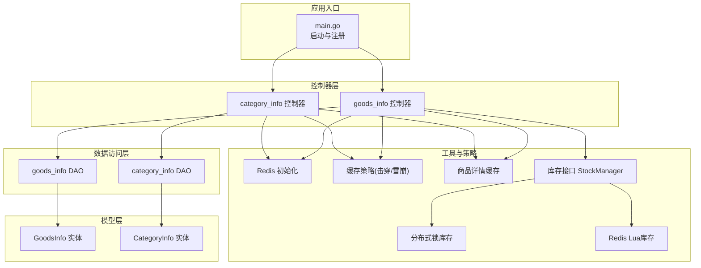
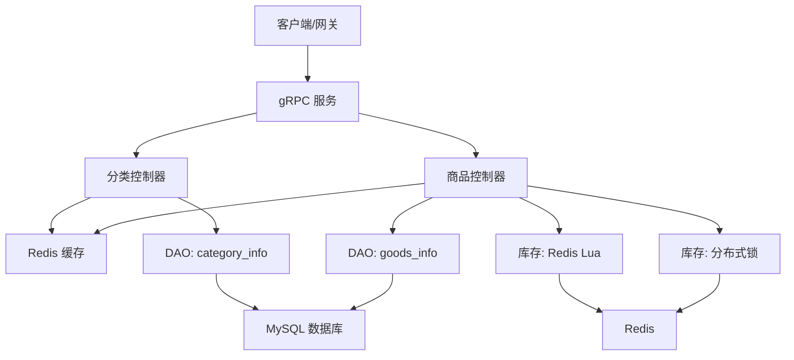
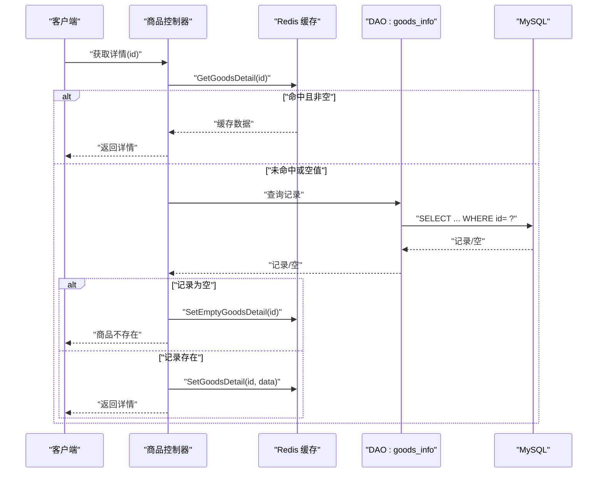
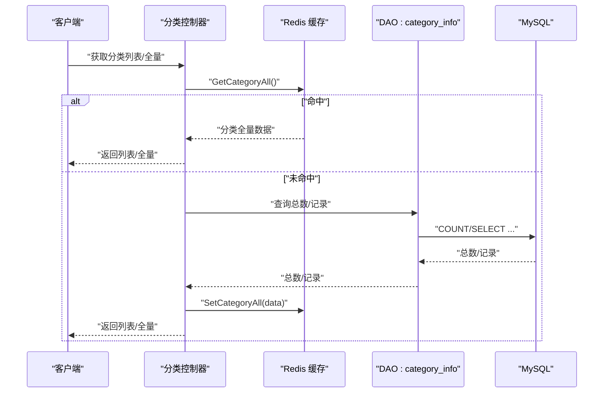
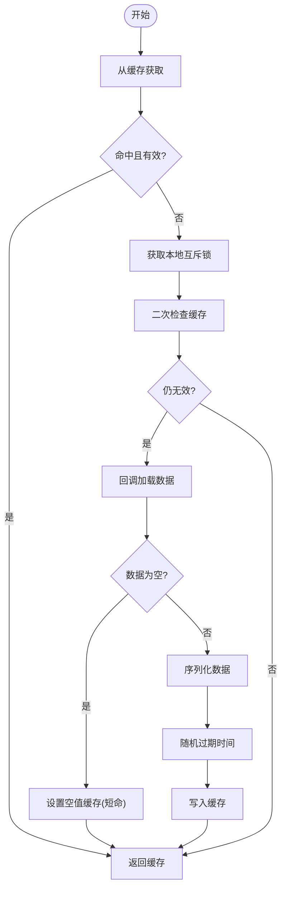
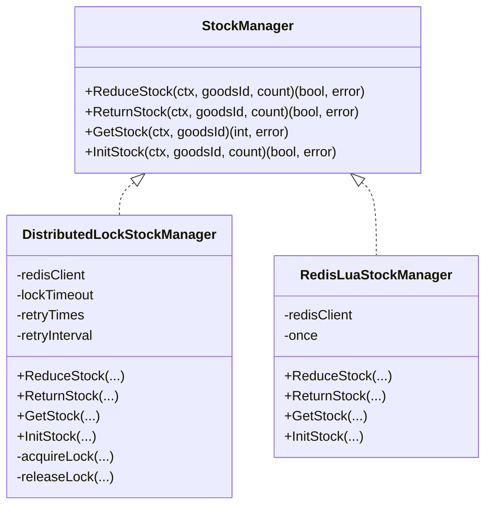
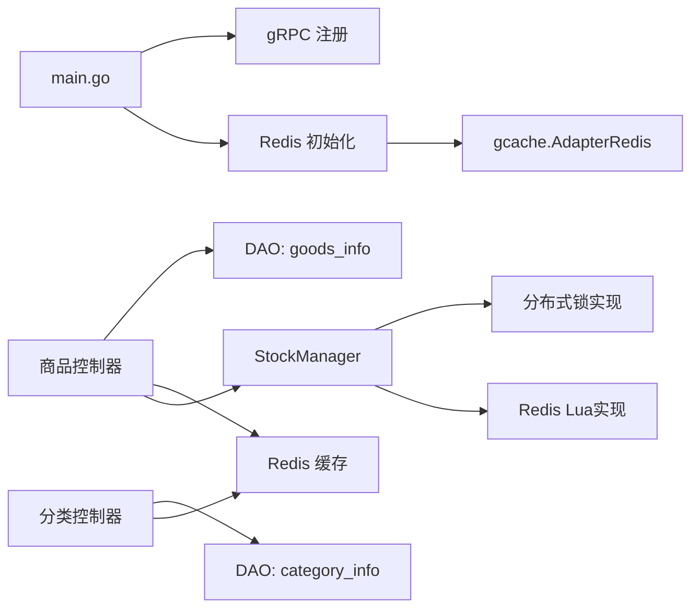

# 商品服务模块

<cite>
**本文引用的文件**
- [app/goods/main.go](file://app/goods/main.go)
- [app/goods/internal/model/entity/goods_info.go](file://app/goods/internal/model/entity/goods_info.go)
- [app/goods/internal/model/entity/category_info.go](file://app/goods/internal/model/entity/category_info.go)
- [app/goods/internal/controller/goods_info/goods_info.go](file://app/goods/internal/controller/goods_info/goods_info.go)
- [app/goods/internal/controller/category_info/category_info.go](file://app/goods/internal/controller/category_info/category_info.go)
- [app/goods/internal/dao/goods_info.go](file://app/goods/internal/dao/goods_info.go)
- [app/goods/internal/dao/category_info.go](file://app/goods/internal/dao/category_info.go)
- [app/goods/utility/goodsRedis/redis.go](file://app/goods/utility/goodsRedis/redis.go)
- [app/goods/utility/goodsRedis/cache_strategy.go](file://app/goods/utility/goodsRedis/cache_strategy.go)
- [app/goods/utility/goodsRedis/goods.go](file://app/goods/utility/goodsRedis/goods.go)
- [app/goods/utility/stock/stock.go](file://app/goods/utility/stock/stock.go)
- [app/goods/utility/stock/distributed_lock.go](file://app/goods/utility/stock/distributed_lock.go)
- [app/goods/utility/stock/redis_lua.go](file://app/goods/utility/stock/redis_lua.go)
</cite>

## 目录
1. [简介](#简介)
2. [项目结构](#项目结构)
3. [核心组件](#核心组件)
4. [架构总览](#架构总览)
5. [详细组件分析](#详细组件分析)
6. [依赖关系分析](#依赖关系分析)
7. [性能考量](#性能考量)
8. [故障排查指南](#故障排查指南)
9. [结论](#结论)
10. [附录](#附录)

## 简介
本文件面向商品服务模块，系统性阐述其整体架构、商品信息管理、商品分类系统、库存管理机制与推荐相关能力，以及缓存策略、库存扣减逻辑、分布式锁机制、图片管理、评价系统、拼团功能等扩展能力。文档同时给出Redis缓存优化、库存防超卖策略、商品搜索集成的技术实现要点，并提供API接口说明、配置参数与性能调优方案。

## 项目结构
商品服务采用GoFrame微服务框架，遵循“控制器-逻辑-数据访问-模型”的分层组织方式；缓存与库存策略独立在utility目录下，便于复用与测试。

图表来源
- [app/goods/main.go](file://app/goods/main.go#L15-L34)
- [app/goods/internal/controller/goods_info/goods_info.go](file://app/goods/internal/controller/goods_info/goods_info.go#L23-L29)
- [app/goods/internal/controller/category_info/category_info.go](file://app/goods/internal/controller/category_info/category_info.go#L21-L27)
- [app/goods/internal/dao/goods_info.go](file://app/goods/internal/dao/goods_info.go#L11-L20)
- [app/goods/internal/dao/category_info.go](file://app/goods/internal/dao/category_info.go#L11-L20)
- [app/goods/utility/goodsRedis/redis.go](file://app/goods/utility/goodsRedis/redis.go#L13-L43)
- [app/goods/utility/goodsRedis/cache_strategy.go](file://app/goods/utility/goodsRedis/cache_strategy.go#L18-L96)
- [app/goods/utility/goodsRedis/goods.go](file://app/goods/utility/goodsRedis/goods.go#L12-L121)
- [app/goods/utility/stock/stock.go](file://app/goods/utility/stock/stock.go#L7-L32)
- [app/goods/utility/stock/distributed_lock.go](file://app/goods/utility/stock/distributed_lock.go#L13-L266)
- [app/goods/utility/stock/redis_lua.go](file://app/goods/utility/stock/redis_lua.go#L12-L166)

章节来源
- [app/goods/main.go](file://app/goods/main.go#L1-L35)
- [app/goods/internal/controller/goods_info/goods_info.go](file://app/goods/internal/controller/goods_info/goods_info.go#L1-L257)
- [app/goods/internal/controller/category_info/category_info.go](file://app/goods/internal/controller/category_info/category_info.go#L1-L204)
- [app/goods/internal/dao/goods_info.go](file://app/goods/internal/dao/goods_info.go#L1-L23)
- [app/goods/internal/dao/category_info.go](file://app/goods/internal/dao/category_info.go#L1-L23)
- [app/goods/utility/goodsRedis/redis.go](file://app/goods/utility/goodsRedis/redis.go#L1-L49)
- [app/goods/utility/goodsRedis/cache_strategy.go](file://app/goods/utility/goodsRedis/cache_strategy.go#L1-L96)
- [app/goods/utility/goodsRedis/goods.go](file://app/goods/utility/goodsRedis/goods.go#L1-L121)
- [app/goods/utility/stock/stock.go](file://app/goods/utility/stock/stock.go#L1-L32)
- [app/goods/utility/stock/distributed_lock.go](file://app/goods/utility/stock/distributed_lock.go#L1-L266)
- [app/goods/utility/stock/redis_lua.go](file://app/goods/utility/stock/redis_lua.go#L1-L166)

## 核心组件
- 应用入口与注册：负责读取etcd地址、初始化Redis、注册gRPC服务。
- 控制器：提供商品与分类的gRPC接口实现，负责请求处理、缓存读写、数据库交互与错误包装。
- DAO层：封装对数据库表goods_info、category_info的操作对象。
- 实体模型：定义与表结构对应的Go结构体，承载字段与注释。
- 缓存子系统：Redis初始化、缓存策略（击穿/雪崩）、商品详情与分类全量数据缓存。
- 库存子系统：统一接口与两种实现（分布式锁、Redis Lua），保障并发安全与高性能。

章节来源
- [app/goods/main.go](file://app/goods/main.go#L15-L34)
- [app/goods/internal/controller/goods_info/goods_info.go](file://app/goods/internal/controller/goods_info/goods_info.go#L23-L29)
- [app/goods/internal/controller/category_info/category_info.go](file://app/goods/internal/controller/category_info/category_info.go#L21-L27)
- [app/goods/internal/dao/goods_info.go](file://app/goods/internal/dao/goods_info.go#L11-L20)
- [app/goods/internal/dao/category_info.go](file://app/goods/internal/dao/category_info.go#L11-L20)
- [app/goods/internal/model/entity/goods_info.go](file://app/goods/internal/model/entity/goods_info.go#L11-L32)
- [app/goods/internal/model/entity/category_info.go](file://app/goods/internal/model/entity/category_info.go#L11-L22)
- [app/goods/utility/goodsRedis/redis.go](file://app/goods/utility/goodsRedis/redis.go#L13-L43)
- [app/goods/utility/goodsRedis/cache_strategy.go](file://app/goods/utility/goodsRedis/cache_strategy.go#L18-L96)
- [app/goods/utility/goodsRedis/goods.go](file://app/goods/utility/goodsRedis/goods.go#L12-L121)
- [app/goods/utility/stock/stock.go](file://app/goods/utility/stock/stock.go#L7-L32)

## 架构总览
商品服务以gRPC为对外接口，内部通过DAO访问MySQL，Redis作为缓存与库存存储介质。控制器层承担业务编排职责，缓存与库存策略模块提供高可用与高性能保障。

图表来源
- [app/goods/internal/controller/goods_info/goods_info.go](file://app/goods/internal/controller/goods_info/goods_info.go#L94-L159)
- [app/goods/internal/controller/category_info/category_info.go](file://app/goods/internal/controller/category_info/category_info.go#L84-L154)
- [app/goods/internal/dao/goods_info.go](file://app/goods/internal/dao/goods_info.go#L11-L20)
- [app/goods/internal/dao/category_info.go](file://app/goods/internal/dao/category_info.go#L11-L20)
- [app/goods/utility/goodsRedis/redis.go](file://app/goods/utility/goodsRedis/redis.go#L13-L43)
- [app/goods/utility/stock/distributed_lock.go](file://app/goods/utility/stock/distributed_lock.go#L91-L159)
- [app/goods/utility/stock/redis_lua.go](file://app/goods/utility/stock/redis_lua.go#L75-L102)

## 详细组件分析

### 商品信息管理
- 数据模型：GoodsInfo包含主图、多图、价格、分类层级、品牌、库存、销量、标签、详情、是否允许砍价等字段。
- 控制器接口：
  - 列表查询：支持分页、按热度排序。
  - 详情查询：优先读取Redis，未命中则回源数据库；空记录写入短命空值缓存防止穿透；异步设置缓存。
  - 新增/更新/删除：新增返回自增ID；更新后异步删除缓存；删除无异常即成功。
  - 批量库存查询：先查缓存命中部分，未命中与低库存部分回源数据库补全。
- DAO层：通过全局GoodsInfo对象进行查询与更新。

图表来源
- [app/goods/internal/controller/goods_info/goods_info.go](file://app/goods/internal/controller/goods_info/goods_info.go#L94-L159)
- [app/goods/utility/goodsRedis/goods.go](file://app/goods/utility/goodsRedis/goods.go#L18-L52)
- [app/goods/internal/dao/goods_info.go](file://app/goods/internal/dao/goods_info.go#L11-L20)

章节来源
- [app/goods/internal/model/entity/goods_info.go](file://app/goods/internal/model/entity/goods_info.go#L11-L32)
- [app/goods/internal/controller/goods_info/goods_info.go](file://app/goods/internal/controller/goods_info/goods_info.go#L31-L92)
- [app/goods/internal/controller/goods_info/goods_info.go](file://app/goods/internal/controller/goods_info/goods_info.go#L94-L159)
- [app/goods/internal/controller/goods_info/goods_info.go](file://app/goods/internal/controller/goods_info/goods_info.go#L161-L207)
- [app/goods/internal/controller/goods_info/goods_info.go](file://app/goods/internal/controller/goods_info/goods_info.go#L209-L256)
- [app/goods/internal/dao/goods_info.go](file://app/goods/internal/dao/goods_info.go#L11-L20)

### 商品分类系统
- 数据模型：CategoryInfo包含父级ID、名称、图标、层级、排序等字段。
- 控制器接口：
  - 列表查询：支持分页与按sort过滤。
  - 全量查询：优先读取Redis分类全量缓存；未命中则回源数据库并设置一周有效期缓存；更新后异步删除全量缓存。
- DAO层：通过全局CategoryInfo对象进行查询与更新。

图表来源
- [app/goods/internal/controller/category_info/category_info.go](file://app/goods/internal/controller/category_info/category_info.go#L84-L154)
- [app/goods/utility/goodsRedis/goods.go](file://app/goods/utility/goodsRedis/goods.go#L61-L85)
- [app/goods/internal/dao/category_info.go](file://app/goods/internal/dao/category_info.go#L11-L20)

章节来源
- [app/goods/internal/model/entity/category_info.go](file://app/goods/internal/model/entity/category_info.go#L11-L22)
- [app/goods/internal/controller/category_info/category_info.go](file://app/goods/internal/controller/category_info/category_info.go#L29-L82)
- [app/goods/internal/controller/category_info/category_info.go](file://app/goods/internal/controller/category_info/category_info.go#L84-L154)
- [app/goods/internal/controller/category_info/category_info.go](file://app/goods/internal/controller/category_info/category_info.go#L157-L203)
- [app/goods/internal/dao/category_info.go](file://app/goods/internal/dao/category_info.go#L11-L20)

### 缓存策略实现
- Redis初始化：从配置读取redis.goods，创建gredis并绑定到gcache适配器，PING测试连通性。
- 缓存策略接口：提供带本地互斥锁的缓存获取与带随机过期的缓存设置，缓解击穿与雪崩。
- 商品详情缓存：提供设置、获取、删除、批量删除与空值缓存（短命）写入，防止缓存穿透。
- 分类全量缓存：提供设置、获取、删除，使用较长有效期缓存。

图表来源
- [app/goods/utility/goodsRedis/cache_strategy.go](file://app/goods/utility/goodsRedis/cache_strategy.go#L32-L78)
- [app/goods/utility/goodsRedis/goods.go](file://app/goods/utility/goodsRedis/goods.go#L18-L52)
- [app/goods/utility/goodsRedis/redis.go](file://app/goods/utility/goodsRedis/redis.go#L13-L43)

章节来源
- [app/goods/utility/goodsRedis/redis.go](file://app/goods/utility/goodsRedis/redis.go#L13-L43)
- [app/goods/utility/goodsRedis/cache_strategy.go](file://app/goods/utility/goodsRedis/cache_strategy.go#L18-L96)
- [app/goods/utility/goodsRedis/goods.go](file://app/goods/utility/goodsRedis/goods.go#L12-L121)

### 库存管理机制
- 统一接口：StockManager定义扣减、返还、查询、初始化库存。
- 分布式锁实现：为每个商品ID生成唯一锁值，使用NX+EX原子加锁；Lua脚本安全释放；失败重试；并发安全。
- Redis Lua实现：使用Lua脚本保证“读改写”原子性，减少网络往返；库存不足返回特定标识；返还库存同样原子化。
- 控制流：控制器在下单/减库存场景选择合适实现；Lua实现适合高并发、低延迟；分布式锁实现更直观、易维护。

图表来源
- [app/goods/utility/stock/stock.go](file://app/goods/utility/stock/stock.go#L7-L32)
- [app/goods/utility/stock/distributed_lock.go](file://app/goods/utility/stock/distributed_lock.go#L13-L266)
- [app/goods/utility/stock/redis_lua.go](file://app/goods/utility/stock/redis_lua.go#L12-L166)

章节来源
- [app/goods/utility/stock/stock.go](file://app/goods/utility/stock/stock.go#L7-L32)
- [app/goods/utility/stock/distributed_lock.go](file://app/goods/utility/stock/distributed_lock.go#L91-L159)
- [app/goods/utility/stock/distributed_lock.go](file://app/goods/utility/stock/distributed_lock.go#L161-L210)
- [app/goods/utility/stock/distributed_lock.go](file://app/goods/utility/stock/distributed_lock.go#L212-L230)
- [app/goods/utility/stock/distributed_lock.go](file://app/goods/utility/stock/distributed_lock.go#L232-L265)
- [app/goods/utility/stock/redis_lua.go](file://app/goods/utility/stock/redis_lua.go#L75-L102)
- [app/goods/utility/stock/redis_lua.go](file://app/goods/utility/stock/redis_lua.go#L104-L125)
- [app/goods/utility/stock/redis_lua.go](file://app/goods/utility/stock/redis_lua.go#L127-L145)
- [app/goods/utility/stock/redis_lua.go](file://app/goods/utility/stock/redis_lua.go#L147-L165)

### 商品推荐算法
- 当前仓库未发现专门的商品推荐服务模块或算法实现。推荐能力通常由独立服务或与搜索/协同过滤模块协作完成。建议结合商品画像、用户行为与搜索服务共同实现。
- 若需扩展，可在商品控制器或独立recommend服务中引入评分、相似度计算、热门度排序等策略，并与缓存策略配合提升性能。

[本节为概念性说明，不直接分析具体文件]

### 商品图片管理
- 商品详情包含主图与多图字段，控制器在返回详情时会携带图片URL；图片上传与存储可结合资源服务或云存储服务完成。
- 建议在商品创建/更新时校验图片URL有效性，并在删除商品时清理关联图片资源。

章节来源
- [app/goods/internal/model/entity/goods_info.go](file://app/goods/internal/model/entity/goods_info.go#L14-L17)
- [app/goods/internal/controller/goods_info/goods_info.go](file://app/goods/internal/controller/goods_info/goods_info.go#L136-L149)

### 商品评价系统
- 仓库未发现评价相关模块。建议在独立的互动服务中实现评论与点赞功能，并与商品服务解耦。
- 商品详情可按需聚合评价统计（如平均分、评论数），通过缓存降低查询压力。

[本节为概念性说明，不直接分析具体文件]

### 拼团功能
- 仓库未发现拼团相关模块。拼团通常涉及活动配置、参团状态、成团通知等，建议在独立服务中实现并以事件驱动与商品服务解耦。

[本节为概念性说明，不直接分析具体文件]

### 商品搜索集成
- 搜索服务与商品服务分离，可通过同步/异步方式将商品变更同步至搜索引擎索引。
- 商品详情缓存与搜索索引可并行使用，缓存用于快速响应，搜索用于全文检索与复杂筛选。

[本节为概念性说明，不直接分析具体文件]

## 依赖关系分析
- 控制器依赖DAO与Redis缓存；DAO依赖数据库驱动；Redis通过gcache适配器与gredis交互。
- 库存实现依赖Redis客户端，分别通过分布式锁与Lua脚本实现原子操作。
- 应用入口依赖etcd注册中心与gRPC服务注册。

图表来源
- [app/goods/main.go](file://app/goods/main.go#L15-L34)
- [app/goods/internal/controller/goods_info/goods_info.go](file://app/goods/internal/controller/goods_info/goods_info.go#L23-L29)
- [app/goods/internal/controller/category_info/category_info.go](file://app/goods/internal/controller/category_info/category_info.go#L21-L27)
- [app/goods/internal/dao/goods_info.go](file://app/goods/internal/dao/goods_info.go#L11-L20)
- [app/goods/internal/dao/category_info.go](file://app/goods/internal/dao/category_info.go#L11-L20)
- [app/goods/utility/goodsRedis/redis.go](file://app/goods/utility/goodsRedis/redis.go#L13-L43)
- [app/goods/utility/stock/stock.go](file://app/goods/utility/stock/stock.go#L7-L32)
- [app/goods/utility/stock/distributed_lock.go](file://app/goods/utility/stock/distributed_lock.go#L13-L266)
- [app/goods/utility/stock/redis_lua.go](file://app/goods/utility/stock/redis_lua.go#L12-L166)

章节来源
- [app/goods/main.go](file://app/goods/main.go#L1-L35)
- [app/goods/internal/controller/goods_info/goods_info.go](file://app/goods/internal/controller/goods_info/goods_info.go#L1-L257)
- [app/goods/internal/controller/category_info/category_info.go](file://app/goods/internal/controller/category_info/category_info.go#L1-L204)
- [app/goods/internal/dao/goods_info.go](file://app/goods/internal/dao/goods_info.go#L1-L23)
- [app/goods/internal/dao/category_info.go](file://app/goods/internal/dao/category_info.go#L1-L23)
- [app/goods/utility/goodsRedis/redis.go](file://app/goods/utility/goodsRedis/redis.go#L1-L49)
- [app/goods/utility/stock/stock.go](file://app/goods/utility/stock/stock.go#L1-L32)
- [app/goods/utility/stock/distributed_lock.go](file://app/goods/utility/stock/distributed_lock.go#L1-L266)
- [app/goods/utility/stock/redis_lua.go](file://app/goods/utility/stock/redis_lua.go#L1-L166)

## 性能考量
- 缓存策略
  - 击穿防护：本地互斥锁+二次检查，避免同一时间大量请求打到后端。
  - 雪崩防护：随机过期时间，分散缓存同时失效风险。
  - 穿透防护：空值缓存短命写入，防止恶意或异常请求放大后端压力。
- 库存策略
  - Redis Lua实现具备原子性与低延迟优势，适合高并发场景。
  - 分布式锁实现简单直观，适用于对一致性要求更高但吞吐略低的场景。
- 异步缓存写入：详情写缓存使用短超时上下文，避免阻塞主流程。
- 批量库存查询：先走缓存命中集，再回源数据库补齐，降低数据库压力。

章节来源
- [app/goods/utility/goodsRedis/cache_strategy.go](file://app/goods/utility/goodsRedis/cache_strategy.go#L32-L78)
- [app/goods/utility/goodsRedis/goods.go](file://app/goods/utility/goodsRedis/goods.go#L18-L52)
- [app/goods/internal/controller/goods_info/goods_info.go](file://app/goods/internal/controller/goods_info/goods_info.go#L150-L157)
- [app/goods/internal/controller/goods_info/goods_info.go](file://app/goods/internal/controller/goods_info/goods_info.go#L209-L256)
- [app/goods/utility/stock/redis_lua.go](file://app/goods/utility/stock/redis_lua.go#L75-L102)
- [app/goods/utility/stock/distributed_lock.go](file://app/goods/utility/stock/distributed_lock.go#L91-L159)

## 故障排查指南
- Redis初始化失败
  - 检查配置键redis.goods是否存在且可解析；确认Redis可达；查看初始化日志。
- 缓存穿透
  - 确认空值缓存写入逻辑；检查缓存键格式；核对商品不存在时的处理路径。
- 库存不足
  - 分布式锁实现：检查锁获取重试次数与间隔；确认Lua释放脚本执行。
  - Redis Lua实现：确认脚本返回值与错误分支；核对库存读取与写入。
- gRPC注册
  - 确认etcd地址配置；检查服务注册与发现是否正常。

章节来源
- [app/goods/utility/goodsRedis/redis.go](file://app/goods/utility/goodsRedis/redis.go#L13-L43)
- [app/goods/utility/goodsRedis/goods.go](file://app/goods/utility/goodsRedis/goods.go#L18-L52)
- [app/goods/utility/stock/distributed_lock.go](file://app/goods/utility/stock/distributed_lock.go#L91-L159)
- [app/goods/utility/stock/redis_lua.go](file://app/goods/utility/stock/redis_lua.go#L75-L102)
- [app/goods/main.go](file://app/goods/main.go#L15-L34)

## 结论
商品服务模块通过清晰的分层与独立的缓存/库存策略，实现了高可用与高性能的商品信息与分类管理。Redis缓存策略有效缓解热点数据压力，库存管理提供两种实现以满足不同场景需求。建议后续结合搜索与推荐服务进一步完善商品生态能力，并持续优化缓存与库存策略以应对更大流量与更复杂的业务场景。

## 附录

### API接口文档（概述）
- 商品接口
  - 获取列表：分页、按热度排序。
  - 获取详情：缓存优先、空值穿透保护、异步写缓存。
  - 新增/更新/删除：返回ID或空响应。
  - 批量库存查询：缓存命中优先、数据库补齐。
- 分类接口
  - 列表/全量：缓存优先、全量缓存一周、更新后异步删除。

章节来源
- [app/goods/internal/controller/goods_info/goods_info.go](file://app/goods/internal/controller/goods_info/goods_info.go#L31-L92)
- [app/goods/internal/controller/goods_info/goods_info.go](file://app/goods/internal/controller/goods_info/goods_info.go#L94-L159)
- [app/goods/internal/controller/goods_info/goods_info.go](file://app/goods/internal/controller/goods_info/goods_info.go#L161-L207)
- [app/goods/internal/controller/goods_info/goods_info.go](file://app/goods/internal/controller/goods_info/goods_info.go#L209-L256)
- [app/goods/internal/controller/category_info/category_info.go](file://app/goods/internal/controller/category_info/category_info.go#L29-L82)
- [app/goods/internal/controller/category_info/category_info.go](file://app/goods/internal/controller/category_info/category_info.go#L84-L154)
- [app/goods/internal/controller/category_info/category_info.go](file://app/goods/internal/controller/category_info/category_info.go#L157-L203)

### 配置参数
- etcd.address：服务注册中心地址，用于gRPC解析。
- redis.goods：Redis连接配置，包含主机、端口、密码、DB等，用于初始化商品服务Redis。

章节来源
- [app/goods/main.go](file://app/goods/main.go#L17-L20)
- [app/goods/utility/goodsRedis/redis.go](file://app/goods/utility/goodsRedis/redis.go#L15-L25)

### 性能调优方案
- 缓存
  - 对高热点商品启用短命缓存与随机过期；对全量数据启用长命缓存并定期刷新。
  - 异步写缓存，缩短主流程耗时。
- 库存
  - 高并发场景优先Redis Lua实现；对一致性要求更高的场景可选分布式锁实现。
  - 合理设置锁超时与重试参数，避免死锁与抖动。
- 数据库
  - 对高频字段建立索引；分页查询使用覆盖索引；批量查询减少往返。

[本节为通用优化建议，不直接分析具体文件]