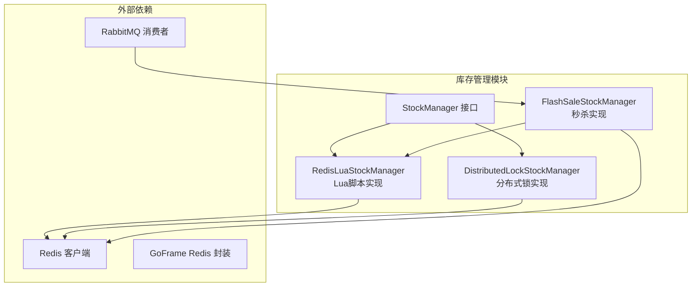
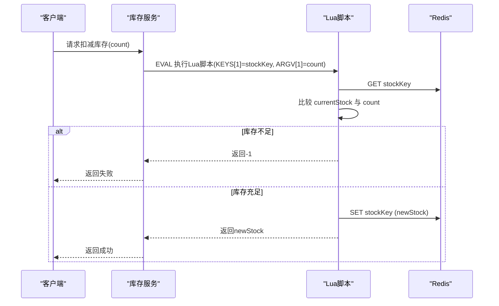
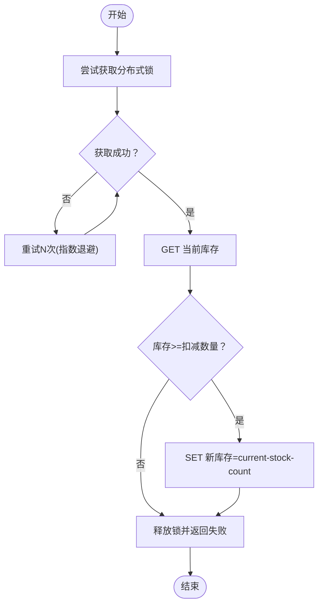
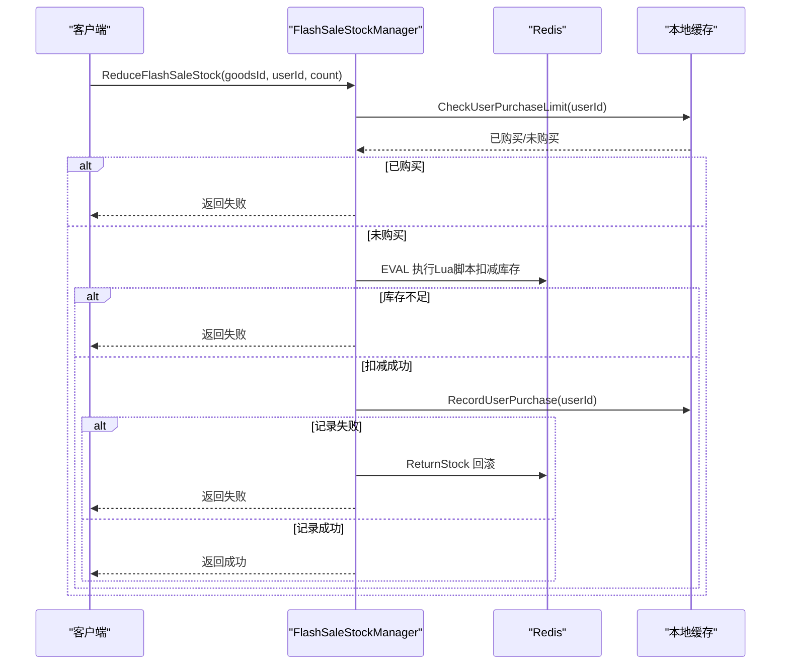
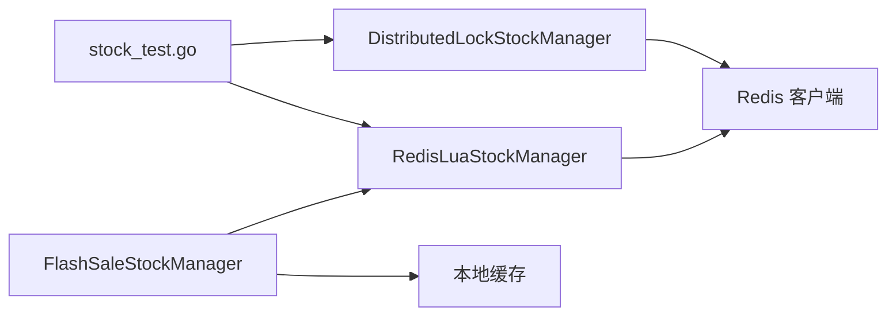

# Lua脚本原子性操作

<cite>
**本文引用的文件列表**
- [redis_lua.go](file://app/goods/utility/stock/redis_lua.go)
- [distributed_lock.go](file://app/goods/utility/stock/distributed_lock.go)
- [stock.go](file://app/goods/utility/stock/stock.go)
- [stock_test.go](file://app/goods/utility/stock/stock_test.go)
- [flash_sale_stock.go](file://app/goods/utility/stock/flash_sale_stock.go)
- [DEMO_WECHAT_OPEN_ID.go](file://app/goods/utility/consumer/DEMO_WECHAT_OPEN_ID.go)
- [库存防超卖（Redis Lua+分布式锁对比实践）.md](file://doc/库存防超卖（Redis Lua+分布式锁对比实践）.md)
</cite>

## 目录
1. [引言](#引言)
2. [项目结构](#项目结构)
3. [核心组件](#核心组件)
4. [架构概览](#架构概览)
5. [详细组件分析](#详细组件分析)
6. [依赖关系分析](#依赖关系分析)
7. [性能考量](#性能考量)
8. [故障排查指南](#故障排查指南)
9. [结论](#结论)
10. [附录](#附录)

## 引言
本文件围绕Redis Lua脚本在库存管理中的原子性操作展开，系统阐述如何通过Lua脚本在Redis服务器端原子执行库存检查与扣减，避免竞态条件与超卖；同时对比分布式锁方案，给出实现要点、执行效率、调试方法、性能优化与常见陷阱。文档面向具备一定Go/Redis经验的读者，也提供足够的背景知识帮助初学者理解。

## 项目结构
本项目在商品服务模块中提供了两种库存管理实现：
- 基于Redis Lua脚本的库存管理器
- 基于分布式锁的库存管理器
- 秒杀场景下的库存管理器（继承Lua脚本实现并扩展用户购买限制）
- 对比测试与文档说明



图表来源
- [redis_lua.go](file://app/goods/utility/stock/redis_lua.go#L1-L166)
- [distributed_lock.go](file://app/goods/utility/stock/distributed_lock.go#L1-L266)
- [flash_sale_stock.go](file://app/goods/utility/stock/flash_sale_stock.go#L1-L152)

章节来源
- [stock.go](file://app/goods/utility/stock/stock.go#L1-L32)
- [redis_lua.go](file://app/goods/utility/stock/redis_lua.go#L1-L166)
- [distributed_lock.go](file://app/goods/utility/stock/distributed_lock.go#L1-L266)
- [flash_sale_stock.go](file://app/goods/utility/stock/flash_sale_stock.go#L1-L152)

## 核心组件
- 接口层：统一的库存管理接口，定义扣减、返还、查询、初始化等能力
- Lua脚本实现：将“查询库存→判断→扣减”封装为单个原子脚本，避免竞态
- 分布式锁实现：通过Redis SET NX + Lua释放脚本实现互斥，保障原子性
- 秒杀实现：在Lua脚本基础上增加用户购买限制与购买记录缓存
- 测试与文档：对比两种方案的性能与正确性，提供最佳实践

章节来源
- [stock.go](file://app/goods/utility/stock/stock.go#L7-L31)
- [redis_lua.go](file://app/goods/utility/stock/redis_lua.go#L12-L28)
- [distributed_lock.go](file://app/goods/utility/stock/distributed_lock.go#L13-L39)
- [flash_sale_stock.go](file://app/goods/utility/stock/flash_sale_stock.go#L14-L40)

## 架构概览
Redis Lua脚本方案的核心优势在于“单脚本原子执行”，将多步操作合并为一次网络往返，消除竞态条件。分布式锁方案通过加锁/解锁保证互斥，但需要额外的网络往返与锁管理逻辑。



图表来源
- [redis_lua.go](file://app/goods/utility/stock/redis_lua.go#L75-L102)

章节来源
- [库存防超卖（Redis Lua+分布式锁对比实践）.md](file://doc/库存防超卖（Redis Lua+分布式锁对比实践）.md#L63-L81)

## 详细组件分析

### RedisLuaStockManager（Lua脚本实现）
- 职责：提供基于Redis Lua脚本的库存扣减、返还、查询、初始化能力
- 关键点：
  - 使用Do("EVAL", script, 1, key, count)一次性提交脚本
  - Lua脚本在Redis端原子执行，避免竞态
  - 返回值约定：-1表示库存不足，其他正整数表示新库存
  - 参数校验：扣减/返还数量必须>0；初始化数量>=0

```mermaid
classDiagram
class StockManager {
+ReduceStock(ctx, goodsId, count) (bool, error)
+ReturnStock(ctx, goodsId, count) (bool, error)
+GetStock(ctx, goodsId) (int, error)
+InitStock(ctx, goodsId, count) (bool, error)
}
class RedisLuaStockManager {
-redisClient interface{}
-getStockKey(goodsId) string
+ReduceStock(ctx, goodsId, count) (bool, error)
+ReturnStock(ctx, goodsId, count) (bool, error)
+GetStock(ctx, goodsId) (int, error)
+InitStock(ctx, goodsId, count) (bool, error)
}
StockManager <|.. RedisLuaStockManager
```

图表来源
- [stock.go](file://app/goods/utility/stock/stock.go#L7-L31)
- [redis_lua.go](file://app/goods/utility/stock/redis_lua.go#L12-L28)

章节来源
- [redis_lua.go](file://app/goods/utility/stock/redis_lua.go#L30-L53)
- [redis_lua.go](file://app/goods/utility/stock/redis_lua.go#L75-L102)
- [redis_lua.go](file://app/goods/utility/stock/redis_lua.go#L104-L125)
- [redis_lua.go](file://app/goods/utility/stock/redis_lua.go#L127-L145)
- [redis_lua.go](file://app/goods/utility/stock/redis_lua.go#L147-L165)

### DistributedLockStockManager（分布式锁实现）
- 职责：通过Redis分布式锁保证库存操作的互斥
- 关键点：
  - 使用SET NX EX + Lua释放脚本，确保锁的原子性释放
  - 获取锁失败时支持有限重试
  - 在锁范围内执行“查询→判断→更新”三步操作
  - 提供与Lua脚本实现一致的接口



图表来源
- [distributed_lock.go](file://app/goods/utility/stock/distributed_lock.go#L91-L159)

章节来源
- [distributed_lock.go](file://app/goods/utility/stock/distributed_lock.go#L46-L89)
- [distributed_lock.go](file://app/goods/utility/stock/distributed_lock.go#L91-L159)
- [distributed_lock.go](file://app/goods/utility/stock/distributed_lock.go#L161-L210)
- [distributed_lock.go](file://app/goods/utility/stock/distributed_lock.go#L212-L230)
- [distributed_lock.go](file://app/goods/utility/stock/distributed_lock.go#L232-L265)

### FlashSaleStockManager（秒杀实现）
- 职责：在Lua脚本基础上增加用户购买限制与购买记录缓存
- 关键点：
  - 用户购买限制：通过本地缓存检查是否已购买
  - 扣减库存：复用Lua脚本，保证原子性
  - 记录购买：设置24小时过期；失败时回滚库存
  - 继承RedisLuaStockManager，复用其接口与实现



图表来源
- [flash_sale_stock.go](file://app/goods/utility/stock/flash_sale_stock.go#L52-L99)

章节来源
- [flash_sale_stock.go](file://app/goods/utility/stock/flash_sale_stock.go#L28-L40)
- [flash_sale_stock.go](file://app/goods/utility/stock/flash_sale_stock.go#L52-L99)
- [flash_sale_stock.go](file://app/goods/utility/stock/flash_sale_stock.go#L101-L125)

### 对比测试与验证
- 并发测试：模拟高并发场景，统计成功/失败次数、平均响应时间、最终库存
- 边界测试：库存为0、负数扣减、返还后库存正确性
- 文档对比：提供Lua脚本与分布式锁的性能、可靠性、适用场景对比

章节来源
- [stock_test.go](file://app/goods/utility/stock/stock_test.go#L32-L78)
- [stock_test.go](file://app/goods/utility/stock/stock_test.go#L80-L201)
- [stock_test.go](file://app/goods/utility/stock/stock_test.go#L203-L276)
- [库存防超卖（Redis Lua+分布式锁对比实践）.md](file://doc/库存防超卖（Redis Lua+分布式锁对比实践）.md#L98-L140)

## 依赖关系分析
- RedisLuaStockManager依赖Redis客户端进行EVAL与GET/SET操作
- DistributedLockStockManager同样依赖Redis客户端，但使用SET NX与Lua释放脚本
- FlashSaleStockManager组合RedisLuaStockManager并引入本地缓存
- 测试文件依赖GoFrame的Redis与测试框架，验证两种方案的正确性与性能



图表来源
- [redis_lua.go](file://app/goods/utility/stock/redis_lua.go#L14-L22)
- [distributed_lock.go](file://app/goods/utility/stock/distributed_lock.go#L14-L28)
- [flash_sale_stock.go](file://app/goods/utility/stock/flash_sale_stock.go#L29-L39)
- [stock_test.go](file://app/goods/utility/stock/stock_test.go#L80-L201)

章节来源
- [redis_lua.go](file://app/goods/utility/stock/redis_lua.go#L1-L166)
- [distributed_lock.go](file://app/goods/utility/stock/distributed_lock.go#L1-L266)
- [flash_sale_stock.go](file://app/goods/utility/stock/flash_sale_stock.go#L1-L152)
- [stock_test.go](file://app/goods/utility/stock/stock_test.go#L1-L276)

## 性能考量
- 网络往返：Lua脚本方案仅一次EVAL往返，分布式锁方案至少三次（加锁/解锁/操作）
- 锁竞争：Lua脚本避免锁竞争，分布式锁在高并发下易产生等待与饥饿
- 原子性与一致性：Lua脚本在Redis单线程执行，强一致性；分布式锁依赖锁释放逻辑
- 适用场景：高并发秒杀强烈推荐Lua脚本；复杂业务逻辑可考虑分布式锁

章节来源
- [库存防超卖（Redis Lua+分布式锁对比实践）.md](file://doc/库存防超卖（Redis Lua+分布式锁对比实践）.md#L100-L140)

## 故障排查指南
- 库存不足：Lua脚本返回-1，需在上层处理并提示用户
- Redis连接错误：检查连接池配置、超时设置与Redis可用性
- Lua脚本执行失败：确认脚本语法、KEYS/ARGV数量与类型匹配
- 分布式锁释放异常：确保使用Lua释放脚本，避免误删其他客户端持有的锁
- 秒杀购买记录失败：捕获异常并回滚库存，记录日志便于追踪

章节来源
- [redis_lua.go](file://app/goods/utility/stock/redis_lua.go#L90-L101)
- [distributed_lock.go](file://app/goods/utility/stock/distributed_lock.go#L66-L89)
- [flash_sale_stock.go](file://app/goods/utility/stock/flash_sale_stock.go#L87-L93)

## 结论
Redis Lua脚本在库存管理中的原子性操作具有显著优势：减少网络往返、消除竞态条件、保证强一致性，特别适用于高并发场景。分布式锁方案在复杂业务与多资源协调方面具有一定价值，但需谨慎处理锁的获取、释放与超时。结合本文的实现与测试，可在实际项目中根据业务复杂度与并发量选择合适的方案，并通过缓存与消息队列进一步优化整体性能与可靠性。

## 附录

### Lua脚本编写规范
- 保持脚本简洁，避免复杂逻辑
- 明确KEYS与ARGV的使用与顺序
- 统一返回值约定（如-1表示失败，正整数表示新值）
- 合理设置脚本执行超时时间
- 预先加载脚本或复用脚本ID以降低网络开销

章节来源
- [redis_lua.go](file://app/goods/utility/stock/redis_lua.go#L30-L53)
- [flash_sale_stock.go](file://app/goods/utility/stock/flash_sale_stock.go#L127-L152)
- [库存防超卖（Redis Lua+分布式锁对比实践）.md](file://doc/库存防超卖（Redis Lua+分布式锁对比实践）.md#L172-L179)

### 参数传递与返回值处理
- 参数传递：KEYS[1]为库存键，ARGV[1]为扣减/返还数量
- 返回值处理：Lua脚本返回-1表示库存不足；其他正整数表示新库存；上层解析并转换为整型
- 错误处理：区分Redis连接错误与业务错误（库存不足）

章节来源
- [redis_lua.go](file://app/goods/utility/stock/redis_lua.go#L85-L101)
- [flash_sale_stock.go](file://app/goods/utility/stock/flash_sale_stock.go#L71-L98)

### 调试方法
- 使用GoFrame的Redis封装进行EVAL调试
- 在Lua脚本中加入日志或监控信息（如需）
- 通过测试用例模拟高并发与边界情况
- 观察最终库存与成功/失败计数，验证一致性

章节来源
- [stock_test.go](file://app/goods/utility/stock/stock_test.go#L32-L78)
- [stock_test.go](file://app/goods/utility/stock/stock_test.go#L156-L200)

### 性能优化技巧
- Redis连接池与超时配置
- 缓存预热与分级缓存策略
- 限流与熔断降级
- 消息队列削峰填谷（如订单超时、库存返还）

章节来源
- [库存防超卖（Redis Lua+分布式锁对比实践）.md](file://doc/库存防超卖（Redis Lua+分布式锁对比实践）.md#L180-L200)

### 常见陷阱与避免方法
- 脚本过于复杂导致执行时间过长
- 忽视返回值约定，导致上层误判
- 分布式锁未使用Lua释放，存在误删风险
- 秒杀场景未做用户购买限制与购买记录失败回滚

章节来源
- [distributed_lock.go](file://app/goods/utility/stock/distributed_lock.go#L70-L87)
- [flash_sale_stock.go](file://app/goods/utility/stock/flash_sale_stock.go#L87-L93)