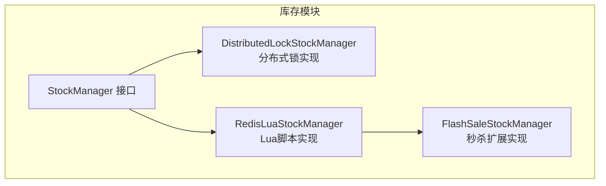
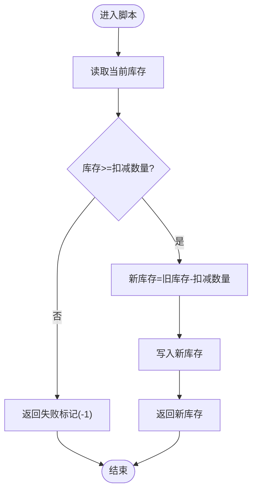
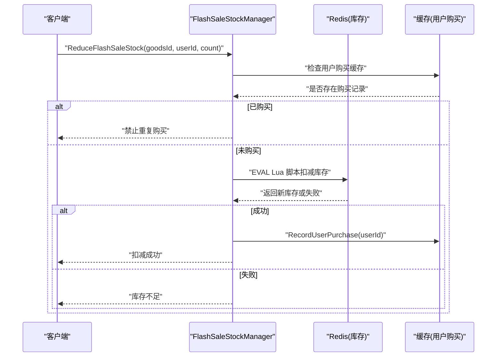
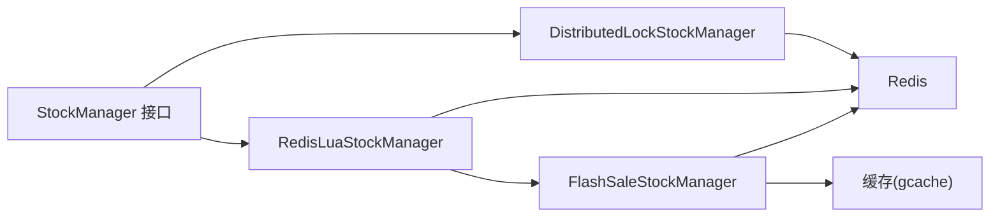

# 分布式锁机制

<cite>
**本文引用的文件**
- [distributed_lock.go](file://app/goods/utility/stock/distributed_lock.go)
- [redis_lua.go](file://app/goods/utility/stock/redis_lua.go)
- [stock.go](file://app/goods/utility/stock/stock.go)
- [flash_sale_stock.go](file://app/goods/utility/stock/flash_sale_stock.go)
- [stock_test.go](file://app/goods/utility/stock/stock_test.go)
- [库存防超卖（Redis Lua+分布式锁对比实践）.md](file://doc/库存防超卖（Redis Lua+分布式锁对比实践）.md)
- [秒杀系统设计方案.md](file://doc/秒杀系统设计方案.md)
- [.env](file://.env)
</cite>

## 目录
1. [引言](#引言)
2. [项目结构](#项目结构)
3. [核心组件](#核心组件)
4. [架构概览](#架构概览)
5. [详细组件分析](#详细组件分析)
6. [依赖关系分析](#依赖关系分析)
7. [性能考量](#性能考量)
8. [故障排查指南](#故障排查指南)
9. [结论](#结论)
10. [附录](#附录)

## 引言
本文件系统化阐述本项目中基于 Redis 的分布式锁实现与应用，重点覆盖以下内容：
- 分布式锁的获取、释放与重试机制
- 在高并发场景下防止库存超卖的策略
- 锁的超时处理、死锁预防与异常恢复
- 使用示例、配置参数与性能优化建议
- 常见问题排查与解决方案

## 项目结构
围绕库存扣减与分布式锁，相关代码集中在 goods 服务的 stock 工具包中，并配套测试与文档：
- 接口定义：StockManager
- 两种库存管理实现：
  - 基于分布式锁的实现：DistributedLockStockManager
  - 基于 Redis Lua 脚本的实现：RedisLuaStockManager
- 秒杀场景扩展：FlashSaleStockManager（继承 RedisLuaStockManager，增加用户购买限制与记录）
- 测试：并发压力测试与边界情况验证
- 文档：库存防超卖对比实践与秒杀系统设计



**图表来源**
- [stock.go](file://app/goods/utility/stock/stock.go#L7-L31)
- [distributed_lock.go](file://app/goods/utility/stock/distributed_lock.go#L13-L29)
- [redis_lua.go](file://app/goods/utility/stock/redis_lua.go#L12-L23)
- [flash_sale_stock.go](file://app/goods/utility/stock/flash_sale_stock.go#L14-L40)

**章节来源**
- [stock.go](file://app/goods/utility/stock/stock.go#L7-L31)
- [distributed_lock.go](file://app/goods/utility/stock/distributed_lock.go#L13-L29)
- [redis_lua.go](file://app/goods/utility/stock/redis_lua.go#L12-L23)
- [flash_sale_stock.go](file://app/goods/utility/stock/flash_sale_stock.go#L14-L40)

## 核心组件
- StockManager 接口：统一定义扣减、返还、查询、初始化库存的方法，便于替换实现。
- DistributedLockStockManager：基于 Redis SET NX EX 实现分布式锁，支持锁重试与 Lua 原子释放，确保库存操作的互斥性。
- RedisLuaStockManager：通过 Lua 脚本在 Redis 端原子执行“查询-判断-扣减”，避免竞态条件。
- FlashSaleStockManager：在 Lua 原子扣减基础上，增加用户购买限制与购买记录缓存，适用于秒杀场景。

**章节来源**
- [stock.go](file://app/goods/utility/stock/stock.go#L7-L31)
- [distributed_lock.go](file://app/goods/utility/stock/distributed_lock.go#L13-L29)
- [redis_lua.go](file://app/goods/utility/stock/redis_lua.go#L12-L23)
- [flash_sale_stock.go](file://app/goods/utility/stock/flash_sale_stock.go#L14-L40)

## 架构概览
分布式锁在高并发库存扣减中的工作流：
- 请求到达库存服务后，先尝试获取商品级分布式锁
- 获取成功后，读取当前库存并判断是否足够
- 若足够则扣减库存；否则返回失败
- 无论成功与否，均通过 Lua 脚本原子释放锁，避免误删

```mermaid
sequenceDiagram
participant C as "客户端"
participant S as "库存服务"
participant L as "分布式锁实现"
participant R as "Redis"
C->>S : "扣减库存(goodsId, count)"
S->>L : "acquireLock(goodsId)"
L->>R : "SET lock : stock : {goodsId} <随机值> NX EX <超时>"
R-->>L : "OK 或 nil"
alt 获取成功
L-->>S : "返回锁值"
S->>R : "GET goods : stock : {goodsId}"
R-->>S : "当前库存"
S->>S : "判断库存>=count?"
alt 库存充足
S->>R : "SET goods : stock : {goodsId} 新库存"
S-->>C : "扣减成功"
else 库存不足
S-->>C : "扣减失败"
end
S->>L : "releaseLock(goodsId, 锁值)"
L->>R : "EVAL Lua : GET==锁值? DEL : 0"
R-->>L : "释放结果"
L-->>S : "完成"
else 获取失败
S-->>C : "获取锁失败，请稍后重试"
end
```



**图表来源**
- [distributed_lock.go](file://app/goods/utility/stock/distributed_lock.go#L46-L89)
- [distributed_lock.go](file://app/goods/utility/stock/distributed_lock.go#L91-L159)

**章节来源**
- [distributed_lock.go](file://app/goods/utility/stock/distributed_lock.go#L46-L159)

## 详细组件分析

### 分布式锁实现（DistributedLockStockManager）
- 锁键与锁值
  - 锁键：lock:stock:{goodsId}
  - 锁值：随机字符串，确保只有持有者可释放
- 获取锁
  - 使用 SET 命令的 NX 选项与 EX 过期时间，避免死锁
- 释放锁
  - 使用 Lua 脚本读取锁值并比较，相等才删除，保证原子性与安全性
- 重试机制
  - 失败时按固定次数与间隔重试，提升成功率
- 关键方法
  - 获取锁：acquireLock
  - 释放锁：releaseLock
  - 扣减库存：ReduceStock（含库存校验与原子更新）
  - 返还库存：ReturnStock
  - 查询库存：GetStock
  - 初始化库存：InitStock

```mermaid
classDiagram
class StockManager {
+ReduceStock(ctx, goodsId, count) (bool, error)
+ReturnStock(ctx, goodsId, count) (bool, error)
+GetStock(ctx, goodsId) (int, error)
+InitStock(ctx, goodsId, count) (bool, error)
}
class DistributedLockStockManager {
-redisClient interface{}
-lockTimeout time.Duration
-retryTimes int
-retryInterval time.Duration
+ReduceStock(...)
+ReturnStock(...)
+GetStock(...)
+InitStock(...)
-acquireLock(...)
-releaseLock(...)
}
class RedisLuaStockManager {
-redisClient interface{}
-once sync.Once
+ReduceStock(...)
+ReturnStock(...)
+GetStock(...)
+InitStock(...)
}
class FlashSaleStockManager {
-RedisLuaStockManager
-cache *gcache.Cache
+ReduceFlashSaleStock(...)
+CheckUserPurchaseLimit(...)
+RecordUserPurchase(...)
}
StockManager <|.. DistributedLockStockManager
StockManager <|.. RedisLuaStockManager
RedisLuaStockManager <|-- FlashSaleStockManager
```

**图表来源**
- [stock.go](file://app/goods/utility/stock/stock.go#L7-L31)
- [distributed_lock.go](file://app/goods/utility/stock/distributed_lock.go#L13-L29)
- [redis_lua.go](file://app/goods/utility/stock/redis_lua.go#L12-L23)
- [flash_sale_stock.go](file://app/goods/utility/stock/flash_sale_stock.go#L14-L40)

**章节来源**
- [distributed_lock.go](file://app/goods/utility/stock/distributed_lock.go#L13-L29)
- [distributed_lock.go](file://app/goods/utility/stock/distributed_lock.go#L46-L89)
- [distributed_lock.go](file://app/goods/utility/stock/distributed_lock.go#L91-L210)
- [distributed_lock.go](file://app/goods/utility/stock/distributed_lock.go#L212-L265)

### Lua 脚本实现（RedisLuaStockManager）
- 原子性保障
  - 使用 EVAL 执行 Lua 脚本，将“读取-判断-写入”封装为单次原子操作
- 脚本内容
  - 扣减脚本：读取库存，判断是否足够，足够则扣减并返回新库存，否则返回失败标记
  - 返还脚本：读取库存，直接累加并返回新库存
- 方法
  - ReduceStock、ReturnStock、GetStock、InitStock



**图表来源**
- [redis_lua.go](file://app/goods/utility/stock/redis_lua.go#L30-L53)
- [redis_lua.go](file://app/goods/utility/stock/redis_lua.go#L75-L102)

**章节来源**
- [redis_lua.go](file://app/goods/utility/stock/redis_lua.go#L30-L102)
- [redis_lua.go](file://app/goods/utility/stock/redis_lua.go#L104-L145)
- [redis_lua.go](file://app/goods/utility/stock/redis_lua.go#L147-L165)

### 秒杀扩展（FlashSaleStockManager）
- 用户购买限制
  - 基于缓存检查用户是否已购买，避免重复购买
- 购买记录
  - 记录用户购买，设置过期时间，便于后续核对与风控
- 原子扣减
  - 继承 RedisLuaStockManager 的原子扣减能力，保证高并发下的强一致性



**图表来源**
- [flash_sale_stock.go](file://app/goods/utility/stock/flash_sale_stock.go#L52-L99)
- [flash_sale_stock.go](file://app/goods/utility/stock/flash_sale_stock.go#L101-L125)

**章节来源**
- [flash_sale_stock.go](file://app/goods/utility/stock/flash_sale_stock.go#L14-L40)
- [flash_sale_stock.go](file://app/goods/utility/stock/flash_sale_stock.go#L52-L125)

## 依赖关系分析
- 接口与实现
  - StockManager 是统一抽象，DistributedLockStockManager 与 RedisLuaStockManager 分别提供两种实现路径
  - FlashSaleStockManager 以组合方式复用 RedisLuaStockManager，并在其上扩展用户维度的购买控制
- Redis 客户端
  - 两类实现均通过统一的 Do/Eval 接口与 Redis 交互，便于替换底层客户端
- 测试与对比
  - stock_test.go 提供并发压力测试与边界情况验证，对比两种实现的性能与正确性



**图表来源**
- [stock.go](file://app/goods/utility/stock/stock.go#L7-L31)
- [distributed_lock.go](file://app/goods/utility/stock/distributed_lock.go#L13-L29)
- [redis_lua.go](file://app/goods/utility/stock/redis_lua.go#L12-L23)
- [flash_sale_stock.go](file://app/goods/utility/stock/flash_sale_stock.go#L28-L40)

**章节来源**
- [stock.go](file://app/goods/utility/stock/stock.go#L7-L31)
- [stock_test.go](file://app/goods/utility/stock/stock_test.go#L32-L78)

## 性能考量
- 分布式锁方案
  - 优点：实现直观，可扩展复杂业务逻辑
  - 缺点：网络往返较多（加锁-操作-解锁），存在锁竞争与等待
  - 适用：低并发或需跨多步协调的场景
- Lua 脚本方案
  - 优点：单次 EVAL 原子执行，网络交互少，吞吐高
  - 缺点：复杂业务逻辑不易在脚本中表达
  - 适用：高并发库存扣减、强一致要求的场景
- 秒杀场景
  - 建议优先采用 Lua 脚本方案，结合用户购买限制与缓存记录，满足高并发与一致性需求

**章节来源**
- [库存防超卖（Redis Lua+分布式锁对比实践）.md](file://doc/库存防超卖（Redis Lua+分布式锁对比实践）.md#L110-L140)
- [秒杀系统设计方案.md](file://doc/秒杀系统设计方案.md#L2699-L2811)

## 故障排查指南
- 获取锁失败
  - 检查 Redis 连接状态与可用性
  - 核对锁超时时间设置是否过短
  - 观察是否存在持续高并发导致的锁竞争
- 释放锁异常
  - 确认使用 Lua 脚本释放，避免误删其他持有者的锁
  - 检查锁值是否与获取时一致
- 库存超卖
  - 分布式锁方案：确认锁是否在所有分支都释放
  - Lua 脚本方案：确认脚本执行成功且返回值正确
- 性能抖动
  - 分布式锁：减少锁持有时间，避免在锁内执行耗时操作
  - Lua 脚本：优化脚本逻辑，避免复杂判断与循环
- 配置检查
  - Redis 主机与端口：参考环境变量
  - 连接池参数：参考 Redis 集群/单机配置示例

**章节来源**
- [distributed_lock.go](file://app/goods/utility/stock/distributed_lock.go#L46-L89)
- [redis_lua.go](file://app/goods/utility/stock/redis_lua.go#L75-L102)
- [stock_test.go](file://app/goods/utility/stock/stock_test.go#L80-L201)
- [.env](file://.env#L7-L10)
- [秒杀系统设计方案.md](file://doc/秒杀系统设计方案.md#L2703-L2810)

## 结论
- 分布式锁与 Lua 脚本是两种互补的库存防超卖手段
- 对于高并发、强一致的库存扣减，Lua 脚本方案更具优势
- 对于需要复杂业务协调的场景，分布式锁方案更灵活
- 结合用户购买限制与缓存记录，可进一步提升秒杀场景的稳定性与一致性

## 附录

### 使用示例（基于现有实现）
- 获取 Redis 客户端并初始化库存
  - 分布式锁实现：NewDistributedLockStockManager(redisClient) -> InitStock
  - Lua 实现：NewRedisLuaStockManager(redisClient) -> InitStock
- 扣减库存
  - 分布式锁：ReduceStock(goodsId, count)
  - Lua：ReduceStock(goodsId, count)
- 秒杀扣减（带用户限制）
  - FlashSaleStockManager.ReduceFlashSaleStock(goodsId, userId, count)

**章节来源**
- [distributed_lock.go](file://app/goods/utility/stock/distributed_lock.go#L21-L29)
- [distributed_lock.go](file://app/goods/utility/stock/distributed_lock.go#L232-L265)
- [redis_lua.go](file://app/goods/utility/stock/redis_lua.go#L18-L23)
- [redis_lua.go](file://app/goods/utility/stock/redis_lua.go#L147-L165)
- [flash_sale_stock.go](file://app/goods/utility/stock/flash_sale_stock.go#L34-L40)
- [flash_sale_stock.go](file://app/goods/utility/stock/flash_sale_stock.go#L52-L99)

### 配置参数
- Redis 连接与池化
  - 参考 Redis 单机与集群配置示例，设置地址、密码、连接池大小、超时等
- 环境变量
  - REDIS_HOST、REDIS_PORT 等用于容器化部署时的服务发现与连接

**章节来源**
- [秒杀系统设计方案.md](file://doc/秒杀系统设计方案.md#L2703-L2810)
- [.env](file://.env#L7-L10)