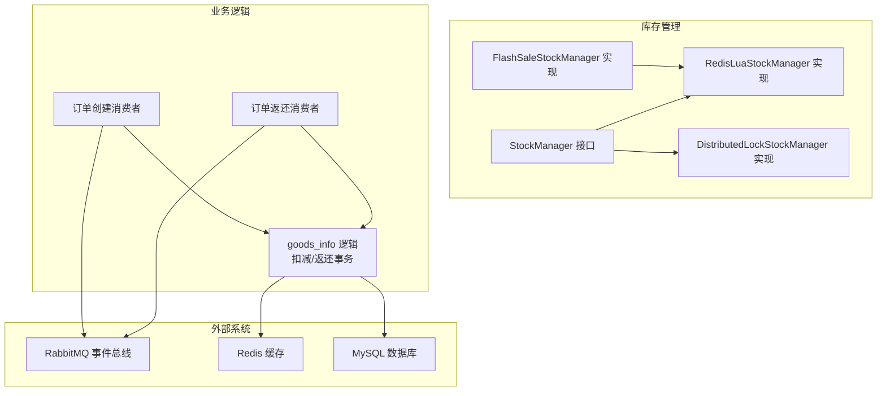
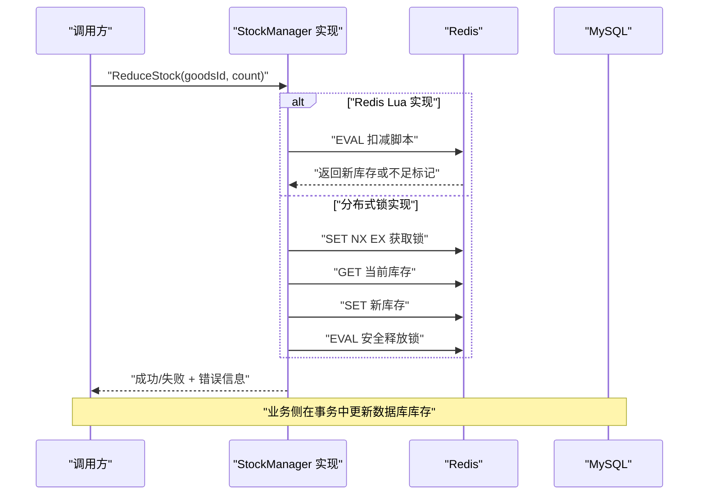
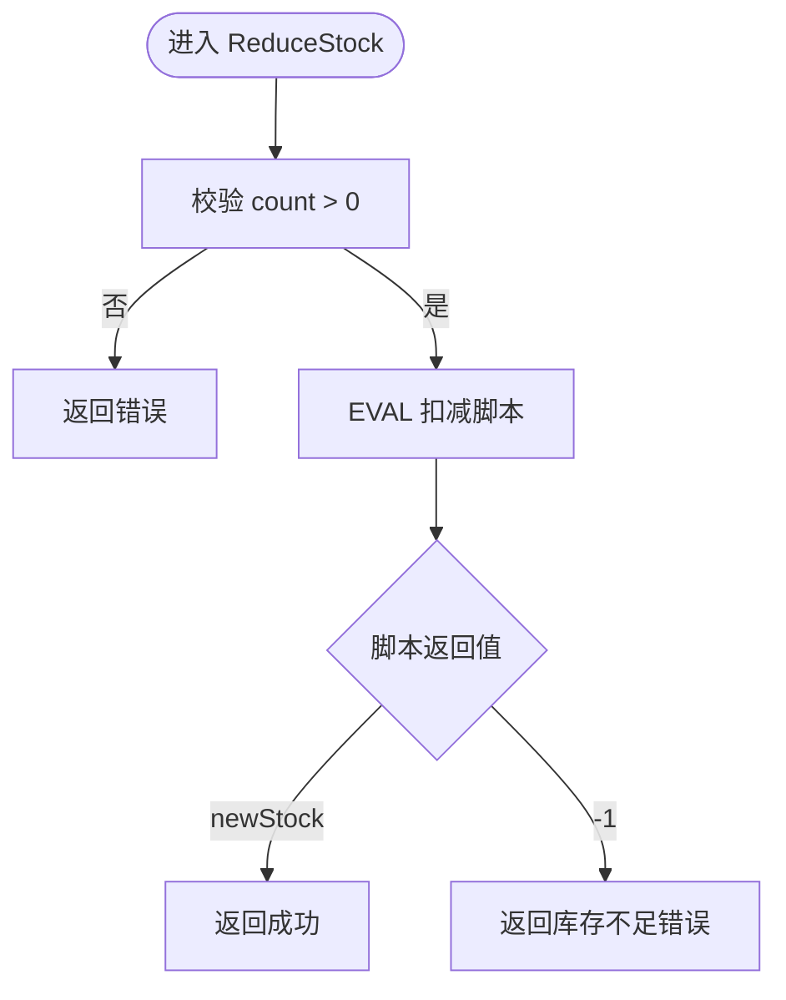
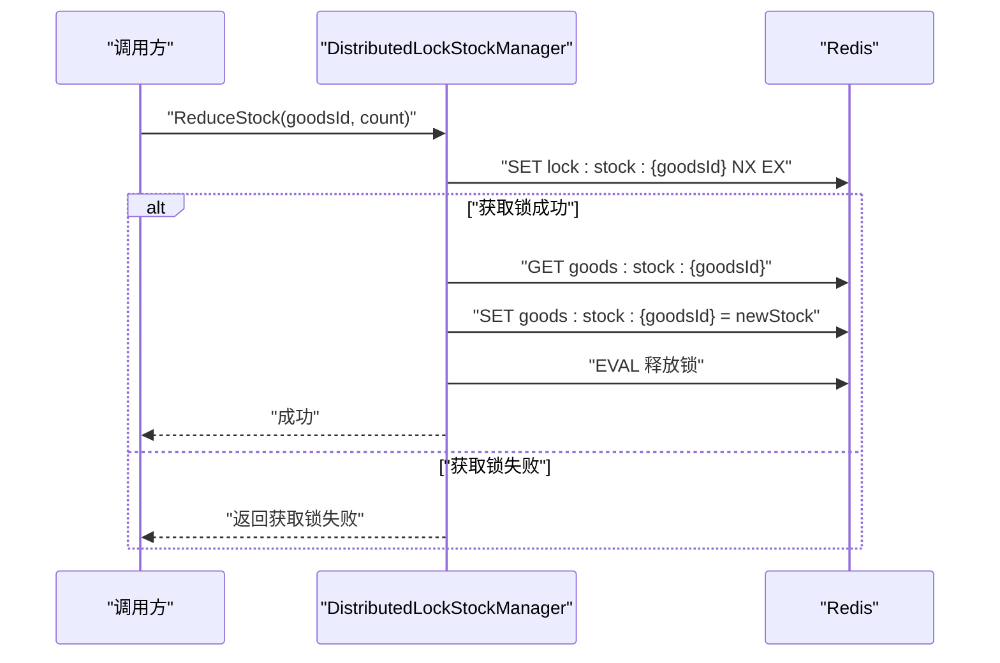
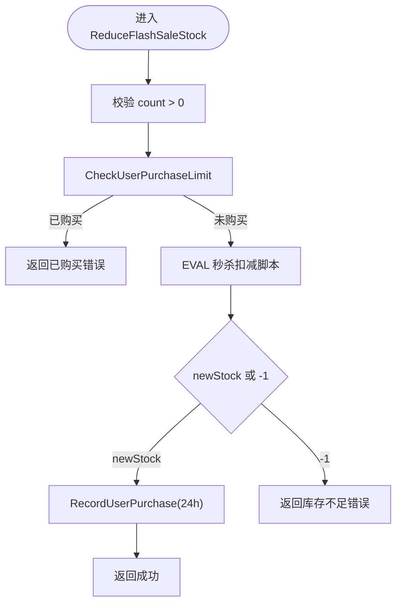
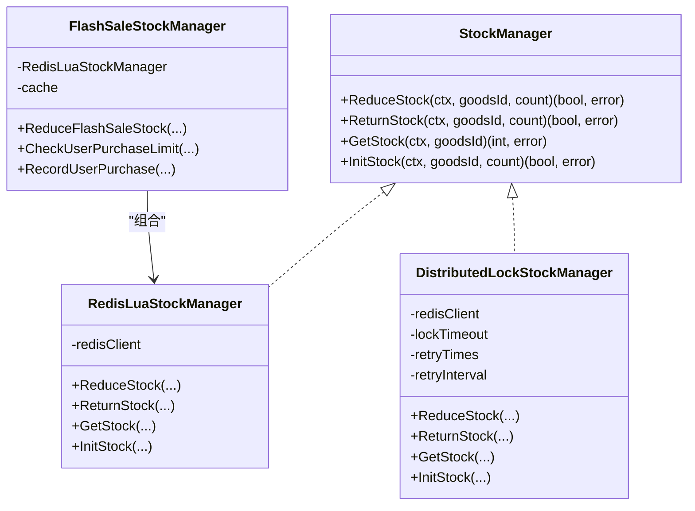

# 基础库存管理

<cite>
**本文引用的文件**
- [stock.go](file://app/goods/utility/stock/stock.go)
- [redis_lua.go](file://app/goods/utility/stock/redis_lua.go)
- [distributed_lock.go](file://app/goods/utility/stock/distributed_lock.go)
- [flash_sale_stock.go](file://app/goods/utility/stock/flash_sale_stock.go)
- [stock_test.go](file://app/goods/utility/stock/stock_test.go)
- [goods_info.go](file://app/goods/internal/logic/goods_info/goods_info.go)
- [order_created_consumer.go](file://app/goods/utility/consumer/order_created_consumer.go)
- [DEMO_WECHAT_OPEN_ID.go](file://app/goods/utility/consumer/DEMO_WECHAT_OPEN_ID.go)
- [goods_info.proto](file://app/goods/manifest/protobuf/goods_info/v1/goods_info.proto)
- [redis.go](file://app/goods/utility/goodsRedis/redis.go)
</cite>

## 目录
1. [简介](#简介)
2. [项目结构](#项目结构)
3. [核心组件](#核心组件)
4. [架构概览](#架构概览)
5. [详细组件分析](#详细组件分析)
6. [依赖关系分析](#依赖关系分析)
7. [性能考虑](#性能考虑)
8. [故障排查指南](#故障排查指南)
9. [结论](#结论)
10. [附录](#附录)

## 简介
本文件面向基础库存管理功能，系统性阐述 StockManager 接口的设计理念与实现方式，覆盖库存扣减、库存返还、库存查询、库存初始化四大核心方法；深入解析 Redis 缓存库存与数据库库存的数据一致性保障机制与原子性处理策略；提供 API 使用示例、参数说明与错误处理方案，并总结最佳实践与性能优化建议。

## 项目结构
围绕库存管理的关键目录与文件如下：
- 接口与实现：app/goods/utility/stock 下的接口与两种实现（Redis Lua 脚本、分布式锁）
- 秒杀扩展：在 Redis Lua 实现基础上扩展的 FlashSaleStockManager
- 业务消费与事务：app/goods/internal/logic/goods_info 下的库存事务与并发返还
- 消息消费者：app/goods/utility/consumer 下的订单创建与库存返还事件消费者
- 协议定义：app/goods/manifest/protobuf/goods_info/v1 下的商品库存查询协议
- Redis 初始化与缓存：app/goods/utility/goodsRedis 下的 Redis 初始化与缓存适配

图表来源
- [stock.go](file://app/goods/utility/stock/stock.go#L7-L31)
- [redis_lua.go](file://app/goods/utility/stock/redis_lua.go#L12-L23)
- [distributed_lock.go](file://app/goods/utility/stock/distributed_lock.go#L13-L29)
- [flash_sale_stock.go](file://app/goods/utility/stock/flash_sale_stock.go#L14-L40)
- [goods_info.go](file://app/goods/internal/logic/goods_info/goods_info.go#L83-L138)
- [order_created_consumer.go](file://app/goods/utility/consumer/order_created_consumer.go#L32-L64)
- [DEMO_WECHAT_OPEN_ID.go](file://app/goods/utility/consumer/DEMO_WECHAT_OPEN_ID.go#L31-L57)

章节来源
- [stock.go](file://app/goods/utility/stock/stock.go#L7-L31)
- [redis_lua.go](file://app/goods/utility/stock/redis_lua.go#L12-L23)
- [distributed_lock.go](file://app/goods/utility/stock/distributed_lock.go#L13-L29)
- [flash_sale_stock.go](file://app/goods/utility/stock/flash_sale_stock.go#L14-L40)
- [goods_info.go](file://app/goods/internal/logic/goods_info/goods_info.go#L83-L138)
- [order_created_consumer.go](file://app/goods/utility/consumer/order_created_consumer.go#L32-L64)
- [DEMO_WECHAT_OPEN_ID.go](file://app/goods/utility/consumer/DEMO_WECHAT_OPEN_ID.go#L31-L57)

## 核心组件
- StockManager 接口：统一定义库存扣减、返还、查询、初始化四类操作，便于替换不同实现策略。
- RedisLuaStockManager：基于 Redis Lua 脚本的原子性库存操作，适合高并发下的强一致需求。
- DistributedLockStockManager：通过分布式锁实现串行化库存操作，兼顾一致性与可读性。
- FlashSaleStockManager：在 Redis Lua 原子操作基础上，增加用户购买限制与缓存记录，满足秒杀场景。
- goods_info 逻辑：封装数据库事务内的库存扣减与返还，配合异步缓存失效，确保最终一致性。
- 消费者：通过消息总线触发库存扣减与返还，解耦订单与库存服务。

章节来源
- [stock.go](file://app/goods/utility/stock/stock.go#L7-L31)
- [redis_lua.go](file://app/goods/utility/stock/redis_lua.go#L12-L23)
- [distributed_lock.go](file://app/goods/utility/stock/distributed_lock.go#L13-L29)
- [flash_sale_stock.go](file://app/goods/utility/stock/flash_sale_stock.go#L14-L40)
- [goods_info.go](file://app/goods/internal/logic/goods_info/goods_info.go#L83-L138)

## 架构概览
库存管理采用“接口抽象 + 多实现 + 消息驱动 + 事务落库”的架构模式：
- 接口层：StockManager 提供统一能力。
- 实现层：Redis Lua 与分布式锁两种实现，分别强调原子性与易理解性。
- 业务层：goods_info 在数据库事务内完成库存更新，并异步删除缓存。
- 消费者层：订单创建/返还事件消费者触发库存操作，失败时可重试或补偿。

图表来源
- [redis_lua.go](file://app/goods/utility/stock/redis_lua.go#L75-L102)
- [distributed_lock.go](file://app/goods/utility/stock/distributed_lock.go#L91-L159)
- [goods_info.go](file://app/goods/internal/logic/goods_info/goods_info.go#L83-L116)

## 详细组件分析

### StockManager 接口与方法语义
- ReduceStock：扣减库存，返回布尔成功标志与错误信息；参数校验确保 count > 0。
- ReturnStock：返还库存，返回布尔成功标志与错误信息；参数校验确保 count > 0。
- GetStock：查询当前库存；若键不存在返回 0。
- InitStock：初始化库存；参数校验确保 count ≥ 0。

章节来源
- [stock.go](file://app/goods/utility/stock/stock.go#L7-L31)

### RedisLuaStockManager 实现
- 原子性保障：通过 EVAL 执行 Lua 脚本，脚本内完成“读取 -> 校验 -> 写入”，保证单命令的原子性。
- 键命名：以 goods:stock:{goodsId} 命名，清晰隔离。
- 错误处理：对脚本执行错误、库存不足、参数非法等情况进行包装与返回。
- 方法行为：
  - ReduceStock：执行扣减脚本，返回 -1 表示不足。
  - ReturnStock：执行返还脚本，直接写入新库存。
  - GetStock：GET 命令读取，不存在返回 0。
  - InitStock：SET 命令初始化库存。

图表来源
- [redis_lua.go](file://app/goods/utility/stock/redis_lua.go#L75-L102)

章节来源
- [redis_lua.go](file://app/goods/utility/stock/redis_lua.go#L12-L23)
- [redis_lua.go](file://app/goods/utility/stock/redis_lua.go#L25-L28)
- [redis_lua.go](file://app/goods/utility/stock/redis_lua.go#L30-L53)
- [redis_lua.go](file://app/goods/utility/stock/redis_lua.go#L55-L73)
- [redis_lua.go](file://app/goods/utility/stock/redis_lua.go#L75-L102)
- [redis_lua.go](file://app/goods/utility/stock/redis_lua.go#L104-L125)
- [redis_lua.go](file://app/goods/utility/stock/redis_lua.go#L127-L145)
- [redis_lua.go](file://app/goods/utility/stock/redis_lua.go#L147-L165)

### DistributedLockStockManager 实现
- 锁策略：使用 SET NX EX 获取分布式锁，Lua 脚本安全释放，避免误删。
- 重试机制：获取锁失败时按固定次数与间隔重试，提升可用性。
- 串行化操作：在锁保护下读取 -> 校验 -> 写入，保证一致性。
- 方法行为：
  - ReduceStock：获取锁 -> 校验库存 -> 扣减 -> 释放锁。
  - ReturnStock：获取锁 -> 返还 -> 释放锁。
  - GetStock：直接 GET。
  - InitStock：获取锁 -> SET -> 释放锁。

图表来源
- [distributed_lock.go](file://app/goods/utility/stock/distributed_lock.go#L46-L89)
- [distributed_lock.go](file://app/goods/utility/stock/distributed_lock.go#L91-L159)

章节来源
- [distributed_lock.go](file://app/goods/utility/stock/distributed_lock.go#L13-L29)
- [distributed_lock.go](file://app/goods/utility/stock/distributed_lock.go#L31-L44)
- [distributed_lock.go](file://app/goods/utility/stock/distributed_lock.go#L46-L89)
- [distributed_lock.go](file://app/goods/utility/stock/distributed_lock.go#L91-L159)
- [distributed_lock.go](file://app/goods/utility/stock/distributed_lock.go#L161-L210)
- [distributed_lock.go](file://app/goods/utility/stock/distributed_lock.go#L212-L230)
- [distributed_lock.go](file://app/goods/utility/stock/distributed_lock.go#L232-L265)

### FlashSaleStockManager 实现（秒杀扩展）
- 继承基础 StockManager，复用 Redis Lua 原子扣减。
- 用户购买限制：基于缓存检查用户是否已购买，防止超买。
- 记录用户购买：设置 24 小时过期，作为幂等与风控依据。
- 失败回滚：记录购买失败时主动返还库存，保证一致性。

图表来源
- [flash_sale_stock.go](file://app/goods/utility/stock/flash_sale_stock.go#L52-L99)
- [flash_sale_stock.go](file://app/goods/utility/stock/flash_sale_stock.go#L101-L125)

章节来源
- [flash_sale_stock.go](file://app/goods/utility/stock/flash_sale_stock.go#L14-L26)
- [flash_sale_stock.go](file://app/goods/utility/stock/flash_sale_stock.go#L28-L40)
- [flash_sale_stock.go](file://app/goods/utility/stock/flash_sale_stock.go#L42-L50)
- [flash_sale_stock.go](file://app/goods/utility/stock/flash_sale_stock.go#L52-L99)
- [flash_sale_stock.go](file://app/goods/utility/stock/flash_sale_stock.go#L101-L125)
- [flash_sale_stock.go](file://app/goods/utility/stock/flash_sale_stock.go#L127-L152)

### 数据一致性与原子性
- Redis 原子性：RedisLuaStockManager 的 Lua 脚本在单命令内完成读取、判断与写入，天然具备原子性，避免竞态。
- 分布式锁：DistributedLockStockManager 在锁范围内串行化读写，结合 Lua 安全释放，保证一致性。
- 数据库事务：goods_info 在数据库事务中完成库存更新，确保落库一致性；异步删除缓存，避免阻塞主流程。
- 消息驱动：订单创建/返还事件通过消息总线触发，失败可重试或补偿，降低耦合。

章节来源
- [redis_lua.go](file://app/goods/utility/stock/redis_lua.go#L30-L53)
- [distributed_lock.go](file://app/goods/utility/stock/distributed_lock.go#L46-L89)
- [goods_info.go](file://app/goods/internal/logic/goods_info/goods_info.go#L83-L116)

### API 使用示例与参数说明
以下示例展示如何调用库存管理接口（以伪代码形式描述流程与参数）：
- 扣减库存
  - 输入：上下文、商品ID、扣减数量
  - 行为：调用实现的 ReduceStock，返回布尔成功标志与错误信息
  - 注意：count 必须大于 0
- 返还库存
  - 输入：上下文、商品ID、返还数量
  - 行为：调用实现的 ReturnStock，返回布尔成功标志与错误信息
  - 注意：count 必须大于 0
- 查询库存
  - 输入：上下文、商品ID
  - 行为：调用实现的 GetStock，返回库存数量
- 初始化库存
  - 输入：上下文、商品ID、初始数量
  - 行为：调用实现的 InitStock，返回布尔成功标志与错误信息
  - 注意：count 必须大于等于 0

章节来源
- [stock.go](file://app/goods/utility/stock/stock.go#L7-L31)
- [redis_lua.go](file://app/goods/utility/stock/redis_lua.go#L75-L102)
- [distributed_lock.go](file://app/goods/utility/stock/distributed_lock.go#L91-L159)

### 错误处理方案
- 参数校验错误：扣减/返还数量必须大于 0；初始化数量不能为负数。
- Redis 脚本执行错误：包装原始错误并返回。
- 库存不足：返回明确的不足提示，便于上层业务处理。
- 分布式锁获取失败：按重试策略重试，失败则返回错误。
- 数据库事务失败：捕获错误并回滚，避免脏数据。
- 消息处理失败：记录日志并可选择 NACK 或重试。

章节来源
- [redis_lua.go](file://app/goods/utility/stock/redis_lua.go#L77-L80)
- [redis_lua.go](file://app/goods/utility/stock/redis_lua.go#L90-L99)
- [distributed_lock.go](file://app/goods/utility/stock/distributed_lock.go#L94-L96)
- [distributed_lock.go](file://app/goods/utility/stock/distributed_lock.go#L118-L120)
- [goods_info.go](file://app/goods/internal/logic/goods_info/goods_info.go#L94-L110)

## 依赖关系分析
- 接口与实现：StockManager 是统一入口，RedisLuaStockManager 与 DistributedLockStockManager 分别实现。
- 扩展实现：FlashSaleStockManager 组合 RedisLuaStockManager 并新增用户购买限制与缓存记录。
- 业务依赖：goods_info 逻辑在数据库事务中更新库存，并异步删除缓存。
- 消费者依赖：订单创建/返还消费者通过消息触发库存操作。

图表来源
- [stock.go](file://app/goods/utility/stock/stock.go#L7-L31)
- [redis_lua.go](file://app/goods/utility/stock/redis_lua.go#L12-L23)
- [distributed_lock.go](file://app/goods/utility/stock/distributed_lock.go#L13-L29)
- [flash_sale_stock.go](file://app/goods/utility/stock/flash_sale_stock.go#L14-L40)

章节来源
- [stock.go](file://app/goods/utility/stock/stock.go#L7-L31)
- [redis_lua.go](file://app/goods/utility/stock/redis_lua.go#L12-L23)
- [distributed_lock.go](file://app/goods/utility/stock/distributed_lock.go#L13-L29)
- [flash_sale_stock.go](file://app/goods/utility/stock/flash_sale_stock.go#L14-L40)

## 性能考虑
- Redis Lua 原子性：单命令完成读改写，减少网络往返与锁竞争，吞吐更高。
- 分布式锁权衡：实现更直观，但存在锁竞争与重试开销，适合低频或对一致性要求更高的场景。
- 并发测试：提供并发测试工具函数，验证高并发下的正确性与性能。
- 缓存与落库：数据库事务内更新库存，异步删除缓存，避免阻塞主流程。
- 秒杀场景：用户购买限制与缓存记录，降低重复购买风险，提高整体吞吐。

章节来源
- [stock_test.go](file://app/goods/utility/stock/stock_test.go#L32-L78)
- [goods_info.go](file://app/goods/internal/logic/goods_info/goods_info.go#L118-L132)
- [flash_sale_stock.go](file://app/goods/utility/stock/flash_sale_stock.go#L101-L125)

## 故障排查指南
- 库存不足：检查 Redis 中库存键是否存在与数值是否足够；确认 Lua 脚本返回值。
- 参数错误：核对 count 是否为正数；初始化是否为非负数。
- 锁获取失败：查看分布式锁的重试次数与间隔配置；确认 Redis 可用性。
- 数据库事务失败：查看事务内 SQL 执行日志；确认回滚是否生效。
- 消息处理失败：检查 RabbitMQ 配置与消费者日志；必要时启用重试或死信队列。

章节来源
- [redis_lua.go](file://app/goods/utility/stock/redis_lua.go#L90-L99)
- [distributed_lock.go](file://app/goods/utility/stock/distributed_lock.go#L118-L120)
- [goods_info.go](file://app/goods/internal/logic/goods_info/goods_info.go#L134-L136)
- [order_created_consumer.go](file://app/goods/utility/consumer/order_created_consumer.go#L53-L60)
- [DEMO_WECHAT_OPEN_ID.go](file://app/goods/utility/consumer/DEMO_WECHAT_OPEN_ID.go#L45-L54)

## 结论
本基础库存管理方案通过接口抽象与多种实现，兼顾了高并发下的原子性与一致性；结合数据库事务与消息驱动，形成“缓存高可用 + 数据库最终一致”的稳健架构。Redis Lua 与分布式锁两种实现满足不同场景需求，秒杀扩展进一步强化了业务约束与幂等控制。

## 附录

### API 定义与使用要点
- 商品库存查询 RPC：GetGoodsStockReq 包含商品ID列表，返回 map<商品ID, 库存>。
- 库存操作建议：优先使用 Redis 原子操作；在需要强一致且低频场景可选分布式锁；秒杀场景务必启用用户购买限制与缓存记录。

章节来源
- [goods_info.proto](file://app/goods/manifest/protobuf/goods_info/v1/goods_info.proto#L102-L108)

### Redis 初始化与缓存适配
- 初始化 Redis：加载配置、创建连接、PING 测试连通性。
- 缓存适配器：使用 gcache.NewAdapterRedis 将 Redis 作为缓存后端。

章节来源
- [redis.go](file://app/goods/utility/goodsRedis/redis.go#L13-L49)