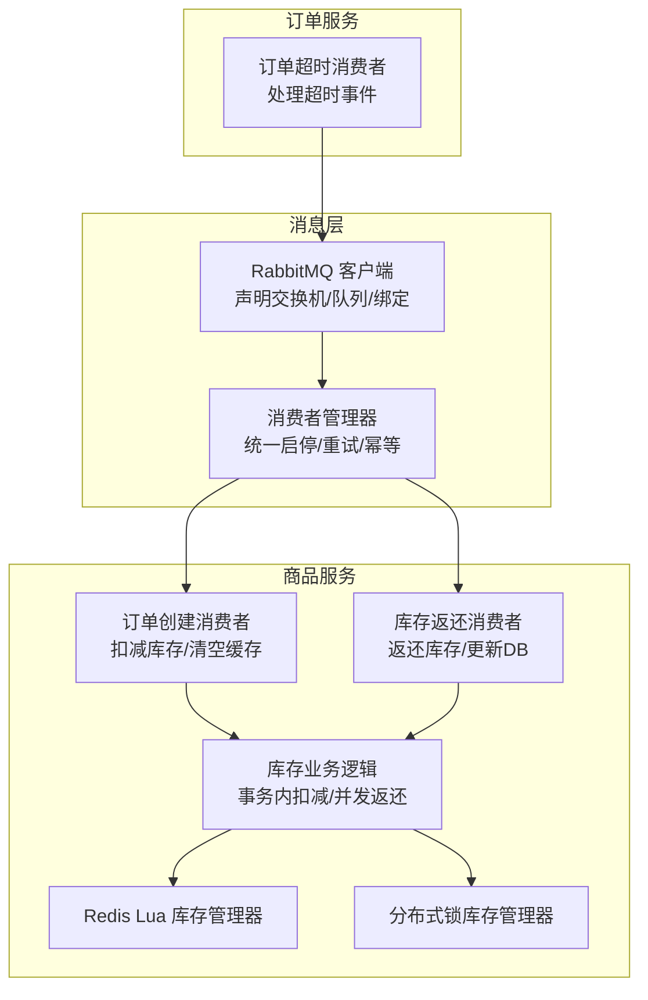
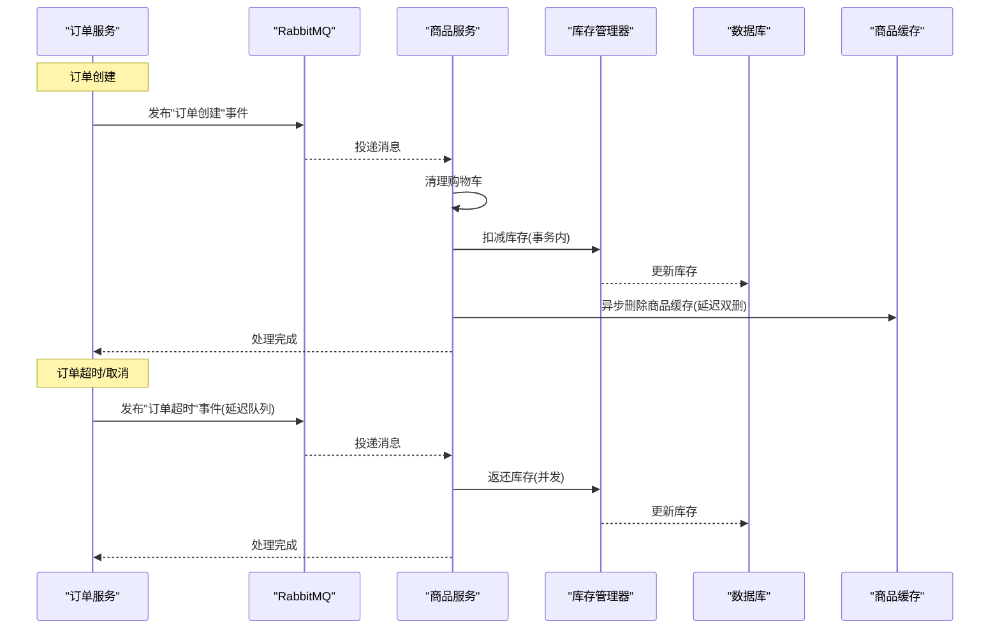
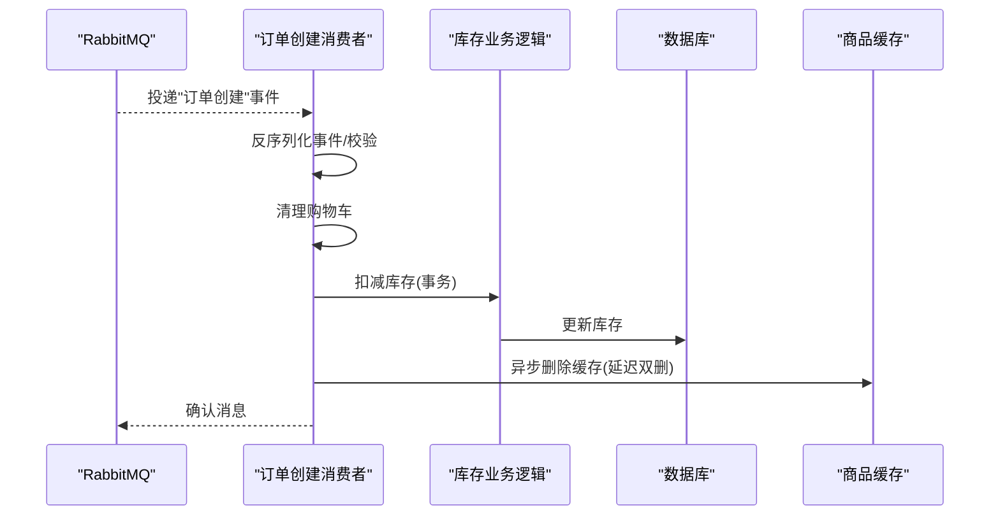
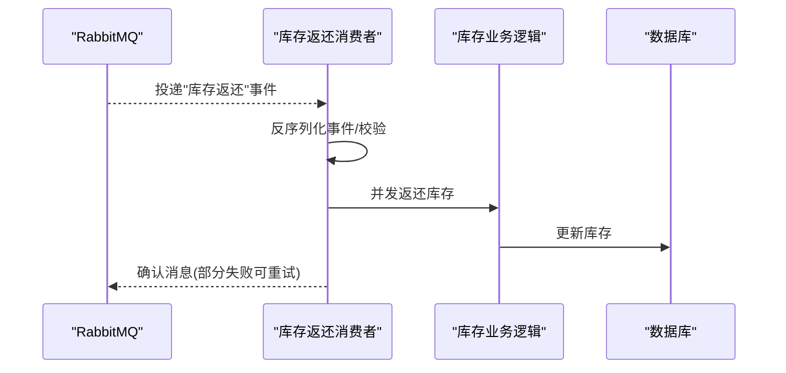
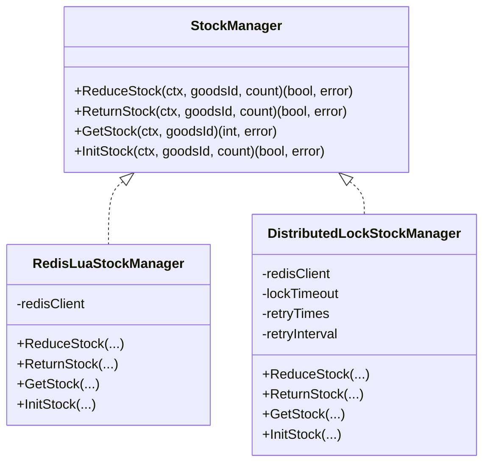
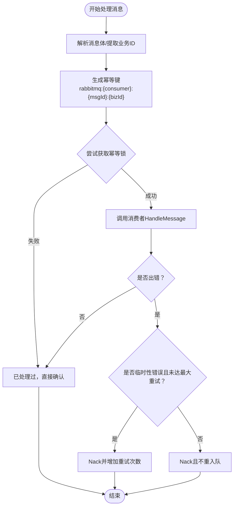
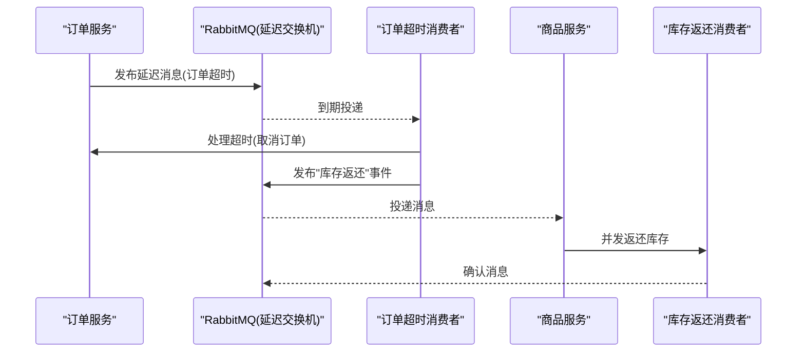
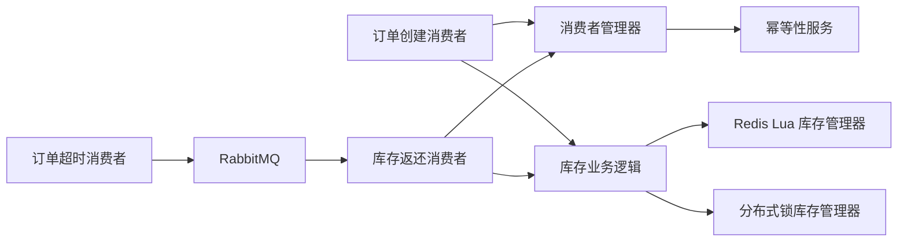

# 库存消费处理

<cite>
**本文引用的文件**
- [app/goods/utility/consumer/order_created_consumer.go](file://app/goods/utility/consumer/order_created_consumer.go)
- [app/goods/utility/consumer/DEMO_WECHAT_OPEN_ID.go](file://app/goods/utility/consumer/DEMO_WECHAT_OPEN_ID.go)
- [app/goods/utility/stock/stock.go](file://app/goods/utility/stock/stock.go)
- [app/goods/utility/stock/distributed_lock.go](file://app/goods/utility/stock/distributed_lock.go)
- [app/goods/utility/stock/redis_lua.go](file://app/goods/utility/stock/redis_lua.go)
- [app/goods/internal/logic/goods_info/goods_info.go](file://app/goods/internal/logic/goods_info/goods_info.go)
- [utility/rabbitmq/consumer_manager.go](file://utility/rabbitmq/consumer_manager.go)
- [utility/idempotent/idempotent.go](file://utility/idempotent/idempotent.go)
- [app/order/utility/consumer/order_timeout_consumer.go](file://app/order/utility/consumer/order_timeout_consumer.go)
- [app/goods/utility/goodsRedis/goods.go](file://app/goods/utility/goodsRedis/goods.go)
- [app/goods/utility/goodsRedis/redis.go](file://app/goods/utility/goodsRedis/redis.go)
- [utility/rabbitmq/rabbitmq.go](file://utility/rabbitmq/rabbitmq.go)
</cite>

## 目录
1. [简介](#简介)
2. [项目结构](#项目结构)
3. [核心组件](#核心组件)
4. [架构总览](#架构总览)
5. [组件详细分析](#组件详细分析)
6. [依赖关系分析](#依赖关系分析)
7. [性能考量](#性能考量)
8. [故障排查指南](#故障排查指南)
9. [结论](#结论)
10. [附录](#附录)

## 简介
本文件系统性阐述基于消息队列的库存异步处理机制，覆盖订单创建后的库存锁定、订单取消/超时导致的库存释放等关键流程。重点说明消息消费者的实现原理、幂等性与可靠性的保障策略、库存锁定生命周期与超时处理、异常恢复机制，并提供消息队列配置、消费者监控与故障排查方法，以及性能优化与扩展性建议。

## 项目结构
围绕库存消费处理的相关模块主要分布在以下位置：
- 消息消费者：goods 服务中的订单创建与库存返还消费者
- 库存管理器：基于 Redis Lua 与分布式锁两种实现
- 幂等性与消费者管理：统一的 RabbitMQ 消费者管理器与幂等性服务
- 订单超时处理：订单服务通过延迟队列触发库存返还
- 缓存与一致性：商品缓存的删除与延迟双删策略

图表来源
- [utility/rabbitmq/consumer_manager.go](file://utility/rabbitmq/consumer_manager.go#L48-L194)
- [app/order/utility/consumer/order_timeout_consumer.go](file://app/order/utility/consumer/order_timeout_consumer.go#L16-L37)
- [app/goods/utility/consumer/order_created_consumer.go](file://app/goods/utility/consumer/order_created_consumer.go#L13-L30)
- [app/goods/utility/consumer/DEMO_WECHAT_OPEN_ID.go](file://app/goods/utility/consumer/DEMO_WECHAT_OPEN_ID.go#L12-L29)
- [app/goods/internal/logic/goods_info/goods_info.go](file://app/goods/internal/logic/goods_info/goods_info.go#L16-L81)
- [app/goods/utility/stock/redis_lua.go](file://app/goods/utility/stock/redis_lua.go#L12-L28)
- [app/goods/utility/stock/distributed_lock.go](file://app/goods/utility/stock/distributed_lock.go#L13-L39)

章节来源
- [utility/rabbitmq/consumer_manager.go](file://utility/rabbitmq/consumer_manager.go#L48-L194)
- [app/order/utility/consumer/order_timeout_consumer.go](file://app/order/utility/consumer/order_timeout_consumer.go#L16-L37)
- [app/goods/utility/consumer/order_created_consumer.go](file://app/goods/utility/consumer/order_created_consumer.go#L13-L30)
- [app/goods/utility/consumer/DEMO_WECHAT_OPEN_ID.go](file://app/goods/utility/consumer/DEMO_WECHAT_OPEN_ID.go#L12-L29)
- [app/goods/internal/logic/goods_info/goods_info.go](file://app/goods/internal/logic/goods_info/goods_info.go#L16-L81)
- [app/goods/utility/stock/redis_lua.go](file://app/goods/utility/stock/redis_lua.go#L12-L28)
- [app/goods/utility/stock/distributed_lock.go](file://app/goods/utility/stock/distributed_lock.go#L13-L39)

## 核心组件
- 订单创建消费者：接收“订单创建”事件，清理购物车并扣减库存，异步删除商品缓存。
- 库存返还消费者：接收“库存返还”事件，按商品并发返还库存并更新数据库。
- 库存管理器：提供统一接口，支持 Redis Lua 原子扣减/返还与分布式锁两套实现。
- 消费者管理器：统一管理消费者生命周期、队列声明、QoS、重试与幂等性。
- 幂等性服务：基于 Redis 的幂等键生成与锁控制，避免重复处理。
- 订单超时消费者：处理订单超时未支付事件，触发库存返还流程。
- 商品缓存：提供缓存读写与批量删除、延迟双删策略。

章节来源
- [app/goods/utility/consumer/order_created_consumer.go](file://app/goods/utility/consumer/order_created_consumer.go#L13-L64)
- [app/goods/utility/consumer/DEMO_WECHAT_OPEN_ID.go](file://app/goods/utility/consumer/DEMO_WECHAT_OPEN_ID.go#L12-L57)
- [app/goods/utility/stock/stock.go](file://app/goods/utility/stock/stock.go#L7-L31)
- [app/goods/utility/stock/redis_lua.go](file://app/goods/utility/stock/redis_lua.go#L12-L166)
- [app/goods/utility/stock/distributed_lock.go](file://app/goods/utility/stock/distributed_lock.go#L13-L266)
- [utility/rabbitmq/consumer_manager.go](file://utility/rabbitmq/consumer_manager.go#L48-L446)
- [utility/idempotent/idempotent.go](file://utility/idempotent/idempotent.go#L11-L153)
- [app/order/utility/consumer/order_timeout_consumer.go](file://app/order/utility/consumer/order_timeout_consumer.go#L16-L86)
- [app/goods/utility/goodsRedis/goods.go](file://app/goods/utility/goodsRedis/goods.go#L93-L121)

## 架构总览
下图展示从订单创建到库存扣减、再到超时/取消触发库存返还的整体流程，以及消息队列与库存管理器之间的交互。

图表来源
- [app/goods/utility/consumer/order_created_consumer.go](file://app/goods/utility/consumer/order_created_consumer.go#L32-L64)
- [app/goods/utility/consumer/DEMO_WECHAT_OPEN_ID.go](file://app/goods/utility/consumer/DEMO_WECHAT_OPEN_ID.go#L31-L57)
- [app/goods/internal/logic/goods_info/goods_info.go](file://app/goods/internal/logic/goods_info/goods_info.go#L83-L138)
- [app/order/utility/consumer/order_timeout_consumer.go](file://app/order/utility/consumer/order_timeout_consumer.go#L69-L86)
- [utility/rabbitmq/consumer_manager.go](file://utility/rabbitmq/consumer_manager.go#L196-L263)

## 组件详细分析

### 订单创建消费者（库存锁定）
- 角色与职责：接收订单创建事件，清理购物车，调用库存业务逻辑进行库存扣减，最后异步删除商品缓存。
- 关键流程：
  - 反序列化事件并校验商品列表
  - 清理购物车（若无商品则直接返回）
  - 调用库存业务逻辑在事务内扣减库存
  - 异步删除商品缓存（含延迟双删）

图表来源
- [app/goods/utility/consumer/order_created_consumer.go](file://app/goods/utility/consumer/order_created_consumer.go#L32-L64)
- [app/goods/internal/logic/goods_info/goods_info.go](file://app/goods/internal/logic/goods_info/goods_info.go#L83-L138)
- [app/goods/utility/goodsRedis/goods.go](file://app/goods/utility/goodsRedis/goods.go#L93-L121)

章节来源
- [app/goods/utility/consumer/order_created_consumer.go](file://app/goods/utility/consumer/order_created_consumer.go#L32-L64)
- [app/goods/internal/logic/goods_info/goods_info.go](file://app/goods/internal/logic/goods_info/goods_info.go#L83-L138)
- [app/goods/utility/goodsRedis/goods.go](file://app/goods/utility/goodsRedis/goods.go#L93-L121)

### 库存返还消费者（库存释放）
- 角色与职责：接收库存返还事件，按商品并发返还库存，收集失败项以便重试或人工介入。
- 关键流程：
  - 反序列化事件并校验商品列表
  - 并发处理每个商品的返还逻辑
  - 捕获 panic，避免影响其他商品
  - 返回失败商品集合

图表来源
- [app/goods/utility/consumer/DEMO_WECHAT_OPEN_ID.go](file://app/goods/utility/consumer/DEMO_WECHAT_OPEN_ID.go#L31-L57)
- [app/goods/internal/logic/goods_info/goods_info.go](file://app/goods/internal/logic/goods_info/goods_info.go#L16-L81)

章节来源
- [app/goods/utility/consumer/DEMO_WECHAT_OPEN_ID.go](file://app/goods/utility/consumer/DEMO_WECHAT_OPEN_ID.go#L31-L57)
- [app/goods/internal/logic/goods_info/goods_info.go](file://app/goods/internal/logic/goods_info/goods_info.go#L16-L81)

### 库存管理器（接口与实现）
- 接口职责：统一的库存操作接口，支持扣减、返还、查询与初始化。
- 两种实现：
  - Redis Lua 库存管理器：使用 EVAL 原子脚本，保证“读-判-扣”原子性，适合高并发场景。
  - 分布式锁库存管理器：通过 Redis SET NX + Lua 释放锁，保证并发安全，适合对一致性要求更高的场景。

图表来源
- [app/goods/utility/stock/stock.go](file://app/goods/utility/stock/stock.go#L7-L31)
- [app/goods/utility/stock/redis_lua.go](file://app/goods/utility/stock/redis_lua.go#L12-L166)
- [app/goods/utility/stock/distributed_lock.go](file://app/goods/utility/stock/distributed_lock.go#L13-L266)

章节来源
- [app/goods/utility/stock/stock.go](file://app/goods/utility/stock/stock.go#L7-L31)
- [app/goods/utility/stock/redis_lua.go](file://app/goods/utility/stock/redis_lua.go#L12-L166)
- [app/goods/utility/stock/distributed_lock.go](file://app/goods/utility/stock/distributed_lock.go#L13-L266)

### 消费者管理器与幂等性
- 统一管理：消费者管理器负责声明交换机/队列、绑定、QoS 设置、启动/停止与消息处理。
- 幂等性：基于消息 ID、消费者名与业务 ID 生成幂等键，使用 Redis SetNX 实现分布式幂等，支持 TTL 控制。
- 重试策略：根据错误类型与重试次数决定是否重新入队；支持临时性错误与永久性错误区分。

图表来源
- [utility/rabbitmq/consumer_manager.go](file://utility/rabbitmq/consumer_manager.go#L196-L263)
- [utility/rabbitmq/consumer_manager.go](file://utility/rabbitmq/consumer_manager.go#L265-L320)
- [utility/idempotent/idempotent.go](file://utility/idempotent/idempotent.go#L35-L85)

章节来源
- [utility/rabbitmq/consumer_manager.go](file://utility/rabbitmq/consumer_manager.go#L48-L446)
- [utility/idempotent/idempotent.go](file://utility/idempotent/idempotent.go#L11-L153)

### 订单超时与库存返还联动
- 订单超时消费者：监听延迟队列，到达超时时间后触发订单超时处理逻辑，并发布“库存返还”事件给商品服务。
- 商品服务库存返还消费者：并发返还库存并更新数据库，支持部分失败重试。

图表来源
- [app/order/utility/consumer/order_timeout_consumer.go](file://app/order/utility/consumer/order_timeout_consumer.go#L69-L86)
- [app/goods/utility/consumer/DEMO_WECHAT_OPEN_ID.go](file://app/goods/utility/consumer/DEMO_WECHAT_OPEN_ID.go#L31-L57)

章节来源
- [app/order/utility/consumer/order_timeout_consumer.go](file://app/order/utility/consumer/order_timeout_consumer.go#L16-L86)
- [app/goods/utility/consumer/DEMO_WECHAT_OPEN_ID.go](file://app/goods/utility/consumer/DEMO_WECHAT_OPEN_ID.go#L12-L57)

### 库存锁定生命周期与超时处理
- 生命周期：
  - 订单创建：事务内扣减库存，随后异步删除缓存。
  - 订单取消/超时：发布返还事件，商品服务并发返还库存。
- 超时与异常恢复：
  - 超时通过延迟队列触发，避免轮询。
  - 消费者管理器对临时性错误进行重试，永久性错误不再重试。
  - 幂等性避免重复处理带来的副作用。

章节来源
- [app/goods/utility/consumer/order_created_consumer.go](file://app/goods/utility/consumer/order_created_consumer.go#L32-L64)
- [app/goods/utility/consumer/DEMO_WECHAT_OPEN_ID.go](file://app/goods/utility/consumer/DEMO_WECHAT_OPEN_ID.go#L31-L57)
- [utility/rabbitmq/consumer_manager.go](file://utility/rabbitmq/consumer_manager.go#L224-L263)

## 依赖关系分析
- 消费者依赖消费者管理器：所有消费者均通过统一的消费者管理器进行生命周期与重试控制。
- 业务逻辑依赖库存管理器：库存扣减与返还通过统一接口抽象，便于替换实现。
- 幂等性服务被消费者管理器直接使用：保证消息处理幂等。
- 订单超时消费者与库存返还消费者解耦：通过消息契约解耦服务边界。

图表来源
- [utility/rabbitmq/consumer_manager.go](file://utility/rabbitmq/consumer_manager.go#L48-L194)
- [app/goods/utility/consumer/order_created_consumer.go](file://app/goods/utility/consumer/order_created_consumer.go#L13-L30)
- [app/goods/utility/consumer/DEMO_WECHAT_OPEN_ID.go](file://app/goods/utility/consumer/DEMO_WECHAT_OPEN_ID.go#L12-L29)
- [app/goods/internal/logic/goods_info/goods_info.go](file://app/goods/internal/logic/goods_info/goods_info.go#L16-L81)
- [app/goods/utility/stock/redis_lua.go](file://app/goods/utility/stock/redis_lua.go#L12-L166)
- [app/goods/utility/stock/distributed_lock.go](file://app/goods/utility/stock/distributed_lock.go#L13-L266)
- [app/order/utility/consumer/order_timeout_consumer.go](file://app/order/utility/consumer/order_timeout_consumer.go#L16-L37)

章节来源
- [utility/rabbitmq/consumer_manager.go](file://utility/rabbitmq/consumer_manager.go#L48-L194)
- [app/goods/utility/consumer/order_created_consumer.go](file://app/goods/utility/consumer/order_created_consumer.go#L13-L30)
- [app/goods/utility/consumer/DEMO_WECHAT_OPEN_ID.go](file://app/goods/utility/consumer/DEMO_WECHAT_OPEN_ID.go#L12-L29)
- [app/goods/internal/logic/goods_info/goods_info.go](file://app/goods/internal/logic/goods_info/goods_info.go#L16-L81)
- [app/goods/utility/stock/redis_lua.go](file://app/goods/utility/stock/redis_lua.go#L12-L166)
- [app/goods/utility/stock/distributed_lock.go](file://app/goods/utility/stock/distributed_lock.go#L13-L266)
- [app/order/utility/consumer/order_timeout_consumer.go](file://app/order/utility/consumer/order_timeout_consumer.go#L16-L37)

## 性能考量
- 并发与限流：
  - 消费者管理器支持 PrefetchCount 控制预取数量，避免单消费者过载。
  - 库存返还采用并发 goroutine，使用带缓冲通道聚合结果，提升吞吐。
- 原子性与一致性：
  - Redis Lua 库存管理器使用 EVAL 原子脚本，避免竞态条件。
  - 分布式锁库存管理器通过锁与 Lua 脚本释放，保证释放安全性。
- 缓存一致性：
  - 扣减库存后异步删除缓存，采用延迟双删策略降低脏读风险。
- 重试与退避：
  - 消费者管理器内置最大重试次数与临时性错误识别，避免雪崩。
- 扩展性：
  - 通过接口抽象库存管理器，可按场景切换实现。
  - 消费者管理器支持动态注册与启停，便于水平扩展。

章节来源
- [utility/rabbitmq/consumer_manager.go](file://utility/rabbitmq/consumer_manager.go#L142-L171)
- [app/goods/internal/logic/goods_info/goods_info.go](file://app/goods/internal/logic/goods_info/goods_info.go#L16-L81)
- [app/goods/utility/stock/redis_lua.go](file://app/goods/utility/stock/redis_lua.go#L75-L102)
- [app/goods/utility/stock/distributed_lock.go](file://app/goods/utility/stock/distributed_lock.go#L91-L159)
- [app/goods/utility/goodsRedis/goods.go](file://app/goods/utility/goodsRedis/goods.go#L93-L121)

## 故障排查指南
- 消息未被消费：
  - 检查队列/交换机/路由键配置是否正确，确认消费者管理器已启动。
  - 查看消费者管理器日志，定位是否因幂等键冲突导致提前确认。
- 重复消费或幂等失效：
  - 检查幂等性服务 Redis 连接与键空间，确认幂等键生成规则一致。
  - 核对消息头中的业务 ID 提取逻辑（消费者可覆盖 GetBusinessID）。
- 库存不一致：
  - 核对库存管理器实现选择（Redis Lua vs 分布式锁），确认脚本与锁逻辑。
  - 检查事务内扣减与并发返还的边界，避免并发竞争。
- 超时未触发：
  - 检查延迟交换机与队列声明，确认 x-delayed-type 配置。
  - 核对订单超时消费者的时间阈值与事件时间戳解析。
- 缓存脏读：
  - 检查异步删除缓存与延迟双删策略是否生效，确认缓存键命名规范。

章节来源
- [utility/rabbitmq/consumer_manager.go](file://utility/rabbitmq/consumer_manager.go#L173-L194)
- [utility/idempotent/idempotent.go](file://utility/idempotent/idempotent.go#L35-L85)
- [app/order/utility/consumer/order_timeout_consumer.go](file://app/order/utility/consumer/order_timeout_consumer.go#L57-L67)
- [app/goods/utility/goodsRedis/goods.go](file://app/goods/utility/goodsRedis/goods.go#L93-L121)

## 结论
该库存消费处理机制通过消息队列实现订单创建与取消/超时的异步解耦，结合消费者管理器的幂等性与重试策略、库存管理器的原子性实现与缓存一致性策略，形成高可用、高性能的库存处理闭环。通过延迟队列与并发返还，进一步提升了系统的扩展性与稳定性。

## 附录
- 消息队列配置要点（示例路径，具体以各服务配置为准）：
  - 交换机/队列/路由键名称
  - 消费者标签与预取数量
  - 持久化与自动确认策略
  - 延迟交换机类型与参数
- 监控与告警建议：
  - 消费者处理耗时与失败率
  - 幂等锁命中率与 Redis 延迟
  - 库存操作成功率与延迟
  - 缓存删除与延迟双删效果