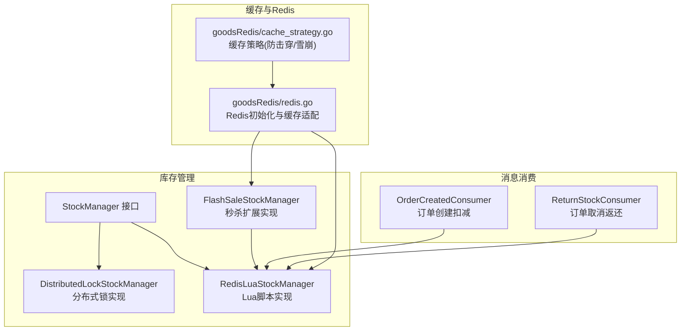
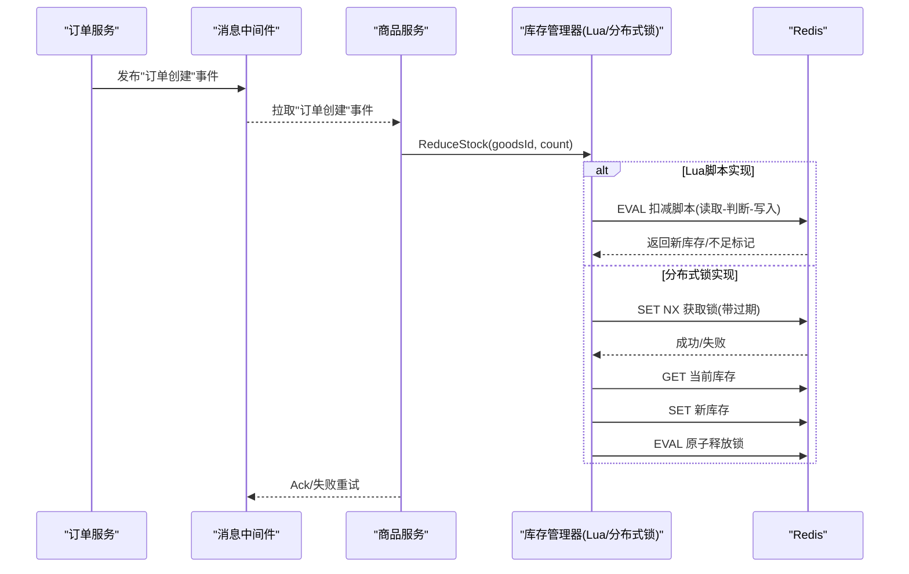
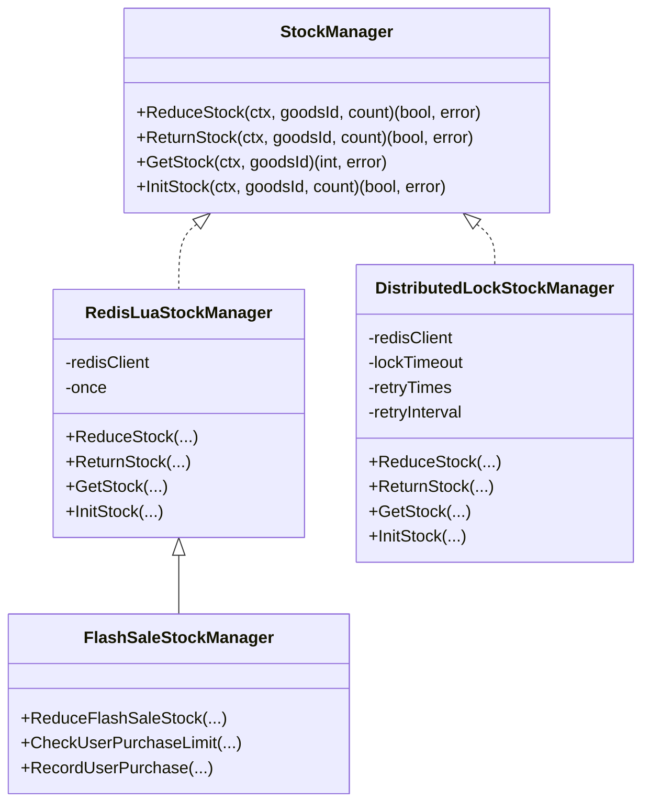
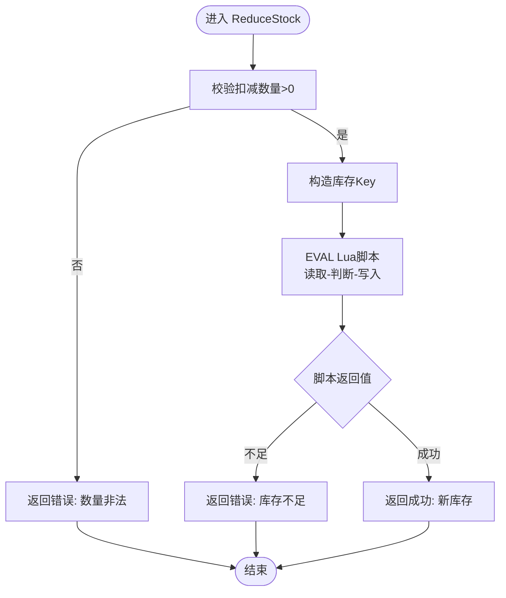
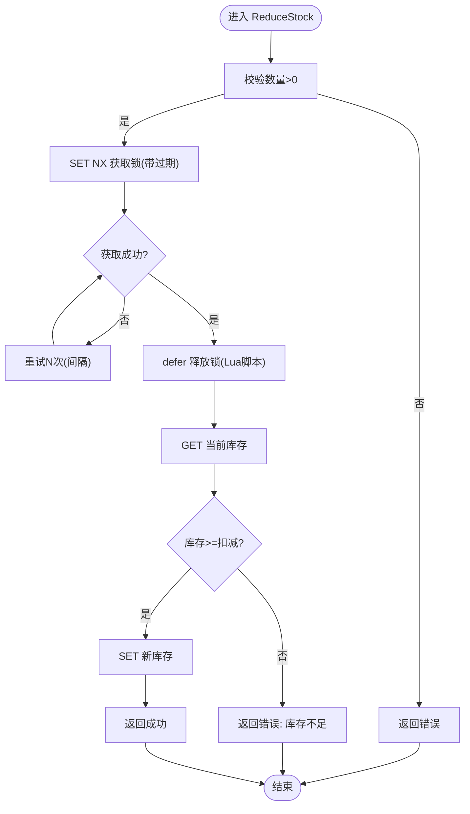
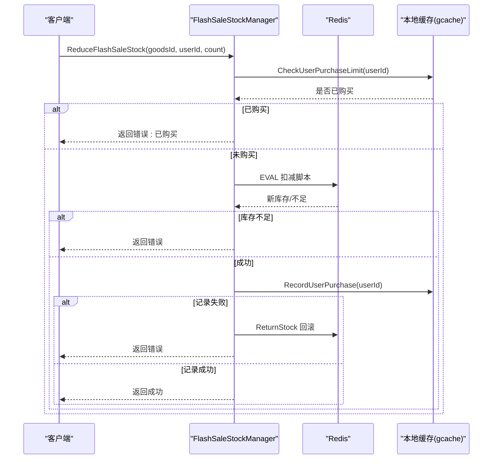
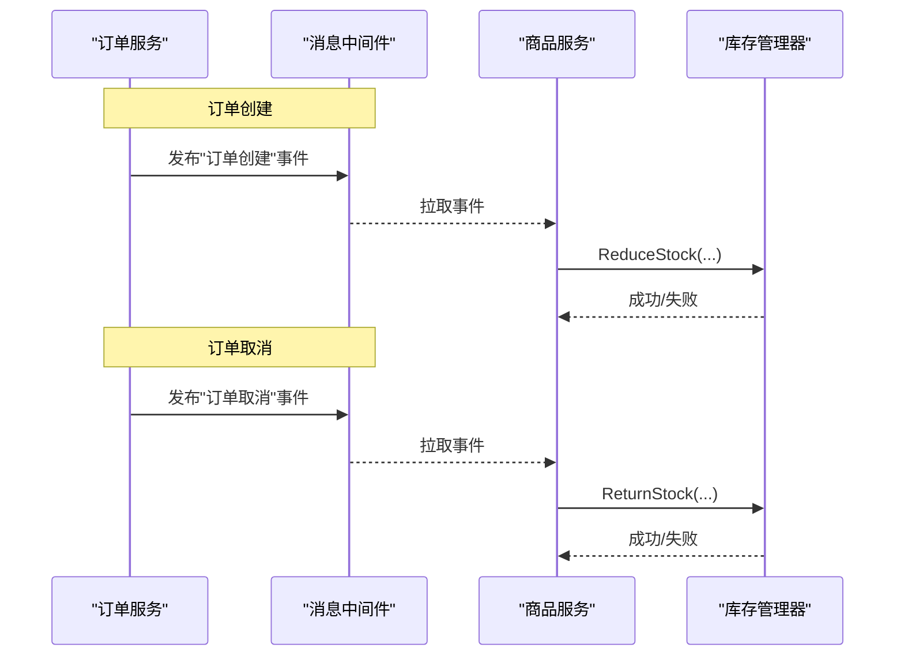
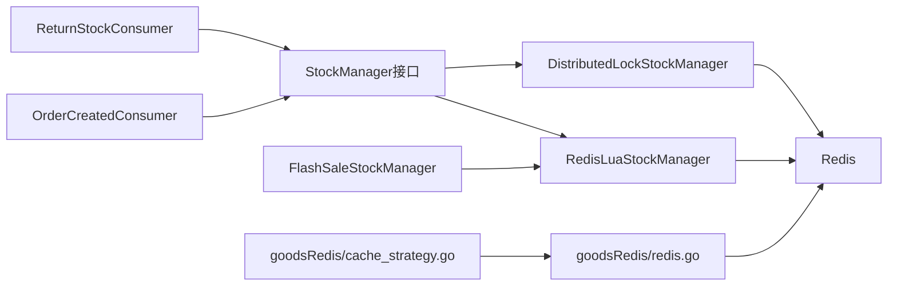

# 库存管理机制

<cite>
**本文引用的文件**
- [app/goods/utility/stock/stock.go](file://app/goods/utility/stock/stock.go)
- [app/goods/utility/stock/distributed_lock.go](file://app/goods/utility/stock/distributed_lock.go)
- [app/goods/utility/stock/redis_lua.go](file://app/goods/utility/stock/redis_lua.go)
- [app/goods/utility/stock/flash_sale_stock.go](file://app/goods/utility/stock/flash_sale_stock.go)
- [app/goods/utility/stock/stock_test.go](file://app/goods/utility/stock/stock_test.go)
- [app/goods/utility/consumer/order_created_consumer.go](file://app/goods/utility/consumer/order_created_consumer.go)
- [app/goods/utility/consumer/DEMO_WECHAT_OPEN_ID.go](file://app/goods/utility/consumer/DEMO_WECHAT_OPEN_ID.go)
- [app/goods/utility/goodsRedis/redis.go](file://app/goods/utility/goodsRedis/redis.go)
- [app/goods/utility/goodsRedis/cache_strategy.go](file://app/goods/utility/goodsRedis/cache_strategy.go)
- [doc/库存防超卖（Redis Lua+分布式锁对比实践）.md](file://doc/库存防超卖（Redis Lua+分布式锁对比实践）.md)
</cite>

## 目录
1. [引言](#引言)
2. [项目结构](#项目结构)
3. [核心组件](#核心组件)
4. [架构总览](#架构总览)
5. [详细组件分析](#详细组件分析)
6. [依赖关系分析](#依赖关系分析)
7. [性能考量](#性能考量)
8. [故障排查指南](#故障排查指南)
9. [结论](#结论)
10. [附录](#附录)

## 引言
本文件系统性阐述本仓库中的库存管理机制，重点覆盖：
- 库存扣减算法与防超卖策略
- Redis缓存库存与数据库库存一致性保障
- Lua脚本原子性操作与分布式锁机制
- 秒杀场景高并发处理、限流与库存预热
- 订单创建后的库存锁定、订单取消后的库存释放
- 库存预警机制、API接口与配置参数说明、性能优化建议
- 具体代码实现路径与故障处理方案

## 项目结构
围绕库存管理的相关模块主要位于 goods 服务的 utility 子目录，以及与之配套的消息消费组件和缓存策略实现。

图表来源
- [app/goods/utility/stock/stock.go](file://app/goods/utility/stock/stock.go#L7-L31)
- [app/goods/utility/stock/distributed_lock.go](file://app/goods/utility/stock/distributed_lock.go#L13-L19)
- [app/goods/utility/stock/redis_lua.go](file://app/goods/utility/stock/redis_lua.go#L12-L23)
- [app/goods/utility/stock/flash_sale_stock.go](file://app/goods/utility/stock/flash_sale_stock.go#L14-L32)
- [app/goods/utility/consumer/order_created_consumer.go](file://app/goods/utility/consumer/order_created_consumer.go#L13-L29)
- [app/goods/utility/consumer/DEMO_WECHAT_OPEN_ID.go](file://app/goods/utility/consumer/DEMO_WECHAT_OPEN_ID.go#L12-L29)
- [app/goods/utility/goodsRedis/redis.go](file://app/goods/utility/goodsRedis/redis.go#L13-L43)
- [app/goods/utility/goodsRedis/cache_strategy.go](file://app/goods/utility/goodsRedis/cache_strategy.go#L18-L30)

章节来源
- [app/goods/utility/stock/stock.go](file://app/goods/utility/stock/stock.go#L7-L31)
- [app/goods/utility/stock/distributed_lock.go](file://app/goods/utility/stock/distributed_lock.go#L13-L19)
- [app/goods/utility/stock/redis_lua.go](file://app/goods/utility/stock/redis_lua.go#L12-L23)
- [app/goods/utility/stock/flash_sale_stock.go](file://app/goods/utility/stock/flash_sale_stock.go#L14-L32)
- [app/goods/utility/consumer/order_created_consumer.go](file://app/goods/utility/consumer/order_created_consumer.go#L13-L29)
- [app/goods/utility/consumer/DEMO_WECHAT_OPEN_ID.go](file://app/goods/utility/consumer/DEMO_WECHAT_OPEN_ID.go#L12-L29)
- [app/goods/utility/goodsRedis/redis.go](file://app/goods/utility/goodsRedis/redis.go#L13-L43)
- [app/goods/utility/goodsRedis/cache_strategy.go](file://app/goods/utility/goodsRedis/cache_strategy.go#L18-L30)

## 核心组件
- 库存管理接口：统一定义扣减、返还、查询、初始化库存等能力，便于替换实现。
- 分布式锁库存管理器：基于Redis SET NX + Lua释放锁，保证同一商品在同一时刻仅有一个请求执行库存扣减。
- Lua脚本库存管理器：将“读取-判断-写入”封装为原子脚本，避免竞态条件，适合高并发场景。
- 秒杀库存管理器：在Lua脚本基础上，增加用户购买限制与购买记录缓存，支持秒杀场景的原子扣减与回滚。
- 订单事件消费者：订单创建时触发库存扣减；订单取消时触发库存返还。
- Redis与缓存策略：提供Redis初始化、缓存适配器、防缓存击穿与雪崩策略。

章节来源
- [app/goods/utility/stock/stock.go](file://app/goods/utility/stock/stock.go#L7-L31)
- [app/goods/utility/stock/distributed_lock.go](file://app/goods/utility/stock/distributed_lock.go#L13-L19)
- [app/goods/utility/stock/redis_lua.go](file://app/goods/utility/stock/redis_lua.go#L12-L23)
- [app/goods/utility/stock/flash_sale_stock.go](file://app/goods/utility/stock/flash_sale_stock.go#L14-L32)
- [app/goods/utility/consumer/order_created_consumer.go](file://app/goods/utility/consumer/order_created_consumer.go#L13-L29)
- [app/goods/utility/consumer/DEMO_WECHAT_OPEN_ID.go](file://app/goods/utility/consumer/DEMO_WECHAT_OPEN_ID.go#L12-L29)
- [app/goods/utility/goodsRedis/redis.go](file://app/goods/utility/goodsRedis/redis.go#L13-L43)
- [app/goods/utility/goodsRedis/cache_strategy.go](file://app/goods/utility/goodsRedis/cache_strategy.go#L18-L30)

## 架构总览
库存管理采用“事件驱动 + 原子操作”的架构：
- 订单服务产生“订单创建/取消”事件
- 商品服务订阅事件，基于Redis Lua脚本或分布式锁执行原子库存扣减/返还
- Redis作为高并发缓存库存，结合Lua脚本与分布式锁实现强一致与高性能

图表来源
- [app/goods/utility/consumer/order_created_consumer.go](file://app/goods/utility/consumer/order_created_consumer.go#L32-L64)
- [app/goods/utility/stock/redis_lua.go](file://app/goods/utility/stock/redis_lua.go#L75-L102)
- [app/goods/utility/stock/distributed_lock.go](file://app/goods/utility/stock/distributed_lock.go#L91-L159)

## 详细组件分析

### 接口与实现概览
- StockManager：定义统一的库存操作接口，便于替换底层实现。
- RedisLuaStockManager：基于Lua脚本的原子库存操作，适合高并发与强一致性。
- DistributedLockStockManager：基于Redis分布式锁的库存操作，适合复杂业务场景。
- FlashSaleStockManager：在Lua脚本基础上，增加用户购买限制与购买记录缓存，支持秒杀场景。

图表来源
- [app/goods/utility/stock/stock.go](file://app/goods/utility/stock/stock.go#L7-L31)
- [app/goods/utility/stock/redis_lua.go](file://app/goods/utility/stock/redis_lua.go#L12-L23)
- [app/goods/utility/stock/distributed_lock.go](file://app/goods/utility/stock/distributed_lock.go#L13-L19)
- [app/goods/utility/stock/flash_sale_stock.go](file://app/goods/utility/stock/flash_sale_stock.go#L14-L32)

章节来源
- [app/goods/utility/stock/stock.go](file://app/goods/utility/stock/stock.go#L7-L31)
- [app/goods/utility/stock/redis_lua.go](file://app/goods/utility/stock/redis_lua.go#L12-L23)
- [app/goods/utility/stock/distributed_lock.go](file://app/goods/utility/stock/distributed_lock.go#L13-L19)
- [app/goods/utility/stock/flash_sale_stock.go](file://app/goods/utility/stock/flash_sale_stock.go#L14-L32)

### Lua脚本原子扣减流程
- Lua脚本读取当前库存，判断是否足够，足够则原子扣减并返回新库存，否则返回不足标记。
- 通过EVAL一次性提交脚本，避免网络往返与竞态条件。
- 支持返还库存与初始化库存的对应脚本。

图表来源
- [app/goods/utility/stock/redis_lua.go](file://app/goods/utility/stock/redis_lua.go#L75-L102)
- [app/goods/utility/stock/redis_lua.go](file://app/goods/utility/stock/redis_lua.go#L30-L53)

章节来源
- [app/goods/utility/stock/redis_lua.go](file://app/goods/utility/stock/redis_lua.go#L30-L53)
- [app/goods/utility/stock/redis_lua.go](file://app/goods/utility/stock/redis_lua.go#L75-L102)

### 分布式锁扣减流程
- 获取分布式锁（SET NX + EX），失败则按重试策略等待后再次尝试。
- 获取当前库存并判断是否足够，足够则更新库存。
- 使用Lua脚本原子释放锁，避免误删。
- 扣减成功后释放锁，失败也确保释放。

图表来源
- [app/goods/utility/stock/distributed_lock.go](file://app/goods/utility/stock/distributed_lock.go#L91-L159)
- [app/goods/utility/stock/distributed_lock.go](file://app/goods/utility/stock/distributed_lock.go#L46-L89)

章节来源
- [app/goods/utility/stock/distributed_lock.go](file://app/goods/utility/stock/distributed_lock.go#L46-L89)
- [app/goods/utility/stock/distributed_lock.go](file://app/goods/utility/stock/distributed_lock.go#L91-L159)

### 秒杀场景：用户购买限制与回滚
- 用户购买限制：基于缓存检查用户是否已购买，避免重复购买。
- 原子扣减：Lua脚本完成扣减。
- 记录购买：成功后记录用户购买，失败则回滚库存。
- 24小时过期：购买记录短期缓存，防止刷单。

图表来源
- [app/goods/utility/stock/flash_sale_stock.go](file://app/goods/utility/stock/flash_sale_stock.go#L52-L99)
- [app/goods/utility/stock/flash_sale_stock.go](file://app/goods/utility/stock/flash_sale_stock.go#L101-L125)

章节来源
- [app/goods/utility/stock/flash_sale_stock.go](file://app/goods/utility/stock/flash_sale_stock.go#L52-L99)
- [app/goods/utility/stock/flash_sale_stock.go](file://app/goods/utility/stock/flash_sale_stock.go#L101-L125)

### 订单创建后的库存锁定与订单取消后的库存释放
- 订单创建事件消费者：接收到“订单创建”事件后，调用库存扣减。
- 订单取消事件消费者：接收到“订单取消”事件后，调用库存返还。
- 两者均通过统一的库存管理器接口实现，可无缝切换Lua或分布式锁实现。

图表来源
- [app/goods/utility/consumer/order_created_consumer.go](file://app/goods/utility/consumer/order_created_consumer.go#L32-L64)
- [app/goods/utility/consumer/DEMO_WECHAT_OPEN_ID.go](file://app/goods/utility/consumer/DEMO_WECHAT_OPEN_ID.go#L31-L57)

章节来源
- [app/goods/utility/consumer/order_created_consumer.go](file://app/goods/utility/consumer/order_created_consumer.go#L32-L64)
- [app/goods/utility/consumer/DEMO_WECHAT_OPEN_ID.go](file://app/goods/utility/consumer/DEMO_WECHAT_OPEN_ID.go#L31-L57)

### Redis缓存库存与数据库一致性的保障
- 缓存策略：提供带本地互斥锁、双重检查、空值缓存与随机过期时间的缓存策略，缓解缓存击穿与雪崩。
- Redis初始化：统一初始化Redis连接与缓存适配器，确保连接可用性。
- 库存一致性：在高并发场景下，优先使用Redis作为缓存库存；Lua脚本或分布式锁保证原子性，避免脏写。

章节来源
- [app/goods/utility/goodsRedis/cache_strategy.go](file://app/goods/utility/goodsRedis/cache_strategy.go#L32-L78)
- [app/goods/utility/goodsRedis/redis.go](file://app/goods/utility/goodsRedis/redis.go#L13-L43)

### 性能测试与对比
- 并发测试：模拟高并发扣减，统计成功/失败数量与平均耗时，验证无超卖。
- 边界测试：覆盖库存为0、负数扣减、正常扣减与返还等场景。
- 对比实践文档：系统性对比Lua脚本与分布式锁在性能、可靠性、适用场景等方面的差异与最佳实践。

章节来源
- [app/goods/utility/stock/stock_test.go](file://app/goods/utility/stock/stock_test.go#L32-L78)
- [app/goods/utility/stock/stock_test.go](file://app/goods/utility/stock/stock_test.go#L203-L276)
- [doc/库存防超卖（Redis Lua+分布式锁对比实践）.md](file://doc/库存防超卖（Redis Lua+分布式锁对比实践）.md#L1-L630)

## 依赖关系分析
- 组件耦合
  - StockManager 为上层统一接口，RedisLuaStockManager 与 DistributedLockStockManager 实现解耦。
  - FlashSaleStockManager 组合 RedisLuaStockManager，扩展秒杀能力。
  - 订单事件消费者依赖库存管理器接口，不关心具体实现。
- 外部依赖
  - Redis：提供原子Lua脚本与分布式锁能力。
  - RabbitMQ：事件驱动的库存扣减与返还。
  - gcache：本地缓存与随机过期策略。

图表来源
- [app/goods/utility/consumer/order_created_consumer.go](file://app/goods/utility/consumer/order_created_consumer.go#L13-L29)
- [app/goods/utility/consumer/DEMO_WECHAT_OPEN_ID.go](file://app/goods/utility/consumer/DEMO_WECHAT_OPEN_ID.go#L12-L29)
- [app/goods/utility/stock/stock.go](file://app/goods/utility/stock/stock.go#L7-L31)
- [app/goods/utility/stock/redis_lua.go](file://app/goods/utility/stock/redis_lua.go#L12-L23)
- [app/goods/utility/stock/distributed_lock.go](file://app/goods/utility/stock/distributed_lock.go#L13-L19)
- [app/goods/utility/stock/flash_sale_stock.go](file://app/goods/utility/stock/flash_sale_stock.go#L28-L40)
- [app/goods/utility/goodsRedis/redis.go](file://app/goods/utility/goodsRedis/redis.go#L13-L43)
- [app/goods/utility/goodsRedis/cache_strategy.go](file://app/goods/utility/goodsRedis/cache_strategy.go#L18-L30)

章节来源
- [app/goods/utility/consumer/order_created_consumer.go](file://app/goods/utility/consumer/order_created_consumer.go#L13-L29)
- [app/goods/utility/consumer/DEMO_WECHAT_OPEN_ID.go](file://app/goods/utility/consumer/DEMO_WECHAT_OPEN_ID.go#L12-L29)
- [app/goods/utility/stock/stock.go](file://app/goods/utility/stock/stock.go#L7-L31)
- [app/goods/utility/stock/redis_lua.go](file://app/goods/utility/stock/redis_lua.go#L12-L23)
- [app/goods/utility/stock/distributed_lock.go](file://app/goods/utility/stock/distributed_lock.go#L13-L19)
- [app/goods/utility/stock/flash_sale_stock.go](file://app/goods/utility/stock/flash_sale_stock.go#L28-L40)
- [app/goods/utility/goodsRedis/redis.go](file://app/goods/utility/goodsRedis/redis.go#L13-L43)
- [app/goods/utility/goodsRedis/cache_strategy.go](file://app/goods/utility/goodsRedis/cache_strategy.go#L18-L30)

## 性能考量
- Lua脚本方案
  - 优势：原子性、单次网络交互、高并发稳定、无死锁风险。
  - 适用：高并发秒杀、简单库存扣减。
- 分布式锁方案
  - 优势：可承载复杂业务逻辑、多资源协调。
  - 注意：锁竞争、重试与释放策略需谨慎设计。
- 缓存策略
  - 防击穿：本地互斥锁+双重检查+空值缓存。
  - 防雪崩：随机过期时间，分散到期高峰。
- 限流与削峰
  - 在网关层或上游服务实施限流，配合消息队列削峰填谷。
- 库存预热
  - 系统启动时将热点商品库存加载至Redis，降低冷启动抖动。

章节来源
- [doc/库存防超卖（Redis Lua+分布式锁对比实践）.md](file://doc/库存防超卖（Redis Lua+分布式锁对比实践）.md#L180-L224)
- [app/goods/utility/goodsRedis/cache_strategy.go](file://app/goods/utility/goodsRedis/cache_strategy.go#L32-L78)

## 故障排查指南
- 常见错误
  - 库存不足：Lua脚本返回不足标记；分布式锁在判断库存后返回不足。
  - 锁未释放：确保使用Lua脚本原子释放锁；失败时记录日志并重试。
  - 记录购买失败：秒杀场景下需回滚库存，避免脏数据。
- 日志与监控
  - 记录扣减成功/失败详情，便于定位问题。
  - 监控Redis连接状态、Lua脚本执行耗时、库存操作成功率。
- 重试与降级
  - 消费者侧对失败消息进行有限重试与死信处理。
  - Redis不可用时可降级至数据库或熔断保护。

章节来源
- [app/goods/utility/stock/redis_lua.go](file://app/goods/utility/stock/redis_lua.go#L90-L102)
- [app/goods/utility/stock/distributed_lock.go](file://app/goods/utility/stock/distributed_lock.go#L66-L89)
- [app/goods/utility/stock/flash_sale_stock.go](file://app/goods/utility/stock/flash_sale_stock.go#L88-L93)
- [app/goods/utility/consumer/order_created_consumer.go](file://app/goods/utility/consumer/order_created_consumer.go#L54-L60)

## 结论
本项目通过统一接口抽象与多种实现策略，结合事件驱动与Redis原子操作，构建了高并发、强一致、可扩展的库存管理体系。Lua脚本方案适合秒杀等高并发场景，分布式锁方案适合复杂业务；配合缓存策略与消息队列，可进一步提升系统稳定性与吞吐量。

## 附录

### API接口与配置参数说明
- 库存管理接口（StockManager）
  - ReduceStock(ctx, goodsId, count) → (bool, error)
  - ReturnStock(ctx, goodsId, count) → (bool, error)
  - GetStock(ctx, goodsId) → (int, error)
  - InitStock(ctx, goodsId, count) → (bool, error)
- Redis初始化与缓存适配
  - InitGoodsRedis(ctx)：加载Redis配置、创建连接、PING测试
  - GetGoodsCache()：获取缓存实例
- 缓存策略
  - GetWithLock(key, expiration, callback)：带本地互斥锁的缓存获取
  - SetWithRandomExpiration(key, value, baseExpiration)：随机过期时间设置

章节来源
- [app/goods/utility/stock/stock.go](file://app/goods/utility/stock/stock.go#L7-L31)
- [app/goods/utility/goodsRedis/redis.go](file://app/goods/utility/goodsRedis/redis.go#L13-L43)
- [app/goods/utility/goodsRedis/cache_strategy.go](file://app/goods/utility/goodsRedis/cache_strategy.go#L32-L78)