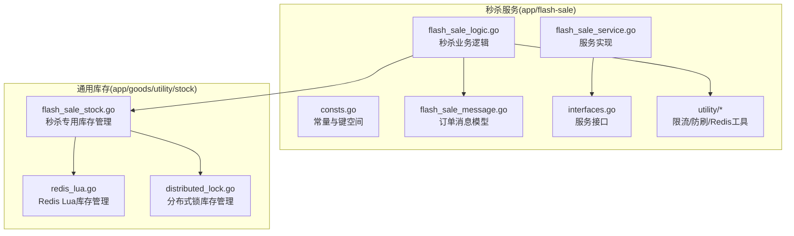
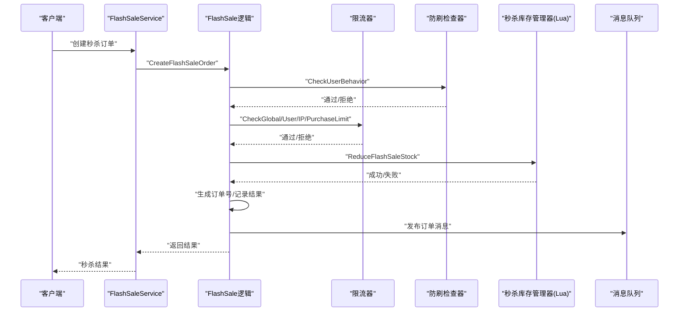
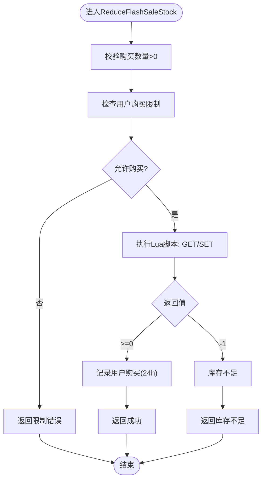
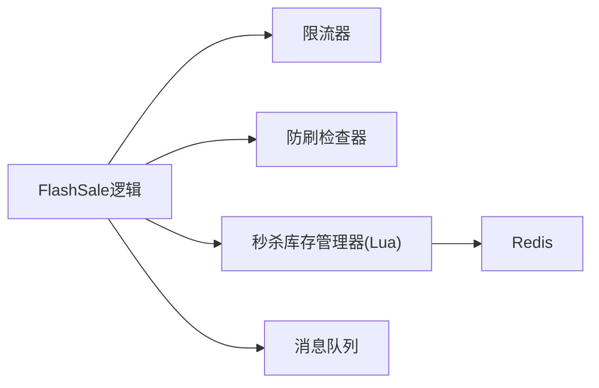

# 秒杀库存处理

<cite>
**本文引用的文件**
- [app/flash-sale/utility/stock_manager.go](file://app/flash-sale/utility/stock_manager.go)
- [app/goods/utility/stock/flash_sale_stock.go](file://app/goods/utility/stock/flash_sale_stock.go)
- [app/goods/utility/stock/redis_lua.go](file://app/goods/utility/stock/redis_lua.go)
- [app/goods/utility/stock/distributed_lock.go](file://app/goods/utility/stock/distributed_lock.go)
- [app/flash-sale/utility/rate_limit.go](file://app/flash-sale/utility/rate_limit.go)
- [app/flash-sale/utility/anti_brush.go](file://app/flash-sale/utility/anti_brush.go)
- [app/flash-sale/utility/redis.go](file://app/flash-sale/utility/redis.go)
- [app/flash-sale/internal/logic/flash_sale_logic.go](file://app/flash-sale/internal/logic/flash_sale_logic.go)
- [app/flash-sale/internal/consts/consts.go](file://app/flash-sale/internal/consts/consts.go)
- [app/flash-sale/internal/model/flash_sale_message.go](file://app/flash-sale/internal/model/flash_sale_message.go)
- [app/flash-sale/internal/service/interfaces.go](file://app/flash-sale/internal/service/interfaces.go)
- [app/flash-sale/internal/service/flash_sale_service.go](file://app/flash-sale/internal/service/flash_sale_service.go)
- [app/flash-sale/utility/service.go](file://app/flash-sale/utility/service.go)
- [doc/库存防超卖（Redis Lua+分布式锁对比实践）.md](file://doc/库存防超卖（Redis Lua+分布式锁对比实践）.md)
- [doc/秒杀系统设计方案.md](file://doc/秒杀系统设计方案.md)
</cite>

## 目录
1. [简介](#简介)
2. [项目结构](#项目结构)
3. [核心组件](#核心组件)
4. [架构总览](#架构总览)
5. [详细组件分析](#详细组件分析)
6. [依赖关系分析](#依赖关系分析)
7. [性能考量](#性能考量)
8. [故障排查指南](#故障排查指南)
9. [结论](#结论)
10. [附录](#附录)

## 简介
本文件面向高并发秒杀场景，系统化阐述库存管理策略与实现，覆盖库存预热、限流控制、用户限购与防刷策略、库存分配与扣减算法、以及异步处理与监控指标。文档结合代码仓库中的秒杀服务与库存模块，给出可落地的实现方案、配置参数与性能调优建议，并提供故障处理预案。

## 项目结构
围绕秒杀库存处理的相关模块主要分布在以下路径：
- flash-sale 服务：秒杀接口、逻辑与工具
- goods 服务：通用库存管理（Lua脚本与分布式锁两种实现）
- doc 文档：库存防超卖对比实践与秒杀系统设计方案

**图表来源**
- [app/flash-sale/internal/logic/flash_sale_logic.go](file://app/flash-sale/internal/logic/flash_sale_logic.go#L1-L400)
- [app/flash-sale/internal/consts/consts.go](file://app/flash-sale/internal/consts/consts.go#L1-L43)
- [app/flash-sale/internal/model/flash_sale_message.go](file://app/flash-sale/internal/model/flash_sale_message.go#L1-L16)
- [app/flash-sale/internal/service/interfaces.go](file://app/flash-sale/internal/service/interfaces.go#L1-L26)
- [app/flash-sale/internal/service/flash_sale_service.go](file://app/flash-sale/internal/service/flash_sale_service.go#L1-L100)
- [app/flash-sale/utility/rate_limit.go](file://app/flash-sale/utility/rate_limit.go#L1-L161)
- [app/flash-sale/utility/anti_brush.go](file://app/flash-sale/utility/anti_brush.go#L1-L81)
- [app/flash-sale/utility/redis.go](file://app/flash-sale/utility/redis.go#L1-L56)
- [app/goods/utility/stock/redis_lua.go](file://app/goods/utility/stock/redis_lua.go#L1-L166)
- [app/goods/utility/stock/distributed_lock.go](file://app/goods/utility/stock/distributed_lock.go#L1-L266)
- [app/goods/utility/stock/flash_sale_stock.go](file://app/goods/utility/stock/flash_sale_stock.go#L1-L152)

**章节来源**
- [app/flash-sale/internal/logic/flash_sale_logic.go](file://app/flash-sale/internal/logic/flash_sale_logic.go#L1-L400)
- [app/goods/utility/stock/redis_lua.go](file://app/goods/utility/stock/redis_lua.go#L1-L166)
- [app/goods/utility/stock/distributed_lock.go](file://app/goods/utility/stock/distributed_lock.go#L1-L266)
- [app/goods/utility/stock/flash_sale_stock.go](file://app/goods/utility/stock/flash_sale_stock.go#L1-L152)

## 核心组件
- 秒杀库存管理器（基于Redis Lua脚本）
  - 提供扣减、返还、查询与初始化库存能力，使用Lua脚本保证原子性
- 传统缓存库存管理器（基于gcache）
  - 提供基础的库存查询与扣减，使用互斥锁保证线程安全
- 限流器
  - 支持全局、用户、IP维度的限流，防止瞬时高流量冲击
- 防刷检查器
  - 基于用户与IP的行为频次统计，识别异常请求
- Redis初始化与缓存适配
  - 提供秒杀专用Redis连接与缓存适配器
- 秒杀服务与消息队列
  - 提供秒杀下单、结果查询与异步订单处理

**章节来源**
- [app/goods/utility/stock/flash_sale_stock.go](file://app/goods/utility/stock/flash_sale_stock.go#L14-L40)
- [app/flash-sale/utility/stock_manager.go](file://app/flash-sale/utility/stock_manager.go#L12-L31)
- [app/flash-sale/utility/rate_limit.go](file://app/flash-sale/utility/rate_limit.go#L13-L23)
- [app/flash-sale/utility/anti_brush.go](file://app/flash-sale/utility/anti_brush.go#L12-L22)
- [app/flash-sale/utility/redis.go](file://app/flash-sale/utility/redis.go#L12-L56)
- [app/flash-sale/internal/model/flash_sale_message.go](file://app/flash-sale/internal/model/flash_sale_message.go#L5-L16)

## 架构总览
秒杀请求处理的关键流程如下：
- 请求进入后，依次进行参数校验、限流检查、防刷检查、库存检查与扣减、生成订单、发送消息、返回结果
- 库存扣减采用Redis Lua脚本，确保原子性与高性能
- 订单异步处理，通过消息队列解耦

**图表来源**
- [app/flash-sale/internal/service/flash_sale_service.go](file://app/flash-sale/internal/service/flash_sale_service.go#L53-L69)
- [app/flash-sale/internal/logic/flash_sale_logic.go](file://app/flash-sale/internal/logic/flash_sale_logic.go#L102-L254)
- [app/flash-sale/utility/rate_limit.go](file://app/flash-sale/utility/rate_limit.go#L25-L161)
- [app/flash-sale/utility/anti_brush.go](file://app/flash-sale/utility/anti_brush.go#L24-L81)
- [app/goods/utility/stock/flash_sale_stock.go](file://app/goods/utility/stock/flash_sale_stock.go#L52-L99)

## 详细组件分析

### 秒杀库存管理器（Lua脚本）
- 角色与职责
  - 基于Redis Lua脚本实现库存扣减、返还、查询与初始化
  - 在脚本中完成“读取—判断—扣减”三步，保证原子性
- 关键实现要点
  - 使用统一的库存键命名规范，便于运维与监控
  - 扣减脚本返回-1表示库存不足，便于上层快速判定
  - 记录用户购买状态，配合缓存实现用户限购
- 并发与一致性
  - Lua脚本在Redis端原子执行，避免竞态条件
  - 适合高并发场景，吞吐量与稳定性更优

**图表来源**
- [app/goods/utility/stock/flash_sale_stock.go](file://app/goods/utility/stock/flash_sale_stock.go#L52-L99)
- [app/goods/utility/stock/flash_sale_stock.go](file://app/goods/utility/stock/flash_sale_stock.go#L127-L152)

**章节来源**
- [app/goods/utility/stock/flash_sale_stock.go](file://app/goods/utility/stock/flash_sale_stock.go#L14-L40)
- [app/goods/utility/stock/flash_sale_stock.go](file://app/goods/utility/stock/flash_sale_stock.go#L52-L99)
- [app/goods/utility/stock/flash_sale_stock.go](file://app/goods/utility/stock/flash_sale_stock.go#L127-L152)

### 传统缓存库存管理器（gcache）
- 角色与职责
  - 提供基础库存查询与扣减能力
  - 使用互斥锁保证线程安全
- 适用场景
  - 低并发或对原子性要求不高的场景
  - 作为临时替代或演示用途
- 注意事项
  - 非原子性操作，不适合高并发秒杀

**章节来源**
- [app/flash-sale/utility/stock_manager.go](file://app/flash-sale/utility/stock_manager.go#L12-L31)
- [app/flash-sale/utility/stock_manager.go](file://app/flash-sale/utility/stock_manager.go#L33-L89)

### 限流器
- 功能
  - 全局限流、用户限流、IP限流、购买限制
  - 基于gcache的计数器与过期时间控制
- 配置要点
  - 全局限流：每秒若干次
  - 用户限流：每秒若干次，每分钟若干次
  - IP限流：每秒若干次，每分钟若干次
  - 购买限制：每小时仅允许一次
- 实现细节
  - 首次设置时设定过期时间，后续更新保持原TTL
  - 异常返回统一包装，便于上层处理

**章节来源**
- [app/flash-sale/utility/rate_limit.go](file://app/flash-sale/utility/rate_limit.go#L13-L23)
- [app/flash-sale/utility/rate_limit.go](file://app/flash-sale/utility/rate_limit.go#L25-L161)
- [app/flash-sale/internal/consts/consts.go](file://app/flash-sale/internal/consts/consts.go#L28-L42)

### 防刷检查器
- 功能
  - 基于用户与IP的请求频次统计，每分钟阈值控制
  - 异常行为触发时返回错误，阻断刷单
- 实现细节
  - 使用独立键空间记录用户与IP的请求计数
  - 首次设置过期时间为1分钟，后续更新保持原TTL

**章节来源**
- [app/flash-sale/utility/anti_brush.go](file://app/flash-sale/utility/anti_brush.go#L12-L22)
- [app/flash-sale/utility/anti_brush.go](file://app/flash-sale/utility/anti_brush.go#L24-L81)
- [app/flash-sale/internal/consts/consts.go](file://app/flash-sale/internal/consts/consts.go#L37-L42)

### Redis初始化与缓存适配
- 功能
  - 从配置读取Redis连接参数，创建gcache适配器
  - 提供秒杀专用Redis连接与缓存实例
- 注意事项
  - 初始化时进行PING测试，确保连接可用
  - 若未找到秒杀配置，回退到商品Redis配置

**章节来源**
- [app/flash-sale/utility/redis.go](file://app/flash-sale/utility/redis.go#L12-L56)

### 秒杀服务与消息队列
- 功能
  - 提供秒杀商品列表、详情、下单、结果查询
  - 下单成功后异步处理订单，发布消息到队列
- 模型
  - FlashSaleOrderMessage定义订单消息字段与重试策略

**章节来源**
- [app/flash-sale/internal/service/interfaces.go](file://app/flash-sale/internal/service/interfaces.go#L9-L26)
- [app/flash-sale/internal/service/flash_sale_service.go](file://app/flash-sale/internal/service/flash_sale_service.go#L14-L100)
- [app/flash-sale/internal/model/flash_sale_message.go](file://app/flash-sale/internal/model/flash_sale_message.go#L5-L16)

## 依赖关系分析
- 秒杀逻辑依赖
  - 限流器与防刷检查器：前置风控
  - 秒杀库存管理器（Lua）：核心扣减
  - 消息队列：异步处理
- 库存实现对比
  - Lua脚本方案：原子性强、网络交互少、适合高并发
  - 分布式锁方案：复杂度较高、存在锁竞争与死锁风险，适合复杂业务

**图表来源**
- [app/flash-sale/internal/logic/flash_sale_logic.go](file://app/flash-sale/internal/logic/flash_sale_logic.go#L102-L254)
- [app/flash-sale/utility/rate_limit.go](file://app/flash-sale/utility/rate_limit.go#L25-L161)
- [app/flash-sale/utility/anti_brush.go](file://app/flash-sale/utility/anti_brush.go#L24-L81)
- [app/goods/utility/stock/flash_sale_stock.go](file://app/goods/utility/stock/flash_sale_stock.go#L52-L99)

**章节来源**
- [doc/库存防超卖（Redis Lua+分布式锁对比实践）.md](file://doc/库存防超卖（Redis Lua+分布式锁对比实践）.md#L39-L224)

## 性能考量
- 库存扣减性能
  - Lua脚本方案在网络交互与原子性方面显著优于分布式锁方案
  - 高并发下Lua方案吞吐量更高、稳定性更好
- Redis连接与配置
  - 使用连接池与合理的超时设置
  - 配置maxmemory与淘汰策略，保障高可用
- 缓存预热与热点治理
  - 系统启动时将热点商品库存预热至Redis
  - 对非热点数据使用本地缓存，降低Redis压力
- 异步削峰
  - 通过消息队列承接瞬时高峰，避免直连数据库

**章节来源**
- [doc/库存防超卖（Redis Lua+分布式锁对比实践）.md](file://doc/库存防超卖（Redis Lua+分布式锁对比实践）.md#L180-L224)
- [doc/秒杀系统设计方案.md](file://doc/秒杀系统设计方案.md#L2813-L2897)

## 故障排查指南
- 常见问题与定位
  - 库存不足：检查Lua脚本返回值与用户限购记录
  - 限流触发：核对全局/用户/IP限流阈值与过期时间
  - 防刷拦截：确认用户与IP的请求计数是否异常
  - Redis连接失败：检查初始化流程与PING测试
- 处理建议
  - 对Lua脚本异常进行日志记录与告警
  - 对限流与防刷失败返回明确提示，便于前端引导
  - 对消息发送失败进行重试与人工干预

**章节来源**
- [app/flash-sale/internal/logic/flash_sale_logic.go](file://app/flash-sale/internal/logic/flash_sale_logic.go#L130-L254)
- [app/flash-sale/utility/rate_limit.go](file://app/flash-sale/utility/rate_limit.go#L104-L161)
- [app/flash-sale/utility/anti_brush.go](file://app/flash-sale/utility/anti_brush.go#L24-L81)
- [app/flash-sale/utility/redis.go](file://app/flash-sale/utility/redis.go#L16-L56)

## 结论
本方案以Redis Lua脚本为核心，结合限流与防刷策略，形成高并发秒杀场景下的高效、稳定库存处理体系。通过异步消息解耦与缓存预热等手段，进一步提升系统整体性能与用户体验。建议在生产环境中持续监控关键指标，按需调整限流阈值与Redis配置，确保系统在峰值流量下的稳定性。

## 附录

### 配置参数与键空间
- Redis配置
  - maxmemory、maxmemory-policy、timeout、tcp-keepalive
- 限流与防刷阈值
  - 全局限流、用户/IP每秒/分钟阈值、购买限制
- 键空间命名
  - 秒杀商品、库存、结果、限流、行为、黑名单等

**章节来源**
- [app/flash-sale/internal/consts/consts.go](file://app/flash-sale/internal/consts/consts.go#L3-L42)
- [doc/秒杀系统设计方案.md](file://doc/秒杀系统设计方案.md#L2813-L2897)