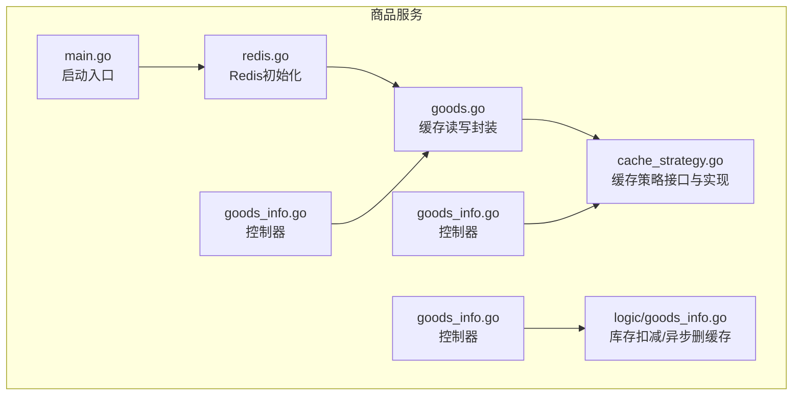
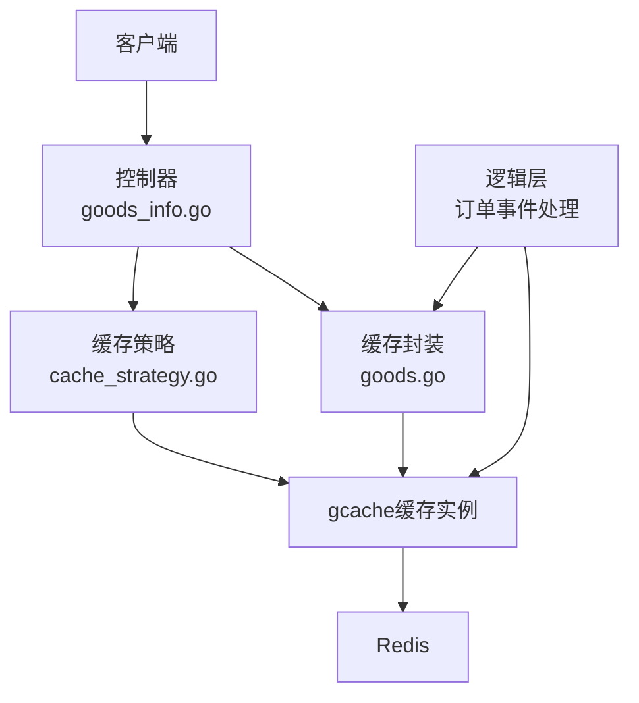
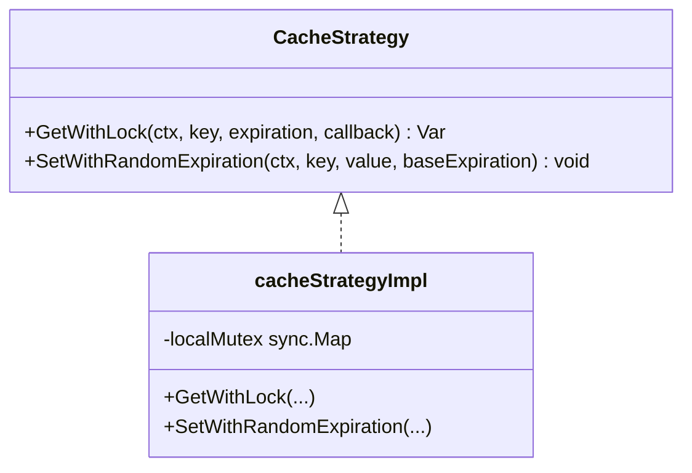
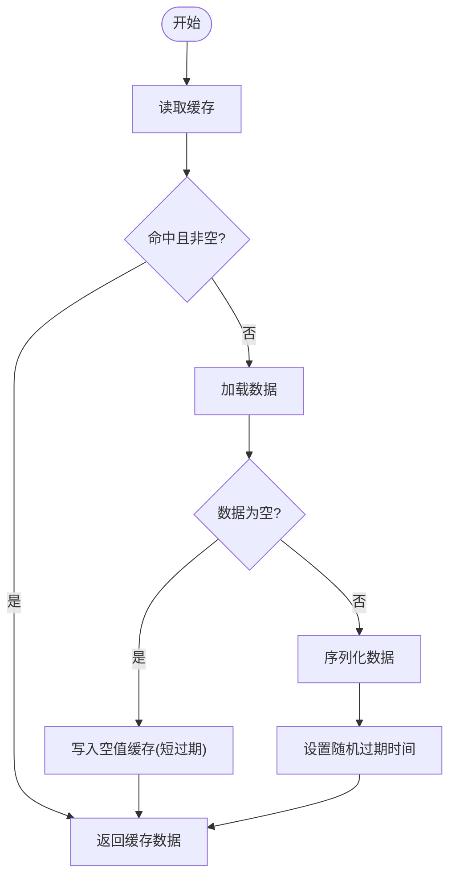
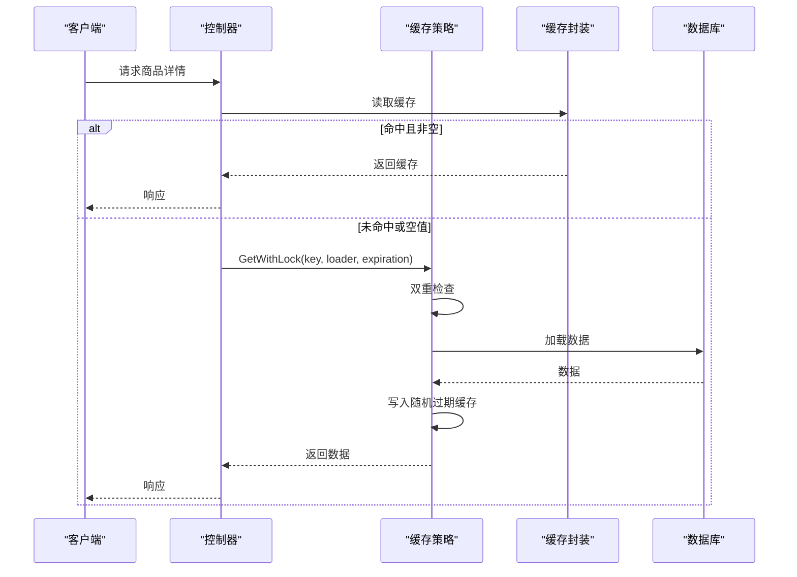
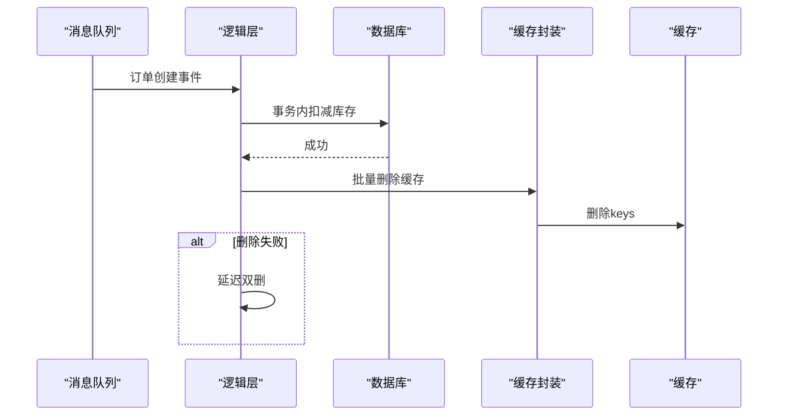
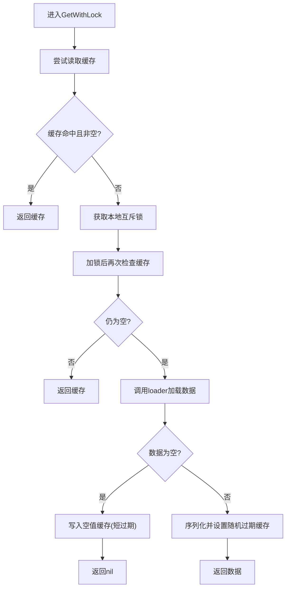
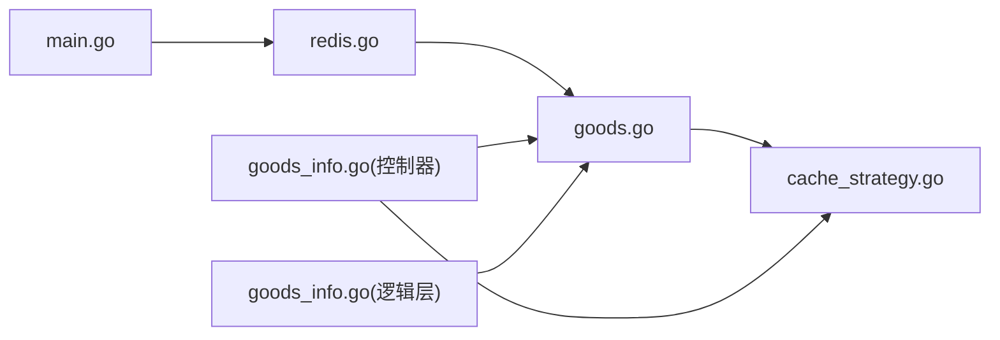

# 缓存一致性保证

<cite>
**本文引用的文件**
- [app/goods/utility/goodsRedis/cache_strategy.go](file://app/goods/utility/goodsRedis/cache_strategy.go)
- [app/goods/utility/goodsRedis/goods.go](file://app/goods/utility/goodsRedis/goods.go)
- [app/goods/utility/goodsRedis/redis.go](file://app/goods/utility/goodsRedis/redis.go)
- [app/goods/internal/controller/goods_info/goods_info.go](file://app/goods/internal/controller/goods_info/goods_info.go)
- [app/goods/internal/logic/goods_info/goods_info.go](file://app/goods/internal/logic/goods_info/goods_info.go)
- [app/goods/main.go](file://app/goods/main.go)
- [doc/Redis缓存策略-穿透-击穿-雪崩全解决方案.md](file://doc/Redis缓存策略-穿透-击穿-雪崩全解决方案.md)
</cite>

## 目录
1. [引言](#引言)
2. [项目结构](#项目结构)
3. [核心组件](#核心组件)
4. [架构总览](#架构总览)
5. [详细组件分析](#详细组件分析)
6. [依赖关系分析](#依赖关系分析)
7. [性能考量](#性能考量)
8. [故障排查指南](#故障排查指南)
9. [结论](#结论)
10. [附录](#附录)

## 引言
本文件聚焦于商品信息缓存的一致性保障，系统化解析并总结项目中针对“缓存穿透”“缓存击穿”“缓存雪崩”的防护策略与实现，覆盖空值缓存、双重检查、本地互斥锁、随机过期时间、数据变更时的缓存失效与更新机制，并给出可落地的最佳实践与错误处理建议。

## 项目结构
围绕商品服务的缓存一致性，相关代码主要分布在以下模块：
- 缓存基础设施与策略：goodsRedis 包（Redis 初始化、通用缓存封装、缓存策略接口与实现）
- 控制层：商品详情查询与更新流程
- 逻辑层：订单事件驱动的库存扣减与异步缓存清理
- 启动入口：服务启动时初始化 Redis 缓存

图表来源
- [app/goods/main.go](file://app/goods/main.go#L15-L34)
- [app/goods/utility/goodsRedis/redis.go](file://app/goods/utility/goodsRedis/redis.go#L13-L48)
- [app/goods/utility/goodsRedis/goods.go](file://app/goods/utility/goodsRedis/goods.go#L18-L120)
- [app/goods/utility/goodsRedis/cache_strategy.go](file://app/goods/utility/goodsRedis/cache_strategy.go#L18-L95)
- [app/goods/internal/controller/goods_info/goods_info.go](file://app/goods/internal/controller/goods_info/goods_info.go#L94-L221)
- [app/goods/internal/logic/goods_info/goods_info.go](file://app/goods/internal/logic/goods_info/goods_info.go#L83-L138)

章节来源
- [app/goods/main.go](file://app/goods/main.go#L15-L34)
- [app/goods/utility/goodsRedis/redis.go](file://app/goods/utility/goodsRedis/redis.go#L13-L48)

## 核心组件
- Redis 缓存适配器与全局缓存实例：负责连接 Redis、设置适配器、提供统一的缓存读写能力
- 缓存读写封装：提供商品详情、分类全量数据的缓存读写与批量删除
- 缓存策略接口与实现：统一的缓存获取流程，内置空值缓存、双重检查、本地互斥锁、随机过期时间
- 控制器：在查询与更新路径上使用缓存策略与缓存读写封装
- 逻辑层：在订单事件处理中异步删除相关商品缓存，配合延迟双删策略

章节来源
- [app/goods/utility/goodsRedis/redis.go](file://app/goods/utility/goodsRedis/redis.go#L11-L48)
- [app/goods/utility/goodsRedis/goods.go](file://app/goods/utility/goodsRedis/goods.go#L12-L120)
- [app/goods/utility/goodsRedis/cache_strategy.go](file://app/goods/utility/goodsRedis/cache_strategy.go#L18-L95)
- [app/goods/internal/controller/goods_info/goods_info.go](file://app/goods/internal/controller/goods_info/goods_info.go#L94-L221)
- [app/goods/internal/logic/goods_info/goods_info.go](file://app/goods/internal/logic/goods_info/goods_info.go#L83-L138)

## 架构总览
商品信息缓存一致性架构由“缓存层（gcache + Redis）+ 策略层（空值缓存/双重检查/本地锁/随机过期）+ 业务层（控制器/逻辑层）”构成，贯穿查询与更新两条主线。

图表来源
- [app/goods/utility/goodsRedis/cache_strategy.go](file://app/goods/utility/goodsRedis/cache_strategy.go#L32-L78)
- [app/goods/utility/goodsRedis/goods.go](file://app/goods/utility/goodsRedis/goods.go#L38-L59)
- [app/goods/utility/goodsRedis/redis.go](file://app/goods/utility/goodsRedis/redis.go#L11-L48)
- [app/goods/internal/controller/goods_info/goods_info.go](file://app/goods/internal/controller/goods_info/goods_info.go#L94-L159)
- [app/goods/internal/logic/goods_info/goods_info.go](file://app/goods/internal/logic/goods_info/goods_info.go#L118-L132)

## 详细组件分析

### 缓存策略接口与实现
- 接口职责
  - GetWithLock：带本地互斥锁的缓存获取，支持双重检查，防止缓存击穿
  - SetWithRandomExpiration：设置带随机过期时间的缓存，分散过期时间，缓解缓存雪崩
- 关键机制
  - 空值缓存：当回调返回空值时，写入短时过期的空值标记，防止缓存穿透
  - 本地互斥锁：以“mutex:key”为键的 sync.Map 本地锁，避免热点 key 的并发穿透
  - 双重检查：加锁前后均检查缓存，避免重复加载
  - 随机过期：在基准过期时间基础上加入 5%~15% 的随机抖动

图表来源
- [app/goods/utility/goodsRedis/cache_strategy.go](file://app/goods/utility/goodsRedis/cache_strategy.go#L18-L30)
- [app/goods/utility/goodsRedis/cache_strategy.go](file://app/goods/utility/goodsRedis/cache_strategy.go#L32-L95)

章节来源
- [app/goods/utility/goodsRedis/cache_strategy.go](file://app/goods/utility/goodsRedis/cache_strategy.go#L18-L95)

### 缓存读写封装
- 提供商品详情、分类全量数据的缓存读写与批量删除
- 对空值与 null 做兼容处理，避免业务侧误判
- 批量删除采用“先删 + 延迟双删”，降低并发更新导致的脏读风险

图表来源
- [app/goods/utility/goodsRedis/goods.go](file://app/goods/utility/goodsRedis/goods.go#L38-L71)
- [app/goods/utility/goodsRedis/cache_strategy.go](file://app/goods/utility/goodsRedis/cache_strategy.go#L61-L78)

章节来源
- [app/goods/utility/goodsRedis/goods.go](file://app/goods/utility/goodsRedis/goods.go#L18-L120)

### 控制器：查询与更新路径
- 查询流程
  - 先查缓存；若缓存命中且非空值标记，则直接返回
  - 若缓存未命中或为空值标记，则走策略层的 GetWithLock，内部实现双重检查与空值缓存
- 更新流程
  - 数据库更新成功后，立即删除对应商品详情缓存
  - 为避免并发更新导致的短暂脏读，可在极短延时后再次删除（延迟双删）

图表来源
- [app/goods/internal/controller/goods_info/goods_info.go](file://app/goods/internal/controller/goods_info/goods_info.go#L94-L159)
- [app/goods/utility/goodsRedis/cache_strategy.go](file://app/goods/utility/goodsRedis/cache_strategy.go#L32-L78)
- [app/goods/utility/goodsRedis/goods.go](file://app/goods/utility/goodsRedis/goods.go#L38-L59)

章节来源
- [app/goods/internal/controller/goods_info/goods_info.go](file://app/goods/internal/controller/goods_info/goods_info.go#L94-L221)

### 逻辑层：事件驱动的缓存清理
- 订单创建事件：在事务内完成库存扣减后，异步删除相关商品缓存
- 采用 goroutine + recover 保护，避免异常影响主流程
- 批量删除失败时记录警告并触发延迟双删，进一步降低脏读概率

图表来源
- [app/goods/internal/logic/goods_info/goods_info.go](file://app/goods/internal/logic/goods_info/goods_info.go#L83-L138)
- [app/goods/utility/goodsRedis/goods.go](file://app/goods/utility/goodsRedis/goods.go#L93-L120)

章节来源
- [app/goods/internal/logic/goods_info/goods_info.go](file://app/goods/internal/logic/goods_info/goods_info.go#L83-L138)

### 缓存穿透防护：空值缓存与双重检查
- 空值缓存：当 loader 返回空值时，写入短时过期的空值标记，后续相同请求直接命中空值缓存并返回“不存在”
- 双重检查：在加锁前后均检查缓存，避免并发情况下重复加载数据
- 本地互斥锁：以“mutex:key”为键的本地锁，避免热点 key 的并发穿透

图表来源
- [app/goods/utility/goodsRedis/cache_strategy.go](file://app/goods/utility/goodsRedis/cache_strategy.go#L32-L78)

章节来源
- [app/goods/utility/goodsRedis/cache_strategy.go](file://app/goods/utility/goodsRedis/cache_strategy.go#L32-L78)

### 缓存击穿处理：本地互斥锁与双重检查
- 本地互斥锁：通过 sync.Map 存储“mutex:key”锁对象，同一 key 的并发请求仅允许一个去数据库加载，其余等待
- 双重检查：加锁前后均检查缓存，避免重复加载与竞态条件
- 适用场景：热点商品详情在缓存过期瞬间的高并发访问

章节来源
- [app/goods/utility/goodsRedis/cache_strategy.go](file://app/goods/utility/goodsRedis/cache_strategy.go#L15-L47)

### 缓存雪崩预防：随机过期时间
- 在基准过期时间上叠加 5%~15% 的随机抖动，使大量缓存不会在同一时刻集中过期
- 适用于高频商品详情、分类全量数据等场景

章节来源
- [app/goods/utility/goodsRedis/cache_strategy.go](file://app/goods/utility/goodsRedis/cache_strategy.go#L80-L90)
- [app/goods/utility/goodsRedis/goods.go](file://app/goods/utility/goodsRedis/goods.go#L61-L71)

### 缓存更新策略：数据变更时的缓存失效与更新
- 同步更新：数据库更新成功后，立即删除对应商品详情缓存，保证下次读取时重新加载
- 异步更新：订单创建事件完成后，异步删除相关商品缓存，避免阻塞主流程
- 延迟双删：删除失败时触发延迟双删，进一步降低并发更新导致的脏读风险

章节来源
- [app/goods/internal/controller/goods_info/goods_info.go](file://app/goods/internal/controller/goods_info/goods_info.go#L175-L194)
- [app/goods/internal/logic/goods_info/goods_info.go](file://app/goods/internal/logic/goods_info/goods_info.go#L118-L132)
- [app/goods/utility/goodsRedis/goods.go](file://app/goods/utility/goodsRedis/goods.go#L93-L120)

## 依赖关系分析
- 启动入口负责初始化 Redis 缓存，随后控制器与逻辑层通过封装与策略层访问缓存
- 控制器依赖缓存封装与缓存策略；逻辑层依赖缓存封装进行批量删除
- 缓存策略依赖全局缓存实例与本地互斥锁

图表来源
- [app/goods/main.go](file://app/goods/main.go#L15-L34)
- [app/goods/utility/goodsRedis/redis.go](file://app/goods/utility/goodsRedis/redis.go#L13-L48)
- [app/goods/utility/goodsRedis/goods.go](file://app/goods/utility/goodsRedis/goods.go#L18-L120)
- [app/goods/utility/goodsRedis/cache_strategy.go](file://app/goods/utility/goodsRedis/cache_strategy.go#L18-L95)
- [app/goods/internal/controller/goods_info/goods_info.go](file://app/goods/internal/controller/goods_info/goods_info.go#L94-L221)
- [app/goods/internal/logic/goods_info/goods_info.go](file://app/goods/internal/logic/goods_info/goods_info.go#L83-L138)

章节来源
- [app/goods/main.go](file://app/goods/main.go#L15-L34)
- [app/goods/utility/goodsRedis/redis.go](file://app/goods/utility/goodsRedis/redis.go#L13-L48)
- [app/goods/utility/goodsRedis/goods.go](file://app/goods/utility/goodsRedis/goods.go#L18-L120)
- [app/goods/utility/goodsRedis/cache_strategy.go](file://app/goods/utility/goodsRedis/cache_strategy.go#L18-L95)
- [app/goods/internal/controller/goods_info/goods_info.go](file://app/goods/internal/controller/goods_info/goods_info.go#L94-L221)
- [app/goods/internal/logic/goods_info/goods_info.go](file://app/goods/internal/logic/goods_info/goods_info.go#L83-L138)

## 性能考量
- 本地互斥锁减少热点 key 的数据库压力，但需注意锁粒度过粗可能带来串行化开销
- 随机过期时间能有效分散过期洪峰，但需平衡过期时间与命中率
- 批量删除 + 延迟双删在一致性与性能间取得平衡，适合高并发场景
- JSON 序列化与反序列化存在 CPU 开销，建议对大对象进行压缩或精简字段

## 故障排查指南
- 缓存未命中或命中空值
  - 检查空值缓存是否正确写入与过期
  - 核对空值标记的判定逻辑
- 缓存击穿
  - 确认本地互斥锁是否生效（锁键命名与释放）
  - 观察热点 key 的并发访问峰值
- 缓存雪崩
  - 检查随机过期时间是否按基准时间正确计算
  - 监控过期时间分布，避免集中过期
- 缓存更新不一致
  - 确认数据库更新成功后再删除缓存
  - 检查异步删除与延迟双删是否执行
- Redis 连接与性能
  - 核对 Redis 初始化与 PING 测试
  - 监控 gcache 缓存命中率与错误日志

章节来源
- [app/goods/utility/goodsRedis/cache_strategy.go](file://app/goods/utility/goodsRedis/cache_strategy.go#L61-L78)
- [app/goods/utility/goodsRedis/goods.go](file://app/goods/utility/goodsRedis/goods.go#L18-L59)
- [app/goods/utility/goodsRedis/redis.go](file://app/goods/utility/goodsRedis/redis.go#L13-L48)
- [app/goods/internal/controller/goods_info/goods_info.go](file://app/goods/internal/controller/goods_info/goods_info.go#L175-L194)
- [app/goods/internal/logic/goods_info/goods_info.go](file://app/goods/internal/logic/goods_info/goods_info.go#L118-L132)

## 结论
本项目通过“空值缓存 + 双重检查 + 本地互斥锁 + 随机过期时间 + 延迟双删”的组合拳，系统性地解决了商品信息缓存中的穿透、击穿与雪崩问题，并在查询与更新两条主线上实现了高可靠的一致性保障。建议在生产环境中持续监控命中率、过期分布与异常日志，结合业务特点动态调整过期时间与抖动幅度，以获得更优的性能与稳定性。

## 附录
- 参考文档：Redis 缓存策略（穿透/击穿/雪崩全解决方案）
  - [doc/Redis缓存策略-穿透-击穿-雪崩全解决方案.md](file://doc/Redis缓存策略-穿透-击穿-雪崩全解决方案.md)