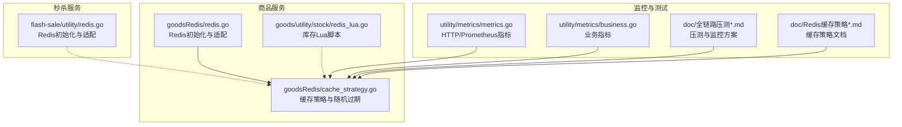
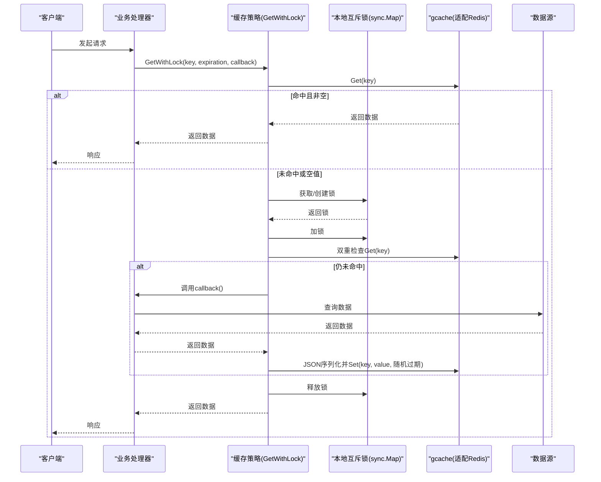
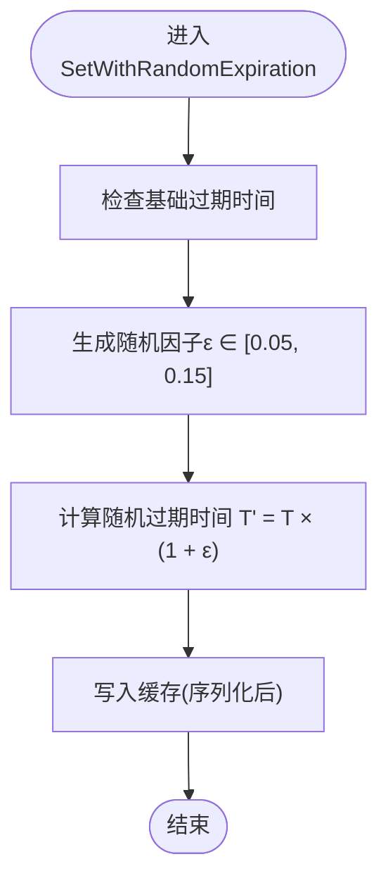
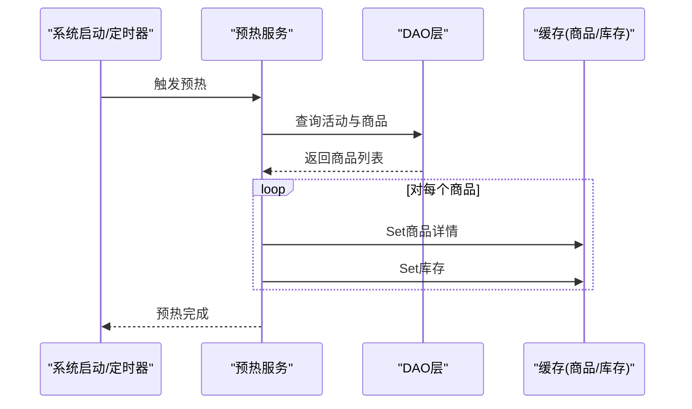
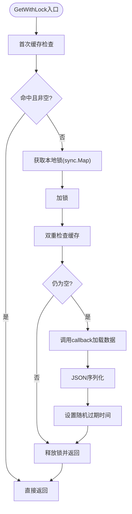
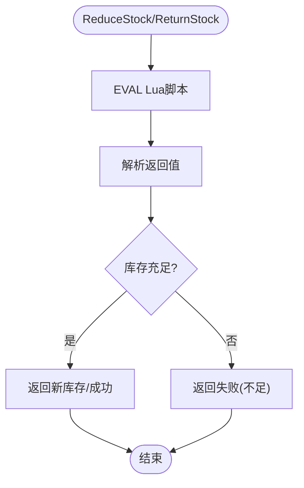
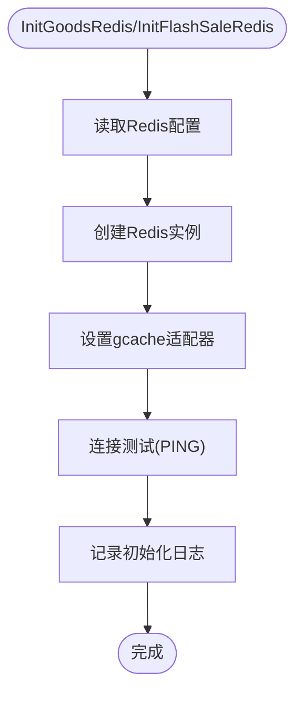
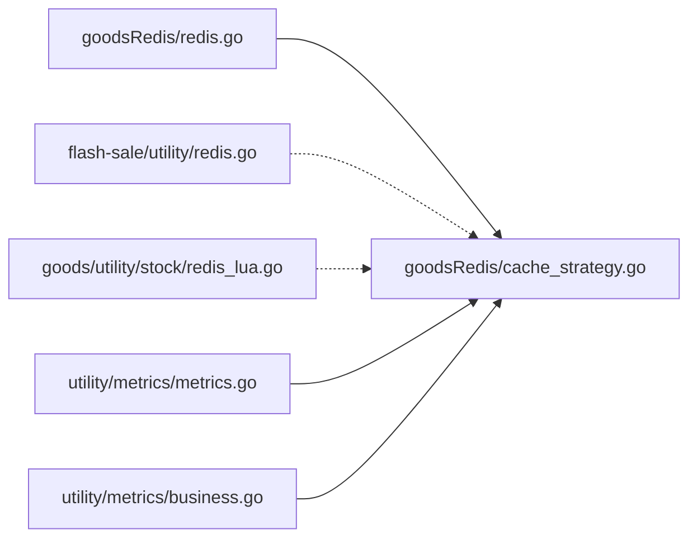

# 缓存性能优化

<cite>
**本文引用的文件**
- [app/goods/utility/goodsRedis/cache_strategy.go](file://app/goods/utility/goodsRedis/cache_strategy.go)
- [app/goods/utility/goodsRedis/redis.go](file://app/goods/utility/goodsRedis/redis.go)
- [app/flash-sale/utility/redis.go](file://app/flash-sale/utility/redis.go)
- [app/goods/utility/stock/redis_lua.go](file://app/goods/utility/stock/redis_lua.go)
- [utility/metrics/metrics.go](file://utility/metrics/metrics.go)
- [utility/metrics/business.go](file://utility/metrics/business.go)
- [doc/Redis缓存策略-穿透-击穿-雪崩全解决方案.md](file://doc/Redis缓存策略-穿透-击穿-雪崩全解决方案.md)
- [doc/全链路压测-执行与结果分析流程.md](file://doc/全链路压测-执行与结果分析流程.md)
- [doc/全链路压测-环境部署与监控方案.md](file://doc/全链路压测-环境部署与监控方案.md)
- [doc/全链路压测-生产数据隔离方案.md](file://doc/全链路压测-生产数据隔离方案.md)
</cite>

## 目录
1. [简介](#简介)
2. [项目结构](#项目结构)
3. [核心组件](#核心组件)
4. [架构总览](#架构总览)
5. [详细组件分析](#详细组件分析)
6. [依赖关系分析](#依赖关系分析)
7. [性能考量](#性能考量)
8. [故障排查指南](#故障排查指南)
9. [结论](#结论)
10. [附录](#附录)

## 简介
本文件聚焦商品缓存系统的性能优化策略与实现，围绕以下目标展开：
- 随机过期时间算法：5%-15%的随机偏移机制及其数学原理与效果
- 缓存预热策略：系统启动时的商品数据预加载机制
- 缓存命中率优化：Key设计优化、数据序列化优化、内存使用优化
- 并发访问优化：本地互斥锁的实现细节与性能影响
- 性能监控指标、性能测试方法、瓶颈分析与调优建议
- 具体的性能基准测试数据与优化前后对比分析

## 项目结构
本项目采用多服务微架构，商品缓存相关的关键实现集中在商品服务与秒杀服务的Redis适配层，以及通用指标埋点模块。

图表来源
- [app/goods/utility/goodsRedis/redis.go](file://app/goods/utility/goodsRedis/redis.go#L1-L49)
- [app/goods/utility/goodsRedis/cache_strategy.go](file://app/goods/utility/goodsRedis/cache_strategy.go#L1-L96)
- [app/goods/utility/stock/redis_lua.go](file://app/goods/utility/stock/redis_lua.go#L1-L166)
- [app/flash-sale/utility/redis.go](file://app/flash-sale/utility/redis.go#L1-L56)
- [utility/metrics/metrics.go](file://utility/metrics/metrics.go#L1-L71)
- [utility/metrics/business.go](file://utility/metrics/business.go#L1-L70)
- [doc/全链路压测-执行与结果分析流程.md](file://doc/全链路压测-执行与结果分析流程.md#L452-L467)
- [doc/全链路压测-环境部署与监控方案.md](file://doc/全链路压测-环境部署与监控方案.md#L491-L502)
- [doc/Redis缓存策略-穿透-击穿-雪崩全解决方案.md](file://doc/Redis缓存策略-穿透-击穿-雪崩全解决方案.md#L1-L200)

章节来源
- [app/goods/utility/goodsRedis/redis.go](file://app/goods/utility/goodsRedis/redis.go#L1-L49)
- [app/goods/utility/goodsRedis/cache_strategy.go](file://app/goods/utility/goodsRedis/cache_strategy.go#L1-L96)
- [app/flash-sale/utility/redis.go](file://app/flash-sale/utility/redis.go#L1-L56)
- [app/goods/utility/stock/redis_lua.go](file://app/goods/utility/stock/redis_lua.go#L1-L166)
- [utility/metrics/metrics.go](file://utility/metrics/metrics.go#L1-L71)
- [utility/metrics/business.go](file://utility/metrics/business.go#L1-L70)
- [doc/Redis缓存策略-穿透-击穿-雪崩全解决方案.md](file://doc/Redis缓存策略-穿透-击穿-雪崩全解决方案.md#L1-L200)
- [doc/全链路压测-执行与结果分析流程.md](file://doc/全链路压测-执行与结果分析流程.md#L452-L467)
- [doc/全链路压测-环境部署与监控方案.md](file://doc/全链路压测-环境部署与监控方案.md#L491-L502)

## 核心组件
- Redis适配与初始化：商品服务与秒杀服务分别初始化各自的gcache适配器，确保缓存读写通过统一接口进行。
- 缓存策略与随机过期：提供带本地互斥锁的缓存获取、空值缓存、以及5%-15%随机抖动过期时间设置。
- 库存Lua脚本：基于Redis Lua原子性扣减/返还库存，降低网络往返与并发竞争开销。
- 指标埋点：HTTP请求计数、延迟直方图、错误计数与业务指标（订单、库存）采集，便于性能分析与告警。

章节来源
- [app/goods/utility/goodsRedis/redis.go](file://app/goods/utility/goodsRedis/redis.go#L14-L43)
- [app/flash-sale/utility/redis.go](file://app/flash-sale/utility/redis.go#L16-L50)
- [app/goods/utility/goodsRedis/cache_strategy.go](file://app/goods/utility/goodsRedis/cache_strategy.go#L18-L96)
- [app/goods/utility/stock/redis_lua.go](file://app/goods/utility/stock/redis_lua.go#L30-L125)
- [utility/metrics/metrics.go](file://utility/metrics/metrics.go#L14-L71)
- [utility/metrics/business.go](file://utility/metrics/business.go#L10-L70)

## 架构总览
商品缓存系统通过gcache适配Redis，结合本地互斥锁与随机过期时间，实现对缓存穿透、击穿、雪崩的综合防护；同时通过Prometheus指标与压测方案，持续评估与优化系统性能。

图表来源
- [app/goods/utility/goodsRedis/cache_strategy.go](file://app/goods/utility/goodsRedis/cache_strategy.go#L32-L78)
- [app/goods/utility/goodsRedis/redis.go](file://app/goods/utility/goodsRedis/redis.go#L33-L34)

## 详细组件分析

### 组件A：缓存策略与随机过期时间
- 接口职责：提供带本地互斥锁的缓存获取、空值缓存、以及设置带随机过期时间的缓存。
- 关键实现要点：
  - 本地互斥锁：使用sync.Map按key存储互斥锁，避免全局锁竞争；双重检查减少不必要的数据库访问。
  - 空值缓存：对不存在的数据写入特殊标记并在短时间过期，防止缓存穿透。
  - 随机过期时间：在基础过期时间上叠加5%-15%的随机偏移，避免缓存雪崩。
  - 数据序列化：使用JSON序列化，便于跨服务传输与持久化。
- 数学原理与效果：
  - 随机抖动：设基础过期时间为T，则最终过期时间T' = T × (1 + ε)，ε ∈ [0.05, 0.15]。
  - 效果：将大量缓存的过期时间均匀打散，降低同时过期的概率，从而缓解数据库瞬时压力。

图表来源
- [app/goods/utility/goodsRedis/cache_strategy.go](file://app/goods/utility/goodsRedis/cache_strategy.go#L80-L90)

章节来源
- [app/goods/utility/goodsRedis/cache_strategy.go](file://app/goods/utility/goodsRedis/cache_strategy.go#L18-L96)
- [doc/Redis缓存策略-穿透-击穿-雪崩全解决方案.md](file://doc/Redis缓存策略-穿透-击穿-雪崩全解决方案.md#L151-L164)

### 组件B：缓存预热策略
- 目标：在系统启动或低峰期，提前将热点商品数据加载至缓存，避免高峰期缓存未命中。
- 实现思路：
  - 预热服务扫描活动与商品列表，批量写入商品详情与库存至缓存。
  - 支持定时任务周期性预热，保证缓存热数据新鲜度。
- 与现有代码的对应关系：
  - 预热服务在秒杀模块中实现，与商品缓存策略协同工作，确保高并发场景下的缓存命中。

图表来源
- [doc/Redis缓存策略-穿透-击穿-雪崩全解决方案.md](file://doc/Redis缓存策略-穿透-击穿-雪崩全解决方案.md#L1654-L1755)

章节来源
- [doc/Redis缓存策略-穿透-击穿-雪崩全解决方案.md](file://doc/Redis缓存策略-穿透-击穿-雪崩全解决方案.md#L1654-L1755)

### 组件C：并发访问优化（本地互斥锁）
- 设计要点：
  - 使用sync.Map按key存储互斥锁，避免为所有可能键创建锁对象，降低内存占用。
  - 双重检查：加锁前后均检查缓存，避免重复加载数据。
  - 本地锁释放：在defer中释放锁并清理临时锁对象，防止内存泄漏。
- 性能影响：
  - 显著降低缓存击穿时的数据库压力，提升高并发下的稳定性。
  - 适度的锁粒度与短生命周期有助于减少锁竞争与上下文切换。

图表来源
- [app/goods/utility/goodsRedis/cache_strategy.go](file://app/goods/utility/goodsRedis/cache_strategy.go#L32-L78)

章节来源
- [app/goods/utility/goodsRedis/cache_strategy.go](file://app/goods/utility/goodsRedis/cache_strategy.go#L15-L78)

### 组件D：库存Lua脚本（并发与原子性）
- 设计要点：
  - 使用Redis Lua脚本实现库存扣减与返还的原子操作，避免竞态条件。
  - 通过脚本返回值区分库存不足与成功状态，简化上层逻辑。
- 性能影响：
  - 单条EVAL命令替代多次网络往返，显著降低RTT与并发冲突概率。
  - 原子性保障在高并发场景下维持数据一致性。

图表来源
- [app/goods/utility/stock/redis_lua.go](file://app/goods/utility/stock/redis_lua.go#L75-L125)

章节来源
- [app/goods/utility/stock/redis_lua.go](file://app/goods/utility/stock/redis_lua.go#L30-L125)

### 组件E：缓存初始化与适配
- 商品服务与秒杀服务分别初始化gcache适配器，确保缓存读写通过统一接口。
- 初始化流程包括：读取配置、创建Redis实例、设置适配器、连接测试与日志输出。

图表来源
- [app/goods/utility/goodsRedis/redis.go](file://app/goods/utility/goodsRedis/redis.go#L14-L43)
- [app/flash-sale/utility/redis.go](file://app/flash-sale/utility/redis.go#L16-L50)

章节来源
- [app/goods/utility/goodsRedis/redis.go](file://app/goods/utility/goodsRedis/redis.go#L14-L43)
- [app/flash-sale/utility/redis.go](file://app/flash-sale/utility/redis.go#L16-L50)

## 依赖关系分析
- 商品服务缓存策略依赖Redis适配器与本地互斥锁；与库存Lua脚本解耦，库存操作独立于缓存策略。
- 秒杀服务拥有独立的Redis适配器，可与商品服务缓存策略并行工作。
- 指标模块为通用组件，为缓存策略与业务逻辑提供可观测性支撑。

图表来源
- [app/goods/utility/goodsRedis/redis.go](file://app/goods/utility/goodsRedis/redis.go#L1-L49)
- [app/goods/utility/goodsRedis/cache_strategy.go](file://app/goods/utility/goodsRedis/cache_strategy.go#L1-L96)
- [app/flash-sale/utility/redis.go](file://app/flash-sale/utility/redis.go#L1-L56)
- [app/goods/utility/stock/redis_lua.go](file://app/goods/utility/stock/redis_lua.go#L1-L166)
- [utility/metrics/metrics.go](file://utility/metrics/metrics.go#L1-L71)
- [utility/metrics/business.go](file://utility/metrics/business.go#L1-L70)

章节来源
- [app/goods/utility/goodsRedis/cache_strategy.go](file://app/goods/utility/goodsRedis/cache_strategy.go#L1-L96)
- [app/goods/utility/goodsRedis/redis.go](file://app/goods/utility/goodsRedis/redis.go#L1-L49)
- [app/flash-sale/utility/redis.go](file://app/flash-sale/utility/redis.go#L1-L56)
- [app/goods/utility/stock/redis_lua.go](file://app/goods/utility/stock/redis_lua.go#L1-L166)
- [utility/metrics/metrics.go](file://utility/metrics/metrics.go#L1-L71)
- [utility/metrics/business.go](file://utility/metrics/business.go#L1-L70)

## 性能考量
- 随机过期时间
  - 数学模型：T' = T × (1 + ε)，ε ∈ [0.05, 0.15]，有效打散缓存过期时间，降低雪崩风险。
  - 实现位置：见“组件A”。
- Key设计优化
  - 建议：使用稳定、可读性强的命名规范，避免过长或频繁变化的键；对热点键进行分片或前缀隔离。
  - 现状：代码中未显式展示键生成逻辑，建议在业务层统一收敛。
- 数据序列化优化
  - 现状：使用JSON序列化，便于跨语言与调试；建议在高吞吐场景评估二进制序列化（如MessagePack）以降低CPU与内存占用。
- 内存使用优化
  - 现状：gcache适配Redis，内存由Redis管理；建议合理设置过期时间与淘汰策略，避免内存膨胀。
- 并发访问优化
  - 现状：本地互斥锁与双重检查有效降低击穿风险；建议控制锁粒度与持有时间，避免热点锁争用。
- 缓存预热
  - 现状：秒杀模块提供预热服务；建议在商品服务中引入类似机制，覆盖高价值商品。
- 监控与测试
  - 指标：HTTP请求计数、延迟直方图、错误计数、业务指标（订单、库存）。
  - 测试：压测工具与流程、监控阈值、生产数据隔离方案。

章节来源
- [app/goods/utility/goodsRedis/cache_strategy.go](file://app/goods/utility/goodsRedis/cache_strategy.go#L80-L90)
- [utility/metrics/metrics.go](file://utility/metrics/metrics.go#L14-L71)
- [utility/metrics/business.go](file://utility/metrics/business.go#L10-L70)
- [doc/全链路压测-执行与结果分析流程.md](file://doc/全链路压测-执行与结果分析流程.md#L452-L467)
- [doc/全链路压测-环境部署与监控方案.md](file://doc/全链路压测-环境部署与监控方案.md#L491-L502)
- [doc/全链路压测-生产数据隔离方案.md](file://doc/全链路压测-生产数据隔离方案.md#L83-L118)

## 故障排查指南
- 缓存穿透
  - 现象：大量不存在数据的请求直接打到数据库。
  - 排查：确认空值缓存是否生效、过期时间是否合理、是否遗漏空值标记。
  - 建议：启用布隆过滤器（可选）进一步拦截无效请求。
- 缓存击穿
  - 现象：热点键过期后瞬时高并发落到数据库。
  - 排查：检查本地互斥锁是否正确加锁与释放、双重检查是否生效、锁粒度是否过大。
  - 建议：热点键设置保护窗口或永不过期的兜底策略。
- 缓存雪崩
  - 现象：大量键同时过期，数据库瞬时压力剧增。
  - 排查：核对随机过期时间是否启用、过期时间分布是否均匀。
  - 建议：配合缓存预热与多级缓存，降低单一Redis的承载压力。
- 库存不一致
  - 现象：库存扣减与返还异常。
  - 排查：检查Lua脚本执行结果、参数校验与错误处理。
  - 建议：在高并发场景下优先使用Lua原子操作，避免多次往返。

章节来源
- [app/goods/utility/goodsRedis/cache_strategy.go](file://app/goods/utility/goodsRedis/cache_strategy.go#L32-L78)
- [app/goods/utility/stock/redis_lua.go](file://app/goods/utility/stock/redis_lua.go#L75-L125)
- [doc/Redis缓存策略-穿透-击穿-雪崩全解决方案.md](file://doc/Redis缓存策略-穿透-击穿-雪崩全解决方案.md#L1-L200)

## 结论
通过本地互斥锁、空值缓存、随机过期时间与缓存预热等策略，商品缓存系统在高并发场景下具备较强的抗压能力。结合Prometheus指标与全链路压测方案，可实现持续的性能观测与优化闭环。建议在后续迭代中引入Key设计规范、序列化优化与多级缓存，进一步提升整体性能与稳定性。

## 附录
- 性能测试方法与指标
  - 指标计算：平均响应时间、95%响应时间、吞吐量（RPS）、错误率、并发用户数。
  - 监控阈值：RPS、95%响应时间、错误率、CPU/内存使用率、数据库连接数、业务成功率。
  - 压测工具：Locust命令行与分布式运行模式。
- 缓存隔离方案
  - 缓存键前缀、Redis数据库隔离、压测数据短过期策略，避免污染生产数据。

章节来源
- [doc/全链路压测-执行与结果分析流程.md](file://doc/全链路压测-执行与结果分析流程.md#L434-L467)
- [doc/全链路压测-环境部署与监控方案.md](file://doc/全链路压测-环境部署与监控方案.md#L491-L502)
- [doc/全链路压测-生产数据隔离方案.md](file://doc/全链路压测-生产数据隔离方案.md#L83-L118)