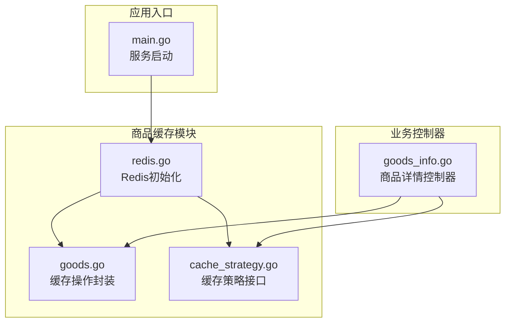
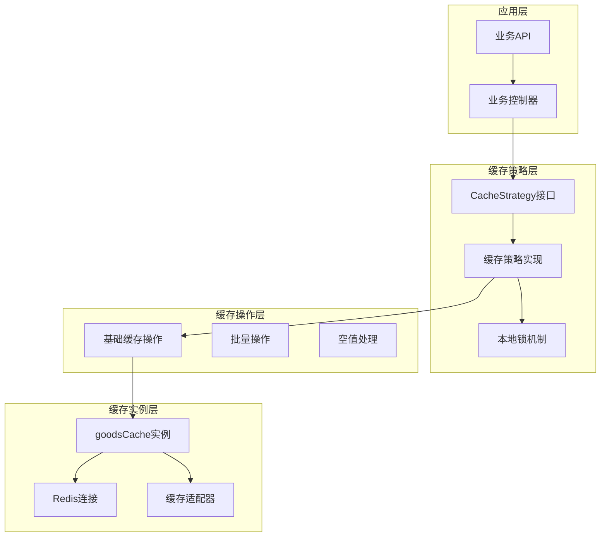
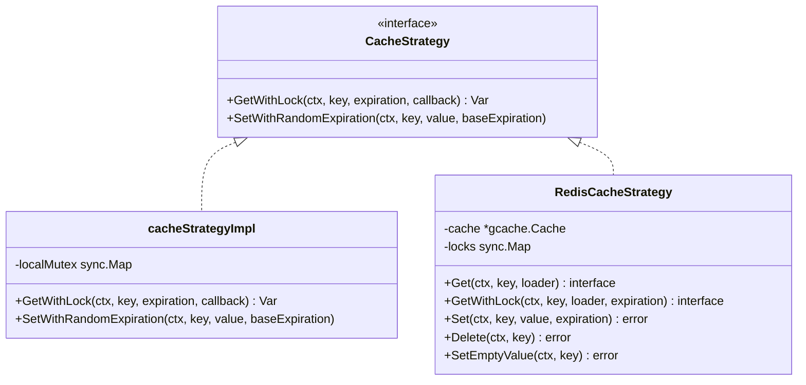
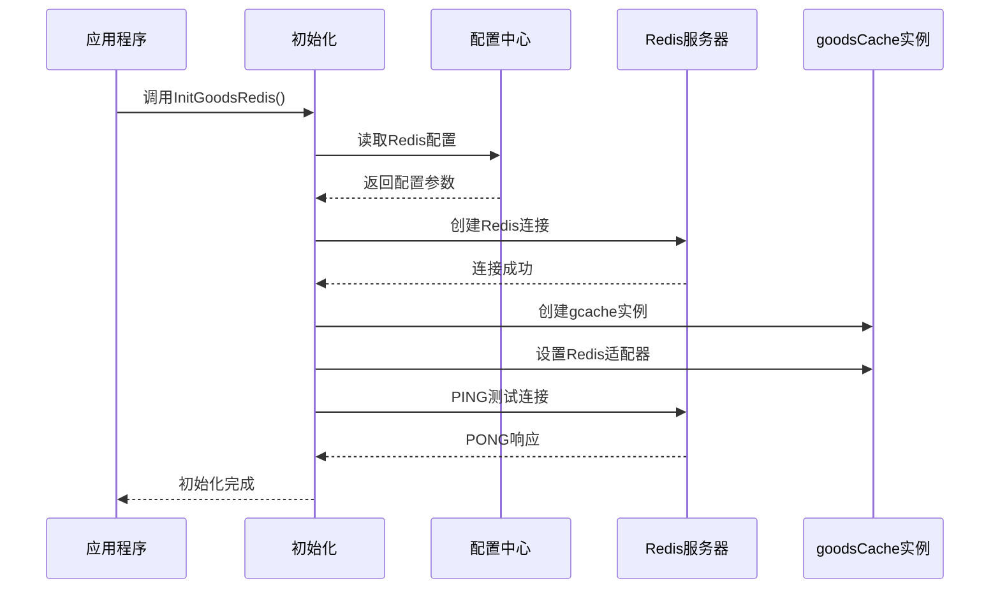
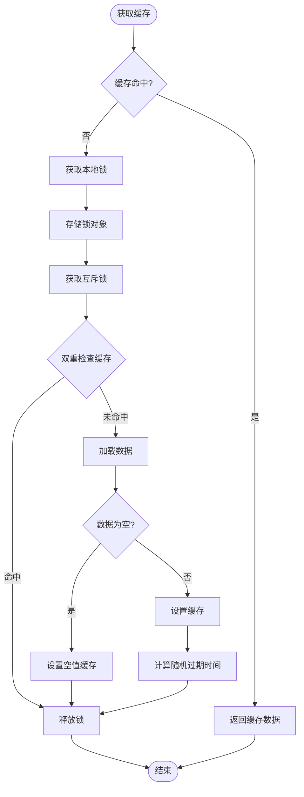
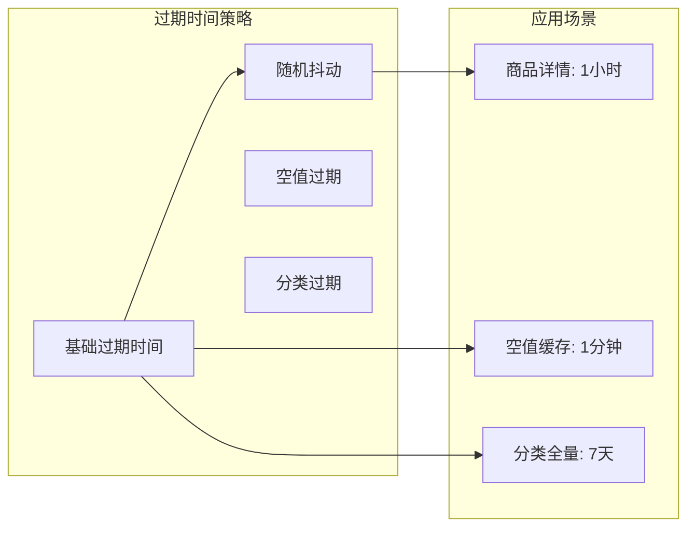
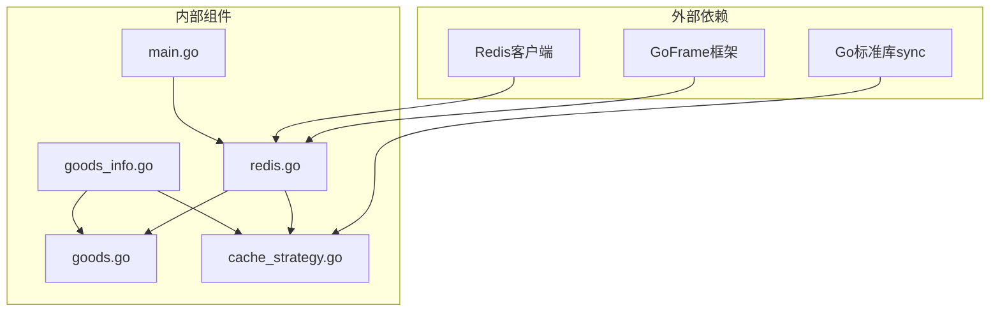
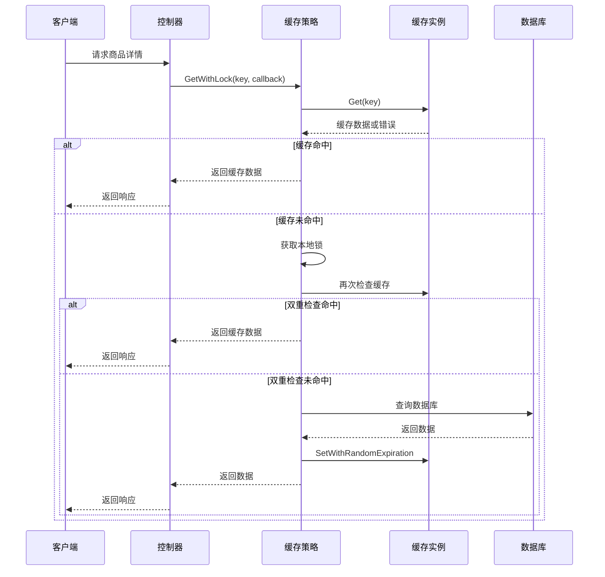

# 缓存架构设计

<cite>
**本文档引用的文件**
- [cache_strategy.go](file://app/goods/utility/goodsRedis/cache_strategy.go)
- [goods.go](file://app/goods/utility/goodsRedis/goods.go)
- [redis.go](file://app/goods/utility/goodsRedis/redis.go)
- [main.go](file://app/goods/main.go)
- [goods_info.go](file://app/goods/internal/controller/goods_info/goods_info.go)
- [Redis缓存策略-穿透-击穿-雪崩全解决方案.md](file://doc/Redis缓存策略-穿透-击穿-雪崩全解决方案.md)
</cite>

## 目录
1. [简介](#简介)
2. [项目结构](#项目结构)
3. [核心组件](#核心组件)
4. [架构概览](#架构概览)
5. [详细组件分析](#详细组件分析)
6. [依赖关系分析](#依赖关系分析)
7. [性能考量](#性能考量)
8. [故障排查指南](#故障排查指南)
9. [结论](#结论)

## 简介
本文件详细阐述了商品缓存的整体架构设计，包括缓存层次结构、缓存组件划分、缓存策略接口设计。重点说明了CacheStrategy接口的定义和实现，包括GetWithLock和SetWithRandomExpiration方法的设计原理；解释了缓存架构中的关键组件：goodsCache实例、localMutex本地锁机制、缓存过期时间管理；阐述了缓存架构如何支持高并发场景下的数据访问，以及如何通过接口抽象实现缓存策略的可扩展性。最后提供了缓存架构图和组件交互示例。

## 项目结构
商品缓存相关的核心文件位于app/goods/utility/goodsRedis目录下，采用按功能模块划分的方式组织代码：

**图表来源**
- [redis.go](file://app/goods/utility/goodsRedis/redis.go#L1-L49)
- [goods.go](file://app/goods/utility/goodsRedis/goods.go#L1-L121)
- [cache_strategy.go](file://app/goods/utility/goodsRedis/cache_strategy.go#L1-L96)
- [main.go](file://app/goods/main.go#L1-L35)

**章节来源**
- [redis.go](file://app/goods/utility/goodsRedis/redis.go#L1-L49)
- [goods.go](file://app/goods/utility/goodsRedis/goods.go#L1-L121)
- [cache_strategy.go](file://app/goods/utility/goodsRedis/cache_strategy.go#L1-L96)

## 核心组件
商品缓存架构由三个核心组件构成：

### 1. 缓存实例层
- **goodsCache**: 全局Redis缓存实例，基于GoFrame的gcache框架
- **Redis适配器**: 将gcache与具体Redis实现解耦
- **连接池管理**: 自动化的Redis连接管理和健康检查

### 2. 缓存操作层
- **基础缓存操作**: Get、Set、Delete等基本CRUD操作
- **批量操作**: 支持批量删除和批量查询
- **空值处理**: 统一的空值缓存标记机制

### 3. 缓存策略层
- **CacheStrategy接口**: 定义缓存策略的标准接口
- **GetWithLock方法**: 防缓存击穿的分布式锁机制
- **SetWithRandomExpiration方法**: 防缓存雪崩的随机过期时间

**章节来源**
- [redis.go](file://app/goods/utility/goodsRedis/redis.go#L11-L48)
- [goods.go](file://app/goods/utility/goodsRedis/goods.go#L12-L16)
- [cache_strategy.go](file://app/goods/utility/goodsRedis/cache_strategy.go#L18-L30)

## 架构概览
商品缓存架构采用三层设计模式，每层职责明确且相互独立：

**图表来源**
- [cache_strategy.go](file://app/goods/utility/goodsRedis/cache_strategy.go#L18-L30)
- [goods.go](file://app/goods/utility/goodsRedis/goods.go#L25-L36)
- [redis.go](file://app/goods/utility/goodsRedis/redis.go#L33-L34)

## 详细组件分析

### CacheStrategy接口设计
CacheStrategy接口定义了缓存策略的标准规范，采用接口抽象确保策略的可扩展性和可替换性：

**图表来源**
- [cache_strategy.go](file://app/goods/utility/goodsRedis/cache_strategy.go#L18-L30)
- [cache_strategy.go](file://app/goods/utility/goodsRedis/cache_strategy.go#L24-L30)

#### GetWithLock方法设计原理
GetWithLock方法实现了防缓存击穿的核心机制：

1. **首次缓存检查**: 直接从缓存获取数据
2. **本地锁获取**: 使用sync.Map存储锁对象，键为缓存键
3. **双重检查**: 获取锁后再次检查缓存，防止竞态条件
4. **数据加载**: 通过回调函数从数据库加载数据
5. **空值处理**: 对空数据设置短时间过期的空值标记
6. **缓存设置**: 使用随机过期时间防止缓存雪崩

#### SetWithRandomExpiration方法设计原理
SetWithRandomExpiration方法实现了防缓存雪崩的核心机制：

1. **随机因子计算**: 生成5%-15%的随机时间偏移
2. **过期时间计算**: 基础过期时间 + 随机偏移
3. **缓存设置**: 将计算后的过期时间应用到缓存
4. **错误处理**: 记录设置失败的日志信息

**章节来源**
- [cache_strategy.go](file://app/goods/utility/goodsRedis/cache_strategy.go#L32-L78)
- [cache_strategy.go](file://app/goods/utility/goodsRedis/cache_strategy.go#L80-L90)

### goodsCache实例设计
goodsCache是整个缓存架构的核心实例，采用全局单例模式：

**图表来源**
- [redis.go](file://app/goods/utility/goodsRedis/redis.go#L14-L42)

#### 缓存实例特性
- **全局唯一**: 整个应用生命周期内只有一个实例
- **适配器模式**: 通过gcache.NewAdapterRedis实现与具体Redis实现解耦
- **连接管理**: 自动化的连接池管理和健康检查
- **配置驱动**: 通过配置中心动态获取Redis连接参数

**章节来源**
- [redis.go](file://app/goods/utility/goodsRedis/redis.go#L11-L48)

### localMutex本地锁机制
localMutex采用了sync.Map实现的高性能本地锁机制：

**图表来源**
- [cache_strategy.go](file://app/goods/utility/goodsRedis/cache_strategy.go#L32-L78)

#### 锁机制设计要点
- **锁存储**: 使用sync.Map存储锁对象，键为"mutex:{key}"格式
- **延迟删除**: 在defer语句中删除锁对象，避免内存泄漏
- **双重检查**: 防止在获取锁期间其他协程已经加载了缓存
- **并发安全**: 确保同一时间只有一个请求会去查询数据库

**章节来源**
- [cache_strategy.go](file://app/goods/utility/goodsRedis/cache_strategy.go#L15-L16)
- [cache_strategy.go](file://app/goods/utility/goodsRedis/cache_strategy.go#L40-L47)

### 缓存过期时间管理
缓存过期时间管理采用了多层次的策略：

**图表来源**
- [goods.go](file://app/goods/utility/goodsRedis/goods.go#L26-L36)
- [goods.go](file://app/goods/utility/goodsRedis/goods.go#L61-L71)

#### 过期时间策略
- **商品详情**: 1小时标准过期时间 + 5%-15%随机抖动
- **空值缓存**: 1分钟短时间过期，防止缓存穿透
- **分类全量**: 7天长时间过期，适合静态数据
- **随机抖动**: 避免缓存雪崩效应

**章节来源**
- [goods.go](file://app/goods/utility/goodsRedis/goods.go#L12-L16)
- [cache_strategy.go](file://app/goods/utility/goodsRedis/cache_strategy.go#L81-L89)

## 依赖关系分析

### 组件依赖关系

**图表来源**
- [main.go](file://app/goods/main.go#L12-L26)
- [redis.go](file://app/goods/utility/goodsRedis/redis.go#L3-L9)
- [cache_strategy.go](file://app/goods/utility/goodsRedis/cache_strategy.go#L3-L13)

### 控制流分析
缓存架构的典型控制流程如下：

**图表来源**
- [goods_info.go](file://app/goods/internal/controller/goods_info/goods_info.go#L94-L158)
- [cache_strategy.go](file://app/goods/utility/goodsRedis/cache_strategy.go#L32-L78)

**章节来源**
- [goods_info.go](file://app/goods/internal/controller/goods_info/goods_info.go#L94-L158)
- [cache_strategy.go](file://app/goods/utility/goodsRedis/cache_strategy.go#L32-L78)

## 性能考量
缓存架构在设计时充分考虑了性能优化：

### 并发性能优化
- **本地锁优化**: 使用sync.Map替代传统互斥锁数组，减少锁竞争
- **双重检查**: 避免不必要的数据库查询，提高缓存命中率
- **异步设置**: 缓存设置采用超时上下文，避免阻塞主业务流程

### 内存使用优化
- **锁对象复用**: 通过sync.Map实现锁对象的动态创建和回收
- **空值缓存**: 使用短时间过期的空值标记，避免存储大量无效数据
- **批量操作**: 支持批量删除和批量查询，减少网络往返次数

### 网络性能优化
- **连接池**: Redis连接自动管理，避免频繁建立连接的开销
- **适配器模式**: 通过gcache适配器实现与具体Redis实现的解耦
- **超时控制**: 所有缓存操作都支持超时控制，避免长时间阻塞

## 故障排查指南

### 常见问题诊断
1. **缓存击穿问题**
   - 症状: 热点数据过期时数据库压力激增
   - 排查: 检查GetWithLock方法的锁机制是否正常工作
   - 解决: 确认本地锁的双重检查逻辑

2. **缓存穿透问题**
   - 症状: 大量不存在的数据请求直接打到数据库
   - 排查: 检查空值缓存的设置和过期时间
   - 解决: 确认空值缓存标记的正确使用

3. **缓存雪崩问题**
   - 症状: 大量缓存同时过期导致数据库压力骤增
   - 排查: 检查随机过期时间的计算逻辑
   - 解决: 确认SetWithRandomExpiration方法的实现

### 监控指标
- 缓存命中率: 监控GetWithLock的成功率
- 锁等待时间: 监控本地锁的平均等待时间
- 缓存过期率: 监控随机过期时间的效果
- 错误率: 监控缓存操作的错误发生频率

**章节来源**
- [cache_strategy.go](file://app/goods/utility/goodsRedis/cache_strategy.go#L87-L89)
- [goods.go](file://app/goods/utility/goodsRedis/goods.go#L113-L117)

## 结论
本缓存架构设计通过三层分离的架构模式，实现了高并发场景下的稳定缓存服务。核心优势包括：

1. **接口抽象**: CacheStrategy接口提供了清晰的策略抽象，便于扩展和替换
2. **并发安全**: 通过本地锁机制有效防止缓存击穿
3. **性能优化**: 随机过期时间设计有效防止缓存雪崩
4. **错误处理**: 完善的空值缓存机制防止缓存穿透
5. **可维护性**: 模块化设计便于代码维护和功能扩展

该架构为商品服务提供了可靠的缓存基础设施，能够有效支撑高并发场景下的数据访问需求，同时具备良好的可扩展性和可维护性。