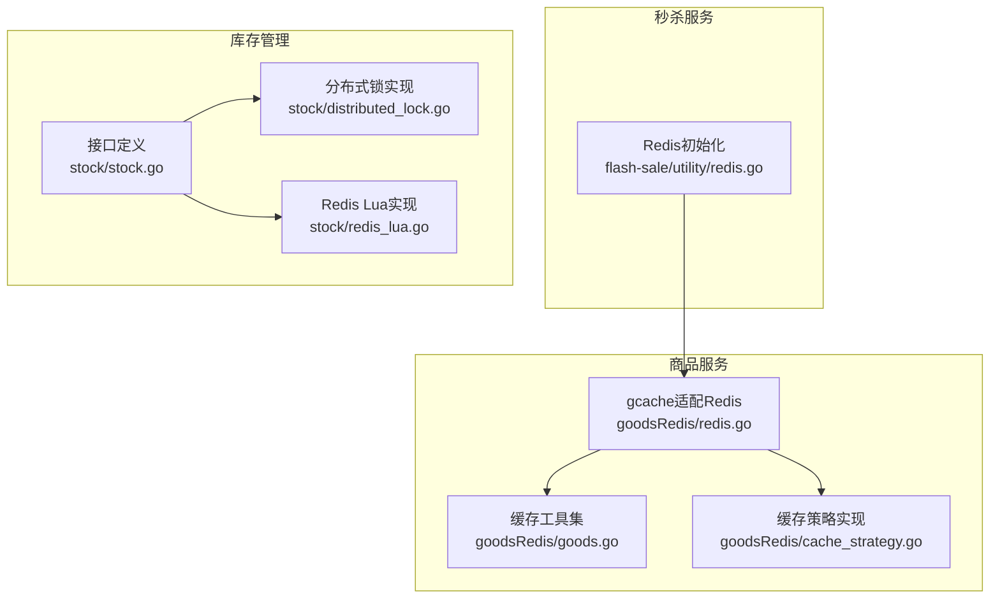
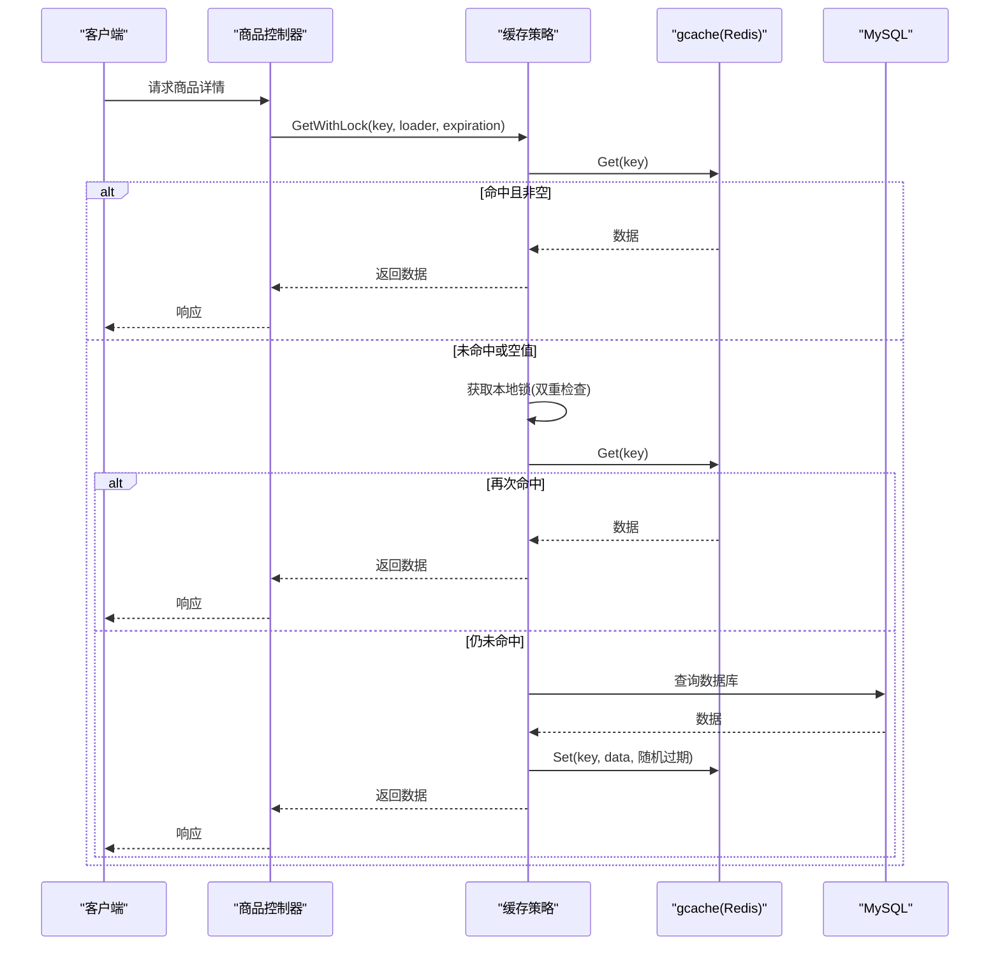
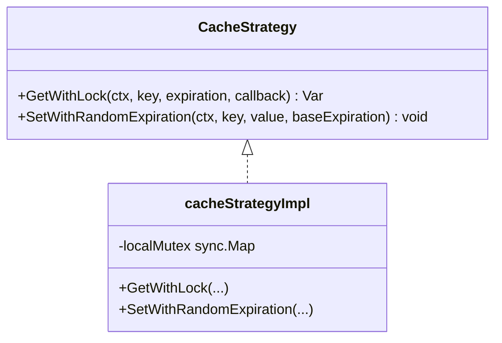
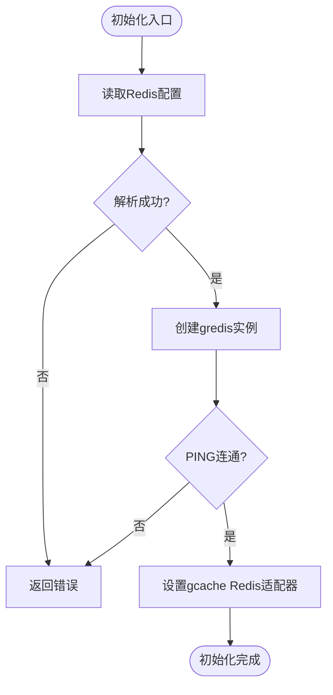
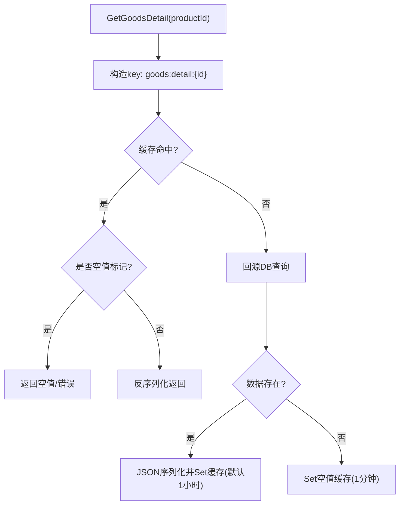
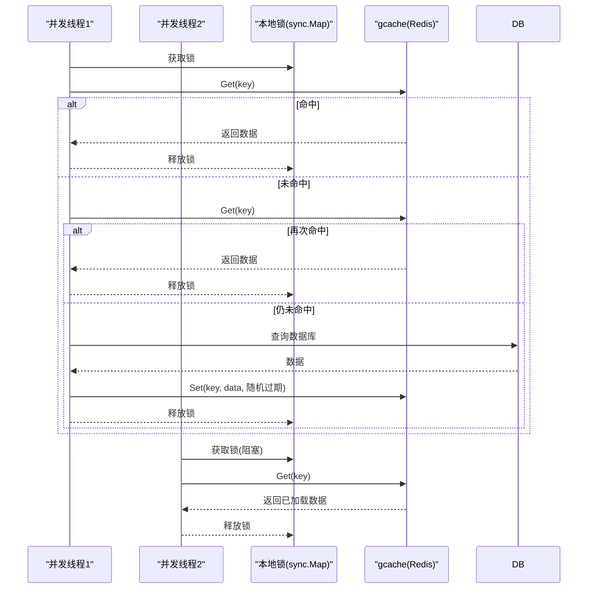
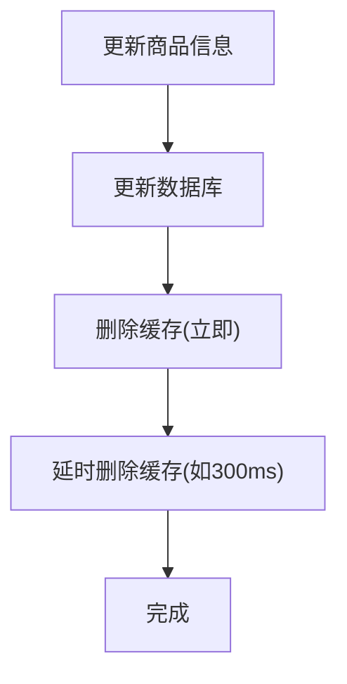
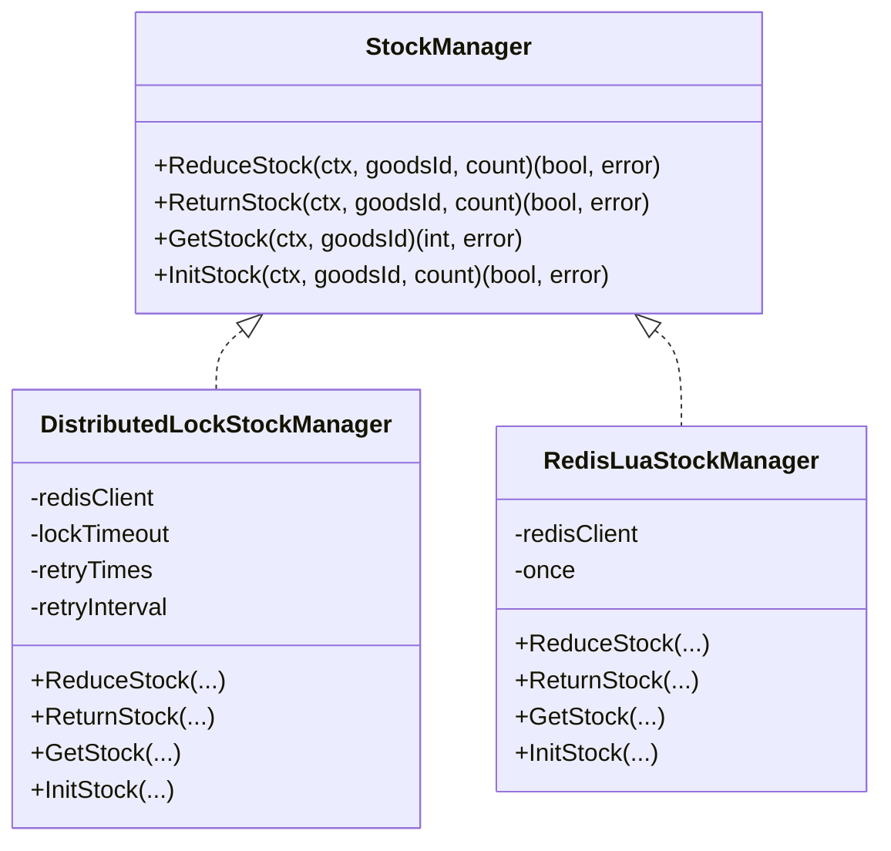
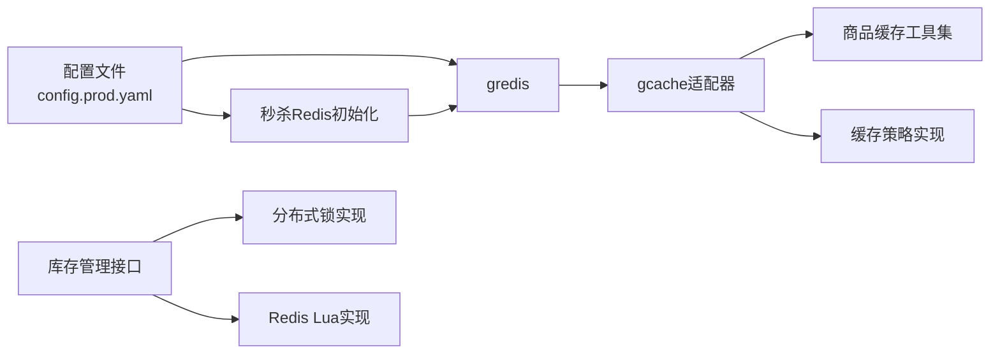

# 缓存策略设计

<cite>
**本文引用的文件**
- [cache_strategy.go](file://app/goods/utility/goodsRedis/cache_strategy.go)
- [redis.go](file://app/goods/utility/goodsRedis/redis.go)
- [goods.go](file://app/goods/utility/goodsRedis/goods.go)
- [config.prod.yaml](file://app/goods/manifest/config/config.prod.yaml)
- [redis.go](file://app/flash-sale/utility/redis.go)
- [Redis缓存策略-穿透-击穿-雪崩全解决方案.md](file://doc/Redis缓存策略-穿透-击穿-雪崩全解决方案.md)
- [distributed_lock.go](file://app/goods/utility/stock/distributed_lock.go)
- [redis_lua.go](file://app/goods/utility/stock/redis_lua.go)
- [stock.go](file://app/goods/utility/stock/stock.go)
</cite>

## 目录
1. [引言](#引言)
2. [项目结构](#项目结构)
3. [核心组件](#核心组件)
4. [架构总览](#架构总览)
5. [详细组件分析](#详细组件分析)
6. [依赖关系分析](#依赖关系分析)
7. [性能考量](#性能考量)
8. [故障排查指南](#故障排查指南)
9. [结论](#结论)
10. [附录](#附录)

## 引言
本文件围绕商品信息缓存架构，系统化阐述缓存穿透、缓存击穿、缓存雪崩的完整防护方案，覆盖Redis缓存结构设计、Key命名规范、过期时间策略、缓存更新机制、多级缓存协同、缓存预热、一致性保障、性能监控与故障排查等主题。文档以代码为依据，辅以图示与最佳实践，帮助读者在微服务场景中落地可运维、高性能、高可靠的缓存体系。

## 项目结构
本项目采用GoFrame框架，商品服务通过gcache适配Redis实现分布式缓存；秒杀服务复用商品Redis配置或回退至商品Redis；库存管理提供分布式锁与Redis Lua两种实现路径，二者均与缓存策略相辅相成。

**图表来源**
- [redis.go](file://app/goods/utility/goodsRedis/redis.go#L1-L48)
- [goods.go](file://app/goods/utility/goodsRedis/goods.go#L1-L121)
- [cache_strategy.go](file://app/goods/utility/goodsRedis/cache_strategy.go#L1-L96)
- [redis.go](file://app/flash-sale/utility/redis.go#L1-L56)
- [stock.go](file://app/goods/utility/stock/stock.go#L1-L32)
- [distributed_lock.go](file://app/goods/utility/stock/distributed_lock.go#L1-L266)
- [redis_lua.go](file://app/goods/utility/stock/redis_lua.go#L1-L166)

**章节来源**
- [redis.go](file://app/goods/utility/goodsRedis/redis.go#L1-L48)
- [goods.go](file://app/goods/utility/goodsRedis/goods.go#L1-L121)
- [cache_strategy.go](file://app/goods/utility/goodsRedis/cache_strategy.go#L1-L96)
- [redis.go](file://app/flash-sale/utility/redis.go#L1-L56)
- [stock.go](file://app/goods/utility/stock/stock.go#L1-L32)
- [distributed_lock.go](file://app/goods/utility/stock/distributed_lock.go#L1-L266)
- [redis_lua.go](file://app/goods/utility/stock/redis_lua.go#L1-L166)

## 核心组件
- 分布式缓存适配层：基于gcache的Redis适配器，统一缓存读写入口。
- 缓存工具集：封装商品详情、分类全量数据的缓存读写与批量删除。
- 缓存策略实现：提供带本地锁的击穿防护、带随机过期抖动的雪崩防护、空值缓存穿透防护。
- 秒杀Redis初始化：支持独立配置或回退到商品Redis配置。
- 库存管理：提供分布式锁与Redis Lua两种实现，保障高并发下的库存一致性。

**章节来源**
- [redis.go](file://app/goods/utility/goodsRedis/redis.go#L1-L48)
- [goods.go](file://app/goods/utility/goodsRedis/goods.go#L1-L121)
- [cache_strategy.go](file://app/goods/utility/goodsRedis/cache_strategy.go#L1-L96)
- [redis.go](file://app/flash-sale/utility/redis.go#L1-L56)
- [stock.go](file://app/goods/utility/stock/stock.go#L1-L32)

## 架构总览
商品服务通过gcache适配Redis，控制器优先从缓存读取，未命中再回源数据库；缓存策略在高并发下通过本地锁避免击穿，通过随机过期抖动缓解雪崩，通过空值缓存阻断穿透；秒杀服务共享或复用Redis配置；库存管理与缓存策略共同保障一致性。

**图表来源**
- [cache_strategy.go](file://app/goods/utility/goodsRedis/cache_strategy.go#L32-L78)
- [goods.go](file://app/goods/utility/goodsRedis/goods.go#L38-L52)

**章节来源**
- [cache_strategy.go](file://app/goods/utility/goodsRedis/cache_strategy.go#L32-L78)
- [goods.go](file://app/goods/utility/goodsRedis/goods.go#L38-L52)

## 详细组件分析

### 缓存策略接口与实现
- 接口职责：提供带锁获取、设置随机过期、空值缓存等能力。
- 击穿防护：本地锁+双重检查，避免热点Key过期引发的“羊群效应”。
- 雪崩防护：对过期时间引入5%~15%随机抖动，打散集中过期。
- 穿透防护：空值缓存+短过期，阻断恶意/无效请求对后端的压力。

**图表来源**
- [cache_strategy.go](file://app/goods/utility/goodsRedis/cache_strategy.go#L18-L30)
- [cache_strategy.go](file://app/goods/utility/goodsRedis/cache_strategy.go#L32-L90)

**章节来源**
- [cache_strategy.go](file://app/goods/utility/goodsRedis/cache_strategy.go#L18-L96)

### Redis初始化与适配
- 商品服务Redis初始化：从配置读取连接参数，创建gredis实例并注入gcache适配器，PING连通性校验。
- 秒杀服务Redis初始化：优先读取独立配置，若无则回退到商品Redis配置，确保资源复用与一致性。

**图表来源**
- [redis.go](file://app/goods/utility/goodsRedis/redis.go#L14-L42)
- [redis.go](file://app/flash-sale/utility/redis.go#L16-L49)

**章节来源**
- [redis.go](file://app/goods/utility/goodsRedis/redis.go#L14-L48)
- [redis.go](file://app/flash-sale/utility/redis.go#L16-L56)

### 缓存工具集与键管理
- 键命名规范：统一使用“业务模块:数据类型:唯一标识”，如“goods:detail:{id}”、“category:all:data”。
- 空值缓存：对不存在数据设置短过期的空值标记，防止穿透。
- 批量删除：支持批量删除与延迟双删，降低更新窗口内的脏读风险。

**图表来源**
- [goods.go](file://app/goods/utility/goodsRedis/goods.go#L18-L52)

**章节来源**
- [goods.go](file://app/goods/utility/goodsRedis/goods.go#L12-L121)

### 多级缓存与本地锁协同
- 本地锁：以“mutex:key”为键的sync.Map，避免击穿。
- 协同策略：gcache负责远端缓存，本地锁在高并发下保护数据库。
- 适用场景：热点商品详情、限时活动页等高并发读场景。

**图表来源**
- [cache_strategy.go](file://app/goods/utility/goodsRedis/cache_strategy.go#L32-L78)

**章节来源**
- [cache_strategy.go](file://app/goods/utility/goodsRedis/cache_strategy.go#L32-L78)

### 缓存更新机制与一致性
- 延迟双删：更新数据库后先删缓存，再延时二次删除，降低竞态窗口。
- 过期兜底：即便短暂不一致，过期时间也能保证最终一致性。
- 与库存管理联动：库存扣减/返还与缓存更新配合，避免超卖与脏数据。

**图表来源**
- [goods.go](file://app/goods/utility/goodsRedis/goods.go#L93-L120)

**章节来源**
- [goods.go](file://app/goods/utility/goodsRedis/goods.go#L93-L121)

### 秒杀服务Redis配置与回退
- 独立配置优先：秒杀服务优先读取自身Redis配置。
- 回退策略：若无独立配置，自动回退到商品服务Redis配置，避免重复连接与资源浪费。

**章节来源**
- [redis.go](file://app/flash-sale/utility/redis.go#L16-L56)

### 库存管理与缓存一致性
- 接口抽象：统一ReduceStock/ReturnStock/GetStock/InitStock接口，便于替换实现。
- 分布式锁：通过SET NX EX与Lua释放脚本，确保原子性与安全性。
- Redis Lua：单命令事务式扣减/返还，避免多指令往返带来的竞态。

**图表来源**
- [stock.go](file://app/goods/utility/stock/stock.go#L7-L31)
- [distributed_lock.go](file://app/goods/utility/stock/distributed_lock.go#L13-L29)
- [redis_lua.go](file://app/goods/utility/stock/redis_lua.go#L12-L23)

**章节来源**
- [stock.go](file://app/goods/utility/stock/stock.go#L7-L31)
- [distributed_lock.go](file://app/goods/utility/stock/distributed_lock.go#L46-L266)
- [redis_lua.go](file://app/goods/utility/stock/redis_lua.go#L30-L166)

## 依赖关系分析
- 商品服务缓存依赖gcache与gredis，通过配置文件注入。
- 秒杀服务可独立配置，亦可复用商品Redis配置。
- 库存管理与缓存策略共同作用于高并发场景，前者保证原子性，后者保证一致性与性能。

**图表来源**
- [config.prod.yaml](file://app/goods/manifest/config/config.prod.yaml#L23-L32)
- [redis.go](file://app/goods/utility/goodsRedis/redis.go#L14-L42)
- [goods.go](file://app/goods/utility/goodsRedis/goods.go#L1-L121)
- [cache_strategy.go](file://app/goods/utility/goodsRedis/cache_strategy.go#L1-L96)
- [redis.go](file://app/flash-sale/utility/redis.go#L16-L56)
- [stock.go](file://app/goods/utility/stock/stock.go#L7-L31)
- [distributed_lock.go](file://app/goods/utility/stock/distributed_lock.go#L13-L29)
- [redis_lua.go](file://app/goods/utility/stock/redis_lua.go#L12-L23)

**章节来源**
- [config.prod.yaml](file://app/goods/manifest/config/config.prod.yaml#L23-L32)
- [redis.go](file://app/goods/utility/goodsRedis/redis.go#L14-L48)
- [redis.go](file://app/flash-sale/utility/redis.go#L16-L56)
- [goods.go](file://app/goods/utility/goodsRedis/goods.go#L1-L121)
- [cache_strategy.go](file://app/goods/utility/goodsRedis/cache_strategy.go#L1-L96)
- [stock.go](file://app/goods/utility/stock/stock.go#L7-L31)

## 性能考量
- 过期时间策略
  - 常规数据：默认1小时。
  - 空值缓存：短过期（如1分钟）。
  - 热点数据：根据访问频率适当缩短或开启随机抖动。
  - 不常变化数据：可设较长过期（如24小时）。
- 随机抖动：对过期时间引入5%~15%抖动，避免集中过期。
- 缓存预热：在低峰或启动时预热热点Key，降低首波压力。
- 批量操作：合并删除与延迟双删，减少网络往返。
- 连接池：合理配置最大活跃连接、空闲连接与超时参数。

**章节来源**
- [Redis缓存策略-穿透-击穿-雪崩全解决方案.md](file://doc/Redis缓存策略-穿透-击穿-雪崩全解决方案.md#L537-L553)
- [cache_strategy.go](file://app/goods/utility/goodsRedis/cache_strategy.go#L80-L90)
- [goods.go](file://app/goods/utility/goodsRedis/goods.go#L18-L36)

## 故障排查指南
- 缓存命中率低
  - 检查Key命名是否规范、过期时间是否过短。
  - 核对空值缓存是否生效（短过期空值）。
- 缓存更新不及时
  - 确认延迟双删是否执行、延迟时间是否合理。
  - 检查是否遗漏删除或二次删除。
- 内存占用过高
  - 检查是否存在大对象未压缩、缓存未及时过期。
- 性能抖动
  - 观察是否存在热点Key未加本地锁或未启用随机抖动。
- Redis不可用
  - 降级策略：缓存失败时回源数据库，记录日志并报警。
  - 连接池参数：检查最大活跃连接、空闲连接与超时配置。

**章节来源**
- [Redis缓存策略-穿透-击穿-雪崩全解决方案.md](file://doc/Redis缓存策略-穿透-击穿-雪崩全解决方案.md#L566-L572)
- [redis.go](file://app/goods/utility/goodsRedis/redis.go#L36-L42)
- [goods.go](file://app/goods/utility/goodsRedis/goods.go#L93-L121)

## 结论
本缓存策略设计以“穿透-击穿-雪崩”三类问题为核心，结合本地锁、空值缓存、随机过期抖动与延迟双删等手段，形成可落地、可运维的完整方案。通过统一的接口与清晰的键规范，配合秒杀与库存管理的协同，可在高并发场景下显著提升系统稳定性与性能。

## 附录

### 缓存Key命名规范
- 格式：{业务模块}:{数据类型}:{唯一标识}
- 示例：goods:detail:{id}、category:all:data
- 建议：使用冒号分隔，便于检索与管理。

**章节来源**
- [Redis缓存策略-穿透-击穿-雪崩全解决方案.md](file://doc/Redis缓存策略-穿透-击穿-雪崩全解决方案.md#L529-L536)

### 配置参数参考
- 商品服务Redis连接参数（示例）
  - 地址：redis:6379
  - DB：1
  - 密码：空
  - 空闲超时：600s
  - 最大活跃连接：50
  - 空闲连接：10
  - 连接超时：5s

**章节来源**
- [config.prod.yaml](file://app/goods/manifest/config/config.prod.yaml#L23-L32)