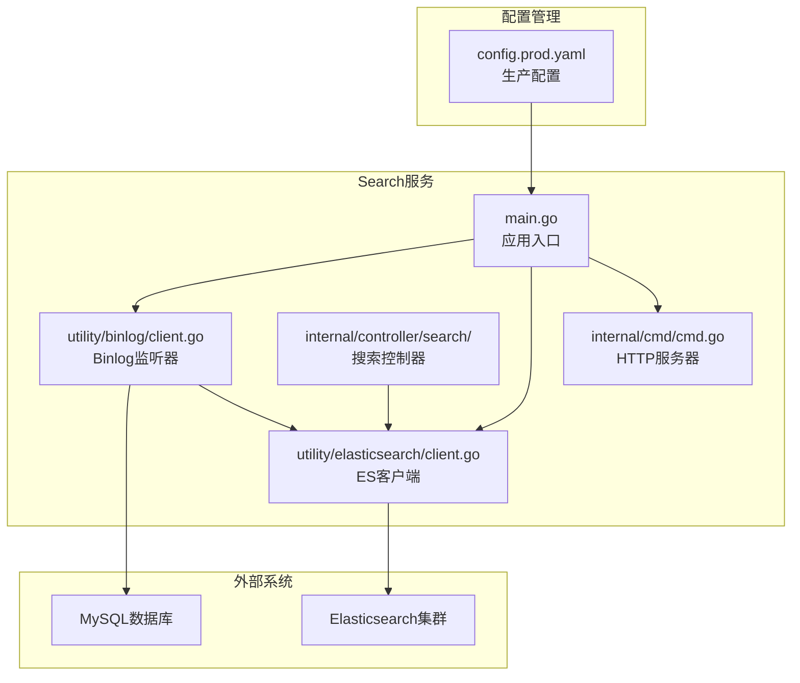
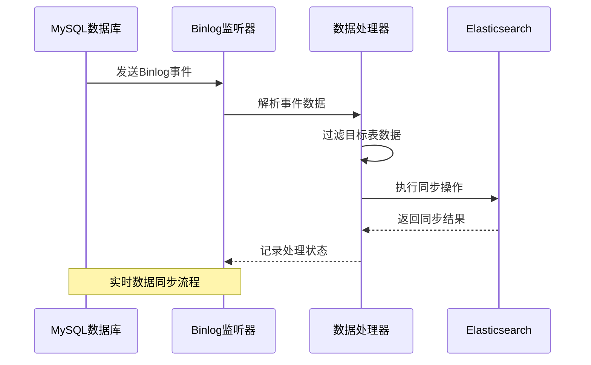
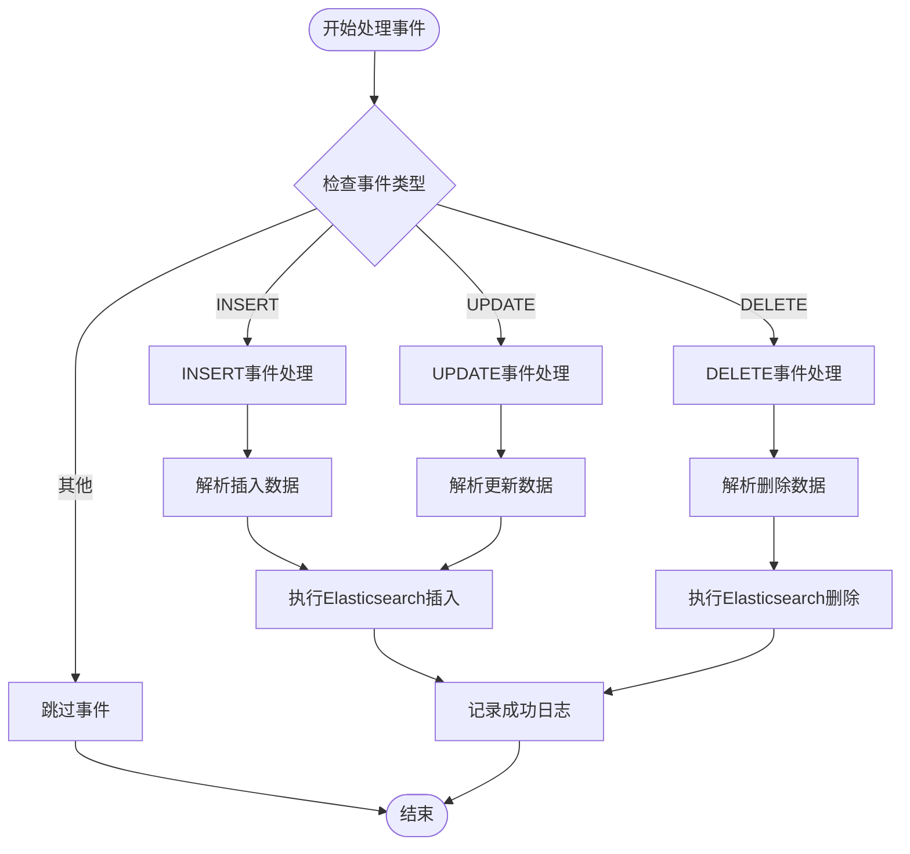
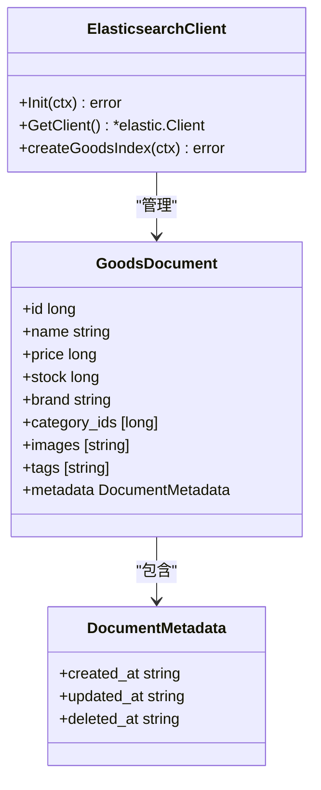
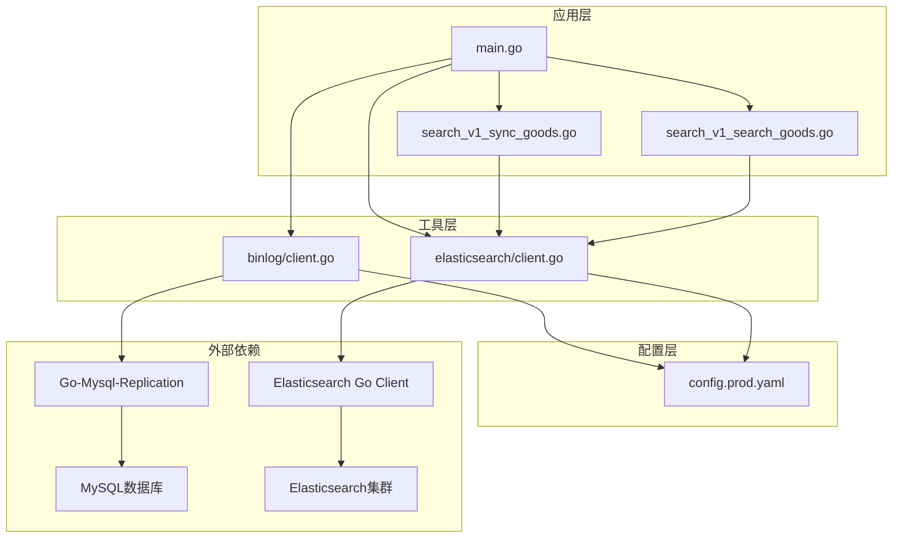

# Binlog同步机制

<cite>
**本文档引用的文件**
- [app/search/utility/binlog/client.go](file://app/search/utility/binlog/client.go)
- [app/search/utility/elasticsearch/client.go](file://app/search/utility/elasticsearch/client.go)
- [app/search/main.go](file://app/search/main.go)
- [app/search/manifest/config/config.prod.yaml](file://app/search/manifest/config/config.prod.yaml)
- [app/search/internal/controller/search/search_v1_search_goods.go](file://app/search/internal/controller/search/search_v1_search_goods.go)
- [app/search/internal/controller/search/search_v1_sync_goods.go](file://app/search/internal/controller/search/search_v1_sync_goods.go)
- [app/search/internal/cmd/cmd.go](file://app/search/internal/cmd/cmd.go)
- [doc/Elasticsearch集成与使用指南-从入门到实战.md](file://doc/Elasticsearch集成与使用指南-从入门到实战.md)
</cite>

## 目录
1. [简介](#简介)
2. [项目结构](#项目结构)
3. [核心组件](#核心组件)
4. [架构概览](#架构概览)
5. [详细组件分析](#详细组件分析)
6. [依赖关系分析](#依赖关系分析)
7. [性能考虑](#性能考虑)
8. [故障排查指南](#故障排查指南)
9. [结论](#结论)

## 简介

本文档详细介绍基于MySQL Binlog的商品数据实时同步机制。该系统通过监听MySQL数据库的二进制日志，实时捕获商品数据变更，将增量数据同步到Elasticsearch搜索引擎中，实现数据库与搜索引擎的实时一致性。

该实现采用Go-Mysql-Replication库作为Binlog监听器，结合Gogf框架的配置管理和日志系统，提供了完整的数据同步解决方案。系统支持插入、更新、删除三种类型的Binlog事件处理，并针对商品表进行了专门的数据过滤和处理逻辑。

## 项目结构

该项目采用Go-Micro服务架构模式，Binlog同步功能主要集中在search服务模块中：



**图表来源**
- [app/search/main.go](file://app/search/main.go#L13-L24)
- [app/search/utility/binlog/client.go](file://app/search/utility/binlog/client.go#L1-L62)
- [app/search/utility/elasticsearch/client.go](file://app/search/utility/elasticsearch/client.go#L1-L45)

**章节来源**
- [app/search/main.go](file://app/search/main.go#L1-L25)
- [app/search/manifest/config/config.prod.yaml](file://app/search/manifest/config/config.prod.yaml#L1-L39)

## 核心组件

### Binlog监听器组件

Binlog监听器是整个同步系统的核心组件，负责与MySQL数据库建立连接并监听二进制日志事件。

**关键特性：**
- 支持MySQL 5.7+版本的Binlog协议
- 实时监听数据库变更事件
- 支持多种事件类型处理（INSERT、UPDATE、DELETE）
- 提供错误重试和断点续传机制

### Elasticsearch客户端组件

Elasticsearch客户端负责与搜索引擎进行交互，执行文档的增删改查操作。

**关键特性：**
- 自动初始化和健康检查
- 支持索引自动创建和映射配置
- 提供批量操作支持
- 错误处理和重试机制

### 商品数据处理器

专门针对商品表的数据处理器，实现了商品信息的增删改同步逻辑。

**处理逻辑：**
- 仅处理指定数据库和表的事件
- 解析行数据为键值对格式
- 执行相应的Elasticsearch操作

**章节来源**
- [app/search/utility/binlog/client.go](file://app/search/utility/binlog/client.go#L14-L62)
- [app/search/utility/elasticsearch/client.go](file://app/search/utility/elasticsearch/client.go#L12-L45)

## 架构概览

系统采用事件驱动的架构模式，通过Binlog监听器实时捕获数据库变更，然后异步处理并同步到Elasticsearch：



**图表来源**
- [app/search/utility/binlog/client.go](file://app/search/utility/binlog/client.go#L48-L62)
- [app/search/utility/binlog/client.go](file://app/search/utility/binlog/client.go#L65-L86)

### 数据流处理流程

系统的数据处理流程遵循以下步骤：

1. **连接建立**：Binlog监听器建立与MySQL的连接
2. **事件监听**：实时接收Binlog事件
3. **数据过滤**：筛选目标数据库和表的数据
4. **事件解析**：解析不同类型的Binlog事件
5. **数据转换**：将行数据转换为文档格式
6. **同步执行**：向Elasticsearch发送同步请求

**章节来源**
- [app/search/utility/binlog/client.go](file://app/search/utility/binlog/client.go#L15-L62)

## 详细组件分析

### Binlog监听器实现

Binlog监听器采用Go-Mysql-Replication库实现，提供了完整的Binlog事件监听功能：

```mermaid
classDiagram
class BinlogSyncer {
+StartBinlogSyncer(ctx) void
+processBinlogEvent(ev) void
+handleInsert(rows) void
+handleUpdate(rows) void
+handleDelete(rows) void
+parseRowData(row) map
}
class RowsEvent {
+Schema string
+Table string
+Rows [][]interface{}
}
class ReplicationEvent {
+EventType EventType
+Header EventHeader
+Event BinlogEvent
}
BinlogSyncer --> RowsEvent : "处理"
BinlogSyncer --> ReplicationEvent : "监听"
RowsEvent --> ReplicationEvent : "包含"
```

**图表来源**
- [app/search/utility/binlog/client.go](file://app/search/utility/binlog/client.go#L64-L86)

#### 连接建立机制

监听器通过配置文件中的数据库连接信息建立与MySQL的连接：

**配置参数：**
- 主机地址：从配置中读取MySQL主机地址
- 端口：默认3306端口
- 用户名：数据库访问用户名
- 密码：数据库访问密码
- ServerID：必须唯一，避免与其他复制实例冲突

#### 事件处理流程

系统支持三种主要的Binlog事件类型：



**图表来源**
- [app/search/utility/binlog/client.go](file://app/search/utility/binlog/client.go#L65-L86)
- [app/search/utility/binlog/client.go](file://app/search/utility/binlog/client.go#L88-L114)

**章节来源**
- [app/search/utility/binlog/client.go](file://app/search/utility/binlog/client.go#L14-L133)

### 数据过滤机制

系统实现了精确的数据过滤机制，确保只处理目标数据库和表的变更：

**过滤规则：**
- 数据库过滤：仅处理名为"goods"的数据库
- 表过滤：仅处理名为"goods_info"的表
- 字段映射：将数据库字段映射到Elasticsearch文档字段

**字段映射关系：**
| 数据库字段 | Elasticsearch字段 | 类型 |
|------------|-------------------|------|
| id | id | long |
| name | name | text (ik_max_word分词) |
| pic_url | pic_url | keyword |
| images | images | keyword |
| price | price | long |
| level1_category_id | level1_category_id | long |
| level2_category_id | level2_category_id | long |
| level3_category_id | level3_category_id | long |
| brand | brand | keyword |
| stock | stock | long |
| sale | sale | long |
| tags | tags | keyword |
| sort | sort | long |
| detail_info | detail_info | text |
| created_at | created_at | text |
| updated_at | updated_at | text |
| deleted_at | deleted_at | text |

**章节来源**
- [app/search/utility/binlog/client.go](file://app/search/utility/binlog/client.go#L68-L133)

### Elasticsearch同步机制

Elasticsearch同步组件提供了完整的文档管理功能：



**图表来源**
- [app/search/utility/elasticsearch/client.go](file://app/search/utility/elasticsearch/client.go#L47-L112)

#### 索引配置

系统自动创建商品索引，配置了专门的字段映射：

**文本搜索配置：**
- name字段：使用ik_max_word分词器进行全文搜索
- 支持智能分词和最大匹配分词模式
- 提供不同的搜索分析器以优化搜索体验

**分类字段配置：**
- brand字段：支持keyword和text双重类型
- category_id字段：使用long类型支持数值范围查询
- 支持精确匹配和范围查询

**章节来源**
- [app/search/utility/elasticsearch/client.go](file://app/search/utility/elasticsearch/client.go#L52-L112)

### HTTP服务集成

系统通过HTTP接口提供商品同步功能：

**API接口：**
- POST /sync-goods：手动同步商品数据
- 支持create、update、delete三种操作类型
- 提供批量同步能力

**接口特点：**
- 基于Gogf框架的HTTP服务器
- 支持中间件处理和错误处理
- 提供完整的请求响应生命周期管理

**章节来源**
- [app/search/internal/controller/search/search_v1_sync_goods.go](file://app/search/internal/controller/search/search_v1_sync_goods.go#L16-L60)

## 依赖关系分析

系统的依赖关系相对简洁，主要围绕Binlog监听和Elasticsearch同步两个核心功能：



**图表来源**
- [app/search/main.go](file://app/search/main.go#L3-L11)
- [app/search/utility/binlog/client.go](file://app/search/utility/binlog/client.go#L3-L12)
- [app/search/utility/elasticsearch/client.go](file://app/search/utility/elasticsearch/client.go#L3-L8)

**章节来源**
- [app/search/main.go](file://app/search/main.go#L1-L25)
- [app/search/manifest/config/config.prod.yaml](file://app/search/manifest/config/config.prod.yaml#L24-L38)

## 性能考虑

### 同步性能优化

系统在设计时充分考虑了性能优化需求：

**并发处理：**
- Binlog监听器采用单线程处理，避免复杂的状态管理
- Elasticsearch操作采用异步处理，提高吞吐量
- 支持批量操作减少网络往返

**内存管理：**
- 事件数据按需解析，避免不必要的内存占用
- 使用流式处理减少内存峰值
- 及时释放不再使用的资源

**网络优化：**
- Elasticsearch客户端支持连接池复用
- 减少不必要的网络请求
- 优化序列化和反序列化过程

### 断点续传机制

系统具备基本的断点续传能力：

**位置跟踪：**
- Binlog监听器从指定位置开始同步
- 支持从最新位置开始监听
- 位置信息存储在MySQL的Binlog文件中

**恢复机制：**
- 网络中断后自动重连
- 事件处理失败时记录错误信息
- 支持手动重启恢复同步

### 错误重试策略

系统实现了多层次的错误处理和重试机制：

**连接层重试：**
- MySQL连接失败时自动重试
- 支持指数退避算法
- 最大重试次数限制

**业务层重试：**
- Elasticsearch操作失败时重试
- 区分临时错误和永久错误
- 支持批量操作的原子性保证

**章节来源**
- [app/search/utility/binlog/client.go](file://app/search/utility/binlog/client.go#L50-L62)
- [app/search/utility/binlog/client.go](file://app/search/utility/binlog/client.go#L53-L57)

## 故障排查指南

### 常见问题诊断

**Binlog连接问题：**
- 检查MySQL的binlog是否启用
- 验证MySQL用户权限配置
- 确认网络连接和防火墙设置

**Elasticsearch连接问题：**
- 检查ES服务可用性和健康状态
- 验证索引映射配置正确性
- 确认ES集群节点状态正常

**数据同步问题：**
- 查看Binlog事件过滤日志
- 检查数据转换映射关系
- 验证Elasticsearch文档格式

### 日志分析

系统提供了详细的日志记录机制：

**日志级别：**
- Debug：详细的操作流程和数据内容
- Info：重要的系统状态和操作结果
- Error：错误信息和异常情况

**关键日志点：**
- Binlog事件接收和处理
- Elasticsearch操作执行结果
- 系统启动和停止状态

### 监控指标

建议监控以下关键指标：

**Binlog监听指标：**
- 事件接收速率
- 处理延迟时间
- 错误率统计

**Elasticsearch指标：**
- 文档同步成功率
- 查询响应时间
- 集群健康状态

**章节来源**
- [app/search/utility/binlog/client.go](file://app/search/utility/binlog/client.go#L48-L49)
- [app/search/utility/binlog/client.go](file://app/search/utility/binlog/client.go#L54-L56)

## 结论

该Binlog同步机制提供了完整、可靠的MySQL到Elasticsearch数据同步解决方案。系统具有以下优势：

**技术优势：**
- 基于成熟的Go-Mysql-Replication库
- 完善的错误处理和重试机制
- 清晰的代码结构和模块化设计

**功能特性：**
- 实时数据同步，低延迟
- 精确的数据过滤和处理
- 完整的增删改操作支持

**扩展性：**
- 易于扩展到其他数据库表
- 支持自定义数据处理逻辑
- 可配置的同步策略

该系统为商品数据的实时搜索提供了坚实的技术基础，能够满足电商场景下的高性能搜索需求。通过合理的架构设计和完善的错误处理机制，确保了系统的稳定性和可靠性。