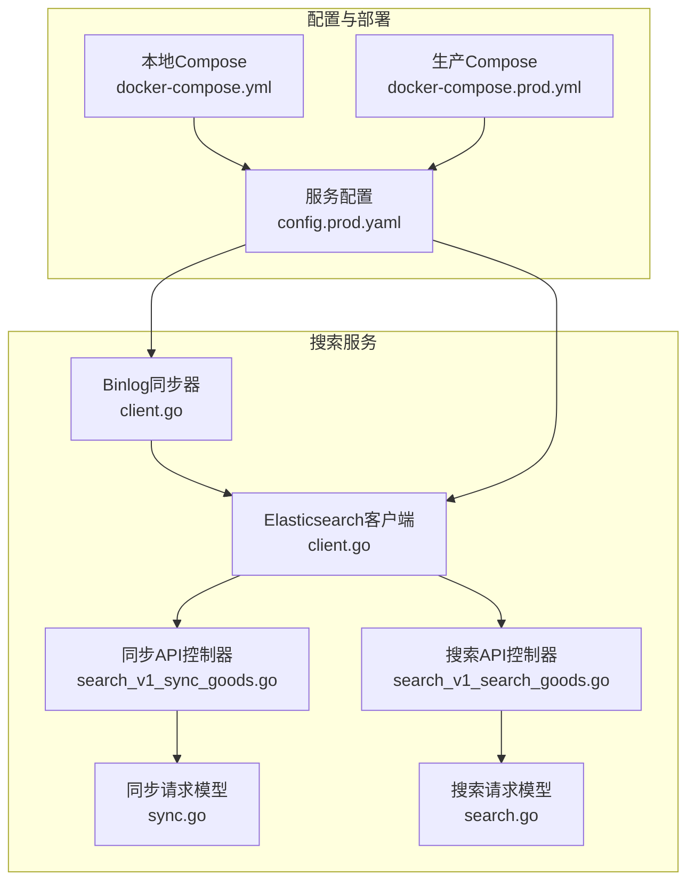
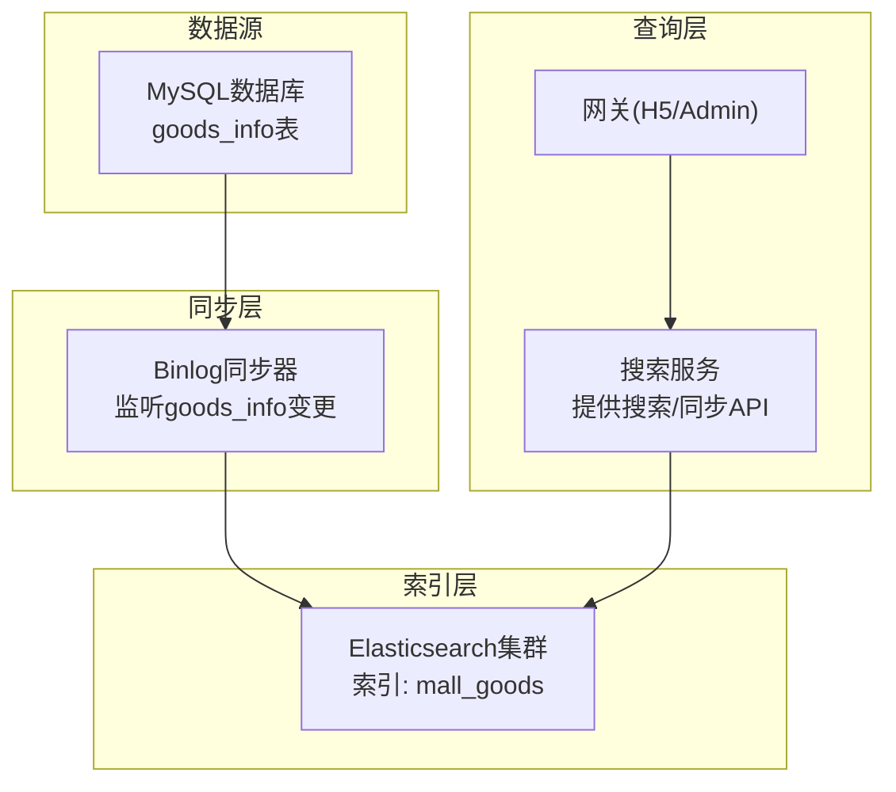
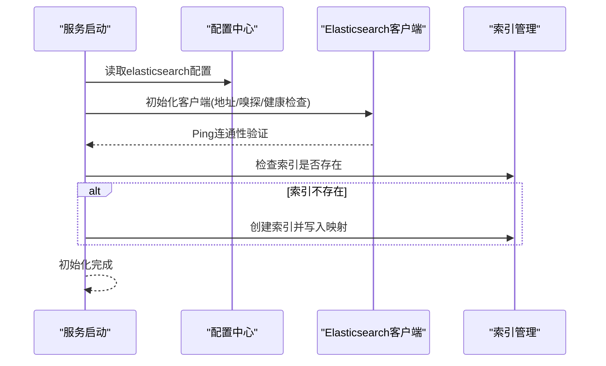
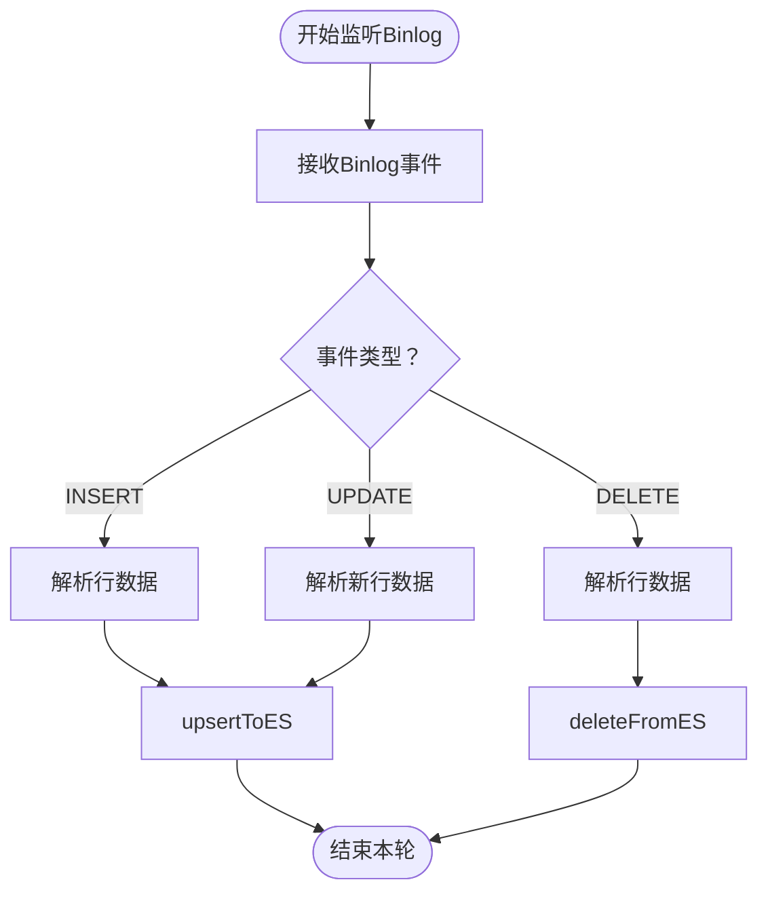
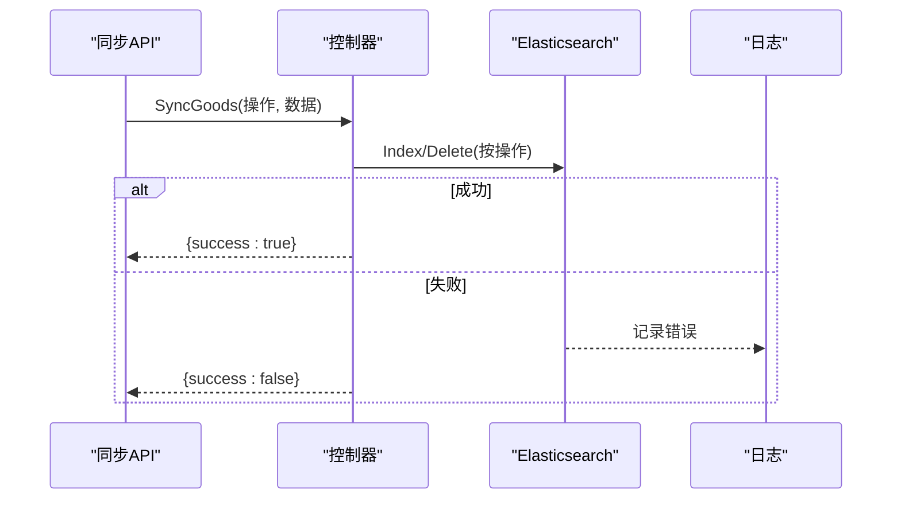
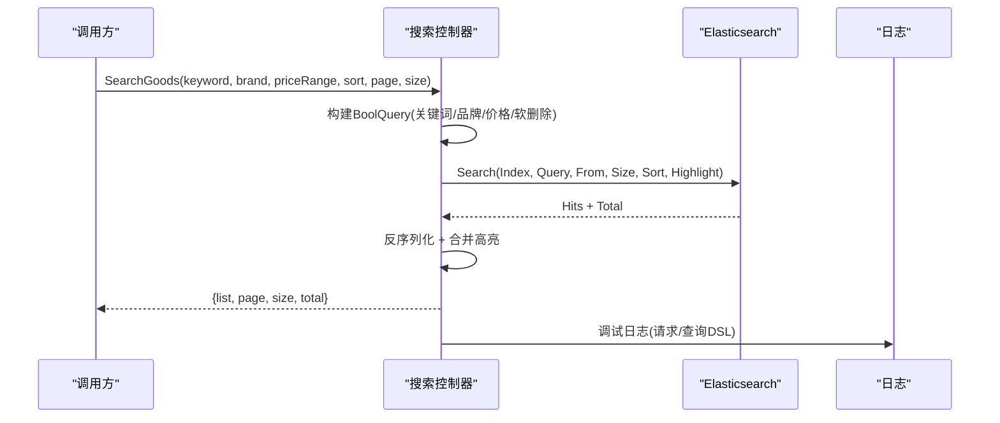
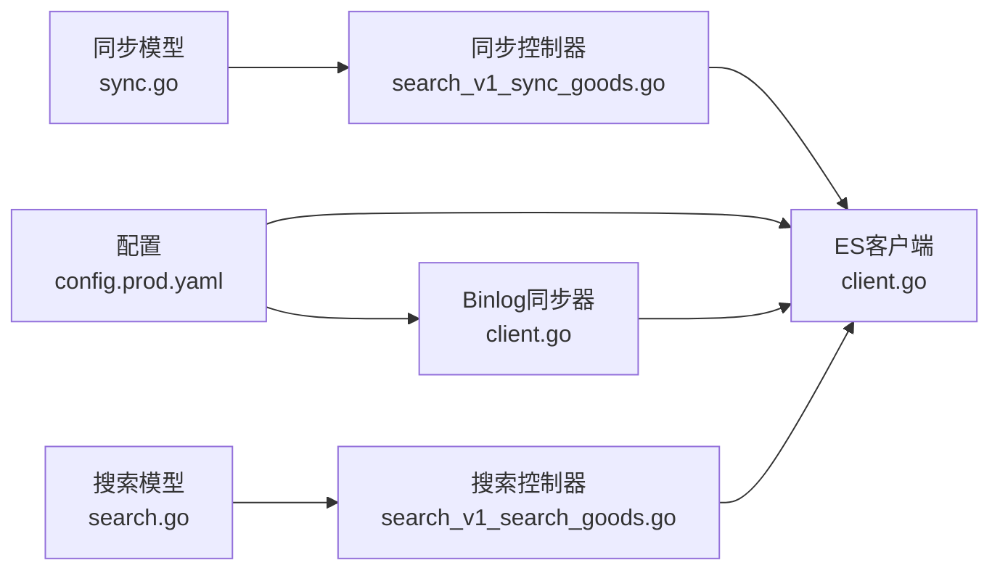

# Elasticsearch集成

<cite>
**本文引用的文件**
- [app/search/utility/elasticsearch/client.go](file://app/search/utility/elasticsearch/client.go)
- [app/search/utility/binlog/client.go](file://app/search/utility/binlog/client.go)
- [app/search/internal/controller/search/search_v1_sync_goods.go](file://app/search/internal/controller/search/search_v1_sync_goods.go)
- [app/search/internal/controller/search/search_v1_search_goods.go](file://app/search/internal/controller/search/search_v1_search_goods.go)
- [app/search/api/search/v1/sync.go](file://app/search/api/search/v1/sync.go)
- [app/search/api/search/v1/search.go](file://app/search/api/search/v1/search.go)
- [app/search/manifest/config/config.prod.yaml](file://app/search/manifest/config/config.prod.yaml)
- [docker-compose.yml](file://docker-compose.yml)
- [docker-compose.prod.yml](file://docker-compose.prod.yml)
- [doc/Elasticsearch集成与使用指南-从入门到实战.md](file://doc/Elasticsearch集成与使用指南-从入门到实战.md)
</cite>

## 目录
1. [简介](#简介)
2. [项目结构](#项目结构)
3. [核心组件](#核心组件)
4. [架构总览](#架构总览)
5. [详细组件分析](#详细组件分析)
6. [依赖关系分析](#依赖关系分析)
7. [性能考量](#性能考量)
8. [故障排查指南](#故障排查指南)
9. [结论](#结论)
10. [附录](#附录)

## 简介
本文件面向Elasticsearch在本微服务项目中的集成与使用，覆盖客户端初始化与连接管理、集群发现机制、索引映射与分词器策略、商品数据的批量导入与增量同步、索引更新与查询DSL构建、聚合查询与高级搜索能力、以及性能调优、集群监控与故障恢复等运维要点。内容以代码为依据，配合架构图与流程图帮助读者快速理解与落地。

## 项目结构
围绕Elasticsearch的关键模块分布于“搜索服务”子工程中，主要包括：
- 客户端封装与索引初始化：app/search/utility/elasticsearch
- Binlog增量同步：app/search/utility/binlog
- 搜索与同步API控制器：app/search/internal/controller/search
- 请求/响应模型：app/search/api/search/v1
- 配置与部署：app/search/manifest/config、docker-compose*.yml
- 项目文档：doc/Elasticsearch集成与使用指南-从入门到实战.md

图表来源
- [app/search/utility/elasticsearch/client.go](file://app/search/utility/elasticsearch/client.go#L1-L113)
- [app/search/utility/binlog/client.go](file://app/search/utility/binlog/client.go#L1-L203)
- [app/search/internal/controller/search/search_v1_sync_goods.go](file://app/search/internal/controller/search/search_v1_sync_goods.go#L1-L61)
- [app/search/internal/controller/search/search_v1_search_goods.go](file://app/search/internal/controller/search/search_v1_search_goods.go#L1-L135)
- [app/search/api/search/v1/sync.go](file://app/search/api/search/v1/sync.go#L1-L31)
- [app/search/api/search/v1/search.go](file://app/search/api/search/v1/search.go#L1-L45)
- [app/search/manifest/config/config.prod.yaml](file://app/search/manifest/config/config.prod.yaml#L1-L38)
- [docker-compose.yml](file://docker-compose.yml#L97-L146)
- [docker-compose.prod.yml](file://docker-compose.prod.yml#L143-L193)

章节来源
- [app/search/utility/elasticsearch/client.go](file://app/search/utility/elasticsearch/client.go#L1-L113)
- [app/search/utility/binlog/client.go](file://app/search/utility/binlog/client.go#L1-L203)
- [app/search/manifest/config/config.prod.yaml](file://app/search/manifest/config/config.prod.yaml#L1-L38)
- [docker-compose.yml](file://docker-compose.yml#L97-L146)
- [docker-compose.prod.yml](file://docker-compose.prod.yml#L143-L193)

## 核心组件
- Elasticsearch客户端与索引初始化：负责从配置读取地址、嗅探与健康检查开关，创建客户端并Ping连通性；自动检测并创建商品索引，内置映射与分词器配置。
- Binlog增量同步器：监听MySQL binlog，按事件类型（插入/更新/删除）解析行数据，调用ES写入或删除接口，实现近实时数据同步。
- 同步与搜索API控制器：提供商品数据的同步接口（create/update/delete）与搜索接口（关键词、品牌、价格区间、排序、高亮）。
- 请求/响应模型：定义同步与搜索的输入输出结构，便于API契约管理与校验。
- 配置与部署：服务地址、索引名称、Binlog源配置；Docker Compose中自动安装IK分词器并健康检查。

章节来源
- [app/search/utility/elasticsearch/client.go](file://app/search/utility/elasticsearch/client.go#L12-L45)
- [app/search/utility/binlog/client.go](file://app/search/utility/binlog/client.go#L14-L62)
- [app/search/internal/controller/search/search_v1_sync_goods.go](file://app/search/internal/controller/search/search_v1_sync_goods.go#L16-L60)
- [app/search/internal/controller/search/search_v1_search_goods.go](file://app/search/internal/controller/search/search_v1_search_goods.go#L17-L134)
- [app/search/api/search/v1/sync.go](file://app/search/api/search/v1/sync.go#L7-L30)
- [app/search/api/search/v1/search.go](file://app/search/api/search/v1/search.go#L7-L44)
- [app/search/manifest/config/config.prod.yaml](file://app/search/manifest/config/config.prod.yaml#L24-L38)
- [docker-compose.yml](file://docker-compose.yml#L97-L146)

## 架构总览
Elasticsearch在本项目中的定位是商品搜索与数据同步的基础设施层。整体架构由“MySQL Binlog监听器”驱动“Elasticsearch索引”，前端或H5网关通过“搜索服务”调用ES完成检索。

图表来源
- [app/search/utility/binlog/client.go](file://app/search/utility/binlog/client.go#L14-L62)
- [app/search/utility/elasticsearch/client.go](file://app/search/utility/elasticsearch/client.go#L52-L112)
- [app/search/internal/controller/search/search_v1_search_goods.go](file://app/search/internal/controller/search/search_v1_search_goods.go#L32-L106)
- [app/search/manifest/config/config.prod.yaml](file://app/search/manifest/config/config.prod.yaml#L24-L29)

## 详细组件分析

### 客户端初始化与连接管理
- 初始化流程
  - 从配置读取ES地址、嗅探开关、健康检查开关。
  - 构造客户端选项并创建客户端。
  - Ping目标地址验证连通性。
  - 自动创建商品索引（若不存在），并写入映射。
- 连接与健康检查
  - 嗅探（sniff）用于动态发现集群节点。
  - 健康检查（healthcheck）用于启动时验证服务可用性。
- 索引策略
  - 索引名称通过配置项指定。
  - 映射中对中文字段使用IK分词器（索引时细粒度、搜索时智能）。
  - 对不需要分词的字段（如ID、URL、分类ID、品牌等）使用keyword类型。

图表来源
- [app/search/utility/elasticsearch/client.go](file://app/search/utility/elasticsearch/client.go#L13-L44)
- [app/search/manifest/config/config.prod.yaml](file://app/search/manifest/config/config.prod.yaml#L24-L29)

章节来源
- [app/search/utility/elasticsearch/client.go](file://app/search/utility/elasticsearch/client.go#L13-L44)
- [app/search/manifest/config/config.prod.yaml](file://app/search/manifest/config/config.prod.yaml#L24-L29)

### 索引映射与分词器策略
- 字段类型与用途
  - 数值类：id、price、level1/2/3_category_id、stock、sale等。
  - 文本类：name使用IK分词器；detail_info为全文文本。
  - 关键字类：pic_url、images、brand、tags等。
- 分词器
  - name字段：索引时使用ik_max_word，搜索时使用ik_smart，兼顾召回与效率。
  - 品牌brand同时提供keyword与text子字段，支持精确匹配与全文检索。
- 映射创建
  - 在索引不存在时自动创建，确保部署一致性。

章节来源
- [app/search/utility/elasticsearch/client.go](file://app/search/utility/elasticsearch/client.go#L67-L97)
- [doc/Elasticsearch集成与使用指南-从入门到实战.md](file://doc/Elasticsearch集成与使用指南-从入门到实战.md#L486-L496)

### 增量同步机制（Binlog）
- 监听范围
  - 仅监听指定数据库与表（goods.goods_info）。
- 事件处理
  - INSERT：解析行数据并upsert到ES。
  - UPDATE：取新行数据进行upsert。
  - DELETE：根据ID删除ES文档。
- 数据转换
  - 将行数据映射为字段字典，统一转换为期望类型后写入ES。
- 同步可靠性
  - 日志记录写入/删除结果；失败时记录错误但不中断循环。
  - 建议结合位点持久化实现断点续传（当前实现为从最新位点开始）。

图表来源
- [app/search/utility/binlog/client.go](file://app/search/utility/binlog/client.go#L64-L133)
- [app/search/utility/binlog/client.go](file://app/search/utility/binlog/client.go#L135-L202)

章节来源
- [app/search/utility/binlog/client.go](file://app/search/utility/binlog/client.go#L14-L62)
- [app/search/utility/binlog/client.go](file://app/search/utility/binlog/client.go#L64-L133)
- [app/search/utility/binlog/client.go](file://app/search/utility/binlog/client.go#L135-L202)

### 批量导入与索引更新（同步接口）
- 同步接口
  - 支持create、update、delete三种操作。
  - 写入时统一设置created_at与updated_at时间戳。
- 索引名称
  - 当前硬编码使用mall_goods索引；建议与配置解耦。
- 错误处理
  - 失败时记录日志并返回失败标记，不影响上游调用方。

图表来源
- [app/search/internal/controller/search/search_v1_sync_goods.go](file://app/search/internal/controller/search/search_v1_sync_goods.go#L16-L60)
- [app/search/api/search/v1/sync.go](file://app/search/api/search/v1/sync.go#L7-L30)

章节来源
- [app/search/internal/controller/search/search_v1_sync_goods.go](file://app/search/internal/controller/search/search_v1_sync_goods.go#L16-L60)
- [app/search/api/search/v1/sync.go](file://app/search/api/search/v1/sync.go#L7-L30)

### 查询DSL构建与高级搜索
- 查询条件
  - 关键词：match name。
  - 品牌：term过滤。
  - 价格区间：range过滤。
  - 软删除：must_not wildcard过滤deleted_at。
- 分页与排序
  - from/size分页。
  - 支持按price升/降、sale降序、默认按相关性_score排序。
- 高亮
  - 对name字段进行高亮，前后缀标签可配置。
- 结果处理
  - 统计TotalHits，遍历命中集，反序列化为业务对象，合并高亮结果。

图表来源
- [app/search/internal/controller/search/search_v1_search_goods.go](file://app/search/internal/controller/search/search_v1_search_goods.go#L17-L134)
- [app/search/api/search/v1/search.go](file://app/search/api/search/v1/search.go#L7-L44)

章节来源
- [app/search/internal/controller/search/search_v1_search_goods.go](file://app/search/internal/controller/search/search_v1_search_goods.go#L17-L134)
- [app/search/api/search/v1/search.go](file://app/search/api/search/v1/search.go#L7-L44)

### 集成点与外部依赖
- 依赖库
  - olivere/elastic：官方Go客户端。
  - go-mysql-org/go-mysql：Binlog监听与解析。
- 配置项
  - elasticsearch.address、elasticsearch.sniff、elasticsearch.healthcheck、elasticsearch.indices.goods。
  - binlog.goods.mysql.*：MySQL连接信息。
- 部署与插件
  - Docker Compose启动时自动安装IK分词器插件并健康检查。
  - 生产环境限制内存/CPU并启用健康检查。

章节来源
- [app/search/utility/elasticsearch/client.go](file://app/search/utility/elasticsearch/client.go#L3-L8)
- [app/search/utility/binlog/client.go](file://app/search/utility/binlog/client.go#L3-L12)
- [app/search/manifest/config/config.prod.yaml](file://app/search/manifest/config/config.prod.yaml#L24-L38)
- [docker-compose.yml](file://docker-compose.yml#L97-L146)
- [docker-compose.prod.yml](file://docker-compose.prod.yml#L143-L193)

## 依赖关系分析
- 控制器依赖ES客户端；Binlog同步器同样依赖ES客户端。
- 同步/搜索API控制器分别消费同步/搜索模型。
- 配置贯穿客户端初始化与Binlog同步器的连接参数。
- Docker Compose提供ES/Kibana运行环境与插件安装。

图表来源
- [app/search/manifest/config/config.prod.yaml](file://app/search/manifest/config/config.prod.yaml#L24-L38)
- [app/search/utility/elasticsearch/client.go](file://app/search/utility/elasticsearch/client.go#L1-L113)
- [app/search/utility/binlog/client.go](file://app/search/utility/binlog/client.go#L1-L203)
- [app/search/internal/controller/search/search_v1_sync_goods.go](file://app/search/internal/controller/search/search_v1_sync_goods.go#L1-L61)
- [app/search/internal/controller/search/search_v1_search_goods.go](file://app/search/internal/controller/search/search_v1_search_goods.go#L1-L135)
- [app/search/api/search/v1/sync.go](file://app/search/api/search/v1/sync.go#L1-L31)
- [app/search/api/search/v1/search.go](file://app/search/api/search/v1/search.go#L1-L45)

章节来源
- [app/search/utility/elasticsearch/client.go](file://app/search/utility/elasticsearch/client.go#L1-L113)
- [app/search/utility/binlog/client.go](file://app/search/utility/binlog/client.go#L1-L203)
- [app/search/internal/controller/search/search_v1_sync_goods.go](file://app/search/internal/controller/search/search_v1_sync_goods.go#L1-L61)
- [app/search/internal/controller/search/search_v1_search_goods.go](file://app/search/internal/controller/search/search_v1_search_goods.go#L1-L135)
- [app/search/api/search/v1/sync.go](file://app/search/api/search/v1/sync.go#L1-L31)
- [app/search/api/search/v1/search.go](file://app/search/api/search/v1/search.go#L1-L45)
- [app/search/manifest/config/config.prod.yaml](file://app/search/manifest/config/config.prod.yaml#L24-L38)

## 性能考量
- 查询优化
  - 使用filter查询承载过滤条件，利于缓存与短路。
  - 控制返回字段，减少网络与解析开销。
  - 合理设置分页大小，避免深分页导致性能下降。
- 索引与映射
  - 仅对必要字段建立索引，避免过度字段造成写放大。
  - 中文使用IK分词器，区分索引与搜索阶段的粒度。
- 同步优化
  - 大量写入场景建议使用批量API（Bulk）提升吞吐。
  - 异常重试与位点持久化，保障一致性与可恢复性。
- 集群与资源
  - 合理设置分片与副本，避免单分片过大。
  - 生产环境限制资源并开启健康检查，保证稳定性。

章节来源
- [doc/Elasticsearch集成与使用指南-从入门到实战.md](file://doc/Elasticsearch集成与使用指南-从入门到实战.md#L511-L538)

## 故障排查指南
- 客户端未初始化
  - 现象：同步/搜索返回客户端未初始化错误。
  - 排查：确认服务启动顺序与初始化流程，检查配置项与Ping连通性。
- Ping失败或健康检查失败
  - 现象：初始化阶段Ping报错。
  - 排查：核对elasticsearch.address、网络连通、容器健康检查配置。
- 索引创建失败
  - 现象：索引未创建或映射未生效。
  - 排查：查看索引创建返回值与错误日志；确认索引名称与映射语法。
- Binlog同步异常
  - 现象：ES中无数据或数据不同步。
  - 排查：检查MySQL连接参数、Binlog事件类型、日志错误；确认监听表是否为goods.goods_info。
- 搜索结果不准确
  - 现象：关键词无法命中或排序不符合预期。
  - 排查：确认分词器配置、字段映射、查询DSL；使用_analyze API验证分词效果。
- 性能问题
  - 现象：查询延迟高。
  - 排查：优化查询DSL、增加缓存、调整分片/副本、升级硬件或重新设计索引。

章节来源
- [app/search/utility/elasticsearch/client.go](file://app/search/utility/elasticsearch/client.go#L32-L44)
- [app/search/utility/binlog/client.go](file://app/search/utility/binlog/client.go#L42-L61)
- [app/search/internal/controller/search/search_v1_search_goods.go](file://app/search/internal/controller/search/search_v1_search_goods.go#L102-L106)
- [doc/Elasticsearch集成与使用指南-从入门到实战.md](file://doc/Elasticsearch集成与使用指南-从入门到实战.md#L539-L569)

## 结论
本项目通过“Binlog监听 + ES索引”的方式实现了MySQL到Elasticsearch的近实时同步，并提供了完善的搜索与同步API。结合IK分词器与合理的索引映射，能够满足商品搜索的召回与排序需求。建议在生产环境中进一步完善位点持久化、批量写入、查询缓存与资源限制，持续监控集群健康状况，以获得更稳定与高性能的搜索体验。

## 附录
- 部署与插件
  - 本地与生产环境均通过Docker Compose启动ES与Kibana，并自动安装IK分词器。
- 配置参考
  - elasticsearch.address、elasticsearch.sniff、elasticsearch.healthcheck、elasticsearch.indices.goods。
  - binlog.goods.mysql.host/port/username/password。

章节来源
- [docker-compose.yml](file://docker-compose.yml#L97-L146)
- [docker-compose.prod.yml](file://docker-compose.prod.yml#L143-L193)
- [app/search/manifest/config/config.prod.yaml](file://app/search/manifest/config/config.prod.yaml#L24-L38)