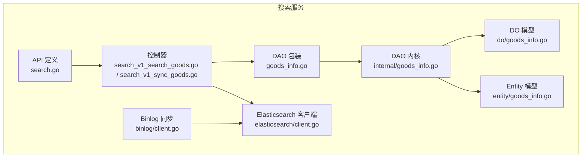
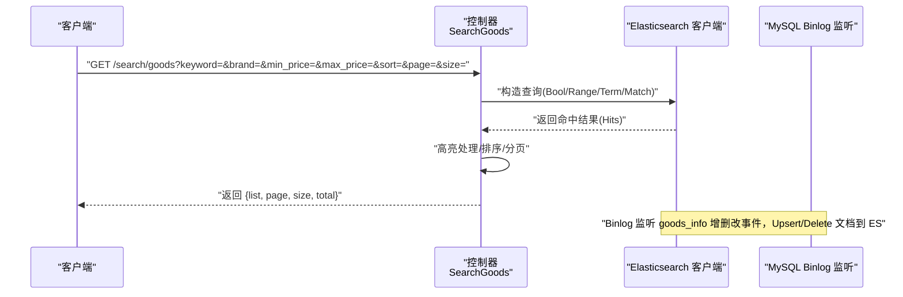
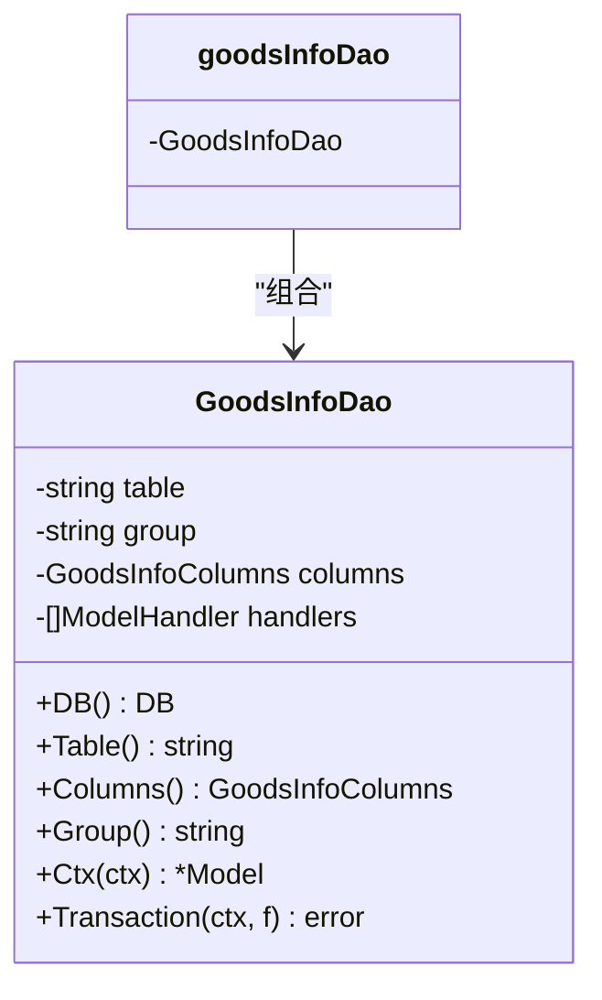
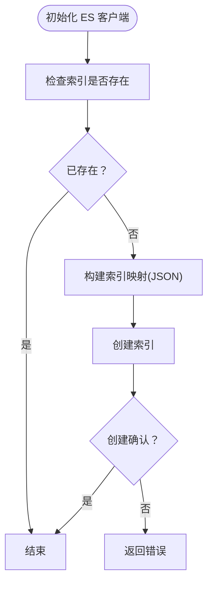
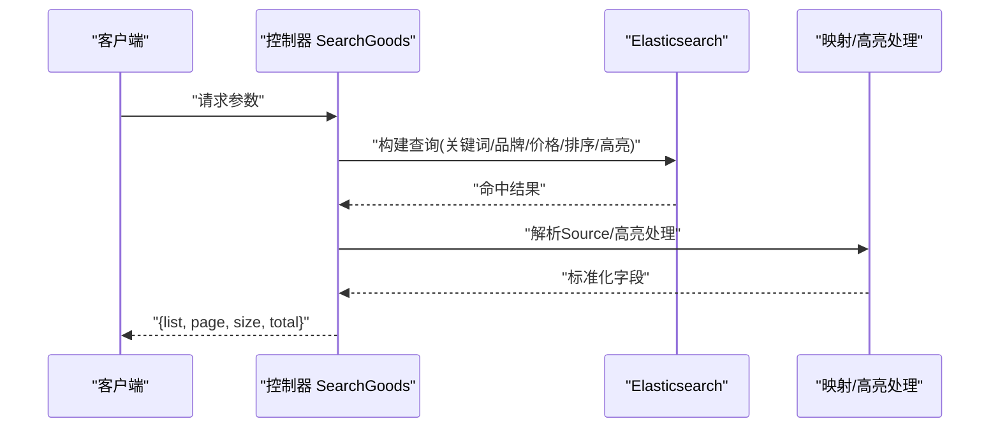
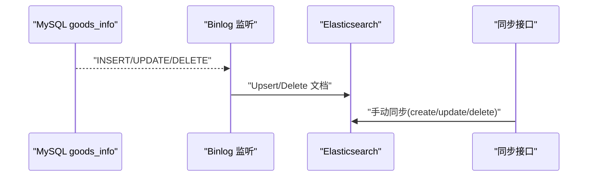
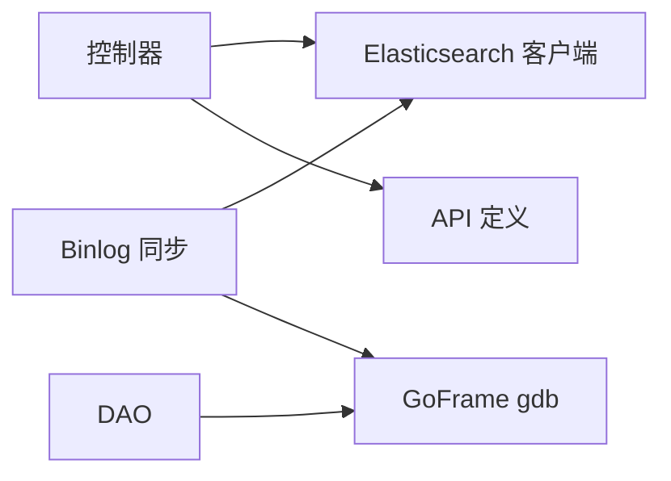

# 搜索数据模型

<cite>
**本文引用的文件**
- [app/search/internal/model/do/goods_info.go](file://app/search/internal/model/do/goods_info.go)
- [app/search/internal/model/entity/goods_info.go](file://app/search/internal/model/entity/goods_info.go)
- [app/search/internal/dao/internal/goods_info.go](file://app/search/internal/dao/internal/goods_info.go)
- [app/search/internal/dao/goods_info.go](file://app/search/internal/dao/goods_info.go)
- [app/search/internal/controller/search/search_v1_search_goods.go](file://app/search/internal/controller/search/search_v1_search_goods.go)
- [app/search/internal/controller/search/search_v1_sync_goods.go](file://app/search/internal/controller/search/search_v1_sync_goods.go)
- [app/search/utility/elasticsearch/client.go](file://app/search/utility/elasticsearch/client.go)
- [app/search/utility/binlog/client.go](file://app/search/utility/binlog/client.go)
- [app/search/api/search/v1/search.go](file://app/search/api/search/v1/search.go)
</cite>

## 目录
1. [简介](#简介)
2. [项目结构](#项目结构)
3. [核心组件](#核心组件)
4. [架构总览](#架构总览)
5. [详细组件分析](#详细组件分析)
6. [依赖分析](#依赖分析)
7. [性能考量](#性能考量)
8. [故障排查指南](#故障排查指南)
9. [结论](#结论)
10. [附录](#附录)

## 简介
本文件聚焦于“搜索”子系统的商品搜索数据模型设计与实现，涵盖以下方面：
- DO（数据对象）与 Entity（实体对象）的字段定义与业务含义
- 商品搜索索引的数据结构、字段映射关系与数据转换规则
- 商品信息表的 DAO 层实现（查询、条件筛选、结果映射）
- 使用示例、性能优化建议、扩展方案与版本管理策略

## 项目结构
围绕商品搜索，相关代码主要分布在如下模块：
- 数据模型层：DO 与 Entity 定义
- DAO 层：通用数据访问对象与列名常量
- 控制器层：商品搜索与索引同步接口
- 工具层：Elasticsearch 客户端与 MySQL Binlog 实时同步
- API 定义：请求/响应结构体

图表来源
- [app/search/api/search/v1/search.go](file://app/search/api/search/v1/search.go#L1-L45)
- [app/search/internal/controller/search/search_v1_search_goods.go](file://app/search/internal/controller/search/search_v1_search_goods.go#L1-L135)
- [app/search/internal/controller/search/search_v1_sync_goods.go](file://app/search/internal/controller/search/search_v1_sync_goods.go#L1-L61)
- [app/search/internal/dao/internal/goods_info.go](file://app/search/internal/dao/internal/goods_info.go#L1-L112)
- [app/search/internal/dao/goods_info.go](file://app/search/internal/dao/goods_info.go#L1-L23)
- [app/search/internal/model/do/goods_info.go](file://app/search/internal/model/do/goods_info.go#L1-L33)
- [app/search/internal/model/entity/goods_info.go](file://app/search/internal/model/entity/goods_info.go#L1-L31)
- [app/search/utility/elasticsearch/client.go](file://app/search/utility/elasticsearch/client.go#L1-L113)
- [app/search/utility/binlog/client.go](file://app/search/utility/binlog/client.go#L1-L203)

章节来源
- [app/search/internal/model/do/goods_info.go](file://app/search/internal/model/do/goods_info.go#L12-L32)
- [app/search/internal/model/entity/goods_info.go](file://app/search/internal/model/entity/goods_info.go#L11-L30)
- [app/search/internal/dao/internal/goods_info.go](file://app/search/internal/dao/internal/goods_info.go#L14-L112)
- [app/search/internal/dao/goods_info.go](file://app/search/internal/dao/goods_info.go#L11-L23)
- [app/search/internal/controller/search/search_v1_search_goods.go](file://app/search/internal/controller/search/search_v1_search_goods.go#L17-L135)
- [app/search/internal/controller/search/search_v1_sync_goods.go](file://app/search/internal/controller/search/search_v1_sync_goods.go#L16-L61)
- [app/search/utility/elasticsearch/client.go](file://app/search/utility/elasticsearch/client.go#L12-L113)
- [app/search/utility/binlog/client.go](file://app/search/utility/binlog/client.go#L14-L203)
- [app/search/api/search/v1/search.go](file://app/search/api/search/v1/search.go#L7-L44)

## 核心组件
- DO（数据对象）：用于 DAO 条件构造与 Where/Data 等动态查询场景，字段类型为任意类型，便于灵活传参。
- Entity（实体对象）：面向业务与序列化输出，字段具备明确类型与 ORM 映射注解，用于与数据库表字段一一对应。
- DAO 内核：封装表名、列名常量、事务、上下文 Model 创建等通用能力。
- 控制器：实现商品搜索与索引同步接口，调用 Elasticsearch 客户端完成查询与写入。
- Elasticsearch 客户端：负责 ES 客户端初始化、索引创建与映射、查询执行。
- Binlog 同步：监听 MySQL Binlog，实时将 goods_info 的增删改同步至 ES。

章节来源
- [app/search/internal/model/do/goods_info.go](file://app/search/internal/model/do/goods_info.go#L12-L32)
- [app/search/internal/model/entity/goods_info.go](file://app/search/internal/model/entity/goods_info.go#L11-L30)
- [app/search/internal/dao/internal/goods_info.go](file://app/search/internal/dao/internal/goods_info.go#L14-L112)
- [app/search/internal/dao/goods_info.go](file://app/search/internal/dao/goods_info.go#L11-L23)
- [app/search/internal/controller/search/search_v1_search_goods.go](file://app/search/internal/controller/search/search_v1_search_goods.go#L17-L135)
- [app/search/internal/controller/search/search_v1_sync_goods.go](file://app/search/internal/controller/search/search_v1_sync_goods.go#L16-L61)
- [app/search/utility/elasticsearch/client.go](file://app/search/utility/elasticsearch/client.go#L12-L113)
- [app/search/utility/binlog/client.go](file://app/search/utility/binlog/client.go#L14-L203)

## 架构总览
商品搜索采用“MySQL Binlog 实时增量 + Elasticsearch 查询”的架构：
- 数据源：MySQL goods_info 表
- 增量同步：Binlog 监听 goods_info 的 INSERT/UPDATE/DELETE，转换后 Upsert/Delete 到 ES
- 查询入口：控制器接收搜索请求，构造 Bool/Range/Term/Match 查询，返回高亮与排序后的结果

图表来源
- [app/search/internal/controller/search/search_v1_search_goods.go](file://app/search/internal/controller/search/search_v1_search_goods.go#L17-L135)
- [app/search/utility/elasticsearch/client.go](file://app/search/utility/elasticsearch/client.go#L47-L50)
- [app/search/utility/binlog/client.go](file://app/search/utility/binlog/client.go#L14-L203)

## 详细组件分析

### 数据模型：DO 与 Entity
- DO（数据对象）用于 DAO 动态查询，字段类型为任意类型，便于 Where/Data 等条件拼装。
- Entity（实体对象）用于对外输出与 ORM 映射，字段具备明确类型与 JSON/ORM 注解，确保序列化与数据库字段一致。

字段对照（DO 与 Entity 的关键字段）
- id → id
- name → name
- pic_url → picUrl
- images → images
- price → price
- level1_category_id → level1CategoryId
- level2_category_id → level2CategoryId
- level3_category_id → level3CategoryId
- brand → brand
- stock → stock
- sale → sale
- tags → tags
- detail_info → detailInfo
- sort → sort
- created_at → createdAt
- updated_at → updatedAt
- deleted_at → deletedAt

章节来源
- [app/search/internal/model/do/goods_info.go](file://app/search/internal/model/do/goods_info.go#L12-L32)
- [app/search/internal/model/entity/goods_info.go](file://app/search/internal/model/entity/goods_info.go#L11-L30)

### DAO 层实现
- GoodsInfoDao 内核：封装表名、列名常量、DB 组、上下文 Model、事务包装等。
- goodsInfoDao 包装：对外暴露全局实例 GoodsInfo，内部持有 internal.GoodsInfoDao。

图表来源
- [app/search/internal/dao/internal/goods_info.go](file://app/search/internal/dao/internal/goods_info.go#L14-L112)
- [app/search/internal/dao/goods_info.go](file://app/search/internal/dao/goods_info.go#L13-L22)

章节来源
- [app/search/internal/dao/internal/goods_info.go](file://app/search/internal/dao/internal/goods_info.go#L14-L112)
- [app/search/internal/dao/goods_info.go](file://app/search/internal/dao/goods_info.go#L11-L23)

### 商品搜索索引与字段映射
- 索引初始化：首次启动时自动检测并创建商品索引，设置字段类型与分词器。
- 字段映射要点：
  - text 类型并配置中文分词器，提升中文检索效果
  - keyword 类型用于精确匹配（如品牌、图片路径）
  - 数值类型用于价格、库存、销量等范围查询
  - 时间字段以文本形式存储，便于统一处理

图表来源
- [app/search/utility/elasticsearch/client.go](file://app/search/utility/elasticsearch/client.go#L52-L112)

章节来源
- [app/search/utility/elasticsearch/client.go](file://app/search/utility/elasticsearch/client.go#L12-L113)

### 数据转换与字段映射规则
- 控制器在执行搜索时，将 ES 返回的 Source 结构反序列化为 GoodsInfoItem，并对高亮字段进行处理。
- 同步接口与 Binlog 同步均将 MySQL 字段映射到 ES 字段，类型转换通过工具函数完成。

章节来源
- [app/search/internal/controller/search/search_v1_search_goods.go](file://app/search/internal/controller/search/search_v1_search_goods.go#L113-L130)
- [app/search/internal/controller/search/search_v1_sync_goods.go](file://app/search/internal/controller/search/search_v1_sync_goods.go#L25-L52)
- [app/search/utility/binlog/client.go](file://app/search/utility/binlog/client.go#L135-L174)

### 商品搜索 API 工作流
- 请求参数：关键词、品牌、价格区间、排序方式、分页
- 查询构建：BoolQuery + Match/Range/Term + 排序 + 高亮
- 结果处理：统计总数、高亮名称、组装响应

图表来源
- [app/search/internal/controller/search/search_v1_search_goods.go](file://app/search/internal/controller/search/search_v1_search_goods.go#L17-L135)
- [app/search/api/search/v1/search.go](file://app/search/api/search/v1/search.go#L7-L44)

章节来源
- [app/search/internal/controller/search/search_v1_search_goods.go](file://app/search/internal/controller/search/search_v1_search_goods.go#L17-L135)
- [app/search/api/search/v1/search.go](file://app/search/api/search/v1/search.go#L7-L44)

### 商品索引同步工作流
- 手动同步：控制器接收请求，按操作类型（create/update/delete）写入/删除 ES 文档
- Binlog 同步：监听 goods_info 表变更，Upsert/Delete 对应文档

图表来源
- [app/search/utility/binlog/client.go](file://app/search/utility/binlog/client.go#L14-L203)
- [app/search/internal/controller/search/search_v1_sync_goods.go](file://app/search/internal/controller/search/search_v1_sync_goods.go#L16-L61)

章节来源
- [app/search/utility/binlog/client.go](file://app/search/utility/binlog/client.go#L14-L203)
- [app/search/internal/controller/search/search_v1_sync_goods.go](file://app/search/internal/controller/search/search_v1_sync_goods.go#L16-L61)

## 依赖分析
- 控制器依赖 Elasticsearch 客户端与常量定义
- DAO 依赖 GoFrame 数据库抽象层，提供事务与上下文 Model
- Binlog 同步依赖 go-mysql-org 的 Replication 库与 ES 客户端
- API 定义为控制器提供输入输出契约

图表来源
- [app/search/internal/controller/search/search_v1_search_goods.go](file://app/search/internal/controller/search/search_v1_search_goods.go#L3-L15)
- [app/search/internal/dao/internal/goods_info.go](file://app/search/internal/dao/internal/goods_info.go#L7-L12)
- [app/search/utility/binlog/client.go](file://app/search/utility/binlog/client.go#L3-L12)

章节来源
- [app/search/internal/controller/search/search_v1_search_goods.go](file://app/search/internal/controller/search/search_v1_search_goods.go#L3-L15)
- [app/search/internal/dao/internal/goods_info.go](file://app/search/internal/dao/internal/goods_info.go#L7-L12)
- [app/search/utility/binlog/client.go](file://app/search/utility/binlog/client.go#L3-L12)

## 性能考量
- 分词器选择：中文使用中文分词器，提升检索召回与相关度
- 字段类型：数值字段用于范围查询，避免将数值作为 keyword 处理
- 排序策略：优先使用索引内排序字段，减少聚合与脚本排序
- 高亮处理：仅对必要字段开启高亮，控制高亮片段长度
- 并发与限流：在控制器层增加并发限制与请求限流，避免 ES 压力过大
- 缓存：对热门搜索词与热门结果进行缓存，降低重复查询开销
- Binlog 同步：批量写入与去重，避免频繁小事务

## 故障排查指南
- ES 客户端未初始化：检查配置项与初始化流程，确保返回非空客户端
- 索引映射不一致：确认映射与字段类型是否与实际数据一致，必要时重建索引
- Binlog 同步异常：检查 MySQL 连接配置、位点信息与事件类型处理逻辑
- 查询性能差：检查查询语句、排序字段与高亮设置，必要时调整索引映射
- 数据不一致：核对 Binlog 事件处理与 Upsert/Delete 的幂等性

章节来源
- [app/search/utility/elasticsearch/client.go](file://app/search/utility/elasticsearch/client.go#L12-L45)
- [app/search/utility/binlog/client.go](file://app/search/utility/binlog/client.go#L14-L62)
- [app/search/internal/controller/search/search_v1_search_goods.go](file://app/search/internal/controller/search/search_v1_search_goods.go#L32-L37)

## 结论
该搜索数据模型以 DO/Entity 分层清晰、DAO 抽象完整、Elasticsearch 索引映射合理为基础，结合 Binlog 实现实时增量同步，形成“高可用、高性能、易扩展”的商品搜索体系。通过规范的字段映射、查询构建与结果处理，能够满足多维筛选、中文分词与高亮展示等核心需求。

## 附录

### 字段映射对照表（MySQL → ES → Entity/DO）
- id → id → id
- name → name → name
- pic_url → pic_url → picUrl
- images → images → images
- price → price → price
- level1_category_id → level1_category_id → level1CategoryId
- level2_category_id → level2_category_id → level2CategoryId
- level3_category_id → level3_category_id → level3CategoryId
- brand → brand → brand
- stock → stock → stock
- sale → sale → sale
- tags → tags → tags
- detail_info → detail_info → detailInfo
- sort → sort → sort
- created_at → created_at → createdAt
- updated_at → updated_at → updatedAt
- deleted_at → deleted_at → deletedAt

章节来源
- [app/search/internal/model/do/goods_info.go](file://app/search/internal/model/do/goods_info.go#L12-L32)
- [app/search/internal/model/entity/goods_info.go](file://app/search/internal/model/entity/goods_info.go#L11-L30)
- [app/search/utility/elasticsearch/client.go](file://app/search/utility/elasticsearch/client.go#L67-L97)