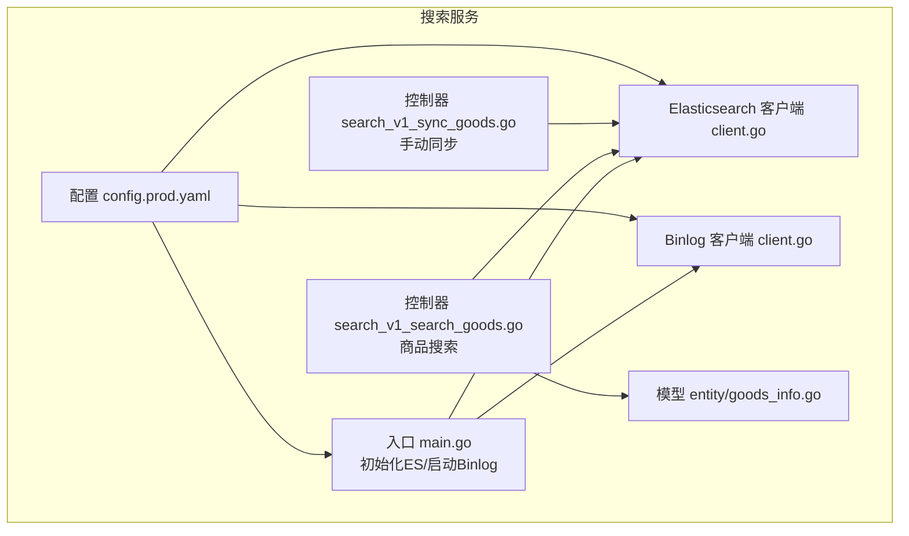
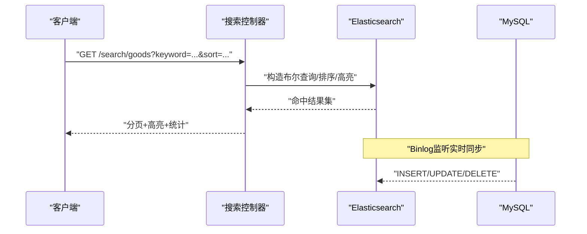
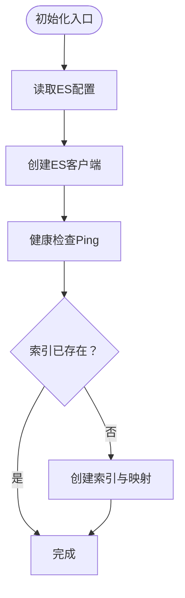
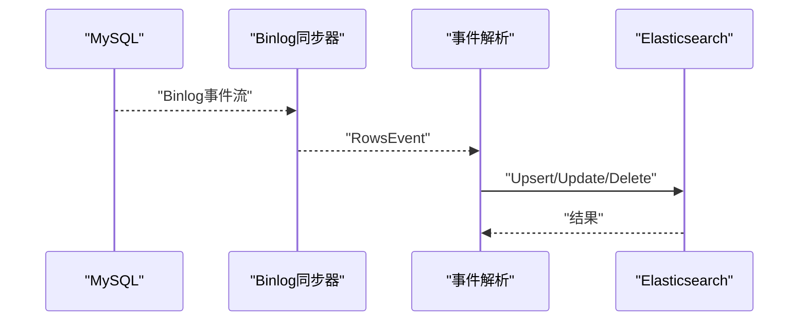
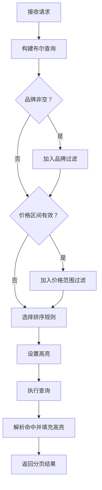
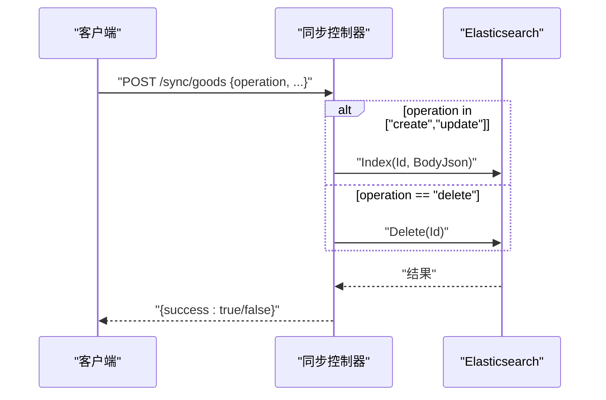
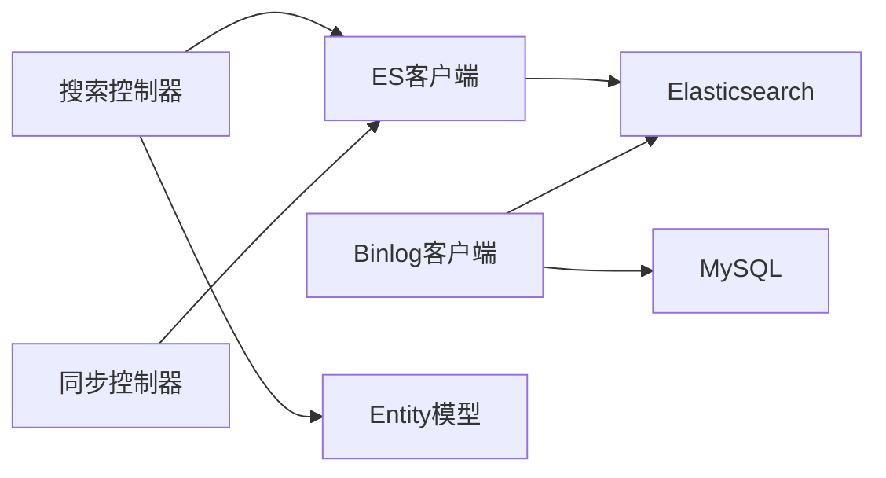

# 搜索服务模块

<cite>
**本文引用的文件**
- [app/search/main.go](file://app/search/main.go)
- [app/search/utility/elasticsearch/client.go](file://app/search/utility/elasticsearch/client.go)
- [app/search/utility/binlog/client.go](file://app/search/utility/binlog/client.go)
- [app/search/api/search/v1/search.go](file://app/search/api/search/v1/search.go)
- [app/search/api/search/v1/sync.go](file://app/search/api/search/v1/sync.go)
- [app/search/internal/controller/search/search_v1_search_goods.go](file://app/search/internal/controller/search/search_v1_search_goods.go)
- [app/search/internal/controller/search/search_v1_sync_goods.go](file://app/search/internal/controller/search/search_v1_sync_goods.go)
- [app/search/manifest/config/config.prod.yaml](file://app/search/manifest/config/config.prod.yaml)
- [app/search/internal/model/do/goods_info.go](file://app/search/internal/model/do/goods_info.go)
- [app/search/internal/model/entity/goods_info.go](file://app/search/internal/model/entity/goods_info.go)
</cite>

## 目录
1. [简介](#简介)
2. [项目结构](#项目结构)
3. [核心组件](#核心组件)
4. [架构总览](#架构总览)
5. [详细组件分析](#详细组件分析)
6. [依赖关系分析](#依赖关系分析)
7. [性能考虑](#性能考虑)
8. [故障排查指南](#故障排查指南)
9. [结论](#结论)
10. [附录](#附录)

## 简介
本文件面向“搜索服务模块”，系统化阐述其架构设计与实现细节，覆盖以下关键能力：
- 商品搜索：关键词匹配、品牌过滤、价格区间过滤、多维度排序与高亮返回
- 全文检索：基于 Elasticsearch 的 IK 中文分词与查询
- 数据同步：MySQL Binlog 实时增量同步至 Elasticsearch
- 搜索索引管理：自动创建商品索引与映射
- 搜索接口规范：统一的请求/响应模型与参数约束
- 性能优化：查询路由、排序策略、高亮与分页

## 项目结构
搜索服务采用 GoFrame 微服务框架，按领域分层组织：
- 入口与初始化：应用入口负责 ES 初始化与 Binlog 后台监听
- 控制器层：对外暴露搜索与同步接口
- 工具层：Elasticsearch 客户端封装与 MySQL Binlog 同步器
- 模型层：DAO/Entity 映射，支撑数据访问与序列化
- 配置层：生产环境配置集中于 YAML

图表来源
- [app/search/main.go](file://app/search/main.go#L1-L25)
- [app/search/utility/elasticsearch/client.go](file://app/search/utility/elasticsearch/client.go#L1-L113)
- [app/search/utility/binlog/client.go](file://app/search/utility/binlog/client.go#L1-L203)
- [app/search/internal/controller/search/search_v1_search_goods.go](file://app/search/internal/controller/search/search_v1_search_goods.go#L1-L135)
- [app/search/internal/controller/search/search_v1_sync_goods.go](file://app/search/internal/controller/search/search_v1_sync_goods.go#L1-L61)
- [app/search/manifest/config/config.prod.yaml](file://app/search/manifest/config/config.prod.yaml#L1-L39)

章节来源
- [app/search/main.go](file://app/search/main.go#L1-L25)
- [app/search/manifest/config/config.prod.yaml](file://app/search/manifest/config/config.prod.yaml#L1-L39)

## 核心组件
- Elasticsearch 客户端与索引管理
  - 初始化客户端、健康检查、自动创建商品索引与映射
  - 提供获取客户端实例的统一入口
- Binlog 增量同步
  - 监听 MySQL goods_info 表变更，实时 Upsert/Delete 到 ES
  - 解析行数据、按事件类型分发处理
- 搜索控制器
  - 组合关键词、品牌、价格区间过滤
  - 支持默认、价格升序、价格降序、销量排序
  - 返回高亮标题与分页统计
- 同步控制器
  - 支持 create/update/delete 三种操作的手动同步
- 请求/响应模型
  - 统一的搜索与同步请求/响应结构体，含参数校验与描述

章节来源
- [app/search/utility/elasticsearch/client.go](file://app/search/utility/elasticsearch/client.go#L1-L113)
- [app/search/utility/binlog/client.go](file://app/search/utility/binlog/client.go#L1-L203)
- [app/search/internal/controller/search/search_v1_search_goods.go](file://app/search/internal/controller/search/search_v1_search_goods.go#L1-L135)
- [app/search/internal/controller/search/search_v1_sync_goods.go](file://app/search/internal/controller/search/search_v1_sync_goods.go#L1-L61)
- [app/search/api/search/v1/search.go](file://app/search/api/search/v1/search.go#L1-L45)
- [app/search/api/search/v1/sync.go](file://app/search/api/search/v1/sync.go#L1-L31)

## 架构总览
搜索服务通过“实时同步 + 查询路由”的方式实现高性能的商品检索：
- 数据源：MySQL goods_info
- 同步链路：MySQL Binlog → 搜索服务 Binlog 客户端 → Elasticsearch
- 查询链路：客户端请求 → 搜索服务控制器 → Elasticsearch 查询 → 结果返回

图表来源
- [app/search/internal/controller/search/search_v1_search_goods.go](file://app/search/internal/controller/search/search_v1_search_goods.go#L17-L135)
- [app/search/utility/binlog/client.go](file://app/search/utility/binlog/client.go#L14-L86)
- [app/search/utility/elasticsearch/client.go](file://app/search/utility/elasticsearch/client.go#L12-L45)

## 详细组件分析

### Elasticsearch 客户端与索引管理
- 初始化流程
  - 读取配置地址、嗅探与健康检查开关
  - 创建客户端并进行 Ping 健康检查
  - 自动创建商品索引与映射（IK 分词）
- 索引映射要点
  - 字段类型：文本、长整型、关键字、日期文本等
  - 文本字段使用 IK 分词器，支持中文全文检索
  - 关键字字段用于精确匹配与聚合
- 客户端获取
  - 提供全局 GetClient 方法，供各模块复用

图表来源
- [app/search/utility/elasticsearch/client.go](file://app/search/utility/elasticsearch/client.go#L12-L45)
- [app/search/utility/elasticsearch/client.go](file://app/search/utility/elasticsearch/client.go#L52-L113)

章节来源
- [app/search/utility/elasticsearch/client.go](file://app/search/utility/elasticsearch/client.go#L1-L113)

### Binlog 增量同步
- 启动监听
  - 从配置读取 MySQL 连接信息
  - 创建 Binlog 同步器并开始从当前位置拉取事件
- 事件处理
  - 仅处理 goods 库 goods_info 表
  - INSERT/UPDATE/DELETE 三类事件分别调用插入/更新/删除
- 数据落盘
  - Upsert：将行数据解析为字段映射后写入 ES
  - Delete：按主键删除 ES 文档

图表来源
- [app/search/utility/binlog/client.go](file://app/search/utility/binlog/client.go#L14-L86)
- [app/search/utility/binlog/client.go](file://app/search/utility/binlog/client.go#L135-L174)
- [app/search/utility/binlog/client.go](file://app/search/utility/binlog/client.go#L176-L202)

章节来源
- [app/search/utility/binlog/client.go](file://app/search/utility/binlog/client.go#L1-L203)

### 商品搜索控制器
- 请求参数
  - 关键词、品牌、价格区间、排序方式、分页参数
- 查询构建
  - 布尔查询组合：must（关键词）、filter（品牌/价格）
  - 排序策略：价格升/降序、销量降序、默认按相关度
  - 高亮：对名称字段进行高亮标记
- 结果处理
  - 统计总数、分页截断
  - 解析 ES 命中源，填充高亮字段

图表来源
- [app/search/internal/controller/search/search_v1_search_goods.go](file://app/search/internal/controller/search/search_v1_search_goods.go#L17-L135)

章节来源
- [app/search/internal/controller/search/search_v1_search_goods.go](file://app/search/internal/controller/search/search_v1_search_goods.go#L1-L135)
- [app/search/api/search/v1/search.go](file://app/search/api/search/v1/search.go#L1-L45)

### 手动同步控制器
- 支持的操作
  - create：创建/更新文档
  - delete：删除文档
- 参数映射
  - 将请求体映射为 ES 文档字段
  - 时间字段使用当前时间格式化

图表来源
- [app/search/internal/controller/search/search_v1_sync_goods.go](file://app/search/internal/controller/search/search_v1_sync_goods.go#L16-L61)
- [app/search/api/search/v1/sync.go](file://app/search/api/search/v1/sync.go#L1-L31)

章节来源
- [app/search/internal/controller/search/search_v1_sync_goods.go](file://app/search/internal/controller/search/search_v1_sync_goods.go#L1-L61)
- [app/search/api/search/v1/sync.go](file://app/search/api/search/v1/sync.go#L1-L31)

### 数据模型
- DO 模型（DAO 层）
  - 用于 ORM 条件拼装与查询参数占位
- Entity 模型（序列化层）
  - 用于对外输出与 JSON 序列化，字段类型明确

章节来源
- [app/search/internal/model/do/goods_info.go](file://app/search/internal/model/do/goods_info.go#L1-L33)
- [app/search/internal/model/entity/goods_info.go](file://app/search/internal/model/entity/goods_info.go#L1-L31)

## 依赖关系分析
- 组件耦合
  - 控制器依赖 Elasticsearch 客户端与配置
  - Binlog 客户端依赖配置与 ES 客户端
  - 搜索控制器依赖实体模型进行结果组装
- 外部依赖
  - Elasticsearch：查询与索引管理
  - MySQL：Binlog 数据源
  - GoFrame：框架基础设施（日志、配置、错误码）

图表来源
- [app/search/internal/controller/search/search_v1_search_goods.go](file://app/search/internal/controller/search/search_v1_search_goods.go#L1-L135)
- [app/search/internal/controller/search/search_v1_sync_goods.go](file://app/search/internal/controller/search/search_v1_sync_goods.go#L1-L61)
- [app/search/utility/elasticsearch/client.go](file://app/search/utility/elasticsearch/client.go#L1-L113)
- [app/search/utility/binlog/client.go](file://app/search/utility/binlog/client.go#L1-L203)

章节来源
- [app/search/utility/elasticsearch/client.go](file://app/search/utility/elasticsearch/client.go#L1-L113)
- [app/search/utility/binlog/client.go](file://app/search/utility/binlog/client.go#L1-L203)

## 性能考虑
- 查询性能
  - 使用布尔查询组合过滤，减少不必要的扫描
  - 对品牌与价格使用 filter 子句，避免影响评分
  - 合理设置分页大小上限，避免超大页码导致内存压力
- 索引与映射
  - 文本字段采用 IK 分词器，兼顾召回与性能
  - 关键字字段用于精确匹配与聚合，降低查询复杂度
- 同步性能
  - Binlog 增量同步，避免全量扫描
  - 批量写入时注意 ES 的刷新策略与批量大小
- 缓存与降级
  - 对热点关键词可结合本地缓存与预计算
  - ES 不可用时返回兜底提示或空结果

## 故障排查指南
- ES 连接失败
  - 检查地址、嗅探与健康检查配置
  - 查看初始化日志与错误堆栈
- 索引不存在或映射异常
  - 确认索引名称与映射是否正确创建
  - 检查 IK 分词插件是否安装
- Binlog 同步中断
  - 核对 MySQL 连接信息与 Binlog 位点
  - 观察事件处理日志，定位具体失败步骤
- 查询无结果或结果异常
  - 打印 ES 查询源，核对布尔查询与排序
  - 检查软删除过滤与高亮字段

章节来源
- [app/search/utility/elasticsearch/client.go](file://app/search/utility/elasticsearch/client.go#L12-L45)
- [app/search/utility/binlog/client.go](file://app/search/utility/binlog/client.go#L14-L86)
- [app/search/internal/controller/search/search_v1_search_goods.go](file://app/search/internal/controller/search/search_v1_search_goods.go#L95-L100)

## 结论
搜索服务模块以“实时同步 + 全文检索”为核心，通过清晰的分层与稳定的外部依赖，实现了高可用的商品搜索能力。建议后续在以下方面持续优化：
- 引入查询缓存与热点词统计
- 增强 ES 索引生命周期管理与冷热分层
- 完善同步失败重试与幂等保障
- 增加搜索埋点与 A/B 实验支持

## 附录

### API 接口规范

- 商品搜索
  - 方法与路径：GET /search/goods
  - 请求参数
    - keyword：关键词
    - brand：品牌
    - min_price：最低价格（分）
    - max_price：最高价格（分）
    - sort：排序方式（default/price_asc/price_desc/sale）
    - page：页码（>=1）
    - size：每页数量（<=100）
  - 响应字段
    - list：商品列表项
    - page/size/total：分页信息
  - 示例路径
    - [请求模型定义](file://app/search/api/search/v1/search.go#L7-L16)
    - [响应模型定义](file://app/search/api/search/v1/search.go#L18-L23)
    - [控制器实现](file://app/search/internal/controller/search/search_v1_search_goods.go#L17-L135)

- 同步商品数据
  - 方法与路径：POST /sync/goods
  - 请求参数
    - id/name/images/price/...：商品字段
    - operation：create/update/delete
  - 响应字段
    - success：是否成功
  - 示例路径
    - [请求模型定义](file://app/search/api/search/v1/sync.go#L7-L26)
    - [响应模型定义](file://app/search/api/search/v1/sync.go#L28-L30)
    - [控制器实现](file://app/search/internal/controller/search/search_v1_sync_goods.go#L16-L61)

### 配置项说明
- 服务器
  - address/openapiPath/swaggerPath/logger.*：服务监听与日志
- 数据库
  - default.link：MySQL 连接串
- Etcd
  - address：注册中心地址
- Elasticsearch
  - address/sniff/healthcheck/indices.goods：ES 地址、嗅探、健康检查与索引名
- Binlog
  - goods.mysql.host/port/username/password：MySQL 连接信息

章节来源
- [app/search/manifest/config/config.prod.yaml](file://app/search/manifest/config/config.prod.yaml#L1-L39)