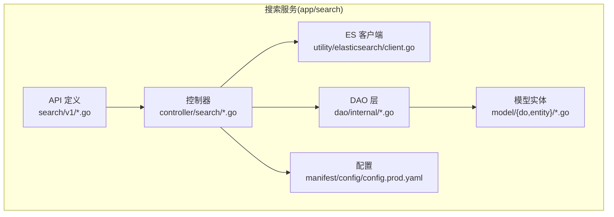
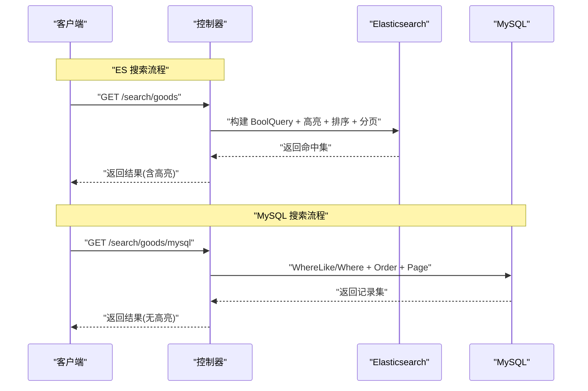
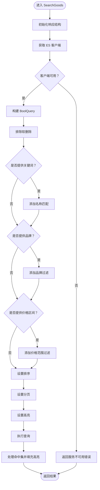
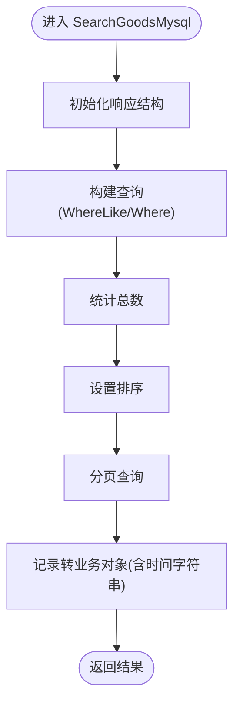
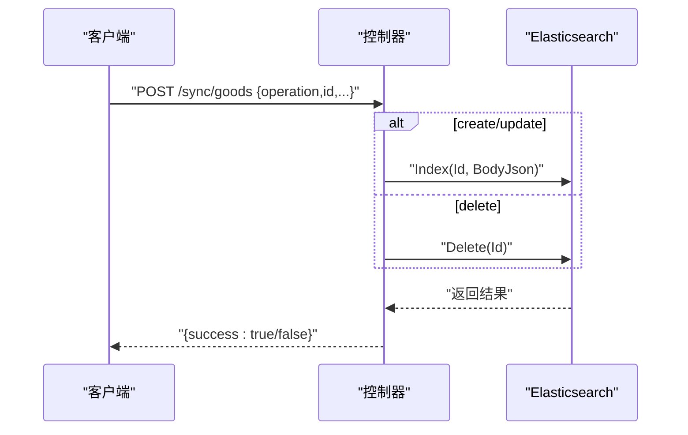
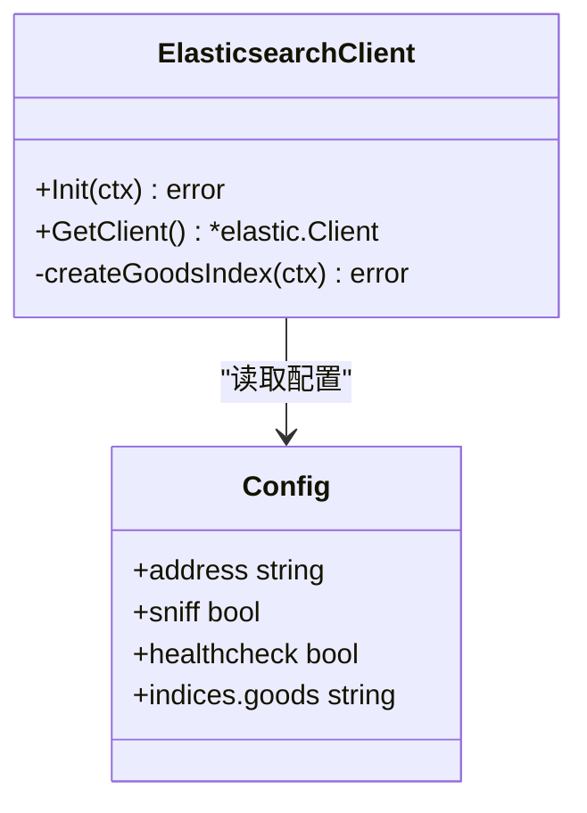
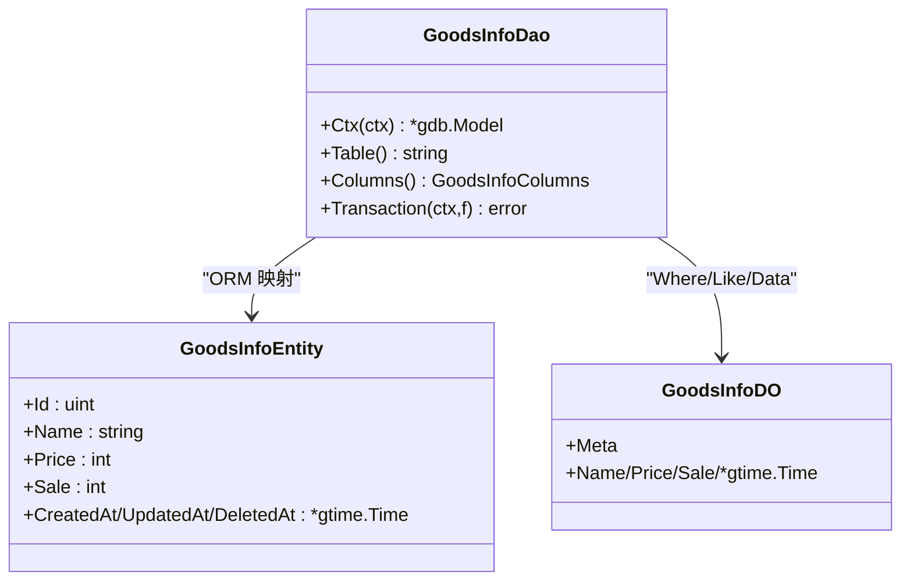
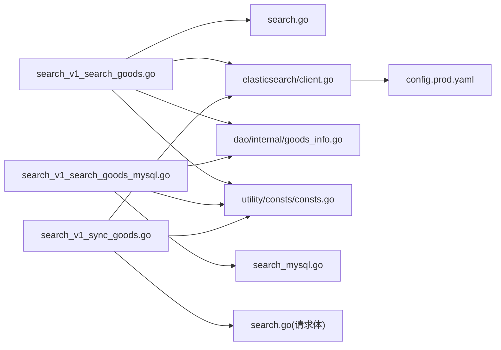

# 搜索核心功能

<cite>
**本文引用的文件**
- [app/search/internal/controller/search/search_v1_search_goods.go](file://app/search/internal/controller/search/search_v1_search_goods.go)
- [app/search/internal/controller/search/search_v1_search_goods_mysql.go](file://app/search/internal/controller/search/search_v1_search_goods_mysql.go)
- [app/search/internal/controller/search/search_v1_sync_goods.go](file://app/search/internal/controller/search/search_v1_sync_goods.go)
- [app/search/internal/controller/search/search_new.go](file://app/search/internal/controller/search/search_new.go)
- [app/search/api/search/v1/search.go](file://app/search/api/search/v1/search.go)
- [app/search/api/search/v1/search_mysql.go](file://app/search/api/search/v1/search_mysql.go)
- [app/search/utility/elasticsearch/client.go](file://app/search/utility/elasticsearch/client.go)
- [app/search/internal/dao/goods_info.go](file://app/search/internal/dao/goods_info.go)
- [app/search/internal/dao/internal/goods_info.go](file://app/search/internal/dao/internal/goods_info.go)
- [app/search/internal/model/entity/goods_info.go](file://app/search/internal/model/entity/goods_info.go)
- [app/search/internal/model/do/goods_info.go](file://app/search/internal/model/do/goods_info.go)
- [app/search/manifest/config/config.prod.yaml](file://app/search/manifest/config/config.prod.yaml)
- [utility/consts/consts.go](file://utility/consts/consts.go)
</cite>

## 目录
1. [简介](#简介)
2. [项目结构](#项目结构)
3. [核心组件](#核心组件)
4. [架构总览](#架构总览)
5. [详细组件分析](#详细组件分析)
6. [依赖关系分析](#依赖关系分析)
7. [性能考量](#性能考量)
8. [故障排查指南](#故障排查指南)
9. [结论](#结论)
10. [附录](#附录)

## 简介
本文件聚焦于“搜索核心功能”，系统化阐述商品搜索接口的实现原理与工程细节，覆盖以下主题：
- 搜索参数解析与查询条件构建
- 搜索结果过滤、排序、分页与高亮
- MySQL 搜索与 Elasticsearch 搜索两种模式的切换机制与性能对比
- 搜索接口的完整 API 规范（请求参数、响应格式、错误处理）
- 搜索性能优化策略与常见问题解决方案

## 项目结构
搜索服务位于独立模块 app/search 中，采用“控制器-接口定义-DAO-模型-工具”的分层组织方式，并通过配置文件集中管理 ES 地址、索引名等运行期参数。

图表来源
- [app/search/internal/controller/search/search_v1_search_goods.go](file://app/search/internal/controller/search/search_v1_search_goods.go#L1-L135)
- [app/search/internal/controller/search/search_v1_search_goods_mysql.go](file://app/search/internal/controller/search/search_v1_search_goods_mysql.go#L1-L107)
- [app/search/internal/controller/search/search_v1_sync_goods.go](file://app/search/internal/controller/search/search_v1_sync_goods.go#L1-L61)
- [app/search/api/search/v1/search.go](file://app/search/api/search/v1/search.go#L1-L45)
- [app/search/api/search/v1/search_mysql.go](file://app/search/api/search/v1/search_mysql.go#L1-L24)
- [app/search/utility/elasticsearch/client.go](file://app/search/utility/elasticsearch/client.go#L1-L113)
- [app/search/manifest/config/config.prod.yaml](file://app/search/manifest/config/config.prod.yaml#L24-L30)

章节来源
- [app/search/internal/controller/search/search_v1_search_goods.go](file://app/search/internal/controller/search/search_v1_search_goods.go#L1-L135)
- [app/search/internal/controller/search/search_v1_search_goods_mysql.go](file://app/search/internal/controller/search/search_v1_search_goods_mysql.go#L1-L107)
- [app/search/internal/controller/search/search_v1_sync_goods.go](file://app/search/internal/controller/search/search_v1_sync_goods.go#L1-L61)
- [app/search/api/search/v1/search.go](file://app/search/api/search/v1/search.go#L1-L45)
- [app/search/api/search/v1/search_mysql.go](file://app/search/api/search/v1/search_mysql.go#L1-L24)
- [app/search/utility/elasticsearch/client.go](file://app/search/utility/elasticsearch/client.go#L1-L113)
- [app/search/manifest/config/config.prod.yaml](file://app/search/manifest/config/config.prod.yaml#L24-L30)

## 核心组件
- 控制器层：提供商品搜索（ES/Mysql）、商品同步至 ES 的接口实现
- API 定义层：定义请求/响应结构体与参数约束
- DAO 层：封装数据库访问，提供查询、分页、排序能力
- 模型层：实体与 DO 结构，支撑序列化与转换
- ES 客户端：负责 ES 连接、索引创建与查询构建
- 配置层：集中管理 ES 地址、索引名、健康检查等参数

章节来源
- [app/search/internal/controller/search/search_v1_search_goods.go](file://app/search/internal/controller/search/search_v1_search_goods.go#L1-L135)
- [app/search/internal/controller/search/search_v1_search_goods_mysql.go](file://app/search/internal/controller/search/search_v1_search_goods_mysql.go#L1-L107)
- [app/search/internal/controller/search/search_v1_sync_goods.go](file://app/search/internal/controller/search/search_v1_sync_goods.go#L1-L61)
- [app/search/api/search/v1/search.go](file://app/search/api/search/v1/search.go#L1-L45)
- [app/search/api/search/v1/search_mysql.go](file://app/search/api/search/v1/search_mysql.go#L1-L24)
- [app/search/utility/elasticsearch/client.go](file://app/search/utility/elasticsearch/client.go#L1-L113)
- [app/search/internal/dao/internal/goods_info.go](file://app/search/internal/dao/internal/goods_info.go#L1-L112)
- [app/search/internal/model/entity/goods_info.go](file://app/search/internal/model/entity/goods_info.go#L1-L31)
- [app/search/internal/model/do/goods_info.go](file://app/search/internal/model/do/goods_info.go#L1-L33)

## 架构总览
搜索服务通过控制器暴露两个主要接口：
- 商品搜索（Elasticsearch）：支持关键词匹配、品牌过滤、价格区间、排序与高亮
- 商品搜索（MySQL）：支持关键词模糊匹配、品牌过滤、价格区间、排序与分页
- 商品同步（ES）：支持创建/更新/删除 ES 文档

图表来源
- [app/search/internal/controller/search/search_v1_search_goods.go](file://app/search/internal/controller/search/search_v1_search_goods.go#L17-L134)
- [app/search/internal/controller/search/search_v1_search_goods_mysql.go](file://app/search/internal/controller/search/search_v1_search_goods_mysql.go#L19-L99)

## 详细组件分析

### 商品搜索（Elasticsearch）
- 参数解析与校验：由 API 层定义，支持关键词、品牌、价格区间、排序方式、分页参数
- 查询条件构建：
  - 必须条件：排除软删除标记
  - 关键词：对名称进行全文匹配
  - 过滤：品牌精确匹配；价格区间范围查询
- 排序策略：支持价格升序/降序、销量降序；默认按相关度排序
- 分页机制：基于 From/Size 实现
- 高亮显示：对名称字段进行高亮标记
- 结果处理：遍历命中集，反序列化为业务对象，提取高亮片段或回退原名称

图表来源
- [app/search/internal/controller/search/search_v1_search_goods.go](file://app/search/internal/controller/search/search_v1_search_goods.go#L17-L134)

章节来源
- [app/search/internal/controller/search/search_v1_search_goods.go](file://app/search/internal/controller/search/search_v1_search_goods.go#L17-L134)
- [app/search/api/search/v1/search.go](file://app/search/api/search/v1/search.go#L7-L16)
- [app/search/utility/elasticsearch/client.go](file://app/search/utility/elasticsearch/client.go#L47-L50)

### 商品搜索（MySQL）
- 参数解析与校验：同上
- 查询条件构建：
  - 必须条件：软删除为空
  - 关键词：名称模糊匹配
  - 过滤：品牌精确匹配；价格区间边界条件
- 排序策略：支持价格升序/降序、销量降序；默认按 sort 降序再按创建时间降序
- 分页机制：基于 Page 方法实现
- 结果处理：记录转实体，再转为业务对象，时间字段统一转为字符串，高亮字段回退为原名称

图表来源
- [app/search/internal/controller/search/search_v1_search_goods_mysql.go](file://app/search/internal/controller/search/search_v1_search_goods_mysql.go#L19-L99)

章节来源
- [app/search/internal/controller/search/search_v1_search_goods_mysql.go](file://app/search/internal/controller/search/search_v1_search_goods_mysql.go#L19-L99)
- [app/search/api/search/v1/search_mysql.go](file://app/search/api/search/v1/search_mysql.go#L7-L16)
- [app/search/internal/dao/internal/goods_info.go](file://app/search/internal/dao/internal/goods_info.go#L94-L101)
- [app/search/internal/model/entity/goods_info.go](file://app/search/internal/model/entity/goods_info.go#L1-L31)
- [app/search/internal/model/do/goods_info.go](file://app/search/internal/model/do/goods_info.go#L1-L33)

### 商品同步（ES）
- 支持操作：创建、更新、删除
- 文档字段：包含商品关键信息与时间戳
- 错误处理：同步失败时返回成功标志为否，避免中断调用方流程

图表来源
- [app/search/internal/controller/search/search_v1_sync_goods.go](file://app/search/internal/controller/search/search_v1_sync_goods.go#L16-L60)

章节来源
- [app/search/internal/controller/search/search_v1_sync_goods.go](file://app/search/internal/controller/search/search_v1_sync_goods.go#L16-L60)

### ES 客户端与索引管理
- 客户端初始化：读取配置中的 ES 地址、嗅探与健康检查开关
- 连接测试：Ping 成功后自动创建商品索引
- 索引映射：名称使用中文分词器，品牌等字段支持精确匹配与文本检索

图表来源
- [app/search/utility/elasticsearch/client.go](file://app/search/utility/elasticsearch/client.go#L12-L44)
- [app/search/manifest/config/config.prod.yaml](file://app/search/manifest/config/config.prod.yaml#L24-L30)

章节来源
- [app/search/utility/elasticsearch/client.go](file://app/search/utility/elasticsearch/client.go#L12-L113)
- [app/search/manifest/config/config.prod.yaml](file://app/search/manifest/config/config.prod.yaml#L24-L30)

### DAO 与模型
- DAO：封装 goods_info 表的查询、事务、上下文等通用能力
- 实体与 DO：定义 ORM 映射与字段含义，支持结构体转换与序列化

图表来源
- [app/search/internal/dao/internal/goods_info.go](file://app/search/internal/dao/internal/goods_info.go#L14-L112)
- [app/search/internal/model/entity/goods_info.go](file://app/search/internal/model/entity/goods_info.go#L11-L31)
- [app/search/internal/model/do/goods_info.go](file://app/search/internal/model/do/goods_info.go#L12-L33)

章节来源
- [app/search/internal/dao/goods_info.go](file://app/search/internal/dao/goods_info.go#L1-L23)
- [app/search/internal/dao/internal/goods_info.go](file://app/search/internal/dao/internal/goods_info.go#L1-L112)
- [app/search/internal/model/entity/goods_info.go](file://app/search/internal/model/entity/goods_info.go#L1-L31)
- [app/search/internal/model/do/goods_info.go](file://app/search/internal/model/do/goods_info.go#L1-L33)

## 依赖关系分析
- 控制器依赖 API 定义、DAO、ES 客户端与常量
- DAO 依赖底层数据库抽象层
- ES 客户端依赖配置中心
- 错误码与错误信息通过常量统一管理

图表来源
- [app/search/internal/controller/search/search_v1_search_goods.go](file://app/search/internal/controller/search/search_v1_search_goods.go#L3-L15)
- [app/search/internal/controller/search/search_v1_search_goods_mysql.go](file://app/search/internal/controller/search/search_v1_search_goods_mysql.go#L3-L17)
- [app/search/internal/controller/search/search_v1_sync_goods.go](file://app/search/internal/controller/search/search_v1_sync_goods.go#L3-L14)
- [app/search/utility/elasticsearch/client.go](file://app/search/utility/elasticsearch/client.go#L14-L23)
- [app/search/manifest/config/config.prod.yaml](file://app/search/manifest/config/config.prod.yaml#L24-L30)
- [utility/consts/consts.go](file://utility/consts/consts.go#L20-L22)

章节来源
- [app/search/internal/controller/search/search_v1_search_goods.go](file://app/search/internal/controller/search/search_v1_search_goods.go#L3-L15)
- [app/search/internal/controller/search/search_v1_search_goods_mysql.go](file://app/search/internal/controller/search/search_v1_search_goods_mysql.go#L3-L17)
- [app/search/internal/controller/search/search_v1_sync_goods.go](file://app/search/internal/controller/search/search_v1_sync_goods.go#L3-L14)
- [app/search/utility/elasticsearch/client.go](file://app/search/utility/elasticsearch/client.go#L14-L23)
- [app/search/manifest/config/config.prod.yaml](file://app/search/manifest/config/config.prod.yaml#L24-L30)
- [utility/consts/consts.go](file://utility/consts/consts.go#L20-L22)

## 性能考量
- ES 搜索优势
  - 全文检索与分词：名称字段使用中文分词器，提升关键词召回
  - 高亮：直接在命中中返回高亮片段，减少前端二次处理
  - 排序灵活：支持价格、销量、相关度排序，满足多样化场景
  - 缺点：写入延迟、索引维护成本、内存占用
- MySQL 搜索优势
  - 实时性强：直接读取数据库，无索引同步延迟
  - 成本低：无需额外 ES 集群资源
  - 缺点：全文检索能力弱，高亮需自行实现，复杂过滤与排序开销大
- 切换机制
  - ES 模式：通过 API /search/goods 调用
  - MySQL 模式：通过 API /search/goods/mysql 调用
  - 同步机制：通过 /sync/goods 将数据库变更写入 ES，保证数据一致性
- 优化建议
  - 对高频关键词建立专用字段与映射
  - 合理设置分页大小，避免深度分页
  - 使用查询缓存与热点数据驻留
  - 对高并发场景启用 ES 索引只读快照与批量写入
  - 对 MySQL 场景建立复合索引以加速过滤与排序

[本节为通用性能指导，不直接分析具体文件]

## 故障排查指南
- ES 客户端未初始化
  - 现象：返回服务不可用错误
  - 排查：检查 ES 地址、健康检查配置与网络连通性
- ES 索引不存在或映射异常
  - 现象：首次启动创建索引失败
  - 排查：确认索引名、映射 JSON、权限与磁盘空间
- 查询报错
  - 现象：返回数据库或 ES 查询错误
  - 排查：查看日志中的查询源码与错误堆栈，定位参数与字段映射
- 高亮缺失
  - 现象：高亮字段为空
  - 排查：确认名称字段的分词器配置与查询字段一致
- 分页异常
  - 现象：总数与条目不一致
  - 排查：确认总数统计与分页起始位置计算一致

章节来源
- [app/search/internal/controller/search/search_v1_search_goods.go](file://app/search/internal/controller/search/search_v1_search_goods.go#L32-L37)
- [app/search/internal/controller/search/search_v1_search_goods.go](file://app/search/internal/controller/search/search_v1_search_goods.go#L102-L106)
- [app/search/utility/elasticsearch/client.go](file://app/search/utility/elasticsearch/client.go#L32-L44)
- [app/search/utility/elasticsearch/client.go](file://app/search/utility/elasticsearch/client.go#L52-L112)
- [utility/consts/consts.go](file://utility/consts/consts.go#L20-L22)

## 结论
该搜索服务提供了 ES 与 MySQL 双引擎搜索能力，结合索引同步与高亮特性，满足高性能与高实时性的双重需求。通过清晰的分层设计与统一的错误管理，系统具备良好的可维护性与扩展性。建议在生产环境中根据流量与数据规模选择合适的引擎与优化策略，并持续监控索引健康与查询延迟。

[本节为总结性内容，不直接分析具体文件]

## 附录

### API 规范

- 商品搜索（Elasticsearch）
  - 方法与路径：GET /search/goods
  - 请求参数
    - keyword：搜索关键词
    - brand：品牌名称
    - min_price：最低价格（分）
    - max_price：最高价格（分）
    - sort：排序方式，可选值：default、price_asc、price_desc、sale
    - page：页码（>=1）
    - size：每页数量（<=100）
  - 响应字段
    - list：商品列表，元素包含 id、name、pic_url、images、price、level1/2/3_category_id、brand、stock、sale、tags、sort、detail_info、created_at、updated_at、deleted_at、highlight
    - page：当前页码
    - size：每页数量
    - total：总数
  - 错误处理
    - ES 客户端未初始化：返回服务不可用
    - 查询异常：返回内部错误

- 商品搜索（MySQL）
  - 方法与路径：GET /search/goods/mysql
  - 请求参数：同上
  - 响应字段：同上（高亮字段回退为原名称）
  - 错误处理
    - 统计或查询异常：返回数据库操作错误

- 商品同步（ES）
  - 方法与路径：POST /sync/goods
  - 请求参数
    - operation：操作类型，可选值：create、update、delete
    - id：商品 ID
    - 其他字段：名称、图片、价格、分类、品牌、库存、销量、标签、详情等
  - 响应字段
    - success：布尔值，表示同步是否成功

章节来源
- [app/search/api/search/v1/search.go](file://app/search/api/search/v1/search.go#L7-L44)
- [app/search/api/search/v1/search_mysql.go](file://app/search/api/search/v1/search_mysql.go#L7-L23)
- [app/search/internal/controller/search/search_v1_search_goods.go](file://app/search/internal/controller/search/search_v1_search_goods.go#L17-L134)
- [app/search/internal/controller/search/search_v1_search_goods_mysql.go](file://app/search/internal/controller/search/search_v1_search_goods_mysql.go#L19-L99)
- [app/search/internal/controller/search/search_v1_sync_goods.go](file://app/search/internal/controller/search/search_v1_sync_goods.go#L16-L60)