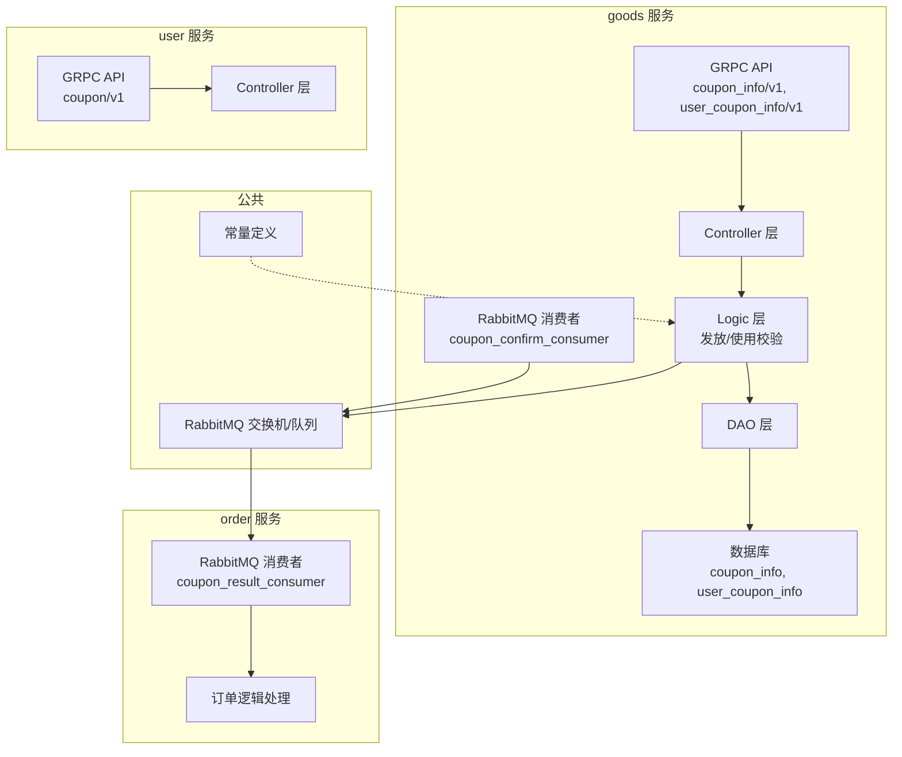
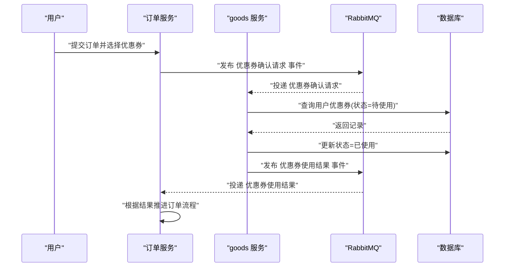
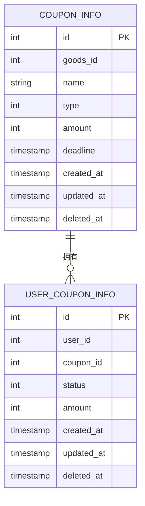
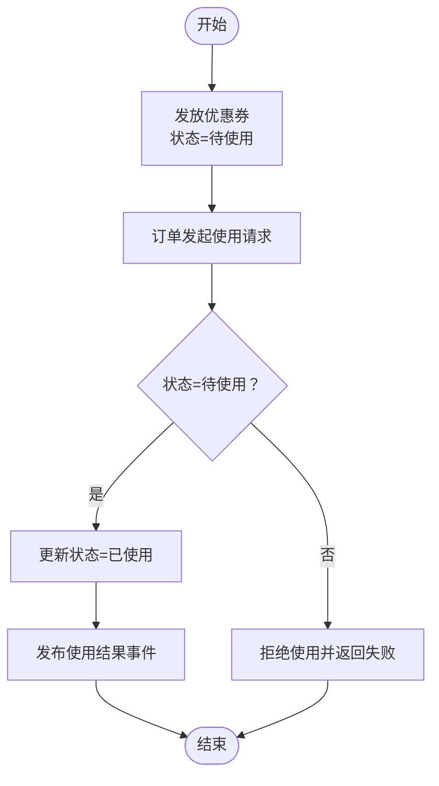
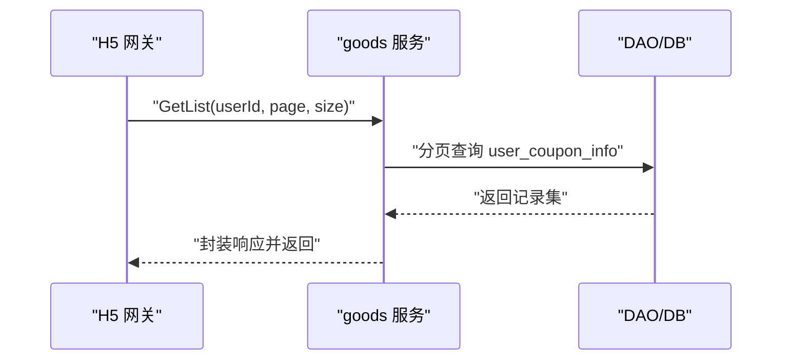
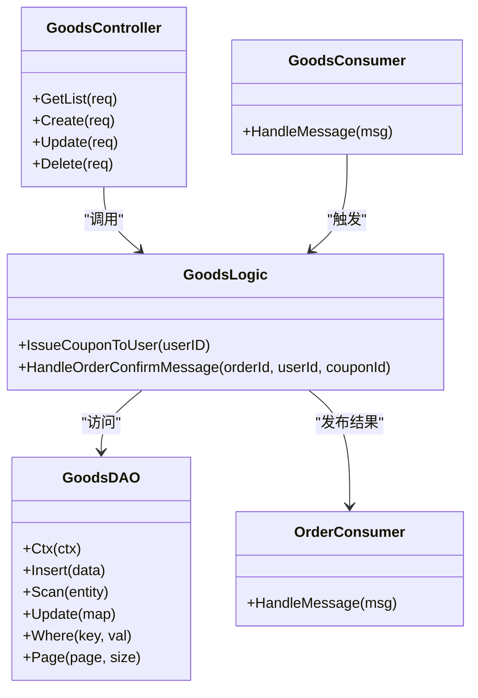
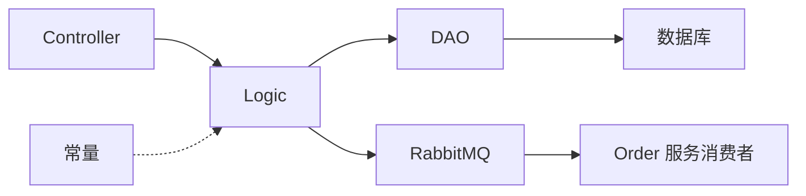

# 优惠券用户集成

<cite>
**本文引用的文件**
- [coupon_info.pb.go](file://app/goods/api/coupon_info/v1/coupon_info.pb.go)
- [user_coupon_info.pb.go](file://app/goods/api/user_coupon_info/v1/user_coupon_info.pb.go)
- [coupon.pb.go](file://app/user/api/coupon/v1/coupon.pb.go)
- [coupon_info.go](file://app/goods/internal/model/entity/coupon_info.go)
- [user_coupon_info.go](file://app/goods/internal/model/entity/user_coupon_info.go)
- [user_coupon_info.go](file://app/goods/internal/dao/user_coupon_info.go)
- [user_coupon_info.go](file://app/goods/internal/logic/user_coupon_info/user_coupon_info.go)
- [user_coupon_info.go](file://app/goods/internal/controller/user_coupon_info/user_coupon_info.go)
- [coupon_confirm_consumer.go](file://app/goods/utility/consumer/coupon_confirm_consumer.go)
- [coupon_result_consumer.go](file://app/order/utility/consumer/coupon_result_consumer.go)
- [consts.go](file://utility/consts/consts.go)
- [coupon.go](file://app/user/internal/controller/coupon/coupon.go)
</cite>

## 目录
1. [简介](#简介)
2. [项目结构](#项目结构)
3. [核心组件](#核心组件)
4. [架构总览](#架构总览)
5. [详细组件分析](#详细组件分析)
6. [依赖关系分析](#依赖关系分析)
7. [性能考虑](#性能考虑)
8. [故障排查指南](#故障排查指南)
9. [结论](#结论)

## 简介
本文件面向“优惠券用户集成”场景，系统性阐述优惠券发放、使用、状态管理与过期处理机制，以及与商品系统、订单系统的集成方式。文档覆盖数据模型设计、跨服务调用机制、事务处理策略、API 接口定义、业务流程图与异常处理方案，并给出与其他服务的协作模式与数据一致性保障思路。

## 项目结构
围绕优惠券用户集成的关键模块分布于以下服务：
- goods 服务：提供优惠券信息与用户优惠券信息的 API、DAO、Logic、Controller，负责发放、使用校验与状态变更。
- order 服务：消费优惠券使用结果，驱动订单侧后续流程。
- user 服务：预留用户维度的优惠券相关 RPC 接口（当前未实现）。
- 通用工具：RabbitMQ 消费者、常量定义等。

图表来源
- [coupon_info.pb.go](file://app/goods/api/coupon_info/v1/coupon_info.pb.go#L554-L558)
- [user_coupon_info.pb.go](file://app/goods/api/user_coupon_info/v1/user_coupon_info.pb.go#L543-L548)
- [coupon.pb.go](file://app/user/api/coupon/v1/coupon.pb.go#L157-L159)
- [user_coupon_info.go](file://app/goods/internal/logic/user_coupon_info/user_coupon_info.go#L14-L35)
- [coupon_confirm_consumer.go](file://app/goods/utility/consumer/coupon_confirm_consumer.go#L11-L32)
- [coupon_result_consumer.go](file://app/order/utility/consumer/coupon_result_consumer.go#L11-L32)

章节来源
- [coupon_info.pb.go](file://app/goods/api/coupon_info/v1/coupon_info.pb.go#L554-L558)
- [user_coupon_info.pb.go](file://app/goods/api/user_coupon_info/v1/user_coupon_info.pb.go#L543-L548)
- [coupon.pb.go](file://app/user/api/coupon/v1/coupon.pb.go#L157-L159)

## 核心组件
- 数据模型
  - 优惠券信息实体：包含关联商品、类型、金额、过期时间等字段。
  - 用户优惠券实体：包含用户标识、优惠券标识、状态（待使用/已使用/已过期）、金额等字段。
- 业务逻辑
  - 发放优惠券：向用户发放指定优惠券，写入用户优惠券表。
  - 使用校验与状态变更：基于订单确认事件，校验用户优惠券状态并更新为已使用。
- 控制器与 API
  - 提供用户优惠券列表、创建、更新、删除等 GRPC 接口。
  - goods 服务提供用户优惠券查询；user 服务预留发放接口（当前未实现）。
- 消息中间件
  - goods 服务消费“优惠券确认请求”，处理后发布“使用结果”事件。
  - order 服务消费“优惠券使用结果”，推进订单流程。

章节来源
- [coupon_info.go](file://app/goods/internal/model/entity/coupon_info.go#L11-L22)
- [user_coupon_info.go](file://app/goods/internal/model/entity/user_coupon_info.go#L11-L21)
- [user_coupon_info.go](file://app/goods/internal/logic/user_coupon_info/user_coupon_info.go#L14-L35)
- [user_coupon_info.go](file://app/goods/internal/controller/user_coupon_info/user_coupon_info.go#L27-L79)
- [coupon_confirm_consumer.go](file://app/goods/utility/consumer/coupon_confirm_consumer.go#L34-L54)
- [coupon_result_consumer.go](file://app/order/utility/consumer/coupon_result_consumer.go#L34-L53)

## 架构总览
优惠券用户集成采用“事件驱动 + 分布式一致性”的设计：
- 发放阶段：goods 服务发放优惠券至用户账户，记录状态为“待使用”。
- 使用阶段：订单服务发起“优惠券确认请求”，goods 服务校验并更新状态为“已使用”，同时发布“使用结果”事件。
- 结果阶段：order 服务接收结果，决定后续流程（如扣款、发货等）。

图表来源
- [coupon_confirm_consumer.go](file://app/goods/utility/consumer/coupon_confirm_consumer.go#L34-L54)
- [coupon_result_consumer.go](file://app/order/utility/consumer/coupon_result_consumer.go#L34-L53)
- [user_coupon_info.go](file://app/goods/internal/logic/user_coupon_info/user_coupon_info.go#L41-L75)

## 详细组件分析

### 数据模型设计
- 优惠券信息表（coupon_info）
  - 字段要点：关联商品（0 表示全场通用）、类型（新人/活动/其他）、金额（分）、过期时间。
  - 设计意图：支持按商品维度与全局维度的优惠券策略，统一以“分”存储金额，避免浮点误差。
- 用户优惠券表（user_coupon_info）
  - 字段要点：用户标识、优惠券标识、状态（待使用/已使用/已过期）、金额（分）、时间戳。
  - 设计意图：以用户为中心记录优惠券生命周期，便于查询与状态管理。

图表来源
- [coupon_info.go](file://app/goods/internal/model/entity/coupon_info.go#L11-L22)
- [user_coupon_info.go](file://app/goods/internal/model/entity/user_coupon_info.go#L11-L21)

章节来源
- [coupon_info.go](file://app/goods/internal/model/entity/coupon_info.go#L11-L22)
- [user_coupon_info.go](file://app/goods/internal/model/entity/user_coupon_info.go#L11-L21)

### 发放机制与使用规则控制
- 发放流程
  - goods 服务提供发放逻辑，写入用户优惠券表，状态初始化为“待使用”，金额取自优惠券模板。
  - 当前实现中，新人券的优惠券模板 ID 固定为 1，金额固定为 9999 分。
- 使用规则
  - 使用前校验：仅当用户优惠券状态为“待使用”时允许使用。
  - 使用后变更：成功使用后状态更新为“已使用”，并发布使用结果事件。
- 过期处理
  - 当前代码未见显式的“过期状态更新”逻辑。建议在定时任务中扫描过期记录并更新状态为“已过期”。

图表来源
- [user_coupon_info.go](file://app/goods/internal/logic/user_coupon_info/user_coupon_info.go#L14-L35)
- [user_coupon_info.go](file://app/goods/internal/logic/user_coupon_info/user_coupon_info.go#L41-L75)

章节来源
- [user_coupon_info.go](file://app/goods/internal/logic/user_coupon_info/user_coupon_info.go#L14-L35)
- [user_coupon_info.go](file://app/goods/internal/logic/user_coupon_info/user_coupon_info.go#L41-L75)

### 用户领取优惠券流程
- goods 服务提供用户优惠券列表查询接口，支持分页与用户过滤。
- user 服务预留发放接口（CreateUserCoupon），当前返回未实现错误码，实际发放逻辑由 goods 服务承担。
- 前端或 H5 网关层调用 goods 服务的用户优惠券接口完成查询与展示。

图表来源
- [user_coupon_info.pb.go](file://app/goods/api/user_coupon_info/v1/user_coupon_info.pb.go#L543-L548)
- [user_coupon_info.go](file://app/goods/internal/controller/user_coupon_info/user_coupon_info.go#L27-L79)

章节来源
- [user_coupon_info.pb.go](file://app/goods/api/user_coupon_info/v1/user_coupon_info.pb.go#L543-L548)
- [user_coupon_info.go](file://app/goods/internal/controller/user_coupon_info/user_coupon_info.go#L27-L79)
- [coupon.pb.go](file://app/user/api/coupon/v1/coupon.pb.go#L157-L159)
- [coupon.go](file://app/user/internal/controller/coupon/coupon.go#L20-L22)

### 优惠券状态管理与过期处理机制
- 状态流转
  - 待使用 → 已使用（使用成功）
  - 待使用 → 已过期（定时任务扫描过期记录）
- 过期处理建议
  - 定时任务扫描 coupon_info.deadline 与 user_coupon_info.status，对未使用的记录批量更新为“已过期”。
  - 对已过期的优惠券，禁止参与后续使用校验。

章节来源
- [user_coupon_info.go](file://app/goods/internal/model/entity/user_coupon_info.go#L16-L16)
- [coupon_info.go](file://app/goods/internal/model/entity/coupon_info.go#L18-L18)

### 与商品系统的集成方式
- 商品维度绑定：coupon_info.goods_id=0 表示全场通用，>0 表示限定商品。
- 使用限制：goods 服务在使用校验时可结合订单明细判断是否满足商品范围限制（当前实现仅检查状态）。
- 叠加规则：当前未实现多张优惠券叠加逻辑，建议在订单结算时统一计算折扣上限与互斥规则。

章节来源
- [coupon_info.go](file://app/goods/internal/model/entity/coupon_info.go#L14-L14)

### 跨服务调用机制与事务处理策略
- 跨服务调用
  - goods 服务与 order 服务通过 RabbitMQ 事件解耦：请求事件与结果事件分别投递到不同队列。
  - goods 服务内部使用数据库事务保证“查询-更新”原子性。
- 事务策略
  - 使用校验：查询用户优惠券并更新状态应处于同一数据库事务内，确保一致性。
  - 结果通知：无论成功与否，均需发布结果事件，供下游消费。

图表来源
- [user_coupon_info.go](file://app/goods/internal/controller/user_coupon_info/user_coupon_info.go#L19-L25)
- [user_coupon_info.go](file://app/goods/internal/logic/user_coupon_info/user_coupon_info.go#L14-L35)
- [user_coupon_info.go](file://app/goods/internal/dao/user_coupon_info.go#L13-L22)
- [coupon_confirm_consumer.go](file://app/goods/utility/consumer/coupon_confirm_consumer.go#L34-L54)
- [coupon_result_consumer.go](file://app/order/utility/consumer/coupon_result_consumer.go#L34-L53)

章节来源
- [user_coupon_info.go](file://app/goods/internal/controller/user_coupon_info/user_coupon_info.go#L81-L119)
- [user_coupon_info.go](file://app/goods/internal/logic/user_coupon_info/user_coupon_info.go#L41-L75)
- [coupon_confirm_consumer.go](file://app/goods/utility/consumer/coupon_confirm_consumer.go#L34-L54)
- [coupon_result_consumer.go](file://app/order/utility/consumer/coupon_result_consumer.go#L34-L53)

### API 接口文档
- 用户优惠券接口（goods 服务）
  - GetList：分页查询用户优惠券列表
  - Create：创建用户优惠券（直接插入）
  - Update：更新用户优惠券
  - Delete：删除用户优惠券
- 优惠券信息接口（goods 服务）
  - GetList：分页查询优惠券信息列表
  - Create/Update/Delete：管理优惠券模板
- 用户服务接口（user 服务）
  - CreateUserCoupon：预留发放接口（当前未实现）

章节来源
- [user_coupon_info.pb.go](file://app/goods/api/user_coupon_info/v1/user_coupon_info.pb.go#L543-L548)
- [coupon_info.pb.go](file://app/goods/api/coupon_info/v1/coupon_info.pb.go#L554-L558)
- [coupon.pb.go](file://app/user/api/coupon/v1/coupon.pb.go#L157-L159)
- [coupon.go](file://app/user/internal/controller/coupon/coupon.go#L20-L22)

## 依赖关系分析
- 组件耦合
  - Controller 依赖 Logic；Logic 依赖 DAO；DAO 依赖数据库。
  - 消费者依赖 Logic 与 RabbitMQ 工具。
- 外部依赖
  - RabbitMQ：事件通道与队列配置。
  - 常量：统一错误信息前缀与模块名。

图表来源
- [consts.go](file://utility/consts/consts.go#L44-L46)
- [user_coupon_info.go](file://app/goods/internal/logic/user_coupon_info/user_coupon_info.go#L14-L35)
- [coupon_confirm_consumer.go](file://app/goods/utility/consumer/coupon_confirm_consumer.go#L18-L31)

章节来源
- [consts.go](file://utility/consts/consts.go#L3-L46)

## 性能考虑
- 查询优化
  - 为 user_id、coupon_id、status 建立复合索引，提升使用校验与列表查询效率。
- 并发控制
  - 使用校验采用数据库行级锁或唯一约束，避免并发导致的重复使用。
- 消息吞吐
  - 合理设置 PrefetchCount 与队列持久化，保证高并发下的可靠性与性能。

## 故障排查指南
- 常见错误
  - 查询失败：检查 DAO 层错误包装与日志输出。
  - 更新失败：确认数据库连接、事务边界与回滚策略。
  - 消息解析失败：核对事件结构与序列化/反序列化过程。
- 日志与告警
  - 使用统一常量前缀输出错误日志，便于检索与聚合。
  - 对关键路径（使用校验、结果发布）增加监控指标。

章节来源
- [consts.go](file://utility/consts/consts.go#L44-L46)
- [user_coupon_info.go](file://app/goods/internal/logic/user_coupon_info/user_coupon_info.go#L51-L57)
- [coupon_confirm_consumer.go](file://app/goods/utility/consumer/coupon_confirm_consumer.go#L36-L41)

## 结论
本系统通过“事件驱动 + 数据库事务”的方式实现了优惠券的发放与使用闭环，具备良好的扩展性与可维护性。建议后续完善过期处理、多券叠加规则与商品维度校验，并持续优化索引与消息处理性能，以支撑更高的并发与更复杂的业务场景。